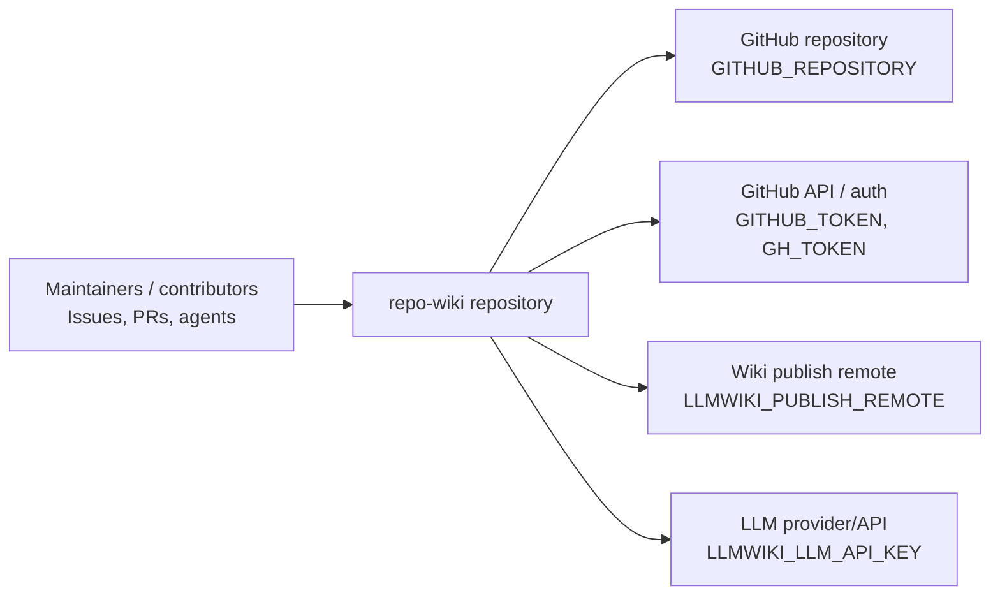
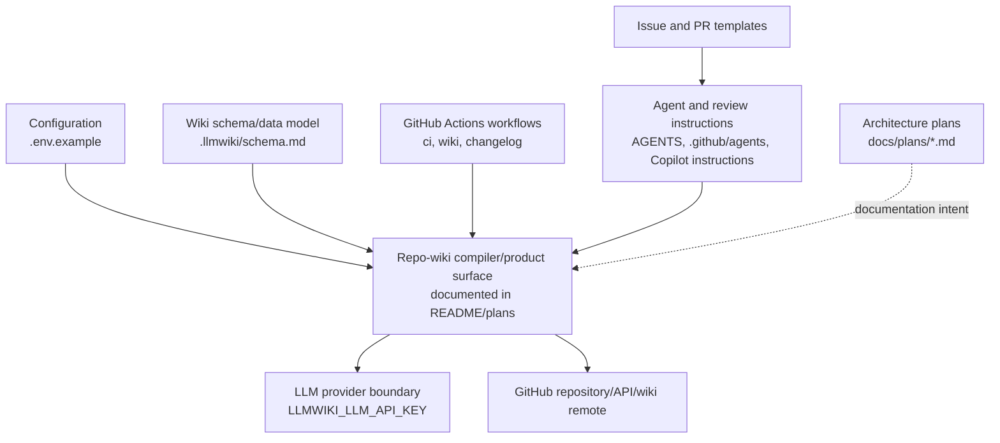
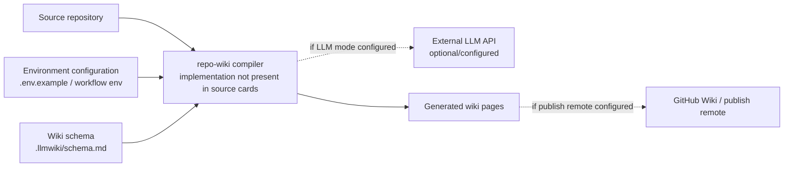
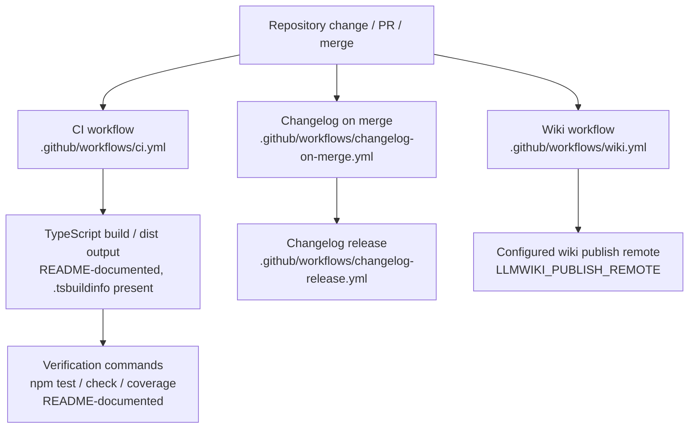

# Architecture

## Executive Architecture Summary

`repo-wiki` is presented by its documentation as a tool for compiling a Git repository into a persistent GitHub Wiki knowledge base, with generated pages, source cards, documentation cards, and schema-guided output behavior. This high-level product direction is supported by documentation cards for `README.md`, `docs/PLAN.md`, and `docs/WHY.md`, but the supplied source cards do not include the package manifest or implementation files, so runtime architecture details must be treated as partially validated rather than fully verified.

From the available evidence, the repository has these architecture-relevant surfaces:

| Area | Evidence | What can be stated conservatively |
|---|---|---|
| Wiki compiler configuration | `.env.example`, `.github/workflows/wiki.yml`, `.llmwiki/schema.md` | The project exposes configuration for repository selection, GitHub access, compiler mode, LLM API access, and wiki publishing behavior. |
| CI and automation | `.github/workflows/ci.yml`, `.github/workflows/wiki.yml`, `.github/workflows/changelog-on-merge.yml`, `.github/workflows/changelog-release.yml` | The repository uses GitHub Actions for CI, wiki-related automation, and changelog/release automation. |
| Generated wiki schema/model | `.llmwiki/schema.md` | The repository maintains a schema document for the wiki knowledge base or generated wiki artifacts. |
| Human/AI contributor workflow | `AGENTS.md`, `.github/agents/*.agent.md`, `.github/copilot-review-instructions.md`, `.pi/AGENTS.md`, `.pi/settings.json` | The repository includes agent instructions and review guidance, indicating that AI-assisted maintenance is an explicit operational concern. |
| Planning modules | Documentation cards for `docs/plans/*.md` | Planned or partially validated architecture areas include CI publishing, GitHub Action usage, LLM compilation, incremental mode, and search indexing. These are documentation-backed and should not be assumed fully implemented without source inspection. |
| Issue and pull request process | `.github/ISSUE_TEMPLATE/*.yml`, `.github/pull_request_template.md` | The repository has structured issue and PR intake processes. |

Key design decisions visible in the evidence are:

- Environment-driven operation for local and CI usage, including `GITHUB_REPOSITORY`, `GITHUB_TOKEN`, `LLMWIKI_COMPILER_MODE`, `LLMWIKI_LLM_API_KEY`, `LLMWIKI_PUBLISH_REMOTE`, and workflow-local `GH_TOKEN` variable names. Values are not present in this page and should not be committed. Evidence: `.env.example`, `.github/workflows/wiki.yml`, `.github/workflows/changelog-on-merge.yml`.
- GitHub Actions are the primary observed automation boundary for validation, wiki generation/publishing, and changelog/release-related background work. Evidence: `.github/workflows/ci.yml`, `.github/workflows/wiki.yml`, `.github/workflows/changelog-on-merge.yml`, `.github/workflows/changelog-release.yml`.
- The project appears to treat generated wiki content as a structured artifact rather than ad hoc Markdown, with schema guidance in `.llmwiki/schema.md`. Evidence: `.llmwiki/schema.md`; documentation intent: `docs/PLAN.md`, `docs/WHY.md`.
- The documentation set describes a dual local/automation usage model, including local CLI/package behavior and GitHub Action publishing plans, but implementation entry points were not included in the supplied source cards. Evidence: documentation cards for `README.md`, `docs/plans/github-action.md`, and `docs/plans/ci-publishing.md`.

## System and Repository Context

The repository boundary, based on the supplied cards, includes source-controlled configuration, CI workflows, contributor/agent instructions, issue templates, and wiki schema documentation. It also refers to external systems through environment variables and GitHub workflow configuration.

Observed external surfaces:

| External surface | Role | Evidence |
|---|---|---|
| GitHub repository | Target/source repository identity is configured by `GITHUB_REPOSITORY`; GitHub Actions are present. | `.env.example`, `.github/workflows/*.yml` |
| GitHub token/API access | GitHub operations require token configuration through `GITHUB_TOKEN` or `GH_TOKEN`. | `.env.example`, `.github/workflows/changelog-on-merge.yml` |
| Wiki publishing remote | Wiki workflow uses `LLMWIKI_PUBLISH_REMOTE`, indicating a publishing destination is configurable. | `.github/workflows/wiki.yml` |
| LLM provider/API | Local or CI compiler operation can be configured with `LLMWIKI_LLM_API_KEY`; plan documentation describes an OpenAI-compatible provider boundary. | `.env.example`; documentation card: `docs/plans/llm-compiler.md` |
| GitHub Issues/PRs | Structured issue templates and PR template define contributor intake surfaces. | `.github/ISSUE_TEMPLATE/config.yml`, `.github/ISSUE_TEMPLATE/epic.yml`, `.github/ISSUE_TEMPLATE/task.yml`, `.github/pull_request_template.md` |
| GitHub Copilot / agent tooling | Agent instructions and Copilot review instructions are present. | `.github/agents/*.agent.md`, `.github/copilot-review-instructions.md`, `AGENTS.md`, `.pi/AGENTS.md`, `.pi/settings.json` |

The following context diagram is limited to repository boundaries and external surfaces directly supported by configuration/workflow/source-card evidence.

Diagram evidence: `.env.example`, `.github/workflows/wiki.yml`, `.github/workflows/changelog-on-merge.yml`, `.github/ISSUE_TEMPLATE/*.yml`, `.github/pull_request_template.md`, `.github/agents/*.agent.md`.

Repository structure visible from the provided cards:

| Path / group | Architectural role | Evidence status |
|---|---|---|
| `.github/workflows/` | CI, wiki automation, changelog/release automation | Source/CI cards: `.github/workflows/ci.yml`, `.github/workflows/wiki.yml`, `.github/workflows/changelog-on-merge.yml`, `.github/workflows/changelog-release.yml` |
| `.github/ISSUE_TEMPLATE/` | Structured issue intake for epics and tasks | Source cards: `.github/ISSUE_TEMPLATE/config.yml`, `.github/ISSUE_TEMPLATE/epic.yml`, `.github/ISSUE_TEMPLATE/task.yml` |
| `.github/agents/` | Role-specific AI/agent operating instructions | Documentation cards in source list: `.github/agents/coordinator.agent.md`, `developer.agent.md`, `docs.agent.md`, `fixer.agent.md`, `quality.agent.md`, `review.agent.md` |
| `.github/skills/` | Reusable skill instructions for changelog and repo-wiki navigation workflows | Documentation cards in source list: `.github/skills/keep-a-changelog/SKILL.md`, `.github/skills/repo-wiki-navigation/SKILL.md` |
| `.llmwiki/schema.md` | Schema/data-model guidance for generated wiki content | Source-list documentation card: `.llmwiki/schema.md` |
| `.env.example` | Local/CI configuration template | Source card: `.env.example` |
| `.pi/` | Additional agent/tooling settings and instructions | Source/docs cards: `.pi/AGENTS.md`, `.pi/settings.json` |
| Root `AGENTS.md` | Repository-level agent/contributor guidance | Documentation card in source list: `AGENTS.md` |
| `.tsbuildinfo` | TypeScript incremental build metadata is present, implying TypeScript build tooling exists or existed in this checkout | Source card: `.tsbuildinfo` |
| `.gitignore` | Ignore policy for generated/local artifacts | Source card: `.gitignore` |

## Major Modules and Responsibilities

### Wiki Compiler and Knowledge Base Schema

The core product described by documentation is a compiler that turns repository evidence into GitHub Wiki pages. The schema/documentation surface for this is `.llmwiki/schema.md`, which is marked as data-model evidence in the source cards. The README documentation card states that local CLI and verification flows operate against compiled output in `dist/`, and that `npm test`, `npm run check`, and `npm run coverage` require a successful TypeScript build; however, package scripts and implementation files were not included in the source cards, so those operational details remain documentation-backed rather than source-verified here.

Evidence:

- `.llmwiki/schema.md`
- `.env.example`
- Documentation cards: `README.md`, `docs/PLAN.md`, `docs/WHY.md`

Responsibilities indicated by evidence and documentation:

- Define or document generated wiki page structure and metadata through `.llmwiki/schema.md`.
- Consume repository identity and compiler mode through environment variables such as `GITHUB_REPOSITORY` and `LLMWIKI_COMPILER_MODE`. Evidence: `.env.example`, `.github/workflows/wiki.yml`.
- Potentially call an LLM provider through `LLMWIKI_LLM_API_KEY`. Evidence: `.env.example`; plan intent in `docs/plans/llm-compiler.md`.

### CI and Wiki Publishing Automation

The repository includes several GitHub Actions workflows. Their exact step bodies are not available in the source-card excerpts, but their names and metadata support the existence of automation for CI, wiki generation/publishing, and changelog/release flows.

Evidence:

- `.github/workflows/ci.yml`
- `.github/workflows/wiki.yml`
- `.github/workflows/changelog-on-merge.yml`
- `.github/workflows/changelog-release.yml`

Responsibilities:

- Run continuous integration checks. Evidence: `.github/workflows/ci.yml`.
- Run wiki-specific automation with compiler and publish configuration. Evidence: `.github/workflows/wiki.yml`, including `LLMWIKI_COMPILER_MODE` and `LLMWIKI_PUBLISH_REMOTE`.
- Run changelog automation on merge using GitHub authentication. Evidence: `.github/workflows/changelog-on-merge.yml`, including `GH_TOKEN`.
- Run changelog release automation. Evidence: `.github/workflows/changelog-release.yml`.

### GitHub Action / Publishing Product Surface

Documentation cards describe planned or partially validated GitHub Action and CI publishing behavior. These plans mention local wiki artifacts and publish-credential policy decisions. Because implementation files for an action were not included in the source cards, this should be treated as plan/documentation evidence rather than confirmed code behavior.

Evidence:

- Source workflow: `.github/workflows/wiki.yml`
- Documentation cards: `docs/plans/github-action.md`, `docs/plans/ci-publishing.md`

Responsibilities described by plan documentation:

- Run repository-to-wiki generation in CI.
- Produce local wiki artifacts.
- Publish to a configured remote when publishing credentials or policy allow it.

### LLM Compiler Boundary

The project has an LLM-related configuration surface through `LLMWIKI_LLM_API_KEY` in `.env.example`. The LLM compiler plan documentation says the first production boundary should be provider-agnostic and compatible with OpenAI-style chat completions. This provider abstraction is not source-verified in the supplied implementation cards, so it is an architectural intent rather than a confirmed implementation detail.

Evidence:

- `.env.example`
- Documentation card: `docs/plans/llm-compiler.md`

Responsibilities indicated:

- Isolate LLM access behind configuration.
- Support local and CI usage without embedding secrets in source.
- Potentially allow OpenAI-compatible hosted providers, per plan documentation.

### Search and Query Surface

The search-index plan documentation describes a local search index over generated wiki pages, source cards, and documentation cards so that `repo-wiki search` and `repo-wiki query` can route questions efficiently without external services. No source implementation cards for search commands or indexing code were supplied, so this is a planned or partially validated module, not a verified runtime subsystem in this page.

Evidence:

- Documentation card: `docs/plans/search-index.md`

Responsibilities described by plan documentation:

- Index generated wiki pages.
- Index source cards and documentation cards.
- Support local query/search commands.

### Incremental Mode

The incremental-mode plan documentation is marked stale in the documentation cards. It references testing strategy and incremental architecture, but because the card is stale and no implementation files were included, incremental behavior should not be treated as current architecture without further source validation.

Evidence:

- Documentation card: `docs/plans/incremental-mode.md` marked `stale`

Responsibilities described historically:

- Avoid full recompilation when possible.
- Reuse previous wiki state or testing strategy artifacts.

### Contributor, Agent, and Review Workflow

The repository contains multiple agent instruction files and GitHub review/process templates. These files shape how humans and AI agents are expected to interact with the codebase, even if they are not runtime application modules.

Evidence:

- `AGENTS.md`
- `.github/agents/coordinator.agent.md`
- `.github/agents/developer.agent.md`
- `.github/agents/docs.agent.md`
- `.github/agents/fixer.agent.md`
- `.github/agents/quality.agent.md`
- `.github/agents/review.agent.md`
- `.github/copilot-review-instructions.md`
- `.github/pull_request_template.md`
- `.github/ISSUE_TEMPLATE/config.yml`
- `.github/ISSUE_TEMPLATE/epic.yml`
- `.github/ISSUE_TEMPLATE/task.yml`
- `.pi/AGENTS.md`
- `.pi/settings.json`

Responsibilities:

- Define role-specific agent behavior for coordination, development, documentation, fixing, quality, and review.
- Provide Copilot review instructions.
- Structure issues into epics and tasks.
- Standardize pull request content and review expectations.
- Provide additional `.pi` agent/tooling settings.

### Changelog and Release Workflow

The repository includes a changelog-on-merge workflow, a changelog-release workflow, and a keep-a-changelog skill file. Together these indicate a maintained changelog/release process.

Evidence:

- `.github/workflows/changelog-on-merge.yml`
- `.github/workflows/changelog-release.yml`
- `.github/skills/keep-a-changelog/SKILL.md`

Responsibilities:

- Update or validate changelog content around merge events.
- Support release-time changelog behavior.
- Provide reusable instructions for maintaining changelog format.

### Module Relationship Diagram

This diagram is derived from repository structure and workflow/configuration evidence, not implementation imports. It should be read as a repository-surface component map, not a confirmed runtime dependency graph.

Diagram evidence: `.env.example`, `.llmwiki/schema.md`, `.github/workflows/*.yml`, `.github/agents/*.agent.md`, `.github/ISSUE_TEMPLATE/*.yml`, `.github/pull_request_template.md`; documentation cards: `README.md`, `docs/plans/*.md`.

## Runtime, Data, and Control-Flow Relationships

Runtime control flow cannot be fully reconstructed from the provided source cards because implementation files, package scripts, command definitions, and workflow step bodies were not supplied. The safe architecture view is therefore based on externally visible configuration and plan documentation.

Observed or documentation-backed flow relationships:

| Flow | Status | Evidence |
|---|---|---|
| Local or CI execution reads repository and compiler configuration from environment variables. | Partially source-supported | `.env.example`, `.github/workflows/wiki.yml` |
| Wiki workflow may publish generated wiki output to a configured remote. | Source-supported at configuration-surface level; exact steps not visible | `.github/workflows/wiki.yml` with `LLMWIKI_PUBLISH_REMOTE` |
| LLM compiler may call an external provider using an API key. | Configuration source-supported; provider abstraction documentation-backed | `.env.example`; documentation card: `docs/plans/llm-compiler.md` |
| Changelog automation authenticates to GitHub with `GH_TOKEN`. | Source-supported at configuration-surface level | `.github/workflows/changelog-on-merge.yml` |
| Search/query functionality may index generated wiki pages, source cards, and documentation cards. | Documentation-backed only | Documentation card: `docs/plans/search-index.md` |
| Incremental compilation may reuse previous state. | Stale documentation-backed only | Documentation card: `docs/plans/incremental-mode.md` |

Conservative data/control-flow sketch based on available evidence:

Limitations: the relationships above are inferred from configuration names, schema presence, and documentation cards. They are not verified from imports or command implementation in the supplied source cards. Evidence: `.env.example`, `.github/workflows/wiki.yml`, `.llmwiki/schema.md`, documentation cards for `README.md`, `docs/PLAN.md`, `docs/plans/llm-compiler.md`, and `docs/plans/ci-publishing.md`.

## Build, Test, Deployment, and Operational Surfaces

The repository has GitHub Actions workflows for CI, wiki automation, and changelog/release automation. The documentation card for `README.md` says local CLI and package verification run against compiled output in `dist/`, and that `npm test`, `npm run check`, and `npm run coverage` require a successful TypeScript build. The presence of `.tsbuildinfo` also suggests TypeScript incremental build metadata exists in the repository. However, package scripts and source implementation were not included in the source cards, so this page cannot verify the exact local build commands from `package.json`.

Operational surfaces:

| Surface | Description | Evidence |
|---|---|---|
| Local environment configuration | `.env.example` lists required/optional environment variable names for repository, GitHub token, compiler mode, and LLM API key. | `.env.example` |
| CI workflow | Repository has a CI workflow. Exact jobs/steps are not visible from the source-card excerpt. | `.github/workflows/ci.yml` |
| Wiki workflow | Repository has a wiki workflow with compiler mode and publish remote configuration. | `.github/workflows/wiki.yml` |
| Changelog-on-merge workflow | Repository has merge-time changelog automation with `GH_TOKEN`. | `.github/workflows/changelog-on-merge.yml` |
| Changelog-release workflow | Repository has release-time changelog automation. | `.github/workflows/changelog-release.yml` |
| TypeScript build metadata | `.tsbuildinfo` is present, indicating TypeScript build tooling metadata. | `.tsbuildinfo` |
| Local package verification | README documentation says `npm test`, `npm run check`, and `npm run coverage` depend on successful TypeScript compilation to `dist/`. | Documentation card: `README.md` |

Build/test/deploy flow diagram, limited to workflow presence and documented package-verification claims:

Diagram evidence: `.github/workflows/ci.yml`, `.github/workflows/wiki.yml`, `.github/workflows/changelog-on-merge.yml`, `.github/workflows/changelog-release.yml`, `.tsbuildinfo`; documentation card: `README.md`. The internal CI job sequence is inferred from documentation and workflow names, not verified from workflow step bodies.

## Cross-Cutting Concerns

### Configuration

Configuration is environment-variable driven at the observed boundary. `.env.example` lists `GITHUB_REPOSITORY`, `GITHUB_TOKEN`, `LLMWIKI_COMPILER_MODE`, and `LLMWIKI_LLM_API_KEY`. The wiki workflow references `LLMWIKI_COMPILER_MODE` and `LLMWIKI_PUBLISH_REMOTE`. The changelog-on-merge workflow references `GH_TOKEN`.

Evidence:

- `.env.example`
- `.github/workflows/wiki.yml`
- `.github/workflows/changelog-on-merge.yml`

No environment variable values are included here.

### Security and Secret Handling

The architecture exposes secret-bearing configuration names for GitHub and LLM provider access, including `GITHUB_TOKEN`, `GH_TOKEN`, and `LLMWIKI_LLM_API_KEY`. These should be supplied through local environment files or GitHub Actions secrets and must not be committed with real values. This conclusion is based on the variable names and their operational roles, not on secret values.

Evidence:

- `.env.example`
- `.github/workflows/changelog-on-merge.yml`

### Data Model and Generated Content Contract

`.llmwiki/schema.md` is marked as data-model documentation in the source cards. This indicates that generated wiki pages or supporting knowledge-base artifacts are expected to follow a documented schema. The exact schema contents were not supplied in the card excerpt, so field-level guarantees are not stated here.

Evidence:

- `.llmwiki/schema.md`

### Documentation Trust Model

The documentation cards for `README.md`, `docs/PLAN.md`, and the `docs/plans/*.md` files are useful for architecture intent, but several are only partially validated and one incremental-mode plan is marked stale. This page therefore distinguishes between:

- Source-supported claims from environment files, workflows, schema files, templates, and agent files.
- Documentation-backed claims from README and plan documents.
- Stale documentation-backed claims from `docs/plans/incremental-mode.md`.

Evidence:

- Documentation cards: `README.md`, `docs/PLAN.md`, `docs/WHY.md`, `docs/plans/ci-publishing.md`, `docs/plans/github-action.md`, `docs/plans/incremental-mode.md`, `docs/plans/llm-compiler.md`, `docs/plans/search-index.md`
- Source cards: `.env.example`, `.github/workflows/*.yml`, `.llmwiki/schema.md`

### AI-Assisted Maintenance

The repository includes a substantial set of AI-agent and Copilot instruction files. These do not prove runtime behavior, but they are architecture-relevant as operational guidance for how the repository is maintained.

Evidence:

- `AGENTS.md`
- `.github/agents/coordinator.agent.md`
- `.github/agents/developer.agent.md`
- `.github/agents/docs.agent.md`
- `.github/agents/fixer.agent.md`
- `.github/agents/quality.agent.md`
- `.github/agents/review.agent.md`
- `.github/copilot-review-instructions.md`
- `.pi/AGENTS.md`
- `.pi/settings.json`

### Contributor Process

The repository uses structured GitHub issue templates and a pull request template, which indicates an intentional contributor workflow around epics, tasks, and PR reviews.

Evidence:

- `.github/ISSUE_TEMPLATE/config.yml`
- `.github/ISSUE_TEMPLATE/epic.yml`
- `.github/ISSUE_TEMPLATE/task.yml`
- `.github/pull_request_template.md`

### Changelog Discipline

The repository has both changelog workflows and a keep-a-changelog skill document. This indicates changelog maintenance is part of the project’s operating model.

Evidence:

- `.github/workflows/changelog-on-merge.yml`
- `.github/workflows/changelog-release.yml`
- `.github/skills/keep-a-changelog/SKILL.md`

## Caveats and Open Questions

1. **Implementation files were not included in the supplied source cards.**  
   The cards do not include `package.json`, TypeScript source files, compiled `dist/` files, command implementations, or tests. As a result, this page cannot verify CLI entry points, package exports, command names, internal imports, or exact runtime control flow. Evidence gap: source card list.

2. **Package scripts are documentation-backed, not source-verified here.**  
   The README documentation card mentions `npm test`, `npm run check`, `npm run coverage`, TypeScript compilation, and `dist/`, but no `package.json` card was supplied. Evidence: documentation card `README.md`; missing implementation evidence.

3. **Workflow step details are not visible in the card excerpts.**  
   The architecture can identify workflows by path and environment variables, but cannot assert exact jobs, triggers, permissions, checkout behavior, artifact behavior, or publishing steps. Evidence: `.github/workflows/ci.yml`, `.github/workflows/wiki.yml`, `.github/workflows/changelog-on-merge.yml`, `.github/workflows/changelog-release.yml`.

4. **LLM provider abstraction is partly planned rather than verified.**  
   `LLMWIKI_LLM_API_KEY` is source-supported by `.env.example`, but provider-agnostic OpenAI-compatible chat-completion behavior is from `docs/plans/llm-compiler.md` and was not validated against implementation files.

5. **Search/query architecture is plan-backed only.**  
   The search index over generated wiki pages, source cards, and documentation cards is described in `docs/plans/search-index.md`, but no indexer or command implementation source card was supplied.

6. **Incremental mode documentation is stale.**  
   `docs/plans/incremental-mode.md` is explicitly marked stale in the documentation cards, so incremental compilation should not be treated as current behavior without code validation.

7. **Diagrams are conservative but still partly structural.**  
   The context diagram is based on environment variables, workflow files, and repository support files. The module and flow diagrams include documentation-backed product surfaces and are not verified import graphs or runtime traces.

8. **Schema details are unknown from the excerpt.**  
   `.llmwiki/schema.md` is identified as data-model evidence, but the excerpt does not expose schema fields or constraints. This page therefore avoids field-level schema claims.

9. **GitHub Action product surface needs source validation.**  
   `docs/plans/github-action.md` describes a GitHub Action architecture involving local wiki artifacts and publish policy, but no action metadata or implementation source card was provided.

10. **Open question: what are the authoritative runtime entry points?**  
    The repository likely has CLI or package entry points based on README documentation, but the authoritative files defining them were not available in the supplied evidence.

11. **Open question: what is the current generated wiki page schema?**  
    `.llmwiki/schema.md` should be inspected directly to document required frontmatter, page kinds, source citation rules, and validation rules.

12. **Open question: which workflows publish versus only build artifacts?**  
    `.github/workflows/wiki.yml` references publishing configuration, but workflow steps must be reviewed to confirm whether it publishes by default, gates publishing by branch/event, or only uploads artifacts.

<!-- HUMAN_NOTES_START -->
<!-- HUMAN_NOTES_END -->
