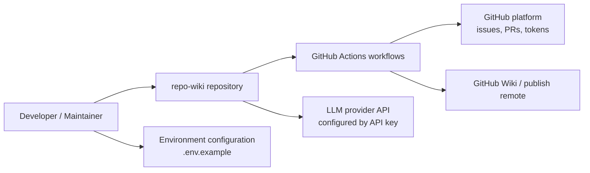
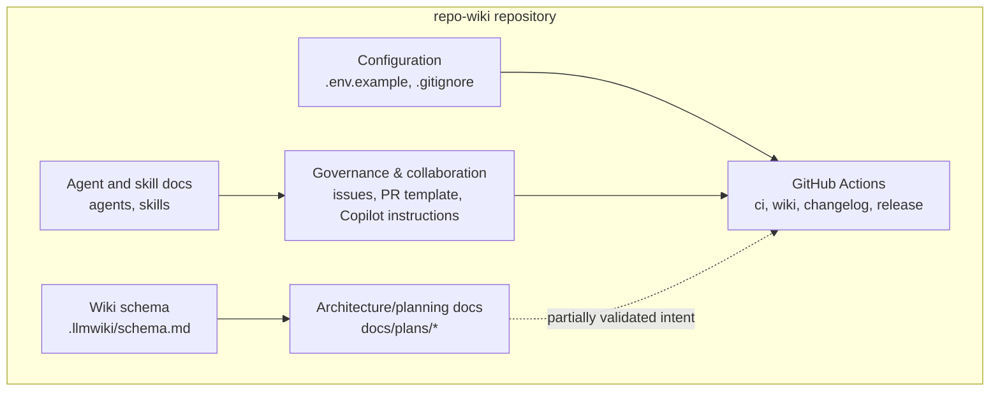
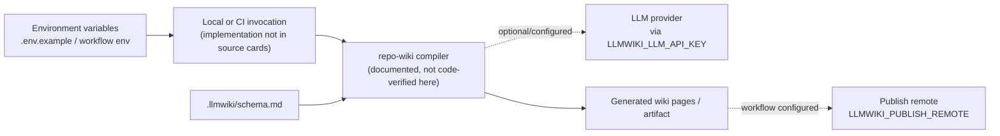
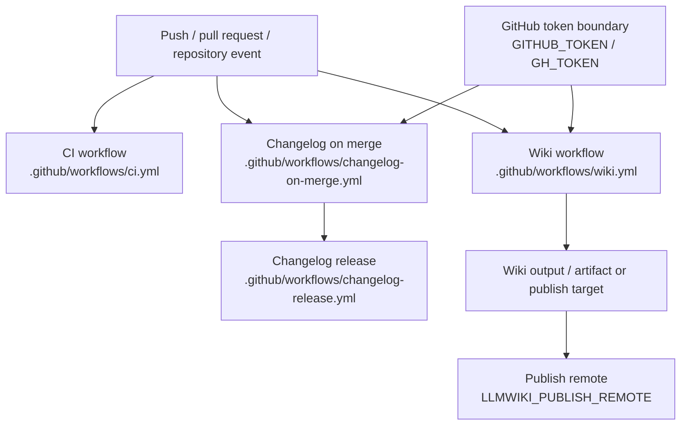

# Architecture

## Executive Architecture Summary

`repo-wiki` is presented by its documentation cards as a dual-role project: a local CLI/package and a GitHub-oriented wiki compiler/publisher for turning repository source evidence into a persistent wiki knowledge base. This role is only partially validated by the available source-card set because the cards include configuration, CI, schemas, agent instructions, and documentation excerpts, but not the implementation source files for the CLI/compiler itself. The available evidence does confirm that the repository has operational surfaces for local/environment configuration, CI, GitHub wiki publishing, changelog automation, issue templates, and LLM/wiki schema conventions. Sources: `.env.example`, `.github/workflows/ci.yml`, `.github/workflows/wiki.yml`, `.github/workflows/changelog-on-merge.yml`, `.github/workflows/changelog-release.yml`, `.llmwiki/schema.md`, README.md documentation card.

The architecture can be conservatively described as these major groups:

| Group | Responsibility | Evidence |
| --- | --- | --- |
| Wiki compiler / package intent | Compile repository evidence into wiki pages; local CLI/package flow is described as running against compiled `dist/` output. | README.md documentation card; `.env.example`; `.github/workflows/wiki.yml` |
| LLM/wiki data model | Defines wiki schema expectations and documentation/data-model conventions. | `.llmwiki/schema.md`; docs/PLAN.md documentation card |
| GitHub Actions automation | Runs CI, wiki generation/publishing, and changelog automation. | `.github/workflows/ci.yml`; `.github/workflows/wiki.yml`; `.github/workflows/changelog-on-merge.yml`; `.github/workflows/changelog-release.yml` |
| Repository governance and collaboration | Provides issue templates, pull request template, Copilot review guidance, and agent/skill instructions. | `.github/ISSUE_TEMPLATE/config.yml`; `.github/ISSUE_TEMPLATE/epic.yml`; `.github/ISSUE_TEMPLATE/task.yml`; `.github/pull_request_template.md`; `.github/copilot-review-instructions.md`; `AGENTS.md`; `.github/agents/*.agent.md`; `.github/skills/*/SKILL.md` |
| Runtime configuration and secrets boundary | Uses environment variables for repository selection, GitHub access, compiler mode, LLM API access, and publish remote configuration. Values are not documented here. | `.env.example`; `.github/workflows/wiki.yml`; `.github/workflows/changelog-on-merge.yml` |

Key design decisions visible from evidence:

- The project is oriented around source-grounded wiki generation rather than free-form documentation; `.llmwiki/schema.md` is a data-model document, and plan documentation describes raw source as the durable input and the wiki as a maintained artifact. Sources: `.llmwiki/schema.md`; docs/PLAN.md documentation card.
- GitHub Actions are first-class operational surfaces for CI, wiki publishing, and changelog/release automation. Sources: `.github/workflows/ci.yml`; `.github/workflows/wiki.yml`; `.github/workflows/changelog-on-merge.yml`; `.github/workflows/changelog-release.yml`.
- The wiki workflow is configurable via `LLMWIKI_COMPILER_MODE` and `LLMWIKI_PUBLISH_REMOTE`; local/API configuration also references `GITHUB_REPOSITORY`, `GITHUB_TOKEN`, and `LLMWIKI_LLM_API_KEY`. Sources: `.env.example`; `.github/workflows/wiki.yml`.
- Changelog automation uses GitHub token access through `GH_TOKEN` in at least one workflow. Source: `.github/workflows/changelog-on-merge.yml`.
- The repository includes human/AI collaboration affordances via agent files, Copilot review instructions, issue templates, and skills. Sources: `AGENTS.md`; `.github/agents/coordinator.agent.md`; `.github/agents/developer.agent.md`; `.github/agents/docs.agent.md`; `.github/agents/fixer.agent.md`; `.github/agents/quality.agent.md`; `.github/agents/review.agent.md`; `.github/copilot-review-instructions.md`; `.github/skills/keep-a-changelog/SKILL.md`; `.github/skills/repo-wiki-navigation/SKILL.md`.

## System and Repository Context

The repository boundary visible from the supplied evidence is a GitHub repository containing configuration, workflows, documentation plans, wiki schema guidance, collaboration templates, and environment-variable examples. The runtime implementation boundary is less certain because no TypeScript/JavaScript implementation files or `package.json` source card were included. README documentation claims a local CLI/package flow that runs against compiled output in `dist/`, but this cannot be fully verified from the current source cards. Sources: README.md documentation card; `.tsbuildinfo`.

External surfaces visible from source cards:

| Surface | Type | Purpose / observed role | Evidence |
| --- | --- | --- | --- |
| Environment variables | Runtime/configuration | Configure repository, GitHub token, compiler mode, LLM API key, and publish remote. | `.env.example`; `.github/workflows/wiki.yml`; `.github/workflows/changelog-on-merge.yml` |
| GitHub Actions | CI/CD and automation | CI, wiki publishing, changelog-on-merge, changelog-release. | `.github/workflows/ci.yml`; `.github/workflows/wiki.yml`; `.github/workflows/changelog-on-merge.yml`; `.github/workflows/changelog-release.yml` |
| GitHub Wiki / publish remote | Deployment target or artifact target | Wiki workflow exposes `LLMWIKI_PUBLISH_REMOTE`; plan docs describe GitHub Action publishing behavior. | `.github/workflows/wiki.yml`; docs/plans/github-action.md documentation card; docs/plans/ci-publishing.md documentation card |
| LLM provider API | External service boundary | `.env.example` includes `LLMWIKI_LLM_API_KEY`; plan docs describe provider-agnostic OpenAI-style chat completion compatibility. | `.env.example`; docs/plans/llm-compiler.md documentation card |
| GitHub issues and pull requests | Collaboration interface | Issue templates, PR template, Copilot instructions, and agent guidance define workflow inputs/review surfaces. | `.github/ISSUE_TEMPLATE/config.yml`; `.github/ISSUE_TEMPLATE/epic.yml`; `.github/ISSUE_TEMPLATE/task.yml`; `.github/pull_request_template.md`; `.github/copilot-review-instructions.md` |

The following context diagram is supported at the boundary level by configuration and workflow evidence, but it does **not** assert internal implementation calls because implementation source files were not included in the source-card set.

Evidence for the diagram: `.env.example`, `.github/workflows/ci.yml`, `.github/workflows/wiki.yml`, `.github/workflows/changelog-on-merge.yml`, `.github/workflows/changelog-release.yml`, `.github/ISSUE_TEMPLATE/*.yml`, `.github/pull_request_template.md`, docs/plans/github-action.md documentation card, docs/plans/llm-compiler.md documentation card.

Repository structure visible from source cards:

| Path area | Architectural meaning | Evidence |
| --- | --- | --- |
| `.github/workflows/` | Automation layer for CI, wiki, changelog, release. | `.github/workflows/ci.yml`; `.github/workflows/wiki.yml`; `.github/workflows/changelog-on-merge.yml`; `.github/workflows/changelog-release.yml` |
| `.github/ISSUE_TEMPLATE/` | Structured issue intake for epics and tasks. | `.github/ISSUE_TEMPLATE/config.yml`; `.github/ISSUE_TEMPLATE/epic.yml`; `.github/ISSUE_TEMPLATE/task.yml` |
| `.github/agents/` | Agent role documentation for coordinator, developer, docs, fixer, quality, and review responsibilities. | `.github/agents/coordinator.agent.md`; `.github/agents/developer.agent.md`; `.github/agents/docs.agent.md`; `.github/agents/fixer.agent.md`; `.github/agents/quality.agent.md`; `.github/agents/review.agent.md` |
| `.github/skills/` | Skill documentation for changelog and repo-wiki navigation workflows. | `.github/skills/keep-a-changelog/SKILL.md`; `.github/skills/repo-wiki-navigation/SKILL.md` |
| `.llmwiki/` | Wiki schema/data-model documentation. | `.llmwiki/schema.md` |
| `docs/plans/` | Planned or partially validated architecture epics for compiler, action, CI publishing, search index, and incremental mode. | docs/plans/ci-publishing.md documentation card; docs/plans/github-action.md documentation card; docs/plans/llm-compiler.md documentation card; docs/plans/search-index.md documentation card; docs/plans/incremental-mode.md documentation card |
| Root config/docs | Environment example, agent guidance, ignore rules, and TypeScript build metadata. | `.env.example`; `.gitignore`; `AGENTS.md`; `.tsbuildinfo` |

## Major Modules and Responsibilities

### Wiki Compiler and CLI / Package Surface

The README documentation card describes the package as dual-role and states that local CLI/package verification runs against compiled output in `dist/`; it also says `npm test`, `npm run check`, and `npm run coverage` require a successful TypeScript build. This is a documentation-card claim and is only partially validated by the supplied source cards, which include `.tsbuildinfo` but do not include `package.json`, source implementation files, or `dist/` contents. Sources: README.md documentation card; `.tsbuildinfo`.

The compiler/package surface appears to depend on environment configuration for repository identity, GitHub access, compiler mode, and LLM API access. Sources: `.env.example`; `.github/workflows/wiki.yml`.

Known configuration names from evidence:

| Variable | Observed location | Architectural role |
| --- | --- | --- |
| `GITHUB_REPOSITORY` | `.env.example` | Repository selection/configuration. |
| `GITHUB_TOKEN` | `.env.example` | GitHub API/authentication boundary. |
| `LLMWIKI_COMPILER_MODE` | `.env.example`; `.github/workflows/wiki.yml` | Compiler mode selection. |
| `LLMWIKI_LLM_API_KEY` | `.env.example` | External LLM provider credential boundary. |
| `LLMWIKI_PUBLISH_REMOTE` | `.github/workflows/wiki.yml` | Wiki publishing remote configuration. |
| `GH_TOKEN` | `.github/workflows/changelog-on-merge.yml` | GitHub token used by changelog automation. |

### LLM Wiki Schema and Knowledge-Base Model

The `.llmwiki/schema.md` file is the clearest evidence of a data-model/documentation contract for generated wiki content. It is categorized as both documentation and data-model evidence in the source cards. Source: `.llmwiki/schema.md`.

Plan documentation describes the product vision as an implementation of an LLM Wiki pattern for software repositories, with immutable raw sources, a persistent wiki artifact, and a schema to guide compilation. This supports the conceptual architecture, but it remains documentation-level evidence. Source: docs/PLAN.md documentation card.

### GitHub Action / Wiki Publishing Automation

The repository includes a dedicated wiki workflow. The source-card metadata identifies `.github/workflows/wiki.yml` as CI/configuration evidence with background-work and environment-variable runtime hints, and it exposes `LLMWIKI_COMPILER_MODE` and `LLMWIKI_PUBLISH_REMOTE`. Source: `.github/workflows/wiki.yml`.

Plan documentation for the GitHub Action describes a run path that can upload a local wiki artifact and conditionally publish when credentials are configured. CI-publishing plan documentation describes a flow involving test and fetching existing wiki state. These are partially validated documentation claims; the current source-card set confirms the workflow file exists but does not expose its full job graph. Sources: docs/plans/github-action.md documentation card; docs/plans/ci-publishing.md documentation card; `.github/workflows/wiki.yml`.

### CI, Test, and Verification Automation

The repository includes `.github/workflows/ci.yml`, which is high-authority evidence that CI exists. The README documentation card says `npm test`, `npm run check`, and `npm run coverage` require a successful TypeScript build and run against compiled `dist/` output; however, package scripts cannot be verified from the source cards because `package.json` is not included. Sources: `.github/workflows/ci.yml`; README.md documentation card; `.tsbuildinfo`.

### Changelog and Release Automation

Two GitHub Actions workflow files indicate changelog/release automation:

- `.github/workflows/changelog-on-merge.yml`, which has background-work and environment-variable hints and uses `GH_TOKEN` according to the source-card metadata.
- `.github/workflows/changelog-release.yml`, which has background-work hints.

Sources: `.github/workflows/changelog-on-merge.yml`; `.github/workflows/changelog-release.yml`.

The `.github/skills/keep-a-changelog/SKILL.md` skill file supports the repository’s changelog process documentation. Source: `.github/skills/keep-a-changelog/SKILL.md`.

### Search and Query Planning

A search-index plan documentation card describes building a local search index over generated wiki pages, source cards, and documentation cards so `repo-wiki search` and `repo-wiki query` can route questions efficiently without external services. This is a partially validated plan, not confirmed runtime behavior from source-code cards. Source: docs/plans/search-index.md documentation card.

### Incremental Compilation Planning

An incremental-mode plan documentation card exists but is explicitly marked stale in the provided documentation cards. Any architecture claims from it should be treated as non-authoritative until validated against code/workflows. Source: docs/plans/incremental-mode.md documentation card.

### Collaboration, Review, and Agent Guidance

The repository includes several governance and collaboration assets:

| Asset group | Responsibility | Evidence |
| --- | --- | --- |
| Issue templates | Structured issue creation for epics/tasks and issue configuration. | `.github/ISSUE_TEMPLATE/config.yml`; `.github/ISSUE_TEMPLATE/epic.yml`; `.github/ISSUE_TEMPLATE/task.yml` |
| Pull request template | Standardized PR content/review checklist. | `.github/pull_request_template.md` |
| Copilot review instructions | Review guidance for automated or assisted code review. | `.github/copilot-review-instructions.md` |
| Agents | Role-specific instructions for coordinator, developer, docs, fixer, quality, and review agents. | `.github/agents/coordinator.agent.md`; `.github/agents/developer.agent.md`; `.github/agents/docs.agent.md`; `.github/agents/fixer.agent.md`; `.github/agents/quality.agent.md`; `.github/agents/review.agent.md`; `AGENTS.md` |
| Skills | Reusable skill documentation for changelog and wiki navigation workflows. | `.github/skills/keep-a-changelog/SKILL.md`; `.github/skills/repo-wiki-navigation/SKILL.md` |

The following component diagram is derived from repository structure and workflow/configuration evidence. It should be read as a high-level grouping diagram, not a verified import graph.

Evidence for the diagram: `.env.example`, `.gitignore`, `.llmwiki/schema.md`, `.github/workflows/ci.yml`, `.github/workflows/wiki.yml`, `.github/workflows/changelog-on-merge.yml`, `.github/workflows/changelog-release.yml`, `.github/ISSUE_TEMPLATE/config.yml`, `.github/ISSUE_TEMPLATE/epic.yml`, `.github/ISSUE_TEMPLATE/task.yml`, `.github/pull_request_template.md`, `.github/copilot-review-instructions.md`, `.github/agents/*.agent.md`, `.github/skills/*/SKILL.md`, docs/plans/*.md documentation cards.

## Runtime, Data, and Control-Flow Relationships

The runtime/control-flow evidence available here is mostly at configuration and CI levels. No implementation import graph is available from the supplied source cards. Therefore, the safest runtime model is:

1. A local or CI invocation configures the repository/wiki compiler with environment variables such as `GITHUB_REPOSITORY`, `GITHUB_TOKEN`, `LLMWIKI_COMPILER_MODE`, and possibly `LLMWIKI_LLM_API_KEY`. Sources: `.env.example`; `.github/workflows/wiki.yml`.
2. The wiki workflow runs as background automation and can use `LLMWIKI_COMPILER_MODE` and `LLMWIKI_PUBLISH_REMOTE`. Source: `.github/workflows/wiki.yml`.
3. Changelog automation runs in background workflow context and uses `GH_TOKEN` for GitHub access. Source: `.github/workflows/changelog-on-merge.yml`.
4. Generated wiki behavior is intended to follow the `.llmwiki/schema.md` schema and source-grounded documentation model. Sources: `.llmwiki/schema.md`; docs/PLAN.md documentation card.
5. Plan documentation indicates future or partially validated paths for LLM compilation, GitHub Action publishing, CI publishing, and search-index routing. Sources: docs/plans/llm-compiler.md documentation card; docs/plans/github-action.md documentation card; docs/plans/ci-publishing.md documentation card; docs/plans/search-index.md documentation card.

A conservative runtime/control-flow diagram:

Limitations: the `Compiler` node and invocation details are documentation-supported rather than implementation-verified in the current evidence set. Sources: `.env.example`; `.github/workflows/wiki.yml`; `.llmwiki/schema.md`; README.md documentation card; docs/plans/llm-compiler.md documentation card; docs/plans/github-action.md documentation card.

## Build, Test, Deployment, and Operational Surfaces

### CI and Build/Test Surface

The repository has a CI workflow at `.github/workflows/ci.yml`. The source-card metadata only confirms the file exists as CI evidence with background-work hints; it does not expose the workflow steps. Source: `.github/workflows/ci.yml`.

The README documentation card states that local development and verification use compiled `dist/` output, and that `npm test`, `npm run check`, and `npm run coverage` require a successful TypeScript build. This is partially validated by the presence of `.tsbuildinfo`, but cannot be fully verified without `package.json`, source files, or workflow step contents. Sources: README.md documentation card; `.tsbuildinfo`.

### Wiki Generation and Publishing

The wiki workflow file is a primary operational surface. It is categorized as CI/configuration evidence and uses environment variables `LLMWIKI_COMPILER_MODE` and `LLMWIKI_PUBLISH_REMOTE`. Source: `.github/workflows/wiki.yml`.

Plan documentation for GitHub Action and CI publishing suggests a flow where the action can generate a local wiki artifact and conditionally publish based on credentials. This is partially validated and should be checked against the actual workflow implementation before treating it as current behavior. Sources: docs/plans/github-action.md documentation card; docs/plans/ci-publishing.md documentation card; `.github/workflows/wiki.yml`.

### Changelog / Release Automation

Changelog and release automation is represented by two workflow files. The on-merge changelog workflow uses `GH_TOKEN`, and both changelog workflows are marked with background-work runtime hints. Sources: `.github/workflows/changelog-on-merge.yml`; `.github/workflows/changelog-release.yml`.

The `keep-a-changelog` skill indicates a human/agent-facing process around changelog maintenance. Source: `.github/skills/keep-a-changelog/SKILL.md`.

### Build/Test/Deploy Flow Diagram

The following diagram is supported by the existence of workflow files and environment-variable metadata, but individual job steps are not shown because the source-card excerpts do not include complete workflow contents.

Evidence: `.github/workflows/ci.yml`, `.github/workflows/wiki.yml`, `.github/workflows/changelog-on-merge.yml`, `.github/workflows/changelog-release.yml`, `.env.example`.

## Cross-Cutting Concerns

### Configuration

Configuration is environment-variable driven at the boundaries visible in the evidence. `.env.example` lists `GITHUB_REPOSITORY`, `GITHUB_TOKEN`, `LLMWIKI_COMPILER_MODE`, and `LLMWIKI_LLM_API_KEY`; `.github/workflows/wiki.yml` references `LLMWIKI_COMPILER_MODE` and `LLMWIKI_PUBLISH_REMOTE`; `.github/workflows/changelog-on-merge.yml` references `GH_TOKEN`. Sources: `.env.example`; `.github/workflows/wiki.yml`; `.github/workflows/changelog-on-merge.yml`.

No secret values are included in this page.

### Security and Secret Handling

The architecture includes credential boundaries for GitHub and LLM provider access. `GITHUB_TOKEN`, `GH_TOKEN`, and `LLMWIKI_LLM_API_KEY` should be treated as secrets. Sources: `.env.example`; `.github/workflows/changelog-on-merge.yml`.

Because the implementation source and full workflow steps are not included in the source cards, token permissions, masking behavior, and least-privilege settings are open verification items. Sources: `.github/workflows/wiki.yml`; `.github/workflows/changelog-on-merge.yml`.

### LLM Provider Boundary

The project exposes an LLM API key configuration surface via `LLMWIKI_LLM_API_KEY`. Source: `.env.example`.

The LLM compiler plan says the production LLM boundary should be provider-agnostic and compatible with OpenAI-style chat completions so local and GitHub Actions runs can use OpenAI or compatible providers. This is plan-level, partially validated documentation rather than confirmed implementation behavior. Source: docs/plans/llm-compiler.md documentation card.

### Data Model and Documentation Trust

The `.llmwiki/schema.md` file is the data-model anchor for wiki output. Source: `.llmwiki/schema.md`.

The repository’s own documentation cards distinguish partially validated and stale plans. In this generated page, implementation claims from README and plan documents are treated as secondary evidence unless backed by source/configuration cards. Sources: README.md documentation card; docs/plans/incremental-mode.md documentation card; docs/plans/llm-compiler.md documentation card; docs/plans/search-index.md documentation card.

### CI/CD and Background Work

Several workflows are marked with background-work hints: CI, wiki, changelog-on-merge, and changelog-release. Sources: `.github/workflows/ci.yml`; `.github/workflows/wiki.yml`; `.github/workflows/changelog-on-merge.yml`; `.github/workflows/changelog-release.yml`.

### Human and AI Collaboration

The repository includes extensive collaboration documentation: root and `.github/agents/` agent instructions, Copilot review instructions, issue templates, PR template, and skills. These files form a governance/control surface for how work is planned, reviewed, documented, and maintained. Sources: `AGENTS.md`; `.github/agents/coordinator.agent.md`; `.github/agents/developer.agent.md`; `.github/agents/docs.agent.md`; `.github/agents/fixer.agent.md`; `.github/agents/quality.agent.md`; `.github/agents/review.agent.md`; `.github/copilot-review-instructions.md`; `.github/ISSUE_TEMPLATE/config.yml`; `.github/ISSUE_TEMPLATE/epic.yml`; `.github/ISSUE_TEMPLATE/task.yml`; `.github/pull_request_template.md`; `.github/skills/keep-a-changelog/SKILL.md`; `.github/skills/repo-wiki-navigation/SKILL.md`.

## Caveats and Open Questions

- **Implementation source files are not included in the provided source cards.** This page cannot verify CLI entry points, package exports, compiler internals, import relationships, or runtime call graphs. Claims about the CLI/package come from README documentation and partial build metadata only. Sources: README.md documentation card; `.tsbuildinfo`.
- **`package.json` is not available in the evidence set.** Package scripts such as `npm test`, `npm run check`, and `npm run coverage` are described in README but cannot be validated against actual package configuration here. Source: README.md documentation card.
- **Workflow step details are not visible in source-card excerpts.** The presence of workflows is authoritative, but exact triggers, permissions, jobs, commands, and artifact behavior should be checked against the full YAML contents. Sources: `.github/workflows/ci.yml`; `.github/workflows/wiki.yml`; `.github/workflows/changelog-on-merge.yml`; `.github/workflows/changelog-release.yml`.
- **Several architecture items are plan-level rather than confirmed behavior.** GitHub Action publishing, CI publishing, LLM compiler provider abstraction, and search indexing are represented by partially validated documentation cards. Sources: docs/plans/github-action.md documentation card; docs/plans/ci-publishing.md documentation card; docs/plans/llm-compiler.md documentation card; docs/plans/search-index.md documentation card.
- **Incremental mode is explicitly stale in the supplied documentation cards.** Do not rely on it as current architecture without code/workflow validation. Source: docs/plans/incremental-mode.md documentation card.
- **Diagrams in this page are boundary/grouping diagrams, not verified implementation dependency graphs.** They are inferred from repository structure, workflow presence, environment-variable metadata, schema location, and documentation-card intent. Sources: `.env.example`; `.github/workflows/*.yml`; `.llmwiki/schema.md`; `.github/agents/*.agent.md`; `.github/skills/*/SKILL.md`; README.md documentation card; docs/plans/*.md documentation cards.
- **Security posture remains unverified.** Token names and credential boundaries are visible, but permissions, scoping, secret storage, and redaction behavior require full workflow and implementation review. Sources: `.env.example`; `.github/workflows/wiki.yml`; `.github/workflows/changelog-on-merge.yml`.
- **Search/query architecture is not code-verified.** The search-index plan describes local indexing over generated pages, source cards, and documentation cards, but no implementation source was available here. Source: docs/plans/search-index.md documentation card.
- **LLM provider behavior is not code-verified.** `LLMWIKI_LLM_API_KEY` confirms a credential surface, and the LLM compiler plan describes provider-agnostic OpenAI-style compatibility, but actual client implementation is not included in the evidence. Sources: `.env.example`; docs/plans/llm-compiler.md documentation card.

<!-- HUMAN_NOTES_START -->
<!-- HUMAN_NOTES_END -->
