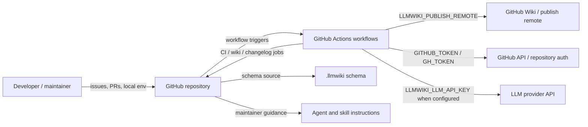
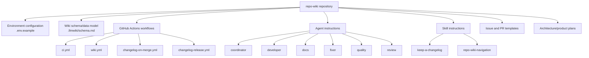
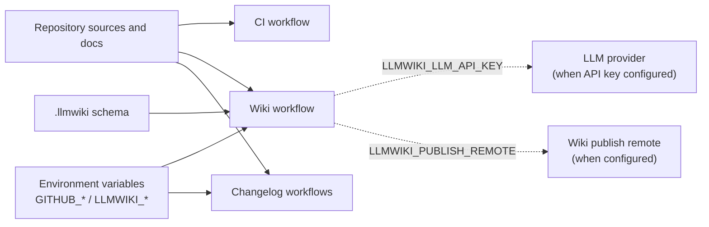
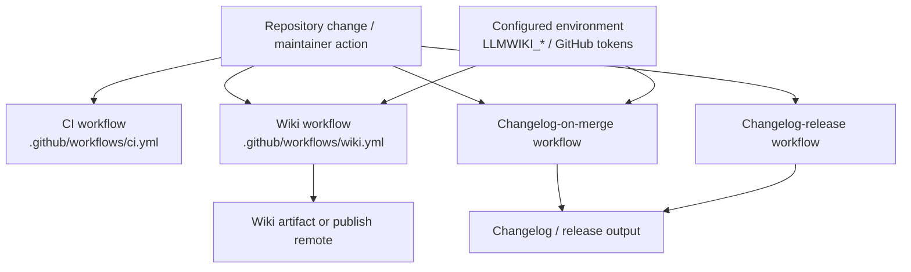

# Architecture

## Executive Architecture Summary

`repo-wiki` appears to be a repository-to-GitHub-Wiki compiler and maintenance system: documentation cards describe the product as implementing an “LLM Wiki” pattern where raw repository sources remain immutable while generated wiki pages become a maintained, compounding artifact. This product-level purpose is documented but only partially validated by the available source-card set because executable application source files and package metadata are not included in the provided evidence. [README.md documentation card, docs/PLAN.md documentation card, docs/WHY.md documentation card]

From the source cards available for this page, the repository architecture can be described as a documentation-and-automation-centered system with these visible subsystems:

| Subsystem | Evidence | Current confidence |
|---|---|---:|
| Environment/configuration surface for local or CI execution | `.env.example` declares `GITHUB_REPOSITORY`, `GITHUB_TOKEN`, `LLMWIKI_COMPILER_MODE`, and `LLMWIKI_LLM_API_KEY`. | Medium |
| GitHub Actions automation for CI, wiki generation/publishing, and changelog/release workflows | `.github/workflows/ci.yml`, `.github/workflows/wiki.yml`, `.github/workflows/changelog-on-merge.yml`, `.github/workflows/changelog-release.yml` are present as CI/configuration source cards. | Medium |
| LLM Wiki schema/documentation model | `.llmwiki/schema.md` is marked as a data-model documentation card. | Medium |
| Agent and skill instructions for coordinated repository work | `.github/agents/*.agent.md`, `.github/skills/*/SKILL.md`, `.github/copilot-review-instructions.md`, `.pi/AGENTS.md` are present as documentation/instruction surfaces. | Medium |
| GitHub collaboration templates | `.github/ISSUE_TEMPLATE/*.yml` and `.github/pull_request_template.md` are present. | Medium |
| Product plan modules for CI publishing, GitHub Action support, incremental mode, and an LLM compiler | Plan documentation cards exist, but at least one is explicitly stale and the rest are only partially validated. | Low |

Key architectural decisions visible from the evidence:

1. The system is intended to operate both locally and in GitHub automation, because configuration includes local-style environment variables in `.env.example` and CI workflows include wiki and changelog automation surfaces. [`.env.example`, `.github/workflows/wiki.yml`, `.github/workflows/ci.yml`, `.github/workflows/changelog-on-merge.yml`, `.github/workflows/changelog-release.yml`]
2. GitHub is a primary integration boundary: environment variables and workflows reference repository identity, GitHub tokens, wiki publishing, GitHub issue templates, pull request templates, and GitHub Actions. [`.env.example`, `.github/workflows/wiki.yml`, `.github/workflows/changelog-on-merge.yml`, `.github/ISSUE_TEMPLATE/config.yml`, `.github/ISSUE_TEMPLATE/epic.yml`, `.github/ISSUE_TEMPLATE/task.yml`, `.github/pull_request_template.md`]
3. LLM interaction is an intended architectural boundary, but provider/runtime details are only partially validated by docs: `.env.example` exposes `LLMWIKI_LLM_API_KEY`, and a plan card says the first production LLM boundary should be provider-agnostic and compatible with OpenAI-style chat completions. [`.env.example`, docs/plans/llm-compiler.md documentation card]
4. The repository includes a schema-oriented wiki/documentation model, represented by `.llmwiki/schema.md`. [`.llmwiki/schema.md`]

## System and Repository Context

### Repository boundary

The visible repository boundary includes GitHub-hosted collaboration, automation, and documentation-generation surfaces. The provided source cards do **not** include application entrypoint source files, package manifests, or import graphs, so this context view is limited to verified configuration, CI, and documentation surfaces. [`.env.example`, `.github/workflows/ci.yml`, `.github/workflows/wiki.yml`, `.llmwiki/schema.md`]

| Boundary / surface | Role | Evidence |
|---|---|---|
| Local environment configuration | Supplies repository identity, GitHub authentication, compiler mode, and LLM API key names. Values are not included here. | `.env.example` |
| GitHub Actions | Runs CI, wiki workflow, changelog-on-merge workflow, and changelog-release workflow. | `.github/workflows/ci.yml`, `.github/workflows/wiki.yml`, `.github/workflows/changelog-on-merge.yml`, `.github/workflows/changelog-release.yml` |
| GitHub Wiki publishing | Wiki workflow exposes `LLMWIKI_PUBLISH_REMOTE`, indicating a publish remote can be configured. | `.github/workflows/wiki.yml` |
| GitHub repository APIs / authentication | Environment variables include `GITHUB_REPOSITORY`, `GITHUB_TOKEN`, and workflow-level `GH_TOKEN`. | `.env.example`, `.github/workflows/changelog-on-merge.yml` |
| LLM provider boundary | Environment variable `LLMWIKI_LLM_API_KEY` indicates an LLM API credential is expected for some modes; provider abstraction is described in partially validated plan docs. | `.env.example`, docs/plans/llm-compiler.md documentation card |
| Wiki schema / generated-page contract | `.llmwiki/schema.md` is the visible schema/data-model documentation surface. | `.llmwiki/schema.md` |
| Repository collaboration templates | Issue templates and pull request template shape human workflow inputs. | `.github/ISSUE_TEMPLATE/config.yml`, `.github/ISSUE_TEMPLATE/epic.yml`, `.github/ISSUE_TEMPLATE/task.yml`, `.github/pull_request_template.md` |
| Agent/skill instructions | Agent markdown files and skill markdown files define repository-maintenance roles and reusable guidance. | `.github/agents/coordinator.agent.md`, `.github/agents/developer.agent.md`, `.github/agents/docs.agent.md`, `.github/agents/fixer.agent.md`, `.github/agents/quality.agent.md`, `.github/agents/review.agent.md`, `.github/skills/keep-a-changelog/SKILL.md`, `.github/skills/repo-wiki-navigation/SKILL.md` |

### Context diagram

The diagram below is supported by visible configuration and workflow surfaces, but it does **not** claim internal call relationships because executable source/import evidence was not provided.

Evidence: `.env.example`, `.github/workflows/ci.yml`, `.github/workflows/wiki.yml`, `.github/workflows/changelog-on-merge.yml`, `.github/workflows/changelog-release.yml`, `.llmwiki/schema.md`, `.github/agents/*.agent.md`, `.github/skills/*/SKILL.md`.

## Major Modules and Responsibilities

### Wiki compiler / repository wiki product

The core product is described in documentation as a tool that can initialize and run a repository wiki workflow, with example commands including `npx repo-wiki init --repo . --write-agents`, `npx repo-wiki run \`, and `npm install`. These commands are from a partially validated README card and cannot be fully verified from the source cards provided here because no package manifest or CLI source file was included. [README.md documentation card]

Expected responsibilities from documentation cards:

- Compile repository source knowledge into GitHub Wiki pages. [README.md documentation card, docs/PLAN.md documentation card]
- Preserve source repositories as the authoritative raw inputs while maintaining a persistent wiki artifact. [docs/PLAN.md documentation card, docs/WHY.md documentation card]
- Use a schema to guide generated wiki structure. [`.llmwiki/schema.md`, docs/PLAN.md documentation card]

Claim status: **partially verified**. The intent is strongly documented, but current executable behavior is not proven by the provided source cards.

### `.llmwiki` schema module

`.llmwiki/schema.md` is marked as a data-model documentation card and is the main visible source for the wiki/schema model. [`.llmwiki/schema.md`]

Likely responsibilities:

- Define expected wiki page structure, metadata, or documentation schema. [`.llmwiki/schema.md`]
- Provide a contract for generated or maintained wiki artifacts. [`.llmwiki/schema.md`, docs/PLAN.md documentation card]

Claim status: **partially verified** because only the schema file path and classification are available in the source-card excerpt.

### GitHub Actions automation module

The repository includes four workflow source cards:

| Workflow | Architectural role inferred from filename/card metadata | Evidence |
|---|---|---|
| CI | General continuous integration/background validation. | `.github/workflows/ci.yml` |
| Wiki | Wiki generation/publishing workflow; uses `LLMWIKI_COMPILER_MODE` and `LLMWIKI_PUBLISH_REMOTE`. | `.github/workflows/wiki.yml` |
| Changelog on merge | Changelog automation on merge; uses `GH_TOKEN`. | `.github/workflows/changelog-on-merge.yml` |
| Changelog release | Release/changelog background automation. | `.github/workflows/changelog-release.yml` |

The workflow contents are not included in the cards beyond environment-variable/runtime hints, so job names, trigger branches, exact commands, permissions, artifacts, and publishing conditions should be verified directly in the workflow YAML before relying on them operationally. [`.github/workflows/ci.yml`, `.github/workflows/wiki.yml`, `.github/workflows/changelog-on-merge.yml`, `.github/workflows/changelog-release.yml`]

### Configuration and secret-bearing environment module

`.env.example` defines the following variable names: `GITHUB_REPOSITORY`, `GITHUB_TOKEN`, `LLMWIKI_COMPILER_MODE`, and `LLMWIKI_LLM_API_KEY`. [`.env.example`]

Operational interpretation:

- `GITHUB_REPOSITORY` identifies the target repository. [`.env.example`]
- `GITHUB_TOKEN` is a GitHub authentication token name; no value is included here. [`.env.example`]
- `LLMWIKI_COMPILER_MODE` selects a compiler mode, also referenced by the wiki workflow. [`.env.example`, `.github/workflows/wiki.yml`]
- `LLMWIKI_LLM_API_KEY` indicates LLM-backed behavior can require an API key. [`.env.example`]

Security note: only variable names are documented here; no secret values are copied. [`.env.example`]

### Agent instruction module

The repository contains GitHub agent instruction markdown files:

- Coordinator agent. [`.github/agents/coordinator.agent.md`]
- Developer agent. [`.github/agents/developer.agent.md`]
- Docs agent. [`.github/agents/docs.agent.md`]
- Fixer agent. [`.github/agents/fixer.agent.md`]
- Quality agent. [`.github/agents/quality.agent.md`]
- Review agent. [`.github/agents/review.agent.md`]

These files are documentation/instruction surfaces rather than executable code in the provided evidence. They suggest a role-oriented maintenance model for repository work. [`.github/agents/coordinator.agent.md`, `.github/agents/developer.agent.md`, `.github/agents/docs.agent.md`, `.github/agents/fixer.agent.md`, `.github/agents/quality.agent.md`, `.github/agents/review.agent.md`]

### Skill instruction module

The repository includes at least two skill documentation files:

- `keep-a-changelog`, likely related to changelog maintenance. [`.github/skills/keep-a-changelog/SKILL.md`]
- `repo-wiki-navigation`, likely related to navigating the generated/maintained wiki. [`.github/skills/repo-wiki-navigation/SKILL.md`]

These are documentation cards, not executable modules in the provided source evidence. [`.github/skills/keep-a-changelog/SKILL.md`, `.github/skills/repo-wiki-navigation/SKILL.md`]

### GitHub collaboration module

The repository includes issue templates for epics and tasks plus issue-template configuration. [`.github/ISSUE_TEMPLATE/config.yml`, `.github/ISSUE_TEMPLATE/epic.yml`, `.github/ISSUE_TEMPLATE/task.yml`]

A pull request template is also present. [`.github/pull_request_template.md`]

These files shape human contribution workflows but do not establish runtime application behavior.

### Planning modules

Several partially validated or stale plan documents describe intended architecture:

| Plan document | Status from documentation card | Architectural relevance |
|---|---|---|
| `docs/plans/ci-publishing.md` | Partially validated | Mentions a CI publishing architecture including test and wiki-state fetch concepts. |
| `docs/plans/github-action.md` | Partially validated | Mentions a GitHub Action architecture with local wiki artifact upload and conditional publishing credentials. |
| `docs/plans/incremental-mode.md` | Stale | Mentions incremental mode architecture; should not be treated as current behavior without source validation. |
| `docs/plans/llm-compiler.md` | Partially validated | Describes a provider-agnostic LLM compiler boundary compatible with OpenAI-style chat completions. |

Evidence: docs/plans/ci-publishing.md documentation card, docs/plans/github-action.md documentation card, docs/plans/incremental-mode.md documentation card, docs/plans/llm-compiler.md documentation card.

### Component/module diagram

This diagram is a repository-structure view, not a verified import graph. Relationships are inferred from file organization, workflow names, and environment-variable surfaces.

Evidence: `.env.example`, `.llmwiki/schema.md`, `.github/workflows/*.yml`, `.github/agents/*.agent.md`, `.github/skills/*/SKILL.md`, `.github/ISSUE_TEMPLATE/*.yml`, `.github/pull_request_template.md`, docs/plans/* documentation cards.

## Runtime, Data, and Control-Flow Relationships

### Verified runtime surfaces

The available source cards verify only high-level runtime surfaces, not application internals:

| Runtime surface | Evidence | What is known |
|---|---|---|
| Local/CI environment variables | `.env.example`, `.github/workflows/wiki.yml`, `.github/workflows/changelog-on-merge.yml` | The repository expects GitHub-related variables and LLM wiki compiler variables. |
| Background workflow execution | `.github/workflows/ci.yml`, `.github/workflows/wiki.yml`, `.github/workflows/changelog-on-merge.yml`, `.github/workflows/changelog-release.yml` | CI, wiki, changelog, and release automation run as GitHub Actions workflows. |
| Wiki publishing remote | `.github/workflows/wiki.yml` | `LLMWIKI_PUBLISH_REMOTE` is a configured variable name for wiki publication. |
| LLM API credential | `.env.example` | `LLMWIKI_LLM_API_KEY` is an expected variable name for LLM-backed behavior. |
| GitHub auth | `.env.example`, `.github/workflows/changelog-on-merge.yml` | `GITHUB_TOKEN` and `GH_TOKEN` are token variable names used by configuration/workflows. |

### Data-flow interpretation

A conservative data-flow view supported by the evidence is:

1. Repository sources, schema documentation, and maintained instructions exist in the Git repository. [`.llmwiki/schema.md`, `.github/agents/coordinator.agent.md`, `.github/skills/repo-wiki-navigation/SKILL.md`]
2. Local or CI execution can receive configuration through environment variables. [`.env.example`, `.github/workflows/wiki.yml`]
3. GitHub Actions workflows run background automation for CI, wiki generation/publishing, changelog updates, and releases. [`.github/workflows/ci.yml`, `.github/workflows/wiki.yml`, `.github/workflows/changelog-on-merge.yml`, `.github/workflows/changelog-release.yml`]
4. Wiki publication, when configured, can target a publish remote via `LLMWIKI_PUBLISH_REMOTE`. [`.github/workflows/wiki.yml`]
5. LLM-backed compiler operation is implied by `LLMWIKI_LLM_API_KEY` and plan documentation, but exact request/response control flow is not verified by source cards. [`.env.example`, docs/plans/llm-compiler.md documentation card]

### Control-flow diagram

The following diagram is intentionally limited to workflow/configuration evidence and documented plan intent. It is **not** a verified sequence of application function calls.

Evidence: `.env.example`, `.github/workflows/ci.yml`, `.github/workflows/wiki.yml`, `.github/workflows/changelog-on-merge.yml`, `.github/workflows/changelog-release.yml`, `.llmwiki/schema.md`.

## Build, Test, Deployment, and Operational Surfaces

### Build/test

The repository includes `.github/workflows/ci.yml`, which is the visible CI entry point. The card indicates background-work runtime hints, but does not expose exact commands, job matrix, package manager, test framework, or build artifacts. [`.github/workflows/ci.yml`]

The README documentation card mentions `npm install`, but no `package.json` source card was provided, so package scripts and dependency metadata cannot be verified from the available evidence. [README.md documentation card]

### Wiki generation and publishing

The repository includes `.github/workflows/wiki.yml`, which is a CI/configuration source card with `LLMWIKI_COMPILER_MODE` and `LLMWIKI_PUBLISH_REMOTE` environment variables. [`.github/workflows/wiki.yml`]

Plan cards describe CI publishing and GitHub Action architectures involving tests, fetching existing wiki state, artifact upload, and publish-credential policy checks; those plan claims are only partially validated and should be treated as intended architecture unless confirmed in the workflow file or application code. [docs/plans/ci-publishing.md documentation card, docs/plans/github-action.md documentation card]

### Changelog and release automation

Two workflow files support changelog/release operations:

- `.github/workflows/changelog-on-merge.yml`, with `GH_TOKEN` as an environment variable. [`.github/workflows/changelog-on-merge.yml`]
- `.github/workflows/changelog-release.yml`, marked as a CI/background-work source card. [`.github/workflows/changelog-release.yml`]

The `keep-a-changelog` skill file likely supports changelog maintenance guidance, but its exact integration with workflows is not verified by import or command evidence. [`.github/skills/keep-a-changelog/SKILL.md`, `.github/workflows/changelog-on-merge.yml`, `.github/workflows/changelog-release.yml`]

### Operational entry points

| Entry point | Type | Evidence | Verification status |
|---|---|---|---|
| `npx repo-wiki init --repo . --write-agents` | CLI command documented in README | README.md documentation card | Partially validated only |
| `npx repo-wiki run \` | CLI command documented in README | README.md documentation card | Partially validated only |
| `npm install` | Local setup command documented in README | README.md documentation card | Partially validated only |
| GitHub Actions CI workflow | CI automation | `.github/workflows/ci.yml` | Source-card verified as present |
| GitHub Actions wiki workflow | Wiki automation/publishing | `.github/workflows/wiki.yml` | Source-card verified as present |
| GitHub Actions changelog workflows | Changelog/release automation | `.github/workflows/changelog-on-merge.yml`, `.github/workflows/changelog-release.yml` | Source-card verified as present |

### Build/test/deploy flow diagram

This diagram is supported by workflow file presence and environment-variable cards, but exact workflow job order is not verified.

Evidence: `.github/workflows/ci.yml`, `.github/workflows/wiki.yml`, `.github/workflows/changelog-on-merge.yml`, `.github/workflows/changelog-release.yml`, `.env.example`.

## Cross-Cutting Concerns

### Configuration

Configuration is environment-variable oriented in the visible evidence. `.env.example` defines `GITHUB_REPOSITORY`, `GITHUB_TOKEN`, `LLMWIKI_COMPILER_MODE`, and `LLMWIKI_LLM_API_KEY`. [`.env.example`]

The wiki workflow additionally references `LLMWIKI_COMPILER_MODE` and `LLMWIKI_PUBLISH_REMOTE`. [`.github/workflows/wiki.yml`]

The changelog-on-merge workflow references `GH_TOKEN`. [`.github/workflows/changelog-on-merge.yml`]

### Security and secret handling

The visible secret-bearing variables are token/API-key names, not values:

| Variable name | Purpose inferred from name/context | Evidence |
|---|---|---|
| `GITHUB_TOKEN` | GitHub authentication for local/configured operations. | `.env.example` |
| `GH_TOKEN` | GitHub authentication for changelog-on-merge workflow. | `.github/workflows/changelog-on-merge.yml` |
| `LLMWIKI_LLM_API_KEY` | LLM provider API authentication. | `.env.example` |

No secret values are present in this generated page. The repository should ensure workflow permissions and secret scopes are least-privilege, but exact permissions cannot be assessed from the source-card excerpts. [`.env.example`, `.github/workflows/changelog-on-merge.yml`]

### APIs and external dependencies

The visible external API boundaries are:

- GitHub repository/API interactions, implied by GitHub token variables, GitHub Actions workflows, issue/PR templates, and wiki publishing configuration. [`.env.example`, `.github/workflows/wiki.yml`, `.github/workflows/changelog-on-merge.yml`, `.github/ISSUE_TEMPLATE/config.yml`, `.github/pull_request_template.md`]
- LLM provider interaction, implied by `LLMWIKI_LLM_API_KEY` and plan documentation for a provider-agnostic OpenAI-style chat completions boundary. [`.env.example`, docs/plans/llm-compiler.md documentation card]

No direct SDK imports, HTTP clients, or provider implementation code were included in the source cards, so API implementation details are unknown.

### Data model and generated-content contract

`.llmwiki/schema.md` is the visible schema/data-model source for the wiki system. [`.llmwiki/schema.md`]

This Architecture page follows a generated-page contract with frontmatter and human-notes preservation markers based on the requested output contract, not independently discovered repository behavior.

### Documentation trust model

The source evidence includes both source/configuration cards and partially validated or stale documentation cards. For architecture synthesis:

- Workflow, environment-variable, issue-template, and schema file presence are treated as higher-confidence evidence. [`.env.example`, `.github/workflows/ci.yml`, `.github/workflows/wiki.yml`, `.llmwiki/schema.md`]
- README and plan documents are treated as product intent unless source-card evidence corroborates them. [README.md documentation card, docs/PLAN.md documentation card, docs/plans/*.md documentation cards]
- `docs/plans/incremental-mode.md` is explicitly marked stale and should not be used as current behavior without code validation. [docs/plans/incremental-mode.md documentation card]

### Maintainer and AI-agent workflow

The `.github/agents` and `.github/skills` directories define role-oriented and skill-oriented documentation surfaces for repository maintenance. [`.github/agents/coordinator.agent.md`, `.github/agents/developer.agent.md`, `.github/agents/docs.agent.md`, `.github/agents/fixer.agent.md`, `.github/agents/quality.agent.md`, `.github/agents/review.agent.md`, `.github/skills/keep-a-changelog/SKILL.md`, `.github/skills/repo-wiki-navigation/SKILL.md`]

These surfaces should be treated as instructions or documentation unless an automation system explicitly consumes them; such consumption is not verified by the available source cards.

## Caveats and Open Questions

1. **Executable architecture is under-evidenced.** The provided source cards do not include application source files, package metadata, CLI entrypoints, tests, or import graphs. Therefore, this page cannot verify internal class/module boundaries, function call paths, package scripts, test commands, or runtime dependency chains. [`.github/workflows/ci.yml`, README.md documentation card]

2. **README CLI commands are only partially validated.** The README card lists `npx repo-wiki init --repo . --write-agents`, `npx repo-wiki run \`, and `npm install`, but no `package.json` or CLI implementation source card is available here. [README.md documentation card]

3. **Workflow job details are unknown from cards.** The workflow files are present, but the source-card excerpts do not include triggers, permissions, commands, artifacts, or branch conditions. Operational claims about exact CI behavior should be verified in `.github/workflows/*.yml`. [`.github/workflows/ci.yml`, `.github/workflows/wiki.yml`, `.github/workflows/changelog-on-merge.yml`, `.github/workflows/changelog-release.yml`]

4. **LLM provider integration is implied, not implementation-verified.** `LLMWIKI_LLM_API_KEY` and the LLM compiler plan indicate an LLM boundary, but no provider client code or request schema is visible in the provided source cards. [`.env.example`, docs/plans/llm-compiler.md documentation card]

5. **Incremental mode appears planned or stale.** The incremental-mode plan card is marked stale, so any incremental architecture should be treated as an open question until current code or CI validates it. [docs/plans/incremental-mode.md documentation card]

6. **Diagrams are structure/configuration diagrams, not import graphs.** The context, component, control-flow, and build/deploy diagrams in this page are inferred from repository structure, environment-variable surfaces, and workflow presence. They should not be read as verified internal call graphs. [`.env.example`, `.github/workflows/*.yml`, `.llmwiki/schema.md`]

7. **Schema details are not summarized deeply.** `.llmwiki/schema.md` is identified as a data-model source, but the source-card excerpt does not expose the schema contents. [`.llmwiki/schema.md`]

8. **Publishing target semantics need direct verification.** `LLMWIKI_PUBLISH_REMOTE` strongly indicates a publish remote, but exact remote format, authentication, failure behavior, and branch handling are unknown from the cards. [`.github/workflows/wiki.yml`]

9. **Agent/skill execution model is unknown.** Agent and skill markdown files are present, but no source-card evidence shows whether they are consumed by automation, by GitHub Copilot-style tools, or only by humans. [`.github/agents/coordinator.agent.md`, `.github/skills/repo-wiki-navigation/SKILL.md`]

<!-- HUMAN_NOTES_START -->
<!-- HUMAN_NOTES_END -->
