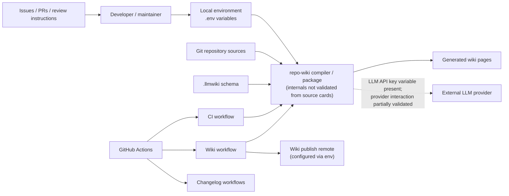
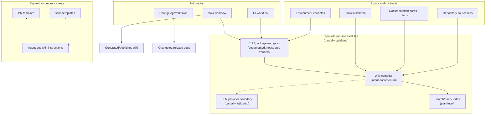
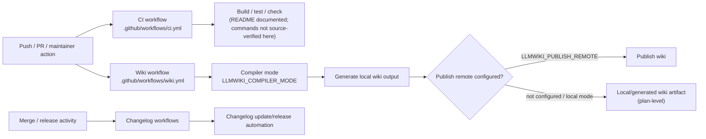

# Architecture

## Executive Architecture Summary

`repo-wiki` is documented as a tool/package for compiling repository knowledge into a persistent wiki, inspired by an “LLM Wiki” pattern where raw repository sources remain authoritative and generated wiki pages become a maintained knowledge artifact. This product intent is described in the implementation plan and rationale documentation, but the source cards available for this page contain mostly configuration, workflow, schema, issue-template, and agent-instruction files rather than application source files. Therefore, this architecture page treats runtime internals as partially validated and focuses on the repository surfaces that are directly evidenced. [docs/PLAN.md], [docs/WHY.md], [.llmwiki/schema.md]

The repository architecture visible from the available evidence has these major areas:

| Area | Responsibility | Evidence |
| --- | --- | --- |
| Wiki compilation / schema contract | Defines the generated wiki knowledge-base model and compilation expectations. | [.llmwiki/schema.md], [docs/PLAN.md] |
| Local and package execution | README describes a dual-role package/CLI model and compiled `dist/` verification flow, but no package manifest or TypeScript source cards were provided for this page. | [README.md] |
| CI validation | A CI workflow exists and is a high-authority source for automated checks, though detailed job steps are not included in the source-card excerpt. | [.github/workflows/ci.yml] |
| Wiki publishing workflow | A dedicated wiki workflow is configured and references `LLMWIKI_COMPILER_MODE` and `LLMWIKI_PUBLISH_REMOTE`, indicating an operational surface for generating and/or publishing wiki content. | [.github/workflows/wiki.yml] |
| Changelog automation | Two changelog workflows and a keep-a-changelog skill indicate automation and repository conventions around release/change documentation. | [.github/workflows/changelog-on-merge.yml], [.github/workflows/changelog-release.yml], [.github/skills/keep-a-changelog/SKILL.md] |
| GitHub collaboration surfaces | Issue templates, pull request template, Copilot review instructions, and agent files define human/AI contribution workflows. | [.github/ISSUE_TEMPLATE/epic.yml], [.github/ISSUE_TEMPLATE/task.yml], [.github/pull_request_template.md], [.github/copilot-review-instructions.md], [.github/agents/coordinator.agent.md] |

Key design decisions supported by available evidence:

1. **Repository sources are intended to remain the authoritative input to generated wiki pages.** This is supported by the schema-oriented `.llmwiki` area and the product plan/rationale. [.llmwiki/schema.md], [docs/PLAN.md], [docs/WHY.md]
2. **The project has both local and CI-operated modes.** Environment examples include local variables such as `GITHUB_REPOSITORY`, `GITHUB_TOKEN`, `LLMWIKI_COMPILER_MODE`, and `LLMWIKI_LLM_API_KEY`; the wiki workflow also references `LLMWIKI_COMPILER_MODE` and `LLMWIKI_PUBLISH_REMOTE`. [.env.example], [.github/workflows/wiki.yml]
3. **Automation is centered on GitHub workflows.** CI, wiki generation/publishing, and changelog workflows are present. [.github/workflows/ci.yml], [.github/workflows/wiki.yml], [.github/workflows/changelog-on-merge.yml], [.github/workflows/changelog-release.yml]
4. **Documentation and process automation are first-class repository assets.** Agent instructions, skills, issue templates, and PR/review guidance are present under `.github/` and `.pi/`. [.github/agents/docs.agent.md], [.github/skills/repo-wiki-navigation/SKILL.md], [.pi/AGENTS.md], [.pi/settings.json]

## System and Repository Context

The available repository evidence shows a tool-oriented repository with GitHub as the main external platform surface. The tool is documented as a CLI/package that can run locally or under automation, and the CI/wiki workflows show GitHub Actions as an operational control plane. [README.md], [.github/workflows/ci.yml], [.github/workflows/wiki.yml]

External surfaces and boundaries visible from source cards:

| Surface | Direction | Architectural role | Evidence |
| --- | --- | --- | --- |
| Local environment configuration | Input | Supplies repository identity, GitHub token, compiler mode, and LLM API key variable names. Values are not included here. | [.env.example] |
| GitHub Actions | Control plane | Runs CI, wiki generation/publishing, and changelog automation. | [.github/workflows/ci.yml], [.github/workflows/wiki.yml], [.github/workflows/changelog-on-merge.yml], [.github/workflows/changelog-release.yml] |
| GitHub repository / wiki remote | Input/output | The wiki workflow references publishing remote configuration; docs describe generated wiki artifacts. | [.github/workflows/wiki.yml], [docs/plans/ci-publishing.md], [docs/plans/github-action.md] |
| LLM provider API | External dependency, partially validated | An LLM API key variable is present; LLM compiler planning describes provider-agnostic OpenAI-style chat completions, but implementation details are not validated by source-code cards in this page. | [.env.example], [docs/plans/llm-compiler.md] |
| Generated wiki schema | Internal contract/output | `.llmwiki/schema.md` documents the knowledge-base/page schema contract used by generated pages. | [.llmwiki/schema.md] |
| GitHub issue and PR UI | Collaboration input | Issue templates and PR templates structure work intake and review. | [.github/ISSUE_TEMPLATE/epic.yml], [.github/ISSUE_TEMPLATE/task.yml], [.github/pull_request_template.md] |

The following context diagram is supported by workflow/configuration files and documentation cards. Runtime internals are intentionally shown as a single “repo-wiki compiler / package” box because application source files were not included in the source-card set for this page.

Evidence for this diagram: local variables are named in `.env.example`; CI/wiki/changelog workflows exist under `.github/workflows`; `.llmwiki/schema.md` defines schema documentation; issue/PR/review files exist under `.github`; the LLM provider relationship is only partially validated by `.env.example` and LLM compiler planning documentation. [.env.example], [.github/workflows/ci.yml], [.github/workflows/wiki.yml], [.github/workflows/changelog-on-merge.yml], [.github/workflows/changelog-release.yml], [.llmwiki/schema.md], [.github/ISSUE_TEMPLATE/epic.yml], [.github/ISSUE_TEMPLATE/task.yml], [.github/pull_request_template.md], [.github/copilot-review-instructions.md], [docs/plans/llm-compiler.md]

## Major Modules and Responsibilities

### Wiki Schema and Knowledge-Base Contract

The `.llmwiki` area contains schema documentation and is the clearest repository-local architectural contract in the available source cards. It documents the data model for generated wiki knowledge-base content. [.llmwiki/schema.md]

Responsibilities:

- Define the expected structure and metadata for generated wiki pages. [.llmwiki/schema.md]
- Support the product goal that repository sources are compiled into persistent wiki content. [docs/PLAN.md], [docs/WHY.md]
- Provide a basis for future or existing compiler behavior, though specific parser/compiler source files are not included in the available cards. [.llmwiki/schema.md]

### CLI / Package Runtime

The README describes the package as dual-role and states that local CLI and package verification flow run against compiled output in `dist/`. It also states that `npm test`, `npm run check`, and `npm run coverage` require a successful TypeScript build. These are documentation-card claims rather than direct package-script evidence in the provided source cards, so they are treated as partially validated. [README.md]

Responsibilities inferred from docs:

- Run locally, including via package/CLI usage. [README.md]
- Compile or verify generated output from TypeScript-built artifacts in `dist/`. [README.md]
- Support test, check, and coverage workflows after build. [README.md]

Open validation gap: no `package.json`, TypeScript source files, CLI entrypoint, or `dist/` files were included in the source-card set for this page, so exact commands, module boundaries, imports, and runtime entrypoints are not confirmed here. [README.md]

### GitHub Actions: CI

A CI workflow exists at `.github/workflows/ci.yml`. The source-card metadata identifies it as CI and notes background-work hints. [.github/workflows/ci.yml]

Responsibilities:

- Provide automated repository validation. [.github/workflows/ci.yml]
- Potentially run build/test/check steps, but the exact job graph and commands are not visible in the provided excerpt; README claims local verification uses `npm test`, `npm run check`, and `npm run coverage`. [.github/workflows/ci.yml], [README.md]

### GitHub Actions: Wiki Generation and Publishing

A wiki workflow exists at `.github/workflows/wiki.yml`. The source-card metadata identifies it as CI/configuration and records environment variables `LLMWIKI_COMPILER_MODE` and `LLMWIKI_PUBLISH_REMOTE`. [.github/workflows/wiki.yml]

Responsibilities:

- Operate wiki compilation and/or publishing as a background workflow. [.github/workflows/wiki.yml]
- Use compiler-mode configuration to control behavior. [.github/workflows/wiki.yml], [.env.example]
- Use a publish-remote configuration surface for wiki publishing. [.github/workflows/wiki.yml]

Related plan documentation describes CI publishing and GitHub Action architecture, including fetching existing wiki state and uploading/publishing local wiki artifacts. These are partially validated by the existence of the workflow, but exact implemented steps require workflow-body review beyond the source-card excerpt. [docs/plans/ci-publishing.md], [docs/plans/github-action.md], [.github/workflows/wiki.yml]

### GitHub Actions: Changelog Automation

Two workflows exist for changelog automation:

- `.github/workflows/changelog-on-merge.yml`, with `GH_TOKEN` noted in source-card metadata. [.github/workflows/changelog-on-merge.yml]
- `.github/workflows/changelog-release.yml`. [.github/workflows/changelog-release.yml]

The repository also includes a `keep-a-changelog` skill document under `.github/skills`, indicating process documentation for maintaining changelog format or behavior. [.github/skills/keep-a-changelog/SKILL.md]

Responsibilities:

- Update or validate changelog state around merges. [.github/workflows/changelog-on-merge.yml]
- Support release-related changelog automation. [.github/workflows/changelog-release.yml]
- Provide maintainer/agent guidance for changelog conventions. [.github/skills/keep-a-changelog/SKILL.md]

### LLM Compiler Boundary

The `.env.example` file includes `LLMWIKI_LLM_API_KEY`, and the LLM compiler plan says the first production LLM boundary should be provider-agnostic and compatible with OpenAI-style chat completions. This indicates an intended external LLM-provider boundary, but implementation-level details are not confirmed by source-code cards in the current evidence set. [.env.example], [docs/plans/llm-compiler.md]

Responsibilities, partially validated:

- Provide an LLM-backed compilation mode or capability. [.env.example], [docs/plans/llm-compiler.md]
- Keep provider details configurable rather than hard-coded, according to planning documentation. [docs/plans/llm-compiler.md]
- Support local and CI use with API credentials supplied through environment variables. [.env.example], [.github/workflows/wiki.yml]

### Search and Query Index

Search-index planning documentation describes building a local search index over generated wiki pages, source cards, and documentation cards so that `repo-wiki search` and `repo-wiki query` can route questions efficiently without external services. This is a plan-level, partially validated architectural module; no implementation source cards were provided for this page. [docs/plans/search-index.md]

Responsibilities, plan-level:

- Index generated wiki pages. [docs/plans/search-index.md]
- Index source and documentation cards. [docs/plans/search-index.md]
- Support search/query CLI behavior without requiring external services. [docs/plans/search-index.md]

### GitHub Collaboration and Agent Guidance

The repository includes structured collaboration files:

| Module/group | Responsibility | Evidence |
| --- | --- | --- |
| Issue templates | Standardize epic and task intake. | [.github/ISSUE_TEMPLATE/epic.yml], [.github/ISSUE_TEMPLATE/task.yml], [.github/ISSUE_TEMPLATE/config.yml] |
| Pull request template | Standardize PR descriptions and review checklists. | [.github/pull_request_template.md] |
| Copilot review instructions | Guide automated or assisted code review expectations. | [.github/copilot-review-instructions.md] |
| Agent instructions | Define role-specific guidance for coordinator, developer, docs, fixer, quality, and review agents. | [.github/agents/coordinator.agent.md], [.github/agents/developer.agent.md], [.github/agents/docs.agent.md], [.github/agents/fixer.agent.md], [.github/agents/quality.agent.md], [.github/agents/review.agent.md] |
| Skills | Provide reusable procedural guidance for changelog and repo-wiki navigation. | [.github/skills/keep-a-changelog/SKILL.md], [.github/skills/repo-wiki-navigation/SKILL.md] |
| `.pi` configuration/guidance | Additional project-agent guidance/settings. | [.pi/AGENTS.md], [.pi/settings.json] |

These are not runtime modules of the CLI unless consumed by tooling, but they are architectural process surfaces for how the repository is maintained. [.github/agents/coordinator.agent.md], [.pi/AGENTS.md]

### Component Diagram

This diagram is inferred from repository structure and workflow/config evidence rather than direct import graphs. It avoids source-code-level dependencies because no application source files/imports were included in the available cards.

Evidence: schema and environment files exist; workflows exist; README and plans describe CLI/package, compiler, search, and LLM boundaries; process assets are present under `.github` and `.pi`. [.llmwiki/schema.md], [.env.example], [.github/workflows/ci.yml], [.github/workflows/wiki.yml], [.github/workflows/changelog-on-merge.yml], [.github/workflows/changelog-release.yml], [README.md], [docs/plans/search-index.md], [docs/plans/llm-compiler.md], [.github/ISSUE_TEMPLATE/epic.yml], [.github/pull_request_template.md], [.github/agents/coordinator.agent.md], [.pi/AGENTS.md]

## Runtime, Data, and Control-Flow Relationships

Because no application source files or import graphs were included in the source-card set, runtime interactions are described at a coarse-grained level using configuration, workflow metadata, and partially validated documentation.

### Local Execution Flow

A conservative local execution model is:

1. A user configures environment variables, with names documented in `.env.example`: `GITHUB_REPOSITORY`, `GITHUB_TOKEN`, `LLMWIKI_COMPILER_MODE`, and `LLMWIKI_LLM_API_KEY`. [.env.example]
2. The user runs the package/CLI. The README describes install or `npx` usage and local development flows, but specific command implementation is not validated here. [README.md]
3. The compiler reads repository sources and documentation inputs and emits generated wiki pages following the `.llmwiki` schema contract. [.llmwiki/schema.md], [docs/PLAN.md]
4. If an LLM-backed compiler mode is used, an external LLM provider may be called using API credentials from the environment. This is partially validated by `LLMWIKI_LLM_API_KEY` and the LLM compiler plan, not by implementation source. [.env.example], [docs/plans/llm-compiler.md]

### CI / Wiki Workflow Flow

A conservative CI/wiki workflow model is:

1. GitHub Actions starts CI or wiki workflow jobs. [.github/workflows/ci.yml], [.github/workflows/wiki.yml]
2. The CI workflow validates the repository. Exact job steps are not available from the source-card excerpt. [.github/workflows/ci.yml]
3. The wiki workflow runs with wiki-related environment configuration, including `LLMWIKI_COMPILER_MODE` and `LLMWIKI_PUBLISH_REMOTE`. [.github/workflows/wiki.yml]
4. The wiki workflow may publish generated wiki output to a remote, based on the `LLMWIKI_PUBLISH_REMOTE` environment surface and CI-publishing plan. [.github/workflows/wiki.yml], [docs/plans/ci-publishing.md]

### Changelog Automation Flow

A conservative changelog flow is:

1. Merge or release events trigger changelog workflows. This trigger behavior is implied by workflow names and the keep-a-changelog skill, but exact event triggers require full workflow-body inspection. [.github/workflows/changelog-on-merge.yml], [.github/workflows/changelog-release.yml], [.github/skills/keep-a-changelog/SKILL.md]
2. The merge changelog workflow uses a GitHub token environment surface named `GH_TOKEN`. [.github/workflows/changelog-on-merge.yml]
3. Changelog release workflow handles release-oriented automation. [.github/workflows/changelog-release.yml]

### Data Model Relationships

The data model evidence available here is primarily the `.llmwiki/schema.md` documentation. It should be treated as the generated wiki contract, while source-code enforcement is not validated by this page’s evidence set. [.llmwiki/schema.md]

Likely data categories described or referenced across docs:

| Data category | Role | Evidence |
| --- | --- | --- |
| Source cards | Structured observations about repository source files used as compiler input. | [.llmwiki/schema.md], [docs/PLAN.md] |
| Documentation cards | Structured observations about documentation files with validation status. | [.llmwiki/schema.md], [docs/PLAN.md] |
| Wiki pages | Generated persistent knowledge-base pages. | [.llmwiki/schema.md], [docs/WHY.md] |
| Search index | Planned local index over generated pages and cards. | [docs/plans/search-index.md] |
| Human notes | Preserved human-maintained regions in generated wiki pages, required by generation contract. | [.llmwiki/schema.md] |

## Build, Test, Deployment, and Operational Surfaces

### Build and Test

The README states that local CLI/package verification runs against compiled output in `dist/`, and that `npm test`, `npm run check`, and `npm run coverage` require a successful TypeScript build. This is treated as partially validated because the source-card set did not include `package.json`, `tsconfig.json`, or TypeScript source files. [README.md]

The presence of `.tsbuildinfo` indicates TypeScript incremental build metadata exists in the repository snapshot or working tree evidence, but it is not sufficient to reconstruct the build graph. [.tsbuildinfo]

A CI workflow exists and likely provides automated validation, but exact job steps are not available in the source-card excerpt. [.github/workflows/ci.yml]

### Wiki Deployment / Publishing

The wiki workflow is the primary deployment/publishing surface visible in source cards. It is tagged as both CI and configuration evidence and includes environment variables:

- `LLMWIKI_COMPILER_MODE`
- `LLMWIKI_PUBLISH_REMOTE`

These indicate configurable compiler behavior and a configurable publish target. [.github/workflows/wiki.yml]

Plan documentation for CI publishing and GitHub Action support describes architecture involving existing wiki state, local wiki artifacts, and conditional publishing credentials. These claims are partially validated by the existence of the wiki workflow and its environment surface, but exact implemented behavior must be verified from the full workflow file and runtime code. [docs/plans/ci-publishing.md], [docs/plans/github-action.md], [.github/workflows/wiki.yml]

### Changelog Operations

Changelog automation is represented by two workflows and a skill document. The merge workflow uses a `GH_TOKEN` variable according to source-card metadata. [.github/workflows/changelog-on-merge.yml], [.github/workflows/changelog-release.yml], [.github/skills/keep-a-changelog/SKILL.md]

### Operational Configuration

Environment variable names present in source cards:

| Variable | Surface | Purpose as evidenced | Evidence |
| --- | --- | --- | --- |
| `GITHUB_REPOSITORY` | Local `.env.example` | Repository identity/configuration input. | [.env.example] |
| `GITHUB_TOKEN` | Local `.env.example` | GitHub API/authentication token surface. | [.env.example] |
| `GH_TOKEN` | Changelog workflow | GitHub token surface for changelog automation. | [.github/workflows/changelog-on-merge.yml] |
| `LLMWIKI_COMPILER_MODE` | Local and wiki workflow | Controls compiler mode. | [.env.example], [.github/workflows/wiki.yml] |
| `LLMWIKI_LLM_API_KEY` | Local `.env.example` | LLM provider API credential surface. | [.env.example] |
| `LLMWIKI_PUBLISH_REMOTE` | Wiki workflow | Wiki publishing remote configuration. | [.github/workflows/wiki.yml] |

No secret values are included here. Only variable names are documented. [.env.example], [.github/workflows/wiki.yml], [.github/workflows/changelog-on-merge.yml]

### Build/Test/Deploy Flow Diagram

This diagram is supported by the presence of workflow files and README claims, but exact internal command names and job steps are not validated from source-code/package-script evidence.

Evidence: workflow files exist for CI, wiki, and changelog automation; README documents build/test/check/coverage expectations; wiki workflow exposes compiler mode and publish remote variables; GitHub Action/publishing plans describe local artifact and publish behavior. [.github/workflows/ci.yml], [.github/workflows/wiki.yml], [.github/workflows/changelog-on-merge.yml], [.github/workflows/changelog-release.yml], [README.md], [docs/plans/github-action.md], [docs/plans/ci-publishing.md]

## Cross-Cutting Concerns

### Configuration

Configuration is primarily environment-variable based for local execution and GitHub Actions. `.env.example` documents local variable names for GitHub repository/authentication and LLM/wiki compiler behavior. The wiki workflow documents wiki compiler and publish remote variables, and the changelog merge workflow documents a GitHub token variable. [.env.example], [.github/workflows/wiki.yml], [.github/workflows/changelog-on-merge.yml]

Configuration claims should be interpreted conservatively because the available evidence provides variable names but not the code paths that read them. [.env.example]

### Security and Secret Handling

The repository uses token/API-key variable names for GitHub and LLM provider access. No secret values are present in this architecture page. [.env.example], [.github/workflows/changelog-on-merge.yml]

Security-relevant surfaces:

| Surface | Risk | Evidence |
| --- | --- | --- |
| `GITHUB_TOKEN` / `GH_TOKEN` | GitHub API permissions and write operations, especially changelog or wiki publishing. | [.env.example], [.github/workflows/changelog-on-merge.yml] |
| `LLMWIKI_LLM_API_KEY` | External LLM provider credential. | [.env.example] |
| `LLMWIKI_PUBLISH_REMOTE` | Determines wiki publishing destination; misconfiguration could publish to an unintended remote. | [.github/workflows/wiki.yml] |
| Generated wiki output | May expose repository-derived content if compiled/published broadly. | [.llmwiki/schema.md], [.github/workflows/wiki.yml] |

### APIs and External Dependencies

The strongest external dependency evidence is GitHub Actions and GitHub repository/wiki publishing configuration. [.github/workflows/ci.yml], [.github/workflows/wiki.yml]

An external LLM API boundary is indicated by `LLMWIKI_LLM_API_KEY` and the LLM compiler plan, which describes OpenAI-style chat completions compatibility. This remains partially validated until implementation source is inspected. [.env.example], [docs/plans/llm-compiler.md]

### Data Model and Schema Governance

`.llmwiki/schema.md` is the central schema/data-model artifact. It should be treated as the contract for generated wiki pages and related metadata unless contradicted by implementation source in future evidence. [.llmwiki/schema.md]

The product documentation frames the wiki as a persistent compounding artifact generated from raw sources. That architectural intent should be validated against code before asserting exact current runtime behavior. [docs/PLAN.md], [docs/WHY.md]

### Documentation Trust Model

This page follows a conservative trust model:

1. Configuration/workflow/schema files are treated as high-authority evidence for surfaces and operational configuration. [.github/workflows/ci.yml], [.github/workflows/wiki.yml], [.llmwiki/schema.md], [.env.example]
2. README and plan docs are used for intent and terminology but are marked partially validated where application source or package scripts are not present. [README.md], [docs/PLAN.md], [docs/plans/llm-compiler.md]
3. Stale documentation, such as the incremental-mode plan, is not used as current behavior evidence. [docs/plans/incremental-mode.md]

### Repository Process and AI-Assisted Maintenance

The repository includes multiple agent instruction files and skills, indicating that AI-assisted or role-based maintenance is part of the repository workflow. These files guide contributors or agents but do not by themselves prove runtime behavior. [.github/agents/coordinator.agent.md], [.github/agents/developer.agent.md], [.github/agents/docs.agent.md], [.github/agents/fixer.agent.md], [.github/agents/quality.agent.md], [.github/agents/review.agent.md], [.github/skills/repo-wiki-navigation/SKILL.md], [.pi/AGENTS.md]

## Caveats and Open Questions

### Caveats

- **Application source code was not included in the source-card set.** This page cannot verify exact CLI entrypoints, TypeScript modules, imports, compiler classes, provider adapters, or search-index implementation. [README.md]
- **Package scripts were not directly available.** README claims about `npm test`, `npm run check`, `npm run coverage`, TypeScript build requirements, and `dist/` verification are treated as partially validated documentation claims. [README.md]
- **Workflow internals are only partially visible from source-card metadata.** The existence of CI/wiki/changelog workflows and their recorded environment variables is high-confidence, but exact triggers, permissions, job steps, and artifact handling require inspecting the full YAML contents. [.github/workflows/ci.yml], [.github/workflows/wiki.yml], [.github/workflows/changelog-on-merge.yml], [.github/workflows/changelog-release.yml]
- **The LLM provider boundary is not implementation-verified here.** It is supported by `LLMWIKI_LLM_API_KEY` and LLM compiler planning documentation, but no provider adapter code was included. [.env.example], [docs/plans/llm-compiler.md]
- **The search/query index is plan-level in this evidence set.** The search-index plan describes intended architecture, but implementation is not validated by source cards. [docs/plans/search-index.md]
- **Diagrams in this page are coarse-grained.** They are based on repository structure, workflow/config evidence, and partially validated documentation, not on direct import graphs or runtime traces. [.github/workflows/wiki.yml], [.llmwiki/schema.md], [README.md]

### Open Questions

1. What are the actual CLI entrypoints, exported APIs, and package scripts in `package.json`? [README.md]
2. Which TypeScript modules implement source-card extraction, documentation-card validation, wiki-page generation, publishing, search, and LLM compilation? [docs/PLAN.md], [docs/plans/llm-compiler.md], [docs/plans/search-index.md]
3. Does the current wiki workflow publish directly to a GitHub Wiki remote, upload artifacts, open pull requests, or support multiple modes? [.github/workflows/wiki.yml], [docs/plans/github-action.md], [docs/plans/ci-publishing.md]
4. How is `.llmwiki/schema.md` enforced: by runtime validation, tests, generated types, or documentation-only convention? [.llmwiki/schema.md]
5. What permissions are granted to GitHub Actions workflows, especially those using GitHub tokens or publishing remotes? [.github/workflows/wiki.yml], [.github/workflows/changelog-on-merge.yml]
6. Is incremental mode implemented, planned, or stale-only? The incremental-mode plan is marked stale and should not be treated as current behavior without code/workflow evidence. [docs/plans/incremental-mode.md]
7. Are agent and skill files consumed by automation, or are they purely human/AI-contributor guidance? [.github/agents/coordinator.agent.md], [.github/skills/repo-wiki-navigation/SKILL.md], [.pi/AGENTS.md]

<!-- HUMAN_NOTES_START -->
<!-- HUMAN_NOTES_END -->
