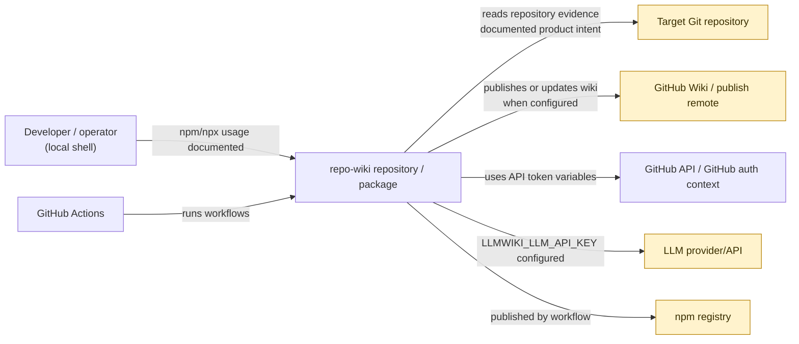
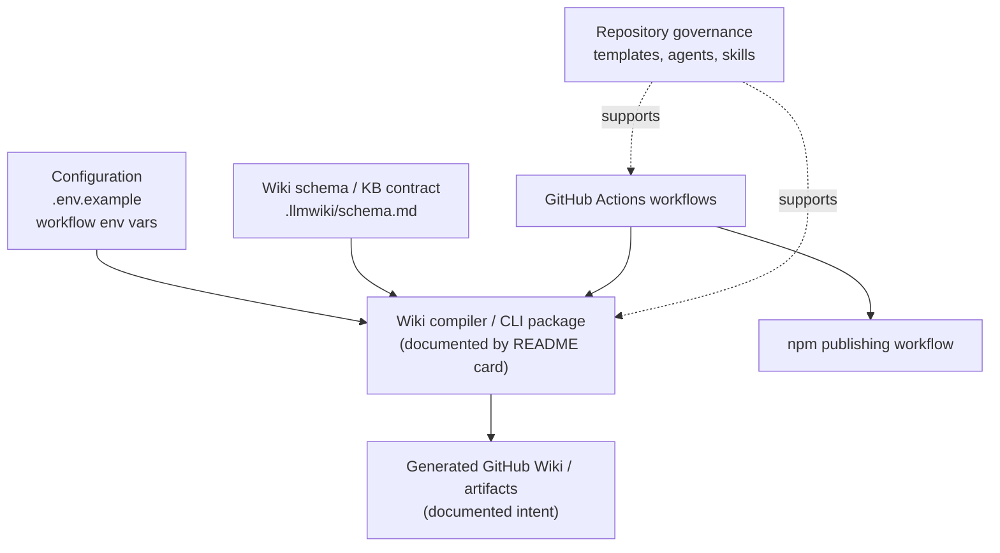
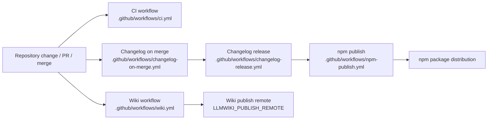

# Architecture

## Executive Architecture Summary

`repo-wiki` is a repository-to-GitHub-Wiki documentation system whose documented goal is to compile repository evidence into a maintained wiki artifact; this product intent is described in the documentation cards for `README.md`, `docs/PLAN.md`, and `docs/WHY.md`, but the supplied source cards for this page do **not** include the implementation source files that would verify the full runtime architecture. The strongest available evidence for the current repository architecture is therefore configuration, CI workflows, schema documentation, issue templates, agent instructions, and environment examples. [README.md documentation card; docs/PLAN.md documentation card; docs/WHY.md documentation card; `.env.example`; `.github/workflows/wiki.yml`; `.llmwiki/schema.md`]

The architecture visible from the supplied evidence has these major areas:

| Area | Responsibility visible from evidence | Evidence |
|---|---|---|
| Wiki compiler / CLI surface | The README documentation card references `npx repo-wiki --help` and package installation commands, indicating an npm-distributed command-line tool. This is partially validated documentation evidence rather than direct implementation evidence in the supplied cards. | [README.md documentation card] |
| Wiki schema / generated knowledge base contract | `.llmwiki/schema.md` is identified as data-model documentation, indicating that the repository maintains a schema or structural contract for generated wiki content. | [`.llmwiki/schema.md`] |
| CI and publishing automation | GitHub Actions workflows exist for CI, wiki generation/publishing, changelog handling, release, and npm publishing. | [`.github/workflows/ci.yml`; `.github/workflows/wiki.yml`; `.github/workflows/changelog-on-merge.yml`; `.github/workflows/changelog-release.yml`; `.github/workflows/npm-publish.yml`] |
| Runtime configuration | `.env.example` declares environment variables for GitHub repository access, GitHub token access, compiler mode, and an LLM API key. The wiki workflow also references compiler and publishing configuration variables. | [`.env.example`; `.github/workflows/wiki.yml`] |
| Repository workflow governance | Issue templates, PR template, Copilot review instructions, agent instructions, and skills files define development and review process surfaces. | [`.github/ISSUE_TEMPLATE/config.yml`; `.github/ISSUE_TEMPLATE/epic.yml`; `.github/ISSUE_TEMPLATE/task.yml`; `.github/pull_request_template.md`; `.github/copilot-review-instructions.md`; `.github/agents/coordinator.agent.md`; `.github/agents/developer.agent.md`; `.github/agents/docs.agent.md`; `.github/agents/fixer.agent.md`; `.github/agents/quality.agent.md`; `.github/agents/review.agent.md`; `.github/skills/keep-a-changelog/SKILL.md`; `.github/skills/repo-wiki-navigation/SKILL.md`] |

Key design decisions visible from available evidence:

- The project is designed to operate both locally and in GitHub-hosted automation, because local environment variables are documented in `.env.example` and GitHub Actions workflows exist for CI and wiki publishing. [`.env.example`; `.github/workflows/ci.yml`; `.github/workflows/wiki.yml`]
- The project treats generated wiki output as a structured artifact with an explicit schema/contract, based on the presence of `.llmwiki/schema.md`. [`.llmwiki/schema.md`]
- The project has a publishing/distribution surface through npm, based on the presence of `.github/workflows/npm-publish.yml` and README documentation card commands using npm installation and `npx`. [`.github/workflows/npm-publish.yml`; README.md documentation card]
- The repository includes process automation and human/agent collaboration conventions through issue templates, PR templates, review instructions, and multiple `.github/agents/*.md` files. [`.github/ISSUE_TEMPLATE/epic.yml`; `.github/ISSUE_TEMPLATE/task.yml`; `.github/pull_request_template.md`; `.github/copilot-review-instructions.md`; `.github/agents/coordinator.agent.md`; `.github/agents/developer.agent.md`; `.github/agents/docs.agent.md`; `.github/agents/fixer.agent.md`; `.github/agents/quality.agent.md`; `.github/agents/review.agent.md`]

## System and Repository Context

The repository boundary visible in the supplied cards consists of a GitHub repository that contains:

- GitHub Actions workflows for CI, wiki automation, changelog/release automation, and npm publishing. [`.github/workflows/ci.yml`; `.github/workflows/wiki.yml`; `.github/workflows/changelog-on-merge.yml`; `.github/workflows/changelog-release.yml`; `.github/workflows/npm-publish.yml`]
- Environment configuration examples for local or operational runs, including `GITHUB_REPOSITORY`, `GITHUB_TOKEN`, `LLMWIKI_COMPILER_MODE`, and `LLMWIKI_LLM_API_KEY`. Values are not copied here. [`.env.example`]
- A wiki schema/data-model document under `.llmwiki/schema.md`. [`.llmwiki/schema.md`]
- GitHub issue templates, PR template, Copilot review instructions, and agent/skill markdown documents that shape repository maintenance workflows. [`.github/ISSUE_TEMPLATE/config.yml`; `.github/ISSUE_TEMPLATE/epic.yml`; `.github/ISSUE_TEMPLATE/task.yml`; `.github/pull_request_template.md`; `.github/copilot-review-instructions.md`; `.github/agents/coordinator.agent.md`; `.github/agents/developer.agent.md`; `.github/agents/docs.agent.md`; `.github/agents/fixer.agent.md`; `.github/agents/quality.agent.md`; `.github/agents/review.agent.md`; `.github/skills/keep-a-changelog/SKILL.md`; `.github/skills/repo-wiki-navigation/SKILL.md`]

External surfaces supported by source evidence include:

| External surface | Role | Evidence strength | Evidence |
|---|---|---:|---|
| GitHub repository and GitHub API/token context | Source repository context and authenticated operations are implied by `GITHUB_REPOSITORY`, `GITHUB_TOKEN`, and workflow variables. | Medium | [`.env.example`; `.github/workflows/changelog-on-merge.yml`; `.github/workflows/wiki.yml`] |
| GitHub Actions | Automation runtime for CI, wiki workflow, changelog, release, and npm publishing. | High | [`.github/workflows/ci.yml`; `.github/workflows/wiki.yml`; `.github/workflows/changelog-on-merge.yml`; `.github/workflows/changelog-release.yml`; `.github/workflows/npm-publish.yml`] |
| GitHub Wiki remote | The wiki workflow references `LLMWIKI_PUBLISH_REMOTE`, indicating a configurable publishing remote for wiki output. | Medium | [`.github/workflows/wiki.yml`] |
| LLM provider/API | `.env.example` includes `LLMWIKI_LLM_API_KEY`, and the LLM compiler plan documentation card says the first production LLM boundary should be provider-agnostic and OpenAI-style compatible. Direct implementation code was not supplied. | Low to medium | [`.env.example`; docs/plans/llm-compiler.md documentation card] |
| npm package registry / npm user installation | npm publishing workflow exists; README documentation card includes `npm install @mfittko/repo-wiki` and `npx repo-wiki --help`. | Medium | [`.github/workflows/npm-publish.yml`; README.md documentation card] |

The following context diagram is limited to relationships supported by configuration, workflow names, and documentation cards. It should be read as a repository-boundary diagram, not as verified implementation call flow.

Diagram evidence: local npm/npx usage is from the README documentation card; workflow automation and publishing surfaces are from `.github/workflows/*.yml`; environment-variable based GitHub and LLM surfaces are from `.env.example` and `.github/workflows/wiki.yml`. Implementation-level behavior was not verified from source files in the supplied cards. [README.md documentation card; `.github/workflows/ci.yml`; `.github/workflows/wiki.yml`; `.github/workflows/npm-publish.yml`; `.env.example`]

## Major Modules and Responsibilities

### Wiki compiler and CLI package

The README documentation card identifies package installation and a command-line help surface using `npm install @mfittko/repo-wiki`, local tarball installation, and `npx repo-wiki --help`. This supports the existence of a CLI/package surface, but no TypeScript/JavaScript source files or `package.json` card were supplied for this architecture pass, so command names, internal entry points, package scripts, and exported APIs cannot be verified here. [README.md documentation card]

Likely responsibilities, based only on documentation cards and configuration evidence:

- Compile repository evidence into wiki pages. [README.md documentation card; docs/PLAN.md documentation card]
- Support a compiler mode selected by `LLMWIKI_COMPILER_MODE`. [`.env.example`; `.github/workflows/wiki.yml`]
- Optionally interact with an LLM provider through `LLMWIKI_LLM_API_KEY`. [`.env.example`; docs/plans/llm-compiler.md documentation card]
- Support local execution and CI execution. [README.md documentation card; `.github/workflows/wiki.yml`]

Claim status: **partially verified**; the CLI and package surface are documented, but implementation files were not among the supplied source cards. [README.md documentation card]

### Wiki schema and knowledge-base contract

`.llmwiki/schema.md` is classified as data-model documentation. Its presence indicates that the generated wiki has an expected structure or schema used to guide compilation, validation, or maintenance. The exact schema fields and enforcement mechanism cannot be confirmed from the source-card excerpt alone. [`.llmwiki/schema.md`]

Likely responsibilities visible from available evidence:

- Define terminology and structure for generated wiki pages. [`.llmwiki/schema.md`]
- Provide a contract between repository evidence and the compiled GitHub Wiki artifact. [`.llmwiki/schema.md`; docs/PLAN.md documentation card]
- Support documentation navigation or maintenance workflows together with the repo-wiki navigation skill. [`.llmwiki/schema.md`; `.github/skills/repo-wiki-navigation/SKILL.md`]

Claim status: **partially verified**; schema documentation exists, but runtime usage by code was not verified. [`.llmwiki/schema.md`]

### GitHub Actions automation

The repository contains separate workflows for:

| Workflow | Visible responsibility | Evidence |
|---|---|---|
| `ci.yml` | Continuous integration / test automation surface. Exact jobs and commands are not visible from the supplied excerpt. | [`.github/workflows/ci.yml`] |
| `wiki.yml` | Wiki generation/publishing automation; references `LLMWIKI_COMPILER_MODE` and `LLMWIKI_PUBLISH_REMOTE`. | [`.github/workflows/wiki.yml`] |
| `changelog-on-merge.yml` | Changelog automation on merge; references `GH_TOKEN`. | [`.github/workflows/changelog-on-merge.yml`] |
| `changelog-release.yml` | Release/changelog workflow surface. | [`.github/workflows/changelog-release.yml`] |
| `npm-publish.yml` | npm package publishing automation surface. | [`.github/workflows/npm-publish.yml`] |

These workflows are the clearest operational architecture evidence supplied for this page. [`.github/workflows/ci.yml`; `.github/workflows/wiki.yml`; `.github/workflows/changelog-on-merge.yml`; `.github/workflows/changelog-release.yml`; `.github/workflows/npm-publish.yml`]

### Configuration and environment module

`.env.example` documents environment variables used by local or operational execution:

| Variable name | Architectural implication | Evidence |
|---|---|---|
| `GITHUB_REPOSITORY` | The tool or workflows need to know the GitHub repository identity. | [`.env.example`] |
| `GITHUB_TOKEN` | Authenticated GitHub operations may be supported. | [`.env.example`] |
| `LLMWIKI_COMPILER_MODE` | The compiler has at least one configurable mode. | [`.env.example`; `.github/workflows/wiki.yml`] |
| `LLMWIKI_LLM_API_KEY` | The compiler can be configured with an LLM API credential. | [`.env.example`] |
| `LLMWIKI_PUBLISH_REMOTE` | The wiki workflow can be configured with a publish remote. | [`.github/workflows/wiki.yml`] |
| `GH_TOKEN` | Changelog-on-merge workflow uses GitHub token context. | [`.github/workflows/changelog-on-merge.yml`] |

No variable values are reproduced in this page. [`.env.example`; `.github/workflows/wiki.yml`; `.github/workflows/changelog-on-merge.yml`]

### Repository governance and contributor workflow module

The repository includes GitHub-native governance artifacts:

- Issue template configuration and separate epic/task issue templates. [`.github/ISSUE_TEMPLATE/config.yml`; `.github/ISSUE_TEMPLATE/epic.yml`; `.github/ISSUE_TEMPLATE/task.yml`]
- Pull request template. [`.github/pull_request_template.md`]
- Copilot review instructions. [`.github/copilot-review-instructions.md`]
- Agent role instructions for coordinator, developer, docs, fixer, quality, and review roles. [`.github/agents/coordinator.agent.md`; `.github/agents/developer.agent.md`; `.github/agents/docs.agent.md`; `.github/agents/fixer.agent.md`; `.github/agents/quality.agent.md`; `.github/agents/review.agent.md`]
- Skills for changelog maintenance and repo-wiki navigation. [`.github/skills/keep-a-changelog/SKILL.md`; `.github/skills/repo-wiki-navigation/SKILL.md`]

These files do not prove runtime behavior of the compiler, but they are part of the operational architecture of repository maintenance and documentation quality. [`.github/ISSUE_TEMPLATE/config.yml`; `.github/pull_request_template.md`; `.github/copilot-review-instructions.md`; `.github/agents/coordinator.agent.md`; `.github/skills/keep-a-changelog/SKILL.md`; `.github/skills/repo-wiki-navigation/SKILL.md`]

### TypeScript/build artifact indicator

`.tsbuildinfo` is present and identified with a background-work hint. This suggests the repository uses TypeScript incremental build metadata or has previously produced such metadata, but the supplied source cards do not include `tsconfig.json`, `package.json`, or TypeScript source files, so the TypeScript build architecture cannot be described in detail. [`.tsbuildinfo`]

Claim status: **weakly verified**; the artifact exists, but build configuration and source structure were not supplied. [`.tsbuildinfo`]

### Component/module diagram

The following diagram is inferred from repository structure and workflow/configuration surfaces. It is **not** a verified import graph because no implementation imports were supplied in the source cards.

Diagram evidence and limitations: workflow/configuration/schema/governance nodes are directly supported by source paths; the central compiler/CLI node is supported by documentation cards, not supplied implementation source. [`.env.example`; `.github/workflows/wiki.yml`; `.llmwiki/schema.md`; `.github/workflows/ci.yml`; `.github/workflows/npm-publish.yml`; `.github/ISSUE_TEMPLATE/task.yml`; `.github/agents/developer.agent.md`; README.md documentation card]

## Runtime, Data, and Control-Flow Relationships

The supplied source cards do not include implementation imports, function/class symbols, package manifest scripts, or executable source files. Therefore, runtime control flow cannot be described at code-level precision. The relationships below are conservative and based on environment configuration, workflow presence, and documentation cards.

### Local execution path

A local execution path is documented but not implementation-verified:

1. A developer installs the package or local tarball. [README.md documentation card]
2. A developer invokes the CLI help command with `npx repo-wiki --help`. [README.md documentation card]
3. Local execution can be configured using environment variables such as `GITHUB_REPOSITORY`, `GITHUB_TOKEN`, `LLMWIKI_COMPILER_MODE`, and `LLMWIKI_LLM_API_KEY`. [`.env.example`]
4. The compiler is intended to generate wiki content from repository evidence, according to the README and product-plan documentation cards. [README.md documentation card; docs/PLAN.md documentation card]

Claim status: **partially verified**; local package/CLI usage is documented, and environment variables are present, but no source-level entry point was supplied. [README.md documentation card; `.env.example`]

### GitHub Actions wiki path

A CI-hosted wiki execution path is visible at the workflow/configuration level:

1. GitHub Actions provides workflow execution. [`.github/workflows/wiki.yml`]
2. The wiki workflow uses `LLMWIKI_COMPILER_MODE` and `LLMWIKI_PUBLISH_REMOTE`, indicating configurable compiler mode and publish destination. [`.github/workflows/wiki.yml`]
3. The target output is a wiki or publish remote, based on the variable name and documentation cards for CI publishing and GitHub Action plans. [`.github/workflows/wiki.yml`; docs/plans/ci-publishing.md documentation card; docs/plans/github-action.md documentation card]

Claim status: **partially verified**; workflow exists and variables are identified, but job steps were not available in the excerpt. [`.github/workflows/wiki.yml`]

### LLM boundary

The only source-card evidence for an LLM boundary is `LLMWIKI_LLM_API_KEY` in `.env.example`. The LLM compiler plan documentation card further describes a provider-agnostic OpenAI-style chat-completions boundary, but that is plan documentation rather than verified implementation in the supplied cards. [`.env.example`; docs/plans/llm-compiler.md documentation card]

Claim status: **low confidence**; configuration supports the existence of an LLM integration point, but the concrete provider adapter, request/response schema, and error handling are not visible. [`.env.example`]

### Data model / generated content flow

The high-level data relationship is:

- Repository inputs and configuration feed a compiler. [README.md documentation card; `.env.example`]
- The compiler is intended to produce GitHub Wiki content. [README.md documentation card; docs/PLAN.md documentation card]
- `.llmwiki/schema.md` documents the schema/data model for that wiki content. [`.llmwiki/schema.md`]

Because no implementation source was supplied, this should not be treated as a verified parser/transformer pipeline. [`.llmwiki/schema.md`; README.md documentation card]

## Build, Test, Deployment, and Operational Surfaces

### CI and automation workflows

The repository has five GitHub Actions workflow files in the supplied source cards:

| Workflow path | Operational surface | Confidence | Evidence |
|---|---|---:|---|
| `.github/workflows/ci.yml` | Continuous integration / validation. | Medium | [`.github/workflows/ci.yml`] |
| `.github/workflows/wiki.yml` | Wiki generation and/or publishing workflow; includes compiler mode and publish remote environment configuration. | Medium | [`.github/workflows/wiki.yml`] |
| `.github/workflows/changelog-on-merge.yml` | Changelog automation after merge; references `GH_TOKEN`. | Medium | [`.github/workflows/changelog-on-merge.yml`] |
| `.github/workflows/changelog-release.yml` | Release/changelog automation. | Medium | [`.github/workflows/changelog-release.yml`] |
| `.github/workflows/npm-publish.yml` | npm package publishing automation. | Medium | [`.github/workflows/npm-publish.yml`] |

The exact triggers, job names, package-manager commands, test commands, and artifact handling are not visible from the excerpts. [`.github/workflows/ci.yml`; `.github/workflows/wiki.yml`; `.github/workflows/changelog-on-merge.yml`; `.github/workflows/changelog-release.yml`; `.github/workflows/npm-publish.yml`]

### Package and build evidence

The README documentation card references npm installation and `npx repo-wiki --help`, and the repository includes an npm publishing workflow. This supports an npm package distribution model, but the package manifest itself was not supplied as a source card. [README.md documentation card; `.github/workflows/npm-publish.yml`]

`.tsbuildinfo` suggests TypeScript build tooling is or was used, but no TypeScript source or `tsconfig.json` was supplied. [`.tsbuildinfo`]

### Build/test/deploy flow diagram

This diagram is based on workflow presence and documented package/wiki surfaces. It does not encode exact GitHub Actions job steps.

Diagram evidence and limitations: the workflow files exist, and `wiki.yml` exposes `LLMWIKI_PUBLISH_REMOTE`; sequencing between changelog, release, and npm publish is inferred from workflow names and should be verified against full workflow contents before being treated as exact behavior. [`.github/workflows/ci.yml`; `.github/workflows/wiki.yml`; `.github/workflows/changelog-on-merge.yml`; `.github/workflows/changelog-release.yml`; `.github/workflows/npm-publish.yml`]

## Cross-Cutting Concerns

### Configuration

Configuration is environment-variable driven at least for repository identity, GitHub authentication, compiler mode, LLM API access, and wiki publish remote. [`.env.example`; `.github/workflows/wiki.yml`; `.github/workflows/changelog-on-merge.yml`]

Known configuration variables from supplied evidence:

| Variable | Source | Notes |
|---|---|---|
| `GITHUB_REPOSITORY` | `.env.example` | Repository identity/configuration input. [`.env.example`] |
| `GITHUB_TOKEN` | `.env.example` | GitHub authentication input; value must be treated as secret. [`.env.example`] |
| `GH_TOKEN` | `.github/workflows/changelog-on-merge.yml` | GitHub token context for changelog automation; value must be treated as secret. [`.github/workflows/changelog-on-merge.yml`] |
| `LLMWIKI_COMPILER_MODE` | `.env.example`, `.github/workflows/wiki.yml` | Selects compiler mode. Exact allowed values are not visible in supplied cards. [`.env.example`; `.github/workflows/wiki.yml`] |
| `LLMWIKI_LLM_API_KEY` | `.env.example` | LLM provider credential; value must be treated as secret. [`.env.example`] |
| `LLMWIKI_PUBLISH_REMOTE` | `.github/workflows/wiki.yml` | Configures wiki publishing remote. [`.github/workflows/wiki.yml`] |

### Security and secret handling

The repository has environment variables that are likely sensitive, including GitHub tokens and an LLM API key. No secret values are included in this page. Workflows and local runs should avoid logging token values or publishing `.env` contents. [`.env.example`; `.github/workflows/changelog-on-merge.yml`; `.github/workflows/wiki.yml`]

The `.gitignore` file exists, but the supplied excerpt does not show its rules, so whether `.env` files, build outputs, or generated artifacts are ignored cannot be confirmed here. [`.gitignore`]

### API boundaries

Visible API boundaries include:

- CLI/package boundary documented by README installation and `npx` usage. [README.md documentation card]
- GitHub API/auth boundary implied by GitHub token variables and workflows. [`.env.example`; `.github/workflows/changelog-on-merge.yml`; `.github/workflows/wiki.yml`]
- LLM provider boundary implied by `LLMWIKI_LLM_API_KEY` and described in the LLM compiler plan documentation card. [`.env.example`; docs/plans/llm-compiler.md documentation card]
- GitHub Wiki/publish remote boundary implied by `LLMWIKI_PUBLISH_REMOTE` in the wiki workflow. [`.github/workflows/wiki.yml`]
- npm publishing boundary implied by `npm-publish.yml`. [`.github/workflows/npm-publish.yml`]

### Data models and generated documentation contract

`.llmwiki/schema.md` is the central visible data-model artifact. It should be treated as authoritative documentation for wiki page shape only to the extent that implementation or tests validate it; such validation was not present in the supplied cards. [`.llmwiki/schema.md`]

### Documentation trust model

Several architecture-related documents are available only as documentation cards and are marked `partially_validated` or `stale`:

| Documentation card | Status | Architectural use in this page |
|---|---|---|
| `README.md` | `partially_validated` | Used for package/CLI and high-level behavior claims with caveats. |
| `docs/PLAN.md` | `partially_validated` | Used for product vision and intended wiki compiler behavior. |
| `docs/WHY.md` | `partially_validated` | Used only for rationale/context, not operational behavior. |
| `docs/plans/ci-publishing.md` | `partially_validated` | Used cautiously for CI/wiki publishing intent. |
| `docs/plans/github-action.md` | `partially_validated` | Used cautiously for GitHub Action publishing/artifact intent. |
| `docs/plans/incremental-mode.md` | `stale` | Not used for current behavior claims. |
| `docs/plans/llm-compiler.md` | `partially_validated` | Used cautiously for intended LLM boundary design. |

Where documentation and source configuration differ, source configuration should be preferred. No direct code-vs-doc conflict could be established from the supplied cards because implementation source files were not included. [`.env.example`; `.github/workflows/wiki.yml`; `.llmwiki/schema.md`]

### Contributor and agent workflow

The repository formalizes contributor workflows through issue templates and PR templates, and it also includes role-specific agent instructions and skills. These files are part of the repository’s collaboration architecture rather than runtime application architecture. [`.github/ISSUE_TEMPLATE/config.yml`; `.github/ISSUE_TEMPLATE/epic.yml`; `.github/ISSUE_TEMPLATE/task.yml`; `.github/pull_request_template.md`; `.github/agents/coordinator.agent.md`; `.github/agents/developer.agent.md`; `.github/agents/docs.agent.md`; `.github/agents/fixer.agent.md`; `.github/agents/quality.agent.md`; `.github/agents/review.agent.md`; `.github/skills/keep-a-changelog/SKILL.md`; `.github/skills/repo-wiki-navigation/SKILL.md`]

## Caveats and Open Questions

### Caveats

- Implementation source files were not included in the supplied source cards, so this architecture page cannot verify internal modules, import dependencies, class/function boundaries, parser behavior, compiler pipeline stages, or CLI entry-point code. [`.tsbuildinfo`; README.md documentation card]
- `package.json`, lockfiles, TypeScript configuration, and test files were not among the supplied source cards, so package scripts, dependency lists, test commands, build targets, and runtime dependencies cannot be confirmed. [`.github/workflows/ci.yml`; `.github/workflows/npm-publish.yml`; `.tsbuildinfo`]
- The Mermaid context, component, and build/deploy diagrams are based on workflow files, environment variables, and documentation cards. They are not verified implementation import graphs or exact workflow job graphs. [`.github/workflows/ci.yml`; `.github/workflows/wiki.yml`; `.github/workflows/npm-publish.yml`; `.env.example`; `.llmwiki/schema.md`]
- The LLM integration boundary is inferred from `LLMWIKI_LLM_API_KEY` and partially validated plan documentation; no provider adapter implementation was visible. [`.env.example`; docs/plans/llm-compiler.md documentation card]
- The wiki publishing behavior is inferred from the `wiki.yml` workflow path/name and `LLMWIKI_PUBLISH_REMOTE`; exact publishing commands and failure behavior were not visible in the supplied excerpt. [`.github/workflows/wiki.yml`]
- The existence of `.tsbuildinfo` suggests TypeScript build metadata, but without `tsconfig.json` or source files, TypeScript architecture cannot be described confidently. [`.tsbuildinfo`]
- `.gitignore` exists, but its contents were not visible in the supplied excerpt, so ignored secrets/artifacts cannot be validated. [`.gitignore`]

### Open questions

1. What are the concrete runtime modules and import relationships for the compiler, CLI, scanner, LLM boundary, and wiki writer? Implementation source files are needed to answer this. [README.md documentation card; `.tsbuildinfo`]
2. What are the exact package scripts for build, test, lint, typecheck, wiki generation, and release? `package.json` was not included in the supplied cards. [`.github/workflows/ci.yml`; `.github/workflows/npm-publish.yml`]
3. What schema fields are defined in `.llmwiki/schema.md`, and are they enforced by tests or runtime validation? [`.llmwiki/schema.md`]
4. What values are valid for `LLMWIKI_COMPILER_MODE`, and how do modes affect runtime behavior? [`.env.example`; `.github/workflows/wiki.yml`]
5. Does the current implementation support incremental mode? The incremental-mode plan card is marked stale, so no current behavior should be assumed. [docs/plans/incremental-mode.md documentation card]
6. Which LLM providers are supported today, and is the documented provider-agnostic/OpenAI-style boundary implemented? [`.env.example`; docs/plans/llm-compiler.md documentation card]
7. Does `wiki.yml` publish directly to a GitHub Wiki repository, upload workflow artifacts, or support both? The documentation cards mention publishing and artifacts, but full workflow/job evidence is needed. [`.github/workflows/wiki.yml`; docs/plans/github-action.md documentation card; docs/plans/ci-publishing.md documentation card]
8. What release conditions trigger `npm-publish.yml`, and how does it relate to `changelog-release.yml`? [`.github/workflows/changelog-release.yml`; `.github/workflows/npm-publish.yml`]

<!-- HUMAN_NOTES_START -->
<!-- HUMAN_NOTES_END -->
