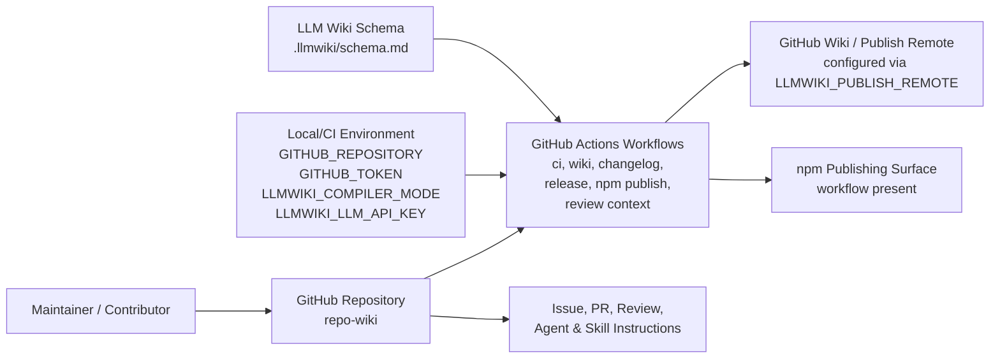
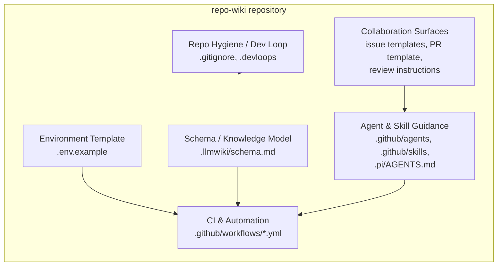
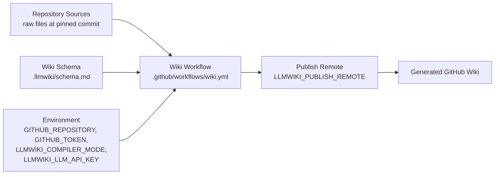
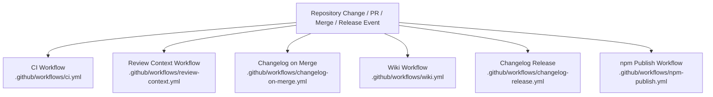

# Architecture

## Executive Architecture Summary

`repo-wiki` is presented by its documentation as a toolchain for compiling a Git repository into a maintained GitHub Wiki knowledge base, with raw repository sources as the authoritative input and schema-guided wiki pages as the output. This high-level intent is supported by the presence of an `.llmwiki/schema.md` schema document, wiki-oriented CI configuration, and environment variables for repository identity, GitHub authentication, compiler mode, and LLM API access. Evidence: `.llmwiki/schema.md`, `.github/workflows/wiki.yml`, `.env.example`, README.md documentation card, docs/PLAN.md documentation card.

The repository architecture visible from the provided source cards is mostly operational and process-oriented rather than implementation-code-oriented. The visible subsystems are:

| Subsystem | Responsibility visible from source evidence | Evidence |
|---|---|---|
| Wiki compiler / publishing configuration | Configures repository target, compiler mode, GitHub credentials, optional LLM API access, and wiki publishing remote. | `.env.example`, `.github/workflows/wiki.yml` |
| CI and release automation | Runs continuous integration, changelog automation, release changelog flow, npm publishing, review-context generation, and wiki-related workflow automation. | `.github/workflows/ci.yml`, `.github/workflows/changelog-on-merge.yml`, `.github/workflows/changelog-release.yml`, `.github/workflows/npm-publish.yml`, `.github/workflows/review-context.yml`, `.github/workflows/wiki.yml` |
| LLM wiki schema / knowledge model | Defines the schema or conventions for generated wiki content. The specific schema semantics are not available from the source card excerpt, so only the existence of this schema is verified. | `.llmwiki/schema.md` |
| GitHub collaboration surfaces | Provides issue templates, pull request template, Copilot review instructions, agent instructions, and repository skills. | `.github/ISSUE_TEMPLATE/config.yml`, `.github/ISSUE_TEMPLATE/epic.yml`, `.github/ISSUE_TEMPLATE/task.yml`, `.github/pull_request_template.md`, `.github/copilot-review-instructions.md`, `.github/agents/*.agent.md`, `.github/skills/*/SKILL.md` |
| Repository hygiene and local developer conventions | Defines ignored files and local/dev-loop conventions. | `.gitignore`, `.devloops`, `.pi/AGENTS.md` |

The implementation entry points and package-level source modules are not present in the supplied source cards. README documentation claims that an extension entry point is published as `@mfittko/repo-wiki/extension` and that a skill is shipped in `skills/repo-wiki-cli/SKILL.md`, but those paths are not present in the provided source-card set and therefore are treated as partially validated documentation rather than verified architecture. Evidence: README.md documentation card.

Key design decisions that are supported by available evidence:

1. **GitHub-centric operation**: configuration and workflows rely on GitHub repository and token variables, GitHub workflow files, issue templates, and PR/review automation. Evidence: `.env.example`, `.github/workflows/*.yml`, `.github/ISSUE_TEMPLATE/*.yml`, `.github/pull_request_template.md`.
2. **Wiki compilation as an operational surface**: a dedicated wiki workflow exists and exposes `LLMWIKI_COMPILER_MODE` and `LLMWIKI_PUBLISH_REMOTE`. Evidence: `.github/workflows/wiki.yml`.
3. **LLM-assisted compilation is expected or supported**: `.env.example` declares `LLMWIKI_LLM_API_KEY`, and planning documentation describes a provider-agnostic LLM compiler boundary compatible with OpenAI-style chat completions. The runtime implementation of that boundary is not verified from source code in the supplied cards. Evidence: `.env.example`, docs/plans/llm-compiler.md documentation card.
4. **Documentation-as-product / persistent wiki model**: planning and rationale documents describe a repository wiki inspired by the LLM Wiki pattern. This is documentation evidence and should be validated against implementation when source modules are available. Evidence: docs/PLAN.md documentation card, docs/WHY.md documentation card.

## System and Repository Context

The repository boundary visible from the source cards includes GitHub-hosted automation, wiki generation/publishing configuration, collaboration templates, agent/skill instructions, and schema documentation. The provided cards do **not** include application source files such as package manifests, CLI files, extension files, TypeScript/JavaScript modules, tests, or library implementation code. As a result, this architecture page distinguishes verified repository surfaces from documentation-described intended surfaces.

### Verified repository surfaces

| Surface | Verified evidence | Notes |
|---|---|---|
| Environment configuration example | `.env.example` | Declares `GITHUB_REPOSITORY`, `GITHUB_TOKEN`, `LLMWIKI_COMPILER_MODE`, and `LLMWIKI_LLM_API_KEY`. Values are not reproduced here. |
| Wiki workflow | `.github/workflows/wiki.yml` | Workflow exists and declares environment/configuration hints for `LLMWIKI_COMPILER_MODE` and `LLMWIKI_PUBLISH_REMOTE`. |
| CI workflow | `.github/workflows/ci.yml` | Workflow exists; exact job graph is not available from the source-card excerpt. |
| Changelog workflows | `.github/workflows/changelog-on-merge.yml`, `.github/workflows/changelog-release.yml` | Workflow files exist; `changelog-on-merge.yml` uses `GH_TOKEN` according to source-card metadata. |
| npm publishing workflow | `.github/workflows/npm-publish.yml` | Workflow exists; package details are not available from the source-card excerpt. |
| Review-context workflow | `.github/workflows/review-context.yml` | Workflow exists and uses `GH_TOKEN` according to source-card metadata. |
| Wiki schema | `.llmwiki/schema.md` | Schema document exists. Detailed schema content is not available from the source-card excerpt. |
| Collaboration templates | `.github/ISSUE_TEMPLATE/config.yml`, `.github/ISSUE_TEMPLATE/epic.yml`, `.github/ISSUE_TEMPLATE/task.yml`, `.github/pull_request_template.md` | GitHub issue and PR workflow surfaces exist. |
| Agent and skill instructions | `.github/agents/*.agent.md`, `.github/skills/*/SKILL.md`, `.pi/AGENTS.md` | Human/AI assistant process guidance exists. |

### Context diagram

The following diagram is based on verified repository structure and workflow/configuration surfaces. It does **not** assert implementation internals that are not present in the supplied source cards.

Evidence: `.env.example`, `.github/workflows/ci.yml`, `.github/workflows/wiki.yml`, `.github/workflows/changelog-on-merge.yml`, `.github/workflows/changelog-release.yml`, `.github/workflows/npm-publish.yml`, `.github/workflows/review-context.yml`, `.llmwiki/schema.md`, `.github/ISSUE_TEMPLATE/*.yml`, `.github/pull_request_template.md`, `.github/agents/*.agent.md`, `.github/skills/*/SKILL.md`.

### Documentation-described surfaces not verified from source cards

| Claimed surface | Documentation evidence | Verification status |
|---|---|---|
| Published extension entry point `@mfittko/repo-wiki/extension` | README.md documentation card | Partially validated only; package source and manifest are not included in provided source cards. |
| CLI/bootstrap flow using npm | README.md documentation card | Partially validated only; package scripts and implementation files are not included in provided source cards. |
| Provider-agnostic LLM compiler boundary | docs/plans/llm-compiler.md documentation card and `.env.example` variable `LLMWIKI_LLM_API_KEY` | Intent is documented; implementation boundary is not verified from provided source cards. |
| Incremental mode | docs/plans/incremental-mode.md documentation card marked stale | Treat as stale planning material, not current behavior. |

## Major Modules and Responsibilities

### 1. Wiki Compilation and Publishing Configuration

This module is the most directly visible operational module. It is represented by:

- `.env.example`, which declares repository and credential/configuration variables: `GITHUB_REPOSITORY`, `GITHUB_TOKEN`, `LLMWIKI_COMPILER_MODE`, and `LLMWIKI_LLM_API_KEY`.
- `.github/workflows/wiki.yml`, which is a wiki workflow and declares runtime hints for `LLMWIKI_COMPILER_MODE` and `LLMWIKI_PUBLISH_REMOTE`.

Responsibilities that can be safely inferred from these files:

| Responsibility | Evidence | Claim status |
|---|---|---|
| Identify the target GitHub repository. | `.env.example` declares `GITHUB_REPOSITORY`. | Verified configuration surface. |
| Authenticate with GitHub for repository/wiki operations. | `.env.example` declares `GITHUB_TOKEN`. | Verified configuration surface; exact API usage not verified. |
| Select or configure compiler mode. | `.env.example` and `.github/workflows/wiki.yml` reference `LLMWIKI_COMPILER_MODE`. | Verified configuration surface; exact modes not verified. |
| Optionally access an LLM provider. | `.env.example` declares `LLMWIKI_LLM_API_KEY`; docs/plans/llm-compiler.md describes an LLM compiler boundary. | Partially verified; implementation not present in source cards. |
| Publish generated wiki output to a remote. | `.github/workflows/wiki.yml` references `LLMWIKI_PUBLISH_REMOTE`. | Verified workflow configuration surface; exact publish command not visible. |

### 2. LLM Wiki Schema / Knowledge Model

The repository contains `.llmwiki/schema.md`, which is categorized as documentation and data-model evidence. This file is the visible schema anchor for generated wiki content.

Potential responsibilities:

- Define page types, metadata conventions, or compilation schema for the wiki.
- Provide a contract between raw repository source cards and generated wiki pages.
- Support the product direction described in docs/PLAN.md, where a schema guides LLM-written wiki content.

Only the existence and role as a schema/data-model document are verified from source-card metadata. Detailed field-level schema behavior cannot be stated from the provided excerpt. Evidence: `.llmwiki/schema.md`, docs/PLAN.md documentation card.

### 3. Continuous Integration and Automation

The `.github/workflows` directory contains several operational workflows:

| Workflow | Visible responsibility | Evidence |
|---|---|---|
| CI | General continuous integration. | `.github/workflows/ci.yml` |
| Wiki | Wiki compilation or publishing workflow. | `.github/workflows/wiki.yml` |
| Changelog on merge | Changelog automation after merge; source-card metadata shows `GH_TOKEN`. | `.github/workflows/changelog-on-merge.yml` |
| Changelog release | Release changelog automation. | `.github/workflows/changelog-release.yml` |
| npm publish | npm package publishing surface. | `.github/workflows/npm-publish.yml` |
| Review context | Review-context automation; source-card metadata shows `GH_TOKEN`. | `.github/workflows/review-context.yml` |

The exact triggers, permissions, jobs, commands, package manager, and artifact behavior are not available from the supplied source-card excerpts. Some planning documentation describes GitHub Action architecture, including local wiki artifacts and conditional publish credentials, but this remains partially validated without full workflow content. Evidence: docs/plans/github-action.md documentation card, docs/plans/ci-publishing.md documentation card.

### 4. Collaboration, Review, and Work Management Surfaces

The repository includes GitHub-native collaboration and review assets:

- Issue template configuration and templates: `.github/ISSUE_TEMPLATE/config.yml`, `.github/ISSUE_TEMPLATE/epic.yml`, `.github/ISSUE_TEMPLATE/task.yml`.
- Pull request template: `.github/pull_request_template.md`.
- Copilot review instructions: `.github/copilot-review-instructions.md`.
- Agent instructions: `.github/agents/coordinator.agent.md`, `.github/agents/developer.agent.md`, `.github/agents/docs.agent.md`, `.github/agents/fixer.agent.md`, `.github/agents/quality.agent.md`, `.github/agents/review.agent.md`.
- Skills: `.github/skills/keep-a-changelog/SKILL.md`, `.github/skills/repo-wiki-navigation/SKILL.md`.
- Additional agent/process instructions: `.pi/AGENTS.md`.

These files indicate an architecture that includes human and AI-assisted development workflows, not just runtime code. The `coordinator.agent.md` source-card metadata includes a background-work hint, and several workflows also include background-work hints. Evidence: `.github/agents/*.agent.md`, `.github/skills/*/SKILL.md`, `.github/copilot-review-instructions.md`, `.github/pull_request_template.md`, `.github/workflows/*.yml`, `.pi/AGENTS.md`.

### 5. Repository Hygiene and Developer Environment

The repository includes:

- `.gitignore`, defining ignored files and repository hygiene rules.
- `.devloops`, categorized as source text, likely related to local development loops or task automation conventions, though no detailed behavior is available from the source-card excerpt.
- `.env.example`, documenting expected environment variables without exposing secret values.

Evidence: `.gitignore`, `.devloops`, `.env.example`.

### Component/module diagram

This diagram is derived from repository structure and workflow/configuration surfaces. It shows architectural grouping, not verified source-code imports.

Evidence: `.env.example`, `.llmwiki/schema.md`, `.github/workflows/*.yml`, `.github/ISSUE_TEMPLATE/*.yml`, `.github/pull_request_template.md`, `.github/copilot-review-instructions.md`, `.github/agents/*.agent.md`, `.github/skills/*/SKILL.md`, `.gitignore`, `.devloops`, `.pi/AGENTS.md`.

## Runtime, Data, and Control-Flow Relationships

The provided source cards do not include scanner/import evidence for implementation modules, so runtime control flow inside the compiler cannot be verified. The safest architecture view is an operational data/control flow through configuration, GitHub Actions, repository sources, schema, and wiki publishing.

### Verified and partially verified runtime relationships

| Relationship | Evidence | Confidence |
|---|---|---|
| Local or CI environment provides repository and authentication settings. | `.env.example` declares `GITHUB_REPOSITORY` and `GITHUB_TOKEN`. | Medium |
| Compiler mode can be configured through environment. | `.env.example` and `.github/workflows/wiki.yml` reference `LLMWIKI_COMPILER_MODE`. | Medium |
| Wiki workflow has access to publish-remote configuration. | `.github/workflows/wiki.yml` references `LLMWIKI_PUBLISH_REMOTE`. | Medium |
| LLM API access is expected to be configurable. | `.env.example` declares `LLMWIKI_LLM_API_KEY`; docs/plans/llm-compiler.md describes LLM provider intent. | Low to medium |
| Review/changelog workflows require GitHub token access. | `.github/workflows/changelog-on-merge.yml` and `.github/workflows/review-context.yml` source-card metadata reference `GH_TOKEN`. | Medium |
| Generated wiki pages are schema-guided. | `.llmwiki/schema.md`; docs/PLAN.md describes schema-guided wiki compilation. | Low to medium, because implementation is not visible. |

### Operational data-flow diagram

This diagram is based on configuration and workflow evidence, not implementation imports.

Evidence: `.env.example`, `.github/workflows/wiki.yml`, `.llmwiki/schema.md`.

### Control-flow boundaries not verified

The following likely or documented control-flow details are not verifiable from supplied source cards:

- How source cards are generated or selected.
- How `.llmwiki/schema.md` is parsed.
- Whether the compiler has deterministic, heuristic, or LLM-backed phases.
- Whether the compiler supports full, incremental, or bootstrap modes beyond environment-variable names and stale/partial planning documentation.
- How publishing to GitHub Wiki is implemented.
- How npm package entry points invoke the compiler or extension.

Evidence for uncertainty: absence of implementation source cards; README.md documentation card; docs/plans/incremental-mode.md documentation card marked stale.

## Build, Test, Deployment, and Operational Surfaces

The repository has several GitHub Actions workflows, which form the visible build/test/deploy architecture. Full workflow contents are not included in the source-card excerpts, so the following table only reports verified workflow existence and metadata.

| Operational surface | Source path | Verified hints / variables | Notes |
|---|---|---|---|
| Continuous integration | `.github/workflows/ci.yml` | Background-work hint | Exact tests, package manager, and job matrix are not visible. |
| Wiki generation/publishing | `.github/workflows/wiki.yml` | `LLMWIKI_COMPILER_MODE`, `LLMWIKI_PUBLISH_REMOTE`; background-work and environment-variable hints | Dedicated wiki workflow exists. |
| Changelog after merge | `.github/workflows/changelog-on-merge.yml` | `GH_TOKEN`; background-work and environment-variable hints | Likely automates changelog maintenance, consistent with `keep-a-changelog` skill. |
| Release changelog | `.github/workflows/changelog-release.yml` | Background-work hint | Release changelog automation exists. |
| npm publishing | `.github/workflows/npm-publish.yml` | Background-work hint | npm publishing workflow exists; package identity/details are not visible. |
| Review context | `.github/workflows/review-context.yml` | `GH_TOKEN`; background-work and environment-variable hints | Review-context automation exists. |

The repository also contains `.github/skills/keep-a-changelog/SKILL.md`, which aligns with the changelog automation surfaces, and `.github/skills/repo-wiki-navigation/SKILL.md`, which aligns with repository-wiki navigation/process support. Evidence: `.github/skills/keep-a-changelog/SKILL.md`, `.github/skills/repo-wiki-navigation/SKILL.md`, `.github/workflows/changelog-on-merge.yml`, `.github/workflows/changelog-release.yml`.

### Build/test/deploy flow diagram

This diagram is workflow-level only. It does not assert exact GitHub Actions triggers, job names, package commands, or artifact steps because those details are not present in the source-card excerpts.

Evidence: `.github/workflows/ci.yml`, `.github/workflows/review-context.yml`, `.github/workflows/changelog-on-merge.yml`, `.github/workflows/changelog-release.yml`, `.github/workflows/wiki.yml`, `.github/workflows/npm-publish.yml`.

### Operational configuration

| Variable | Source | Likely operational role | Secret handling |
|---|---|---|---|
| `GITHUB_REPOSITORY` | `.env.example` | Identifies target repository. | Not inherently secret. |
| `GITHUB_TOKEN` | `.env.example` | Authenticates GitHub operations. | Secret/token; do not commit values. |
| `LLMWIKI_COMPILER_MODE` | `.env.example`, `.github/workflows/wiki.yml` | Selects compiler behavior/mode. | Usually non-secret unless value encodes sensitive details. |
| `LLMWIKI_LLM_API_KEY` | `.env.example` | Authenticates with an LLM provider. | Secret; do not commit values. |
| `LLMWIKI_PUBLISH_REMOTE` | `.github/workflows/wiki.yml` | Configures wiki publish target/remote. | May reveal repository topology; treat cautiously if private. |
| `GH_TOKEN` | `.github/workflows/changelog-on-merge.yml`, `.github/workflows/review-context.yml` | GitHub automation token for workflows. | Secret/token; do not commit values. |

No secret values were present in the provided source-card excerpts and none are reproduced here. Evidence: `.env.example`, `.github/workflows/wiki.yml`, `.github/workflows/changelog-on-merge.yml`, `.github/workflows/review-context.yml`.

## Cross-Cutting Concerns

### Configuration

Configuration is environment-variable driven for at least the wiki/compiler and GitHub integration surfaces. The main configuration evidence is `.env.example`, plus workflow-level variables in `.github/workflows/wiki.yml`, `.github/workflows/changelog-on-merge.yml`, and `.github/workflows/review-context.yml`.

Key configuration concerns:

- Keep GitHub and LLM tokens in environment or secret stores, not in source. Evidence: `.env.example`, `.github/workflows/changelog-on-merge.yml`, `.github/workflows/review-context.yml`.
- Ensure `LLMWIKI_COMPILER_MODE` is consistently interpreted between local usage and CI. Evidence: `.env.example`, `.github/workflows/wiki.yml`.
- Ensure `LLMWIKI_PUBLISH_REMOTE` is configured only in contexts authorized to publish wiki output. Evidence: `.github/workflows/wiki.yml`.

### Security

Security-relevant surfaces visible from source cards:

| Concern | Evidence | Notes |
|---|---|---|
| GitHub token usage | `.env.example`, `.github/workflows/changelog-on-merge.yml`, `.github/workflows/review-context.yml` | Token values must remain secret; permissions should be least-privilege, but exact workflow permissions are not visible. |
| LLM API key usage | `.env.example` | LLM provider credentials must remain secret. |
| Publishing remote | `.github/workflows/wiki.yml` | Publishing credentials and remotes should be restricted to trusted workflow contexts. |
| Review automation | `.github/copilot-review-instructions.md`, `.github/workflows/review-context.yml` | Automated review context may expose source-derived data; exact content is not visible. |

### APIs and external dependencies

Verified external-facing or external-integrating surfaces:

- GitHub repository and wiki integration via GitHub token/repository variables and workflows. Evidence: `.env.example`, `.github/workflows/wiki.yml`.
- npm publishing via workflow presence. Evidence: `.github/workflows/npm-publish.yml`.
- LLM provider integration intent via API key and LLM compiler plan. Evidence: `.env.example`, docs/plans/llm-compiler.md documentation card.

Unverified from source cards:

- Exact public package exports.
- CLI command names and arguments.
- Node runtime version or package manager.
- Direct GitHub API or git command usage.
- LLM provider SDK or HTTP API implementation.

### Data model and schema

`.llmwiki/schema.md` is the central visible data-model artifact. Its existence supports the architectural idea that generated wiki content follows a schema. The detailed schema contract is not available from the source-card excerpt. Evidence: `.llmwiki/schema.md`.

The generated page itself follows the page contract requested for this wiki compilation: YAML frontmatter, source paths, confidence/claim status, evidence-cited sections, diagrams only when supported, and human notes block. This output contract comes from the current generation request rather than repository source.

### Documentation trust model

Repository documentation cards provide product intent and planned architecture, but several are marked `partially_validated` and one is marked `stale`.

| Documentation card | Status | Architectural use |
|---|---|---|
| README.md | partially_validated | Used for product intent and claimed package/extension surfaces, but not treated as authoritative implementation evidence. |
| docs/PLAN.md | partially_validated | Used for product vision and schema-guided LLM Wiki intent. |
| docs/WHY.md | partially_validated | Used for rationale, not runtime behavior. |
| docs/plans/ci-publishing.md | partially_validated | Used as supporting intent for CI publishing architecture, not exact workflow behavior. |
| docs/plans/github-action.md | partially_validated | Used as supporting intent for GitHub Action/wiki artifact/publish behavior, not exact workflow behavior. |
| docs/plans/llm-compiler.md | partially_validated | Used as supporting intent for provider-agnostic LLM compiler boundary. |
| docs/plans/incremental-mode.md | stale | Not used as current architecture except as an open question/caveat. |

### Human and AI-assisted development process

The repository includes multiple agent instruction documents and skills, suggesting the development workflow is intentionally augmented with role-specific guidance:

- Coordinator, developer, docs, fixer, quality, and review agents. Evidence: `.github/agents/coordinator.agent.md`, `.github/agents/developer.agent.md`, `.github/agents/docs.agent.md`, `.github/agents/fixer.agent.md`, `.github/agents/quality.agent.md`, `.github/agents/review.agent.md`.
- Changelog and repo-wiki navigation skills. Evidence: `.github/skills/keep-a-changelog/SKILL.md`, `.github/skills/repo-wiki-navigation/SKILL.md`.
- Copilot review instructions and PR template. Evidence: `.github/copilot-review-instructions.md`, `.github/pull_request_template.md`.

This is a process architecture concern rather than a runtime module dependency.

## Caveats and Open Questions

### Caveats

1. **Implementation code is not present in the supplied source cards.**  
   No package manifest, source modules, tests, or runtime entry-point files were included in the source-card list. Therefore this page cannot verify CLI commands, library exports, package scripts, internal module boundaries, import graphs, test commands, or runtime algorithms. Evidence: supplied source-card list; README.md documentation card claims unverified package surfaces.

2. **Workflow details are only partially visible.**  
   Workflow files are present, and source-card metadata exposes some environment variables and hints, but exact triggers, jobs, permissions, commands, artifacts, and deployment gates are not available from the excerpts. Evidence: `.github/workflows/ci.yml`, `.github/workflows/wiki.yml`, `.github/workflows/changelog-on-merge.yml`, `.github/workflows/changelog-release.yml`, `.github/workflows/npm-publish.yml`, `.github/workflows/review-context.yml`.

3. **Diagrams are structure-derived.**  
   The context, component, data-flow, and build/test/deploy diagrams are based on repository structure, workflow presence, and environment-variable metadata. They should be treated as operational architecture sketches, not verified code-level dependency graphs. Evidence: `.env.example`, `.github/workflows/*.yml`, `.llmwiki/schema.md`.

4. **LLM compiler behavior is not verified from code.**  
   `.env.example` declares `LLMWIKI_LLM_API_KEY`, and planning documentation describes a provider-agnostic LLM compiler boundary, but no implementation code is available in the supplied cards. Evidence: `.env.example`, docs/plans/llm-compiler.md documentation card.

5. **Incremental mode should not be assumed current.**  
   The incremental-mode plan card is marked `stale`, so any incremental architecture described there is not treated as current behavior. Evidence: docs/plans/incremental-mode.md documentation card.

6. **README package/extension claims are not fully validated here.**  
   README.md claims an extension entry point `@mfittko/repo-wiki/extension` and a skill in `skills/repo-wiki-cli/SKILL.md`, but those paths are not included in the provided source cards. Evidence: README.md documentation card.

### Open Questions

| Question | Why it matters | Evidence gap |
|---|---|---|
| What are the actual runtime entry points: CLI, library, GitHub Action, extension, or all of these? | Determines public API and module boundaries. | README.md claims package/extension surfaces, but implementation files are not in source cards. |
| What package manager, scripts, and Node/runtime versions are used? | Needed for accurate build/test/deploy architecture. | No `package.json`, lockfile, or runtime config card provided. |
| How is `.llmwiki/schema.md` parsed and enforced? | Determines the data-model architecture and validation guarantees. | Schema file exists, but implementation and detailed schema excerpt are absent. |
| What are the supported values of `LLMWIKI_COMPILER_MODE`? | Determines compiler modes such as bootstrap, local, CI, publish, or incremental behavior. | Variable exists in `.env.example` and `.github/workflows/wiki.yml`, but allowed values are not visible. |
| Does the compiler always call an LLM, or can it run in a deterministic/non-LLM mode? | Affects cost, reliability, testing, and security boundaries. | `LLMWIKI_LLM_API_KEY` exists; implementation behavior absent. |
| How are source cards generated and prioritized? | Critical for wiki correctness and evidence traceability. | No scanner/indexer implementation cards provided. |
| What permissions are granted to `GITHUB_TOKEN`/`GH_TOKEN` in workflows? | Security and least-privilege assessment requires permissions. | Workflow excerpts do not expose permission blocks. |
| What exactly is published by `npm-publish.yml`? | Needed to document deployment artifacts and public package API. | Workflow exists, but package metadata and commands are not visible. |
| How are existing wiki pages fetched and human notes preserved? | Required for incremental/wiki maintenance architecture. | Planning docs mention wiki state/artifacts, but implementation is not verified. |
| Are GitHub Wiki publishing failures recoverable or artifacted? | Operational reliability concern. | docs/plans/github-action.md and docs/plans/ci-publishing.md mention architecture intent, but exact workflow behavior is not verified. |

<!-- HUMAN_NOTES_START -->
<!-- HUMAN_NOTES_END -->
