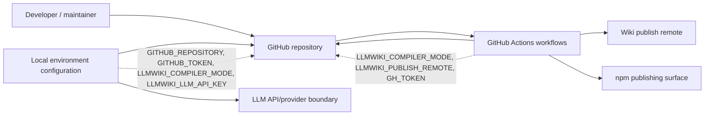
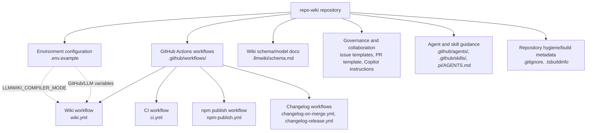
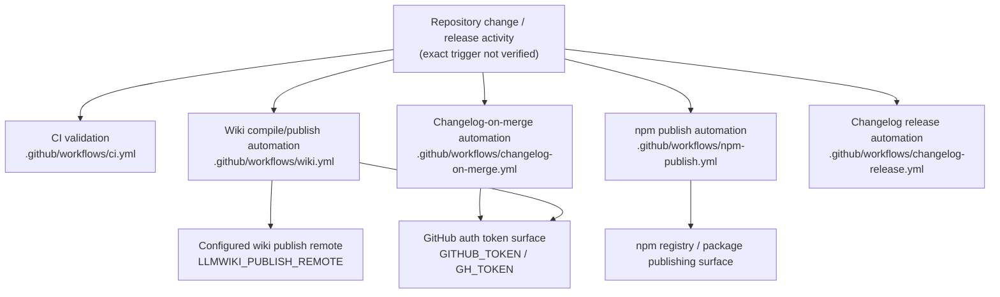

# Architecture

## Executive Architecture Summary

This repository appears to be a `repo-wiki` project whose operational intent is to compile repository knowledge into a GitHub Wiki-style knowledge base, with supporting automation for CI, wiki publishing, npm publishing, and changelog management. The strongest source evidence available for this architecture page is repository configuration and workflow metadata rather than application source code: environment variables are declared in `.env.example`, CI and publishing surfaces are declared under `.github/workflows/`, issue and pull request collaboration surfaces are declared under `.github/ISSUE_TEMPLATE/` and `.github/pull_request_template.md`, and wiki schema/modeling guidance is documented in `.llmwiki/schema.md`.

The observable architecture at this commit is therefore best described as a repository automation and documentation architecture with these major subsystems:

| Subsystem | Responsibility | Evidence |
|---|---|---|
| Wiki compiler/runtime configuration | Defines runtime configuration variables for repository selection, GitHub authentication, compiler mode, and LLM API access. | `.env.example` |
| GitHub Actions automation | Provides CI, wiki publishing, npm publishing, and changelog automation workflows. | `.github/workflows/ci.yml`, `.github/workflows/wiki.yml`, `.github/workflows/npm-publish.yml`, `.github/workflows/changelog-on-merge.yml`, `.github/workflows/changelog-release.yml` |
| Wiki data/schema documentation | Defines or documents the LLM wiki schema/model used by generated wiki content. | `.llmwiki/schema.md` |
| Collaboration and governance surfaces | Provides issue templates, PR template, Copilot review instructions, and agent/skill instructions for structured development workflows. | `.github/ISSUE_TEMPLATE/config.yml`, `.github/ISSUE_TEMPLATE/epic.yml`, `.github/ISSUE_TEMPLATE/task.yml`, `.github/pull_request_template.md`, `.github/copilot-review-instructions.md`, `.github/agents/*.agent.md`, `.github/skills/*/SKILL.md` |
| Local/build artifacts and repository hygiene | Tracks ignore rules and TypeScript build metadata. | `.gitignore`, `.tsbuildinfo` |

A key design decision visible from configuration is that the system is intended to operate both locally and in automation using environment variables, including `GITHUB_REPOSITORY`, `GITHUB_TOKEN`, `LLMWIKI_COMPILER_MODE`, `LLMWIKI_LLM_API_KEY`, and CI-specific publishing variables such as `LLMWIKI_PUBLISH_REMOTE` and `GH_TOKEN`. These names are cited only as variable names; no secret values are present in the provided evidence. Evidence: `.env.example`, `.github/workflows/wiki.yml`, `.github/workflows/changelog-on-merge.yml`.

Because no application implementation files, package manifest, imports, or executable source modules were included in the source cards, this page does **not** assert a verified internal code architecture for the compiler itself. Where this page describes module relationships, it distinguishes directly observed repository surfaces from inferred relationships. Evidence limitation: source card list contains CI/config/docs cards but no `package.json`, `src/`, CLI entry point, tests, or implementation modules.

## System and Repository Context

The repository boundary visible from the supplied source cards consists of GitHub-hosted project automation, wiki-related schema/documentation, development-agent guidance, and environment-driven runtime configuration. External surfaces visible in source evidence are:

| External surface | Role | Evidence |
|---|---|---|
| GitHub repository API / GitHub-hosted repository context | Runtime configuration includes `GITHUB_REPOSITORY` and `GITHUB_TOKEN`; workflows are GitHub Actions workflows. | `.env.example`, `.github/workflows/*.yml` |
| GitHub Wiki publishing target | Wiki workflow configuration includes `LLMWIKI_PUBLISH_REMOTE`, indicating a configurable remote for wiki publishing. | `.github/workflows/wiki.yml` |
| LLM provider/API boundary | Runtime configuration includes `LLMWIKI_LLM_API_KEY`, indicating the compiler can be configured with an LLM API credential. | `.env.example` |
| npm package publishing | A dedicated npm publishing workflow exists. | `.github/workflows/npm-publish.yml` |
| Changelog/release automation | Dedicated changelog-on-merge and changelog-release workflows exist. | `.github/workflows/changelog-on-merge.yml`, `.github/workflows/changelog-release.yml` |
| Human and AI-assisted development workflow | Issue templates, PR template, Copilot review instructions, agent instructions, and skill instructions are present. | `.github/ISSUE_TEMPLATE/*.yml`, `.github/pull_request_template.md`, `.github/copilot-review-instructions.md`, `.github/agents/*.agent.md`, `.github/skills/*/SKILL.md` |

The following context diagram is limited to repository boundaries and external surfaces directly supported by workflow/configuration filenames and environment variable declarations. It does not claim unobserved internal source-code structure.

Evidence: `.env.example`, `.github/workflows/wiki.yml`, `.github/workflows/npm-publish.yml`, `.github/workflows/changelog-on-merge.yml`, `.github/workflows/changelog-release.yml`, `.github/workflows/ci.yml`.

Repository structure visible from the provided source cards:

| Path/group | Architectural role | Evidence status |
|---|---|---|
| `.github/workflows/` | CI, wiki, npm publish, and changelog automation | Directly observed source cards |
| `.github/ISSUE_TEMPLATE/` | Structured issue intake for epics and tasks | Directly observed source cards |
| `.github/agents/` | Role-specific agent guidance for coordinator, developer, docs, fixer, quality, and review workflows | Directly observed documentation cards |
| `.github/skills/` | Reusable development/documentation skills, including changelog and repo-wiki navigation guidance | Directly observed documentation cards |
| `.llmwiki/schema.md` | Wiki schema/data-model documentation | Directly observed documentation card |
| `.env.example` | Runtime/environment configuration template | Directly observed source card |
| `.gitignore` | Repository hygiene for ignored files | Directly observed source card |
| `.tsbuildinfo` | TypeScript incremental build metadata artifact | Directly observed source card |
| `.pi/AGENTS.md` | Additional agent/project instructions | Directly observed documentation card |

## Major Modules and Responsibilities

### Wiki Compiler and Runtime Configuration Surface

The runtime configuration surface is represented by `.env.example`, which declares environment-variable names for GitHub repository selection/authentication and LLM/wiki compiler behavior: `GITHUB_REPOSITORY`, `GITHUB_TOKEN`, `LLMWIKI_COMPILER_MODE`, and `LLMWIKI_LLM_API_KEY`. Evidence: `.env.example`.

Architectural responsibilities inferred from these variable names:

- Selecting or identifying the target GitHub repository through `GITHUB_REPOSITORY`. Evidence: `.env.example`.
- Authenticating against GitHub through `GITHUB_TOKEN`. Evidence: `.env.example`.
- Selecting compiler behavior through `LLMWIKI_COMPILER_MODE`. Evidence: `.env.example`, `.github/workflows/wiki.yml`.
- Configuring LLM-backed compilation through `LLMWIKI_LLM_API_KEY`. Evidence: `.env.example`.

These responsibilities are inferred from configuration names and repository documentation cards, not from executable implementation source in the supplied evidence. The current source cards do not include a verified CLI file, compiler module, provider adapter, or GitHub client implementation.

### Wiki Publishing Automation

The wiki automation surface is represented by `.github/workflows/wiki.yml`. Its source card identifies CI/configuration characteristics and environment variables `LLMWIKI_COMPILER_MODE` and `LLMWIKI_PUBLISH_REMOTE`, indicating that wiki generation/publishing behavior is configurable in GitHub Actions. Evidence: `.github/workflows/wiki.yml`.

Likely responsibilities of this automation module:

- Running wiki-related automation in a background workflow context. Evidence: `.github/workflows/wiki.yml`.
- Selecting compiler mode using `LLMWIKI_COMPILER_MODE`. Evidence: `.github/workflows/wiki.yml`.
- Publishing to a configured wiki remote using `LLMWIKI_PUBLISH_REMOTE`. Evidence: `.github/workflows/wiki.yml`.

The exact workflow triggers, jobs, steps, permissions, and artifact behavior are not available in the source-card excerpts, so this page does not assert them.

### Continuous Integration

A CI workflow exists at `.github/workflows/ci.yml` and is marked as CI with background-work runtime hints. Evidence: `.github/workflows/ci.yml`.

Visible responsibility:

- Running repository validation in GitHub Actions. Evidence: `.github/workflows/ci.yml`.

The source-card excerpt does not expose package scripts, matrix strategy, test commands, build commands, or required checks; those details remain open questions.

### npm Publishing Automation

A workflow exists at `.github/workflows/npm-publish.yml`, indicating a release/deployment surface for npm package publication. Evidence: `.github/workflows/npm-publish.yml`.

Visible responsibility:

- Publishing the package or release artifact to npm through GitHub Actions. Evidence: `.github/workflows/npm-publish.yml`.

Because `package.json`, npm package metadata, package name, and workflow step contents were not included in the source cards, the package entry points and publish conditions are not verified here.

### Changelog and Release Automation

Two changelog-related workflows exist:

- `.github/workflows/changelog-on-merge.yml`, which is marked as CI/configuration and declares `GH_TOKEN`. Evidence: `.github/workflows/changelog-on-merge.yml`.
- `.github/workflows/changelog-release.yml`, which is marked as CI/background work. Evidence: `.github/workflows/changelog-release.yml`.

The repository also contains a keep-a-changelog skill document under `.github/skills/keep-a-changelog/SKILL.md`, suggesting project guidance for changelog maintenance. Evidence: `.github/skills/keep-a-changelog/SKILL.md`.

Visible responsibilities:

- Updating or managing changelog content on merge. Evidence: `.github/workflows/changelog-on-merge.yml`.
- Supporting release-oriented changelog automation. Evidence: `.github/workflows/changelog-release.yml`.
- Providing human/agent guidance for changelog conventions. Evidence: `.github/skills/keep-a-changelog/SKILL.md`.

Exact changelog file paths, release tags, generated content, and mutation rules are not verified from the supplied excerpts.

### Wiki Schema and Knowledge Model

The repository includes `.llmwiki/schema.md`, categorized as documentation with data-model relevance. Evidence: `.llmwiki/schema.md`.

Visible responsibility:

- Defining or documenting the schema/model for generated wiki knowledge. Evidence: `.llmwiki/schema.md`.

The schema card does not provide full schema contents in the supplied excerpt, so this page cannot verify field-level requirements beyond the file’s role as data-model documentation.

### Development Governance and Agent Collaboration

The repository contains multiple collaboration/governance files:

| File/group | Responsibility | Evidence |
|---|---|---|
| `.github/ISSUE_TEMPLATE/config.yml` | Issue template configuration | `.github/ISSUE_TEMPLATE/config.yml` |
| `.github/ISSUE_TEMPLATE/epic.yml` | Epic issue intake template | `.github/ISSUE_TEMPLATE/epic.yml` |
| `.github/ISSUE_TEMPLATE/task.yml` | Task issue intake template | `.github/ISSUE_TEMPLATE/task.yml` |
| `.github/pull_request_template.md` | Pull request checklist/template | `.github/pull_request_template.md` |
| `.github/copilot-review-instructions.md` | Copilot review guidance | `.github/copilot-review-instructions.md` |
| `.github/agents/coordinator.agent.md` | Coordinator-agent guidance | `.github/agents/coordinator.agent.md` |
| `.github/agents/developer.agent.md` | Developer-agent guidance | `.github/agents/developer.agent.md` |
| `.github/agents/docs.agent.md` | Documentation-agent guidance | `.github/agents/docs.agent.md` |
| `.github/agents/fixer.agent.md` | Fixer-agent guidance | `.github/agents/fixer.agent.md` |
| `.github/agents/quality.agent.md` | Quality-agent guidance | `.github/agents/quality.agent.md` |
| `.github/agents/review.agent.md` | Review-agent guidance | `.github/agents/review.agent.md` |
| `.github/skills/repo-wiki-navigation/SKILL.md` | Repo-wiki navigation skill guidance | `.github/skills/repo-wiki-navigation/SKILL.md` |
| `.pi/AGENTS.md` | Additional project/agent instructions | `.pi/AGENTS.md` |

These files are documentation/governance surfaces rather than verified runtime modules.

### Repository Hygiene and Build Metadata

`.gitignore` is present and defines ignored files for repository hygiene. Evidence: `.gitignore`.

`.tsbuildinfo` is present and tagged with a background-work hint, indicating TypeScript incremental build metadata exists in the repository state supplied to the scanner. Evidence: `.tsbuildinfo`.

The presence of `.tsbuildinfo` suggests TypeScript tooling may be involved, but no `tsconfig.json`, source `.ts` files, package scripts, or TypeScript compiler configuration were included in the supplied source cards. Therefore this page does not claim a verified TypeScript application architecture.

### Component/Module Diagram

The following diagram is based on observed repository structure and configuration surfaces. It is not an import graph and does not represent verified runtime call relationships.

Evidence: `.env.example`, `.github/workflows/wiki.yml`, `.github/workflows/ci.yml`, `.github/workflows/npm-publish.yml`, `.github/workflows/changelog-on-merge.yml`, `.github/workflows/changelog-release.yml`, `.llmwiki/schema.md`, `.github/ISSUE_TEMPLATE/*.yml`, `.github/agents/*.agent.md`, `.github/skills/*/SKILL.md`, `.github/pull_request_template.md`, `.github/copilot-review-instructions.md`, `.gitignore`, `.tsbuildinfo`, `.pi/AGENTS.md`.

## Runtime, Data, and Control-Flow Relationships

The available source cards provide configuration and workflow surfaces but not executable implementation or imports. As a result, runtime/data/control-flow relationships can only be described at the repository-automation level.

### Environment-Driven Configuration Flow

Observed environment variables establish the following configuration boundaries:

| Variable name | Observed location | Architectural implication |
|---|---|---|
| `GITHUB_REPOSITORY` | `.env.example` | Local/runtime configuration can identify a target GitHub repository. |
| `GITHUB_TOKEN` | `.env.example` | Local/runtime configuration can authenticate GitHub operations. |
| `LLMWIKI_COMPILER_MODE` | `.env.example`, `.github/workflows/wiki.yml` | Compiler mode is configurable in both local/example environment and wiki workflow contexts. |
| `LLMWIKI_LLM_API_KEY` | `.env.example` | LLM-backed behavior can be configured through an API key. |
| `LLMWIKI_PUBLISH_REMOTE` | `.github/workflows/wiki.yml` | Wiki publishing can target a configured remote. |
| `GH_TOKEN` | `.github/workflows/changelog-on-merge.yml` | Changelog-on-merge automation can use GitHub authentication. |

Evidence: `.env.example`, `.github/workflows/wiki.yml`, `.github/workflows/changelog-on-merge.yml`.

### CI/Automation Control Surfaces

At a high level, GitHub Actions is the observed orchestrator for background automation:

- `.github/workflows/ci.yml` provides a CI workflow surface. Evidence: `.github/workflows/ci.yml`.
- `.github/workflows/wiki.yml` provides a wiki generation/publishing workflow surface. Evidence: `.github/workflows/wiki.yml`.
- `.github/workflows/npm-publish.yml` provides an npm publishing workflow surface. Evidence: `.github/workflows/npm-publish.yml`.
- `.github/workflows/changelog-on-merge.yml` and `.github/workflows/changelog-release.yml` provide changelog/release automation surfaces. Evidence: `.github/workflows/changelog-on-merge.yml`, `.github/workflows/changelog-release.yml`.

The exact triggers and dependency ordering among these workflows are not available from the source-card excerpts. The following diagram therefore shows separate automation surfaces rather than a verified workflow dependency chain.

```mermaid
flowchart LR
  GitHubEvents["GitHub events<br/>(exact triggers not verified)"]
  CI["CI workflow<br/>ci.yml"]
  Wiki["Wiki workflow<br/>wiki.yml"]
  NpmPublish["npm publish workflow<br/>npm-publish.yml"]
  ChangelogMerge["Changelog on merge<br/>changelog-on-merge.yml"]
  ChangelogRelease["Changelog release<br/>changelog-release.yml"]

  GitHubEvents --> CI
  GitHubEvents --> Wiki
  GitHubEvents --> NpmPublish
  GitHubEvents --> ChangelogMerge
  GitHubEvents --> ChangelogRelease

  Wiki -. "uses LLMWIKI_COMPILER_MODE / LLMWIKI_PUBLISH_REMOTE" .-> Wiki
  ChangelogMerge -. "uses GH_TOKEN" .-> ChangelogMerge
```

Evidence: `.github/workflows/ci.yml`, `.github/workflows/wiki.yml`, `.github/workflows/npm-publish.yml`, `.github/workflows/changelog-on-merge.yml`, `.github/workflows/changelog-release.yml`.

### Data Model Relationship

`.llmwiki/schema.md` is the only source card explicitly tagged as data-model documentation. Evidence: `.llmwiki/schema.md`.

A conservative data relationship is:

1. Repository source/configuration/documentation exists as input material. Evidence: source card list, including `.env.example`, `.github/workflows/*.yml`, `.llmwiki/schema.md`.
2. Wiki schema/model documentation exists in `.llmwiki/schema.md`. Evidence: `.llmwiki/schema.md`.
3. Wiki workflow configuration exists and is parameterized by `LLMWIKI_COMPILER_MODE` and `LLMWIKI_PUBLISH_REMOTE`. Evidence: `.github/workflows/wiki.yml`.

The implementation details that transform repository sources into wiki pages are not verified from provided application source files.

## Build, Test, Deployment, and Operational Surfaces

### Observed Build/Test/Deploy Surfaces

| Surface | Path | Observed role | Confidence |
|---|---|---|---|
| CI | `.github/workflows/ci.yml` | Repository validation/test/build automation surface | Medium that workflow exists; low on exact commands |
| Wiki publishing | `.github/workflows/wiki.yml` | Wiki compilation/publishing automation surface | Medium that workflow exists; low on exact commands |
| npm publishing | `.github/workflows/npm-publish.yml` | Package publishing automation surface | Medium that workflow exists; low on exact commands |
| Changelog on merge | `.github/workflows/changelog-on-merge.yml` | Changelog automation using `GH_TOKEN` | Medium that workflow exists; low on exact commands |
| Changelog release | `.github/workflows/changelog-release.yml` | Release/changelog automation surface | Medium that workflow exists; low on exact commands |
| Local environment template | `.env.example` | Local configuration for GitHub and LLM/wiki compiler settings | Medium |
| TypeScript build metadata | `.tsbuildinfo` | Indicates TypeScript incremental build metadata is present | Low for architectural conclusions |

Evidence: `.github/workflows/ci.yml`, `.github/workflows/wiki.yml`, `.github/workflows/npm-publish.yml`, `.github/workflows/changelog-on-merge.yml`, `.github/workflows/changelog-release.yml`, `.env.example`, `.tsbuildinfo`.

### Build/Test/Deploy Flow Diagram

The following diagram is based on the presence of workflow files. It does **not** assert exact triggers, ordering, branch filters, package scripts, or required dependencies, because those details are not visible in the supplied source-card excerpts.

Evidence: `.github/workflows/ci.yml`, `.github/workflows/wiki.yml`, `.github/workflows/npm-publish.yml`, `.github/workflows/changelog-on-merge.yml`, `.github/workflows/changelog-release.yml`, `.env.example`.

### Operational Entry Points

The source cards do not include `package.json`, CLI implementation files, shell scripts, or source-code entry points. Therefore, verified operational entry points are limited to:

- GitHub Actions workflow files under `.github/workflows/`. Evidence: `.github/workflows/ci.yml`, `.github/workflows/wiki.yml`, `.github/workflows/npm-publish.yml`, `.github/workflows/changelog-on-merge.yml`, `.github/workflows/changelog-release.yml`.
- Environment-variable configuration template in `.env.example`. Evidence: `.env.example`.
- Project governance templates and agent instructions under `.github/` and `.pi/`. Evidence: `.github/ISSUE_TEMPLATE/*.yml`, `.github/pull_request_template.md`, `.github/copilot-review-instructions.md`, `.github/agents/*.agent.md`, `.github/skills/*/SKILL.md`, `.pi/AGENTS.md`.

Documentation cards mention npm usage and local bootstrap commands in `README.md`, but those claims are only partially validated and no `package.json` or CLI source cards were provided. Therefore those commands are not treated as authoritative architecture evidence on this page.

## Cross-Cutting Concerns

### Configuration

Configuration is environment-variable driven at the visible boundary. `.env.example` declares `GITHUB_REPOSITORY`, `GITHUB_TOKEN`, `LLMWIKI_COMPILER_MODE`, and `LLMWIKI_LLM_API_KEY`. `.github/workflows/wiki.yml` declares `LLMWIKI_COMPILER_MODE` and `LLMWIKI_PUBLISH_REMOTE`. `.github/workflows/changelog-on-merge.yml` declares `GH_TOKEN`. Evidence: `.env.example`, `.github/workflows/wiki.yml`, `.github/workflows/changelog-on-merge.yml`.

No secret values are included here. The variables named `GITHUB_TOKEN`, `GH_TOKEN`, and `LLMWIKI_LLM_API_KEY` are security-sensitive by nature and should be supplied through local environment management or GitHub Actions secrets rather than committed values. Evidence for variable names only: `.env.example`, `.github/workflows/changelog-on-merge.yml`.

### Security and Credential Handling

Visible credential surfaces include:

- `GITHUB_TOKEN` in `.env.example`. Evidence: `.env.example`.
- `GH_TOKEN` in `.github/workflows/changelog-on-merge.yml`. Evidence: `.github/workflows/changelog-on-merge.yml`.
- `LLMWIKI_LLM_API_KEY` in `.env.example`. Evidence: `.env.example`.

The source-card excerpts do not show permission scopes, GitHub Actions `permissions:` blocks, secret references, token masking strategy, or provider-specific credential handling. These remain open questions.

### External APIs and Integrations

Visible integrations are:

| Integration | Evidence | Verified detail |
|---|---|---|
| GitHub repository/API | `.env.example`, `.github/workflows/*.yml` | Repository identification/authentication variables and GitHub Actions workflows exist. |
| GitHub Wiki remote or equivalent Git remote | `.github/workflows/wiki.yml` | `LLMWIKI_PUBLISH_REMOTE` is declared. |
| LLM provider/API | `.env.example` | `LLMWIKI_LLM_API_KEY` is declared. |
| npm publishing | `.github/workflows/npm-publish.yml` | npm publish workflow file exists. |

The exact APIs, SDKs, HTTP clients, CLI tools, and provider protocols are not verified by application source in the supplied evidence.

### Data Models

`.llmwiki/schema.md` is the strongest evidence for a wiki data model or schema definition. Evidence: `.llmwiki/schema.md`.

Because the full schema content was not available in the source-card excerpt, this page does not enumerate schema fields. Any page generator or compiler should treat `.llmwiki/schema.md` as a high-value documentation source for wiki shape and validation, while verifying operational claims against implementation when source files are available.

### Documentation Trust

Documentation cards for `README.md`, `docs/PLAN.md`, `docs/WHY.md`, and several `docs/plans/*.md` files are marked `partially_validated` or `stale` in the supplied prompt. Those documents describe product intent and planned architecture, including a repo-wiki/LLM Wiki concept and future or planned compiler/action modes. However, this Architecture page treats those documents as secondary evidence and does not present their operational claims as verified current behavior unless supported by source cards such as `.env.example` or `.github/workflows/*.yml`.

Examples of documentation-to-source alignment visible from the supplied evidence:

- Documentation cards describe wiki generation/publishing intent, and `.github/workflows/wiki.yml` exists with wiki-related environment variables. Evidence: documentation card `docs/plans/github-action.md` is partially validated; source evidence `.github/workflows/wiki.yml`.
- Documentation cards describe an LLM compiler boundary, and `.env.example` declares `LLMWIKI_LLM_API_KEY`. Evidence: documentation card `docs/plans/llm-compiler.md` is partially validated; source evidence `.env.example`.

Examples where this page remains conservative:

- README commands such as npm installation and `npx repo-wiki --help` are not asserted as verified because no `package.json`, package metadata, or CLI source was provided in the source cards.
- Planned incremental mode architecture is not asserted because `docs/plans/incremental-mode.md` is marked stale and no implementation source was provided.

### Governance and Review Quality

The repository includes explicit collaboration and review surfaces:

- Issue templates for epics and tasks. Evidence: `.github/ISSUE_TEMPLATE/epic.yml`, `.github/ISSUE_TEMPLATE/task.yml`, `.github/ISSUE_TEMPLATE/config.yml`.
- Pull request template. Evidence: `.github/pull_request_template.md`.
- Copilot review instructions. Evidence: `.github/copilot-review-instructions.md`.
- Agent role documents for coordination, development, documentation, fixing, quality, and review. Evidence: `.github/agents/coordinator.agent.md`, `.github/agents/developer.agent.md`, `.github/agents/docs.agent.md`, `.github/agents/fixer.agent.md`, `.github/agents/quality.agent.md`, `.github/agents/review.agent.md`.
- Skills for changelog maintenance and repo-wiki navigation. Evidence: `.github/skills/keep-a-changelog/SKILL.md`, `.github/skills/repo-wiki-navigation/SKILL.md`.

These files indicate an architecture that includes process automation and AI-assisted development guidance as first-class repository assets, but they are not runtime implementation modules.

## Caveats and Open Questions

1. **No application source files were included in the supplied source cards.**  
   This page cannot verify internal compiler classes, CLI entry points, package exports, provider adapters, GitHub clients, file walkers, schema validators, or persistence logic. Evidence limitation: source cards include configuration, CI, docs, `.tsbuildinfo`, and templates, but no `src/`, `package.json`, test files, or implementation modules.

2. **Workflow internals are not visible in the excerpts.**  
   Workflow files exist, but exact triggers, job names, step commands, permissions, artifacts, branch filters, and dependency order are not available in the source-card excerpts. Evidence: `.github/workflows/ci.yml`, `.github/workflows/wiki.yml`, `.github/workflows/npm-publish.yml`, `.github/workflows/changelog-on-merge.yml`, `.github/workflows/changelog-release.yml`.

3. **Diagrams are structure/configuration diagrams, not verified import or runtime call graphs.**  
   The context and module diagrams are based on observed repository paths and environment variables, not scanner/import evidence. Evidence: `.env.example`, `.github/workflows/*.yml`, `.llmwiki/schema.md`, `.github/agents/*.agent.md`, `.github/skills/*/SKILL.md`.

4. **Package architecture is unverified.**  
   Documentation cards mention npm installation and `npx repo-wiki --help`, and an npm publish workflow exists, but no package manifest or CLI source card was provided. Evidence for npm publish surface only: `.github/workflows/npm-publish.yml`; partially validated documentation card: `README.md`.

5. **LLM provider architecture is unverified beyond configuration.**  
   `LLMWIKI_LLM_API_KEY` appears in `.env.example`, but no provider abstraction, request format, retry policy, prompt construction, or model configuration source was provided. Evidence: `.env.example`.

6. **GitHub integration details are unverified beyond variables and workflows.**  
   `GITHUB_REPOSITORY`, `GITHUB_TOKEN`, `GH_TOKEN`, and `LLMWIKI_PUBLISH_REMOTE` are visible, but implementation details such as GitHub REST/GraphQL usage, Git push behavior, wiki clone strategy, and token scopes are not verified. Evidence: `.env.example`, `.github/workflows/wiki.yml`, `.github/workflows/changelog-on-merge.yml`.

7. **Wiki schema details are not enumerated here.**  
   `.llmwiki/schema.md` is identified as a data-model documentation source, but the supplied excerpt does not expose its full schema fields or validation rules. Evidence: `.llmwiki/schema.md`.

8. **TypeScript architecture is uncertain.**  
   `.tsbuildinfo` exists, suggesting TypeScript build tooling may be involved, but no `tsconfig.json`, `.ts` implementation files, or package scripts were included. Evidence: `.tsbuildinfo`.

9. **Documentation debt may exist between plans and current implementation.**  
   Several documentation cards are marked `partially_validated`, and `docs/plans/incremental-mode.md` is marked `stale`. Planned architecture should be reconciled against implementation source before being promoted to verified current behavior. Evidence: documentation card statuses supplied for `README.md`, `docs/PLAN.md`, `docs/WHY.md`, `docs/plans/ci-publishing.md`, `docs/plans/github-action.md`, `docs/plans/incremental-mode.md`, `docs/plans/llm-compiler.md`.

<!-- HUMAN_NOTES_START -->
<!-- HUMAN_NOTES_END -->
