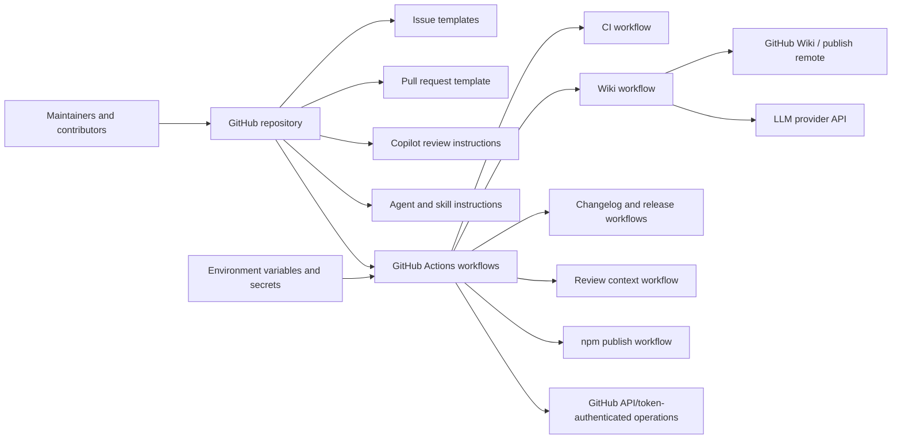
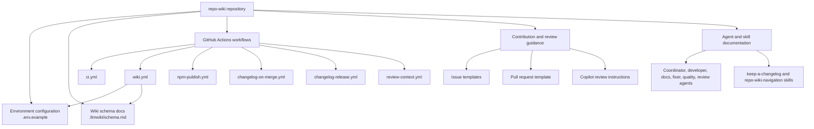
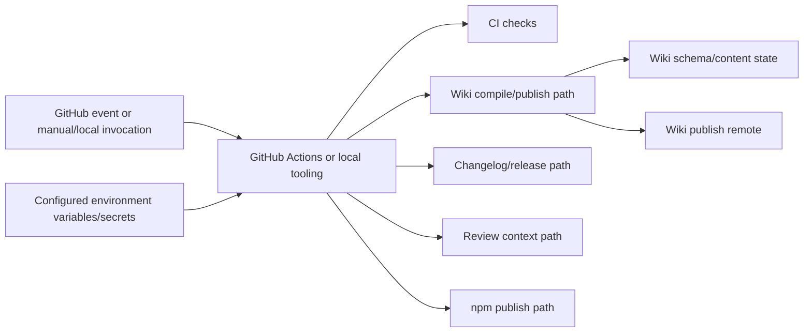
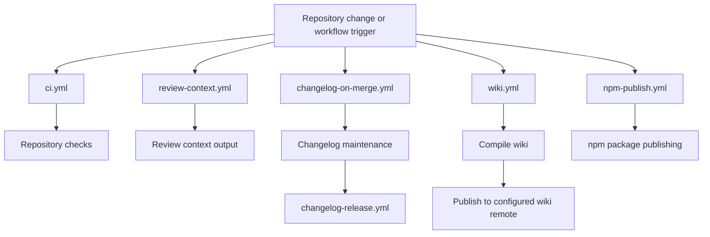

# Architecture

## Executive Architecture Summary

This repository is configured as a GitHub-hosted project for producing and maintaining a repository wiki, with operational emphasis on CI automation, GitHub Wiki publishing, changelog/release workflows, review context generation, and contributor/agent guidance. The strongest available architectural evidence is configuration-oriented rather than implementation-oriented: workflow files under `.github/workflows/`, environment configuration in `.env.example`, issue and pull request templates under `.github/`, agent/skill instructions under `.github/agents/` and `.github/skills/`, and a wiki schema document at `.llmwiki/schema.md`.

Based on the available source cards, the repository has these major architectural areas:

| Area | Responsibility | Evidence |
| --- | --- | --- |
| Wiki compilation/publishing operations | CI workflow surface for compiling and/or publishing wiki output, configured by wiki-related environment variables. | `.github/workflows/wiki.yml`, `.env.example` |
| General CI | Background workflow for repository checks. Specific jobs/steps are not available in the provided source-card excerpts. | `.github/workflows/ci.yml` |
| Package publishing | npm publishing workflow surface. Specific package metadata and scripts are not available in the provided source-card set. | `.github/workflows/npm-publish.yml` |
| Changelog and release automation | Workflows and skill instructions for changelog maintenance and release-related automation. | `.github/workflows/changelog-on-merge.yml`, `.github/workflows/changelog-release.yml`, `.github/skills/keep-a-changelog/SKILL.md` |
| Review/support automation | Review-context workflow, Copilot review instructions, PR template, issue templates, and specialized agent instructions. | `.github/workflows/review-context.yml`, `.github/copilot-review-instructions.md`, `.github/pull_request_template.md`, `.github/ISSUE_TEMPLATE/config.yml`, `.github/ISSUE_TEMPLATE/epic.yml`, `.github/ISSUE_TEMPLATE/task.yml`, `.github/agents/*.agent.md` |
| Wiki data model/schema | Documentation of the `.llmwiki` schema used to structure wiki/compiler state. | `.llmwiki/schema.md` |

The available evidence does **not** include implementation source files, package manifests, imports, runtime entrypoint code, or concrete test files. Therefore, this page treats the current architecture as a repository/operations architecture and avoids asserting internal code-level modules beyond what the provided source cards support.

## System and Repository Context

The repository boundary visible from the source cards is primarily GitHub-centric:

- GitHub Actions workflows provide automated operational entry points for CI, wiki processing, changelog updates, release handling, npm publication, and review context generation. Evidence: `.github/workflows/ci.yml`, `.github/workflows/wiki.yml`, `.github/workflows/changelog-on-merge.yml`, `.github/workflows/changelog-release.yml`, `.github/workflows/npm-publish.yml`, `.github/workflows/review-context.yml`.
- Environment configuration indicates integration with GitHub and an LLM/wiki compiler mode surface. The example variables are `GITHUB_REPOSITORY`, `GITHUB_TOKEN`, `LLMWIKI_COMPILER_MODE`, and `LLMWIKI_LLM_API_KEY`. Evidence: `.env.example`.
- The wiki workflow also declares wiki publishing-related environment surfaces, including `LLMWIKI_COMPILER_MODE` and `LLMWIKI_PUBLISH_REMOTE`. Evidence: `.github/workflows/wiki.yml`.
- Some workflows use `GH_TOKEN` as an operational environment variable. Evidence: `.github/workflows/changelog-on-merge.yml`, `.github/workflows/review-context.yml`.
- Human and agent-facing contributor surfaces are defined through issue templates, a pull request template, Copilot review instructions, agent instructions, and skills. Evidence: `.github/ISSUE_TEMPLATE/config.yml`, `.github/ISSUE_TEMPLATE/epic.yml`, `.github/ISSUE_TEMPLATE/task.yml`, `.github/pull_request_template.md`, `.github/copilot-review-instructions.md`, `.github/agents/*.agent.md`, `.github/skills/*.md`.

The following context diagram is supported at the repository-boundary level by workflow/configuration source paths. It does **not** claim internal implementation call paths.

Diagram evidence:

| Diagram element | Supporting source paths |
| --- | --- |
| GitHub Actions workflows | `.github/workflows/ci.yml`, `.github/workflows/wiki.yml`, `.github/workflows/changelog-on-merge.yml`, `.github/workflows/changelog-release.yml`, `.github/workflows/npm-publish.yml`, `.github/workflows/review-context.yml` |
| GitHub/token-authenticated operations | `.env.example`, `.github/workflows/changelog-on-merge.yml`, `.github/workflows/review-context.yml` |
| Wiki publishing surface | `.github/workflows/wiki.yml` |
| LLM provider configuration surface | `.env.example` |
| Contributor and agent guidance | `.github/ISSUE_TEMPLATE/*.yml`, `.github/pull_request_template.md`, `.github/copilot-review-instructions.md`, `.github/agents/*.agent.md`, `.github/skills/*.md` |

## Major Modules and Responsibilities

### Wiki Compiler and Wiki Publishing Surface

The repository includes configuration for wiki-oriented compilation and publishing:

- `.env.example` defines `LLMWIKI_COMPILER_MODE`, `LLMWIKI_LLM_API_KEY`, `GITHUB_REPOSITORY`, and `GITHUB_TOKEN`, indicating that local or automated wiki operations can be configured with a GitHub repository target, a GitHub token, compiler mode, and an LLM API key.
- `.github/workflows/wiki.yml` is a CI workflow with background-work and environment-variable hints, using `LLMWIKI_COMPILER_MODE` and `LLMWIKI_PUBLISH_REMOTE`.
- `.llmwiki/schema.md` is a data-model/documentation artifact for the wiki schema.

Supported responsibility: orchestrating wiki generation and/or publishing through workflow and environment configuration. Unsupported by the provided source cards: exact compiler implementation, entrypoint file, generated page format beyond the schema documentation, provider client implementation, and publish algorithm.

### CI Workflow Surface

`.github/workflows/ci.yml` defines a CI workflow surface. The source-card excerpt identifies it as CI with background-work hints, but does not expose the jobs, commands, package manager, matrix, or test runner. Therefore, this page can only claim that a CI workflow exists, not what it validates.

### npm Publishing Surface

`.github/workflows/npm-publish.yml` defines an npm publishing workflow surface. The available source card does not include the npm package name, package scripts, registry configuration, trigger conditions, or release gating. It is therefore treated as an operational surface rather than a verified package architecture.

### Changelog and Release Automation

The repository has two changelog/release-related workflows:

- `.github/workflows/changelog-on-merge.yml`, with background-work and `GH_TOKEN` environment-variable hints.
- `.github/workflows/changelog-release.yml`, with background-work hints.

It also includes `.github/skills/keep-a-changelog/SKILL.md`, which is a documentation/skill artifact for changelog handling.

Supported responsibility: automated or semi-automated changelog/release maintenance through GitHub Actions and skill instructions. Unsupported by the provided source cards: exact changelog file path, release trigger policy, semantic versioning behavior, and whether changelog updates are committed, opened as pull requests, or attached to releases.

### Review Context and Contributor Automation

Review and contribution support are represented by:

- `.github/workflows/review-context.yml`, a background workflow using `GH_TOKEN`.
- `.github/copilot-review-instructions.md`, which provides review guidance.
- `.github/pull_request_template.md`, which shapes PR submissions.
- `.github/ISSUE_TEMPLATE/config.yml`, `.github/ISSUE_TEMPLATE/epic.yml`, and `.github/ISSUE_TEMPLATE/task.yml`, which shape issue intake.
- `.github/agents/coordinator.agent.md`, `.github/agents/developer.agent.md`, `.github/agents/docs.agent.md`, `.github/agents/fixer.agent.md`, `.github/agents/quality.agent.md`, and `.github/agents/review.agent.md`, which define role-specific agent guidance.
- `.github/skills/repo-wiki-navigation/SKILL.md`, which documents a wiki navigation skill.

Supported responsibility: standardizing contribution, review, and agent-assisted workflows. Unsupported by the provided source cards: whether these agent/skill files are consumed by runtime code, by GitHub Copilot, or only by human/agent convention.

### Wiki Schema and Data Model Documentation

`.llmwiki/schema.md` is identified as a data-model documentation card. It is the only provided source card explicitly categorized as a data model. This supports the existence of a repository-specific schema/documentation layer for wiki content or compiler state, but the available excerpt does not expose the schema fields or validation rules.

### Component Diagram

The following diagram is derived from repository structure and workflow/configuration evidence. It shows operational components and repository-maintained guidance surfaces, not implementation-level imports.

## Runtime, Data, and Control-Flow Relationships

The available source cards do not include application runtime code, imports, function/class symbols, command implementations, or test execution traces. Runtime relationships can therefore only be described at the workflow/configuration level.

### Configuration Flow

The clearest supported control/data relationship is configuration into operational workflows:

| Configuration / secret surface | Apparent consumer or context | Evidence |
| --- | --- | --- |
| `GITHUB_REPOSITORY` | GitHub repository targeting for local or automated tooling. | `.env.example` |
| `GITHUB_TOKEN` | GitHub-authenticated local or automated tooling. | `.env.example` |
| `LLMWIKI_COMPILER_MODE` | Wiki compiler mode selection; also present in wiki workflow. | `.env.example`, `.github/workflows/wiki.yml` |
| `LLMWIKI_LLM_API_KEY` | LLM provider authentication/configuration for wiki compiler operations. | `.env.example` |
| `LLMWIKI_PUBLISH_REMOTE` | Wiki publishing target/remote used by the wiki workflow. | `.github/workflows/wiki.yml` |
| `GH_TOKEN` | GitHub CLI/API authentication for changelog/review-context workflows. | `.github/workflows/changelog-on-merge.yml`, `.github/workflows/review-context.yml` |

### Workflow-Level Control Paths

Supported workflow-level paths:

1. GitHub events can trigger GitHub Actions workflows. Evidence: presence of workflow files in `.github/workflows/*.yml`.
2. Wiki-related workflow execution is configured through `LLMWIKI_COMPILER_MODE` and `LLMWIKI_PUBLISH_REMOTE`. Evidence: `.github/workflows/wiki.yml`.
3. Changelog-on-merge and review-context automation use `GH_TOKEN`. Evidence: `.github/workflows/changelog-on-merge.yml`, `.github/workflows/review-context.yml`.
4. Local/environment-based wiki tooling can be configured through `.env.example` variables. Evidence: `.env.example`.

The following control-flow diagram is intentionally limited to workflow/configuration relationships. It does not assert specific shell commands or application functions.

Evidence and limitations:

| Relationship | Evidence | Limitation |
| --- | --- | --- |
| Environment variables configure wiki/GitHub/LLM behavior | `.env.example`, `.github/workflows/wiki.yml` | Exact code consuming variables is not available in the source cards. |
| GitHub workflows provide operational control paths | `.github/workflows/*.yml` | Exact triggers, jobs, and commands are not visible in the provided excerpts. |
| Wiki path relates to schema/content state | `.llmwiki/schema.md`, `.github/workflows/wiki.yml` | Exact schema fields and compiler data flow are not visible in the provided excerpts. |

## Build, Test, Deployment, and Operational Surfaces

The repository has several CI/CD and operational surfaces under `.github/workflows/`:

| Workflow | Architectural role | Environment/configuration evidence | Source |
| --- | --- | --- | --- |
| `ci.yml` | General CI/check workflow. | No env vars shown in source-card excerpt. | `.github/workflows/ci.yml` |
| `wiki.yml` | Wiki compile/publish workflow surface. | `LLMWIKI_COMPILER_MODE`, `LLMWIKI_PUBLISH_REMOTE`. | `.github/workflows/wiki.yml` |
| `npm-publish.yml` | npm package publication workflow surface. | No env vars shown in source-card excerpt. | `.github/workflows/npm-publish.yml` |
| `changelog-on-merge.yml` | Changelog automation after merge or merge-related events. | `GH_TOKEN`. | `.github/workflows/changelog-on-merge.yml` |
| `changelog-release.yml` | Release/changelog automation surface. | No env vars shown in source-card excerpt. | `.github/workflows/changelog-release.yml` |
| `review-context.yml` | Review context generation workflow surface. | `GH_TOKEN`. | `.github/workflows/review-context.yml` |

Operational entry points and supporting files:

| Surface | Purpose | Evidence |
| --- | --- | --- |
| `.env.example` | Documents required/optional environment variable names for local or automated operation. | `.env.example` |
| Issue templates | Structure task and epic intake. | `.github/ISSUE_TEMPLATE/config.yml`, `.github/ISSUE_TEMPLATE/epic.yml`, `.github/ISSUE_TEMPLATE/task.yml` |
| Pull request template | Structures PR review and submission expectations. | `.github/pull_request_template.md` |
| Copilot review instructions | Provides automated review guidance. | `.github/copilot-review-instructions.md` |
| Agent files | Define role-specific agent behavior/guidance. | `.github/agents/*.agent.md` |
| Skill files | Define reusable procedures for changelog and wiki navigation. | `.github/skills/keep-a-changelog/SKILL.md`, `.github/skills/repo-wiki-navigation/SKILL.md` |
| `.llmwiki/schema.md` | Documents wiki schema/data model. | `.llmwiki/schema.md` |

### Build/Test/Deploy Flow Diagram

This diagram is supported by the presence of CI workflow files and environment-variable surfaces. It does not claim exact workflow triggers, job names, or commands.

Citations and limitations:

- The workflow nodes are supported by `.github/workflows/ci.yml`, `.github/workflows/review-context.yml`, `.github/workflows/changelog-on-merge.yml`, `.github/workflows/changelog-release.yml`, `.github/workflows/wiki.yml`, and `.github/workflows/npm-publish.yml`.
- The wiki publishing configuration is supported by `.github/workflows/wiki.yml`.
- The npm registry target is inferred from the workflow filename `npm-publish.yml`; the provided source card does not expose registry URL, package name, or publish command.
- The exact sequencing between changelog-on-merge and changelog-release is inferred from names and roles, not from visible workflow dependency evidence.

## Cross-Cutting Concerns

### Configuration and Secrets

The visible configuration surface includes GitHub, LLM, and wiki publishing variables:

| Variable | Use indicated by source cards | Evidence |
| --- | --- | --- |
| `GITHUB_REPOSITORY` | Repository target configuration. | `.env.example` |
| `GITHUB_TOKEN` | GitHub authentication. | `.env.example` |
| `LLMWIKI_COMPILER_MODE` | Wiki compiler mode configuration. | `.env.example`, `.github/workflows/wiki.yml` |
| `LLMWIKI_LLM_API_KEY` | LLM provider authentication/configuration. | `.env.example` |
| `LLMWIKI_PUBLISH_REMOTE` | Wiki publishing remote configuration. | `.github/workflows/wiki.yml` |
| `GH_TOKEN` | GitHub-authenticated automation in selected workflows. | `.github/workflows/changelog-on-merge.yml`, `.github/workflows/review-context.yml` |

No secret values are present in this page. Only variable names are documented.

### Security and Access Control

Security-relevant surfaces include token-based GitHub operations and LLM API access:

- GitHub API or GitHub CLI operations appear to require `GITHUB_TOKEN` or `GH_TOKEN`. Evidence: `.env.example`, `.github/workflows/changelog-on-merge.yml`, `.github/workflows/review-context.yml`.
- LLM-backed wiki compilation appears to require `LLMWIKI_LLM_API_KEY`. Evidence: `.env.example`.
- Wiki publishing uses `LLMWIKI_PUBLISH_REMOTE`, which may represent a remote destination requiring appropriate credentials. Evidence: `.github/workflows/wiki.yml`.

The available source cards do not expose permission scopes, workflow `permissions:` blocks, secret names, token storage policy, or masking behavior. Those details should be verified directly from workflow contents before making stronger claims.

### APIs and External Integrations

Supported external surfaces:

| External surface | Evidence |
| --- | --- |
| GitHub repository/API/token-authenticated operations | `.env.example`, `.github/workflows/changelog-on-merge.yml`, `.github/workflows/review-context.yml` |
| GitHub Actions | `.github/workflows/*.yml` |
| GitHub Wiki or another wiki publish remote | `.github/workflows/wiki.yml` |
| LLM provider API | `.env.example` |
| npm publishing ecosystem | `.github/workflows/npm-publish.yml` |

The available source cards do not provide implementation details for API clients, package publishing authentication, or LLM provider protocol.

### Data Model and Wiki Schema

The repository includes `.llmwiki/schema.md`, which is identified as data-model documentation. This supports a schema-oriented wiki architecture, but the source-card excerpt does not provide the schema contents. Any page-specific field definitions, validation rules, or generated-wiki invariants should be validated against `.llmwiki/schema.md` before being treated as authoritative.

### Documentation Trust and Source Authority

The page intentionally prioritizes source/configuration cards over secondary documentation cards:

- CI and operational claims are grounded in `.github/workflows/*.yml`.
- Environment-variable claims are grounded in `.env.example` and workflow source cards.
- Data-model existence is grounded in `.llmwiki/schema.md`.
- Contributor/agent process claims are grounded in `.github/ISSUE_TEMPLATE/*`, `.github/pull_request_template.md`, `.github/copilot-review-instructions.md`, `.github/agents/*`, and `.github/skills/*`.

The provided documentation cards for `README.md`, `docs/PLAN.md`, `docs/WHY.md`, and `docs/plans/*.md` are useful for product intent but are only partially validated or stale. This architecture page does not rely on those cards for implementation-level claims.

## Caveats and Open Questions

### Caveats

- The provided source cards do not include implementation source files, package manifests, lockfiles, test files, or import graphs. As a result, internal runtime architecture, class/function boundaries, package scripts, and dependency chains cannot be verified from the available evidence.
- Diagrams in this page are repository-structure and workflow/configuration diagrams. They are not implementation call graphs.
- The build/test/deploy flow diagram uses workflow filenames and environment hints as evidence. Exact triggers, jobs, commands, and artifact behavior are not visible in the source-card excerpts.
- The npm publishing surface is inferred from `.github/workflows/npm-publish.yml`; exact package name, registry, authentication method, and publish command are not visible.
- The LLM provider integration is inferred from `LLMWIKI_LLM_API_KEY` in `.env.example`; no provider client code is available in the source cards.
- The wiki publishing destination is inferred from `LLMWIKI_PUBLISH_REMOTE` in `.github/workflows/wiki.yml`; exact publish mechanics are not visible.
- `.llmwiki/schema.md` is known to exist as a data-model documentation file, but the provided excerpt does not expose its schema details.
- The agent and skill documents demonstrate maintained guidance surfaces, but the provided source cards do not prove whether they are consumed automatically by tooling or manually by humans/agents.

### Open Questions

1. What are the actual implementation entry points for local wiki compilation and GitHub Action execution?
   - Needs evidence from package manifests and source files not present in the provided source cards.
2. What commands does `ci.yml` run, and what test framework or quality gates are authoritative?
   - Needs direct workflow job/step contents from `.github/workflows/ci.yml`.
3. What package is published by `npm-publish.yml`, and under what release conditions?
   - Needs `package.json`, workflow job contents, and release/tag policy.
4. What is the exact `.llmwiki` schema, and how is it validated?
   - Needs full contents of `.llmwiki/schema.md` and any validation code/tests.
5. Which LLM provider protocol is implemented, and how are provider failures/retries handled?
   - Needs implementation source files and tests.
6. Does the wiki workflow publish directly to GitHub Wiki, upload artifacts, open PRs, or support multiple publish modes?
   - Needs direct workflow steps and implementation source.
7. Are the agent and skill files purely documentation, or are they loaded by a tool/runtime?
   - Needs tool configuration or source code references.
8. What token permissions are required for `GITHUB_TOKEN`, `GH_TOKEN`, and wiki publishing?
   - Needs workflow `permissions:` blocks and publish implementation details.

<!-- HUMAN_NOTES_START -->
<!-- HUMAN_NOTES_END -->
