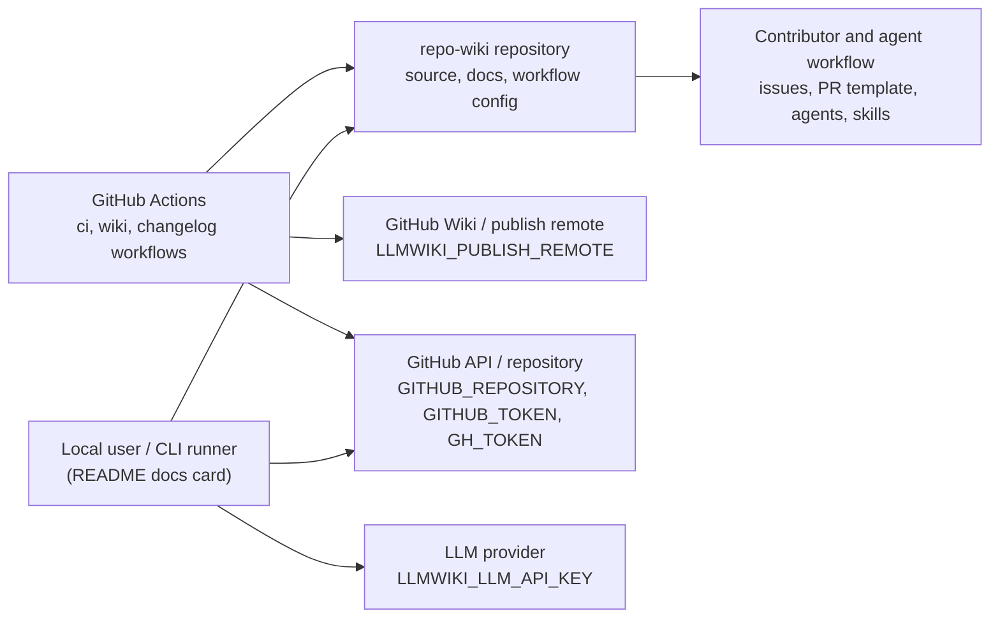
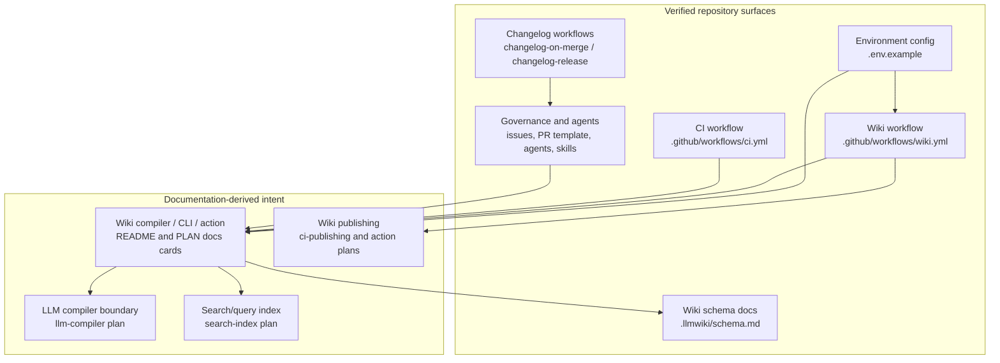
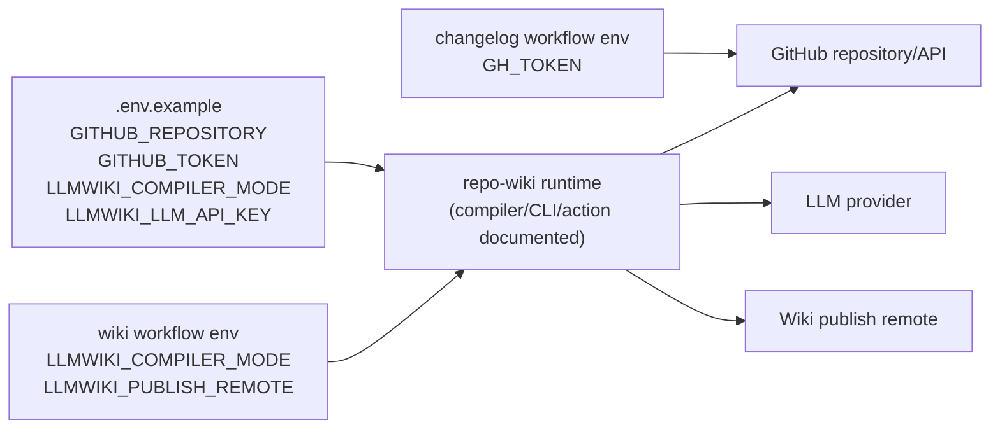
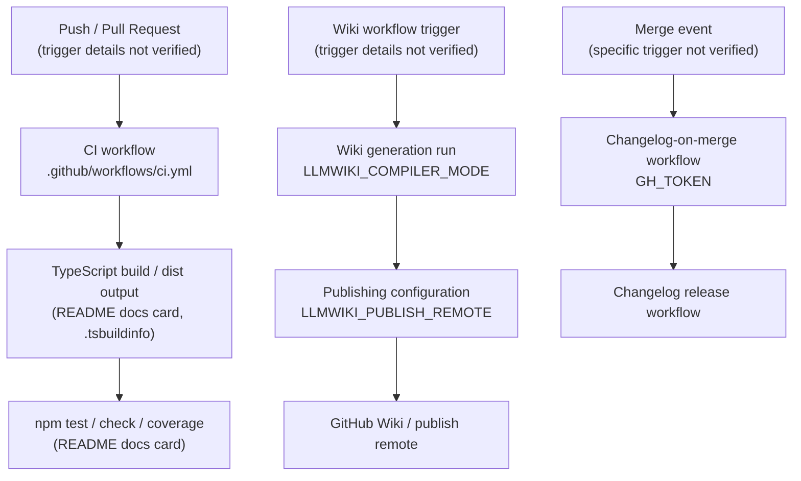

# Architecture

## Executive Architecture Summary

`repo-wiki` is documented as a dual-role package: a local CLI and a GitHub Action for compiling repository sources into a GitHub Wiki-style knowledge base, with package verification running against compiled output in `dist/` according to the partially validated `README.md` documentation card. The repository evidence supplied for this page is strongest for operational and governance surfaces: CI workflows, wiki publishing workflow configuration, issue templates, agent instructions, changelog skills, environment configuration, and the `.llmwiki` schema documentation. Source-code module boundaries for the compiler itself are not present in the supplied source cards, so runtime internals are described conservatively and flagged where they rely on documentation cards rather than directly scanned imports or implementation files.

Major architectural surfaces supported by the provided source cards are:

| Surface | Responsibility | Evidence |
|---|---|---|
| Environment configuration | Local/GitHub runtime configuration for repository target, GitHub authentication, compiler mode, and LLM API key. | `.env.example` |
| Wiki CI workflow | Background automation for wiki generation/publishing, configured with `LLMWIKI_COMPILER_MODE` and `LLMWIKI_PUBLISH_REMOTE`. | `.github/workflows/wiki.yml` |
| General CI workflow | Background continuous-integration surface. | `.github/workflows/ci.yml` |
| Changelog automation | Background workflows and skill guidance for changelog maintenance/release flow. | `.github/workflows/changelog-on-merge.yml`, `.github/workflows/changelog-release.yml`, `.github/skills/keep-a-changelog/SKILL.md` |
| Project governance and human/agent workflow | Issue templates, pull request template, Copilot review instructions, and agent role instructions. | `.github/ISSUE_TEMPLATE/*.yml`, `.github/pull_request_template.md`, `.github/copilot-review-instructions.md`, `.github/agents/*.agent.md`, `AGENTS.md`, `.pi/AGENTS.md`, `.pi/settings.json` |
| Wiki data model/schema | Schema documentation for generated wiki artifacts. | `.llmwiki/schema.md` |
| Product intent and planned compiler modules | LLM Wiki pattern, LLM compiler, GitHub Action, CI publishing, search index, and incremental mode. These are secondary documentation-card claims, not fully validated by source cards in this input. | `docs/PLAN.md` documentation card, `docs/WHY.md` documentation card, `docs/plans/*.md` documentation cards |

Key design decisions visible from the evidence:

1. The repository has an explicit wiki-generation operational mode exposed through environment variables and a dedicated wiki workflow. `.env.example` lists `GITHUB_REPOSITORY`, `GITHUB_TOKEN`, `LLMWIKI_COMPILER_MODE`, and `LLMWIKI_LLM_API_KEY`; `.github/workflows/wiki.yml` references `LLMWIKI_COMPILER_MODE` and `LLMWIKI_PUBLISH_REMOTE`.
2. GitHub is a primary integration boundary: issue templates, PR templates, Copilot review instructions, GitHub Actions workflows, GitHub token usage, and repository/wiki configuration are all present under `.github/` and `.env.example`.
3. LLM usage is an intended integration boundary because `.env.example` includes `LLMWIKI_LLM_API_KEY`, and the partially validated `docs/plans/llm-compiler.md` documentation card describes a provider-agnostic OpenAI-style chat completions boundary.
4. The project treats generated wiki content as structured artifacts: `.llmwiki/schema.md` is identified as data-model documentation, and partially validated planning docs describe source cards, documentation cards, generated pages, search indexing, and publishing flows.

## System and Repository Context

The supplied source-card set shows a repository organized around GitHub-hosted automation, wiki generation configuration, and contributor/agent workflow documentation.

### Repository boundaries and external surfaces

| Boundary / External actor | Interaction with repository | Evidence | Confidence |
|---|---|---|---|
| Local user / CLI runner | Provides local environment variables such as repository target, GitHub token, compiler mode, and LLM API key. The `README.md` documentation card states the package has a local CLI role. | `.env.example`; `README.md` documentation card | Medium |
| GitHub Actions | Executes CI, wiki, changelog-on-merge, and changelog-release workflows as background automation. | `.github/workflows/ci.yml`, `.github/workflows/wiki.yml`, `.github/workflows/changelog-on-merge.yml`, `.github/workflows/changelog-release.yml` | Medium |
| GitHub repository and wiki remotes | Target repository is configured via `GITHUB_REPOSITORY`; wiki publishing remote is configured in the wiki workflow through `LLMWIKI_PUBLISH_REMOTE`. | `.env.example`, `.github/workflows/wiki.yml` | Medium |
| GitHub API / authentication | GitHub token variables are present: `GITHUB_TOKEN` in local example configuration and `GH_TOKEN` in changelog-on-merge workflow. | `.env.example`, `.github/workflows/changelog-on-merge.yml` | Medium |
| LLM provider | LLM API key variable is present; planning docs describe a provider-agnostic OpenAI-style chat-completion boundary. | `.env.example`; `docs/plans/llm-compiler.md` documentation card | Medium-low |
| Contributors and AI coding agents | Issue templates, PR template, Copilot review instructions, agent role files, and PI settings govern project work. | `.github/ISSUE_TEMPLATE/config.yml`, `.github/ISSUE_TEMPLATE/epic.yml`, `.github/ISSUE_TEMPLATE/task.yml`, `.github/pull_request_template.md`, `.github/copilot-review-instructions.md`, `.github/agents/*.agent.md`, `AGENTS.md`, `.pi/AGENTS.md`, `.pi/settings.json` | Medium |

### Context diagram

The following diagram is limited to repository boundaries and operational surfaces directly supported by the provided source cards. It does not show unverified internal source-code modules.

Evidence: `.env.example`, `.github/workflows/ci.yml`, `.github/workflows/wiki.yml`, `.github/workflows/changelog-on-merge.yml`, `.github/workflows/changelog-release.yml`, `.github/ISSUE_TEMPLATE/config.yml`, `.github/ISSUE_TEMPLATE/epic.yml`, `.github/ISSUE_TEMPLATE/task.yml`, `.github/pull_request_template.md`, `.github/copilot-review-instructions.md`, `.github/agents/*.agent.md`, `.github/skills/*.md`, `AGENTS.md`, `.pi/AGENTS.md`, `.pi/settings.json`, and the `README.md` documentation card.

## Major Modules and Responsibilities

Because implementation source files are not included among the supplied source cards, the modules below are grouped by repository surfaces and partially validated plan modules rather than by confirmed import graphs.

### Wiki Compiler and Generated Knowledge Base

The project’s primary intended module is the wiki compiler/generator. The partially validated `README.md` documentation card describes the package as a local CLI and GitHub Action, and the partially validated `docs/PLAN.md` and `docs/WHY.md` documentation cards describe the product as an implementation of an “LLM Wiki” pattern for software repositories. `.llmwiki/schema.md` is identified as data-model documentation for generated wiki artifacts.

Responsibilities inferred from documentation cards and configuration:

- Compile repository evidence into wiki pages. Evidence: `README.md` documentation card, `docs/PLAN.md` documentation card, `.llmwiki/schema.md`.
- Use a schema to structure generated wiki artifacts. Evidence: `.llmwiki/schema.md`, `docs/PLAN.md` documentation card.
- Support local and CI execution modes. Evidence: `.env.example`, `.github/workflows/wiki.yml`, `README.md` documentation card.
- Potentially publish generated pages to a wiki remote. Evidence: `.github/workflows/wiki.yml`, `docs/plans/ci-publishing.md` documentation card, `docs/plans/github-action.md` documentation card.

Claim status: **partially supported**. The architecture intent is clear from docs and workflow/environment surfaces, but implementation files for the compiler are not present in the supplied source-card set.

### GitHub Action and Wiki Publishing Workflow

The repository includes a dedicated `.github/workflows/wiki.yml` workflow. The workflow source card is classified as CI/configuration and references `LLMWIKI_COMPILER_MODE` and `LLMWIKI_PUBLISH_REMOTE`, indicating an operational path for wiki compilation and optional/targeted publishing behavior.

Responsibilities:

- Run wiki-generation automation in GitHub Actions. Evidence: `.github/workflows/wiki.yml`.
- Configure compiler mode through `LLMWIKI_COMPILER_MODE`. Evidence: `.github/workflows/wiki.yml`, `.env.example`.
- Configure a publishing destination through `LLMWIKI_PUBLISH_REMOTE`. Evidence: `.github/workflows/wiki.yml`.
- Align with planned GitHub Action behavior described by the partially validated `docs/plans/github-action.md` documentation card.

Claim status: **supported for workflow existence and environment surface; partially supported for detailed behavior**.

### CI and Quality Workflow

The repository has a CI workflow at `.github/workflows/ci.yml`, classified as CI and background work. The `README.md` documentation card states that `npm test`, `npm run check`, and `npm run coverage` require successful TypeScript compilation into `dist/`, but the corresponding `package.json` script definitions are not present in the provided source cards.

Responsibilities:

- Run repository validation in CI. Evidence: `.github/workflows/ci.yml`.
- Validate compiled/package output according to documented intent. Evidence: `README.md` documentation card.
- Support background automation for repository health. Evidence: `.github/workflows/ci.yml`.

Claim status: **supported for CI workflow presence; partially supported for exact commands**.

### Changelog and Release Automation

Two workflows and one skill file define a changelog/release maintenance surface:

- `.github/workflows/changelog-on-merge.yml`
- `.github/workflows/changelog-release.yml`
- `.github/skills/keep-a-changelog/SKILL.md`

The changelog-on-merge workflow references `GH_TOKEN`, indicating GitHub-authenticated automation. The skill file provides human/agent guidance for changelog conventions.

Responsibilities:

- Maintain changelog updates around merges. Evidence: `.github/workflows/changelog-on-merge.yml`, `.github/skills/keep-a-changelog/SKILL.md`.
- Support release-related changelog automation. Evidence: `.github/workflows/changelog-release.yml`.
- Use GitHub authentication for changelog automation where needed. Evidence: `.github/workflows/changelog-on-merge.yml`.

Claim status: **supported for workflow/configuration existence; detailed release semantics not verified**.

### Contributor, Review, and Agent Operating Model

The repository includes a substantial governance layer under `.github/` and root-level agent instructions:

- Issue templates: `.github/ISSUE_TEMPLATE/config.yml`, `.github/ISSUE_TEMPLATE/epic.yml`, `.github/ISSUE_TEMPLATE/task.yml`
- Pull request template: `.github/pull_request_template.md`
- Copilot review instructions: `.github/copilot-review-instructions.md`
- Agent roles: `.github/agents/coordinator.agent.md`, `.github/agents/developer.agent.md`, `.github/agents/docs.agent.md`, `.github/agents/fixer.agent.md`, `.github/agents/quality.agent.md`, `.github/agents/review.agent.md`
- Repo-level agent guidance: `AGENTS.md`, `.pi/AGENTS.md`
- PI settings: `.pi/settings.json`
- Navigation skill: `.github/skills/repo-wiki-navigation/SKILL.md`

Responsibilities:

- Standardize issue intake for epics and tasks. Evidence: `.github/ISSUE_TEMPLATE/*.yml`.
- Standardize pull request review input. Evidence: `.github/pull_request_template.md`.
- Provide review expectations for Copilot. Evidence: `.github/copilot-review-instructions.md`.
- Define agent roles for coordination, development, documentation, fixing, quality, and review. Evidence: `.github/agents/*.agent.md`.
- Support wiki navigation and changelog conventions through skills. Evidence: `.github/skills/repo-wiki-navigation/SKILL.md`, `.github/skills/keep-a-changelog/SKILL.md`.

Claim status: **supported for governance artifacts; role behavior depends on external agent runtime**.

### Configuration and Environment Module

`.env.example` defines four environment variables:

| Variable | Architectural role | Evidence |
|---|---|---|
| `GITHUB_REPOSITORY` | Identifies the target GitHub repository. | `.env.example` |
| `GITHUB_TOKEN` | Provides GitHub authentication for local or configured runs. | `.env.example` |
| `LLMWIKI_COMPILER_MODE` | Selects compiler mode; also referenced by wiki workflow. | `.env.example`, `.github/workflows/wiki.yml` |
| `LLMWIKI_LLM_API_KEY` | Provides LLM provider authentication. | `.env.example` |

Additional workflow-only variables:

| Variable | Architectural role | Evidence |
|---|---|---|
| `LLMWIKI_PUBLISH_REMOTE` | Configures wiki publishing destination in CI. | `.github/workflows/wiki.yml` |
| `GH_TOKEN` | Provides GitHub authentication in changelog-on-merge automation. | `.github/workflows/changelog-on-merge.yml` |

Claim status: **supported for variable names and broad purpose; actual value semantics not verified from implementation**.

### Planned / Documented Compiler Subsystems

The following modules appear in partially validated planning documentation but are not directly verified by implementation source cards in this input:

| Planned subsystem | Documented responsibility | Evidence | Status |
|---|---|---|---|
| LLM compiler boundary | Provider-agnostic OpenAI-style chat-completions-compatible boundary for GitHub Actions and local runs. | `docs/plans/llm-compiler.md` documentation card; `.env.example` | Partially validated |
| CI publishing | Fetch existing wiki state, test, and publish wiki content. | `docs/plans/ci-publishing.md` documentation card; `.github/workflows/wiki.yml` | Partially validated |
| GitHub Action | Run wiki generation, upload local wiki artifacts, and optionally publish when credentials are configured. | `docs/plans/github-action.md` documentation card; `.github/workflows/wiki.yml` | Partially validated |
| Search index | Build local search index over generated wiki pages, source cards, and documentation cards for `repo-wiki search` and `repo-wiki query`. | `docs/plans/search-index.md` documentation card | Partially validated |
| Incremental mode | Incremental generation/testing strategy. | `docs/plans/incremental-mode.md` documentation card | Stale |

Claim status: **documentation-derived only unless paired with source evidence above**.

### Component/module diagram

This diagram is inferred from repository structure and documented module intent. It intentionally separates verified operational surfaces from documentation-derived planned/compiler internals.

Evidence: `.env.example`, `.github/workflows/wiki.yml`, `.github/workflows/ci.yml`, `.github/workflows/changelog-on-merge.yml`, `.github/workflows/changelog-release.yml`, `.github/ISSUE_TEMPLATE/*.yml`, `.github/pull_request_template.md`, `.github/copilot-review-instructions.md`, `.github/agents/*.agent.md`, `.github/skills/*.md`, `.llmwiki/schema.md`, `README.md` documentation card, and `docs/plans/*.md` documentation cards.

## Runtime, Data, and Control-Flow Relationships

The supplied source cards do not include implementation imports, CLI entry points, package metadata, or runtime source files. Therefore, runtime relationships are limited to environment-driven and workflow-driven control paths visible from configuration.

### Environment-driven runtime configuration

The main runtime configuration flow is:

1. A local or CI runner supplies environment variables.
2. `GITHUB_REPOSITORY` and GitHub token variables identify/authenticate against GitHub.
3. `LLMWIKI_COMPILER_MODE` selects the compiler mode.
4. `LLMWIKI_LLM_API_KEY` enables LLM-backed compilation.
5. In CI wiki publishing, `LLMWIKI_PUBLISH_REMOTE` configures the publish destination.

Evidence: `.env.example`, `.github/workflows/wiki.yml`, `.github/workflows/changelog-on-merge.yml`.

Claim status: **supported for configuration edges; internal runtime calls are not verified by imports**.

### Documentation/data artifact flow

Based on `.llmwiki/schema.md` and the planning documentation cards, the intended data model involves repository inputs being converted into structured source/documentation cards and then into generated wiki pages. The current page-generation prompt itself supplied “Source cards” and “Documentation cards,” and `.llmwiki/schema.md` is the repository evidence for schema/data-model documentation.

High-level documented flow:

| Stage | Description | Evidence |
|---|---|---|
| Repository evidence | Source code, configuration, CI, markdown docs, and schemas are collected as evidence. | `.llmwiki/schema.md`; current source-card list |
| Cards | Evidence is represented as source cards and documentation cards. | `.llmwiki/schema.md`; `docs/PLAN.md` documentation card |
| Wiki pages | Pages are generated from cards, with source code/configuration treated as higher authority than markdown documentation. | `.llmwiki/schema.md`; `docs/PLAN.md` documentation card |
| Publishing/search | Generated wiki pages may be published and/or indexed for search/query workflows. | `.github/workflows/wiki.yml`; `docs/plans/ci-publishing.md` documentation card; `docs/plans/search-index.md` documentation card |

Claim status: **partially supported by schema/planning docs; implementation not verified**.

## Build, Test, Deployment, and Operational Surfaces

### CI workflows

The repository has four CI/workflow files in the supplied source cards:

| Workflow | Operational role | Environment variables surfaced | Evidence |
|---|---|---|---|
| `.github/workflows/ci.yml` | General CI/background validation. | None surfaced in the source-card excerpt. | `.github/workflows/ci.yml` |
| `.github/workflows/wiki.yml` | Wiki-generation and/or publishing automation. | `LLMWIKI_COMPILER_MODE`, `LLMWIKI_PUBLISH_REMOTE` | `.github/workflows/wiki.yml` |
| `.github/workflows/changelog-on-merge.yml` | Changelog automation on merge. | `GH_TOKEN` | `.github/workflows/changelog-on-merge.yml` |
| `.github/workflows/changelog-release.yml` | Release/changelog automation. | None surfaced in the source-card excerpt. | `.github/workflows/changelog-release.yml` |

### Package scripts and compiled output

The partially validated `README.md` documentation card states:

- The package is dual-role: local CLI and GitHub Action.
- Local CLI and package verification run against compiled output in `dist/`.
- `npm test`, `npm run check`, and `npm run coverage` require successful TypeScript compilation.

The supplied source cards include `.tsbuildinfo`, which suggests TypeScript build metadata exists, but no `package.json`, `tsconfig.json`, or source files were provided as source cards. Therefore, the exact build scripts and TypeScript configuration cannot be verified from the available source-card evidence.

Evidence: `README.md` documentation card, `.tsbuildinfo`.

Claim status: **partially supported; script definitions not verified**.

### Build/test/deploy flow diagram

This diagram is based on workflow presence and partially validated documentation-card claims. Exact workflow steps and package scripts are not shown because the source-card excerpts do not include their contents.

Evidence: `.github/workflows/ci.yml`, `.github/workflows/wiki.yml`, `.github/workflows/changelog-on-merge.yml`, `.github/workflows/changelog-release.yml`, `.env.example`, `.tsbuildinfo`, `README.md` documentation card.

## Cross-Cutting Concerns

### Configuration management

Configuration is primarily exposed through environment variables:

- Local/example configuration: `GITHUB_REPOSITORY`, `GITHUB_TOKEN`, `LLMWIKI_COMPILER_MODE`, `LLMWIKI_LLM_API_KEY` in `.env.example`.
- Wiki workflow configuration: `LLMWIKI_COMPILER_MODE`, `LLMWIKI_PUBLISH_REMOTE` in `.github/workflows/wiki.yml`.
- Changelog automation token: `GH_TOKEN` in `.github/workflows/changelog-on-merge.yml`.

No environment variable values are reproduced here. Evidence: `.env.example`, `.github/workflows/wiki.yml`, `.github/workflows/changelog-on-merge.yml`.

### Security and secret handling

The repository architecture requires secret-bearing integrations:

| Secret-like input | Purpose | Evidence | Security note |
|---|---|---|---|
| `GITHUB_TOKEN` | GitHub authentication for local/configured runs. | `.env.example` | Should be provided via local secret management or CI secrets, not committed. |
| `GH_TOKEN` | GitHub authentication in changelog automation. | `.github/workflows/changelog-on-merge.yml` | Should be scoped to required GitHub operations. |
| `LLMWIKI_LLM_API_KEY` | LLM provider authentication. | `.env.example` | Should be treated as a provider secret. |

`.gitignore` is present as a source card, but its contents were not provided in the card excerpt, so this page cannot verify whether `.env` or other secret files are ignored. Evidence: `.gitignore`, `.env.example`.

### API and external service boundaries

The confirmed or documented external boundaries are:

- GitHub repository/API boundary through `GITHUB_REPOSITORY`, `GITHUB_TOKEN`, and `GH_TOKEN`. Evidence: `.env.example`, `.github/workflows/changelog-on-merge.yml`.
- Wiki publishing remote boundary through `LLMWIKI_PUBLISH_REMOTE`. Evidence: `.github/workflows/wiki.yml`.
- LLM provider boundary through `LLMWIKI_LLM_API_KEY` and the LLM compiler plan. Evidence: `.env.example`, `docs/plans/llm-compiler.md` documentation card.

The exact HTTP APIs, SDKs, or provider libraries are not verified because implementation source files and dependency manifests were not included in the supplied source cards.

### Data model and schema

`.llmwiki/schema.md` is identified as data-model documentation. The documentation cards describe source cards, documentation cards, generated pages, and search indexing as part of the intended architecture. This page treats schema and planning docs as secondary evidence for data-model intent because the supplied source cards do not include the compiler implementation.

Evidence: `.llmwiki/schema.md`, `docs/PLAN.md` documentation card, `docs/plans/search-index.md` documentation card.

### Documentation trust model

The generated architecture follows the repository evidence hierarchy:

1. CI/configuration/source cards are treated as high authority for operational surfaces. Evidence: `.github/workflows/*.yml`, `.env.example`, `.llmwiki/schema.md`.
2. Markdown documentation cards are used for intent and module naming, but operational claims from docs are marked partially supported unless source/config evidence also exists. Evidence: `README.md`, `docs/PLAN.md`, `docs/WHY.md`, `docs/plans/*.md` documentation cards.
3. The stale `docs/plans/incremental-mode.md` documentation card is not treated as current behavior.

### Contributor and agent workflow

The architecture includes a strong process layer:

- Issue templates for epics and tasks. Evidence: `.github/ISSUE_TEMPLATE/epic.yml`, `.github/ISSUE_TEMPLATE/task.yml`, `.github/ISSUE_TEMPLATE/config.yml`.
- PR structure and review instructions. Evidence: `.github/pull_request_template.md`, `.github/copilot-review-instructions.md`.
- Specialized agent roles for coordination, development, documentation, fixes, quality, and review. Evidence: `.github/agents/coordinator.agent.md`, `.github/agents/developer.agent.md`, `.github/agents/docs.agent.md`, `.github/agents/fixer.agent.md`, `.github/agents/quality.agent.md`, `.github/agents/review.agent.md`.
- Skills for changelog and repo-wiki navigation. Evidence: `.github/skills/keep-a-changelog/SKILL.md`, `.github/skills/repo-wiki-navigation/SKILL.md`.

These artifacts shape how work is performed but do not by themselves prove runtime behavior.

## Caveats and Open Questions

### Caveats

1. **Implementation source files were not included in the supplied source cards.** This page cannot verify actual CLI entry points, package exports, class/function boundaries, imports, dependency graph, or internal compiler control flow. Evidence gap: no implementation files listed in source cards.
2. **Package metadata was not included.** The `README.md` documentation card mentions `npm test`, `npm run check`, `npm run coverage`, TypeScript compilation, and `dist/`, but no `package.json` or `tsconfig.json` source card was supplied. Evidence: `README.md` documentation card, `.tsbuildinfo`.
3. **Workflow step details are not visible in the excerpts.** Workflow files are present and classified as CI/configuration, but this page only knows their names, category, runtime hints, and surfaced environment variables from the source cards. Evidence: `.github/workflows/*.yml`.
4. **The component diagram includes documentation-derived modules.** The diagram labels the wiki compiler, LLM boundary, publishing, and search index as documented intent where implementation evidence is absent. Evidence: `docs/plans/llm-compiler.md`, `docs/plans/ci-publishing.md`, `docs/plans/github-action.md`, `docs/plans/search-index.md` documentation cards.
5. **Incremental mode is stale documentation.** The `docs/plans/incremental-mode.md` documentation card is explicitly marked stale, so this page does not present incremental mode as current behavior.
6. **Secret ignore behavior is not verified.** `.gitignore` exists, but its contents were not provided in the source-card excerpt, so whether `.env` or other secret files are ignored remains unverified. Evidence: `.gitignore`.

### Open questions

1. What are the actual CLI entry points and exported APIs for the local package and GitHub Action?
2. Which source modules implement source-card extraction, documentation-card validation, wiki page generation, LLM calls, search indexing, and publishing?
3. What exact commands are run by `.github/workflows/ci.yml` and `.github/workflows/wiki.yml`?
4. Does the current implementation support all planned modules described in `docs/plans/*.md`, especially search/query and incremental mode?
5. How is `LLMWIKI_COMPILER_MODE` interpreted at runtime, and what valid mode values exist?
6. What schema entities and invariants are defined in `.llmwiki/schema.md`, and how are they enforced by tests or code?
7. What permissions are required for `GITHUB_TOKEN`, `GH_TOKEN`, and `LLMWIKI_PUBLISH_REMOTE` publishing?
8. Are generated wiki pages written only locally, uploaded as workflow artifacts, pushed to a wiki remote, or all of these depending on configuration?

<!-- HUMAN_NOTES_START -->
<!-- HUMAN_NOTES_END -->
