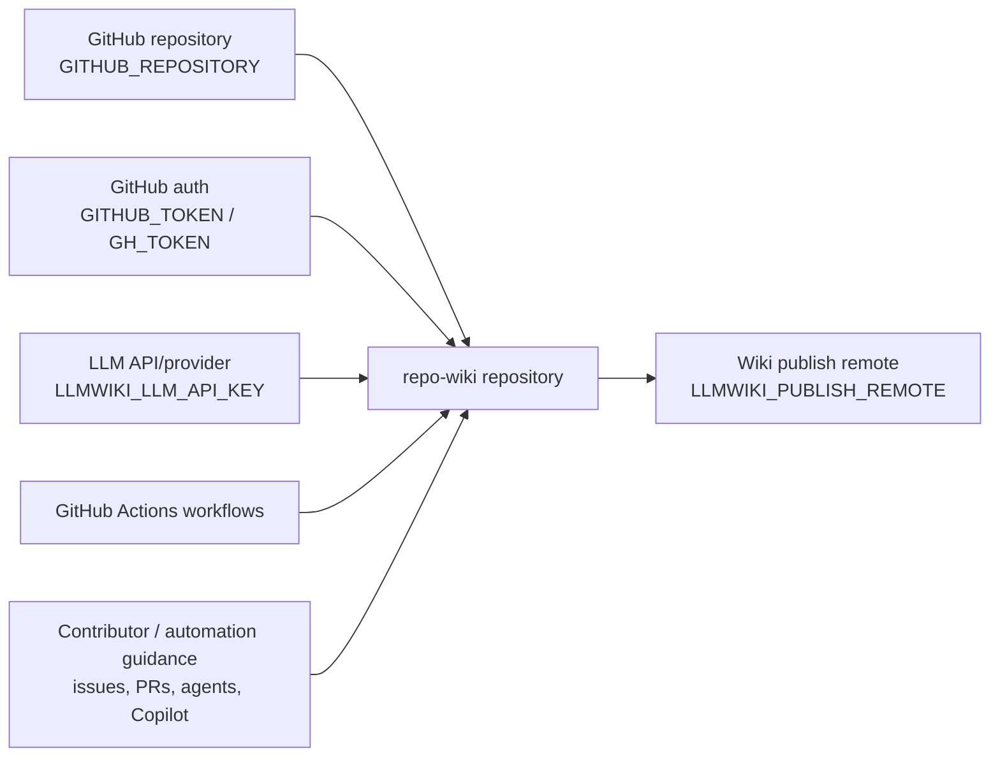
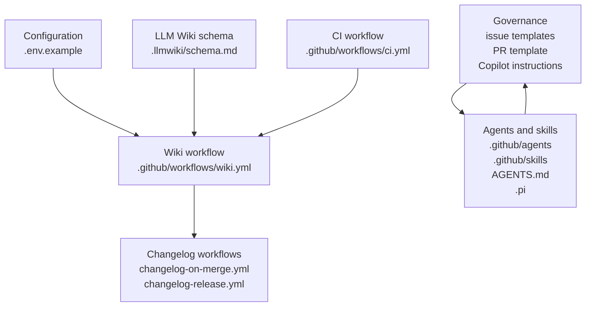
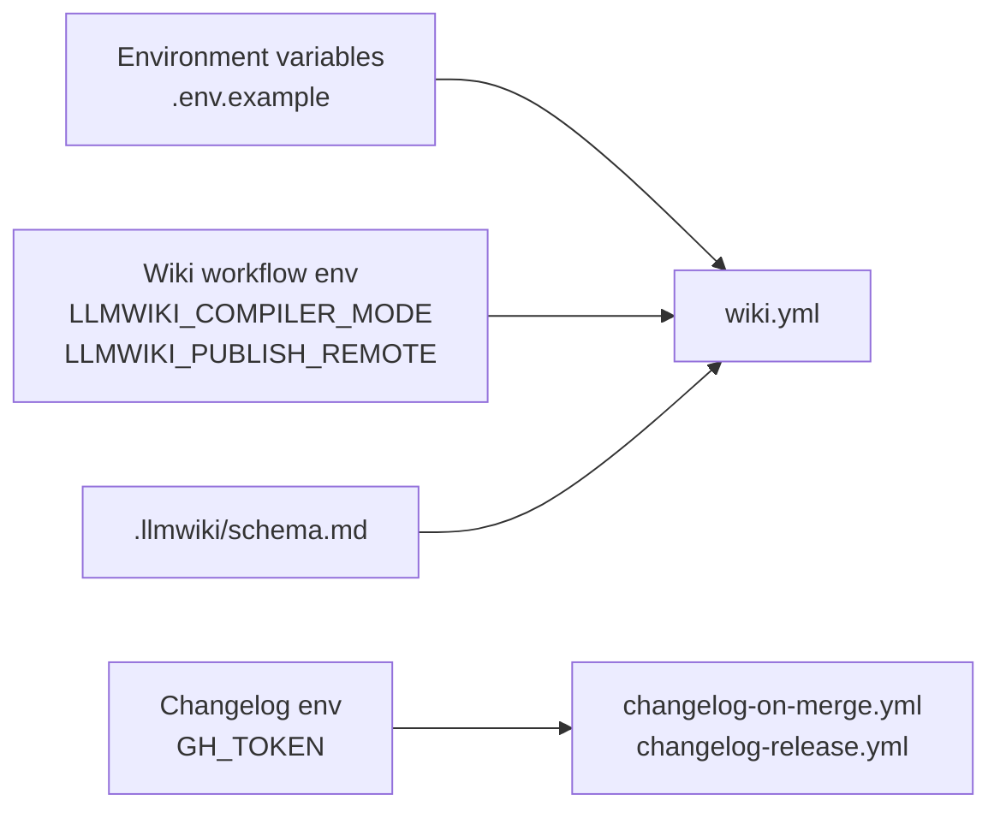
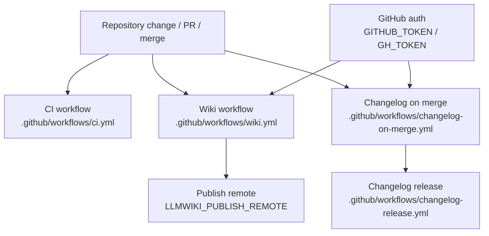

## Executive Architecture Summary

`repo-wiki` appears to be a repository-to-GitHub-Wiki documentation system whose intended product architecture is centered on compiling repository evidence into persistent wiki pages. This interpretation is supported by the repository-level environment variables for GitHub repository access, GitHub token usage, compiler mode, and LLM API key (`GITHUB_REPOSITORY`, `GITHUB_TOKEN`, `LLMWIKI_COMPILER_MODE`, `LLMWIKI_LLM_API_KEY`) in `.env.example`, by wiki publishing workflow configuration using `LLMWIKI_COMPILER_MODE` and `LLMWIKI_PUBLISH_REMOTE` in `.github/workflows/wiki.yml`, and by the local LLM wiki schema documentation in `.llmwiki/schema.md`.

The source cards available for this page do **not** include application source files, package metadata, command implementations, or import graphs. Therefore, the architecture that can be stated with high confidence is the repository’s operational and governance architecture rather than its internal runtime implementation. The visible architecture consists of these major evidence-backed areas:

| Area | Role | Evidence |
|---|---|---|
| Wiki compilation and publishing surface | Uses environment configuration for compiler mode and publish remote; likely runs in GitHub Actions. | `.env.example`, `.github/workflows/wiki.yml`, `.llmwiki/schema.md` |
| CI and automation | Provides continuous integration and changelog/release automation workflows. | `.github/workflows/ci.yml`, `.github/workflows/changelog-on-merge.yml`, `.github/workflows/changelog-release.yml` |
| Repository governance | Provides issue templates, PR template, Copilot review instructions, and agent guidance. | `.github/ISSUE_TEMPLATE/*.yml`, `.github/pull_request_template.md`, `.github/copilot-review-instructions.md`, `AGENTS.md`, `.github/agents/*.agent.md`, `.pi/AGENTS.md` |
| Documentation and knowledge model | Defines a `.llmwiki` schema and agent/skill documents for maintaining and navigating repo knowledge. | `.llmwiki/schema.md`, `.github/skills/repo-wiki-navigation/SKILL.md`, `.github/skills/keep-a-changelog/SKILL.md` |

Key design decisions visible from source evidence:

- The project treats wiki generation as a configured compiler process, because `.env.example` exposes `LLMWIKI_COMPILER_MODE` and `LLMWIKI_LLM_API_KEY`, and `.github/workflows/wiki.yml` also configures `LLMWIKI_COMPILER_MODE` plus `LLMWIKI_PUBLISH_REMOTE`.
- GitHub is a first-class operational boundary: `.env.example` includes `GITHUB_REPOSITORY` and `GITHUB_TOKEN`, and workflow files live under `.github/workflows/`.
- The repository uses structured contribution and review surfaces: issue templates for epics/tasks, PR template, Copilot review instructions, and multiple agent instruction files are present under `.github/` and `.pi/`.
- The repository maintains an LLM/wiki-oriented schema under `.llmwiki/schema.md`, indicating an explicit data-model surface for generated wiki content or compiler metadata.

## System and Repository Context

At the repository boundary, the source evidence supports the following external surfaces:

| Boundary / Surface | Description | Evidence |
|---|---|---|
| GitHub repository | Target or source repository identity is configured with `GITHUB_REPOSITORY`. | `.env.example` |
| GitHub authentication | GitHub token configuration exists through `GITHUB_TOKEN` locally and `GH_TOKEN` in changelog automation. | `.env.example`, `.github/workflows/changelog-on-merge.yml` |
| LLM provider/API | LLM API key configuration exists through `LLMWIKI_LLM_API_KEY`. The exact provider and API contract are not visible in source cards. | `.env.example` |
| GitHub Actions | CI, wiki publishing, changelog-on-merge, and release workflows are present. | `.github/workflows/ci.yml`, `.github/workflows/wiki.yml`, `.github/workflows/changelog-on-merge.yml`, `.github/workflows/changelog-release.yml` |
| GitHub Wiki publishing remote | Wiki publishing workflow references `LLMWIKI_PUBLISH_REMOTE`. | `.github/workflows/wiki.yml` |
| Repository governance interfaces | Issue templates, pull request template, Copilot instructions, and agent guidance influence contributor and automation behavior. | `.github/ISSUE_TEMPLATE/config.yml`, `.github/ISSUE_TEMPLATE/epic.yml`, `.github/ISSUE_TEMPLATE/task.yml`, `.github/pull_request_template.md`, `.github/copilot-review-instructions.md`, `.github/agents/*.agent.md`, `AGENTS.md`, `.pi/AGENTS.md` |

The following context diagram is limited to repository boundaries and external surfaces directly supported by configuration and workflow evidence. It does not claim the internal implementation classes/functions because those source files were not included in the evidence set.

Evidence for diagram nodes: `.env.example`, `.github/workflows/wiki.yml`, `.github/workflows/ci.yml`, `.github/workflows/changelog-on-merge.yml`, `.github/workflows/changelog-release.yml`, `.github/ISSUE_TEMPLATE/config.yml`, `.github/ISSUE_TEMPLATE/epic.yml`, `.github/ISSUE_TEMPLATE/task.yml`, `.github/pull_request_template.md`, `.github/copilot-review-instructions.md`, `.github/agents/*.agent.md`, `AGENTS.md`, `.pi/AGENTS.md`.

Repository structure visible from source cards:

| Path / Group | Architectural meaning | Evidence |
|---|---|---|
| `.env.example` | Local/runtime configuration template for GitHub and LLM wiki compiler settings. | `.env.example` |
| `.github/workflows/` | CI, wiki publishing, changelog, and release automation. | `.github/workflows/ci.yml`, `.github/workflows/wiki.yml`, `.github/workflows/changelog-on-merge.yml`, `.github/workflows/changelog-release.yml` |
| `.github/ISSUE_TEMPLATE/` | Structured issue intake for epics and tasks. | `.github/ISSUE_TEMPLATE/config.yml`, `.github/ISSUE_TEMPLATE/epic.yml`, `.github/ISSUE_TEMPLATE/task.yml` |
| `.github/agents/` | Role-specific automation or human-agent instructions. | `.github/agents/coordinator.agent.md`, `.github/agents/developer.agent.md`, `.github/agents/docs.agent.md`, `.github/agents/fixer.agent.md`, `.github/agents/quality.agent.md`, `.github/agents/review.agent.md` |
| `.github/skills/` | Reusable skills for changelog and repo-wiki navigation workflows. | `.github/skills/keep-a-changelog/SKILL.md`, `.github/skills/repo-wiki-navigation/SKILL.md` |
| `.llmwiki/` | LLM wiki schema surface. | `.llmwiki/schema.md` |
| `.pi/` | Additional agent/settings configuration. | `.pi/AGENTS.md`, `.pi/settings.json` |
| Root governance docs | Repository-level agent instructions. | `AGENTS.md` |

## Major Modules and Responsibilities

### Wiki Compiler / Wiki Publishing Configuration

The wiki compiler/publishing surface is evidenced by configuration and workflow files rather than application code. `.env.example` declares `LLMWIKI_COMPILER_MODE` and `LLMWIKI_LLM_API_KEY`, indicating a configurable compiler mode and an LLM API credential surface. `.github/workflows/wiki.yml` declares `LLMWIKI_COMPILER_MODE` and `LLMWIKI_PUBLISH_REMOTE`, indicating that wiki generation or publishing can run in CI and can target a publish remote.

Responsibilities supported by evidence:

- Configure compiler mode for local and CI usage (`.env.example`, `.github/workflows/wiki.yml`).
- Configure LLM access for compilation or generation (`.env.example`).
- Configure publication target through `LLMWIKI_PUBLISH_REMOTE` (`.github/workflows/wiki.yml`).
- Use `.llmwiki/schema.md` as the documented schema/data-model surface for LLM wiki artifacts.

Claim status: **partially evidenced**. The configuration files establish the surface, but implementation details such as command names, compiler stages, page rendering, or publish mechanics are not visible in the source cards.

### CI and Automation Workflows

The repository includes multiple GitHub Actions workflows:

| Workflow | Responsibility inferred from filename and source-card metadata | Evidence |
|---|---|---|
| CI | Continuous integration/background validation. | `.github/workflows/ci.yml` |
| Wiki | Wiki compilation/publishing automation using `LLMWIKI_COMPILER_MODE` and `LLMWIKI_PUBLISH_REMOTE`. | `.github/workflows/wiki.yml` |
| Changelog on merge | Changelog automation using `GH_TOKEN`. | `.github/workflows/changelog-on-merge.yml` |
| Changelog release | Release-oriented changelog automation. | `.github/workflows/changelog-release.yml` |

Runtime hints from source cards mark these workflows as background work surfaces, and `changelog-on-merge.yml` and `wiki.yml` expose environment-variable configuration.

Claim status: **evidenced at workflow-file level**. Exact triggers, jobs, commands, and permissions are not included in the cards, so they are not described here.

### Repository Governance and Contribution Surfaces

The repository contains structured governance assets:

- Issue template configuration and issue forms for epics and tasks: `.github/ISSUE_TEMPLATE/config.yml`, `.github/ISSUE_TEMPLATE/epic.yml`, `.github/ISSUE_TEMPLATE/task.yml`.
- Pull request template: `.github/pull_request_template.md`.
- Copilot review instructions: `.github/copilot-review-instructions.md`.
- Repository-level agent guidance: `AGENTS.md`.
- Additional `.pi` agent guidance and settings: `.pi/AGENTS.md`, `.pi/settings.json`.

These files form a non-runtime but architecturally important operational layer: they define how humans and automation should interact with the repository.

Claim status: **evidenced by file presence and source-card category**. Detailed policy content is not available in the source-card excerpts.

### Agent and Skill Instruction Modules

The repository includes role-specific agent documents:

| Agent / Skill file | Likely responsibility | Evidence |
|---|---|---|
| `.github/agents/coordinator.agent.md` | Coordination/background-work guidance. | `.github/agents/coordinator.agent.md` |
| `.github/agents/developer.agent.md` | Development guidance. | `.github/agents/developer.agent.md` |
| `.github/agents/docs.agent.md` | Documentation guidance. | `.github/agents/docs.agent.md` |
| `.github/agents/fixer.agent.md` | Fix/remediation guidance. | `.github/agents/fixer.agent.md` |
| `.github/agents/quality.agent.md` | Quality/checking guidance. | `.github/agents/quality.agent.md` |
| `.github/agents/review.agent.md` | Review guidance. | `.github/agents/review.agent.md` |
| `.github/skills/keep-a-changelog/SKILL.md` | Changelog maintenance skill. | `.github/skills/keep-a-changelog/SKILL.md` |
| `.github/skills/repo-wiki-navigation/SKILL.md` | Repo-wiki navigation skill. | `.github/skills/repo-wiki-navigation/SKILL.md` |

Claim status: **partially evidenced**. Role names and existence are source-grounded; detailed behavior depends on markdown contents not included in the excerpts.

### LLM Wiki Schema / Data Model

`.llmwiki/schema.md` is categorized as both `data-model` and `docs` in the source cards. It is the strongest direct evidence for a documented schema/data model associated with the wiki system.

Responsibilities supported by evidence:

- Define or document LLM wiki artifact structure.
- Provide a schema reference for wiki compiler/output behavior.

Claim status: **partially evidenced** because the schema file’s existence and category are known, but its detailed fields and validation rules are not included in the source-card excerpt.

### Component Relationship Diagram

The diagram below groups modules by repository structure. Relationships are inferred from configuration names and file placement, not from import graphs or runtime source code. This limitation is documented again in [Caveats and Open Questions](#caveats-and-open-questions).

Evidence: `.env.example`, `.llmwiki/schema.md`, `.github/workflows/wiki.yml`, `.github/workflows/ci.yml`, `.github/workflows/changelog-on-merge.yml`, `.github/workflows/changelog-release.yml`, `.github/ISSUE_TEMPLATE/*.yml`, `.github/pull_request_template.md`, `.github/copilot-review-instructions.md`, `.github/agents/*.agent.md`, `.github/skills/*/SKILL.md`, `AGENTS.md`, `.pi/AGENTS.md`, `.pi/settings.json`.

## Runtime, Data, and Control-Flow Relationships

Direct runtime call graphs, imports, class boundaries, and command implementations are **not available** in the supplied source cards. The following relationships are therefore limited to configuration-level and workflow-level relationships.

### Configuration Flow

| Input | Consumed by / relevant to | Evidence |
|---|---|---|
| `GITHUB_REPOSITORY` | Repository identity for local or runtime operations involving GitHub. | `.env.example` |
| `GITHUB_TOKEN` | Local/runtime GitHub authentication. | `.env.example` |
| `GH_TOKEN` | Changelog-on-merge GitHub Actions authentication. | `.github/workflows/changelog-on-merge.yml` |
| `LLMWIKI_COMPILER_MODE` | Local and CI wiki compiler mode. | `.env.example`, `.github/workflows/wiki.yml` |
| `LLMWIKI_LLM_API_KEY` | LLM-backed compiler/provider access. | `.env.example` |
| `LLMWIKI_PUBLISH_REMOTE` | Wiki publishing target in CI. | `.github/workflows/wiki.yml` |

### Wiki Compilation / Publishing Control Path

The following control path is supported only at the workflow/configuration level:

1. Repository and authentication settings are provided through `.env.example` and workflow environment configuration (`.env.example`, `.github/workflows/wiki.yml`).
2. A wiki-related GitHub Actions workflow exists (`.github/workflows/wiki.yml`).
3. The wiki workflow uses wiki-specific environment variables for compiler mode and publishing remote (`.github/workflows/wiki.yml`).
4. A schema/data-model document exists for LLM wiki artifacts (`.llmwiki/schema.md`).

No source card establishes the concrete command sequence, generated file layout, or exact publishing mechanism.

### Changelog Automation Control Path

The repository includes changelog-related workflows. `.github/workflows/changelog-on-merge.yml` references `GH_TOKEN`, indicating that at least one changelog automation path authenticates to GitHub. `.github/workflows/changelog-release.yml` provides a release-oriented changelog workflow surface.

No source card establishes exact changelog file paths, release artifact format, or trigger conditions.

### Runtime Dependency Diagram

Because there is no import graph or application source evidence in the supplied source cards, a detailed runtime dependency diagram would be speculative. The only source-grounded dependency diagram appropriate here is a configuration/control-surface view:

Evidence: `.env.example`, `.github/workflows/wiki.yml`, `.github/workflows/changelog-on-merge.yml`, `.github/workflows/changelog-release.yml`, `.llmwiki/schema.md`.

## Build, Test, Deployment, and Operational Surfaces

### CI and Build/Test Surface

The repository has a CI workflow at `.github/workflows/ci.yml`, marked by the source cards as CI and background work. The exact build/test commands, package manager, matrix, or validation steps are not visible in the card excerpt, so this page does not claim them.

### Wiki Deployment / Publishing Surface

The wiki workflow at `.github/workflows/wiki.yml` is the main deployment/publishing evidence for generated wiki content. It exposes:

- `LLMWIKI_COMPILER_MODE`
- `LLMWIKI_PUBLISH_REMOTE`

This supports the claim that wiki publication is configurable in CI. It does not prove the exact remote URL, publishing branch, GitHub Wiki repository naming convention, or credentials strategy.

### Changelog and Release Automation

The repository has two changelog workflows:

- `.github/workflows/changelog-on-merge.yml`, with `GH_TOKEN`.
- `.github/workflows/changelog-release.yml`.

This supports a release/change-management automation surface, but does not establish exact semantic versioning behavior or changelog format. The skill file `.github/skills/keep-a-changelog/SKILL.md` suggests a changelog maintenance convention or instruction module, but markdown skills are secondary evidence.

### Operational Entry Points

Evidence-backed operational entry points include:

| Entry point | Operational purpose | Evidence |
|---|---|---|
| GitHub Actions CI | Continuous validation. | `.github/workflows/ci.yml` |
| GitHub Actions wiki workflow | Wiki compile/publish automation. | `.github/workflows/wiki.yml` |
| GitHub Actions changelog workflows | Changelog and release automation. | `.github/workflows/changelog-on-merge.yml`, `.github/workflows/changelog-release.yml` |
| Environment variables | Runtime/local configuration for GitHub and LLM wiki behavior. | `.env.example` |
| Issue/PR templates | Human contribution workflow. | `.github/ISSUE_TEMPLATE/*.yml`, `.github/pull_request_template.md` |
| Agent/Copilot instructions | Automation and review guidance. | `.github/agents/*.agent.md`, `.github/copilot-review-instructions.md`, `AGENTS.md`, `.pi/AGENTS.md` |

### Build/Test/Deploy Flow Diagram

This diagram is based on the existence of workflow files and their source-card metadata. It does not claim exact workflow triggers or job commands.

Evidence: `.github/workflows/ci.yml`, `.github/workflows/wiki.yml`, `.github/workflows/changelog-on-merge.yml`, `.github/workflows/changelog-release.yml`, `.env.example`.

## Cross-Cutting Concerns

### Configuration

Configuration is environment-variable driven for the visible runtime surfaces:

| Variable | Concern | Evidence |
|---|---|---|
| `GITHUB_REPOSITORY` | Repository identity. | `.env.example` |
| `GITHUB_TOKEN` | Local/runtime GitHub authentication. | `.env.example` |
| `GH_TOKEN` | GitHub Actions changelog authentication. | `.github/workflows/changelog-on-merge.yml` |
| `LLMWIKI_COMPILER_MODE` | Compiler behavior/mode selection. | `.env.example`, `.github/workflows/wiki.yml` |
| `LLMWIKI_LLM_API_KEY` | LLM API credential. | `.env.example` |
| `LLMWIKI_PUBLISH_REMOTE` | Wiki publication target. | `.github/workflows/wiki.yml` |

No secret values are present in this page. Only variable names are documented.

### Security and Secrets

The repository exposes secret-bearing configuration names but not values. Security-relevant surfaces include:

- `GITHUB_TOKEN` and `GH_TOKEN` for GitHub authentication (`.env.example`, `.github/workflows/changelog-on-merge.yml`).
- `LLMWIKI_LLM_API_KEY` for LLM API access (`.env.example`).
- `LLMWIKI_PUBLISH_REMOTE`, which may identify a publication target (`.github/workflows/wiki.yml`).

Open security details not evidenced in source cards include token scopes, workflow permissions, secret masking, least-privilege configuration, and whether publishing is protected by branch/environment rules.

### APIs and External Services

The source evidence supports GitHub and an LLM API as external services through configuration names. It does not support a specific LLM provider, REST endpoint, SDK, or protocol. Documentation cards mention OpenAI-compatible chat completions in a plan, but that claim is secondary and only partially validated; no source-card implementation evidence is available here.

Evidence: `.env.example`; documentation card `docs/plans/llm-compiler.md` is secondary and partially validated.

### Data Model and Generated Artifacts

`.llmwiki/schema.md` is the primary evidence for a wiki data model. The supplied cards do not include the schema content, generated artifact examples, migrations, or validation tests. Any detailed field-level schema description should be added only after inspecting `.llmwiki/schema.md` and corresponding implementation/tests.

### Documentation Trust Model

This page prioritizes source/configuration evidence over markdown plans. The documentation cards describe broader product intent, including repo-wiki bootstrapping, LLM wiki concepts, CI publishing, GitHub Action plans, incremental mode, LLM compiler plans, and search index plans. However, several are only `partially_validated`, and `docs/plans/incremental-mode.md` is marked `stale`. Therefore:

- Current operational claims are based on source cards such as `.env.example`, workflow YAML files, and `.llmwiki/schema.md`.
- Product intent and future architecture from documentation cards are treated as secondary evidence.
- Stale or partially validated plans are not presented as implemented runtime behavior.

Evidence: `.env.example`, `.github/workflows/*.yml`, `.llmwiki/schema.md`; documentation cards `README.md`, `docs/PLAN.md`, `docs/WHY.md`, `docs/plans/*.md`.

### Repository Governance

The repository has extensive guidance for agents, reviewers, issue authors, and PR authors. These files are architecture-relevant because they shape how changes are proposed, reviewed, and maintained, even if they are not runtime code.

Evidence: `.github/ISSUE_TEMPLATE/config.yml`, `.github/ISSUE_TEMPLATE/epic.yml`, `.github/ISSUE_TEMPLATE/task.yml`, `.github/pull_request_template.md`, `.github/copilot-review-instructions.md`, `.github/agents/coordinator.agent.md`, `.github/agents/developer.agent.md`, `.github/agents/docs.agent.md`, `.github/agents/fixer.agent.md`, `.github/agents/quality.agent.md`, `.github/agents/review.agent.md`, `.github/skills/keep-a-changelog/SKILL.md`, `.github/skills/repo-wiki-navigation/SKILL.md`, `AGENTS.md`, `.pi/AGENTS.md`, `.pi/settings.json`.

## Caveats and Open Questions

### Caveats

- **No application source files were included in the source-card set.** This page cannot verify internal implementation modules, imports, CLI entry points, package scripts, classes, or runtime functions. Evidence: source-card list contains configuration, workflow, schema, and documentation/guidance files, but no implementation source paths.
- **Workflow internals are not visible in the excerpts.** The existence of `.github/workflows/*.yml` supports automation surfaces, but exact triggers, jobs, commands, permissions, and artifacts are not described. Evidence: `.github/workflows/ci.yml`, `.github/workflows/wiki.yml`, `.github/workflows/changelog-on-merge.yml`, `.github/workflows/changelog-release.yml`.
- **Diagrams are configuration-level, not code-level.** The Mermaid diagrams show repository boundaries and configuration/control surfaces supported by file locations and environment-variable names. They do not represent verified function calls or imports. Evidence: `.env.example`, `.github/workflows/*.yml`, `.llmwiki/schema.md`.
- **Markdown plans are secondary and sometimes stale.** Documentation cards include partially validated plans, and `docs/plans/incremental-mode.md` is explicitly marked `stale`; therefore, planned features are not treated as current behavior.
- **The exact LLM provider is not established by source cards.** `.env.example` includes `LLMWIKI_LLM_API_KEY`, but no source card proves provider name, endpoint, SDK, or model. Evidence: `.env.example`.
- **The `.llmwiki` schema content is not summarized at field level.** The schema file is present and categorized as a data model, but its excerpt does not provide field definitions. Evidence: `.llmwiki/schema.md`.

### Open Questions

1. What are the actual CLI or package entry points for `repo-wiki`, and where are they implemented?
2. What commands do `.github/workflows/ci.yml` and `.github/workflows/wiki.yml` run?
3. Does the wiki workflow publish directly to a GitHub Wiki repository, upload artifacts, open PRs, or support multiple modes?
4. What are the exact fields and invariants defined in `.llmwiki/schema.md`?
5. What token scopes are required for `GITHUB_TOKEN`, `GH_TOKEN`, and wiki publishing?
6. Which LLM providers and request/response formats are currently implemented?
7. Are search index, incremental mode, GitHub Action packaging, and provider-agnostic LLM compiler features implemented, planned, or partially implemented? Documentation cards mention these topics, but current source evidence is insufficient.
8. Are there tests validating wiki compilation, schema conformance, publishing behavior, changelog automation, or CLI behavior?

<!-- HUMAN_NOTES_START -->
<!-- HUMAN_NOTES_END -->
