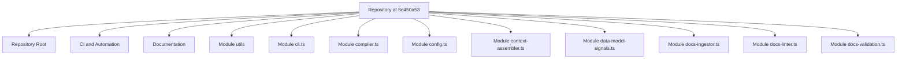

# Architecture

This page is a first-pass architecture summary based on repository structure. The production compiler should replace this with an LLM-reviewed synthesis that uses source cards and targeted code excerpts.

## Structural map

## Module groups

### Repository Root

- Files: 38
- Dominant categories: source, docs, package, test
- Dominant languages: Text, Markdown, JSON, TypeScript, JavaScript
- Important reasons: api-surface, configuration, data-model, docs, orm-model, package, package-manifest, readme, source, test

### CI and Automation

- Files: 17
- Dominant categories: docs, source, ci
- Dominant languages: Markdown, YAML
- Important reasons: ci, configuration, docs, source

### Documentation

- Files: 9
- Dominant categories: docs
- Dominant languages: Markdown
- Important reasons: docs

### Module utils

- Files: 4
- Dominant categories: source
- Dominant languages: TypeScript
- Important reasons: source

### Module cli.ts

- Files: 1
- Dominant categories: source
- Dominant languages: TypeScript
- Important reasons: source

### Module compiler.ts

- Files: 1
- Dominant categories: source
- Dominant languages: TypeScript
- Important reasons: source

### Module config.ts

- Files: 1
- Dominant categories: source
- Dominant languages: TypeScript
- Important reasons: source

### Module context-assembler.ts

- Files: 1
- Dominant categories: source
- Dominant languages: TypeScript
- Important reasons: source

### Module data-model-signals.ts

- Files: 1
- Dominant categories: source
- Dominant languages: TypeScript
- Important reasons: source

### Module docs-ingestor.ts

- Files: 1
- Dominant categories: source
- Dominant languages: TypeScript
- Important reasons: source

### Module docs-linter.ts

- Files: 1
- Dominant categories: source
- Dominant languages: TypeScript
- Important reasons: source

### Module docs-validation.ts

- Files: 1
- Dominant categories: source
- Dominant languages: TypeScript
- Important reasons: source

### Module extractors.ts

- Files: 1
- Dominant categories: source
- Dominant languages: TypeScript
- Important reasons: source

### Module frontmatter.ts

- Files: 1
- Dominant categories: source
- Dominant languages: TypeScript
- Important reasons: source

### Module index.ts

- Files: 1
- Dominant categories: source
- Dominant languages: TypeScript
- Important reasons: source

### Module init.ts

- Files: 1
- Dominant categories: source
- Dominant languages: TypeScript
- Important reasons: source

### Module language.ts

- Files: 1
- Dominant categories: source
- Dominant languages: TypeScript
- Important reasons: source

### Module linter.ts

- Files: 1
- Dominant categories: source
- Dominant languages: TypeScript
- Important reasons: source

### Module llm-provider.ts

- Files: 1
- Dominant categories: source
- Dominant languages: TypeScript
- Important reasons: configuration, source

### Module page-ownership.ts

- Files: 1
- Dominant categories: source
- Dominant languages: TypeScript
- Important reasons: source

### Module planner.ts

- Files: 1
- Dominant categories: source
- Dominant languages: TypeScript
- Important reasons: source

### Module prompts.ts

- Files: 1
- Dominant categories: source
- Dominant languages: TypeScript
- Important reasons: source

### Module publisher.ts

- Files: 1
- Dominant categories: source
- Dominant languages: TypeScript
- Important reasons: configuration, source

### Module repository-analysis.ts

- Files: 1
- Dominant categories: source
- Dominant languages: TypeScript
- Important reasons: source

### Module scanner.ts

- Files: 1
- Dominant categories: source
- Dominant languages: TypeScript
- Important reasons: source

### Module secret-patterns.ts

- Files: 1
- Dominant categories: source
- Dominant languages: TypeScript
- Important reasons: source

### Module wiki-patch.ts

- Files: 1
- Dominant categories: source
- Dominant languages: TypeScript
- Important reasons: source

