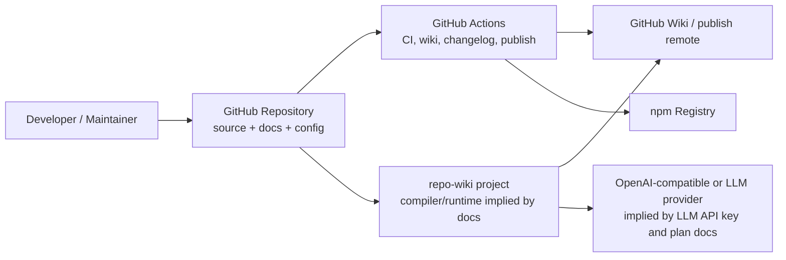
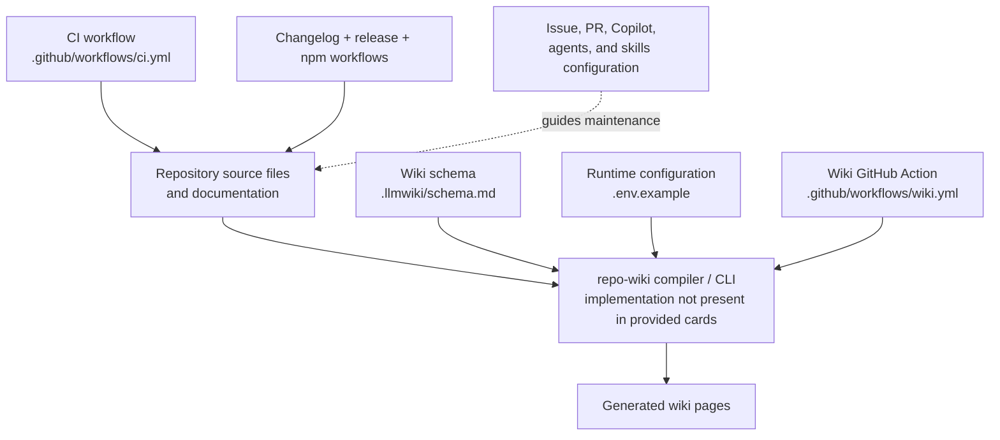
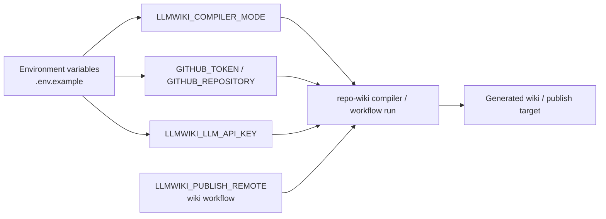
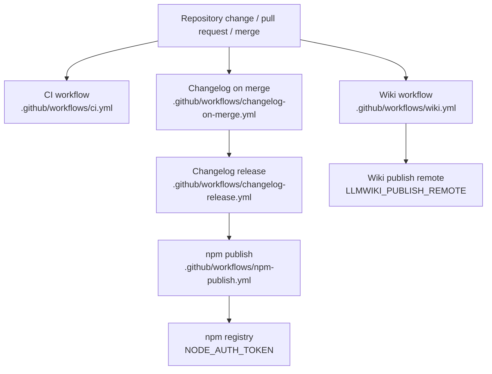

# Architecture

## Executive Architecture Summary

`repo-wiki` is documented as a tool for compiling a Git repository into a maintained GitHub Wiki-style knowledge base, with an explicit product vision around an “LLM Wiki” pattern: immutable raw sources remain the source of truth, while generated wiki pages become a persistent compounding artifact guided by schema and compilation rules. This purpose is supported by the repository’s wiki schema documentation and partially validated product documentation. Evidence: `.llmwiki/schema.md`; Documentation cards: `docs/PLAN.md`, `docs/WHY.md`, `README.md`.

At the architecture level, the repository evidence currently available shows these major subsystems:

| Subsystem | Responsibility | Evidence |
|---|---|---|
| Wiki compiler/runtime configuration | Runtime configuration for repository selection, GitHub access, compiler mode, and LLM provider access. | `.env.example` |
| Wiki schema / generated knowledge-base model | Defines or documents the structure expected for compiled wiki output. | `.llmwiki/schema.md` |
| GitHub Actions operational automation | CI, wiki generation/publishing, changelog automation, release/changelog flow, and npm publishing. | `.github/workflows/ci.yml`, `.github/workflows/wiki.yml`, `.github/workflows/changelog-on-merge.yml`, `.github/workflows/changelog-release.yml`, `.github/workflows/npm-publish.yml` |
| GitHub collaboration surfaces | Issue templates, pull request template, Copilot review instructions, and agent/skill instructions that shape contribution and review workflows. | `.github/ISSUE_TEMPLATE/config.yml`, `.github/ISSUE_TEMPLATE/epic.yml`, `.github/ISSUE_TEMPLATE/task.yml`, `.github/pull_request_template.md`, `.github/copilot-review-instructions.md`, `.github/agents/*.agent.md`, `.github/skills/*/SKILL.md` |
| Project hygiene and local tooling hints | Ignore rules, dev-loop metadata, TypeScript build metadata, and local/agent instructions. | `.gitignore`, `.devloops`, `.tsbuildinfo`, `.pi/AGENTS.md` |

The strongest source evidence in the provided card set is repository configuration and CI metadata, not application source files. Therefore, this page describes the architecture conservatively: the externally visible shape of the system, operational surfaces, and intended modules are clearer than internal function/class-level control flow. Evidence: all listed source cards; Documentation cards: `README.md`, `docs/PLAN.md`, `docs/plans/ci-publishing.md`, `docs/plans/github-action.md`, `docs/plans/llm-compiler.md`.

## System and Repository Context

The repository appears to define a command-line/npm-distributed project named `repo-wiki`, with documentation examples for installation and help invocation. The README documentation card includes commands such as `npm install repo-wiki`, installing a tarball via `npm install "./$tarball"`, and `npx repo-wiki --help`; however, no `package.json` or CLI source card is included in the available evidence, so CLI entry-point details are not verified here. Evidence: Documentation card `README.md`; caveat based on absent source cards.

Runtime configuration is exposed through environment variables listed in `.env.example`:

| Environment variable | Architectural role inferred from name | Evidence |
|---|---|---|
| `GITHUB_REPOSITORY` | Selects or identifies the repository being compiled or published. | `.env.example` |
| `GITHUB_TOKEN` | GitHub authentication for local/runtime operations. | `.env.example` |
| `LLMWIKI_COMPILER_MODE` | Selects compiler mode. Also appears in the wiki workflow configuration evidence. | `.env.example`, `.github/workflows/wiki.yml` |
| `LLMWIKI_LLM_API_KEY` | LLM provider API credential for compilation. | `.env.example` |

CI/workflow configuration exposes additional operational credentials and configuration:

| Variable | Workflow surface | Evidence |
|---|---|---|
| `GH_TOKEN` | Changelog-on-merge automation. | `.github/workflows/changelog-on-merge.yml` |
| `NODE_AUTH_TOKEN` | npm publish automation. | `.github/workflows/npm-publish.yml` |
| `LLMWIKI_COMPILER_MODE` | Wiki generation/publishing workflow. | `.github/workflows/wiki.yml` |
| `LLMWIKI_PUBLISH_REMOTE` | Wiki publishing remote configuration. | `.github/workflows/wiki.yml` |

The following context diagram is supported at the boundary level by configuration and workflow files. It intentionally avoids internal implementation details that are not present in the provided source cards.

Diagram evidence and limitations:

- GitHub Actions workflow surfaces are directly evidenced by `.github/workflows/ci.yml`, `.github/workflows/wiki.yml`, `.github/workflows/changelog-on-merge.yml`, `.github/workflows/changelog-release.yml`, and `.github/workflows/npm-publish.yml`.
- GitHub Wiki/publish remote is evidenced by `LLMWIKI_PUBLISH_REMOTE` in `.github/workflows/wiki.yml`.
- npm publishing is evidenced by `.github/workflows/npm-publish.yml` and `NODE_AUTH_TOKEN`.
- LLM provider interaction is inferred from `LLMWIKI_LLM_API_KEY` in `.env.example` and the partially validated LLM compiler plan, which describes a provider-agnostic OpenAI-style chat-completions boundary. Evidence: `.env.example`; Documentation card `docs/plans/llm-compiler.md`.
- CLI/package entry-point behavior is only documented, not verified from source in the provided card set. Evidence: Documentation card `README.md`.

## Major Modules and Responsibilities

### Wiki Compiler and CLI Surface

The project is documented as a tool that can be installed and invoked with `npx repo-wiki --help`, and it has runtime configuration for selecting a target repository, GitHub token, compiler mode, and LLM API key. Evidence: Documentation card `README.md`; `.env.example`.

Responsibilities likely include:

- Reading repository sources and documentation as compilation input. Evidence: Documentation cards `docs/PLAN.md`, `docs/WHY.md`.
- Producing wiki pages according to a schema or knowledge-base structure. Evidence: `.llmwiki/schema.md`; Documentation card `docs/PLAN.md`.
- Supporting local and CI execution modes through environment variables. Evidence: `.env.example`, `.github/workflows/wiki.yml`.

Because no application source files were included in the source-card list, internal CLI modules, command parsing, package exports, and compiler classes are not verified on this page.

### Wiki Schema and Knowledge-Base Model

The `.llmwiki/schema.md` file is high-value architecture evidence because it documents the generated wiki/schema model used by the compiler. Evidence: `.llmwiki/schema.md`.

Architectural role:

- Acts as a contract between raw repository evidence and generated wiki pages.
- Supports the repository’s stated “LLM Wiki” design, where a schema tells the LLM/compiler how to organize durable knowledge. Evidence: `.llmwiki/schema.md`; Documentation card `docs/PLAN.md`.
- Provides a stable reference for generated pages in bootstrap or incremental wiki modes. Evidence: `.llmwiki/schema.md`; Documentation cards `docs/plans/incremental-mode.md`, `docs/plans/ci-publishing.md`.

### GitHub Wiki Publishing Workflow

The `.github/workflows/wiki.yml` workflow is an operational surface for wiki generation and publishing. It includes environment-variable hints for `LLMWIKI_COMPILER_MODE` and `LLMWIKI_PUBLISH_REMOTE`. Evidence: `.github/workflows/wiki.yml`.

Responsibilities:

- Run wiki-related automation in GitHub Actions.
- Configure the compiler mode for CI execution.
- Publish generated wiki content to a configured remote, when configured.

The detailed sequence of checkout, compilation, artifact upload, and remote push is not verified from the source-card excerpt alone. Architecture plan cards describe CI publishing and GitHub Action behavior, but those are partially validated documentation rather than authoritative implementation. Evidence: `.github/workflows/wiki.yml`; Documentation cards `docs/plans/ci-publishing.md`, `docs/plans/github-action.md`.

### CI and Quality Workflow

The `.github/workflows/ci.yml` workflow defines a CI automation surface. Evidence: `.github/workflows/ci.yml`.

Responsibilities:

- Run repository validation in CI.
- Provide background automation for pull requests and/or pushes, depending on workflow triggers that are not visible in the source-card excerpt.
- Serve as a quality gate before publishing or merging, subject to the actual workflow definition.

Because the source card does not include workflow steps, this page does not claim exact test, lint, build, or type-check commands.

### Release, Changelog, and npm Publishing Automation

The repository contains multiple release-adjacent workflows and a changelog skill:

| Component | Responsibility | Evidence |
|---|---|---|
| Changelog on merge workflow | Automates changelog-related work after merges or relevant events. Uses `GH_TOKEN`. | `.github/workflows/changelog-on-merge.yml` |
| Changelog release workflow | Automates release/changelog publication flow. | `.github/workflows/changelog-release.yml` |
| npm publish workflow | Publishes package artifacts to npm, using `NODE_AUTH_TOKEN`. | `.github/workflows/npm-publish.yml` |
| Keep-a-changelog skill | Provides guidance or reusable instructions for changelog maintenance. | `.github/skills/keep-a-changelog/SKILL.md` |

The presence of `npm-publish.yml` and the README install commands together suggest npm distribution is part of the intended architecture, but package metadata and actual publish scripts are not verified from available source cards. Evidence: `.github/workflows/npm-publish.yml`; Documentation card `README.md`.

### Collaboration, Planning, and Agent Instructions

The repository includes several GitHub-native collaboration and AI-assistance configuration files:

| Module/group | Files | Architectural role |
|---|---|---|
| Issue templates | `.github/ISSUE_TEMPLATE/config.yml`, `.github/ISSUE_TEMPLATE/epic.yml`, `.github/ISSUE_TEMPLATE/task.yml` | Standardize planning inputs and issue taxonomy. |
| Pull request template | `.github/pull_request_template.md` | Standardizes review and merge information. |
| Copilot review instructions | `.github/copilot-review-instructions.md` | Guides automated or assisted code review. |
| Agent instructions | `.github/agents/coordinator.agent.md`, `.github/agents/developer.agent.md`, `.github/agents/docs.agent.md`, `.github/agents/fixer.agent.md`, `.github/agents/quality.agent.md`, `.github/agents/review.agent.md` | Define role-specific AI/automation behavior for coordination, development, documentation, fixing, quality, and review. |
| Navigation skill | `.github/skills/repo-wiki-navigation/SKILL.md` | Provides repo-wiki navigation assistance or conventions. |
| Changelog skill | `.github/skills/keep-a-changelog/SKILL.md` | Provides changelog maintenance guidance. |
| Local/agent instructions | `.pi/AGENTS.md` | Additional agent guidance. |

These files are not runtime modules in the application sense, but they are part of the repository’s socio-technical architecture: they constrain how humans and AI agents plan, review, and maintain the system. Evidence: listed `.github` and `.pi` files.

### Component Relationship Diagram

The following diagram is based on verified repository structure and configuration surfaces, with intended compiler behavior informed by partially validated documentation cards. It is intentionally high-level.

Evidence:

- Schema: `.llmwiki/schema.md`.
- Runtime configuration: `.env.example`.
- Wiki workflow: `.github/workflows/wiki.yml`.
- CI workflow: `.github/workflows/ci.yml`.
- Release/publish workflows: `.github/workflows/changelog-on-merge.yml`, `.github/workflows/changelog-release.yml`, `.github/workflows/npm-publish.yml`.
- Collaboration configuration: `.github/ISSUE_TEMPLATE/*.yml`, `.github/pull_request_template.md`, `.github/copilot-review-instructions.md`, `.github/agents/*.agent.md`, `.github/skills/*/SKILL.md`.
- Compiler/CLI node is documented but not source-verified in the provided cards. Evidence: Documentation card `README.md`.

## Runtime, Data, and Control-Flow Relationships

The available source-card set does not include implementation imports, classes, functions, or command handlers. Therefore, precise runtime control flow cannot be verified. The following relationships are source-grounded at the configuration and operational-boundary level.

### Configuration Flow

At runtime or in CI, the compiler is configured through environment variables:

1. Repository and GitHub access are configured through `GITHUB_REPOSITORY` and `GITHUB_TOKEN`. Evidence: `.env.example`.
2. Compiler mode is configured through `LLMWIKI_COMPILER_MODE`, present in both local example configuration and the wiki workflow. Evidence: `.env.example`, `.github/workflows/wiki.yml`.
3. LLM access is configured through `LLMWIKI_LLM_API_KEY`. Evidence: `.env.example`.
4. Wiki publishing remote is configured through `LLMWIKI_PUBLISH_REMOTE` in the wiki workflow. Evidence: `.github/workflows/wiki.yml`.

This diagram is a configuration/control-surface diagram, not an implementation call graph. Evidence: `.env.example`, `.github/workflows/wiki.yml`.

### Data Flow: Source Evidence to Wiki Pages

The documented product model is that raw repository sources stay authoritative and generated wiki pages are compiled artifacts. Evidence: Documentation cards `docs/PLAN.md`, `docs/WHY.md`; `.llmwiki/schema.md`.

A conservative data-flow view:

| Step | Description | Evidence |
|---|---|---|
| Input collection | Repository sources, docs, CI/config, schemas, and other evidence files are used as inputs. | `.llmwiki/schema.md`; Documentation card `docs/PLAN.md` |
| Compilation | `repo-wiki` compiles evidence into wiki pages, potentially using an LLM boundary. | `.env.example`; Documentation cards `README.md`, `docs/plans/llm-compiler.md` |
| Output | Generated wiki pages are written locally and/or published through a wiki workflow. | `.github/workflows/wiki.yml`; Documentation cards `README.md`, `docs/plans/ci-publishing.md` |
| Maintenance | Generated wiki content is expected to be updated over time as repository state changes. | Documentation cards `docs/PLAN.md`, `docs/WHY.md` |

The LLM interaction is probable but not fully implementation-verified: `LLMWIKI_LLM_API_KEY` is present, and the LLM compiler plan describes a provider-agnostic OpenAI-style chat-completions boundary. Evidence: `.env.example`; Documentation card `docs/plans/llm-compiler.md`.

### Control Paths Not Verified

The following details are not claimed because the provided cards do not include implementation source or full workflow step contents:

- Exact CLI argument parsing and command graph.
- Exact source scanner behavior.
- Exact prompt construction or LLM API request/response schema.
- Exact wiki page rendering pipeline.
- Exact Git commands used for wiki publishing.
- Exact package build/test scripts.

Evidence limitation: source-card set includes configuration, workflows, docs, schema, and metadata, but no application source files such as TypeScript/JavaScript modules or `package.json`.

## Build, Test, Deployment, and Operational Surfaces

The repository includes several GitHub Actions workflows that define its operational architecture:

| Workflow | Operational surface | Environment/config hints | Evidence |
|---|---|---|---|
| CI | Build/test/quality automation surface. Exact commands not verified from excerpt. | Background-work hint. | `.github/workflows/ci.yml` |
| Wiki | Wiki generation and/or publishing automation. | `LLMWIKI_COMPILER_MODE`, `LLMWIKI_PUBLISH_REMOTE`. | `.github/workflows/wiki.yml` |
| Changelog on merge | Post-merge or merge-related changelog automation. | `GH_TOKEN`. | `.github/workflows/changelog-on-merge.yml` |
| Changelog release | Release/changelog automation. | Background-work hint. | `.github/workflows/changelog-release.yml` |
| npm publish | Package publishing automation. | `NODE_AUTH_TOKEN`. | `.github/workflows/npm-publish.yml` |

The README documentation card includes npm-oriented user commands (`npm install repo-wiki`, local tarball install, and `npx repo-wiki --help`), so npm package distribution is part of documented usage. Evidence: Documentation card `README.md`. The npm publish workflow provides configuration evidence that automated npm publishing exists. Evidence: `.github/workflows/npm-publish.yml`.

### Build/Test/Deploy Flow Diagram

This flow is supported by the existence and names of workflow files and environment variables, but exact triggers and steps are not asserted because the source-card excerpts do not include full workflow contents.

Diagram limitations:

- Workflow file names and environment hints support the operational surfaces. Evidence: `.github/workflows/*.yml`.
- The exact ordering among changelog release and npm publishing is inferred from names and common release practice, not verified from full workflow steps in the provided cards.
- Triggers such as `push`, `pull_request`, `workflow_dispatch`, or `release` are not claimed because they are not visible in the source-card excerpts.

### Local Operation

Local operation is documented through `.env.example` and README usage examples. Evidence: `.env.example`; Documentation card `README.md`.

A typical local runtime boundary likely involves:

- Supplying GitHub repository and token configuration.
- Supplying compiler mode.
- Supplying an LLM API key if LLM-backed compilation is used.
- Running the CLI via npm/npx.

Only the configuration variables and documented commands are verified; the actual command behavior is not verified from application source in the provided cards.

## Cross-Cutting Concerns

### Configuration Management

Configuration is environment-variable based for the surfaces visible in the source cards. Evidence: `.env.example`, `.github/workflows/wiki.yml`, `.github/workflows/changelog-on-merge.yml`, `.github/workflows/npm-publish.yml`.

Important configuration variables include:

- `GITHUB_REPOSITORY`
- `GITHUB_TOKEN`
- `LLMWIKI_COMPILER_MODE`
- `LLMWIKI_LLM_API_KEY`
- `LLMWIKI_PUBLISH_REMOTE`
- `GH_TOKEN`
- `NODE_AUTH_TOKEN`

No secret values are present in this page. Variable names are cited because they are part of configuration contracts. Evidence: `.env.example`, `.github/workflows/changelog-on-merge.yml`, `.github/workflows/npm-publish.yml`, `.github/workflows/wiki.yml`.

### Security and Secret Handling

The repository’s operational design requires credentials for GitHub, npm, and LLM access:

| Secret/config | Use | Evidence |
|---|---|---|
| `GITHUB_TOKEN` | GitHub API or repository access in local/runtime configuration. | `.env.example` |
| `GH_TOKEN` | GitHub automation in changelog workflow. | `.github/workflows/changelog-on-merge.yml` |
| `NODE_AUTH_TOKEN` | npm registry publishing. | `.github/workflows/npm-publish.yml` |
| `LLMWIKI_LLM_API_KEY` | LLM provider access. | `.env.example` |

Security implications:

- Generated documentation should not copy secret values into wiki output.
- Workflow permissions and secret scopes should be reviewed because publishing workflows can mutate external state: GitHub Wiki remotes and npm registry packages. Evidence: `.github/workflows/wiki.yml`, `.github/workflows/npm-publish.yml`.
- LLM-backed compilation should avoid sending secrets or private data unless explicitly intended and governed. Evidence: `.env.example`; Documentation card `docs/plans/llm-compiler.md`.

### External APIs and Services

The source cards indicate these external services:

| External service | Basis | Evidence |
|---|---|---|
| GitHub repository and GitHub Actions | `.github` workflows, issue templates, PR template, GitHub tokens. | `.github/workflows/*.yml`, `.github/ISSUE_TEMPLATE/*.yml`, `.github/pull_request_template.md`, `.env.example` |
| GitHub Wiki or wiki remote | Wiki workflow uses `LLMWIKI_PUBLISH_REMOTE`. | `.github/workflows/wiki.yml` |
| npm registry | npm publish workflow uses `NODE_AUTH_TOKEN`; README documents npm install usage. | `.github/workflows/npm-publish.yml`; Documentation card `README.md` |
| LLM provider | LLM API key configuration and LLM compiler plan. | `.env.example`; Documentation card `docs/plans/llm-compiler.md` |

The exact provider SDK, HTTP API, or request format is not verified from source cards.

### Data Model and Documentation Trust

`.llmwiki/schema.md` is the key data-model evidence for generated wiki content. Evidence: `.llmwiki/schema.md`.

Documentation cards are useful but secondary. Several are marked `partially_validated`, and `docs/plans/incremental-mode.md` is marked `stale`. Claims from these documents should be treated as intent or roadmap unless corroborated by source, tests, CI, configuration, schemas, or migrations. Evidence: Documentation cards `README.md`, `docs/PLAN.md`, `docs/WHY.md`, `docs/plans/ci-publishing.md`, `docs/plans/github-action.md`, `docs/plans/incremental-mode.md`, `docs/plans/llm-compiler.md`.

### AI Agent and Review Governance

The repository includes explicit agent and skill instructions, indicating that AI-assisted development/review/documentation workflows are part of the maintenance architecture. Evidence: `.github/agents/coordinator.agent.md`, `.github/agents/developer.agent.md`, `.github/agents/docs.agent.md`, `.github/agents/fixer.agent.md`, `.github/agents/quality.agent.md`, `.github/agents/review.agent.md`, `.github/copilot-review-instructions.md`, `.github/skills/keep-a-changelog/SKILL.md`, `.github/skills/repo-wiki-navigation/SKILL.md`, `.pi/AGENTS.md`.

These files should be treated as process architecture rather than application runtime architecture unless future source evidence shows they are read by tooling at runtime.

### Repository Hygiene

`.gitignore` defines ignored files and repository hygiene boundaries. Evidence: `.gitignore`.

`.tsbuildinfo` indicates TypeScript build metadata is present, but it is a generated/compiler artifact rather than a design document. Evidence: `.tsbuildinfo`.

`.devloops` suggests development-loop metadata or local process configuration, but the card excerpt does not expose operational details. Evidence: `.devloops`.

## Caveats and Open Questions

### Caveats

1. **No application source cards were provided.**  
   The available evidence set contains configuration, workflows, schema/docs, templates, and metadata, but no verified application modules, imports, classes, or functions. As a result, internal architecture is described only at subsystem and operational-boundary level. Evidence: listed source-card set.

2. **CLI behavior is documented but not implementation-verified here.**  
   README usage includes npm installation and `npx repo-wiki --help`, but no `package.json`, bin entry, or CLI source card is included. Evidence: Documentation card `README.md`.

3. **Workflow behavior is only partially visible.**  
   Workflow file names and environment-variable hints are available, but exact triggers, jobs, steps, permissions, and dependencies are not shown in source-card excerpts. Evidence: `.github/workflows/ci.yml`, `.github/workflows/wiki.yml`, `.github/workflows/changelog-on-merge.yml`, `.github/workflows/changelog-release.yml`, `.github/workflows/npm-publish.yml`.

4. **LLM provider interaction is likely but not fully verified.**  
   `LLMWIKI_LLM_API_KEY` and the LLM compiler plan indicate an LLM boundary, but no implementation code or provider client is included in the source cards. Evidence: `.env.example`; Documentation card `docs/plans/llm-compiler.md`.

5. **Some planning documentation is not current-authoritative.**  
   `docs/plans/incremental-mode.md` is marked stale, while several other docs are partially validated. Claims from these documents should not override code/configuration. Evidence: Documentation cards `docs/plans/incremental-mode.md`, `docs/plans/ci-publishing.md`, `docs/plans/github-action.md`, `docs/plans/llm-compiler.md`.

6. **Diagrams include inferred relationships.**  
   The diagrams in this page are constrained to repository boundaries and operational surfaces, but some arrows represent inferred data/configuration flow rather than verified function calls. Each diagram labels limitations where applicable. Evidence: `.env.example`, `.github/workflows/*.yml`, `.llmwiki/schema.md`, Documentation cards.

### Open Questions

| Question | Why it matters | Evidence gap |
|---|---|---|
| What are the concrete CLI commands, flags, and package exports? | Needed to document public API and entry points precisely. | No `package.json` or CLI source card included; README is partially validated. |
| What are the internal compiler stages? | Needed for accurate module and sequence diagrams. | No implementation source cards with imports/functions/classes. |
| How does the compiler scan source files and rank evidence? | Central to wiki generation correctness and trust model. | Only schema and plan docs are visible. |
| What LLM provider/client implementation is used? | Needed for API compatibility, security, retries, rate limits, and cost controls. | `LLMWIKI_LLM_API_KEY` exists, but no provider source card is included. |
| How does wiki publishing authenticate and push? | Needed for deployment/security architecture. | `LLMWIKI_PUBLISH_REMOTE` exists, but workflow steps are not visible in excerpt. |
| What test framework and quality gates are used? | Needed for build/test architecture. | `.github/workflows/ci.yml` exists, but exact commands are not visible. |
| How does incremental mode work, if implemented? | Needed for persistent wiki maintenance architecture. | Incremental-mode plan is marked stale; no implementation card provided. |
| Is npm publishing tied to changelog-release workflow or independent? | Needed for release architecture. | Both workflows exist, but dependency/order is not verified from excerpts. |

<!-- HUMAN_NOTES_START -->
<!-- HUMAN_NOTES_END -->
