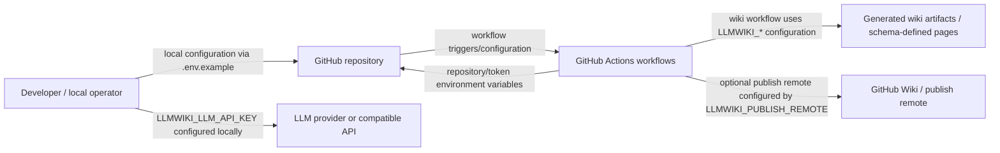
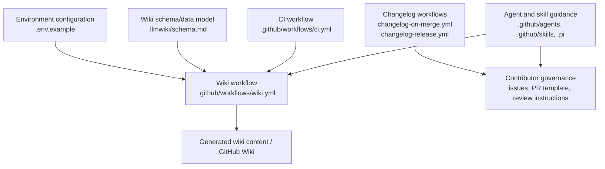
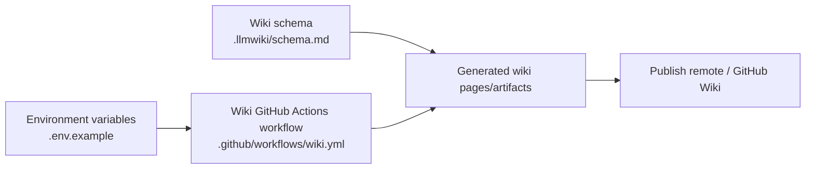
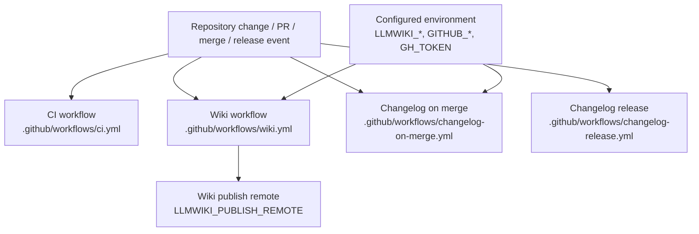

# Architecture

## Executive Architecture Summary

`repo-wiki` appears to be a repository-to-GitHub-Wiki knowledge-base compiler with automation around CI publication, changelog maintenance, and structured development workflows. The strongest available architecture evidence in the provided source cards is configuration and process-oriented rather than application source code: environment variables for GitHub and LLM operation are declared in `.env.example`; wiki generation/publishing is represented by `.github/workflows/wiki.yml`; CI is represented by `.github/workflows/ci.yml`; changelog automation is represented by `.github/workflows/changelog-on-merge.yml` and `.github/workflows/changelog-release.yml`; and wiki page/data conventions are documented in `.llmwiki/schema.md`.

At this commit, the repository architecture visible from the supplied cards is best described as four operational surfaces:

1. **Wiki compilation and publishing surface** — controlled by GitHub Actions workflow configuration and environment variables such as `LLMWIKI_COMPILER_MODE` and `LLMWIKI_PUBLISH_REMOTE` in `.github/workflows/wiki.yml`, plus local/runtime configuration variables in `.env.example`.
2. **GitHub integration surface** — repository and authentication variables are declared as `GITHUB_REPOSITORY` and `GITHUB_TOKEN` in `.env.example`; CI changelog automation also references `GH_TOKEN` in `.github/workflows/changelog-on-merge.yml`.
3. **Schema/documentation model surface** — `.llmwiki/schema.md` provides the documented model for generated wiki artifacts.
4. **Repository governance and agent/process surface** — issue templates, pull request templates, Copilot review instructions, agent instructions, and skills are maintained under `.github/**` and `.pi/**`.

No application source files, package manifests, or import graphs were included in the provided source cards. Therefore, this page intentionally avoids asserting concrete internal runtime classes, functions, package scripts, or module dependencies beyond what is evidenced by the listed configuration, workflow, and documentation files.

## System and Repository Context

The repository boundary visible in the supplied cards includes GitHub-hosted automation, configuration for local or CI execution, generated-wiki schema documentation, and process guidance for contributors and AI agents.

### Repository structure visible from source cards

| Area | Evidence | Architectural role |
|---|---|---|
| Environment configuration | `.env.example` | Declares runtime/configuration knobs for GitHub repository access, GitHub token access, compiler mode, and LLM API key. |
| CI workflow | `.github/workflows/ci.yml` | Defines automated validation surface for the repository. Exact jobs/steps are not available in the source-card excerpt. |
| Wiki workflow | `.github/workflows/wiki.yml` | Defines an automated wiki-related workflow with runtime hints for background work and environment variables `LLMWIKI_COMPILER_MODE` and `LLMWIKI_PUBLISH_REMOTE`. |
| Changelog workflows | `.github/workflows/changelog-on-merge.yml`, `.github/workflows/changelog-release.yml` | Define background automation for changelog update/release flows. `changelog-on-merge.yml` references `GH_TOKEN`. |
| Wiki schema documentation | `.llmwiki/schema.md` | Documents the data model/conventions for wiki artifacts. |
| Issue and PR process | `.github/ISSUE_TEMPLATE/config.yml`, `.github/ISSUE_TEMPLATE/epic.yml`, `.github/ISSUE_TEMPLATE/task.yml`, `.github/pull_request_template.md` | Defines contributor workflow surfaces for issue creation and pull requests. |
| AI/development agents | `.github/agents/*.agent.md`, `.pi/AGENTS.md`, `.pi/settings.json` | Defines role-oriented guidance and local/project automation settings for AI-assisted development. |
| Review and skills guidance | `.github/copilot-review-instructions.md`, `.github/skills/keep-a-changelog/SKILL.md`, `.github/skills/repo-wiki-navigation/SKILL.md` | Defines review expectations and reusable contributor/agent skills. |
| Ignore/build metadata | `.gitignore`, `.tsbuildinfo` | Indicates repository housekeeping and TypeScript build metadata presence. `.tsbuildinfo` alone does not establish the full build architecture. |

### External surfaces and boundaries

The following context diagram is supported by configuration and workflow source cards. It shows repository-level boundaries and external systems implied by environment variable names and GitHub workflow locations; it does **not** assert internal application call paths.

Evidence: `.env.example`, `.github/workflows/wiki.yml`, `.github/workflows/ci.yml`, `.github/workflows/changelog-on-merge.yml`, `.llmwiki/schema.md`.

## Major Modules and Responsibilities

Because the supplied source cards do not include the package manifest or runtime source files, these “modules” are repository-level architectural groupings derived from visible configuration and governance files rather than verified application code packages.

### Wiki compilation and publication module

**Responsibility:** Maintain and publish generated GitHub Wiki content.

**Evidence:**

- `.github/workflows/wiki.yml` is a GitHub Actions workflow with runtime hints for background work and environment variables `LLMWIKI_COMPILER_MODE` and `LLMWIKI_PUBLISH_REMOTE`.
- `.env.example` declares `LLMWIKI_COMPILER_MODE`, `LLMWIKI_LLM_API_KEY`, `GITHUB_REPOSITORY`, and `GITHUB_TOKEN`.
- `.llmwiki/schema.md` documents the wiki schema/data model.

**Known design decisions from evidence:**

- Wiki compilation has a configurable compiler mode (`LLMWIKI_COMPILER_MODE`) in both local/example environment configuration and CI workflow configuration.
- Publishing target/remotes are configurable in CI via `LLMWIKI_PUBLISH_REMOTE`.
- LLM access is configuration-driven via `LLMWIKI_LLM_API_KEY` in `.env.example`.

### Continuous integration module

**Responsibility:** Run repository validation in GitHub Actions.

**Evidence:**

- `.github/workflows/ci.yml` exists and is categorized as CI with background-work runtime hints.

**Known design decisions from evidence:**

- The project uses GitHub Actions for CI.
- Specific build/test commands are not visible in the provided source-card excerpt, so this page cannot verify exact package-manager, test-runner, or build-tool commands from source cards alone.

### Changelog automation module

**Responsibility:** Automate changelog maintenance on merge and release flows.

**Evidence:**

- `.github/workflows/changelog-on-merge.yml` is a CI/configuration workflow with background-work and environment-variable hints and references `GH_TOKEN`.
- `.github/workflows/changelog-release.yml` is a CI workflow with background-work hints.
- `.github/skills/keep-a-changelog/SKILL.md` documents changelog-related contributor/agent guidance.

**Known design decisions from evidence:**

- Changelog work is separated into at least two workflow surfaces: one for merge-time automation and one for release-time automation.
- GitHub authentication for merge-time changelog automation is represented by `GH_TOKEN`.

### Schema and generated-content model module

**Responsibility:** Define conventions for wiki-generated content and its structure.

**Evidence:**

- `.llmwiki/schema.md` is categorized as documentation with data-model relevance.
- `.github/skills/repo-wiki-navigation/SKILL.md` provides wiki-navigation guidance.

**Known design decisions from evidence:**

- The repository maintains an explicit schema document for LLM/wiki output.
- Navigation of generated wiki content has dedicated skill documentation.

### Contributor workflow and governance module

**Responsibility:** Structure human and AI-assisted development workflows.

**Evidence:**

- `.github/ISSUE_TEMPLATE/config.yml`, `.github/ISSUE_TEMPLATE/epic.yml`, and `.github/ISSUE_TEMPLATE/task.yml` define issue templates.
- `.github/pull_request_template.md` defines pull request expectations.
- `.github/copilot-review-instructions.md` defines Copilot/review guidance.
- `.github/agents/coordinator.agent.md`, `.github/agents/developer.agent.md`, `.github/agents/docs.agent.md`, `.github/agents/fixer.agent.md`, `.github/agents/quality.agent.md`, and `.github/agents/review.agent.md` define role-specific agent instructions.
- `.pi/AGENTS.md` and `.pi/settings.json` define additional project/agent settings.

**Known design decisions from evidence:**

- The project uses role-specific AI/development-agent documentation.
- Issue templates distinguish at least epic and task workflows.
- Review and PR expectations are documented in repository-maintained Markdown files.

### Repository housekeeping/build metadata module

**Responsibility:** Maintain ignored files and build metadata.

**Evidence:**

- `.gitignore` exists.
- `.tsbuildinfo` exists and has background-work runtime hints.

**Known design decisions from evidence:**

- TypeScript build metadata is present, suggesting TypeScript tooling has been used, but the complete TypeScript project architecture cannot be reconstructed from `.tsbuildinfo` alone.

### Component/module relationship diagram

This diagram is inferred from repository structure and workflow/configuration roles. It is not a verified runtime dependency graph because no source-code imports were provided.

Evidence: `.env.example`, `.github/workflows/wiki.yml`, `.github/workflows/ci.yml`, `.github/workflows/changelog-on-merge.yml`, `.github/workflows/changelog-release.yml`, `.llmwiki/schema.md`, `.github/ISSUE_TEMPLATE/config.yml`, `.github/ISSUE_TEMPLATE/epic.yml`, `.github/ISSUE_TEMPLATE/task.yml`, `.github/pull_request_template.md`, `.github/copilot-review-instructions.md`, `.github/agents/*.agent.md`, `.github/skills/*.md`, `.pi/AGENTS.md`, `.pi/settings.json`.

## Runtime, Data, and Control-Flow Relationships

The supplied source cards provide environment-variable and workflow evidence, but not implementation imports or function-level runtime traces. The following relationships are therefore repository-operational relationships rather than verified in-process call graphs.

### Configuration flow

| Source | Configuration item | Consumed/used by visible surface | Evidence |
|---|---|---|---|
| `.env.example` | `GITHUB_REPOSITORY` | Local or CI GitHub repository selection/access | `.env.example` |
| `.env.example` | `GITHUB_TOKEN` | GitHub API/authentication access | `.env.example` |
| `.env.example` | `LLMWIKI_COMPILER_MODE` | Wiki compiler behavior selection | `.env.example`, `.github/workflows/wiki.yml` |
| `.env.example` | `LLMWIKI_LLM_API_KEY` | LLM provider access | `.env.example` |
| `.github/workflows/wiki.yml` | `LLMWIKI_COMPILER_MODE` | Wiki workflow execution mode | `.github/workflows/wiki.yml` |
| `.github/workflows/wiki.yml` | `LLMWIKI_PUBLISH_REMOTE` | Wiki publish destination/remote | `.github/workflows/wiki.yml` |
| `.github/workflows/changelog-on-merge.yml` | `GH_TOKEN` | Changelog automation GitHub authentication | `.github/workflows/changelog-on-merge.yml` |

No actual values are copied here; only variable names from source cards are cited.

### Data/model flow

The repository has an explicit wiki schema document at `.llmwiki/schema.md`. Given the page-generation purpose described by the repository-level documentation cards and the workflow/configuration source cards, generated wiki pages should be treated as schema-governed artifacts. However, without source implementation files, this page cannot verify the exact parser, compiler, renderer, or publisher implementation behind that schema.

Evidence: `.env.example`, `.llmwiki/schema.md`, `.github/workflows/wiki.yml`.

### Agent/process control flow

The repository maintains role-specific agent files and skills. These files are documentation/process inputs rather than executable runtime modules in the provided evidence.

| Process area | Files | Architectural interpretation |
|---|---|---|
| Coordination | `.github/agents/coordinator.agent.md` | Guidance for coordination/background work. |
| Development | `.github/agents/developer.agent.md` | Guidance for implementation work. |
| Documentation | `.github/agents/docs.agent.md` | Guidance for documentation work. |
| Fixing/remediation | `.github/agents/fixer.agent.md` | Guidance for repair workflows. |
| Quality/review | `.github/agents/quality.agent.md`, `.github/agents/review.agent.md`, `.github/copilot-review-instructions.md` | Guidance for quality assurance and code review. |
| Skills | `.github/skills/keep-a-changelog/SKILL.md`, `.github/skills/repo-wiki-navigation/SKILL.md` | Reusable instructions for changelog and wiki navigation tasks. |

Evidence: `.github/agents/*.agent.md`, `.github/copilot-review-instructions.md`, `.github/skills/keep-a-changelog/SKILL.md`, `.github/skills/repo-wiki-navigation/SKILL.md`.

## Build, Test, Deployment, and Operational Surfaces

### CI and operational workflows

| Workflow | Architectural role | Runtime/config evidence |
|---|---|---|
| `.github/workflows/ci.yml` | General CI validation surface. | Categorized as CI with background-work runtime hints. |
| `.github/workflows/wiki.yml` | Wiki generation/publishing workflow. | References `LLMWIKI_COMPILER_MODE` and `LLMWIKI_PUBLISH_REMOTE`; categorized as CI/configuration with background-work and environment-variable hints. |
| `.github/workflows/changelog-on-merge.yml` | Merge-time changelog automation. | References `GH_TOKEN`; categorized as CI/configuration with background-work and environment-variable hints. |
| `.github/workflows/changelog-release.yml` | Release-time changelog automation. | Categorized as CI with background-work hints. |

### Build/test/deploy flow diagram

This diagram is workflow-level only. It is supported by the existence and categories of GitHub Actions workflow source cards, but exact job names, triggers, package-manager commands, and artifact names are not available from the provided excerpts.

Evidence: `.github/workflows/ci.yml`, `.github/workflows/wiki.yml`, `.github/workflows/changelog-on-merge.yml`, `.github/workflows/changelog-release.yml`, `.env.example`.

### Local operational entry points

The provided `.env.example` indicates local or configured execution expects at least the following variables:

- `GITHUB_REPOSITORY`
- `GITHUB_TOKEN`
- `LLMWIKI_COMPILER_MODE`
- `LLMWIKI_LLM_API_KEY`

Evidence: `.env.example`.

The README documentation card mentions package installation/bootstrap commands, but package manifests and executable entry points were not included as source cards. Therefore, this architecture page does not treat those commands as verified current behavior.

## Cross-Cutting Concerns

### Configuration

Configuration is environment-variable based for GitHub and LLM/wiki compilation concerns. The visible variables are:

| Variable | Concern | Evidence |
|---|---|---|
| `GITHUB_REPOSITORY` | Repository selection/context | `.env.example` |
| `GITHUB_TOKEN` | GitHub authentication | `.env.example` |
| `GH_TOKEN` | GitHub authentication for changelog workflow | `.github/workflows/changelog-on-merge.yml` |
| `LLMWIKI_COMPILER_MODE` | Compiler behavior/mode selection | `.env.example`, `.github/workflows/wiki.yml` |
| `LLMWIKI_LLM_API_KEY` | LLM provider authentication | `.env.example` |
| `LLMWIKI_PUBLISH_REMOTE` | Wiki publication target | `.github/workflows/wiki.yml` |

No secret values are present or reproduced here.

### Security and credential handling

The architecture relies on token-based access to GitHub and API-key-based access to an LLM provider, as evidenced by `GITHUB_TOKEN`, `GH_TOKEN`, and `LLMWIKI_LLM_API_KEY` references. These should be supplied through local environment files or GitHub Actions secrets rather than committed values. The source cards only show variable names, not values. Evidence: `.env.example`, `.github/workflows/changelog-on-merge.yml`, `.github/workflows/wiki.yml`.

### APIs and external dependencies

The visible external interfaces are:

| External interface | Evidence | Notes |
|---|---|---|
| GitHub repository/API | `.env.example`, `.github/workflows/*.yml` | Implied by GitHub workflow location and GitHub token/repository variables. |
| GitHub Wiki or publish remote | `.github/workflows/wiki.yml` | `LLMWIKI_PUBLISH_REMOTE` indicates configurable publishing. |
| LLM provider/API | `.env.example` | `LLMWIKI_LLM_API_KEY` indicates LLM-backed operation, but provider/client implementation is not visible in source cards. |

### Data model

The main visible data-model artifact is `.llmwiki/schema.md`, categorized as documentation with data-model relevance. This page treats it as the authoritative schema documentation among the supplied cards, while noting that no implementation validators or schema-enforcement code were provided in the source cards.

### Documentation trust

Markdown documentation cards supplied with this compilation are secondary evidence. Some are marked `partially_validated`, and one plan document is marked `stale`. Operational claims in this architecture page are therefore grounded in source-card configuration and CI evidence first, especially `.env.example`, `.github/workflows/*.yml`, and `.llmwiki/schema.md`.

### Development governance

The repository has extensive process documentation for issues, pull requests, reviews, agents, and skills. These files shape how the project is maintained but should not be confused with executable runtime architecture unless a workflow or tool explicitly consumes them. Evidence: `.github/ISSUE_TEMPLATE/*.yml`, `.github/pull_request_template.md`, `.github/copilot-review-instructions.md`, `.github/agents/*.agent.md`, `.github/skills/*.md`, `.pi/AGENTS.md`, `.pi/settings.json`.

## Caveats and Open Questions

1. **No runtime source files were included in the source cards.**  
   This page cannot verify actual package structure, exported APIs, CLI entry points, internal classes/functions, import relationships, or runtime call graphs. Evidence limitation: source-card set contains configuration, workflows, docs, `.tsbuildinfo`, and repository metadata, but no application implementation files.

2. **Workflow details are under-specified by excerpts.**  
   The existence and role of `.github/workflows/ci.yml`, `.github/workflows/wiki.yml`, `.github/workflows/changelog-on-merge.yml`, and `.github/workflows/changelog-release.yml` are evident, but exact triggers, job matrices, shell commands, artifact handling, permissions, and deployment conditions are not available in the provided excerpts.

3. **Package scripts and dependency graph are unknown.**  
   Documentation cards mention npm/bootstrap commands, and `.tsbuildinfo` suggests TypeScript tooling, but no `package.json`, `tsconfig.json`, or source imports were supplied as source cards. Claims about exact build commands or dependency relationships remain open.

4. **LLM provider abstraction is not verified from source.**  
   `.env.example` includes `LLMWIKI_LLM_API_KEY`, and plan documentation mentions LLM compilation concepts, but no provider client implementation is visible in the source cards. The provider interface, request format, retry behavior, and failure handling are open questions.

5. **Schema enforcement is not verified.**  
   `.llmwiki/schema.md` is a data-model document, but no validators, tests, or compiler code were provided to confirm enforcement behavior.

6. **Diagrams are repository-level, not code-level.**  
   The diagrams in this page are based on repository structure, workflow files, and environment-variable evidence. They should not be read as verified in-process dependency graphs.

7. **Stale and partially validated plan documentation should be reviewed before implementation decisions.**  
   Plan cards include partially validated and stale documents. Where plan documentation conflicts with current source code in future scans, source code and CI/configuration should take precedence.

<!-- HUMAN_NOTES_START -->
<!-- HUMAN_NOTES_END -->
