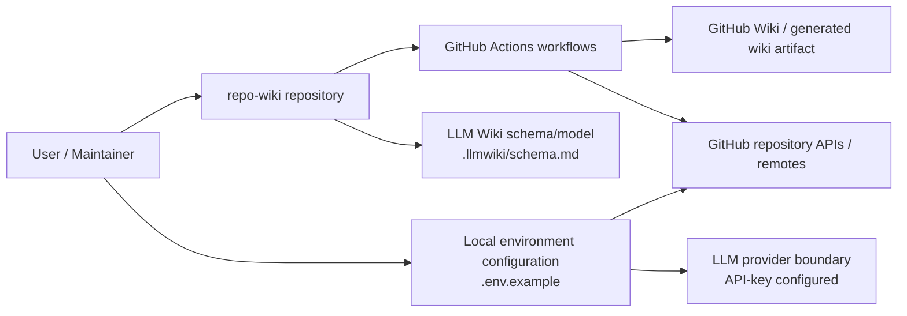
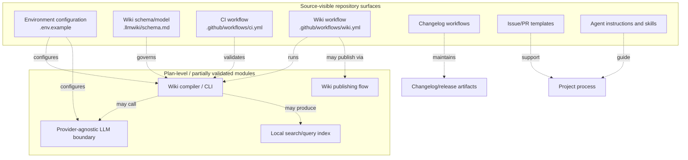
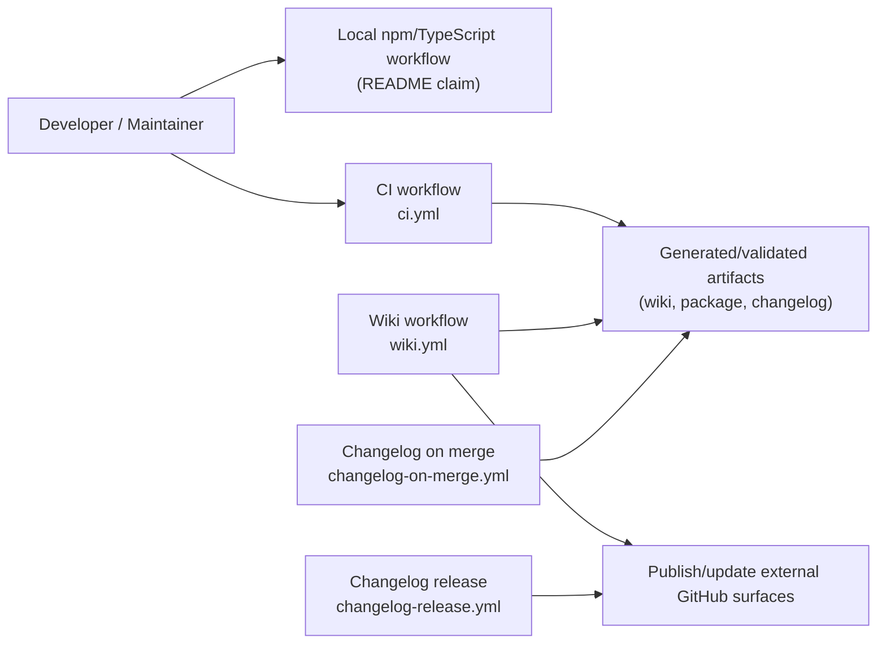

# Architecture

## Executive Architecture Summary

`repo-wiki` is a repository-to-GitHub-Wiki documentation system whose intended product shape is described as implementing an “LLM Wiki” pattern for software repositories: raw sources remain the authoritative input, generated wiki pages become a persistent artifact, and schema/governance guide how the wiki is compiled and maintained. This intent is documented in `docs/PLAN.md`, `docs/WHY.md`, and `.llmwiki/schema.md`; operational details in this page are kept conservative because the available source cards for this bootstrap generation do not include the package manifest or TypeScript source files.

At the repository level, the architecture visible from the available cards consists of these major surfaces:

| Area | Architectural role | Evidence |
|---|---|---|
| Wiki compiler / generated knowledge base model | `.llmwiki/schema.md` defines or documents the data model/schema used for wiki compilation. | `.llmwiki/schema.md` |
| Local and CI execution configuration | `.env.example` declares environment variables for repository selection, GitHub access, compiler mode, and LLM API access. | `.env.example` |
| GitHub Actions automation | CI, wiki publishing, changelog-on-merge, and changelog-release workflows provide automated build/test/publish/release support. | `.github/workflows/ci.yml`, `.github/workflows/wiki.yml`, `.github/workflows/changelog-on-merge.yml`, `.github/workflows/changelog-release.yml` |
| GitHub collaboration interfaces | Issue templates and pull request template standardize project intake and review surfaces. | `.github/ISSUE_TEMPLATE/config.yml`, `.github/ISSUE_TEMPLATE/epic.yml`, `.github/ISSUE_TEMPLATE/task.yml`, `.github/pull_request_template.md` |
| Agent and skill guidance | Agent instructions and skills define human/AI workflow conventions for coordination, development, docs, fixing, quality, review, changelog maintenance, and wiki navigation. | `.github/agents/*.agent.md`, `.github/skills/*/SKILL.md`, `AGENTS.md`, `.pi/AGENTS.md` |
| Planned/extensible modules | Plans describe intended architecture for CI publishing, GitHub Action operation, LLM compiler boundary, incremental mode, and search/query indexing. These are secondary evidence and should not be treated as fully implemented without source validation. | `docs/plans/ci-publishing.md`, `docs/plans/github-action.md`, `docs/plans/llm-compiler.md`, `docs/plans/incremental-mode.md`, `docs/plans/search-index.md` |

Key design decisions visible from the evidence:

1. **Source-first documentation compilation.** The repository includes an `.llmwiki/schema.md` data-model document and a dedicated wiki workflow, indicating that generated wiki content is a first-class artifact rather than ad hoc Markdown. Evidence: `.llmwiki/schema.md`, `.github/workflows/wiki.yml`, `docs/PLAN.md`.
2. **Dual operational modes are intended, but only partially source-validated here.** The README claims both local CLI/package verification and compiled-output-based checks; `.env.example` and workflow cards support local/CI configuration surfaces, but package scripts and TypeScript entry points were not present in the supplied source cards. Evidence: `README.md`, `.env.example`, `.github/workflows/ci.yml`.
3. **GitHub-native automation is a major boundary.** Multiple GitHub Actions workflows and GitHub issue/PR templates show that the project is designed around GitHub repository automation, wiki publishing, and release/changelog maintenance. Evidence: `.github/workflows/*.yml`, `.github/ISSUE_TEMPLATE/*.yml`, `.github/pull_request_template.md`.
4. **LLM integration is configurable and provider-boundary-aware by intent.** `.env.example` includes `LLMWIKI_LLM_API_KEY`; the LLM compiler plan states a provider-agnostic OpenAI-style chat completions boundary as intended architecture. Implementation details are not source-validated from the supplied cards. Evidence: `.env.example`, `docs/plans/llm-compiler.md`.

## System and Repository Context

The repository boundary, based on the available source cards, is a GitHub-hosted project that consumes repository source/documentation metadata and produces or publishes wiki content through local configuration and GitHub Actions automation. External surfaces include GitHub repositories/wikis, GitHub Actions, GitHub tokens, and an LLM provider/API key configuration surface. Evidence: `.env.example`, `.github/workflows/wiki.yml`, `.github/workflows/ci.yml`, `.llmwiki/schema.md`, `docs/plans/github-action.md`, `docs/plans/llm-compiler.md`.

The available cards do **not** expose the main runtime source tree, package entry points, or direct import graph. Therefore, the context diagram below is a repository-boundary diagram inferred from configuration, CI, and documentation-plan evidence rather than from executable import relationships.

**Diagram evidence and limitation:** The boundaries to GitHub Actions, GitHub repository/wiki publishing, and environment configuration are supported by workflow and `.env.example` cards. The LLM provider boundary is supported by the `LLMWIKI_LLM_API_KEY` variable and the LLM compiler plan, but implementation details are not validated by runtime source cards. Evidence: `.env.example`, `.github/workflows/wiki.yml`, `.github/workflows/changelog-on-merge.yml`, `.github/workflows/changelog-release.yml`, `docs/plans/llm-compiler.md`.

Repository-visible external and operational surfaces:

| Surface | Role | Evidence | Validation status |
|---|---|---|---|
| `.env.example` | Documents required/optional environment variables: `GITHUB_REPOSITORY`, `GITHUB_TOKEN`, `LLMWIKI_COMPILER_MODE`, and `LLMWIKI_LLM_API_KEY`. | `.env.example` | Source card validated for variable names only. |
| Wiki workflow | Automates wiki-related compilation/publishing and uses `LLMWIKI_COMPILER_MODE` and `LLMWIKI_PUBLISH_REMOTE`. | `.github/workflows/wiki.yml` | Workflow exists; exact steps not available in card excerpt. |
| CI workflow | Provides background CI automation. | `.github/workflows/ci.yml` | Workflow exists; exact commands not available in card excerpt. |
| Changelog workflows | Automate changelog operations on merge and release. `changelog-on-merge.yml` references `GH_TOKEN`. | `.github/workflows/changelog-on-merge.yml`, `.github/workflows/changelog-release.yml` | Workflow files exist; exact triggers/steps not available in card excerpt. |
| Issue templates | Define structured epic/task intake. | `.github/ISSUE_TEMPLATE/config.yml`, `.github/ISSUE_TEMPLATE/epic.yml`, `.github/ISSUE_TEMPLATE/task.yml` | Source files exist. |
| PR template | Provides pull request process guidance. | `.github/pull_request_template.md` | Documentation source exists. |
| Agent instructions | Provide AI/human collaboration roles and repository workflow guidance. | `.github/agents/*.agent.md`, `AGENTS.md`, `.pi/AGENTS.md` | Documentation source exists. |
| Skills | Provide reusable guidance for changelog and wiki navigation activities. | `.github/skills/keep-a-changelog/SKILL.md`, `.github/skills/repo-wiki-navigation/SKILL.md` | Documentation source exists. |

## Major Modules and Responsibilities

### Wiki Schema and Knowledge-Base Contract

The `.llmwiki/schema.md` file is the visible schema/data-model surface for generated wiki content. It is the strongest available evidence that the repository treats generated wiki pages, source cards, or documentation cards as structured artifacts rather than ungoverned prose. Evidence: `.llmwiki/schema.md`.

The documentation cards further describe the product vision: source inputs are immutable or authoritative, wiki pages are persistent compounding artifacts, and schema guides the compiler. This is secondary evidence and is treated as product intent rather than fully validated runtime behavior. Evidence: `docs/PLAN.md`, `docs/WHY.md`, `.llmwiki/schema.md`.

### Compiler / CLI / Package Runtime

The README card states that the package is dual-role and that local CLI/package verification runs against compiled output in `dist/`, with commands such as `npm test`, `npm run check`, and `npm run coverage` requiring successful TypeScript compilation. Evidence: `README.md`.

However, because the supplied source cards do not include `package.json`, TypeScript files, CLI entry points, or `dist/` contents, this page cannot validate:

- the actual CLI command names,
- the package exports,
- the current TypeScript build configuration,
- the module import graph,
- the exact runtime compiler pipeline.

The presence of `.tsbuildinfo` suggests TypeScript build state exists or has existed in the repository, but `.tsbuildinfo` is not sufficient to describe architecture by itself. Evidence: `.tsbuildinfo`.

### GitHub Actions Automation

The repository includes at least four workflow files:

| Workflow | Architectural responsibility visible from card | Evidence |
|---|---|---|
| `ci.yml` | CI/background automation. | `.github/workflows/ci.yml` |
| `wiki.yml` | Wiki build/publish automation; references `LLMWIKI_COMPILER_MODE` and `LLMWIKI_PUBLISH_REMOTE`. | `.github/workflows/wiki.yml` |
| `changelog-on-merge.yml` | Background changelog automation and GitHub token use via `GH_TOKEN`. | `.github/workflows/changelog-on-merge.yml` |
| `changelog-release.yml` | Background release/changelog automation. | `.github/workflows/changelog-release.yml` |

The CI/publishing plans describe additional intended flows such as testing, fetching existing wiki state, uploading artifacts, and conditional publishing based on credentials. These are plan-level claims and need validation against full workflow contents before being treated as current behavior. Evidence: `docs/plans/ci-publishing.md`, `docs/plans/github-action.md`, `.github/workflows/wiki.yml`.

### Configuration and Secrets Boundary

`.env.example` exposes the local configuration model through environment-variable names:

| Variable | Architectural meaning inferred from name/card | Evidence |
|---|---|---|
| `GITHUB_REPOSITORY` | Identifies the target GitHub repository. | `.env.example` |
| `GITHUB_TOKEN` | Provides GitHub API/authentication credentials for local or automated operations. | `.env.example` |
| `LLMWIKI_COMPILER_MODE` | Selects compiler behavior/mode. Also appears in the wiki workflow card. | `.env.example`, `.github/workflows/wiki.yml` |
| `LLMWIKI_LLM_API_KEY` | Provides credentials for an LLM provider boundary. | `.env.example` |
| `LLMWIKI_PUBLISH_REMOTE` | Configures wiki publish remote in the wiki workflow. | `.github/workflows/wiki.yml` |
| `GH_TOKEN` | Token used by changelog-on-merge automation. | `.github/workflows/changelog-on-merge.yml` |

No environment variable values are included here, and none should be committed or copied into wiki pages. Evidence: `.env.example`, `.github/workflows/wiki.yml`, `.github/workflows/changelog-on-merge.yml`.

### GitHub Project Collaboration Layer

The repository contains issue templates for epics and tasks plus GitHub issue-template configuration. This indicates a project-management layer that is part of the repository’s architecture around contribution intake and planning. Evidence: `.github/ISSUE_TEMPLATE/config.yml`, `.github/ISSUE_TEMPLATE/epic.yml`, `.github/ISSUE_TEMPLATE/task.yml`.

The pull request template and Copilot review instructions provide review/process guidance. Evidence: `.github/pull_request_template.md`, `.github/copilot-review-instructions.md`.

### Agent and Skill Guidance Layer

The repository includes several agent instruction documents:

- coordinator agent: `.github/agents/coordinator.agent.md`
- developer agent: `.github/agents/developer.agent.md`
- docs agent: `.github/agents/docs.agent.md`
- fixer agent: `.github/agents/fixer.agent.md`
- quality agent: `.github/agents/quality.agent.md`
- review agent: `.github/agents/review.agent.md`

It also includes skills for changelog maintenance and repository-wiki navigation. Evidence: `.github/skills/keep-a-changelog/SKILL.md`, `.github/skills/repo-wiki-navigation/SKILL.md`.

These files are documentation/process architecture, not runtime modules. They are relevant because they define how maintainers and AI agents are expected to work with the repository, but they should not be read as executable behavior. Evidence: `.github/agents/*.agent.md`, `.github/skills/*/SKILL.md`.

### Planned LLM Compiler Boundary

The LLM compiler plan states that the first production LLM boundary should be provider-agnostic and compatible with OpenAI-style chat completions so that GitHub Actions and local runs can use OpenAI, compatible hosted providers, or local compatible servers. Evidence: `docs/plans/llm-compiler.md`.

This is partially supported by `.env.example` exposing `LLMWIKI_LLM_API_KEY`, but no implementation source for the provider abstraction was included in the source cards. Evidence: `.env.example`, `docs/plans/llm-compiler.md`.

### Planned Search and Query Index

The search-index plan describes a local search index over generated wiki pages, source cards, and documentation cards so `repo-wiki search` and `repo-wiki query` can route questions without external services. Evidence: `docs/plans/search-index.md`.

This remains plan-level in this architecture page because no search-index implementation source was included in the source cards.

## Runtime, Data, and Control-Flow Relationships

The available source cards do not include executable source files or import information, so runtime relationships cannot be verified at function/class/module level. The safest validated control-flow picture is configuration/workflow-level:

1. Local and CI environments provide configuration through variables such as `GITHUB_REPOSITORY`, `GITHUB_TOKEN`, `LLMWIKI_COMPILER_MODE`, `LLMWIKI_LLM_API_KEY`, `LLMWIKI_PUBLISH_REMOTE`, and `GH_TOKEN`. Evidence: `.env.example`, `.github/workflows/wiki.yml`, `.github/workflows/changelog-on-merge.yml`.
2. GitHub Actions workflows run background automation for CI, wiki, changelog-on-merge, and changelog-release tasks. Evidence: `.github/workflows/ci.yml`, `.github/workflows/wiki.yml`, `.github/workflows/changelog-on-merge.yml`, `.github/workflows/changelog-release.yml`.
3. The wiki architecture is governed by a schema/model document. Evidence: `.llmwiki/schema.md`.
4. Plans describe intended interactions among testing, wiki-state fetching, artifact upload, credential policy, publishing, LLM compilation, and search indexing, but those interactions are not fully validated by the provided source cards. Evidence: `docs/plans/ci-publishing.md`, `docs/plans/github-action.md`, `docs/plans/llm-compiler.md`, `docs/plans/search-index.md`.

The following module diagram is therefore deliberately high-level and labels plan-level modules separately from source-visible modules.

**Diagram evidence and limitation:** Solid source-visible nodes correspond to actual files in the supplied cards. Dotted relationships to compiler, LLM, search, and publishing modules are based on environment-variable names and plan documentation, not validated imports. Evidence: `.env.example`, `.llmwiki/schema.md`, `.github/workflows/*.yml`, `docs/plans/*.md`.

## Build, Test, Deployment, and Operational Surfaces

The repository has CI and automation workflows under `.github/workflows/`. Evidence: `.github/workflows/ci.yml`, `.github/workflows/wiki.yml`, `.github/workflows/changelog-on-merge.yml`, `.github/workflows/changelog-release.yml`.

The README card says local development and verification use compiled output in `dist/`, and references `npm test`, `npm run check`, and `npm run coverage` after TypeScript compilation. Evidence: `README.md`. This is secondary documentation-card evidence because package scripts were not present in the supplied source cards.

The wiki workflow is the clearest deployment/publishing surface in the available source evidence. It references `LLMWIKI_COMPILER_MODE` and `LLMWIKI_PUBLISH_REMOTE`, which indicates that wiki compilation/publishing behavior is configurable in CI. Evidence: `.github/workflows/wiki.yml`.

The changelog workflows provide release/change-management automation. The `changelog-on-merge.yml` card references `GH_TOKEN`, indicating GitHub-authenticated changelog automation. Evidence: `.github/workflows/changelog-on-merge.yml`, `.github/workflows/changelog-release.yml`.

**Diagram evidence and limitation:** Workflow nodes are source-validated by workflow files. The local npm/TypeScript workflow is based on the README card and not validated against `package.json` in this card set. The exact workflow step order is not shown because the source-card excerpts do not include workflow bodies. Evidence: `.github/workflows/*.yml`, `README.md`.

Operational surfaces and likely owners:

| Surface | Operational purpose | Evidence | Confidence |
|---|---|---:|---|
| Local `.env` configuration | Local runs that need GitHub repository context, GitHub credentials, compiler mode, and LLM API credentials. | `.env.example` | Medium |
| CI workflow | Automated checks/background work. | `.github/workflows/ci.yml` | Medium |
| Wiki workflow | Automated wiki compile/publish operation. | `.github/workflows/wiki.yml`, `docs/plans/ci-publishing.md`, `docs/plans/github-action.md` | Medium |
| Changelog workflows | Changelog update and release automation. | `.github/workflows/changelog-on-merge.yml`, `.github/workflows/changelog-release.yml`, `.github/skills/keep-a-changelog/SKILL.md` | Medium |
| Issue/PR templates | Structured human contribution workflow. | `.github/ISSUE_TEMPLATE/*.yml`, `.github/pull_request_template.md` | High for existence, low for exact process details |
| Agent guidance | Maintainer/AI workflow guidance. | `.github/agents/*.agent.md`, `AGENTS.md`, `.pi/AGENTS.md` | High for existence, low for runtime behavior |

## Cross-Cutting Concerns

### Configuration

Configuration is environment-variable driven for GitHub, compiler mode, publishing, and LLM-provider access. The variables visible from the cards are `GITHUB_REPOSITORY`, `GITHUB_TOKEN`, `LLMWIKI_COMPILER_MODE`, `LLMWIKI_LLM_API_KEY`, `LLMWIKI_PUBLISH_REMOTE`, and `GH_TOKEN`. Evidence: `.env.example`, `.github/workflows/wiki.yml`, `.github/workflows/changelog-on-merge.yml`.

### Security and Secret Handling

The repository’s architecture crosses credential boundaries for GitHub and LLM access. Token/API-key variable names are visible, but values must not be copied into generated documentation or committed. Evidence: `.env.example`, `.github/workflows/changelog-on-merge.yml`.

Relevant sensitive variables by name:

| Variable | Sensitive? | Evidence |
|---|---:|---|
| `GITHUB_TOKEN` | Yes | `.env.example` |
| `GH_TOKEN` | Yes | `.github/workflows/changelog-on-merge.yml` |
| `LLMWIKI_LLM_API_KEY` | Yes | `.env.example` |

### Data Model and Wiki Contract

`.llmwiki/schema.md` is the central visible data-model/schema document. Documentation cards describe source cards and documentation cards as inputs to the wiki-generation process, but exact schema fields and validation rules are not available from the excerpt alone. Evidence: `.llmwiki/schema.md`, `docs/PLAN.md`.

### Documentation Trust Model

This page follows the repository-compilation authority model:

1. Source code and workflow/config files are treated as stronger evidence.
2. Tests, CI, configuration, schemas, and migrations are high-authority operational evidence.
3. Markdown docs and plans are used for intent and terminology, but operational claims from them are marked as plan-level or partially validated unless backed by source/config evidence.

This is especially important for `docs/plans/incremental-mode.md`, which is marked stale in the supplied documentation cards. Claims from that file should not be treated as current architecture without implementation evidence. Evidence: `docs/plans/incremental-mode.md`.

### GitHub-Native Process Design

The repository uses GitHub-native collaboration and automation conventions: workflows, issue templates, PR template, Copilot review instructions, agent docs, and skills. Evidence: `.github/workflows/*.yml`, `.github/ISSUE_TEMPLATE/*.yml`, `.github/pull_request_template.md`, `.github/copilot-review-instructions.md`, `.github/agents/*.agent.md`, `.github/skills/*/SKILL.md`.

### LLM Boundary

The LLM boundary is visible as a configuration concern through `LLMWIKI_LLM_API_KEY` and as a planned architecture concern through the LLM compiler plan. The intended provider-agnostic/OpenAI-compatible design is not validated by executable source cards in this bootstrap input. Evidence: `.env.example`, `docs/plans/llm-compiler.md`.

### Search/Query Boundary

The search-index plan proposes local indexing over generated wiki pages, source cards, and documentation cards for `repo-wiki search` and `repo-wiki query`. This is not validated by implementation source in the provided card set. Evidence: `docs/plans/search-index.md`.

## Caveats and Open Questions

### Caveats

- **No executable source cards were provided for the compiler runtime.** This page cannot validate package entry points, TypeScript modules, command implementations, imports, classes, functions, or runtime call graphs. Evidence gap: supplied source cards include workflows/config/docs but not `package.json` or `src/**`.
- **README claims about `npm test`, `npm run check`, `npm run coverage`, `dist/`, and TypeScript compilation are only partially validated.** The README card records these claims, but package scripts and TypeScript config were not included in the supplied source cards. Evidence: `README.md`, `.tsbuildinfo`.
- **Workflow existence is validated, but workflow internals are not described in the excerpts.** Exact triggers, permissions, jobs, checkout steps, installation commands, artifact behavior, and publish logic require reading the full workflow files. Evidence: `.github/workflows/ci.yml`, `.github/workflows/wiki.yml`, `.github/workflows/changelog-on-merge.yml`, `.github/workflows/changelog-release.yml`.
- **Plan documents describe intended architecture and may be ahead of implementation.** This applies especially to LLM compiler, GitHub Action, CI publishing, search index, and incremental mode plans. Evidence: `docs/plans/llm-compiler.md`, `docs/plans/github-action.md`, `docs/plans/ci-publishing.md`, `docs/plans/search-index.md`, `docs/plans/incremental-mode.md`.
- **`docs/plans/incremental-mode.md` is explicitly marked stale in the documentation-card metadata.** It should not drive current architecture claims without source validation. Evidence: `docs/plans/incremental-mode.md`.
- **Diagrams in this page are architecture-level syntheses, not import graphs.** They are based on repository structure, workflow/config evidence, environment-variable names, and plan docs; relationships involving compiler, LLM, search, and publishing modules are marked as inferred or plan-level. Evidence: `.env.example`, `.llmwiki/schema.md`, `.github/workflows/*.yml`, `docs/plans/*.md`.

### Open Questions

1. What are the actual package entry points, CLI commands, and exported APIs? Requires `package.json` and runtime source validation. Related evidence currently available: `README.md`.
2. What is the implemented compiler pipeline from source cards/documentation cards to wiki pages? Requires executable source files and tests. Related evidence currently available: `.llmwiki/schema.md`, `docs/PLAN.md`.
3. Does the current implementation support the provider-agnostic OpenAI-compatible LLM boundary described in the plan? Requires implementation source validation. Related evidence currently available: `.env.example`, `docs/plans/llm-compiler.md`.
4. Does `repo-wiki search` / `repo-wiki query` exist in the current CLI, and is there a local search index implementation? Requires source/package validation. Related evidence currently available: `docs/plans/search-index.md`.
5. What exactly does the wiki workflow publish, and under what credentials/branch/remote policy? Requires full workflow contents. Related evidence currently available: `.github/workflows/wiki.yml`, `docs/plans/ci-publishing.md`, `docs/plans/github-action.md`.
6. Which tests cover schema validation, wiki generation, GitHub publishing, changelog automation, and secret handling? Requires test source cards. Related evidence currently available: `.github/workflows/ci.yml`, `README.md`.
7. Are the agent and skill documents normative for all contributions, or advisory only? Requires maintainer confirmation or repository governance docs. Related evidence currently available: `AGENTS.md`, `.pi/AGENTS.md`, `.github/agents/*.agent.md`, `.github/skills/*/SKILL.md`.

<!-- HUMAN_NOTES_START -->
<!-- HUMAN_NOTES_END -->
