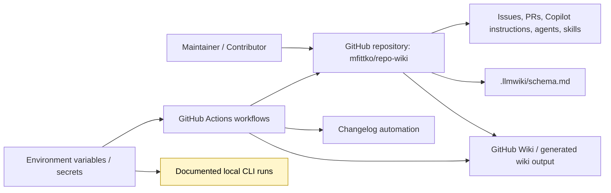
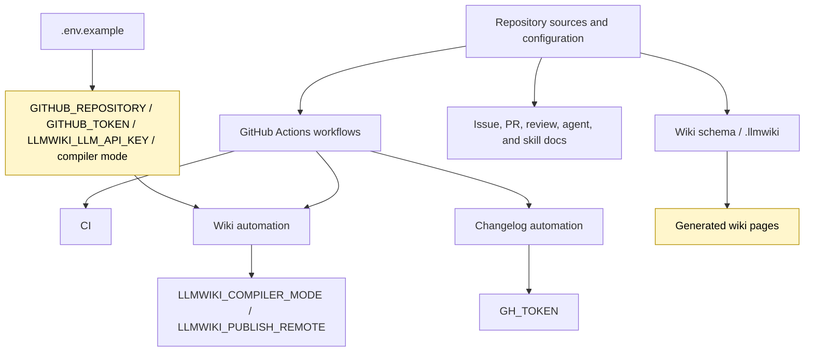
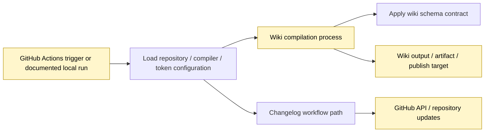
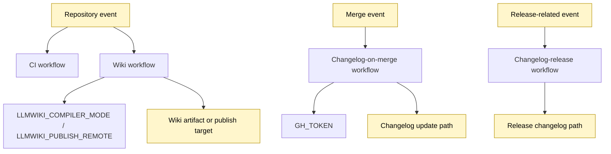

# Architecture

## Executive Architecture Summary

`repo-wiki` is documented as a repository-to-GitHub-Wiki compiler whose intended output is a maintained wiki generated from repository sources, with a schema guiding how information is represented for LLM-assisted compilation. This product intent is supported by the validated documentation cards for `README.md`, `docs/PLAN.md`, and `docs/WHY.md`, and by the presence of `.llmwiki/schema.md` as a data-model documentation artifact. The operational surface visible in the provided source cards is primarily GitHub-based: CI workflows, wiki publishing workflow configuration, changelog workflows, issue templates, pull request templates, Copilot review instructions, and agent/skill instructions under `.github/` and `.pi/`. Evidence: `.llmwiki/schema.md`, `.github/workflows/wiki.yml`, `.github/workflows/ci.yml`, `.github/workflows/changelog-on-merge.yml`, `.github/workflows/changelog-release.yml`, `.github/ISSUE_TEMPLATE/*.yml`, `.github/pull_request_template.md`, `.github/copilot-review-instructions.md`, `.github/agents/*.agent.md`, `.github/skills/*/SKILL.md`, `.pi/AGENTS.md`, `.pi/settings.json`; documentation cards: `README.md`, `docs/PLAN.md`, `docs/WHY.md`.

The architecture that can be verified from the supplied cards consists of these repository-level subsystems:

| Subsystem | Responsibility visible from evidence | Evidence | Confidence |
|---|---|---:|---:|
| Wiki schema / knowledge-base contract | Describes the LLM Wiki data model or schema used by generated wiki content. | `.llmwiki/schema.md`; documentation card `docs/PLAN.md` | Medium |
| GitHub Actions automation | Provides CI, wiki generation/publishing, changelog-on-merge, and changelog-release automation. | `.github/workflows/ci.yml`, `.github/workflows/wiki.yml`, `.github/workflows/changelog-on-merge.yml`, `.github/workflows/changelog-release.yml` | Medium |
| Runtime/configuration surface | Declares expected environment variables for repository selection, GitHub authentication, compiler mode, LLM API access, and wiki publishing remote. | `.env.example`, `.github/workflows/wiki.yml`, `.github/workflows/changelog-on-merge.yml` | Medium |
| Collaboration and governance | Defines issue templates, pull request template, Copilot review instructions, and agent role instructions. | `.github/ISSUE_TEMPLATE/config.yml`, `.github/ISSUE_TEMPLATE/epic.yml`, `.github/ISSUE_TEMPLATE/task.yml`, `.github/pull_request_template.md`, `.github/copilot-review-instructions.md`, `.github/agents/*.agent.md`, `.pi/AGENTS.md` | Medium |
| Changelog process | Provides reusable guidance for changelog maintenance and workflows that run on merge/release. | `.github/skills/keep-a-changelog/SKILL.md`, `.github/workflows/changelog-on-merge.yml`, `.github/workflows/changelog-release.yml` | Medium |
| Repository/wiki navigation skill | Provides guidance for navigating the generated or maintained wiki. | `.github/skills/repo-wiki-navigation/SKILL.md` | Medium |

A key caveat: the supplied source cards do **not** include application implementation files such as package manifests, CLI source files, TypeScript source files, tests, or action implementation code. The page therefore describes the verified repository architecture from configuration, workflows, schema docs, and validated documentation cards, and does not assert concrete internal call graphs or package-level APIs that are not present in the evidence. Evidence: source-card list; `.tsbuildinfo` indicates a TypeScript build artifact exists, but it is not sufficient to reconstruct source modules or runtime relationships.

## System and Repository Context

The repository boundary visible from the supplied evidence is a GitHub-hosted project with automation and documentation tooling around wiki compilation. External surfaces evidenced by configuration include:

- GitHub repository and GitHub API/authentication context through `GITHUB_REPOSITORY`, `GITHUB_TOKEN`, and workflow token usage. Evidence: `.env.example`, `.github/workflows/changelog-on-merge.yml`.
- LLM provider/API access through `LLMWIKI_LLM_API_KEY`. Evidence: `.env.example`; documentation card `docs/plans/llm-compiler.md`.
- Compiler mode selection through `LLMWIKI_COMPILER_MODE`. Evidence: `.env.example`, `.github/workflows/wiki.yml`.
- Wiki publishing remote configuration through `LLMWIKI_PUBLISH_REMOTE`. Evidence: `.github/workflows/wiki.yml`.
- GitHub Actions as the operational runner for CI, wiki publishing, and changelog automation. Evidence: `.github/workflows/ci.yml`, `.github/workflows/wiki.yml`, `.github/workflows/changelog-on-merge.yml`, `.github/workflows/changelog-release.yml`.
- Human and AI collaboration surfaces through issue templates, PR template, Copilot review instructions, agent instructions, and skills. Evidence: `.github/ISSUE_TEMPLATE/config.yml`, `.github/ISSUE_TEMPLATE/epic.yml`, `.github/ISSUE_TEMPLATE/task.yml`, `.github/pull_request_template.md`, `.github/copilot-review-instructions.md`, `.github/agents/*.agent.md`, `.github/skills/*/SKILL.md`, `.pi/AGENTS.md`.

The validated README documentation card mentions CLI-style commands including `npx repo-wiki init --repo . --write-agents`, `npx repo-wiki run`, and `npm install`, but the source cards supplied for this page do not include `package.json` or CLI implementation files. Therefore, those commands are treated as documented intent / partially validated operational documentation rather than fully verified implementation details. Documentation card: `README.md`.

Diagram evidence and limits: GitHub Actions, wiki publishing, changelog workflows, schema, and collaboration files are directly supported by `.github/workflows/*.yml`, `.llmwiki/schema.md`, `.github/ISSUE_TEMPLATE/*.yml`, `.github/pull_request_template.md`, `.github/copilot-review-instructions.md`, `.github/agents/*.agent.md`, and `.github/skills/*/SKILL.md`. The `LocalRun` node is inferred from the validated README documentation card and `.env.example`, but implementation source for the CLI was not included in the source cards.

## Major Modules and Responsibilities

### Wiki Schema and Knowledge-Base Contract

The `.llmwiki/schema.md` file is the clearest source-grounded architecture artifact for the wiki knowledge model. It is categorized as documentation with `data-model` relevance in the source cards, which supports treating it as the schema/contract layer for generated wiki content. Evidence: `.llmwiki/schema.md`.

The implementation plan documentation describes an LLM Wiki pattern where raw sources remain immutable, the wiki becomes a persistent compounding artifact, and a schema tells the LLM what to maintain. This is secondary evidence and should be interpreted as product/architecture intent rather than verified runtime behavior. Documentation card: `docs/PLAN.md`.

### GitHub Actions Automation

The repository includes four workflow files:

| Workflow | Architectural role | Evidence |
|---|---|---|
| CI workflow | Build/test/validation automation surface. Exact steps are not visible in the card excerpt, so only the existence and role as CI are asserted. | `.github/workflows/ci.yml` |
| Wiki workflow | Wiki compilation/publishing automation surface; declares runtime hints for background work and environment variables `LLMWIKI_COMPILER_MODE` and `LLMWIKI_PUBLISH_REMOTE`. | `.github/workflows/wiki.yml` |
| Changelog-on-merge workflow | Changelog automation triggered around merge behavior; declares `GH_TOKEN` as an environment variable. | `.github/workflows/changelog-on-merge.yml` |
| Changelog-release workflow | Release-related changelog automation. | `.github/workflows/changelog-release.yml` |

These workflows define the repository’s most concrete operational architecture in the supplied evidence. Evidence: `.github/workflows/ci.yml`, `.github/workflows/wiki.yml`, `.github/workflows/changelog-on-merge.yml`, `.github/workflows/changelog-release.yml`.

### Configuration and Environment

The `.env.example` file declares the environment variables `GITHUB_REPOSITORY`, `GITHUB_TOKEN`, `LLMWIKI_COMPILER_MODE`, and `LLMWIKI_LLM_API_KEY`. This indicates that local or configured runs expect repository context, GitHub authentication, compiler mode selection, and an LLM API key. Evidence: `.env.example`.

The wiki workflow additionally references `LLMWIKI_COMPILER_MODE` and `LLMWIKI_PUBLISH_REMOTE`, indicating that CI-based wiki operation has configurable compiler mode and publishing remote. Evidence: `.github/workflows/wiki.yml`.

The changelog-on-merge workflow references `GH_TOKEN`, indicating token-based GitHub automation for changelog operations. Evidence: `.github/workflows/changelog-on-merge.yml`.

No environment variable values are included here, and no secret values should be copied into wiki documentation. Evidence: `.env.example`, `.github/workflows/wiki.yml`, `.github/workflows/changelog-on-merge.yml`.

### Collaboration, Planning, and Governance

The `.github/ISSUE_TEMPLATE/` directory contains issue templates for epics and tasks plus template configuration, supporting structured project intake. Evidence: `.github/ISSUE_TEMPLATE/config.yml`, `.github/ISSUE_TEMPLATE/epic.yml`, `.github/ISSUE_TEMPLATE/task.yml`.

The repository contains a pull request template and Copilot review instructions, supporting review consistency and AI-assisted review guidance. Evidence: `.github/pull_request_template.md`, `.github/copilot-review-instructions.md`.

The repository contains agent role documents for coordinator, developer, docs, fixer, quality, and review agents. These are documentation/instruction artifacts and are not evidence of a runtime multi-agent system unless another implementation file invokes them. Evidence: `.github/agents/coordinator.agent.md`, `.github/agents/developer.agent.md`, `.github/agents/docs.agent.md`, `.github/agents/fixer.agent.md`, `.github/agents/quality.agent.md`, `.github/agents/review.agent.md`.

The `.pi/AGENTS.md` and `.pi/settings.json` files indicate additional local or tool-specific agent/project configuration, but the provided cards do not expose enough detail to define their runtime semantics. Evidence: `.pi/AGENTS.md`, `.pi/settings.json`.

### Skills and Reusable Operating Instructions

The repository includes at least two skill documents:

| Skill | Likely responsibility | Evidence |
|---|---|---|
| `keep-a-changelog` | Guidance for maintaining changelog format/process. | `.github/skills/keep-a-changelog/SKILL.md` |
| `repo-wiki-navigation` | Guidance for navigating the repository wiki. | `.github/skills/repo-wiki-navigation/SKILL.md` |

These are best treated as human/agent operational instructions rather than executable modules unless implementation evidence shows they are loaded by tooling. Evidence: `.github/skills/keep-a-changelog/SKILL.md`, `.github/skills/repo-wiki-navigation/SKILL.md`.

### Documented Product Plans

The documentation cards describe planned or partially validated architecture areas:

| Plan/document | Architecture implication | Status from card |
|---|---|---|
| `docs/plans/ci-publishing.md` | CI publishing architecture with testing and existing wiki state fetch concepts. | Partially validated |
| `docs/plans/github-action.md` | GitHub Action architecture with artifact upload and credential-gated publishing concepts. | Partially validated |
| `docs/plans/incremental-mode.md` | Incremental mode architecture, but the card is marked stale. | Stale |
| `docs/plans/llm-compiler.md` | Provider-agnostic LLM boundary compatible with OpenAI-style chat completions. | Partially validated |

Because these are documentation cards rather than source-code cards, they are used as intent and planning context only. Documentation cards: `docs/plans/ci-publishing.md`, `docs/plans/github-action.md`, `docs/plans/incremental-mode.md`, `docs/plans/llm-compiler.md`.

Diagram evidence and limits: module groupings are derived from repository structure and workflow/configuration cards. The specific relationship from schema to generated wiki pages is supported by `.llmwiki/schema.md` and documentation cards describing the wiki schema concept, but implementation source was not available in the supplied cards.

## Runtime, Data, and Control-Flow Relationships

The supplied evidence supports only high-level runtime/control-flow relationships. It does **not** include scanner/import data, package dependency manifests, CLI implementation, TypeScript source, or test files sufficient to describe exact function-level or module-level control flow.

Supported runtime/configuration relationships:

1. **Wiki automation depends on compiler and publishing configuration.** The wiki workflow has runtime hints for background work and environment variables `LLMWIKI_COMPILER_MODE` and `LLMWIKI_PUBLISH_REMOTE`. Evidence: `.github/workflows/wiki.yml`.
2. **Local or configured wiki runs may require GitHub and LLM credentials/configuration.** `.env.example` declares `GITHUB_REPOSITORY`, `GITHUB_TOKEN`, `LLMWIKI_COMPILER_MODE`, and `LLMWIKI_LLM_API_KEY`. Evidence: `.env.example`.
3. **Changelog automation depends on GitHub token context.** The changelog-on-merge workflow declares `GH_TOKEN`. Evidence: `.github/workflows/changelog-on-merge.yml`.
4. **Wiki content is governed by a schema artifact.** `.llmwiki/schema.md` is categorized as a data-model documentation artifact. Evidence: `.llmwiki/schema.md`.
5. **Documented LLM compiler intent includes a provider-agnostic OpenAI-style chat-completions boundary.** This is planning/documentation evidence, not source-code verification. Documentation card: `docs/plans/llm-compiler.md`.

A conservative control-flow summary is:

Diagram evidence and limits: `Config`, `Schema`, and `Changelog` are supported by `.env.example`, `.github/workflows/wiki.yml`, `.llmwiki/schema.md`, and `.github/workflows/changelog-on-merge.yml`. The exact `Compile` implementation and publish mechanics are inferred from workflow/documentation context and are not verified by implementation files in the supplied source cards.

## Build, Test, Deployment, and Operational Surfaces

### CI and Build/Test Surface

The repository includes a CI workflow at `.github/workflows/ci.yml`. The card confirms it is a CI YAML file with background-work runtime hints, but the excerpt does not expose individual jobs, package manager commands, matrix strategy, or test commands. Evidence: `.github/workflows/ci.yml`.

The presence of `.tsbuildinfo` indicates that TypeScript build metadata exists in the repository snapshot or scan inputs, but it does not by itself prove the current build command, package structure, or emitted artifact layout. Evidence: `.tsbuildinfo`.

The README documentation card includes `npm install` as a command, but no `package.json` source card is available here. Therefore, package scripts and dependency details cannot be verified from the supplied evidence. Documentation card: `README.md`.

### Wiki Publishing / Deployment Surface

The wiki workflow is the clearest deployment/publishing surface. It references `LLMWIKI_COMPILER_MODE` and `LLMWIKI_PUBLISH_REMOTE`, which suggests configurable compilation behavior and a target remote for publishing. Evidence: `.github/workflows/wiki.yml`.

Documentation cards for CI publishing and the GitHub Action describe architecture concepts such as fetching existing wiki state, uploading a local wiki artifact, and credential-gated publishing. These claims are partially validated documentation, not fully verified workflow implementation details from the card excerpts. Documentation cards: `docs/plans/ci-publishing.md`, `docs/plans/github-action.md`.

### Changelog Operations

The repository has two changelog-related workflows:

- `.github/workflows/changelog-on-merge.yml`, with background-work and `GH_TOKEN` environment-variable hints.
- `.github/workflows/changelog-release.yml`, with background-work hints.

It also includes a `keep-a-changelog` skill document. Evidence: `.github/workflows/changelog-on-merge.yml`, `.github/workflows/changelog-release.yml`, `.github/skills/keep-a-changelog/SKILL.md`.

### Collaboration Operations

Issue templates, PR templates, Copilot review instructions, and agent instructions form operational surfaces for project management and review. These do not imply runtime application behavior, but they are part of the repository’s operating architecture. Evidence: `.github/ISSUE_TEMPLATE/config.yml`, `.github/ISSUE_TEMPLATE/epic.yml`, `.github/ISSUE_TEMPLATE/task.yml`, `.github/pull_request_template.md`, `.github/copilot-review-instructions.md`, `.github/agents/*.agent.md`, `.pi/AGENTS.md`.

Diagram evidence and limits: workflow existence and relevant environment variables are directly supported by `.github/workflows/*.yml` cards. The exact event triggers and exact job steps are not visible in the provided excerpts, so event names and downstream update/publish paths are generalized and should be verified against full workflow contents before relying on them operationally.

## Cross-Cutting Concerns

### Configuration

Configuration is environment-variable driven in the visible evidence. `.env.example` lists `GITHUB_REPOSITORY`, `GITHUB_TOKEN`, `LLMWIKI_COMPILER_MODE`, and `LLMWIKI_LLM_API_KEY`. The wiki workflow references `LLMWIKI_COMPILER_MODE` and `LLMWIKI_PUBLISH_REMOTE`. The changelog-on-merge workflow references `GH_TOKEN`. Evidence: `.env.example`, `.github/workflows/wiki.yml`, `.github/workflows/changelog-on-merge.yml`.

### Security and Secret Handling

GitHub and LLM integration require sensitive tokens or API keys. The evidence identifies variable names but not values. Wiki documentation and generated pages should not copy token values, API keys, private keys, or any secret-like content. Evidence: `.env.example`, `.github/workflows/wiki.yml`, `.github/workflows/changelog-on-merge.yml`.

### LLM Boundary

The LLM compiler plan documentation states that the first production LLM boundary should be provider-agnostic and compatible with OpenAI-style chat completions. Because the supplied source cards do not include compiler implementation code, this is an architectural intention rather than verified current runtime behavior. Documentation card: `docs/plans/llm-compiler.md`; related configuration evidence: `.env.example`.

### Data Model and Wiki Contract

The schema/data-model concern is centralized in `.llmwiki/schema.md`. This file should be treated as high-value documentation for the generated wiki contract, but concrete generated output behavior should be validated against implementation files or tests when available. Evidence: `.llmwiki/schema.md`.

### Documentation Trust Model

Several documentation cards are marked `partially_validated`, while `docs/plans/incremental-mode.md` is marked `stale`. Operational claims from these documents should be cross-checked against source code, tests, workflows, or configuration before being treated as current behavior. Documentation cards: `README.md`, `docs/PLAN.md`, `docs/WHY.md`, `docs/plans/ci-publishing.md`, `docs/plans/github-action.md`, `docs/plans/incremental-mode.md`, `docs/plans/llm-compiler.md`.

### Governance and Review

Issue templates, PR templates, Copilot review instructions, agent instructions, and skills provide cross-cutting governance for how humans and AI assistants should work in the repository. They are repository process artifacts rather than runtime application modules unless loaded by external tooling. Evidence: `.github/ISSUE_TEMPLATE/config.yml`, `.github/ISSUE_TEMPLATE/epic.yml`, `.github/ISSUE_TEMPLATE/task.yml`, `.github/pull_request_template.md`, `.github/copilot-review-instructions.md`, `.github/agents/*.agent.md`, `.github/skills/*/SKILL.md`, `.pi/AGENTS.md`.

### Generated/Build Artifacts and Ignore Rules

The repository includes `.gitignore` and `.tsbuildinfo`. `.gitignore` defines ignored paths/patterns, but the card excerpt does not expose its entries. `.tsbuildinfo` is a TypeScript incremental-build metadata artifact and should not be used alone to infer source architecture. Evidence: `.gitignore`, `.tsbuildinfo`.

## Caveats and Open Questions

1. **Application implementation files were not included in the supplied source cards.** No `package.json`, CLI entry point, TypeScript source file, tests, or action implementation file was available in the evidence set for this page. As a result, internal call graphs, concrete APIs, command implementations, and package scripts cannot be verified here. Evidence: supplied source-card list; `.tsbuildinfo`.

2. **CLI commands are documented but not source-verified in this evidence set.** The README card mentions commands such as `npx repo-wiki init --repo . --write-agents`, `npx repo-wiki run`, and `npm install`, but the implementation and package metadata are not included in the source cards. Documentation card: `README.md`.

3. **Workflow internals need full-file verification.** Workflow files exist for CI, wiki automation, changelog-on-merge, and changelog-release, but the card excerpts do not include exact triggers, jobs, steps, permissions, artifacts, or publish mechanics. Evidence: `.github/workflows/ci.yml`, `.github/workflows/wiki.yml`, `.github/workflows/changelog-on-merge.yml`, `.github/workflows/changelog-release.yml`.

4. **Publishing behavior is partially inferred.** `LLMWIKI_PUBLISH_REMOTE` in the wiki workflow supports the presence of a configurable publishing target, but the exact deployment sequence is not visible from the card excerpt. Evidence: `.github/workflows/wiki.yml`; documentation cards: `docs/plans/ci-publishing.md`, `docs/plans/github-action.md`.

5. **LLM provider behavior is planning-level evidence.** The provider-agnostic OpenAI-style boundary is described in a partially validated plan, but compiler source code was not available here. Documentation card: `docs/plans/llm-compiler.md`; related configuration evidence: `.env.example`.

6. **Incremental mode should not be treated as current behavior without further evidence.** The incremental-mode plan card is explicitly marked stale. Documentation card: `docs/plans/incremental-mode.md`.

7. **Agent and skill files are instruction artifacts, not proven runtime modules.** The repository contains agent and skill markdown files, but no source evidence in the provided cards shows that application code loads or executes them. Evidence: `.github/agents/*.agent.md`, `.github/skills/*/SKILL.md`, `.pi/AGENTS.md`, `.pi/settings.json`.

8. **Diagrams in this page are repository-structure diagrams, not verified implementation call graphs.** They are based on workflow/configuration/schema/collaboration files and partially validated documentation cards. Exact runtime control flow requires implementation source and tests that were not present in the evidence set.

<!-- HUMAN_NOTES_START -->
<!-- HUMAN_NOTES_END -->
