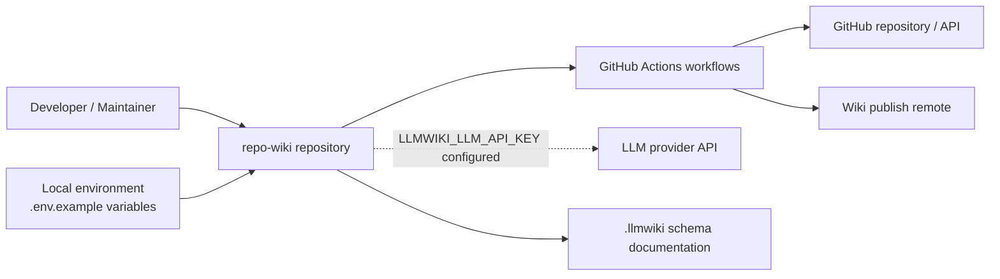
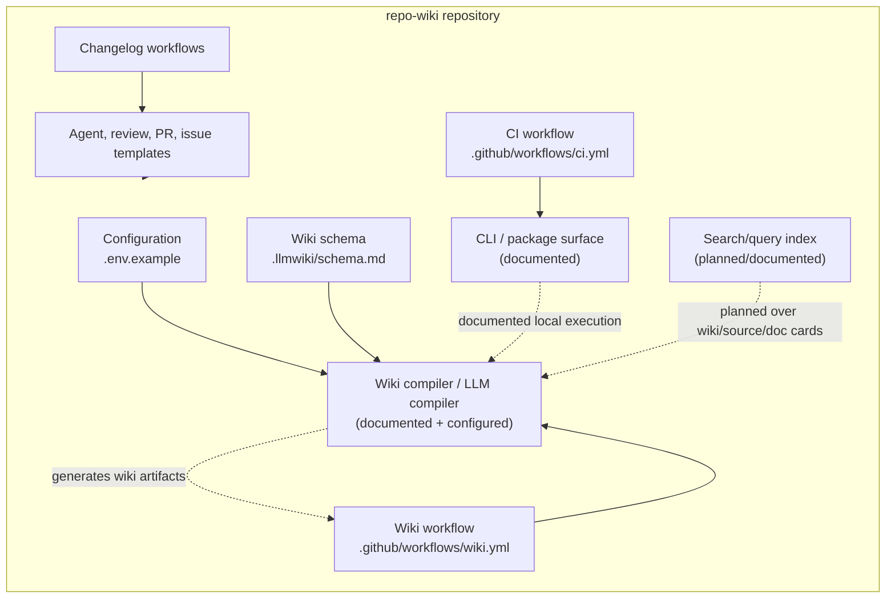
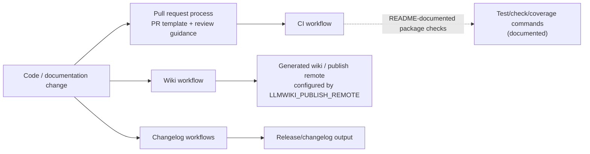

# Architecture

## Executive Architecture Summary

`repo-wiki` is a repository-to-GitHub-Wiki system whose stated product direction is to compile source repositories into a persistent wiki knowledge base; the README documentation card describes it as a dual-role package, and the implementation plan documentation card frames the project around an “LLM Wiki” pattern where raw sources remain immutable and generated wiki pages become the maintained knowledge artifact. This page treats those product statements as secondary evidence because the supplied source-card set does not include the TypeScript implementation files or `package.json`. [README.md documentation card; docs/PLAN.md documentation card]

From the available high-authority repository evidence, the visible architecture has these major surfaces:

| Surface | Evidence | Architectural role |
|---|---|---|
| Environment configuration | `.env.example` | Defines expected runtime/configuration variables for repository targeting, GitHub access, compiler mode, and LLM API access. [.env.example] |
| GitHub Actions CI | `.github/workflows/ci.yml` | Provides a background-work validation surface for the repository. [.github/workflows/ci.yml] |
| Wiki publishing workflow | `.github/workflows/wiki.yml` | Provides an automated wiki-generation/publishing surface with compiler-mode and publish-remote configuration. [.github/workflows/wiki.yml] |
| Changelog automation | `.github/workflows/changelog-on-merge.yml`, `.github/workflows/changelog-release.yml` | Provides background-work automation around changelog maintenance and release-related changelog processing. [.github/workflows/changelog-on-merge.yml; .github/workflows/changelog-release.yml] |
| Wiki schema documentation | `.llmwiki/schema.md` | Documents the data model/schema for generated wiki artifacts. [.llmwiki/schema.md] |
| Contributor and automation guidance | `AGENTS.md`, `.pi/AGENTS.md`, `.github/agents/*.agent.md`, `.github/skills/*/SKILL.md`, `.github/copilot-review-instructions.md`, `.github/pull_request_template.md` | Defines human/agent workflow expectations and repository maintenance practices. [AGENTS.md; .pi/AGENTS.md; .github/agents/coordinator.agent.md; .github/agents/developer.agent.md; .github/agents/docs.agent.md; .github/agents/fixer.agent.md; .github/agents/quality.agent.md; .github/agents/review.agent.md; .github/skills/keep-a-changelog/SKILL.md; .github/skills/repo-wiki-navigation/SKILL.md; .github/copilot-review-instructions.md; .github/pull_request_template.md] |
| Issue intake | `.github/ISSUE_TEMPLATE/*.yml` | Encodes structured task/epic issue templates and issue-template configuration. [.github/ISSUE_TEMPLATE/config.yml; .github/ISSUE_TEMPLATE/epic.yml; .github/ISSUE_TEMPLATE/task.yml] |

The key confirmed design decision is that runtime and CI behavior is configurable through environment variables rather than hard-coded credentials: `.env.example` names `GITHUB_REPOSITORY`, `GITHUB_TOKEN`, `LLMWIKI_COMPILER_MODE`, and `LLMWIKI_LLM_API_KEY`; the wiki workflow also references `LLMWIKI_COMPILER_MODE` and `LLMWIKI_PUBLISH_REMOTE`; changelog-on-merge references `GH_TOKEN`. No secret values are present in the supplied evidence. [.env.example; .github/workflows/wiki.yml; .github/workflows/changelog-on-merge.yml]

Because source implementation files are not included in the supplied source-card set, this architecture page distinguishes between **confirmed repository surfaces** and **planned/documented product architecture**. Planned modules such as LLM compilation, search indexing, incremental mode, and GitHub Action packaging are supported by documentation cards, but their current implementation cannot be fully verified from the provided source cards. [docs/plans/llm-compiler.md documentation card; docs/plans/search-index.md documentation card; docs/plans/incremental-mode.md documentation card; docs/plans/github-action.md documentation card]

## System and Repository Context

The repository boundary visible from the source cards is a GitHub-hosted project with local environment configuration, GitHub Actions automation, GitHub issue/pull-request process configuration, and schema/documentation assets. [.env.example; .github/workflows/ci.yml; .github/workflows/wiki.yml; .github/ISSUE_TEMPLATE/config.yml; .github/pull_request_template.md; .llmwiki/schema.md]

The main external systems evidenced by configuration are:

- **GitHub repository and GitHub token access**, represented by `GITHUB_REPOSITORY`, `GITHUB_TOKEN`, and workflow-level `GH_TOKEN`. These variables indicate integration with GitHub APIs or GitHub-hosted automation, but exact API calls are not visible in the supplied implementation evidence. [.env.example; .github/workflows/changelog-on-merge.yml]
- **GitHub Wiki publishing target**, represented by `LLMWIKI_PUBLISH_REMOTE` in the wiki workflow. This indicates a configurable publish remote for wiki output, but the exact publish mechanism is not visible in the supplied source cards. [.github/workflows/wiki.yml]
- **LLM provider/API boundary**, represented by `LLMWIKI_LLM_API_KEY` in `.env.example` and by the LLM compiler plan’s statement that the first production LLM boundary should be provider-agnostic and compatible with OpenAI-style chat completions. The environment variable is source evidence; the provider-agnostic behavior is currently documentation-card evidence. [.env.example; docs/plans/llm-compiler.md documentation card]
- **Local CLI/package surface**, described by the README documentation card as running against compiled output in `dist/`, with commands such as `npm test`, `npm run check`, and `npm run coverage` requiring a TypeScript build. This is secondary evidence because `package.json` and source entry points are not included in the supplied cards. [README.md documentation card]

Diagram confidence: **medium-low**. The repository, environment variables, workflows, schema, GitHub token, wiki publish remote, and LLM API key are directly evidenced by source cards; the detailed runtime invocation paths between the compiled package and external APIs are not visible in the supplied implementation files. [.env.example; .github/workflows/ci.yml; .github/workflows/wiki.yml; .github/workflows/changelog-on-merge.yml; .llmwiki/schema.md]

## Major Modules and Responsibilities

### CLI / Package Execution Surface

The README documentation card states that the package has a local CLI/package verification flow that runs against compiled output in `dist/`, and that `npm test`, `npm run check`, and `npm run coverage` require a successful TypeScript build. This suggests a Node/TypeScript package architecture, but the supplied source cards do not include `package.json`, `src/`, or `dist/` files that would verify command names, entry points, or module boundaries. [README.md documentation card]

Architectural responsibility, based on partially validated documentation:

- Execute local repository analysis and wiki compilation workflows. [README.md documentation card]
- Provide local developer verification commands that depend on compiled output. [README.md documentation card]

Claim status: **partially validated** because the relevant implementation files are not present in the supplied source-card set. [README.md documentation card]

### Wiki Compiler and Generated Knowledge Base

The repository contains `.llmwiki/schema.md`, which is high-level evidence of a wiki artifact schema/data-model concern. [.llmwiki/schema.md]

The implementation plan documentation card states that `repo-wiki` instantiates an “LLM Wiki” pattern where source files remain immutable and the wiki is a persistent compounding artifact. [docs/PLAN.md documentation card]

The LLM compiler plan documentation card describes a provider-agnostic LLM boundary compatible with OpenAI-style chat completions. The `.env.example` file supports the presence of an LLM API configuration surface through `LLMWIKI_LLM_API_KEY`. [.env.example; docs/plans/llm-compiler.md documentation card]

Architectural responsibility, based on available evidence:

- Maintain or consume a schema for generated wiki pages/artifacts. [.llmwiki/schema.md]
- Support a compiler mode selected through `LLMWIKI_COMPILER_MODE`. [.env.example; .github/workflows/wiki.yml]
- Potentially call an external LLM provider when an API key is configured, though exact runtime behavior is not visible. [.env.example; docs/plans/llm-compiler.md documentation card]

Claim status: **partially validated** for schema/configuration; **open** for exact compiler internals.

### GitHub Wiki Publishing Workflow

The `.github/workflows/wiki.yml` workflow is a CI/configuration surface for background wiki work. It references `LLMWIKI_COMPILER_MODE` and `LLMWIKI_PUBLISH_REMOTE`, which indicates that wiki compilation/publishing behavior is configurable in CI. [.github/workflows/wiki.yml]

The GitHub Action plan documentation card describes a run that can upload a local wiki as a workflow artifact and conditionally publish when credentials are configured. This plan is secondary evidence and should not be treated as fully implemented unless verified in the workflow content or package source. [docs/plans/github-action.md documentation card]

Architectural responsibility:

- Run wiki-related background automation in GitHub Actions. [.github/workflows/wiki.yml]
- Configure compiler mode and publish remote through environment variables. [.github/workflows/wiki.yml]
- Potentially publish to GitHub Wiki or a configured remote, subject to workflow implementation details not included in the card excerpt. [.github/workflows/wiki.yml; docs/plans/github-action.md documentation card]

### Continuous Integration

The `.github/workflows/ci.yml` workflow is present and tagged as CI/background work. This confirms an automated validation surface, although the source-card excerpt does not reveal exact jobs, package manager commands, matrix strategy, or test commands. [.github/workflows/ci.yml]

The README documentation card mentions `npm test`, `npm run check`, and `npm run coverage`, but without `package.json` those commands remain documentation-card evidence rather than directly verified command definitions. [README.md documentation card]

Architectural responsibility:

- Validate the repository in background CI. [.github/workflows/ci.yml]
- Likely support Node/TypeScript test/check/coverage workflows according to README documentation. [README.md documentation card]

### Changelog Automation

Two workflow files define changelog-related automation: `.github/workflows/changelog-on-merge.yml` and `.github/workflows/changelog-release.yml`. Both are GitHub Actions workflow surfaces; `changelog-on-merge.yml` references `GH_TOKEN`, which indicates GitHub-authenticated background automation. [.github/workflows/changelog-on-merge.yml; .github/workflows/changelog-release.yml]

The repository also includes a `keep-a-changelog` skill document under `.github/skills`, which provides process guidance for changelog maintenance. [.github/skills/keep-a-changelog/SKILL.md]

Architectural responsibility:

- Automate changelog updates or release changelog processing in CI. [.github/workflows/changelog-on-merge.yml; .github/workflows/changelog-release.yml]
- Provide human/agent guidance for keeping changelog content consistent. [.github/skills/keep-a-changelog/SKILL.md]

### Search and Query Planning

The search-index plan documentation card describes a local search index over generated wiki pages, source cards, and documentation cards so that `repo-wiki search` and `repo-wiki query` can route questions efficiently without external services. This is documentation-card evidence only; no search implementation files are included in the provided source cards. [docs/plans/search-index.md documentation card]

Architectural responsibility, if implemented or planned:

- Index generated wiki pages, source cards, and documentation cards. [docs/plans/search-index.md documentation card]
- Support local search/query commands without external services. [docs/plans/search-index.md documentation card]

Claim status: **planned/partially validated by documentation only**.

### Incremental Compilation Planning

The incremental-mode plan card is marked **stale** and includes architecture claims around testing strategy pages. Because it is stale, this page does not treat incremental mode as current behavior. [docs/plans/incremental-mode.md documentation card]

Architectural responsibility: **open/stale**. The current implementation status cannot be established from the supplied evidence. [docs/plans/incremental-mode.md documentation card]

### Contributor, Agent, and Review Process Configuration

The repository includes multiple agent instruction files and review/process documents:

- Root-level agent guidance. [AGENTS.md]
- `.pi` agent/settings files. [.pi/AGENTS.md; .pi/settings.json]
- Specialized GitHub agent instructions for coordinator, developer, docs, fixer, quality, and review roles. [.github/agents/coordinator.agent.md; .github/agents/developer.agent.md; .github/agents/docs.agent.md; .github/agents/fixer.agent.md; .github/agents/quality.agent.md; .github/agents/review.agent.md]
- Copilot review instructions. [.github/copilot-review-instructions.md]
- Pull request template. [.github/pull_request_template.md]
- Repo-wiki navigation skill. [.github/skills/repo-wiki-navigation/SKILL.md]

Architectural responsibility:

- Standardize human and AI-agent collaboration around changes to the repository. [AGENTS.md; .github/agents/coordinator.agent.md; .github/agents/developer.agent.md; .github/agents/docs.agent.md; .github/agents/fixer.agent.md; .github/agents/quality.agent.md; .github/agents/review.agent.md]
- Support repeatable review and documentation-navigation practices. [.github/copilot-review-instructions.md; .github/skills/repo-wiki-navigation/SKILL.md; .github/pull_request_template.md]

### Issue and Work Intake

The repository defines GitHub issue templates for epics and tasks, plus issue-template configuration. These files are part of the repository’s operational workflow architecture rather than runtime application architecture. [.github/ISSUE_TEMPLATE/config.yml; .github/ISSUE_TEMPLATE/epic.yml; .github/ISSUE_TEMPLATE/task.yml]

Architectural responsibility:

- Structure work intake around epics and tasks. [.github/ISSUE_TEMPLATE/epic.yml; .github/ISSUE_TEMPLATE/task.yml]
- Configure GitHub issue-template behavior. [.github/ISSUE_TEMPLATE/config.yml]

### Component Relationship Diagram

Diagram confidence: **low-to-medium**. Workflow and configuration nodes are directly evidenced by source-card paths; CLI, compiler, and search relationships are partly inferred from documentation cards and environment-variable names rather than verified imports or implementation source. [.env.example; .github/workflows/ci.yml; .github/workflows/wiki.yml; .github/workflows/changelog-on-merge.yml; .github/workflows/changelog-release.yml; .llmwiki/schema.md; README.md documentation card; docs/plans/llm-compiler.md documentation card; docs/plans/search-index.md documentation card]

## Runtime, Data, and Control-Flow Relationships

The supplied source-card set does not include implementation imports, function definitions, package scripts, or runtime call graphs. Therefore, runtime/control-flow claims are limited to configuration and workflow boundaries that are directly visible. [.env.example; .github/workflows/ci.yml; .github/workflows/wiki.yml; .github/workflows/changelog-on-merge.yml]

Confirmed configuration/data inputs:

| Input | Evidence | Likely consumer or context | Claim status |
|---|---|---|---|
| `GITHUB_REPOSITORY` | `.env.example` | Local or CI process that needs to identify the target repository. | Confirmed as configuration variable; consumer not verified. [.env.example] |
| `GITHUB_TOKEN` | `.env.example` | Local or CI GitHub API/authentication surface. | Confirmed as configuration variable; exact API usage not verified. [.env.example] |
| `GH_TOKEN` | `.github/workflows/changelog-on-merge.yml` | Changelog-on-merge workflow. | Confirmed workflow environment variable. [.github/workflows/changelog-on-merge.yml] |
| `LLMWIKI_COMPILER_MODE` | `.env.example`, `.github/workflows/wiki.yml` | Local/wiki compiler mode selection. | Confirmed configuration variable; exact modes not visible. [.env.example; .github/workflows/wiki.yml] |
| `LLMWIKI_LLM_API_KEY` | `.env.example` | LLM provider access. | Confirmed configuration variable; provider/client not verified. [.env.example] |
| `LLMWIKI_PUBLISH_REMOTE` | `.github/workflows/wiki.yml` | Wiki publishing workflow remote selection. | Confirmed workflow configuration variable. [.github/workflows/wiki.yml] |

Documented but not fully verified runtime/data relationships:

- The compiler is intended to transform repository source context into wiki content under a schema-guided LLM Wiki pattern. [docs/PLAN.md documentation card; .llmwiki/schema.md]
- The LLM boundary is intended to be provider-agnostic and OpenAI-style chat-completions compatible. [docs/plans/llm-compiler.md documentation card]
- Search/query functionality is planned to index generated wiki pages, source cards, and documentation cards locally. [docs/plans/search-index.md documentation card]
- CI and local commands are documented as depending on compiled TypeScript output in `dist/`. [README.md documentation card]

No sequence diagram is included here because the supplied evidence does not expose concrete implementation-level interaction sequences such as CLI command dispatch, compiler orchestration, LLM request construction, wiki Git remote operations, or index read/write operations. [.env.example; .github/workflows/wiki.yml; README.md documentation card]

## Build, Test, Deployment, and Operational Surfaces

### CI and Verification

The repository contains `.github/workflows/ci.yml`, confirming a GitHub Actions CI surface. The exact jobs and commands are not visible in the provided card excerpt. [.github/workflows/ci.yml]

The README documentation card says local/package verification uses compiled output in `dist/`, and that `npm test`, `npm run check`, and `npm run coverage` require a successful TypeScript build. Since `package.json` is not included in the supplied source cards, this should be considered documentation-supported but not independently verified in this compilation. [README.md documentation card]

### Wiki Automation and Publishing

The `.github/workflows/wiki.yml` workflow is present and references `LLMWIKI_COMPILER_MODE` and `LLMWIKI_PUBLISH_REMOTE`, establishing a CI-based operational surface for wiki generation/publishing configuration. [.github/workflows/wiki.yml]

The CI-publishing plan documentation card includes an architecture sketch with “Fetch Existing Wiki State,” and the GitHub Action plan documentation card includes claims about uploading local wiki output as a workflow artifact and publishing when credentials are configured. These are useful intent signals but are not sufficient to confirm exact current workflow behavior from the provided excerpts. [docs/plans/ci-publishing.md documentation card; docs/plans/github-action.md documentation card]

### Changelog Operations

Changelog automation is represented by two workflow files:

- `.github/workflows/changelog-on-merge.yml`, including a `GH_TOKEN` environment variable. [.github/workflows/changelog-on-merge.yml]
- `.github/workflows/changelog-release.yml`, tagged as CI/background work. [.github/workflows/changelog-release.yml]

The `.github/skills/keep-a-changelog/SKILL.md` file provides process guidance around changelog maintenance. [.github/skills/keep-a-changelog/SKILL.md]

### Build/Test/Deploy Flow Diagram

Diagram confidence: **medium-low**. The CI, wiki, changelog workflows, PR template, and review guidance files are confirmed. The exact test commands are taken from the README documentation card and were not verified against `package.json` in the supplied card set. [.github/workflows/ci.yml; .github/workflows/wiki.yml; .github/workflows/changelog-on-merge.yml; .github/workflows/changelog-release.yml; .github/pull_request_template.md; .github/copilot-review-instructions.md; README.md documentation card]

## Cross-Cutting Concerns

### Configuration

The repository exposes configuration through environment variables rather than embedding values in source evidence. `.env.example` names `GITHUB_REPOSITORY`, `GITHUB_TOKEN`, `LLMWIKI_COMPILER_MODE`, and `LLMWIKI_LLM_API_KEY`. `.github/workflows/wiki.yml` references `LLMWIKI_COMPILER_MODE` and `LLMWIKI_PUBLISH_REMOTE`. `.github/workflows/changelog-on-merge.yml` references `GH_TOKEN`. [.env.example; .github/workflows/wiki.yml; .github/workflows/changelog-on-merge.yml]

No secret values are copied or inferred here; only variable names are documented. [.env.example; .github/workflows/wiki.yml; .github/workflows/changelog-on-merge.yml]

### Security and Credentials

The configuration surface implies access to GitHub and possibly an LLM provider, but the supplied source cards do not show credential-handling implementation, masking behavior, logging policy, or API client code. [.env.example; .github/workflows/changelog-on-merge.yml]

Security-sensitive variables include:

| Variable | Surface | Security relevance |
|---|---|---|
| `GITHUB_TOKEN` | `.env.example` | GitHub authentication. [.env.example] |
| `GH_TOKEN` | `.github/workflows/changelog-on-merge.yml` | GitHub Actions/changelog automation authentication. [.github/workflows/changelog-on-merge.yml] |
| `LLMWIKI_LLM_API_KEY` | `.env.example` | LLM provider authentication. [.env.example] |
| `LLMWIKI_PUBLISH_REMOTE` | `.github/workflows/wiki.yml` | Publishing destination configuration; may affect where generated wiki content is pushed. [.github/workflows/wiki.yml] |

### APIs and External Boundaries

The external boundaries visible from evidence are GitHub, GitHub Actions, a wiki publish remote, and a likely LLM API. The exact external APIs, client libraries, retry behavior, rate limiting, and error handling are not visible in the provided source cards. [.env.example; .github/workflows/wiki.yml; docs/plans/llm-compiler.md documentation card]

### Data Models and Generated Artifacts

`.llmwiki/schema.md` documents a schema/data-model surface for wiki artifacts. The documentation plan also describes source cards, documentation cards, and wiki pages as part of the project’s conceptual data flow. [.llmwiki/schema.md; docs/PLAN.md documentation card; docs/plans/search-index.md documentation card]

Because `.llmwiki/schema.md` is supplied only as a source card excerpt and not full content, this page cannot enumerate required schema fields or validate generated page layout beyond the presence of a schema documentation file. [.llmwiki/schema.md]

### Documentation Trust Model

This architecture page follows a conservative trust model:

- Source, workflow, configuration, and schema files are treated as high-authority evidence. [.env.example; .github/workflows/ci.yml; .github/workflows/wiki.yml; .github/workflows/changelog-on-merge.yml; .github/workflows/changelog-release.yml; .llmwiki/schema.md]
- Markdown product/plan documentation is treated as intent and rationale unless corroborated by source cards. [README.md documentation card; docs/PLAN.md documentation card; docs/plans/llm-compiler.md documentation card; docs/plans/search-index.md documentation card]
- The stale incremental-mode plan is not treated as current behavior. [docs/plans/incremental-mode.md documentation card]

### Human and Agent Operating Model

The repository includes explicit guidance for agent roles, review, documentation navigation, changelog maintenance, and pull requests. These files indicate that process architecture is a first-class part of the repository, especially around AI-assisted development and documentation maintenance. [AGENTS.md; .pi/AGENTS.md; .github/agents/coordinator.agent.md; .github/agents/developer.agent.md; .github/agents/docs.agent.md; .github/agents/fixer.agent.md; .github/agents/quality.agent.md; .github/agents/review.agent.md; .github/skills/keep-a-changelog/SKILL.md; .github/skills/repo-wiki-navigation/SKILL.md; .github/copilot-review-instructions.md; .github/pull_request_template.md]

## Caveats and Open Questions

1. **Implementation source is not included in the supplied source-card set.** The available evidence does not include `package.json`, TypeScript source files, compiled `dist/` files, tests, or import graphs, so CLI commands, module boundaries, and runtime call sequences cannot be fully verified. [README.md documentation card; .tsbuildinfo]

2. **Package scripts are documentation-supported, not source-verified here.** The README card mentions `npm test`, `npm run check`, and `npm run coverage`, but this compilation cannot validate those scripts without `package.json`. [README.md documentation card]

3. **LLM compiler behavior is partially documented but not implementation-verified.** `LLMWIKI_LLM_API_KEY` confirms a configuration surface, and the LLM compiler plan describes a provider-agnostic OpenAI-style boundary, but actual provider clients, request schemas, and error handling are not visible. [.env.example; docs/plans/llm-compiler.md documentation card]

4. **Wiki publishing mechanics are unclear from card excerpts.** `.github/workflows/wiki.yml` confirms a wiki workflow and `LLMWIKI_PUBLISH_REMOTE`, but exact triggers, generated artifact paths, and push/publish commands are not visible. [.github/workflows/wiki.yml]

5. **Search/query indexing appears planned or partially validated only through documentation.** The search-index plan describes local indexing over generated wiki pages, source cards, and documentation cards, but no implementation files are supplied. [docs/plans/search-index.md documentation card]

6. **Incremental mode should not be assumed current.** The incremental-mode plan card is explicitly marked stale. [docs/plans/incremental-mode.md documentation card]

7. **Diagrams include inferred relationships.** The context and component diagrams are grounded in repository structure, workflow/configuration files, and documentation cards, but several edges involving the CLI, compiler internals, LLM provider, and search index are inferred from names and plans rather than verified imports or runtime traces. [.env.example; .github/workflows/ci.yml; .github/workflows/wiki.yml; .llmwiki/schema.md; README.md documentation card; docs/plans/llm-compiler.md documentation card; docs/plans/search-index.md documentation card]

8. **Workflow details need direct inspection.** The presence of CI, wiki, and changelog workflow files is confirmed, but exact job names, permissions, triggers, and command steps are not available in the source-card excerpts. [.github/workflows/ci.yml; .github/workflows/wiki.yml; .github/workflows/changelog-on-merge.yml; .github/workflows/changelog-release.yml]

<!-- HUMAN_NOTES_START -->
<!-- HUMAN_NOTES_END -->
