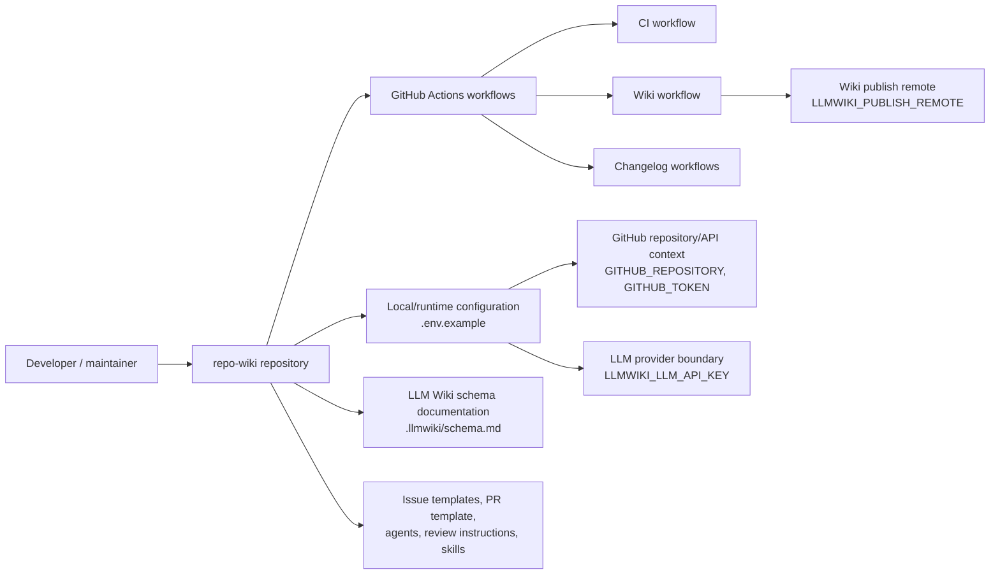
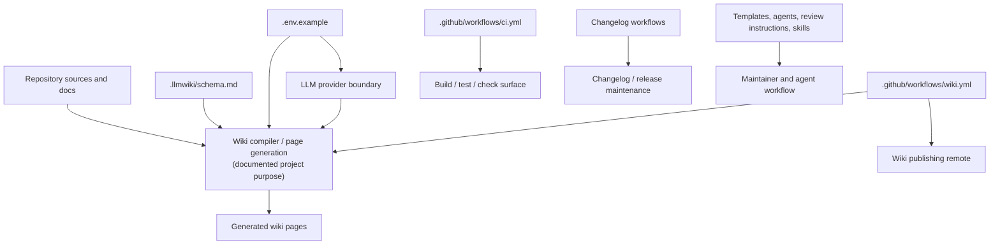
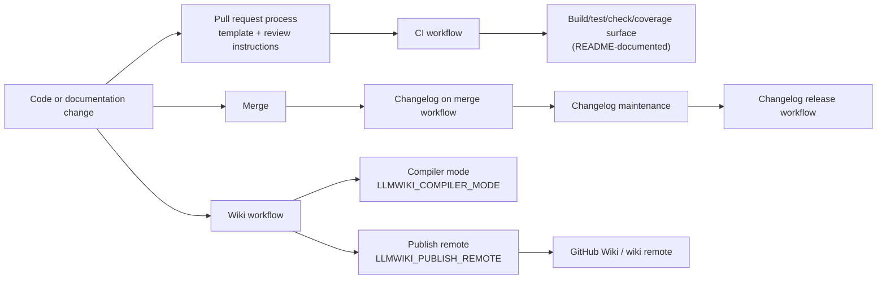

# Architecture

## Executive Architecture Summary

`repo-wiki` is documented as a tool/package for compiling repository evidence into a maintained GitHub Wiki-style knowledge base, with local CLI/package verification around compiled `dist/` output described in the README documentation card. The available source evidence for this page is mostly repository configuration, CI, issue templates, agent instructions, and wiki schema documentation rather than the TypeScript implementation itself, so architecture claims below are intentionally conservative. [README.md documentation card; `.github/workflows/ci.yml`; `.tsbuildinfo`]

The repository appears to be organized around these architectural concerns:

| Concern | Evidence | Confidence |
|---|---|---:|
| Wiki compilation/publishing workflow | A dedicated wiki workflow exists and exposes `LLMWIKI_COMPILER_MODE` and `LLMWIKI_PUBLISH_REMOTE` environment variables. | Medium; sourced from workflow metadata only. [`.github/workflows/wiki.yml`] |
| Local/CI configuration for GitHub and LLM access | `.env.example` lists `GITHUB_REPOSITORY`, `GITHUB_TOKEN`, `LLMWIKI_COMPILER_MODE`, and `LLMWIKI_LLM_API_KEY`. | Medium; variable names indicate integration points, but runtime usage is not visible in the supplied source cards. [`.env.example`] |
| CI verification | A CI workflow exists. README claims local `npm test`, `npm run check`, and `npm run coverage` operate against compiled output in `dist/`, but source cards do not include `package.json` or implementation files. | Low to medium; workflow exists, script details are documentation-card evidence. [`.github/workflows/ci.yml`; README.md documentation card] |
| Changelog automation | Two changelog workflows exist, including one that uses `GH_TOKEN`. | Medium; operational details are limited to workflow metadata. [`.github/workflows/changelog-on-merge.yml`; `.github/workflows/changelog-release.yml`] |
| Repository governance and agent-assisted development | Agent instruction files, Copilot review instructions, pull request template, issue templates, and skills exist under `.github/` and root/project-specific instruction files. | High that these files exist; low for any runtime role. [`.github/agents/coordinator.agent.md`; `.github/agents/developer.agent.md`; `.github/agents/docs.agent.md`; `.github/agents/fixer.agent.md`; `.github/agents/quality.agent.md`; `.github/agents/review.agent.md`; `.github/copilot-review-instructions.md`; `.github/pull_request_template.md`; `.github/ISSUE_TEMPLATE/config.yml`; `.github/ISSUE_TEMPLATE/epic.yml`; `.github/ISSUE_TEMPLATE/task.yml`; `AGENTS.md`; `.pi/AGENTS.md`] |
| Wiki schema/data model | A schema document exists at `.llmwiki/schema.md`; the documentation card classifies it as data-model documentation. | Medium; schema content was not fully available in the source card excerpt. [`.llmwiki/schema.md`] |

Key design decisions reflected by the available evidence are:

- The project uses GitHub-native surfaces for operation and governance: workflows, issue templates, pull request template, review instructions, and wiki publishing configuration all live under `.github/`. [`.github/workflows/wiki.yml`; `.github/workflows/ci.yml`; `.github/workflows/changelog-on-merge.yml`; `.github/workflows/changelog-release.yml`; `.github/ISSUE_TEMPLATE/config.yml`; `.github/pull_request_template.md`; `.github/copilot-review-instructions.md`]
- The project separates machine-readable/operational configuration from narrative planning and rationale: `.env.example`, workflow YAML, `.pi/settings.json`, and `.llmwiki/schema.md` are configuration/schema evidence, while `docs/PLAN.md`, `docs/WHY.md`, and `docs/plans/*` are secondary planning evidence. [`.env.example`; `.github/workflows/wiki.yml`; `.pi/settings.json`; `.llmwiki/schema.md`; docs/PLAN.md documentation card; docs/WHY.md documentation card]
- The available cards support an architecture centered on extracting repository evidence, compiling wiki pages, optionally using an LLM provider, and publishing or storing wiki output; however, the implementation modules for those steps are not included in the supplied source cards, so detailed internal dependency claims remain open. [`.env.example`; `.github/workflows/wiki.yml`; docs/plans/llm-compiler.md documentation card; docs/plans/ci-publishing.md documentation card]

## System and Repository Context

The repository boundary evidenced by the available files includes configuration, CI automation, schema/documentation assets, and human/agent collaboration instructions. The actual application source tree and package manifest are not part of the supplied source cards, so public APIs, binary entry points, and concrete imports cannot be verified from this evidence set. [`.env.example`; `.github/workflows/ci.yml`; `.github/workflows/wiki.yml`; `.llmwiki/schema.md`; `.tsbuildinfo`]

External surfaces supported by the provided evidence:

| External surface | What is evidenced | Source |
|---|---|---|
| GitHub repository API/context | `GITHUB_REPOSITORY` and `GITHUB_TOKEN` appear in `.env.example`; changelog automation also references `GH_TOKEN`. | [`.env.example`; `.github/workflows/changelog-on-merge.yml`] |
| LLM provider boundary | `.env.example` includes `LLMWIKI_LLM_API_KEY`; the LLM compiler plan says the intended production LLM boundary should be provider-agnostic and compatible with OpenAI-style chat completions. | [`.env.example`; docs/plans/llm-compiler.md documentation card] |
| Wiki publishing remote | The wiki workflow exposes `LLMWIKI_PUBLISH_REMOTE`. | [`.github/workflows/wiki.yml`] |
| GitHub Actions runtime | CI, wiki, changelog-on-merge, and changelog-release workflows exist. | [`.github/workflows/ci.yml`; `.github/workflows/wiki.yml`; `.github/workflows/changelog-on-merge.yml`; `.github/workflows/changelog-release.yml`] |
| Developer and review workflow | Issue templates, PR template, Copilot review instructions, agent instructions, and skills are present. | [`.github/ISSUE_TEMPLATE/config.yml`; `.github/ISSUE_TEMPLATE/epic.yml`; `.github/ISSUE_TEMPLATE/task.yml`; `.github/pull_request_template.md`; `.github/copilot-review-instructions.md`; `.github/agents/coordinator.agent.md`; `.github/skills/keep-a-changelog/SKILL.md`; `.github/skills/repo-wiki-navigation/SKILL.md`] |

The following context diagram is limited to repository boundaries and external surfaces directly supported by configuration and documentation cards. It does **not** assert concrete internal TypeScript module calls, because implementation source files were not included in the supplied cards.

Evidence: `.env.example`, `.github/workflows/ci.yml`, `.github/workflows/wiki.yml`, `.github/workflows/changelog-on-merge.yml`, `.github/workflows/changelog-release.yml`, `.llmwiki/schema.md`, `.github/ISSUE_TEMPLATE/*.yml`, `.github/agents/*.md`, `.github/pull_request_template.md`, `.github/copilot-review-instructions.md`, `.github/skills/*/SKILL.md`.

## Major Modules and Responsibilities

### Wiki Compiler / Knowledge Base Generation

The repository is documented as implementing an LLM Wiki pattern for software repositories, where raw sources remain immutable and the wiki becomes a persistent generated artifact. This is a documentation-card claim, not directly verified against implementation source in the supplied cards. [docs/PLAN.md documentation card; docs/WHY.md documentation card]

Likely responsibilities, based on available evidence:

- Consume repository source and documentation evidence to produce wiki pages. [docs/PLAN.md documentation card; `.llmwiki/schema.md`]
- Support a compiler mode controlled by `LLMWIKI_COMPILER_MODE`. [`.env.example`; `.github/workflows/wiki.yml`]
- Use schema expectations documented under `.llmwiki/schema.md`. [`.llmwiki/schema.md`]

Confidence: **low to medium**, because the supplied evidence includes schema/configuration and plans but not compiler implementation files.

### LLM Provider Boundary

The repository exposes `LLMWIKI_LLM_API_KEY` in `.env.example`, and the LLM compiler plan states an intended provider-agnostic boundary compatible with OpenAI-style chat completions. [`.env.example`; docs/plans/llm-compiler.md documentation card]

Likely responsibilities:

- Allow local or CI runs to access an LLM provider via API key configuration. [`.env.example`]
- Keep provider coupling abstract or configurable according to the documented plan. [docs/plans/llm-compiler.md documentation card]

Confidence: **low**, because provider clients/imports are not present in the supplied source cards.

### GitHub Wiki Publishing / CI Publishing

A dedicated `.github/workflows/wiki.yml` workflow exists and exposes `LLMWIKI_COMPILER_MODE` and `LLMWIKI_PUBLISH_REMOTE`, indicating an operational path for wiki generation and/or publishing in GitHub Actions. [`.github/workflows/wiki.yml`]

The CI publishing plan describes a flow involving tests and fetching existing wiki state, but it is secondary documentation and only partially validated. [docs/plans/ci-publishing.md documentation card]

Likely responsibilities:

- Run wiki compilation in CI. [`.github/workflows/wiki.yml`]
- Configure whether and where generated wiki content is published. [`.github/workflows/wiki.yml`]
- Potentially interact with existing wiki state as described by planning documentation. [docs/plans/ci-publishing.md documentation card]

Confidence: **medium** for workflow existence and environment knobs; **low** for exact publish algorithm.

### Search and Query Index

The search-index plan describes building a local search index over generated wiki pages, source cards, and documentation cards so `repo-wiki search` and `repo-wiki query` can route questions efficiently without external services. This is planning documentation, not implementation evidence in the supplied cards. [docs/plans/search-index.md documentation card]

Likely responsibilities:

- Index generated wiki pages and cards. [docs/plans/search-index.md documentation card]
- Support search/query CLI commands. [docs/plans/search-index.md documentation card]

Confidence: **low**, because no implementation or CLI entry point source was supplied.

### Incremental Mode

The incremental-mode plan is marked stale in the supplied documentation cards. Any architecture claims from it should be treated as historical or unresolved unless verified against source. [docs/plans/incremental-mode.md documentation card]

Likely status:

- Incremental compilation may have been planned, but the provided evidence does not validate current behavior. [docs/plans/incremental-mode.md documentation card]

Confidence: **low**.

### CI and Quality Automation

A CI workflow exists, and README documentation claims `npm test`, `npm run check`, and `npm run coverage` require successful TypeScript compilation to `dist/`. The `.tsbuildinfo` file also indicates a TypeScript build artifact exists in the repository snapshot. [`.github/workflows/ci.yml`; `.tsbuildinfo`; README.md documentation card]

Likely responsibilities:

- Run project checks in GitHub Actions. [`.github/workflows/ci.yml`]
- Validate compiled TypeScript/package output before tests/checks, according to README documentation. [README.md documentation card]
- Provide coverage checks, according to README documentation. [README.md documentation card]

Confidence: **medium** for CI existence and TypeScript build artifact; **low to medium** for script details because `package.json` is not included in the supplied cards.

### Changelog Automation

Two changelog workflows exist: `changelog-on-merge.yml` and `changelog-release.yml`. The merge workflow references `GH_TOKEN`, indicating GitHub-authenticated automation. [`.github/workflows/changelog-on-merge.yml`; `.github/workflows/changelog-release.yml`]

A keep-a-changelog skill exists under `.github/skills/keep-a-changelog/SKILL.md`, suggesting a repository convention for changelog maintenance. [`.github/skills/keep-a-changelog/SKILL.md`]

Confidence: **medium** for workflow and skill existence; **low** for exact changelog mutation behavior.

### Governance, Review, and Agent Instructions

The repository includes structured issue templates for epics and tasks, issue-template configuration, a pull request template, Copilot review instructions, multiple agent role documents, and navigation/changelog skills. [`.github/ISSUE_TEMPLATE/config.yml`; `.github/ISSUE_TEMPLATE/epic.yml`; `.github/ISSUE_TEMPLATE/task.yml`; `.github/pull_request_template.md`; `.github/copilot-review-instructions.md`; `.github/agents/coordinator.agent.md`; `.github/agents/developer.agent.md`; `.github/agents/docs.agent.md`; `.github/agents/fixer.agent.md`; `.github/agents/quality.agent.md`; `.github/agents/review.agent.md`; `.github/skills/keep-a-changelog/SKILL.md`; `.github/skills/repo-wiki-navigation/SKILL.md`; `AGENTS.md`; `.pi/AGENTS.md`]

Likely responsibilities:

- Standardize issue intake and planning. [`.github/ISSUE_TEMPLATE/epic.yml`; `.github/ISSUE_TEMPLATE/task.yml`]
- Standardize review and PR expectations. [`.github/pull_request_template.md`; `.github/copilot-review-instructions.md`]
- Guide human/AI agent roles in repository maintenance. [`.github/agents/*.md`; `AGENTS.md`; `.pi/AGENTS.md`]
- Support wiki navigation and changelog conventions via skills. [`.github/skills/repo-wiki-navigation/SKILL.md`; `.github/skills/keep-a-changelog/SKILL.md`]

Confidence: **high** for file existence; **medium** for intended governance role.

### Component Diagram

This component diagram is inferred from repository structure, workflow names, environment variables, and documentation-card plans. It should be read as a high-level map of evidenced concerns, not as a verified import graph.

Evidence: `.env.example`, `.github/workflows/wiki.yml`, `.github/workflows/ci.yml`, `.github/workflows/changelog-on-merge.yml`, `.github/workflows/changelog-release.yml`, `.llmwiki/schema.md`, `.github/ISSUE_TEMPLATE/*.yml`, `.github/agents/*.md`, `.github/skills/*/SKILL.md`, README.md documentation card, docs/PLAN.md documentation card.

## Runtime, Data, and Control-Flow Relationships

The supplied source cards do not include application implementation files, import graphs, package scripts, or command definitions. Therefore, runtime control flow can only be described at the boundary/configuration level. [`.env.example`; `.github/workflows/wiki.yml`; `.github/workflows/ci.yml`; `.tsbuildinfo`]

Supported runtime/control-flow observations:

1. **Configuration is environment-variable driven at key boundaries.** `.env.example` lists `GITHUB_REPOSITORY`, `GITHUB_TOKEN`, `LLMWIKI_COMPILER_MODE`, and `LLMWIKI_LLM_API_KEY`; the wiki workflow references `LLMWIKI_COMPILER_MODE` and `LLMWIKI_PUBLISH_REMOTE`; the changelog-on-merge workflow references `GH_TOKEN`. [`.env.example`; `.github/workflows/wiki.yml`; `.github/workflows/changelog-on-merge.yml`]

2. **GitHub Actions provide background automation.** The workflow cards are classified with `background-work` runtime hints, indicating repository automation occurs outside an interactive local process. [`.github/workflows/ci.yml`; `.github/workflows/wiki.yml`; `.github/workflows/changelog-on-merge.yml`; `.github/workflows/changelog-release.yml`]

3. **Wiki compilation likely consumes source/documentation evidence and emits wiki pages.** This follows from the documented product vision and schema/data-model evidence, but the exact in-process data structures and algorithms are not visible in the supplied source cards. [docs/PLAN.md documentation card; `.llmwiki/schema.md`]

4. **LLM access is externally configured, not embedded.** The presence of `LLMWIKI_LLM_API_KEY` in `.env.example` supports the existence of an LLM integration boundary; no hard-coded provider details or secrets are present in the supplied cards. [`.env.example`]

5. **Publishing is separately configurable from compilation mode.** `LLMWIKI_COMPILER_MODE` appears in both `.env.example` and the wiki workflow, while `LLMWIKI_PUBLISH_REMOTE` appears in the wiki workflow. This suggests compilation mode and publish destination are independent operational knobs. [`.env.example`; `.github/workflows/wiki.yml`]

No verified sequence diagram is included because the source cards do not expose concrete call sequences, function names, command invocations, or import relationships.

## Build, Test, Deployment, and Operational Surfaces

The repository has multiple GitHub Actions workflows that define operational surfaces: CI, wiki, changelog-on-merge, and changelog-release. [`.github/workflows/ci.yml`; `.github/workflows/wiki.yml`; `.github/workflows/changelog-on-merge.yml`; `.github/workflows/changelog-release.yml`]

README documentation claims local development and package verification use compiled output in `dist/`, and that `npm test`, `npm run check`, and `npm run coverage` require a successful TypeScript compilation. This is plausible given the `.tsbuildinfo` artifact, but cannot be fully validated without `package.json`, workflow job bodies, or source files in the supplied cards. [README.md documentation card; `.tsbuildinfo`; `.github/workflows/ci.yml`]

Operational surfaces:

| Surface | Purpose indicated by evidence | Evidence | Claim status |
|---|---|---|---|
| `ci.yml` | General CI verification. | [`.github/workflows/ci.yml`] | Workflow existence validated; steps not detailed in supplied excerpt. |
| `wiki.yml` | Wiki compile/publish workflow; uses `LLMWIKI_COMPILER_MODE` and `LLMWIKI_PUBLISH_REMOTE`. | [`.github/workflows/wiki.yml`] | Workflow existence and env names validated; exact commands not visible. |
| `changelog-on-merge.yml` | Changelog automation after merge; uses `GH_TOKEN`. | [`.github/workflows/changelog-on-merge.yml`] | Workflow existence and env name validated; exact behavior not visible. |
| `changelog-release.yml` | Release-time changelog automation. | [`.github/workflows/changelog-release.yml`] | Workflow existence validated; exact behavior not visible. |
| Local `.env.example` | Documents local/runtime environment variables. | [`.env.example`] | Variable names validated; values intentionally omitted. |
| Issue and PR templates | Standardize contribution workflow. | [`.github/ISSUE_TEMPLATE/config.yml`; `.github/ISSUE_TEMPLATE/epic.yml`; `.github/ISSUE_TEMPLATE/task.yml`; `.github/pull_request_template.md`] | File existence validated. |

The following build/test/deploy flow is based on workflow presence, environment variables, and README documentation-card claims. It is not a verified job-step graph.

Evidence: `.github/workflows/ci.yml`, `.github/workflows/wiki.yml`, `.github/workflows/changelog-on-merge.yml`, `.github/workflows/changelog-release.yml`, `.github/pull_request_template.md`, `.github/copilot-review-instructions.md`, `.env.example`, README.md documentation card.

## Cross-Cutting Concerns

### Configuration

Configuration is primarily evidenced through environment variables:

| Variable | Evidence | Likely role |
|---|---|---|
| `GITHUB_REPOSITORY` | [`.env.example`] | Identifies the GitHub repository context. |
| `GITHUB_TOKEN` | [`.env.example`] | Authenticates GitHub operations for local/runtime use. |
| `GH_TOKEN` | [`.github/workflows/changelog-on-merge.yml`] | Authenticates GitHub CLI/API operations in changelog automation. |
| `LLMWIKI_COMPILER_MODE` | [`.env.example`; `.github/workflows/wiki.yml`] | Selects compiler mode for local or workflow execution. |
| `LLMWIKI_LLM_API_KEY` | [`.env.example`] | Provides LLM provider authentication. |
| `LLMWIKI_PUBLISH_REMOTE` | [`.github/workflows/wiki.yml`] | Configures wiki publish remote in CI. |

No environment variable values are included here, and no secrets were copied. [`.env.example`; `.github/workflows/wiki.yml`; `.github/workflows/changelog-on-merge.yml`]

### Security and Secret Handling

The repository’s external integration points require credentials for GitHub and LLM access, as indicated by `GITHUB_TOKEN`, `GH_TOKEN`, and `LLMWIKI_LLM_API_KEY`. These should be treated as secrets in local `.env` files and GitHub Actions secret contexts. [`.env.example`; `.github/workflows/changelog-on-merge.yml`]

The supplied cards do not include secret-scanning configuration, permissions blocks, or implementation code that would allow deeper validation of least-privilege behavior. [`.github/workflows/ci.yml`; `.github/workflows/wiki.yml`; `.github/workflows/changelog-on-merge.yml`; `.github/workflows/changelog-release.yml`]

### APIs and External Dependencies

The available evidence supports three external boundaries:

- GitHub repository/API boundary via GitHub tokens and repository identifiers. [`.env.example`; `.github/workflows/changelog-on-merge.yml`]
- LLM provider boundary via `LLMWIKI_LLM_API_KEY` and LLM compiler planning documentation. [`.env.example`; docs/plans/llm-compiler.md documentation card]
- Wiki remote publishing boundary via `LLMWIKI_PUBLISH_REMOTE`. [`.github/workflows/wiki.yml`]

No concrete npm dependencies, HTTP clients, SDKs, or provider packages can be verified from the supplied source cards.

### Data Models and Schema

`.llmwiki/schema.md` is categorized as data-model documentation and is the main source-card evidence for the wiki/schema model. The implementation’s schema enforcement, validation mechanism, and generated artifact format cannot be verified from the excerpt alone. [`.llmwiki/schema.md`]

Documentation cards describe source cards, documentation cards, generated wiki pages, and search index concepts, but these remain secondary evidence without implementation files in the supplied card set. [docs/PLAN.md documentation card; docs/plans/search-index.md documentation card]

### Documentation Trust and Repository Policy

This page treats source/configuration files as stronger evidence than planning documentation. The supplied documentation cards have mixed statuses: several are `partially_validated`, and the incremental-mode plan is explicitly `stale`. [docs/PLAN.md documentation card; docs/plans/ci-publishing.md documentation card; docs/plans/github-action.md documentation card; docs/plans/incremental-mode.md documentation card; docs/plans/llm-compiler.md documentation card; docs/plans/search-index.md documentation card]

The repository contains explicit collaboration instructions and review assets, including root and project-specific agent guidance, role-specific `.github/agents` files, Copilot review instructions, issue templates, and PR templates. [AGENTS.md; `.pi/AGENTS.md`; `.github/agents/coordinator.agent.md`; `.github/agents/developer.agent.md`; `.github/agents/docs.agent.md`; `.github/agents/fixer.agent.md`; `.github/agents/quality.agent.md`; `.github/agents/review.agent.md`; `.github/copilot-review-instructions.md`; `.github/pull_request_template.md`; `.github/ISSUE_TEMPLATE/config.yml`; `.github/ISSUE_TEMPLATE/epic.yml`; `.github/ISSUE_TEMPLATE/task.yml`]

### Generated and Ignored Artifacts

`.tsbuildinfo` indicates TypeScript incremental build metadata exists in the repository snapshot, and `.gitignore` exists to define ignored files, though the supplied excerpts do not show its patterns. [`.tsbuildinfo`; `.gitignore`]

Because `.tsbuildinfo` is a build artifact rather than source architecture, it is only weak evidence of TypeScript compilation and should not be used to infer implementation structure. [`.tsbuildinfo`]

## Caveats and Open Questions

- **Implementation source files were not included in the supplied source cards.** This page cannot validate internal TypeScript modules, imports, exported APIs, CLI binaries, command handlers, or class/function responsibilities. [`.tsbuildinfo`; README.md documentation card]
- **`package.json` was not included.** Package scripts, bin entries, dependencies, module type, and publish metadata cannot be verified directly. README claims about `npm test`, `npm run check`, `npm run coverage`, and compiled `dist/` output remain partially validated documentation claims. [README.md documentation card]
- **Workflow job bodies are not present in the excerpts.** The existence of workflows and some environment variables is supported, but exact triggers, permissions, commands, artifacts, and publish steps are not validated here. [`.github/workflows/ci.yml`; `.github/workflows/wiki.yml`; `.github/workflows/changelog-on-merge.yml`; `.github/workflows/changelog-release.yml`]
- **The component and build/deploy diagrams are inferred from repository structure and workflow/configuration surfaces.** They do not represent verified runtime call graphs or exact GitHub Actions job graphs. [`.env.example`; `.github/workflows/wiki.yml`; `.github/workflows/ci.yml`; `.github/workflows/changelog-on-merge.yml`; `.github/workflows/changelog-release.yml`]
- **Incremental mode is documented by a stale plan.** No current behavior should be assumed from `docs/plans/incremental-mode.md` without source validation. [docs/plans/incremental-mode.md documentation card]
- **Search/query architecture is plan-level evidence only.** The search-index plan describes `repo-wiki search` and `repo-wiki query`, but no CLI implementation or package entry point was supplied. [docs/plans/search-index.md documentation card]
- **LLM provider abstraction is not implementation-verified.** `LLMWIKI_LLM_API_KEY` and the LLM compiler plan support an LLM integration boundary, but no provider adapter code was provided. [`.env.example`; docs/plans/llm-compiler.md documentation card]
- **Wiki publishing behavior is not implementation-verified.** `LLMWIKI_PUBLISH_REMOTE` indicates a publish destination/configuration knob, but the actual publishing protocol and safety checks are unknown from the supplied cards. [`.github/workflows/wiki.yml`]
- **Schema details are not available in the excerpt.** `.llmwiki/schema.md` is identified as data-model documentation, but concrete fields, validation rules, and compatibility constraints need direct review. [`.llmwiki/schema.md`]
- **Security posture is under-specified in the available evidence.** Credential variables are present, but permissions, secret storage expectations, redaction behavior, and token scopes are not validated. [`.env.example`; `.github/workflows/changelog-on-merge.yml`; `.github/workflows/wiki.yml`]

<!-- HUMAN_NOTES_START -->
<!-- HUMAN_NOTES_END -->
