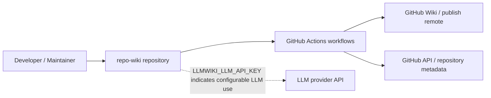
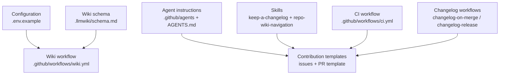
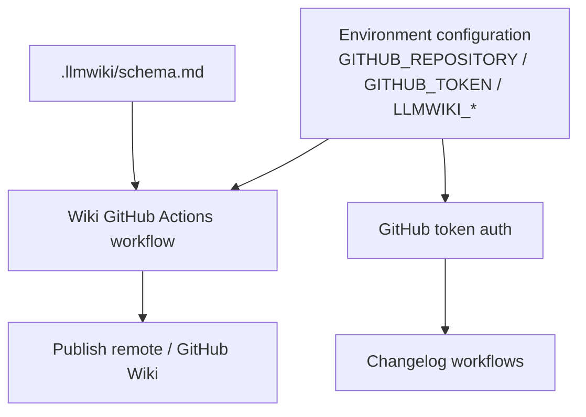
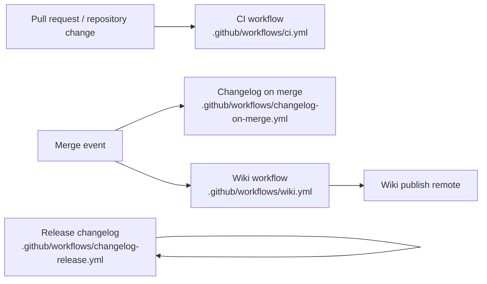

# Architecture

## Executive Architecture Summary

`repo-wiki` is documented as a tool for compiling repository knowledge into a maintained GitHub Wiki-style knowledge base. The available evidence for this page is primarily repository configuration, CI workflows, agent/skill instructions, environment configuration examples, and secondary documentation cards; no authoritative application source files were included in the provided source-card set. The architecture below is therefore conservative and focuses on verified repository surfaces rather than internal implementation details. Sources: `.env.example`, `.github/workflows/wiki.yml`, `.github/workflows/ci.yml`, `.llmwiki/schema.md`, `README.md` documentation card, `docs/PLAN.md` documentation card.

At the repository level, the visible architecture consists of these major subsystems:

| Subsystem | Responsibility | Evidence |
|---|---|---|
| Wiki compiler/runtime configuration | Environment variables identify repository selection, GitHub access, compiler mode, and LLM API access. | `.env.example` |
| GitHub Actions automation | CI, wiki generation/publishing, changelog-on-merge, and release changelog workflows. | `.github/workflows/ci.yml`, `.github/workflows/wiki.yml`, `.github/workflows/changelog-on-merge.yml`, `.github/workflows/changelog-release.yml` |
| LLM Wiki schema/documentation model | A `.llmwiki` schema document defines or documents the expected wiki knowledge model. | `.llmwiki/schema.md` |
| Human/agent workflow guidance | Agent instruction files define role-specific development, documentation, review, fixing, quality, and coordination behavior. | `.github/agents/*.agent.md`, `AGENTS.md`, `.pi/AGENTS.md` |
| Repository contribution surfaces | Issue templates, PR template, review instructions, and skills files guide repository maintenance and changelog/wiki navigation practices. | `.github/ISSUE_TEMPLATE/*.yml`, `.github/pull_request_template.md`, `.github/copilot-review-instructions.md`, `.github/skills/*/SKILL.md` |

Key design decisions visible from configuration and documentation cards:

- The project has a GitHub-oriented operating model: workflows exist for CI, wiki automation, changelog generation on merge, and release changelog handling. Sources: `.github/workflows/ci.yml`, `.github/workflows/wiki.yml`, `.github/workflows/changelog-on-merge.yml`, `.github/workflows/changelog-release.yml`.
- Wiki compilation/publishing is configurable through environment variables, including `LLMWIKI_COMPILER_MODE` and `LLMWIKI_PUBLISH_REMOTE`. Sources: `.env.example`, `.github/workflows/wiki.yml`.
- Runtime usage appears to involve GitHub repository identity and authentication, with `GITHUB_REPOSITORY`, `GITHUB_TOKEN`, and `GH_TOKEN` referenced in environment/workflow configuration. Sources: `.env.example`, `.github/workflows/changelog-on-merge.yml`.
- LLM-backed compilation is indicated by `LLMWIKI_LLM_API_KEY` in the example environment and by the LLM compiler plan documentation card, but provider/runtime implementation details are not present in the provided source cards. Sources: `.env.example`, `docs/plans/llm-compiler.md` documentation card.
- The project appears to intentionally support agent-assisted maintenance through checked-in agent instructions and skills. Sources: `.github/agents/coordinator.agent.md`, `.github/agents/developer.agent.md`, `.github/agents/docs.agent.md`, `.github/agents/fixer.agent.md`, `.github/agents/quality.agent.md`, `.github/agents/review.agent.md`, `.github/skills/keep-a-changelog/SKILL.md`, `.github/skills/repo-wiki-navigation/SKILL.md`.

## System and Repository Context

The repository boundary visible from the provided evidence contains configuration and automation for a GitHub-hosted project that compiles or publishes a wiki. External surfaces include GitHub itself, GitHub Actions, repository/wiki remotes, and an LLM API configured by environment variable. Sources: `.env.example`, `.github/workflows/wiki.yml`, `.github/workflows/changelog-on-merge.yml`, `.github/workflows/changelog-release.yml`, `docs/plans/github-action.md` documentation card, `docs/plans/llm-compiler.md` documentation card.

The current source-card set does **not** include package metadata or implementation files that would prove concrete runtime entry points, exported APIs, internal packages, or CLI command wiring. The README documentation card mentions commands such as `npx repo-wiki init --repo . --write-agents` and `npx repo-wiki run`, but those commands are secondary evidence in this compilation because no matching package manifest or source implementation card was provided. Source: `README.md` documentation card.

Diagram evidence and limitations: GitHub Actions workflows are directly present, and wiki publishing configuration is indicated by `LLMWIKI_PUBLISH_REMOTE` in `.github/workflows/wiki.yml`. GitHub authentication variables are indicated by `.env.example` and `.github/workflows/changelog-on-merge.yml`. The LLM provider relationship is inferred from the `LLMWIKI_LLM_API_KEY` variable and the LLM compiler documentation card, not from implementation source. Sources: `.github/workflows/wiki.yml`, `.github/workflows/changelog-on-merge.yml`, `.env.example`, `docs/plans/llm-compiler.md` documentation card.

## Major Modules and Responsibilities

### Wiki Compiler and Wiki Publishing Configuration

The wiki-oriented automation surface is represented by `.github/workflows/wiki.yml`. The workflow references `LLMWIKI_COMPILER_MODE` and `LLMWIKI_PUBLISH_REMOTE`, indicating that wiki compilation mode and publish target are operationally configurable. Sources: `.github/workflows/wiki.yml`.

The example environment file lists `GITHUB_REPOSITORY`, `GITHUB_TOKEN`, `LLMWIKI_COMPILER_MODE`, and `LLMWIKI_LLM_API_KEY`, indicating that local or operational runs are expected to know the target GitHub repository, authenticate to GitHub, choose a compiler mode, and optionally use an LLM API key. Source: `.env.example`.

Secondary documentation describes a default workflow that writes wiki output and references local bootstrap commands, but these claims are only partially validated by the provided source-card set. Source: `README.md` documentation card.

### CI and Quality Automation

The repository contains a CI workflow at `.github/workflows/ci.yml`. Because the workflow file itself is present in the source cards, the existence of a CI surface is authoritative; however, the exact steps, test commands, Node versions, and package manager behavior cannot be reconstructed from the excerpt alone. Source: `.github/workflows/ci.yml`.

Quality expectations are also represented by role/instruction files such as `.github/agents/quality.agent.md`, `.github/agents/review.agent.md`, `.github/copilot-review-instructions.md`, and `.github/pull_request_template.md`. These files are documentation/instruction surfaces rather than executable guarantees. Sources: `.github/agents/quality.agent.md`, `.github/agents/review.agent.md`, `.github/copilot-review-instructions.md`, `.github/pull_request_template.md`.

### Changelog and Release Automation

Two workflow files define changelog-related automation: `.github/workflows/changelog-on-merge.yml` and `.github/workflows/changelog-release.yml`. The on-merge workflow references `GH_TOKEN`, indicating that at least one changelog automation path requires GitHub authentication in the workflow environment. Sources: `.github/workflows/changelog-on-merge.yml`, `.github/workflows/changelog-release.yml`.

The repository also includes a keep-a-changelog skill file, suggesting that changelog maintenance is a documented operational practice. Source: `.github/skills/keep-a-changelog/SKILL.md`.

### LLM Wiki Schema and Knowledge Model

The `.llmwiki/schema.md` file is a documented schema/data-model surface for the wiki compiler output or knowledge base model. The documentation card for `docs/PLAN.md` describes the intended product pattern: raw sources remain immutable, the wiki becomes a persistent compounding artifact, and a schema tells the LLM how to read/write it. Because that statement comes from documentation rather than implementation source, it should be treated as design intent unless validated by source code. Sources: `.llmwiki/schema.md`, `docs/PLAN.md` documentation card.

### Agent and Skill Instructions

The repository includes several agent instruction files:

| Agent/Skill file | Apparent role | Evidence |
|---|---|---|
| `.github/agents/coordinator.agent.md` | Coordination/background work guidance | `.github/agents/coordinator.agent.md` |
| `.github/agents/developer.agent.md` | Development guidance | `.github/agents/developer.agent.md` |
| `.github/agents/docs.agent.md` | Documentation guidance | `.github/agents/docs.agent.md` |
| `.github/agents/fixer.agent.md` | Fix/repair guidance | `.github/agents/fixer.agent.md` |
| `.github/agents/quality.agent.md` | Quality guidance | `.github/agents/quality.agent.md` |
| `.github/agents/review.agent.md` | Review guidance | `.github/agents/review.agent.md` |
| `.github/skills/keep-a-changelog/SKILL.md` | Changelog maintenance skill | `.github/skills/keep-a-changelog/SKILL.md` |
| `.github/skills/repo-wiki-navigation/SKILL.md` | Wiki navigation skill | `.github/skills/repo-wiki-navigation/SKILL.md` |

These files are part of the repository’s socio-technical architecture: they standardize how human and AI contributors should interact with the project, but they do not by themselves prove runtime behavior. Sources: `.github/agents/*.agent.md`, `.github/skills/*/SKILL.md`.

### Contribution and Planning Surfaces

Issue templates and PR templates structure incoming work. The source-card set includes issue template configuration plus separate epic and task issue forms. Sources: `.github/ISSUE_TEMPLATE/config.yml`, `.github/ISSUE_TEMPLATE/epic.yml`, `.github/ISSUE_TEMPLATE/task.yml`, `.github/pull_request_template.md`.

Planning documentation cards describe epics for CI publishing, GitHub Action support, incremental mode, and LLM compiler work. These cards are useful for intended architecture but are not equivalent to implementation evidence. Sources: `docs/plans/ci-publishing.md` documentation card, `docs/plans/github-action.md` documentation card, `docs/plans/incremental-mode.md` documentation card, `docs/plans/llm-compiler.md` documentation card.

Diagram evidence and limitations: this component diagram is based on repository structure and the thematic responsibilities of files, not on import graphs or implementation calls. It should be read as a repository-organization diagram rather than a verified runtime dependency graph. Sources: `.env.example`, `.llmwiki/schema.md`, `.github/workflows/wiki.yml`, `.github/workflows/ci.yml`, `.github/workflows/changelog-on-merge.yml`, `.github/workflows/changelog-release.yml`, `.github/agents/*.agent.md`, `.github/skills/*/SKILL.md`, `.github/ISSUE_TEMPLATE/*.yml`, `.github/pull_request_template.md`.

## Runtime, Data, and Control-Flow Relationships

The available evidence supports only a high-level runtime/control-flow view:

1. A maintainer or CI environment provides repository and authentication configuration, including `GITHUB_REPOSITORY`, `GITHUB_TOKEN`, `LLMWIKI_COMPILER_MODE`, and, where LLM-backed compilation is used, `LLMWIKI_LLM_API_KEY`. Source: `.env.example`.
2. The wiki workflow runs in GitHub Actions and uses wiki-specific configuration, including `LLMWIKI_COMPILER_MODE` and `LLMWIKI_PUBLISH_REMOTE`. Source: `.github/workflows/wiki.yml`.
3. Changelog automation runs through dedicated workflows; the on-merge workflow references `GH_TOKEN`. Source: `.github/workflows/changelog-on-merge.yml`.
4. CI is represented by `.github/workflows/ci.yml`, but detailed command sequencing is not available from the provided excerpt. Source: `.github/workflows/ci.yml`.
5. The schema file under `.llmwiki/schema.md` is the visible data-model contract for wiki content. Source: `.llmwiki/schema.md`.

Diagram evidence and limitations: environment variables and workflow presence are verified by source cards. The exact internal compiler call path, package entry point, and data transformation sequence are not present in the supplied source cards, so they are intentionally omitted. Sources: `.env.example`, `.github/workflows/wiki.yml`, `.github/workflows/changelog-on-merge.yml`, `.github/workflows/changelog-release.yml`, `.llmwiki/schema.md`.

No import graph, class/module graph, or function-level runtime dependency chain was available in the provided source cards. Therefore, this page does not assert specific implementation modules, function names, API clients, prompt orchestration layers, parser modules, or filesystem output paths beyond what is visible from configuration and documentation cards. Sources: `.tsbuildinfo`, `.gitignore`, `.env.example`, `.github/workflows/*.yml`.

## Build, Test, Deployment, and Operational Surfaces

The repository has multiple GitHub Actions workflow surfaces:

| Workflow | Architectural role | Operational evidence |
|---|---|---|
| `.github/workflows/ci.yml` | CI/test/quality automation surface | Workflow file exists in source cards. |
| `.github/workflows/wiki.yml` | Wiki compilation and/or publishing automation surface | Workflow references `LLMWIKI_COMPILER_MODE` and `LLMWIKI_PUBLISH_REMOTE`. |
| `.github/workflows/changelog-on-merge.yml` | Changelog automation on merge | Workflow references `GH_TOKEN`. |
| `.github/workflows/changelog-release.yml` | Release changelog automation | Workflow file exists in source cards. |

Sources: `.github/workflows/ci.yml`, `.github/workflows/wiki.yml`, `.github/workflows/changelog-on-merge.yml`, `.github/workflows/changelog-release.yml`.

The README documentation card references local commands including `npm install`, `npx repo-wiki init --repo . --write-agents`, and `npx repo-wiki run`. Because package metadata and executable source files were not included in the provided source cards, those commands are best treated as documented operational intent rather than fully validated architecture. Source: `README.md` documentation card.

Diagram evidence and limitations: workflow files exist, but trigger events and exact job dependencies are not visible in the supplied excerpts. The arrows express likely operational grouping from workflow names and available runtime hints, not a fully verified Actions dependency graph. Sources: `.github/workflows/ci.yml`, `.github/workflows/wiki.yml`, `.github/workflows/changelog-on-merge.yml`, `.github/workflows/changelog-release.yml`.

Other operational/configuration files:

- `.env.example` documents expected environment variable names without exposing secret values. Source: `.env.example`.
- `.gitignore` is present and likely participates in keeping generated files, dependencies, and secrets out of version control, but specific ignore patterns are not available from the excerpt. Source: `.gitignore`.
- `.tsbuildinfo` is present, which indicates TypeScript incremental build metadata may exist in the repository snapshot, but no TypeScript source files or `tsconfig`/package metadata were included in the source-card set. Source: `.tsbuildinfo`.
- `.pi/settings.json` and `.pi/AGENTS.md` indicate additional local/project agent configuration surfaces. Sources: `.pi/settings.json`, `.pi/AGENTS.md`.

## Cross-Cutting Concerns

### Configuration

The repository exposes configuration through environment variables. The variables visible in `.env.example` are:

| Variable | Inferred purpose | Evidence |
|---|---|---|
| `GITHUB_REPOSITORY` | Identifies the target GitHub repository. | `.env.example` |
| `GITHUB_TOKEN` | Authenticates GitHub operations. | `.env.example` |
| `LLMWIKI_COMPILER_MODE` | Selects compiler behavior/mode. | `.env.example`, `.github/workflows/wiki.yml` |
| `LLMWIKI_LLM_API_KEY` | Supplies an LLM API key for LLM-backed compilation. | `.env.example` |
| `LLMWIKI_PUBLISH_REMOTE` | Configures wiki publish remote in CI. | `.github/workflows/wiki.yml` |
| `GH_TOKEN` | Authenticates changelog automation in GitHub workflow context. | `.github/workflows/changelog-on-merge.yml` |

No secret values should be copied into the wiki; only variable names are documented here. Sources: `.env.example`, `.github/workflows/wiki.yml`, `.github/workflows/changelog-on-merge.yml`.

### Security and Credentials

The architecture relies on GitHub and LLM-related credentials being supplied via environment variables or workflow secrets. The provided evidence includes variable names but no values. This page intentionally does not reproduce any secret values. Sources: `.env.example`, `.github/workflows/wiki.yml`, `.github/workflows/changelog-on-merge.yml`.

Security-sensitive open points include the scopes required for `GITHUB_TOKEN`/`GH_TOKEN`, whether `LLMWIKI_LLM_API_KEY` is optional in all modes, and how publish credentials are restricted. Those details are not available in the provided source-card excerpts. Sources: `.env.example`, `.github/workflows/wiki.yml`, `.github/workflows/changelog-on-merge.yml`.

### APIs and External Services

Verified external surfaces include GitHub repository/workflow integration and a configurable publish remote for the wiki workflow. Sources: `.github/workflows/wiki.yml`, `.github/workflows/changelog-on-merge.yml`.

An LLM provider API is indicated by `LLMWIKI_LLM_API_KEY` and by the LLM compiler plan documentation card, which says the intended boundary should be provider-agnostic and compatible with OpenAI-style chat completions. This is design/plan evidence, not implementation proof in the provided source-card set. Sources: `.env.example`, `docs/plans/llm-compiler.md` documentation card.

### Data Model

`.llmwiki/schema.md` is the primary visible data-model/schema document. Documentation cards describe the wiki as a persistent compounding artifact governed by schema, but the implementation that enforces the schema is not included in the provided source cards. Sources: `.llmwiki/schema.md`, `docs/PLAN.md` documentation card.

### Documentation Trust Model

For this architecture page:

- Workflow files and environment examples are treated as higher-authority evidence for operational surfaces. Sources: `.github/workflows/*.yml`, `.env.example`.
- Agent files, skills, plans, README, and other Markdown documentation are treated as intent and contributor workflow evidence. Sources: `.github/agents/*.agent.md`, `.github/skills/*/SKILL.md`, `README.md` documentation card, `docs/PLAN.md` documentation card, `docs/WHY.md` documentation card.
- The stale status of `docs/plans/incremental-mode.md` means incremental-mode architecture should not be presented as current behavior without implementation evidence. Source: `docs/plans/incremental-mode.md` documentation card.

### Contribution Workflow

The repository has structured contribution surfaces through issue templates, a PR template, Copilot review instructions, and agent guidance. These surfaces help maintain consistency in planning, review, documentation, and quality workflows. Sources: `.github/ISSUE_TEMPLATE/config.yml`, `.github/ISSUE_TEMPLATE/epic.yml`, `.github/ISSUE_TEMPLATE/task.yml`, `.github/pull_request_template.md`, `.github/copilot-review-instructions.md`, `.github/agents/*.agent.md`.

## Caveats and Open Questions

### Caveats

- No application source files, package manifest, CLI entry-point files, or import graph were included in the provided source-card set. As a result, this architecture page cannot validate concrete internal modules, exported APIs, class/function names, or package scripts. Sources: provided source-card inventory, `.tsbuildinfo`.
- README command claims such as `npx repo-wiki init --repo . --write-agents`, `npx repo-wiki run`, and `npm install` are from a partially validated documentation card and are not confirmed here by package/source files. Source: `README.md` documentation card.
- The diagrams in this page are supported by repository structure, workflow file presence, and environment variable evidence, but they are not verified runtime call graphs. Sources: `.github/workflows/*.yml`, `.env.example`, `.llmwiki/schema.md`.
- The LLM integration boundary is indicated by environment variable and planning documentation, but implementation details such as provider abstraction, request/response schemas, retry policy, and error handling are not visible in the provided source cards. Sources: `.env.example`, `docs/plans/llm-compiler.md` documentation card.
- Incremental mode is mentioned in a stale documentation card and should not be considered current architecture without fresh implementation evidence. Source: `docs/plans/incremental-mode.md` documentation card.
- The exact CI workflow triggers, job matrices, cache strategy, and commands are not available from the source-card excerpts. Source: `.github/workflows/ci.yml`.
- The exact wiki workflow trigger, artifact behavior, and publish policy are not available from the source-card excerpt, beyond the presence of `LLMWIKI_COMPILER_MODE` and `LLMWIKI_PUBLISH_REMOTE`. Source: `.github/workflows/wiki.yml`.

### Open Questions

1. What are the authoritative runtime entry points: CLI binary, library API, GitHub Action, or all three? Evidence needed: package manifest and source files. Current evidence: `README.md` documentation card, `.github/workflows/wiki.yml`.
2. What implementation modules perform source scanning, card generation, LLM prompting, wiki page compilation, and publishing? Evidence needed: application source files. Current evidence: `.llmwiki/schema.md`, `docs/PLAN.md` documentation card.
3. Is `LLMWIKI_LLM_API_KEY` required for all compiler modes or only LLM-backed modes? Evidence needed: runtime configuration parser or workflow steps. Current evidence: `.env.example`.
4. What permissions/scopes are required for `GITHUB_TOKEN`, `GH_TOKEN`, and `LLMWIKI_PUBLISH_REMOTE`? Evidence needed: workflow permissions blocks and publishing implementation. Current evidence: `.env.example`, `.github/workflows/wiki.yml`, `.github/workflows/changelog-on-merge.yml`.
5. What is the exact schema contract in `.llmwiki/schema.md`, and is it enforced by tests? Evidence needed: schema contents, tests, and compiler implementation. Current evidence: `.llmwiki/schema.md`.
6. Which documentation plan items are implemented versus aspirational, especially GitHub Action support, CI publishing, LLM compiler, and incremental mode? Evidence needed: implementation source and tests. Current evidence: `docs/plans/github-action.md`, `docs/plans/ci-publishing.md`, `docs/plans/llm-compiler.md`, `docs/plans/incremental-mode.md` documentation cards.
7. Why is `.tsbuildinfo` present in the repository snapshot, and is it intentionally committed? Evidence needed: `.gitignore`, TypeScript configuration, and maintainer intent. Current evidence: `.tsbuildinfo`, `.gitignore`.

<!-- HUMAN_NOTES_START -->
<!-- HUMAN_NOTES_END -->
