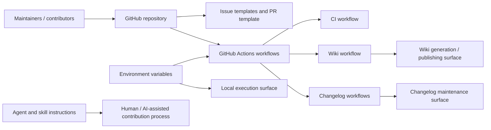
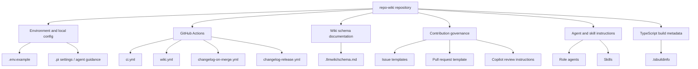
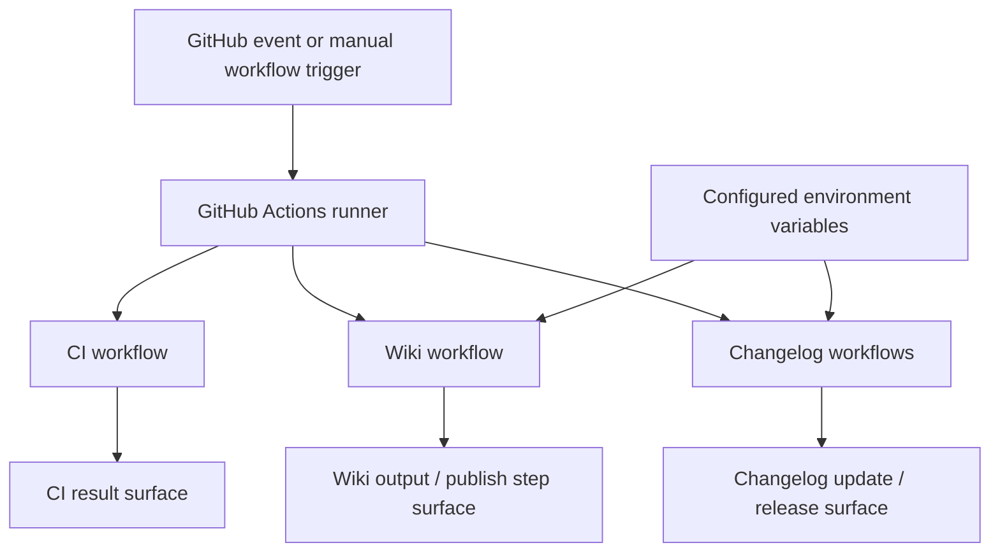
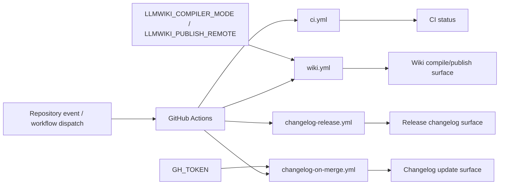

# Architecture

## Executive Architecture Summary

This repository appears to implement and operate a repository-to-wiki documentation system named `repo-wiki`, with automation around wiki compilation/publishing, changelog maintenance, issue workflows, and AI-agent guidance. The strongest source evidence available in this compilation is configuration and workflow metadata rather than application source files: CI and publishing workflows are present under `.github/workflows/`, environment configuration is represented by `.env.example`, wiki schema documentation exists at `.llmwiki/schema.md`, and repository collaboration/automation conventions are represented by issue templates, pull request templates, Copilot review instructions, agent instructions, and skills files. [`.github/workflows/ci.yml`, `.github/workflows/wiki.yml`, `.github/workflows/changelog-on-merge.yml`, `.github/workflows/changelog-release.yml`, `.env.example`, `.llmwiki/schema.md`, `.github/ISSUE_TEMPLATE/epic.yml`, `.github/ISSUE_TEMPLATE/task.yml`, `.github/pull_request_template.md`, `.github/copilot-review-instructions.md`, `.github/agents/coordinator.agent.md`, `.github/skills/repo-wiki-navigation/SKILL.md`]

The repository’s externally visible operational surfaces include:

- GitHub Actions workflows for CI, wiki generation/publishing, and changelog automation. [`.github/workflows/ci.yml`, `.github/workflows/wiki.yml`, `.github/workflows/changelog-on-merge.yml`, `.github/workflows/changelog-release.yml`]
- Environment-based configuration for GitHub repository access, GitHub token usage, compiler mode selection, LLM API access, and wiki publishing remote selection. [`.env.example`, `.github/workflows/wiki.yml`, `.github/workflows/changelog-on-merge.yml`]
- Human and AI collaboration interfaces through issue templates, pull request template, Copilot review instructions, agent instruction files, and skills. [`.github/ISSUE_TEMPLATE/config.yml`, `.github/ISSUE_TEMPLATE/epic.yml`, `.github/ISSUE_TEMPLATE/task.yml`, `.github/pull_request_template.md`, `.github/copilot-review-instructions.md`, `.github/agents/coordinator.agent.md`, `.github/agents/developer.agent.md`, `.github/agents/docs.agent.md`, `.github/agents/fixer.agent.md`, `.github/agents/quality.agent.md`, `.github/agents/review.agent.md`, `.github/skills/keep-a-changelog/SKILL.md`, `.github/skills/repo-wiki-navigation/SKILL.md`]

The available source cards do not include package manifests, TypeScript/JavaScript source modules, CLI implementation files, or test source files. Therefore, this page describes the architecture that is directly visible from configuration, workflow, schema, and repository-maintenance files, and treats product/CLI claims from documentation cards as secondary and only partially validated. [`README.md` documentation card, `docs/PLAN.md` documentation card, `docs/plans/ci-publishing.md` documentation card, `docs/plans/github-action.md` documentation card, `.tsbuildinfo`]

## System and Repository Context

The repository boundary, as evidenced by the available source cards, consists primarily of repository automation and documentation-generation support files. GitHub is a major external platform dependency because the repository defines GitHub Actions workflows, issue templates, pull request templates, Copilot review instructions, and environment variables related to GitHub repository and token access. [`.github/workflows/ci.yml`, `.github/workflows/wiki.yml`, `.github/workflows/changelog-on-merge.yml`, `.github/ISSUE_TEMPLATE/config.yml`, `.github/pull_request_template.md`, `.github/copilot-review-instructions.md`, `.env.example`]

The `.env.example` file declares environment variables for `GITHUB_REPOSITORY`, `GITHUB_TOKEN`, `LLMWIKI_COMPILER_MODE`, and `LLMWIKI_LLM_API_KEY`, indicating that local or workflow-driven execution can be configured with repository identity, GitHub authentication, compiler behavior, and LLM access. Values are intentionally not reproduced here. [`.env.example`]

The wiki workflow declares `LLMWIKI_COMPILER_MODE` and `LLMWIKI_PUBLISH_REMOTE` as environment-variable surfaces, indicating that wiki compilation mode and publishing destination are operationally configurable in CI. [`.github/workflows/wiki.yml`]

The changelog-on-merge workflow declares `GH_TOKEN`, indicating that changelog automation may use GitHub authentication in CI. [`.github/workflows/changelog-on-merge.yml`]

The `.llmwiki/schema.md` file is documentation for the wiki data model/schema and is a central evidence point for the repository’s knowledge-base output shape, although the exact schema contents are not available in the source-card excerpt. [`.llmwiki/schema.md`]

The following diagram is limited to repository boundaries and external surfaces directly supported by workflow/configuration paths. It does **not** assert internal runtime implementation details because application source files were not included in the source cards.

Evidence for this context diagram: GitHub Actions workflow files exist for CI, wiki, and changelog automation; issue/PR templates exist; environment variables are declared; and agent/skill instruction files exist. [`.github/workflows/ci.yml`, `.github/workflows/wiki.yml`, `.github/workflows/changelog-on-merge.yml`, `.github/workflows/changelog-release.yml`, `.github/ISSUE_TEMPLATE/config.yml`, `.github/ISSUE_TEMPLATE/epic.yml`, `.github/ISSUE_TEMPLATE/task.yml`, `.github/pull_request_template.md`, `.env.example`, `.github/agents/coordinator.agent.md`, `.github/skills/repo-wiki-navigation/SKILL.md`]

## Major Modules and Responsibilities

### Wiki Compilation and Publishing Configuration

The wiki automation surface is represented by `.github/workflows/wiki.yml`, which includes runtime hints for background work and environment-variable configuration, including `LLMWIKI_COMPILER_MODE` and `LLMWIKI_PUBLISH_REMOTE`. This indicates a CI-accessible process for wiki-related generation and/or publication, but the implementation invoked by the workflow is not visible in the available source cards. [`.github/workflows/wiki.yml`]

The `.env.example` file includes `LLMWIKI_COMPILER_MODE` and `LLMWIKI_LLM_API_KEY`, which suggests local configuration for compiler mode and LLM API access. This is a configuration-level claim only; no provider implementation or request flow is verified by the available source cards. [`.env.example`]

The `.llmwiki/schema.md` file provides schema/data-model documentation for wiki artifacts. It is authoritative as documentation of intended schema shape but not sufficient by itself to verify runtime enforcement unless paired with implementation code or tests, which are not included in the source cards. [`.llmwiki/schema.md`]

### CI and Quality Automation

The CI module is represented by `.github/workflows/ci.yml`. Its source card identifies it as CI with background-work runtime hints. Exact jobs, package commands, and test commands are not available from the excerpt, so only the existence of CI automation is verified here. [`.github/workflows/ci.yml`]

The repository also includes `.tsbuildinfo`, which is a TypeScript incremental-build metadata artifact. Its presence suggests that TypeScript tooling has been used in the repository, but without `package.json`, `tsconfig.json`, or source files in the source-card set, no detailed TypeScript build architecture can be verified. [`.tsbuildinfo`]

### Changelog Automation

The repository defines two changelog-related workflows:

| Workflow | Verified role | Evidence |
|---|---|---|
| `.github/workflows/changelog-on-merge.yml` | Changelog automation associated with merge events or background workflow execution; uses `GH_TOKEN` as an environment variable surface. | [`.github/workflows/changelog-on-merge.yml`] |
| `.github/workflows/changelog-release.yml` | Changelog automation associated with releases or release-oriented background workflow execution. | [`.github/workflows/changelog-release.yml`] |

The repository also includes a keep-a-changelog skill file, which appears to document agent or contributor behavior around changelog maintenance. Its operational enforcement is not verified by code in the available source cards. [`.github/skills/keep-a-changelog/SKILL.md`]

### Repository Governance and Contribution Workflows

Issue templates define structured inputs for epics and tasks, with template configuration under `.github/ISSUE_TEMPLATE/`. These files shape the repository’s planning and work-item intake process. [`.github/ISSUE_TEMPLATE/config.yml`, `.github/ISSUE_TEMPLATE/epic.yml`, `.github/ISSUE_TEMPLATE/task.yml`]

The pull request template and Copilot review instructions provide review and contribution guidance. They are governance surfaces rather than runtime system modules. [`.github/pull_request_template.md`, `.github/copilot-review-instructions.md`]

The `.devloops` file and `.pi/` configuration/instruction files are present but their exact role cannot be determined from the source-card excerpts. They are treated as repository-local development/agent configuration surfaces. [`.devloops`, `.pi/AGENTS.md`, `.pi/settings.json`]

### AI Agent and Skill Instructions

The repository contains multiple agent instruction files:

- Coordinator agent instructions. [`.github/agents/coordinator.agent.md`]
- Developer agent instructions. [`.github/agents/developer.agent.md`]
- Documentation agent instructions. [`.github/agents/docs.agent.md`]
- Fixer agent instructions. [`.github/agents/fixer.agent.md`]
- Quality agent instructions. [`.github/agents/quality.agent.md`]
- Review agent instructions. [`.github/agents/review.agent.md`]

It also contains skill documentation for changelog maintenance and repo-wiki navigation. [`.github/skills/keep-a-changelog/SKILL.md`, `.github/skills/repo-wiki-navigation/SKILL.md`]

These files support a process architecture in which human or AI-assisted contributors follow role-specific instructions, but the repository cards do not verify any runtime agent orchestration service or automated execution of these agents. [`.github/agents/coordinator.agent.md`, `.github/agents/developer.agent.md`, `.github/agents/docs.agent.md`, `.github/agents/fixer.agent.md`, `.github/agents/quality.agent.md`, `.github/agents/review.agent.md`]

### Documentation and Product Planning

Documentation cards describe a product intent for a repository wiki compiler and cite local commands such as `npx repo-wiki init --repo . --write-agents`, `npx repo-wiki run`, and `npm install`; however, package files or CLI implementation files are not included in the source-card set. These CLI claims are therefore documented as partially validated intent rather than verified current behavior. [`README.md` documentation card]

Planning documents describe desired or planned architecture for CI publishing, a GitHub Action, incremental mode, and an LLM compiler. These plans are useful for design intent but are not treated as authoritative runtime architecture without corresponding source/workflow/code evidence. [`docs/plans/ci-publishing.md` documentation card, `docs/plans/github-action.md` documentation card, `docs/plans/incremental-mode.md` documentation card, `docs/plans/llm-compiler.md` documentation card]

The following module diagram is based on verified repository structure and configuration files. Relationships are organizational and operationally inferred from file roles, not from source imports.

Evidence for this diagram: the repository contains the named files and directories in the source cards. No import/dependency edges between application modules are asserted. [`.env.example`, `.pi/settings.json`, `.pi/AGENTS.md`, `.github/workflows/ci.yml`, `.github/workflows/wiki.yml`, `.github/workflows/changelog-on-merge.yml`, `.github/workflows/changelog-release.yml`, `.llmwiki/schema.md`, `.github/ISSUE_TEMPLATE/config.yml`, `.github/ISSUE_TEMPLATE/epic.yml`, `.github/ISSUE_TEMPLATE/task.yml`, `.github/pull_request_template.md`, `.github/copilot-review-instructions.md`, `.github/agents/coordinator.agent.md`, `.github/skills/keep-a-changelog/SKILL.md`, `.tsbuildinfo`]

## Runtime, Data, and Control-Flow Relationships

The available source cards do not include scanner/import evidence for application modules, so runtime module call graphs and internal dependency chains cannot be verified. The strongest runtime/control-flow evidence is workflow-level and configuration-level. [`.github/workflows/ci.yml`, `.github/workflows/wiki.yml`, `.github/workflows/changelog-on-merge.yml`, `.github/workflows/changelog-release.yml`, `.env.example`]

Verified operational relationships include:

| Relationship | Claim status | Evidence |
|---|---:|---|
| CI automation exists and runs as background work in GitHub Actions. | Verified at workflow-file level; job details not available in excerpts. | [`.github/workflows/ci.yml`] |
| Wiki automation exists as a GitHub Actions workflow and exposes compiler/publish configuration through environment variables. | Verified at workflow-file/environment-surface level; implementation details not visible. | [`.github/workflows/wiki.yml`] |
| Local or environment-based configuration includes repository identity, GitHub token, compiler mode, and LLM API key variable names. | Verified from example environment file; values are not copied. | [`.env.example`] |
| Changelog automation exists in GitHub Actions and one changelog workflow uses a GitHub token environment surface. | Verified at workflow-file/environment-surface level. | [`.github/workflows/changelog-on-merge.yml`, `.github/workflows/changelog-release.yml`] |
| Wiki artifacts have an associated schema document. | Verified as documentation/data-model evidence; runtime enforcement not verified. | [`.llmwiki/schema.md`] |

A conservative control-flow diagram for the verified automation surfaces is below. It intentionally avoids showing internal commands or package scripts because those details were not present in the source cards.

Evidence for this diagram: the workflow files exist and are classified as CI/background-work surfaces; the wiki workflow declares `LLMWIKI_COMPILER_MODE` and `LLMWIKI_PUBLISH_REMOTE`; the changelog-on-merge workflow declares `GH_TOKEN`. [`.github/workflows/ci.yml`, `.github/workflows/wiki.yml`, `.github/workflows/changelog-on-merge.yml`, `.github/workflows/changelog-release.yml`]

Documentation cards describe a broader intended runtime flow in which source files are compiled into a persistent wiki using an LLM-aware compiler and possibly a GitHub Action/publishing step. Because those claims are only partially validated or stale and implementation files are absent from the source-card set, this page does not assert that full flow as verified current behavior. [`docs/PLAN.md` documentation card, `docs/WHY.md` documentation card, `docs/plans/llm-compiler.md` documentation card, `docs/plans/github-action.md` documentation card, `docs/plans/incremental-mode.md` documentation card]

## Build, Test, Deployment, and Operational Surfaces

### CI

A CI workflow is present at `.github/workflows/ci.yml`. The source card classifies it as CI and marks it with a background-work runtime hint. Exact build/test commands cannot be cited from the provided excerpt. [`.github/workflows/ci.yml`]

### Wiki Publishing

A wiki workflow is present at `.github/workflows/wiki.yml`. It is classified as CI/configuration and includes environment variables `LLMWIKI_COMPILER_MODE` and `LLMWIKI_PUBLISH_REMOTE`, making it the clearest verified deployment/publishing surface for wiki output. [`.github/workflows/wiki.yml`]

### Changelog Workflows

Two changelog workflows are present:

- `.github/workflows/changelog-on-merge.yml`, which includes `GH_TOKEN` as an environment-variable surface. [`.github/workflows/changelog-on-merge.yml`]
- `.github/workflows/changelog-release.yml`, which is classified as CI/background work. [`.github/workflows/changelog-release.yml`]

### Local Configuration

The `.env.example` file declares environment variable names for GitHub repository access, GitHub authentication, compiler mode, and LLM API access. This supports local or configured execution, but no local command implementation is verified from source cards. [`.env.example`]

### Build Metadata

The `.tsbuildinfo` file is present and classified as source with a background-work hint. This suggests TypeScript incremental build metadata exists in the repository, but it is not enough to verify build commands, TypeScript configuration, or package structure. [`.tsbuildinfo`]

### Build/Test/Deploy Flow Diagram

The following diagram reflects only verified workflow categories and environment-variable surfaces. It does not include specific package commands.

Evidence: workflow presence and environment-variable names from workflow source cards. [`.github/workflows/ci.yml`, `.github/workflows/wiki.yml`, `.github/workflows/changelog-on-merge.yml`, `.github/workflows/changelog-release.yml`]

## Cross-Cutting Concerns

### Configuration

Configuration is environment-variable based for at least the documented local/runtime surfaces. The visible environment variables are:

| Variable | Observed location | Interpreted purpose | Claim status |
|---|---|---|---|
| `GITHUB_REPOSITORY` | `.env.example` | Repository identity/configuration. | Verified as variable name only. |
| `GITHUB_TOKEN` | `.env.example` | GitHub authentication for local/configured execution. | Verified as variable name only. |
| `LLMWIKI_COMPILER_MODE` | `.env.example`, `.github/workflows/wiki.yml` | Compiler mode selection. | Verified as variable name and workflow surface; behavior not verified. |
| `LLMWIKI_LLM_API_KEY` | `.env.example` | LLM provider/API authentication surface. | Verified as variable name only. |
| `LLMWIKI_PUBLISH_REMOTE` | `.github/workflows/wiki.yml` | Wiki publishing remote selection. | Verified as variable name and workflow surface; behavior not verified. |
| `GH_TOKEN` | `.github/workflows/changelog-on-merge.yml` | GitHub authentication for changelog automation. | Verified as variable name and workflow surface. |

No secret values are present in this page. [`.env.example`, `.github/workflows/wiki.yml`, `.github/workflows/changelog-on-merge.yml`]

### Security

The repository uses token/API-key environment variable names for GitHub and LLM access, so secret handling is an operational concern. This page intentionally cites only variable names and does not reproduce values. [`.env.example`, `.github/workflows/changelog-on-merge.yml`]

Because workflow internals are not included in the source-card excerpts, this page cannot verify permission scopes, secret masking configuration, branch protections, or least-privilege token usage. [`.github/workflows/wiki.yml`, `.github/workflows/changelog-on-merge.yml`, `.github/workflows/ci.yml`]

### APIs and External Dependencies

The evidence indicates integration surfaces with GitHub through workflows, repository metadata, issue/PR templates, and token variables. [`.github/workflows/ci.yml`, `.github/workflows/wiki.yml`, `.github/workflows/changelog-on-merge.yml`, `.github/ISSUE_TEMPLATE/config.yml`, `.github/pull_request_template.md`, `.env.example`]

The evidence also indicates an LLM API-key configuration surface through `LLMWIKI_LLM_API_KEY`, but no provider API, SDK, endpoint, or request schema is verified from source files in this card set. [`.env.example`]

### Data Models

`.llmwiki/schema.md` is the primary visible data-model/schema artifact for wiki output. It should be treated as the schema documentation source available to this architecture page, but runtime conformance cannot be verified without source validators, tests, or generated artifacts. [`.llmwiki/schema.md`]

### Documentation Trust and Product Intent

The documentation cards describe the project as implementing a repo-wiki pattern, with local bootstrap/run commands and planned CI/publishing/LLM compiler architecture. Those documents are secondary evidence under the repository knowledge-base rules, and several are marked partially validated or stale. This page therefore separates verified configuration/workflow facts from product intent. [`README.md` documentation card, `docs/PLAN.md` documentation card, `docs/WHY.md` documentation card, `docs/plans/ci-publishing.md` documentation card, `docs/plans/github-action.md` documentation card, `docs/plans/incremental-mode.md` documentation card, `docs/plans/llm-compiler.md` documentation card]

### Contribution and AI-Assisted Workflow

The repository has structured contribution and AI-assistance guidance through issue templates, pull request template, Copilot review instructions, agent instruction files, and skill files. These are cross-cutting process artifacts that influence development and documentation maintenance rather than application runtime behavior. [`.github/ISSUE_TEMPLATE/config.yml`, `.github/ISSUE_TEMPLATE/epic.yml`, `.github/ISSUE_TEMPLATE/task.yml`, `.github/pull_request_template.md`, `.github/copilot-review-instructions.md`, `.github/agents/coordinator.agent.md`, `.github/agents/developer.agent.md`, `.github/agents/docs.agent.md`, `.github/agents/fixer.agent.md`, `.github/agents/quality.agent.md`, `.github/agents/review.agent.md`, `.github/skills/keep-a-changelog/SKILL.md`, `.github/skills/repo-wiki-navigation/SKILL.md`]

## Caveats and Open Questions

1. **Application source files were not included in the source-card set.** No package manifest, CLI entry point, TypeScript source, runtime modules, tests, or validators were available for this compilation. As a result, internal architecture, module imports, concrete data flow, and implementation-level behavior are not verified here. [`.tsbuildinfo`, `.github/workflows/ci.yml`]

2. **Workflow details are only partially known from cards.** The existence and classification of workflows are verified, along with some environment-variable surfaces, but exact triggers, jobs, permissions, commands, and artifacts are not available from the excerpts. [`.github/workflows/ci.yml`, `.github/workflows/wiki.yml`, `.github/workflows/changelog-on-merge.yml`, `.github/workflows/changelog-release.yml`]

3. **CLI behavior from `README.md` is not verified by source cards.** The documentation card mentions commands such as `npx repo-wiki init --repo . --write-agents` and `npx repo-wiki run`, but no CLI implementation or package manifest was included in the source-card set. [`README.md` documentation card]

4. **LLM provider behavior is not verified.** `LLMWIKI_LLM_API_KEY` establishes a configuration surface for LLM API access, and planning docs mention provider-agnostic LLM compiler direction, but no implementation source verifies provider selection, request/response format, fallback behavior, or error handling. [`.env.example`, `docs/plans/llm-compiler.md` documentation card]

5. **Schema enforcement is unknown.** `.llmwiki/schema.md` exists as a schema/data-model document, but this page cannot verify whether generated wiki pages are validated against it. [`.llmwiki/schema.md`]

6. **Diagrams in this page are structure/configuration diagrams, not implementation call graphs.** They are inferred from file roles and workflow/configuration surfaces, not from imports or runtime traces. This limitation applies especially to the context, module, and build/test/deploy diagrams. [`.github/workflows/ci.yml`, `.github/workflows/wiki.yml`, `.github/workflows/changelog-on-merge.yml`, `.github/workflows/changelog-release.yml`, `.env.example`, `.llmwiki/schema.md`]

7. **Planning documentation may be aspirational or stale.** The incremental-mode plan is explicitly marked stale in the documentation cards, while other plans are partially validated. Current behavior should be confirmed against source code and workflow contents before implementation decisions depend on those plans. [`docs/plans/incremental-mode.md` documentation card, `docs/plans/ci-publishing.md` documentation card, `docs/plans/github-action.md` documentation card, `docs/plans/llm-compiler.md` documentation card]

8. **The role of `.devloops`, `.pi/`, and `.tsbuildinfo` needs confirmation.** These files indicate local development, agent, or TypeScript tooling surfaces, but their exact architectural significance is not clear from the excerpts. [`.devloops`, `.pi/AGENTS.md`, `.pi/settings.json`, `.tsbuildinfo`]

<!-- HUMAN_NOTES_START -->
<!-- HUMAN_NOTES_END -->
