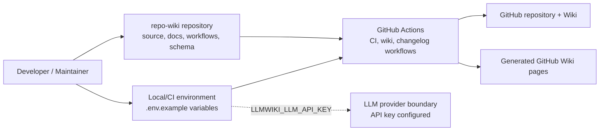
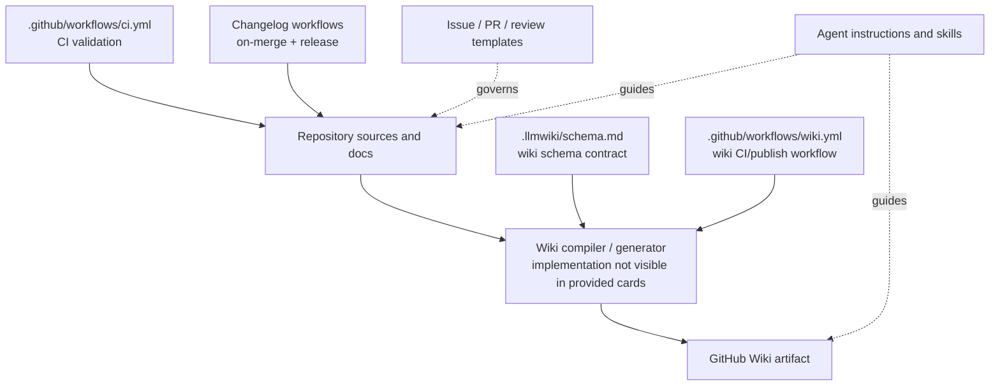
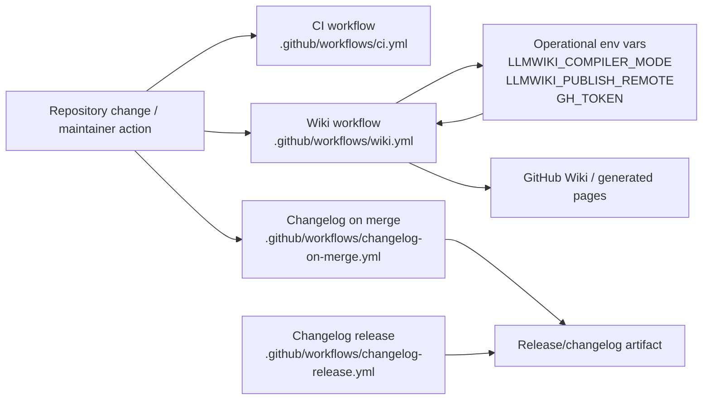

# Architecture

## Executive Architecture Summary

`repo-wiki` is documented as a tool for compiling a Git repository into a maintained GitHub Wiki knowledge base, following an “LLM Wiki” pattern where repository sources remain authoritative and generated wiki pages become a persistent artifact. This product intent is described in the partially validated documentation cards for `README.md`, `docs/PLAN.md`, and `docs/WHY.md`.

The available high-authority evidence for this page is primarily repository configuration, CI workflows, environment examples, schema documentation, GitHub issue templates, and agent/skill instructions. The source cards do **not** include the application implementation files or package metadata, so this architecture page treats runtime internals as partially observed rather than fully verified.

Major observed subsystems are:

| Subsystem | Evidence | Architectural role |
|---|---|---|
| Wiki compiler / local bootstrap surface | `.env.example`; documentation cards for `README.md`, `docs/PLAN.md`, `docs/plans/llm-compiler.md` | Configurable process intended to compile repository content into wiki pages. |
| GitHub Actions automation | `.github/workflows/ci.yml`, `.github/workflows/wiki.yml`, `.github/workflows/changelog-on-merge.yml`, `.github/workflows/changelog-release.yml` | CI, wiki generation/publishing, and changelog automation surfaces. |
| LLM Wiki schema / data model | `.llmwiki/schema.md` | Describes the generated wiki/data contract used by the compiler. |
| GitHub project hygiene | `.github/ISSUE_TEMPLATE/*.yml`, `.github/pull_request_template.md`, `.github/copilot-review-instructions.md` | Contribution, review, and issue intake conventions. |
| Agent and skill instructions | `.github/agents/*.agent.md`, `.github/skills/*/SKILL.md`, `AGENTS.md`, `.pi/AGENTS.md` | Human/AI development workflows and documentation-maintenance guidance. |

Key design decisions visible from the evidence:

- The tool is environment-configured for GitHub repository access and LLM compiler behavior through variables such as `GITHUB_REPOSITORY`, `GITHUB_TOKEN`, `LLMWIKI_COMPILER_MODE`, and `LLMWIKI_LLM_API_KEY` in `.env.example`.
- The wiki publishing workflow uses CI configuration and environment variables including `LLMWIKI_COMPILER_MODE` and `LLMWIKI_PUBLISH_REMOTE` in `.github/workflows/wiki.yml`.
- Changelog automation is implemented as GitHub Actions workflows, with `GH_TOKEN` present in `.github/workflows/changelog-on-merge.yml`.
- The project maintains explicit agent instructions and repository skills, suggesting that documentation, navigation, changelog discipline, review, quality, and coordination are first-class operational concerns.

## System and Repository Context

### Repository boundaries

The repository appears to define both a product/tool and its operational automation. Based on the available cards, the externally visible surfaces are:

| Boundary / surface | Evidence | Notes |
|---|---|---|
| Local environment configuration | `.env.example` | Declares expected environment variables for repository access and LLM compiler mode/API access. |
| GitHub Actions workflows | `.github/workflows/ci.yml`, `.github/workflows/wiki.yml`, `.github/workflows/changelog-on-merge.yml`, `.github/workflows/changelog-release.yml` | Automates CI, wiki generation/publishing, and changelog/release behavior. |
| GitHub Wiki publishing target | `.github/workflows/wiki.yml`; documentation cards for `docs/plans/ci-publishing.md` and `docs/plans/github-action.md` | Publishing behavior is supported by workflow-level configuration, but detailed implementation is not visible in the provided source cards. |
| GitHub issue/PR process | `.github/ISSUE_TEMPLATE/config.yml`, `.github/ISSUE_TEMPLATE/epic.yml`, `.github/ISSUE_TEMPLATE/task.yml`, `.github/pull_request_template.md` | Defines project-management intake and review surfaces. |
| LLM provider boundary | `.env.example`; documentation card for `docs/plans/llm-compiler.md` | `.env.example` contains `LLMWIKI_LLM_API_KEY`; the plan card states an intent for provider-agnostic OpenAI-style chat completions, but implementation details are not verified from source code here. |
| Generated wiki schema | `.llmwiki/schema.md` | Provides a documented data-model/schema surface for generated content. |

### Context diagram

The following diagram is supported by repository configuration and documentation cards. It intentionally shows only boundaries evidenced by the provided cards, not unobserved implementation classes or packages.

Evidence: `.env.example`, `.github/workflows/ci.yml`, `.github/workflows/wiki.yml`, `.github/workflows/changelog-on-merge.yml`, `.github/workflows/changelog-release.yml`, `.llmwiki/schema.md`, and documentation cards for `README.md`, `docs/PLAN.md`, `docs/plans/ci-publishing.md`, `docs/plans/github-action.md`, and `docs/plans/llm-compiler.md`.

## Major Modules and Responsibilities

### Wiki compiler and generation workflow

The repository’s documented purpose is to generate a GitHub Wiki knowledge base from repository sources. This is stated in the documentation cards for `README.md`, `docs/PLAN.md`, and `docs/WHY.md`.

Observed configuration indicates that compiler behavior is environment-controlled:

| Configuration | Evidence | Responsibility implied |
|---|---|---|
| `GITHUB_REPOSITORY` | `.env.example` | Identifies the repository to inspect or publish against. |
| `GITHUB_TOKEN` | `.env.example` | Provides GitHub API/authentication capability for local or automated runs. |
| `LLMWIKI_COMPILER_MODE` | `.env.example`, `.github/workflows/wiki.yml` | Selects compiler mode in local or CI contexts. |
| `LLMWIKI_LLM_API_KEY` | `.env.example` | Provides access to an LLM provider boundary. |
| `LLMWIKI_PUBLISH_REMOTE` | `.github/workflows/wiki.yml` | Configures wiki publishing destination/remote in the wiki workflow. |

The detailed compiler implementation, package entry points, and runtime module graph are **not present in the provided source cards**, so this page does not assert exact code-level classes, functions, or package boundaries.

### LLM Wiki schema and generated-content contract

`.llmwiki/schema.md` is the repository’s visible schema/data-model artifact. It is evidence that generated wiki content is expected to follow a structured contract. The documentation card for `docs/PLAN.md` also describes a schema that tells the LLM how to maintain the wiki, but operational details must be validated against implementation code when available.

Responsibilities:

- Define or document generated wiki page shape and expectations.
- Provide a contract for wiki compilation and maintenance.
- Support stable generated artifacts across runs.

Evidence: `.llmwiki/schema.md`; documentation card for `docs/PLAN.md`.

### GitHub Actions automation

The `.github/workflows` directory defines the repository’s automation surface:

| Workflow | Evidence | Responsibility |
|---|---|---|
| CI workflow | `.github/workflows/ci.yml` | Build/test/validation automation. Exact job commands are not visible from the card excerpt. |
| Wiki workflow | `.github/workflows/wiki.yml` | Wiki compilation and/or publishing automation; uses `LLMWIKI_COMPILER_MODE` and `LLMWIKI_PUBLISH_REMOTE`. |
| Changelog on merge | `.github/workflows/changelog-on-merge.yml` | Changelog automation after merges; uses `GH_TOKEN`. |
| Changelog release | `.github/workflows/changelog-release.yml` | Release/changelog automation. |

The documentation cards for `docs/plans/ci-publishing.md` and `docs/plans/github-action.md` describe intended CI publishing and GitHub Action architecture, including testing, fetching existing wiki state, artifact upload, and conditional publishing credentials. Those claims are partially validated by the presence of workflow files, but exact current behavior should be checked against workflow contents and implementation.

### Issue, pull request, and review process

The repository includes GitHub issue templates and review instructions:

- `.github/ISSUE_TEMPLATE/config.yml`
- `.github/ISSUE_TEMPLATE/epic.yml`
- `.github/ISSUE_TEMPLATE/task.yml`
- `.github/pull_request_template.md`
- `.github/copilot-review-instructions.md`

These files define contribution and review process surfaces rather than runtime product modules. They influence architecture governance by shaping how changes, epics, tasks, and reviews are captured.

### Agent instructions and development roles

The repository includes several agent instruction files:

| Agent / instruction file | Evidence | Likely responsibility |
|---|---|---|
| Coordinator | `.github/agents/coordinator.agent.md` | Coordination and background-work-oriented planning. |
| Developer | `.github/agents/developer.agent.md` | Implementation guidance. |
| Docs | `.github/agents/docs.agent.md` | Documentation maintenance. |
| Fixer | `.github/agents/fixer.agent.md` | Defect remediation guidance. |
| Quality | `.github/agents/quality.agent.md` | Quality/testing/review discipline. |
| Review | `.github/agents/review.agent.md` | Review behavior. |
| Repository-wide agent guidance | `AGENTS.md`, `.pi/AGENTS.md` | General repository instructions for agents or contributors. |

These are documentation/process modules. They are not runtime dependencies, but they are part of the repository’s operating model.

### Skills

The repository includes GitHub skills:

| Skill | Evidence | Responsibility |
|---|---|---|
| Keep a changelog | `.github/skills/keep-a-changelog/SKILL.md` | Changelog-writing discipline and automation support. |
| Repo wiki navigation | `.github/skills/repo-wiki-navigation/SKILL.md` | Navigation conventions for the generated or maintained wiki. |

These skills align with the changelog workflows and wiki product focus, but this relationship is organizational rather than proven as a runtime dependency.

### Component/module diagram

This component view is inferred from repository structure and workflow/configuration evidence. It should be read as a repository-level architecture map, not a verified source-code dependency graph.

Evidence: `.llmwiki/schema.md`, `.github/workflows/wiki.yml`, `.github/workflows/ci.yml`, `.github/workflows/changelog-on-merge.yml`, `.github/workflows/changelog-release.yml`, `.github/ISSUE_TEMPLATE/config.yml`, `.github/ISSUE_TEMPLATE/epic.yml`, `.github/ISSUE_TEMPLATE/task.yml`, `.github/pull_request_template.md`, `.github/agents/*.agent.md`, `.github/skills/*/SKILL.md`, and documentation cards for `README.md` and `docs/PLAN.md`.

## Runtime, Data, and Control-Flow Relationships

The provided source cards contain limited direct runtime evidence. No import graph, source-code entry point, package manifest, or executable implementation files are included in the cards. Therefore, the relationships below are limited to configuration-supported and workflow-supported control paths.

### Observed configuration flow

1. Local or CI execution receives environment configuration.
   - Evidence: `.env.example`, `.github/workflows/wiki.yml`.
2. GitHub repository access is configured through GitHub-related variables.
   - Evidence: `GITHUB_REPOSITORY` and `GITHUB_TOKEN` in `.env.example`.
3. Compiler mode is selected by `LLMWIKI_COMPILER_MODE`.
   - Evidence: `.env.example`, `.github/workflows/wiki.yml`.
4. LLM access is configured by `LLMWIKI_LLM_API_KEY`.
   - Evidence: `.env.example`.
5. Wiki publishing remote is configured by `LLMWIKI_PUBLISH_REMOTE`.
   - Evidence: `.github/workflows/wiki.yml`.

### Observed automation control paths

| Control path | Evidence | Confidence |
|---|---|---|
| Source change or manual workflow execution triggers CI validation | `.github/workflows/ci.yml` | Medium that CI exists; low for exact triggers/commands from card excerpt. |
| Wiki workflow runs in GitHub Actions and uses compiler/publish configuration | `.github/workflows/wiki.yml` | Medium for workflow existence and env vars; low for exact publish semantics from card excerpt. |
| Merge-related changelog automation uses GitHub token | `.github/workflows/changelog-on-merge.yml` | Medium for workflow existence and token usage; low for exact changelog mutation logic from card excerpt. |
| Release-related changelog automation exists | `.github/workflows/changelog-release.yml` | Medium for workflow existence; low for exact release behavior from card excerpt. |

### Data relationships

| Data/artifact | Producer/consumer | Evidence |
|---|---|---|
| Generated wiki pages | Produced by the documented wiki compiler and/or wiki workflow; consumed as GitHub Wiki knowledge base | Documentation cards for `README.md`, `docs/PLAN.md`; `.github/workflows/wiki.yml`; `.llmwiki/schema.md`. |
| Existing/generated wiki schema | Used as a contract for generated content | `.llmwiki/schema.md`. |
| Changelog content | Updated or released by changelog workflows | `.github/workflows/changelog-on-merge.yml`, `.github/workflows/changelog-release.yml`, `.github/skills/keep-a-changelog/SKILL.md`. |
| Issue and PR metadata | Created through templates and reviewed through guidance | `.github/ISSUE_TEMPLATE/*.yml`, `.github/pull_request_template.md`, `.github/copilot-review-instructions.md`. |

No sequence diagram is included because the provided cards do not expose a concrete function-level or API-level interaction sequence.

## Build, Test, Deployment, and Operational Surfaces

### CI and validation

The repository includes `.github/workflows/ci.yml`, which is the primary observed CI surface. The card confirms a workflow file exists and is classified as CI with background-work runtime hints. Exact package manager commands, test commands, matrix strategy, and artifact behavior are not available in the source-card excerpt, so they are not asserted here.

Evidence: `.github/workflows/ci.yml`.

### Wiki generation and publishing

The repository includes `.github/workflows/wiki.yml`, classified as CI/configuration with environment variables `LLMWIKI_COMPILER_MODE` and `LLMWIKI_PUBLISH_REMOTE`. This supports the claim that wiki compilation/publishing is operationalized through GitHub Actions.

Documentation cards for `docs/plans/ci-publishing.md` and `docs/plans/github-action.md` describe intended architecture around fetching existing wiki state, running tests, uploading local wiki artifacts, and conditionally publishing when credentials are configured. These plan claims are partially validated by the presence of the wiki workflow, but exact current behavior is not fully verified from the supplied cards.

Evidence: `.github/workflows/wiki.yml`; documentation cards for `docs/plans/ci-publishing.md` and `docs/plans/github-action.md`.

### Changelog and release automation

The repository includes two changelog-related workflows:

- `.github/workflows/changelog-on-merge.yml`
- `.github/workflows/changelog-release.yml`

The on-merge workflow uses `GH_TOKEN`, indicating GitHub-authenticated automation. The repository also includes `.github/skills/keep-a-changelog/SKILL.md`, which provides process guidance aligned with changelog maintenance.

Evidence: `.github/workflows/changelog-on-merge.yml`, `.github/workflows/changelog-release.yml`, `.github/skills/keep-a-changelog/SKILL.md`.

### Local bootstrap / package usage

The documentation card for `README.md` includes commands such as:

- `npm install repo-wiki`
- `npm pack repo-wiki`
- `npm install ./repo-wiki-0.2.0.tgz`

Because the provided high-authority source cards do not include `package.json`, package scripts, or source files, these package commands are treated as partially validated documentation claims rather than fully verified current behavior.

Evidence: documentation card for `README.md`.

### Build/test/deploy flow diagram

This diagram is based on workflow file presence and environment configuration, not on full workflow contents or implementation source.

Evidence: `.github/workflows/ci.yml`, `.github/workflows/wiki.yml`, `.github/workflows/changelog-on-merge.yml`, `.github/workflows/changelog-release.yml`.

## Cross-Cutting Concerns

### Configuration

The visible configuration model is environment-variable-driven:

| Variable | Evidence | Concern |
|---|---|---|
| `GITHUB_REPOSITORY` | `.env.example` | Repository targeting. |
| `GITHUB_TOKEN` | `.env.example` | GitHub authentication. |
| `GH_TOKEN` | `.github/workflows/changelog-on-merge.yml` | GitHub workflow authentication for changelog automation. |
| `LLMWIKI_COMPILER_MODE` | `.env.example`, `.github/workflows/wiki.yml` | Compiler behavior selection. |
| `LLMWIKI_LLM_API_KEY` | `.env.example` | LLM provider authentication. |
| `LLMWIKI_PUBLISH_REMOTE` | `.github/workflows/wiki.yml` | Wiki publish remote configuration. |

No environment variable values are included here.

### Security and secrets

The repository uses token/API-key-style configuration names (`GITHUB_TOKEN`, `GH_TOKEN`, `LLMWIKI_LLM_API_KEY`) in example and workflow configuration. These are sensitive operational surfaces and should be supplied through secure local environment management or GitHub Actions secrets rather than committed values.

Evidence: `.env.example`, `.github/workflows/changelog-on-merge.yml`.

### External APIs and services

Observed external boundaries include:

- GitHub repository and GitHub Wiki access, implied by GitHub-related variables and GitHub Actions workflows.
- LLM provider access, implied by `LLMWIKI_LLM_API_KEY` and the documentation card for `docs/plans/llm-compiler.md`.

The docs plan card states an intent for provider-agnostic OpenAI-style chat completions, but this cannot be confirmed as current behavior without implementation source.

Evidence: `.env.example`, `.github/workflows/wiki.yml`, documentation card for `docs/plans/llm-compiler.md`.

### Data model and generated artifacts

The `.llmwiki/schema.md` file is the visible schema/data-model artifact for wiki generation. It should be treated as high-value architecture documentation, but operational claims about how the compiler enforces the schema require validation against implementation code.

Evidence: `.llmwiki/schema.md`.

### Documentation trust model

This wiki page follows the repository-compilation authority rules:

- Source/config/CI files are treated as higher-authority evidence.
- Documentation cards are used for product intent, terminology, and roadmap context.
- Claims from stale or partially validated documentation are marked as such.

Relevant documentation cards:

| Documentation card | Status | Use in this page |
|---|---:|---|
| `README.md` | partially_validated | Product summary and package/bootstrap command context. |
| `docs/PLAN.md` | partially_validated | Product vision and LLM Wiki framing. |
| `docs/WHY.md` | partially_validated | Rationale for maintained wiki approach. |
| `docs/plans/ci-publishing.md` | partially_validated | Intended CI publishing architecture. |
| `docs/plans/github-action.md` | partially_validated | Intended GitHub Action architecture. |
| `docs/plans/incremental-mode.md` | stale | Not used for current architecture except as an open question. |
| `docs/plans/llm-compiler.md` | partially_validated | LLM compiler/provider boundary intent. |

### Governance and quality

The repository includes issue templates, PR templates, Copilot review instructions, agent files, and skills. These form a process architecture around coordinated development, review, documentation, changelog discipline, and quality.

Evidence: `.github/ISSUE_TEMPLATE/config.yml`, `.github/ISSUE_TEMPLATE/epic.yml`, `.github/ISSUE_TEMPLATE/task.yml`, `.github/pull_request_template.md`, `.github/copilot-review-instructions.md`, `.github/agents/*.agent.md`, `.github/skills/keep-a-changelog/SKILL.md`, `.github/skills/repo-wiki-navigation/SKILL.md`, `AGENTS.md`, `.pi/AGENTS.md`.

## Caveats and Open Questions

1. **Application implementation is not visible in the provided source cards.**  
   No source-code files, imports, package manifest, executable entry points, or tests are included in the card set. As a result, this page cannot verify internal compiler modules, package scripts, runtime classes, or exact dependency chains. Evidence gap: source cards list configuration/docs/workflows but not implementation files.

2. **Workflow behavior is only partially visible from card metadata.**  
   Workflow files are available as source cards, but the excerpts do not include job bodies, triggers, or commands. This page verifies the existence and broad role of `.github/workflows/ci.yml`, `.github/workflows/wiki.yml`, `.github/workflows/changelog-on-merge.yml`, and `.github/workflows/changelog-release.yml`, but not exact runtime semantics.

3. **Package/bootstrap commands are documentation-derived.**  
   The `README.md` card includes npm installation/package commands, but `package.json` is not included in the source cards. These commands should be validated against package metadata before being treated as authoritative current behavior.

4. **LLM provider architecture is not fully verified.**  
   `.env.example` includes `LLMWIKI_LLM_API_KEY`, and the `docs/plans/llm-compiler.md` card describes an OpenAI-compatible/provider-agnostic boundary. Without compiler implementation files, this remains an intent/plan-level architecture claim.

5. **Incremental mode appears stale.**  
   The documentation card for `docs/plans/incremental-mode.md` is marked stale. Incremental compilation behavior should not be treated as current architecture until verified from implementation and workflows.

6. **Diagrams are repository-level, not code-level dependency graphs.**  
   The diagrams in this page are inferred from repository structure, workflow/configuration evidence, and partially validated documentation cards. They do not represent verified imports, classes, or function call relationships.

7. **Schema enforcement is unverified.**  
   `.llmwiki/schema.md` exists as a documented schema/data-model artifact, but the provided cards do not show whether or how the compiler validates generated pages against it.

8. **Publishing target details are incomplete.**  
   `.github/workflows/wiki.yml` exposes `LLMWIKI_PUBLISH_REMOTE`, and docs cards discuss publishing, but the precise remote format, credentials policy, failure behavior, and artifact retention behavior require workflow and implementation review.

<!-- HUMAN_NOTES_START -->
<!-- HUMAN_NOTES_END -->
