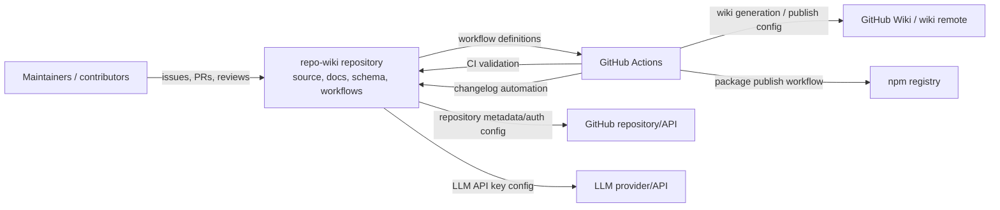
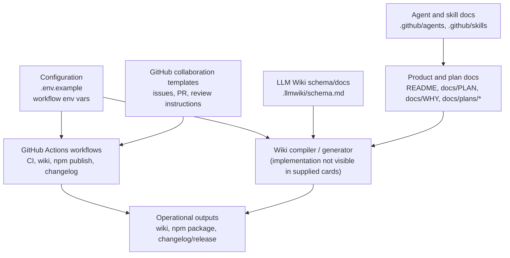
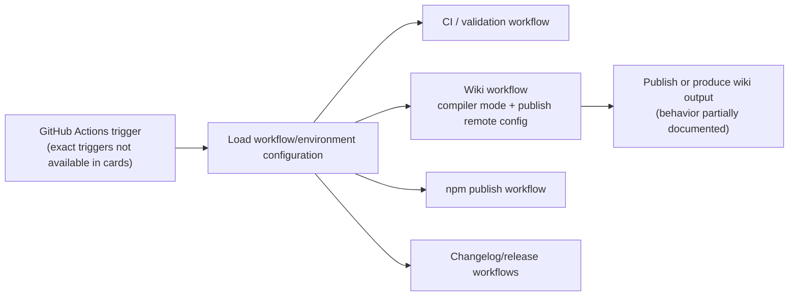
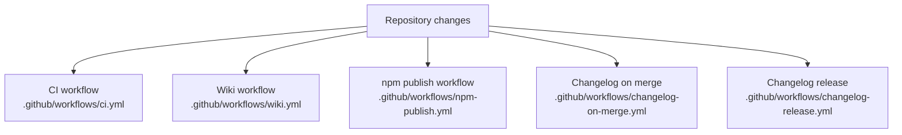

# Architecture

## Executive Architecture Summary

`repo-wiki` is described by its documentation cards as a repository-to-GitHub-Wiki system: it compiles repository evidence into maintained wiki pages, following an “LLM Wiki” pattern where source files remain authoritative and the wiki is a generated, persistent knowledge artifact. This intent is documented in `README.md`, `docs/PLAN.md`, and `docs/WHY.md` documentation cards, but the source cards provided for this page do **not** include the main TypeScript/package implementation files, so runtime internals are only partially visible.

The strongest source-backed architectural evidence in the available cards is:

| Area | Evidence | Architecture implication |
|---|---|---|
| Environment/configuration | `.env.example` declares `GITHUB_REPOSITORY`, `GITHUB_TOKEN`, `LLMWIKI_COMPILER_MODE`, and `LLMWIKI_LLM_API_KEY` | The system is configured for GitHub repository access, optional GitHub authentication, compiler mode selection, and LLM-provider access. |
| Wiki CI workflow | `.github/workflows/wiki.yml` references `LLMWIKI_COMPILER_MODE` and `LLMWIKI_PUBLISH_REMOTE` | Wiki generation/publishing is an operational surface in GitHub Actions. |
| CI/release automation | `.github/workflows/ci.yml`, `.github/workflows/npm-publish.yml`, `.github/workflows/changelog-on-merge.yml`, `.github/workflows/changelog-release.yml` | The repository uses GitHub Actions for validation, npm publishing, and changelog/release automation. |
| Data model/schema | `.llmwiki/schema.md` | The generated wiki process has an explicit schema/documentation model, though this page cannot verify all schema fields from source code. |
| GitHub collaboration surfaces | `.github/ISSUE_TEMPLATE/*.yml`, `.github/pull_request_template.md`, `.github/copilot-review-instructions.md` | The repository includes issue, PR, and review process scaffolding. |
| Agent/skill docs | `.github/agents/*.agent.md`, `.github/skills/*/SKILL.md` | The repository documents multiple agent roles and skills for coordination, development, documentation, quality, review, changelog, and wiki navigation. |

The most important architectural caveat is that the provided source-card set does not include core package files such as `package.json`, TypeScript source files, CLI entrypoints, extension entrypoints, tests, or implementation modules. Therefore, this page treats documentation claims from `README.md` and `docs/plans/*.md` as intent unless corroborated by the supplied source/configuration cards.

## System and Repository Context

### Repository boundary

Based on available evidence, the repository boundary includes:

- GitHub-hosted source repository and workflow configuration, evidenced by `.github/workflows/*.yml`.
- Wiki generation/publishing automation, evidenced by `.github/workflows/wiki.yml`.
- npm publishing automation, evidenced by `.github/workflows/npm-publish.yml`.
- Changelog automation, evidenced by `.github/workflows/changelog-on-merge.yml` and `.github/workflows/changelog-release.yml`.
- LLM/wiki schema documentation, evidenced by `.llmwiki/schema.md`.
- GitHub issue/PR/review collaboration surfaces, evidenced by `.github/ISSUE_TEMPLATE/config.yml`, `.github/ISSUE_TEMPLATE/epic.yml`, `.github/ISSUE_TEMPLATE/task.yml`, `.github/pull_request_template.md`, and `.github/copilot-review-instructions.md`.
- Agent and skill guidance, evidenced by `.github/agents/*.agent.md` and `.github/skills/*/SKILL.md`.

External surfaces that are visible in the cards:

| External surface | Evidence | Notes |
|---|---|---|
| GitHub repository API / repository identity | `.env.example` includes `GITHUB_REPOSITORY` and `GITHUB_TOKEN` | This supports GitHub integration/configuration, but exact API calls are not visible in the supplied source cards. |
| GitHub Actions | `.github/workflows/ci.yml`, `.github/workflows/wiki.yml`, `.github/workflows/npm-publish.yml`, `.github/workflows/changelog-on-merge.yml`, `.github/workflows/changelog-release.yml` | CI, publishing, wiki, and changelog automation are configured. |
| LLM provider/API | `.env.example` includes `LLMWIKI_LLM_API_KEY`; `docs/plans/llm-compiler.md` mentions an OpenAI-style chat-completions boundary | Provider behavior is documentation-backed, not implementation-verified from the supplied source cards. |
| GitHub Wiki remote/publishing target | `.github/workflows/wiki.yml` references `LLMWIKI_PUBLISH_REMOTE`; `docs/plans/github-action.md` discusses artifact upload and conditional publishing | Publishing configuration is visible; exact workflow steps are not expanded in the provided card excerpt. |
| npm registry | `.github/workflows/npm-publish.yml`; `README.md` documentation card mentions package publication | npm publishing workflow exists, but package metadata was not included in source cards. |

### Context diagram

The following diagram is intentionally limited to relationships supported by configuration and documentation cards. It should be read as an operational context, not a verified implementation call graph.

Evidence: `.github/workflows/ci.yml`, `.github/workflows/wiki.yml`, `.github/workflows/npm-publish.yml`, `.github/workflows/changelog-on-merge.yml`, `.github/workflows/changelog-release.yml`, `.env.example`, `.github/ISSUE_TEMPLATE/*.yml`, `.github/pull_request_template.md`, `.github/copilot-review-instructions.md`, and documentation cards `README.md`, `docs/plans/github-action.md`, `docs/plans/llm-compiler.md`.

## Major Modules and Responsibilities

Because implementation source files were not included in the source-card set, the modules below are derived from repository structure, CI/configuration cards, and plan/documentation cards. Module boundaries should be revisited once package source files are indexed.

### Wiki Compiler / LLM Wiki Generation

**Responsibility:** Generate GitHub Wiki knowledge pages from repository evidence.

**Evidence:**

- `.llmwiki/schema.md` is categorized as a data-model/documentation source card.
- `.github/workflows/wiki.yml` is a CI/configuration card with runtime hints for background work and environment variables `LLMWIKI_COMPILER_MODE` and `LLMWIKI_PUBLISH_REMOTE`.
- `.env.example` includes `LLMWIKI_COMPILER_MODE` and `LLMWIKI_LLM_API_KEY`.
- `README.md` documentation card describes the extension entrypoint as `@mfittko/repo-wiki/extension` and a skill at `skills/repo-wiki-cli/SKILL.md`, but those paths were not included in the supplied source cards.
- `docs/PLAN.md` and `docs/WHY.md` documentation cards describe the product intent as an implementation of the LLM Wiki pattern.

**Claim status:** Partially verified. The presence of wiki workflow configuration, schema docs, and LLM-related environment variables is source-backed; the compiler implementation shape is not verified from the supplied source cards.

### GitHub Actions Automation

**Responsibility:** Run CI, wiki publishing, npm publishing, and changelog/release automation.

**Evidence:**

- `.github/workflows/ci.yml`
- `.github/workflows/wiki.yml`
- `.github/workflows/npm-publish.yml`
- `.github/workflows/changelog-on-merge.yml`
- `.github/workflows/changelog-release.yml`

**Observed workflow groups:**

| Workflow file | Responsibility indicated by filename/card metadata |
|---|---|
| `.github/workflows/ci.yml` | CI/background validation |
| `.github/workflows/wiki.yml` | Wiki generation/publishing; uses `LLMWIKI_COMPILER_MODE` and `LLMWIKI_PUBLISH_REMOTE` |
| `.github/workflows/npm-publish.yml` | npm publishing |
| `.github/workflows/changelog-on-merge.yml` | Changelog automation on merge; uses `GH_TOKEN` |
| `.github/workflows/changelog-release.yml` | Changelog/release automation |

**Claim status:** Verified at workflow-existence/configuration level only. Exact jobs, triggers, steps, permissions, and artifact behavior are not available in the provided excerpts.

### Configuration and Environment Layer

**Responsibility:** Provide runtime configuration for GitHub, LLM, compiler mode, publishing, and changelog automation.

**Evidence:**

- `.env.example` declares:
  - `GITHUB_REPOSITORY`
  - `GITHUB_TOKEN`
  - `LLMWIKI_COMPILER_MODE`
  - `LLMWIKI_LLM_API_KEY`
- `.github/workflows/wiki.yml` references:
  - `LLMWIKI_COMPILER_MODE`
  - `LLMWIKI_PUBLISH_REMOTE`
- `.github/workflows/changelog-on-merge.yml` references:
  - `GH_TOKEN`

**Security note:** This page cites only variable names, not values. No secrets, tokens, private keys, or environment variable values are reproduced.

### Schema / Knowledge Model

**Responsibility:** Define or document the wiki/data model used by the LLM wiki process.

**Evidence:**

- `.llmwiki/schema.md` is categorized as data-model documentation.
- `docs/PLAN.md` documentation card says the project uses a schema to tell the LLM how to synthesize repository wiki pages.

**Claim status:** Partially verified. Schema documentation exists, but runtime schema enforcement is not visible from supplied source cards.

### GitHub Collaboration and Review Process

**Responsibility:** Standardize issues, epics, tasks, PRs, and review behavior.

**Evidence:**

- `.github/ISSUE_TEMPLATE/config.yml`
- `.github/ISSUE_TEMPLATE/epic.yml`
- `.github/ISSUE_TEMPLATE/task.yml`
- `.github/pull_request_template.md`
- `.github/copilot-review-instructions.md`

**Claim status:** Verified as repository process scaffolding. Enforcement level is unknown.

### Agent and Skill Guidance

**Responsibility:** Provide instructions for specialized AI or human-assisted roles and repository skills.

**Evidence:**

- Agent docs:
  - `.github/agents/coordinator.agent.md`
  - `.github/agents/developer.agent.md`
  - `.github/agents/docs.agent.md`
  - `.github/agents/fixer.agent.md`
  - `.github/agents/quality.agent.md`
  - `.github/agents/review.agent.md`
- Skills:
  - `.github/skills/keep-a-changelog/SKILL.md`
  - `.github/skills/repo-wiki-navigation/SKILL.md`

**Claim status:** Verified as documentation assets. Runtime integration with tools or agents is not verified from the supplied cards.

### Component/module diagram

This diagram is based on repository structure and workflow/configuration evidence, not on implementation imports. It is therefore a high-level conceptual map.

Evidence: `.env.example`, `.github/workflows/*.yml`, `.llmwiki/schema.md`, `.github/agents/*.agent.md`, `.github/skills/*/SKILL.md`, `.github/ISSUE_TEMPLATE/*.yml`, `.github/pull_request_template.md`, `.github/copilot-review-instructions.md`, plus documentation cards `README.md`, `docs/PLAN.md`, `docs/WHY.md`, and `docs/plans/*.md`.

## Runtime, Data, and Control-Flow Relationships

Runtime relationships are only partially verifiable from the provided source cards. No scanner/import cards for application source modules were provided, so this section avoids asserting exact function calls, package imports, CLI argument parsing, or class/module dependencies.

### Verified or partially verified flows

| Flow | Status | Evidence |
|---|---:|---|
| Workflow-driven background automation exists | Verified | `.github/workflows/ci.yml`, `.github/workflows/wiki.yml`, `.github/workflows/npm-publish.yml`, `.github/workflows/changelog-on-merge.yml`, `.github/workflows/changelog-release.yml` have CI/background-work metadata. |
| Wiki workflow can be configured by compiler mode and publish remote | Verified at config level | `.github/workflows/wiki.yml` references `LLMWIKI_COMPILER_MODE` and `LLMWIKI_PUBLISH_REMOTE`. |
| Local/environment configuration includes GitHub and LLM settings | Verified at config level | `.env.example` lists `GITHUB_REPOSITORY`, `GITHUB_TOKEN`, `LLMWIKI_COMPILER_MODE`, and `LLMWIKI_LLM_API_KEY`. |
| Changelog-on-merge workflow uses a GitHub token variable | Verified at config level | `.github/workflows/changelog-on-merge.yml` references `GH_TOKEN`. |
| LLM compiler may use an OpenAI-style provider abstraction | Documentation intent only | `docs/plans/llm-compiler.md` documentation card. |
| GitHub Action may upload local wiki artifacts or publish conditionally | Documentation intent only | `docs/plans/github-action.md` documentation card. |

### Conservative control-flow view

The following flow is supported by workflow/configuration existence and documentation intent. It is not a verified implementation sequence.

Evidence: `.github/workflows/ci.yml`, `.github/workflows/wiki.yml`, `.github/workflows/npm-publish.yml`, `.github/workflows/changelog-on-merge.yml`, `.github/workflows/changelog-release.yml`, `.env.example`, and documentation card `docs/plans/github-action.md`.

## Build, Test, Deployment, and Operational Surfaces

### CI and background automation

The repository has multiple GitHub Actions workflow files:

| Workflow | Operational surface | Evidence |
|---|---|---|
| CI | Validation/build/test workflow surface | `.github/workflows/ci.yml` |
| Wiki | Wiki generation/publishing workflow surface | `.github/workflows/wiki.yml` |
| npm publish | Package deployment/publishing surface | `.github/workflows/npm-publish.yml` |
| Changelog on merge | Changelog maintenance surface | `.github/workflows/changelog-on-merge.yml` |
| Changelog release | Release/changelog automation surface | `.github/workflows/changelog-release.yml` |

The source cards indicate these workflows exist and are background-work capable. They do not expose full trigger, job, or command details in the provided excerpts.

### Package scripts and implementation commands

The provided source cards do **not** include `package.json`, `package-lock.json`, source files, or test files. The `README.md` documentation card mentions installing `@mfittko/repo-wiki` and an extension entrypoint published as `@mfittko/repo-wiki/extension`, but package metadata and implementation entrypoints were not included in the source-card set. Treat package script and public API details as unverified until package source evidence is indexed.

### Build/test/deploy flow diagram

This diagram reflects workflow-level surfaces only.

Evidence: `.github/workflows/ci.yml`, `.github/workflows/wiki.yml`, `.github/workflows/npm-publish.yml`, `.github/workflows/changelog-on-merge.yml`, `.github/workflows/changelog-release.yml`.

## Cross-Cutting Concerns

### Configuration

Configuration is environment-variable based in the available evidence:

| Variable | Evidence | Inferred purpose |
|---|---|---|
| `GITHUB_REPOSITORY` | `.env.example` | Repository identity/configuration for GitHub integration. |
| `GITHUB_TOKEN` | `.env.example` | GitHub authentication for local or configured runs. |
| `GH_TOKEN` | `.github/workflows/changelog-on-merge.yml` | GitHub authentication for changelog workflow automation. |
| `LLMWIKI_COMPILER_MODE` | `.env.example`, `.github/workflows/wiki.yml` | Selects wiki compiler mode. Exact accepted values are not visible in supplied cards. |
| `LLMWIKI_LLM_API_KEY` | `.env.example` | LLM provider authentication. |
| `LLMWIKI_PUBLISH_REMOTE` | `.github/workflows/wiki.yml` | Wiki publishing remote configuration. |

### Security and secrets

The repository is configured to use secret-like variables for GitHub and LLM access (`GITHUB_TOKEN`, `GH_TOKEN`, `LLMWIKI_LLM_API_KEY`). This page intentionally lists only variable names and does not reproduce values. Evidence: `.env.example`, `.github/workflows/changelog-on-merge.yml`.

Security-sensitive implementation details such as token scopes, permissions, redaction, provider request handling, and secret masking could not be verified because implementation source and full workflow contents were not included in the supplied cards.

### APIs and external dependencies

Visible API/dependency surfaces include GitHub, GitHub Actions, GitHub Wiki/publish remote, npm publishing, and an LLM provider. Evidence comes from `.env.example`, `.github/workflows/*.yml`, `README.md`, and `docs/plans/llm-compiler.md`.

The exact npm dependencies, package exports, CLI options, and extension APIs are not verifiable from the provided source cards.

### Data models

`.llmwiki/schema.md` is the primary visible data-model artifact. Documentation cards `docs/PLAN.md` and `docs/WHY.md` state that schema-guided wiki generation is central to the project’s purpose. Runtime schema validation/enforcement is not visible from supplied source cards.

### Documentation trust model

Per the compilation rules for this wiki:

- Source code and configuration at commit `f3abfc0fc6ecf916c2293708106a5018ea85180d` are authoritative.
- CI/workflow/configuration files are high-authority evidence.
- Markdown docs are secondary evidence and are used here for product intent, terminology, and planned architecture.
- Because implementation source cards were not supplied, documentation-derived claims are marked as partially verified or documentation intent where appropriate.

### Development process

The repository includes GitHub issue templates, PR template, Copilot review instructions, agent role docs, and skill docs. These are process architecture surfaces, not runtime modules. Evidence: `.github/ISSUE_TEMPLATE/config.yml`, `.github/ISSUE_TEMPLATE/epic.yml`, `.github/ISSUE_TEMPLATE/task.yml`, `.github/pull_request_template.md`, `.github/copilot-review-instructions.md`, `.github/agents/*.agent.md`, `.github/skills/*/SKILL.md`.

## Caveats and Open Questions

1. **Core implementation files were not included in the source-card set.**  
   No TypeScript/JavaScript source modules, `package.json`, CLI implementation, extension implementation, tests, or package export definitions were available. As a result, this Architecture page cannot verify internal call graphs, package scripts, public APIs, or runtime behavior beyond configuration/workflow-level evidence.

2. **README package/API claims are only partially validated.**  
   The `README.md` documentation card says the extension entrypoint is published as `@mfittko/repo-wiki/extension` and references a CLI skill, but the supplied source cards do not include package metadata or the mentioned implementation paths.

3. **LLM provider architecture is documentation-backed, not implementation-verified.**  
   `docs/plans/llm-compiler.md` describes a provider-agnostic/OpenAI-style chat-completions boundary, and `.env.example` includes `LLMWIKI_LLM_API_KEY`; however, no provider adapter or request code was included in the source cards.

4. **Workflow internals are not fully visible.**  
   Workflow files are listed as source cards, but only metadata/excerpts are available here. Exact triggers, job graphs, commands, permissions, artifact retention, and publishing conditions should be verified from the full YAML files.

5. **Schema enforcement is unknown.**  
   `.llmwiki/schema.md` exists as a schema/data-model document, but runtime validation or compiler use of the schema is not visible from the supplied source cards.

6. **Incremental mode appears stale in documentation.**  
   `docs/plans/incremental-mode.md` is marked stale in the documentation cards. Any incremental-mode architecture should be treated as unresolved until verified against implementation and current workflows.

7. **Diagrams in this page are high-level and configuration-derived.**  
   The context, component, and build/deploy diagrams are based on repository structure, workflow/configuration evidence, and documentation cards. They are not implementation import graphs or verified runtime sequence diagrams.

8. **Open question: what are the accepted compiler modes?**  
   `LLMWIKI_COMPILER_MODE` appears in `.env.example` and `.github/workflows/wiki.yml`, but the valid values and behavior of each mode are not visible in the supplied source cards.

9. **Open question: what publishes to the GitHub Wiki, and under what policy?**  
   `.github/workflows/wiki.yml` references `LLMWIKI_PUBLISH_REMOTE`, and `docs/plans/github-action.md` mentions artifact/publish policy concepts, but exact current behavior is not verified.

10. **Open question: what is the test architecture?**  
    `.github/workflows/ci.yml` exists, but tests and commands are not included in the supplied source cards.

<!-- HUMAN_NOTES_START -->
<!-- HUMAN_NOTES_END -->
