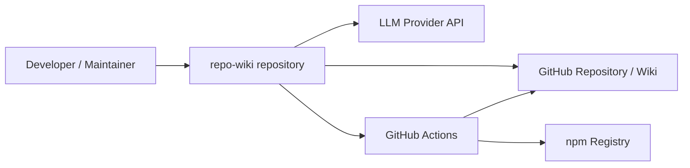
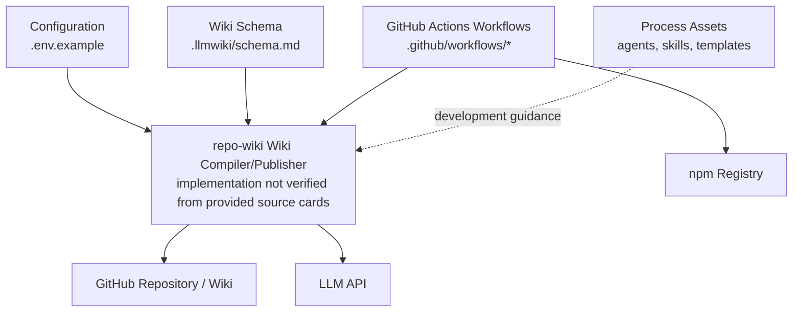
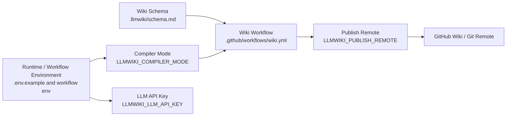
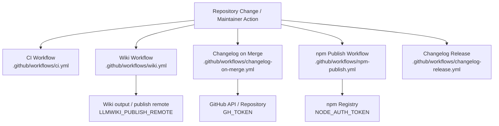

# Architecture

## Executive Architecture Summary

`repo-wiki` is a repository-to-GitHub-Wiki tooling project whose documented product intent is to compile repository knowledge into a persistent wiki artifact; this intent is described in the partially validated README and planning documentation, including `README.md`, `docs/PLAN.md`, and `docs/WHY.md`. The source evidence available for this architecture page is weighted toward configuration, CI, agent instructions, issue templates, and wiki schema documentation rather than application source files, so the architecture below is intentionally conservative.

At the repository boundary, the observable operational surfaces are:

| Surface | Evidence | Architectural implication |
| --- | --- | --- |
| Local/CLI-style use | `.env.example` declares `GITHUB_REPOSITORY`, `GITHUB_TOKEN`, `LLMWIKI_COMPILER_MODE`, and `LLMWIKI_LLM_API_KEY`; README documentation references `npx repo-wiki --help` and package installation commands. | The project appears designed to run locally or in automation with GitHub and LLM-related configuration. |
| GitHub Actions automation | `.github/workflows/ci.yml`, `.github/workflows/wiki.yml`, `.github/workflows/npm-publish.yml`, `.github/workflows/changelog-on-merge.yml`, `.github/workflows/changelog-release.yml`. | CI, wiki generation/publishing, npm publishing, and changelog automation are first-class operational workflows. |
| Wiki knowledge schema | `.llmwiki/schema.md`. | The project maintains a documented schema or contract for generated wiki knowledge. |
| Contributor/process automation | `.github/ISSUE_TEMPLATE/*.yml`, `.github/pull_request_template.md`, `.github/copilot-review-instructions.md`, `.github/agents/*.agent.md`, `.github/skills/*/SKILL.md`. | The repository encodes contribution, review, documentation, and agent workflow conventions as repository-managed process assets. |

The key design decision visible from the available evidence is that the repository treats wiki generation/publishing, changelog management, release publishing, and agent-assisted development as separate operational concerns represented by dedicated GitHub workflow and instruction files. This separation is evidenced by the distinct workflow files under `.github/workflows/` and distinct agent/skill documents under `.github/agents/` and `.github/skills/`.

## System and Repository Context

The repository appears to sit between three external contexts:

1. **GitHub repository and GitHub Wiki targets** — inferred from configuration names such as `GITHUB_REPOSITORY`, `GITHUB_TOKEN`, and `LLMWIKI_PUBLISH_REMOTE` in `.env.example` and `.github/workflows/wiki.yml`.
2. **LLM provider or compatible LLM API** — inferred from `LLMWIKI_LLM_API_KEY` in `.env.example` and from the partially validated `docs/plans/llm-compiler.md`, which describes a provider-agnostic/OpenAI-style chat completions boundary.
3. **npm package registry** — inferred from `.github/workflows/npm-publish.yml`, which declares `NODE_AUTH_TOKEN`.

The repository also contains internal process surfaces for issues, pull requests, review guidance, agents, and skills. These are not runtime application modules, but they influence development and maintenance workflows through GitHub-native configuration and documentation files: `.github/ISSUE_TEMPLATE/config.yml`, `.github/ISSUE_TEMPLATE/epic.yml`, `.github/ISSUE_TEMPLATE/task.yml`, `.github/pull_request_template.md`, `.github/copilot-review-instructions.md`, `.github/agents/*.agent.md`, and `.github/skills/*/SKILL.md`.

**Diagram evidence and limitations:** This context diagram is supported at the boundary level by environment variables and workflow files: `.env.example`, `.github/workflows/wiki.yml`, `.github/workflows/npm-publish.yml`, `.github/workflows/ci.yml`, `.github/workflows/changelog-on-merge.yml`, and `.github/workflows/changelog-release.yml`. It does **not** assert concrete runtime call order or implementation classes because application source/import evidence was not available in the source-card set.

## Major Modules and Responsibilities

### Wiki Compilation and Publishing Surface

The wiki subsystem is visible through:

- `.github/workflows/wiki.yml`, which is a CI workflow associated with wiki operations and declares runtime configuration variables `LLMWIKI_COMPILER_MODE` and `LLMWIKI_PUBLISH_REMOTE`.
- `.llmwiki/schema.md`, which documents a wiki schema/data model.
- `.env.example`, which declares `LLMWIKI_COMPILER_MODE`, `LLMWIKI_LLM_API_KEY`, `GITHUB_REPOSITORY`, and `GITHUB_TOKEN`.

Based on this evidence, the wiki subsystem is responsible for compiling repository information into a wiki artifact and optionally publishing it through configured GitHub/Git remote surfaces. The exact compiler implementation, internal module boundaries, and publishing mechanics are not verified from application source in the available source cards.

### LLM Integration Boundary

The repository exposes an LLM-related configuration surface through `LLMWIKI_LLM_API_KEY` in `.env.example`. The partially validated `docs/plans/llm-compiler.md` describes an intended provider-agnostic boundary compatible with OpenAI-style chat completions, but this remains documentation-level evidence in the provided card set.

Architecturally, the safest verified claim is that the project expects an LLM API key configuration for at least one compiler mode or runtime path. The provider abstraction, request format, retry behavior, model selection, and failure semantics are not verified from source cards.

### GitHub Integration Boundary

GitHub integration is evidenced by `GITHUB_REPOSITORY` and `GITHUB_TOKEN` in `.env.example`, `GH_TOKEN` in `.github/workflows/changelog-on-merge.yml`, and `LLMWIKI_PUBLISH_REMOTE` in `.github/workflows/wiki.yml`.

Responsibilities implied by this boundary include:

- Identifying the target repository.
- Authenticating to GitHub or Git-backed remotes.
- Supporting automation for wiki publishing and changelog management.

Concrete API calls, permissions, and publish behavior are not verified from source-card excerpts.

### CI and Release Automation

The repository has several dedicated workflow files:

| Workflow | Evidence path | Responsibility indicated by filename/configuration evidence |
| --- | --- | --- |
| CI | `.github/workflows/ci.yml` | General continuous integration checks. |
| Wiki | `.github/workflows/wiki.yml` | Wiki compilation/publishing automation; declares `LLMWIKI_COMPILER_MODE` and `LLMWIKI_PUBLISH_REMOTE`. |
| npm publish | `.github/workflows/npm-publish.yml` | npm publishing automation; declares `NODE_AUTH_TOKEN`. |
| Changelog on merge | `.github/workflows/changelog-on-merge.yml` | Changelog automation on merge; declares `GH_TOKEN`. |
| Changelog release | `.github/workflows/changelog-release.yml` | Release-oriented changelog automation. |

The exact triggers, jobs, commands, and dependency installation steps are not available in the source-card excerpts, so this page does not claim detailed pipeline stages beyond the workflow-level responsibilities above.

### Documentation, Agents, and Contributor Workflow Assets

The repository includes process and agent guidance:

- Agent files: `.github/agents/coordinator.agent.md`, `.github/agents/developer.agent.md`, `.github/agents/docs.agent.md`, `.github/agents/fixer.agent.md`, `.github/agents/quality.agent.md`, `.github/agents/review.agent.md`.
- Skills: `.github/skills/keep-a-changelog/SKILL.md`, `.github/skills/repo-wiki-navigation/SKILL.md`.
- Review/contribution templates: `.github/copilot-review-instructions.md`, `.github/pull_request_template.md`, `.github/ISSUE_TEMPLATE/config.yml`, `.github/ISSUE_TEMPLATE/epic.yml`, `.github/ISSUE_TEMPLATE/task.yml`.

These files indicate that the repository encodes structured development practices for planning, implementation, documentation, review, quality, and changelog/wiki navigation. Their architectural role is primarily socio-technical: they shape how changes are proposed, reviewed, and documented.

### Wiki Schema / Data Model

`.llmwiki/schema.md` is the main visible data-model evidence. It indicates that generated wiki output is intended to follow a documented schema or structure. Because only the source card metadata is available here, this page does not restate specific schema fields or invariants.

**Diagram evidence and limitations:** This module diagram is partly structural and partly inferred from filenames/configuration. It is supported by `.env.example`, `.llmwiki/schema.md`, `.github/workflows/*.yml`, `.github/agents/*.agent.md`, `.github/skills/*/SKILL.md`, and GitHub templates. It should not be read as a verified import graph or source-level dependency graph.

## Runtime, Data, and Control-Flow Relationships

The available evidence supports the following high-level runtime/data relationships:

1. **Configuration supplies runtime targets and credentials.** `.env.example` declares `GITHUB_REPOSITORY`, `GITHUB_TOKEN`, `LLMWIKI_COMPILER_MODE`, and `LLMWIKI_LLM_API_KEY`. `.github/workflows/wiki.yml` declares `LLMWIKI_COMPILER_MODE` and `LLMWIKI_PUBLISH_REMOTE`. These names imply runtime selection of compiler mode, GitHub target information, LLM access, and wiki publish remote configuration.
2. **CI workflows orchestrate operational tasks.** `.github/workflows/ci.yml`, `.github/workflows/wiki.yml`, `.github/workflows/npm-publish.yml`, `.github/workflows/changelog-on-merge.yml`, and `.github/workflows/changelog-release.yml` represent separate automated control paths.
3. **Wiki output is constrained by schema documentation.** `.llmwiki/schema.md` provides a documented schema/data-model reference for wiki generation.
4. **Changelog workflows require GitHub authentication.** `.github/workflows/changelog-on-merge.yml` declares `GH_TOKEN`, indicating authenticated GitHub operations in that workflow.
5. **npm publishing requires npm authentication.** `.github/workflows/npm-publish.yml` declares `NODE_AUTH_TOKEN`.

No concrete application import graph, CLI entrypoint implementation, class/module layout, or function-level call graph was available in the provided source cards. Therefore, the following flow is intentionally coarse and limited to verified operational surfaces:

**Control-flow limitation:** This diagram is not a verified sequence of implementation calls. It is a configuration/control-surface diagram based on environment variable names and workflow file existence.

## Build, Test, Deployment, and Operational Surfaces

The repository has multiple GitHub Actions workflow entry points:

| Operational concern | Evidence | Notes |
| --- | --- | --- |
| Continuous integration | `.github/workflows/ci.yml` | The workflow exists, but exact jobs/commands are not available from the provided source-card excerpt. |
| Wiki compilation/publishing | `.github/workflows/wiki.yml` | The workflow declares `LLMWIKI_COMPILER_MODE` and `LLMWIKI_PUBLISH_REMOTE`; docs plans also discuss GitHub Action/wiki publishing flows in `docs/plans/github-action.md` and `docs/plans/ci-publishing.md`. |
| npm publishing | `.github/workflows/npm-publish.yml` | The workflow declares `NODE_AUTH_TOKEN`, indicating authenticated npm publishing. |
| Changelog on merge | `.github/workflows/changelog-on-merge.yml` | The workflow declares `GH_TOKEN`, indicating authenticated GitHub changelog operations. |
| Changelog release | `.github/workflows/changelog-release.yml` | Release changelog workflow exists. |
| Local bootstrap / package use | README documentation card | README references package installation and `npx repo-wiki --help`, but this is documentation evidence and should be validated against package source before treating it as a complete current interface. |

**Diagram evidence and limitations:** The workflow nodes are supported by workflow file paths. The trigger relationship from “Repository Change / Maintainer Action” is generalized because exact workflow triggers are not present in the source-card excerpts.

## Cross-Cutting Concerns

### Configuration

Configuration is primarily environment-variable based in the available evidence:

| Variable | Evidence path | Concern |
| --- | --- | --- |
| `GITHUB_REPOSITORY` | `.env.example` | Target repository identification. |
| `GITHUB_TOKEN` | `.env.example` | GitHub authentication for local or automated operations. |
| `LLMWIKI_COMPILER_MODE` | `.env.example`, `.github/workflows/wiki.yml` | Compiler/runtime mode selection. |
| `LLMWIKI_LLM_API_KEY` | `.env.example` | LLM provider authentication. |
| `LLMWIKI_PUBLISH_REMOTE` | `.github/workflows/wiki.yml` | Wiki publish target/remote configuration. |
| `GH_TOKEN` | `.github/workflows/changelog-on-merge.yml` | GitHub authentication for changelog automation. |
| `NODE_AUTH_TOKEN` | `.github/workflows/npm-publish.yml` | npm publish authentication. |

No secret values are present in this page. Only variable names are documented.

### Security and Secret Handling

The repository requires or references authentication material for GitHub, LLM providers, and npm publishing via environment variables in `.env.example`, `.github/workflows/wiki.yml`, `.github/workflows/changelog-on-merge.yml`, and `.github/workflows/npm-publish.yml`. Secrets should be supplied by local environment configuration or GitHub Actions secrets rather than committed as literal values.

### Data Model and Output Contract

`.llmwiki/schema.md` is the visible schema/data-model documentation for wiki output. This suggests a deliberate contract for generated knowledge pages, but the exact schema details are not restated here because the provided source-card excerpt does not include the schema body.

### Documentation Trust Model

The repository includes significant planning and rationale documentation, including `README.md`, `docs/PLAN.md`, `docs/WHY.md`, `docs/plans/ci-publishing.md`, `docs/plans/github-action.md`, `docs/plans/incremental-mode.md`, and `docs/plans/llm-compiler.md`. Several of these documentation cards are marked `partially_validated`, and `docs/plans/incremental-mode.md` is marked `stale`. Operational claims from those documents should be validated against source code and workflow definitions before being treated as current behavior.

### Contributor and Agent Workflow

The repository contains multiple agent instruction files and skills under `.github/agents/` and `.github/skills/`, plus GitHub issue and pull request templates. These files define process architecture rather than application runtime architecture. They indicate a maintained workflow for coordination, development, documentation, fixing, quality, review, changelog management, and wiki navigation.

## Caveats and Open Questions

1. **Application source implementation was not present in the provided source-card list.** This page cannot verify concrete CLI entrypoints, package exports, TypeScript modules, runtime function calls, or import dependencies from implementation code.
2. **Workflow internals are not fully visible from the source-card excerpts.** The existence of `.github/workflows/*.yml` files and environment variables is verified, but exact triggers, jobs, commands, permissions, artifacts, and deployment conditions are not described here.
3. **The wiki schema details are not expanded.** `.llmwiki/schema.md` is available as schema/data-model evidence, but the source card does not include the schema body.
4. **The LLM provider abstraction is documentation-level evidence.** `LLMWIKI_LLM_API_KEY` is verified in `.env.example`; the provider-agnostic/OpenAI-compatible compiler boundary is described by the partially validated `docs/plans/llm-compiler.md`, not by implementation source in the provided cards.
5. **Incremental mode should be treated cautiously.** `docs/plans/incremental-mode.md` is explicitly marked `stale`, so any incremental-mode architecture should be revalidated before documenting it as current behavior.
6. **The diagrams are boundary/configuration diagrams, not source-level call graphs.** They are inferred from repository structure, workflow filenames, and environment-variable declarations rather than scanner/import evidence.
7. **Local package commands are documentation evidence.** README references commands such as package installation and `npx repo-wiki --help`, but no package manifest or CLI source file was included in the provided source cards to validate the exact current command surface.

<!-- HUMAN_NOTES_START -->
<!-- HUMAN_NOTES_END -->
