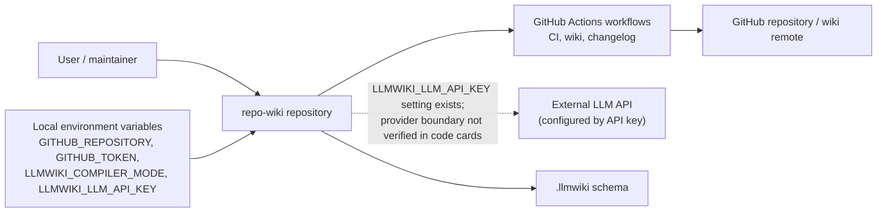
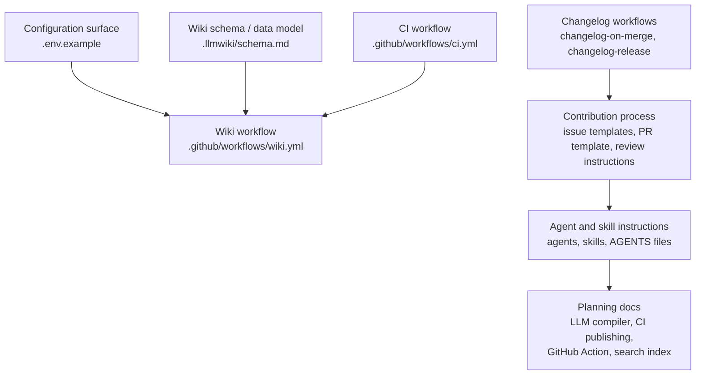
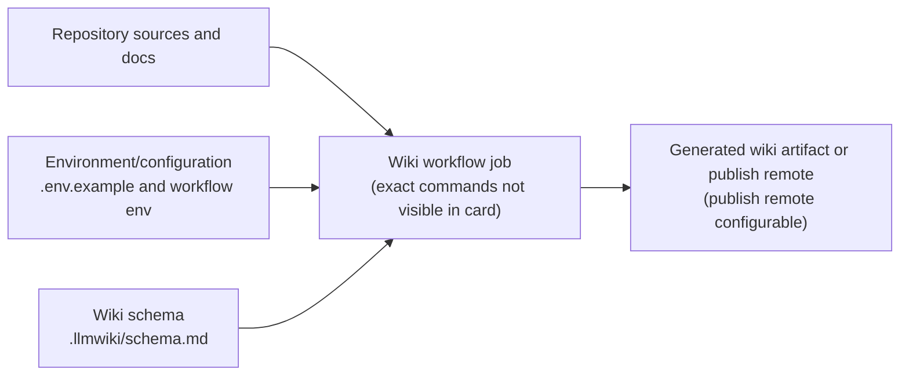
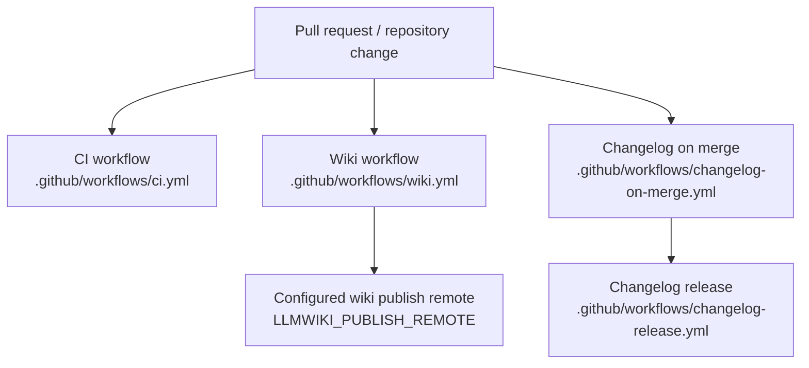

# Architecture

## Executive Architecture Summary

`repo-wiki` is a repository-to-wiki tooling project whose documented purpose is to compile software repository knowledge into a persistent wiki artifact; this product intent is described in the README and planning documents, while the available source-card evidence for this page is mainly configuration, CI, schema, and agent documentation rather than implementation files. [README.md, docs/PLAN.md, `.llmwiki/schema.md`]

At this commit, the architecture that can be validated from the supplied cards consists of these repository-level subsystems:

| Subsystem | Responsibility evidenced by cards | Evidence |
|---|---|---|
| Wiki compilation/publishing automation | A GitHub Actions workflow for wiki-related background work and publishing configuration using `LLMWIKI_COMPILER_MODE` and `LLMWIKI_PUBLISH_REMOTE`. | `.github/workflows/wiki.yml`, `.env.example` |
| CI validation | A CI workflow exists for background validation work. Exact jobs and package commands are not visible in the source-card excerpt, so the page does not assert specific test/build commands. | `.github/workflows/ci.yml` |
| Changelog automation | Separate workflows exist for changelog-on-merge and changelog-release background work; the merge workflow uses `GH_TOKEN`. | `.github/workflows/changelog-on-merge.yml`, `.github/workflows/changelog-release.yml` |
| Wiki data model/schema | A `.llmwiki/schema.md` file is present and categorized as data-model documentation. | `.llmwiki/schema.md` |
| Repository contribution and AI-agent operating model | Issue templates, pull request template, Copilot review instructions, agent role files, and skills define process surfaces around planning, development, docs, quality, review, fixing, navigation, and changelog maintenance. | `.github/ISSUE_TEMPLATE/*.yml`, `.github/pull_request_template.md`, `.github/copilot-review-instructions.md`, `.github/agents/*.agent.md`, `.github/skills/*/SKILL.md`, `AGENTS.md`, `.pi/AGENTS.md` |
| Local/runtime configuration | `.env.example` lists repository, GitHub, compiler-mode, and LLM API-key configuration names; no actual secret values are included here. | `.env.example` |

The documented CLI entry points in README include `npx repo-wiki init --repo . --write-agents`, `npx repo-wiki run ...`, and `npm install`, but these claims are only partially validated by documentation cards in the supplied evidence set; no implementation source files or package manifest were included in the source cards for this page. [README.md]

Key design decisions visible from the evidence are:

- The project treats generated wiki content as a first-class artifact with an explicit schema. [`.llmwiki/schema.md`, docs/PLAN.md]
- The project supports both local configuration and CI-based operation through environment variables and GitHub Actions. [`.env.example`, `.github/workflows/wiki.yml`, `.github/workflows/ci.yml`]
- Publishing behavior is configurable rather than assumed unconditionally, as indicated by `LLMWIKI_PUBLISH_REMOTE` in the wiki workflow card and publishing-plan documentation. [`.github/workflows/wiki.yml`, docs/plans/ci-publishing.md]
- The repository uses GitHub-native collaboration surfaces: issue templates, pull request template, Copilot review instructions, and workflow automation. [`.github/ISSUE_TEMPLATE/config.yml`, `.github/ISSUE_TEMPLATE/epic.yml`, `.github/ISSUE_TEMPLATE/task.yml`, `.github/pull_request_template.md`, `.github/copilot-review-instructions.md`]

## System and Repository Context

The repository boundary visible from the source cards is a GitHub-hosted project with configuration for:

- Local or workflow-driven wiki compilation settings via `.env.example`, including `GITHUB_REPOSITORY`, `GITHUB_TOKEN`, `LLMWIKI_COMPILER_MODE`, and `LLMWIKI_LLM_API_KEY`. [`.env.example`]
- GitHub Actions workflows for CI, wiki work, and changelog automation. [`.github/workflows/ci.yml`, `.github/workflows/wiki.yml`, `.github/workflows/changelog-on-merge.yml`, `.github/workflows/changelog-release.yml`]
- GitHub issue and pull request workflows. [`.github/ISSUE_TEMPLATE/config.yml`, `.github/ISSUE_TEMPLATE/epic.yml`, `.github/ISSUE_TEMPLATE/task.yml`, `.github/pull_request_template.md`]
- Agent and skill instructions for human/AI-assisted repository work. [`.github/agents/coordinator.agent.md`, `.github/agents/developer.agent.md`, `.github/agents/docs.agent.md`, `.github/agents/fixer.agent.md`, `.github/agents/quality.agent.md`, `.github/agents/review.agent.md`, `.github/skills/keep-a-changelog/SKILL.md`, `.github/skills/repo-wiki-navigation/SKILL.md`, `AGENTS.md`, `.pi/AGENTS.md`]

External surfaces that are directly evidenced include GitHub repository metadata/token access and an LLM API-key setting. [`.env.example`] The exact LLM provider interface is documented as a plan for an OpenAI-style chat-completions-compatible boundary, but that is planning documentation rather than implementation evidence in the supplied source cards. [docs/plans/llm-compiler.md]



Diagram evidence and limitations: the repository, environment-variable names, GitHub workflow presence, and schema file are evidenced by source cards. The LLM box is limited to the presence of `LLMWIKI_LLM_API_KEY` and planning documentation; no implementation-level LLM client source was included in the supplied cards. [`.env.example`, `.github/workflows/wiki.yml`, `.github/workflows/ci.yml`, `.github/workflows/changelog-on-merge.yml`, `.github/workflows/changelog-release.yml`, `.llmwiki/schema.md`, docs/plans/llm-compiler.md]

## Major Modules and Responsibilities

### Wiki schema and knowledge-base model

The `.llmwiki/schema.md` file is categorized as both documentation and data-model evidence, indicating that the wiki compiler’s generated artifacts are expected to follow an explicit schema. [`.llmwiki/schema.md`] Planning documentation states the product goal as a persistent compounding wiki over immutable source inputs, but operational details should be treated as partially validated unless confirmed by implementation files. [docs/PLAN.md]

Likely responsibilities of this module/grouping:

- Define the structure or expectations for generated wiki pages and related metadata. [`.llmwiki/schema.md`]
- Provide the model against which compiler output can be interpreted or validated. [`.llmwiki/schema.md`, docs/PLAN.md]

### Wiki execution and publishing workflow

A dedicated `.github/workflows/wiki.yml` workflow exists and is categorized as CI/configuration with background-work and environment-variable hints. [`.github/workflows/wiki.yml`] The workflow uses or references `LLMWIKI_COMPILER_MODE` and `LLMWIKI_PUBLISH_REMOTE`, which indicates compiler-mode and publish-remote behavior are operationally configurable in CI. [`.github/workflows/wiki.yml`]

Planning documentation for CI publishing describes architecture concepts such as fetching existing wiki state and publishing credentials/policy checks, but these should be treated as partially validated plan claims unless the exact workflow body is inspected. [docs/plans/ci-publishing.md, docs/plans/github-action.md]

Likely responsibilities:

- Run wiki generation or validation in GitHub Actions. [`.github/workflows/wiki.yml`]
- Control whether and where generated wiki content is published via configuration. [`.github/workflows/wiki.yml`, docs/plans/ci-publishing.md]

### CI validation workflow

A `.github/workflows/ci.yml` workflow exists and is categorized as CI with background-work hints. [`.github/workflows/ci.yml`] The supplied card does not expose job names, scripts, runtime versions, or package commands, so only the existence of a CI automation surface is asserted here. [`.github/workflows/ci.yml`]

Likely responsibilities:

- Execute repository validation in GitHub Actions. [`.github/workflows/ci.yml`]
- Serve as the main automated quality gate, though exact checks are not verifiable from the provided excerpt. [`.github/workflows/ci.yml`]

### Changelog automation

Two changelog workflows exist:

- `.github/workflows/changelog-on-merge.yml`, categorized as CI/configuration, with background-work and environment-variable hints and `GH_TOKEN`. [`.github/workflows/changelog-on-merge.yml`]
- `.github/workflows/changelog-release.yml`, categorized as CI with background-work hints. [`.github/workflows/changelog-release.yml`]

The repository also contains a `keep-a-changelog` skill file, which suggests changelog format/process guidance for assisted work. [`.github/skills/keep-a-changelog/SKILL.md`]

Likely responsibilities:

- Update or maintain changelog content when changes are merged. [`.github/workflows/changelog-on-merge.yml`]
- Support release-related changelog workflow activity. [`.github/workflows/changelog-release.yml`]
- Provide changelog process instructions through the skill file. [`.github/skills/keep-a-changelog/SKILL.md`]

### Contribution process and issue intake

The repository defines GitHub issue templates for epics and tasks plus issue-template configuration. [`.github/ISSUE_TEMPLATE/config.yml`, `.github/ISSUE_TEMPLATE/epic.yml`, `.github/ISSUE_TEMPLATE/task.yml`] It also includes a pull request template and Copilot review instructions. [`.github/pull_request_template.md`, `.github/copilot-review-instructions.md`]

Likely responsibilities:

- Structure incoming work as epics and tasks. [`.github/ISSUE_TEMPLATE/epic.yml`, `.github/ISSUE_TEMPLATE/task.yml`]
- Standardize pull request submissions. [`.github/pull_request_template.md`]
- Guide AI-assisted code review behavior. [`.github/copilot-review-instructions.md`]

### Agent and skill instruction layer

Agent files are present for coordinator, developer, docs, fixer, quality, and review roles. [`.github/agents/coordinator.agent.md`, `.github/agents/developer.agent.md`, `.github/agents/docs.agent.md`, `.github/agents/fixer.agent.md`, `.github/agents/quality.agent.md`, `.github/agents/review.agent.md`] Skills exist for `keep-a-changelog` and `repo-wiki-navigation`. [`.github/skills/keep-a-changelog/SKILL.md`, `.github/skills/repo-wiki-navigation/SKILL.md`] Root and `.pi` agent instructions are also present. [`AGENTS.md`, `.pi/AGENTS.md`, `.pi/settings.json`]

Likely responsibilities:

- Encode repository-specific guidance for human/AI agent collaboration. [`.github/agents/*.agent.md`, `AGENTS.md`, `.pi/AGENTS.md`]
- Provide reusable task skills for changelog maintenance and repo-wiki navigation. [`.github/skills/keep-a-changelog/SKILL.md`, `.github/skills/repo-wiki-navigation/SKILL.md`]
- Configure `.pi` tool behavior or agent settings, though exact semantics are not inferable from the card excerpt. [`.pi/settings.json`]

### Local configuration surface

`.env.example` defines expected environment variable names for local configuration: `GITHUB_REPOSITORY`, `GITHUB_TOKEN`, `LLMWIKI_COMPILER_MODE`, and `LLMWIKI_LLM_API_KEY`. [`.env.example`] These names indicate integration points with GitHub and an LLM service, but no secret values are included or reproduced. [`.env.example`]

Likely responsibilities:

- Provide a template for local runs or developer setup. [`.env.example`]
- Identify required/optional runtime configuration names without committing secret values. [`.env.example`, `.gitignore`]

### Planned compiler/search/action modules

Several documentation cards describe planned or partially validated architecture areas:

| Planned area | Status in supplied evidence | Evidence |
|---|---:|---|
| LLM compiler/provider boundary | Partially validated documentation; source-card evidence only confirms LLM API-key configuration. | docs/plans/llm-compiler.md, `.env.example` |
| GitHub Action packaging/publishing behavior | Partially validated documentation; source-card evidence confirms workflow configuration exists. | docs/plans/github-action.md, `.github/workflows/wiki.yml` |
| CI publishing | Partially validated documentation; source-card evidence confirms wiki workflow and publish-remote env var. | docs/plans/ci-publishing.md, `.github/workflows/wiki.yml` |
| Search index, `repo-wiki search`, and `repo-wiki query` | Partially validated documentation only in supplied cards; no source implementation cards were provided here. | docs/plans/search-index.md |
| Incremental mode | Marked stale in the supplied documentation card; do not rely on it as current behavior. | docs/plans/incremental-mode.md |



Diagram evidence and limitations: this component diagram is repository-structure-oriented. It shows configuration and schema as inputs to the wiki workflow because the relevant env vars and schema file exist, but it does not prove implementation-level imports or execution order. [`.env.example`, `.llmwiki/schema.md`, `.github/workflows/wiki.yml`, `.github/workflows/ci.yml`, `.github/workflows/changelog-on-merge.yml`, `.github/workflows/changelog-release.yml`, `.github/ISSUE_TEMPLATE/config.yml`, `.github/pull_request_template.md`, `.github/agents/coordinator.agent.md`, docs/plans/llm-compiler.md]

## Runtime, Data, and Control-Flow Relationships

The strongest runtime evidence in the supplied cards is environment-variable and workflow evidence:

1. Local or CI execution may be configured with repository and token settings such as `GITHUB_REPOSITORY` and `GITHUB_TOKEN`. [`.env.example`]
2. Wiki execution/publishing can be configured with `LLMWIKI_COMPILER_MODE` and, in the workflow, `LLMWIKI_PUBLISH_REMOTE`. [`.github/workflows/wiki.yml`, `.env.example`]
3. LLM-backed compilation is suggested by `LLMWIKI_LLM_API_KEY`, but no provider client or call path is visible in the supplied source cards. [`.env.example`, docs/plans/llm-compiler.md]
4. Changelog-on-merge automation uses or references `GH_TOKEN`. [`.github/workflows/changelog-on-merge.yml`]

A conservative control/data-flow view is:



This diagram is inferred from workflow/configuration presence and planning documentation, not from implementation imports or a package script listing. [`.github/workflows/wiki.yml`, `.env.example`, `.llmwiki/schema.md`, docs/plans/ci-publishing.md, docs/plans/github-action.md]

No reliable sequence diagram is included because the supplied source cards do not expose a concrete implementation call sequence, CLI handler, package script, GitHub Action job steps, or LLM provider interaction. [`.github/workflows/wiki.yml`, README.md, docs/plans/llm-compiler.md]

## Build, Test, Deployment, and Operational Surfaces

### CI and workflow inventory

| Workflow/configuration | Operational role | Evidence strength |
|---|---|---:|
| `.github/workflows/ci.yml` | CI validation/background work exists. Exact jobs are not visible in the card excerpt. | High for existence; low for job details. |
| `.github/workflows/wiki.yml` | Wiki-related workflow exists; uses `LLMWIKI_COMPILER_MODE` and `LLMWIKI_PUBLISH_REMOTE`. | High for existence and env names; low for command details. |
| `.github/workflows/changelog-on-merge.yml` | Changelog automation on merge exists; uses `GH_TOKEN`. | High for existence and env name; low for command details. |
| `.github/workflows/changelog-release.yml` | Release changelog automation exists. | High for existence; low for job details. |
| `.env.example` | Local runtime/config template for GitHub and LLM/wiki compiler settings. | High for env names; low for requiredness/default behavior. |

Citations: [`.github/workflows/ci.yml`, `.github/workflows/wiki.yml`, `.github/workflows/changelog-on-merge.yml`, `.github/workflows/changelog-release.yml`, `.env.example`]

### Documented local commands

README documentation lists commands including:

```bash
npx repo-wiki init --repo . --write-agents
npx repo-wiki run ...
npm install
```

These commands are cited as documentation claims, not fully verified behavior, because no `package.json`, CLI entrypoint, or source implementation card was supplied for this page. [README.md]

### Build/test/deploy flow diagram



Diagram limitations: workflow files exist, but the supplied source-card excerpts do not expose trigger clauses, job dependencies, or exact sequencing. The arrows represent likely operational relationships by workflow purpose/name and configuration, not verified `needs:` dependencies or event triggers. [`.github/workflows/ci.yml`, `.github/workflows/wiki.yml`, `.github/workflows/changelog-on-merge.yml`, `.github/workflows/changelog-release.yml`]

## Cross-Cutting Concerns

### Configuration

The repository exposes configuration through environment variable names in `.env.example` and workflow cards:

| Variable | Evidenced surface | Notes |
|---|---|---|
| `GITHUB_REPOSITORY` | `.env.example` | Indicates GitHub repository identity is configurable. |
| `GITHUB_TOKEN` | `.env.example` | Indicates GitHub API/auth access may be needed locally or operationally. |
| `GH_TOKEN` | `changelog-on-merge` workflow | Used/referenced by changelog-on-merge workflow. |
| `LLMWIKI_COMPILER_MODE` | `.env.example`, wiki workflow | Indicates compiler mode is configurable locally and in CI. |
| `LLMWIKI_LLM_API_KEY` | `.env.example` | Indicates an external LLM API credential can be configured. |
| `LLMWIKI_PUBLISH_REMOTE` | wiki workflow | Indicates wiki publishing remote can be configured in CI. |

Citations: [`.env.example`, `.github/workflows/wiki.yml`, `.github/workflows/changelog-on-merge.yml`]

### Security and secrets

The evidence includes token/API-key variable names but no secret values. [`.env.example`, `.github/workflows/changelog-on-merge.yml`] Architecture documentation should continue to avoid copying secret values and should refer only to variable names and expected secret handling. [`.env.example`]

Security-relevant boundaries include:

- GitHub token usage for repository/wiki/changelog operations. [`.env.example`, `.github/workflows/changelog-on-merge.yml`]
- LLM API-key usage for any LLM-backed compilation path. [`.env.example`, docs/plans/llm-compiler.md]
- Publish-remote configuration for wiki deployment behavior. [`.github/workflows/wiki.yml`]

### API and external integration boundaries

Directly evidenced external boundaries:

- GitHub repository and token access. [`.env.example`]
- GitHub Actions as automation runtime. [`.github/workflows/ci.yml`, `.github/workflows/wiki.yml`, `.github/workflows/changelog-on-merge.yml`, `.github/workflows/changelog-release.yml`]
- LLM API-key configuration. [`.env.example`]

Partially validated/planned external boundary:

- Provider-agnostic, OpenAI-style chat-completions compatibility is described in the LLM compiler plan, but no implementation source card confirms it. [docs/plans/llm-compiler.md]

### Data model and generated artifacts

The `.llmwiki/schema.md` card is the strongest evidence for a formal wiki data model. [`.llmwiki/schema.md`] README and plan documentation describe generated wiki output and a persistent wiki knowledge base, but operational claims about exact output files or default workflow outputs should remain secondary unless source implementation or workflow command details confirm them. [README.md, docs/PLAN.md]

### Documentation trust and drift management

The documentation cards supplied for this page have mixed statuses:

| Documentation card | Status | Architecture handling |
|---|---:|---|
| `README.md` | partially_validated | Use for CLI intent and scope, but do not treat commands as implementation proof without package/CLI source evidence. |
| `docs/PLAN.md` | partially_validated | Use for product vision and rationale. |
| `docs/WHY.md` | partially_validated | Use for rationale, not runtime behavior. |
| `docs/plans/ci-publishing.md` | partially_validated | Use for intended publishing architecture with caveats. |
| `docs/plans/github-action.md` | partially_validated | Use for intended GitHub Action behavior with caveats. |
| `docs/plans/llm-compiler.md` | partially_validated | Use for intended LLM provider boundary with caveats. |
| `docs/plans/search-index.md` | partially_validated | Use for planned search/index behavior only. |
| `docs/plans/incremental-mode.md` | stale | Do not rely on it for current architecture. |

Citations: [README.md, docs/PLAN.md, docs/WHY.md, docs/plans/ci-publishing.md, docs/plans/github-action.md, docs/plans/llm-compiler.md, docs/plans/search-index.md, docs/plans/incremental-mode.md]

## Caveats and Open Questions

- No implementation source files, package manifest, CLI entrypoint, or TypeScript module cards were included in the supplied source cards, so this architecture page cannot verify internal call graphs, class/function responsibilities, runtime package dependencies, or exact CLI behavior. [`.tsbuildinfo`, README.md]
- The presence of `.tsbuildinfo` suggests TypeScript build metadata exists, but it is not sufficient evidence to describe TypeScript source modules or build scripts. [`.tsbuildinfo`]
- Workflow files are present, but the card excerpts do not expose triggers, jobs, steps, `needs:` relationships, runtime versions, package manager commands, artifact upload paths, or deployment commands. Diagrams involving workflows are therefore repository-structure/control-surface diagrams, not verified execution graphs. [`.github/workflows/ci.yml`, `.github/workflows/wiki.yml`, `.github/workflows/changelog-on-merge.yml`, `.github/workflows/changelog-release.yml`]
- README-documented commands such as `npx repo-wiki init --repo . --write-agents` and `npx repo-wiki run ...` are treated as partially validated documentation claims, not authoritative implementation evidence in this page. [README.md]
- The LLM compiler/provider architecture is supported by environment-variable evidence for `LLMWIKI_LLM_API_KEY` and by planning documentation, but no LLM client implementation was available in the source cards. [`.env.example`, docs/plans/llm-compiler.md]
- Search-index behavior, `repo-wiki search`, and `repo-wiki query` are described in planning documentation but are not verified by source cards here. [docs/plans/search-index.md]
- Incremental mode documentation is explicitly marked stale in the supplied documentation card, so it should not be used as a current architecture source without fresh source validation. [docs/plans/incremental-mode.md]
- The exact semantics of `.pi/settings.json` and `.pi/AGENTS.md` are not inferable from the card excerpts beyond their existence as agent/tooling configuration documentation. [`.pi/settings.json`, `.pi/AGENTS.md`]
- The wiki schema file is identified as data-model documentation, but this page does not assert specific schema fields because the supplied card excerpt does not include its body. [`.llmwiki/schema.md`]

<!-- HUMAN_NOTES_START -->
<!-- HUMAN_NOTES_END -->
