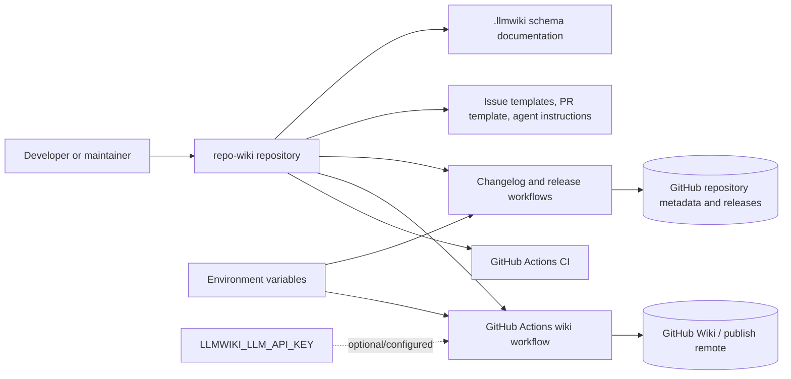
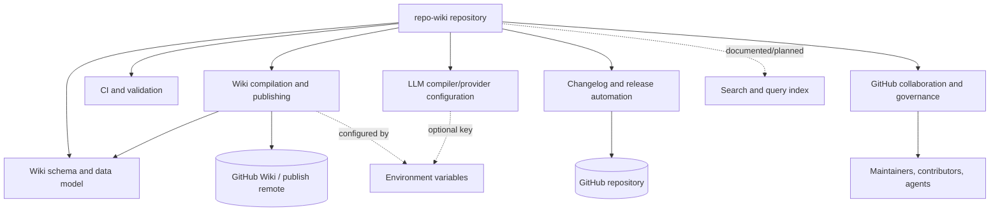
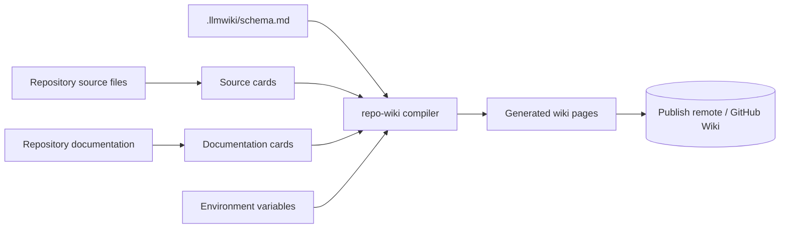
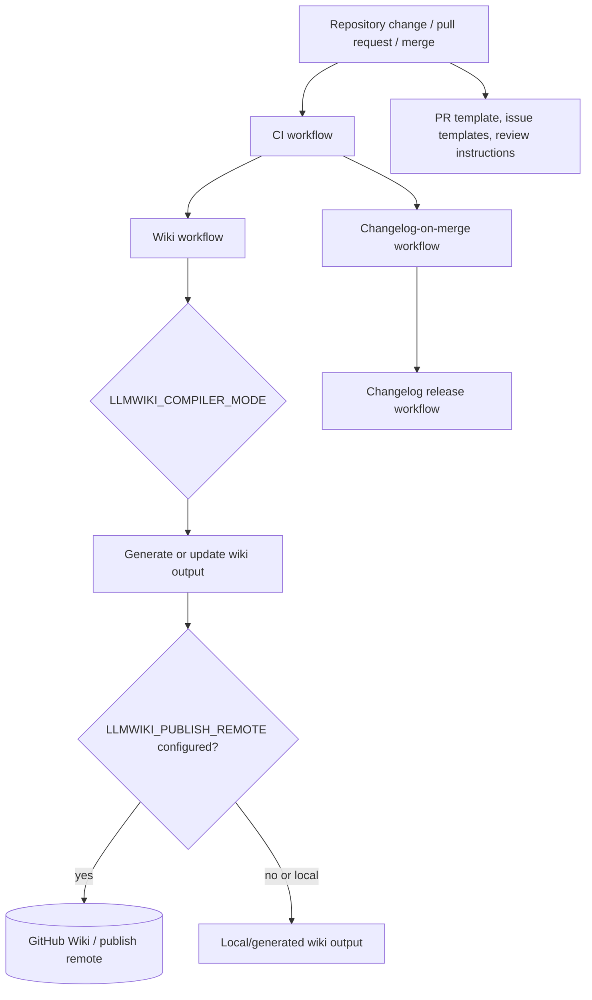

# Architecture

## Executive Architecture Summary

`repo-wiki` is a repository-to-wiki tool whose documented product direction is to compile source evidence into a persistent GitHub Wiki knowledge base. The available evidence for this page is primarily repository metadata, CI workflow cards, configuration files, and documentation cards; no application source files such as TypeScript modules were included in the provided source-card set. Operational architecture details below are therefore conservative and limited to verified repository surfaces. Sources: `.llmwiki/schema.md`, `.github/workflows/wiki.yml`, `.env.example`, documentation card `README.md`, documentation card `docs/PLAN.md`.

The repository exposes several high-level architectural surfaces:

| Surface | Evidence | Architectural role |
|---|---|---|
| Wiki compiler / publisher configuration | `.env.example`, `.github/workflows/wiki.yml` | Indicates a workflow-capable wiki generation/publishing path controlled by `LLMWIKI_COMPILER_MODE` and `LLMWIKI_PUBLISH_REMOTE`. |
| GitHub integration | `.env.example`, `.github/workflows/wiki.yml`, `.github/workflows/changelog-on-merge.yml` | Indicates integration with GitHub repositories, GitHub tokens, workflow automation, changelog automation, and likely GitHub Wiki publishing. |
| CI and quality automation | `.github/workflows/ci.yml` | Provides a repository-level validation surface. The exact commands are not available in the source-card excerpt. |
| Changelog/release automation | `.github/workflows/changelog-on-merge.yml`, `.github/workflows/changelog-release.yml`, `.github/skills/keep-a-changelog/SKILL.md` | Indicates automated or assisted changelog maintenance and release-related workflow behavior. |
| LLM-backed compilation mode | `.env.example`, documentation card `docs/plans/llm-compiler.md` | Indicates support or planned support for LLM compilation through `LLMWIKI_LLM_API_KEY`; exact provider implementation is not verified from source code in the provided cards. |
| Project governance and agent guidance | `AGENTS.md`, `.pi/AGENTS.md`, `.github/agents/*.agent.md`, `.github/copilot-review-instructions.md`, `.github/pull_request_template.md` | Provides human/agent contribution, review, quality, documentation, and coordination guidance. |
| Wiki data model/schema | `.llmwiki/schema.md` | Defines or documents repository wiki schema/data-model expectations. Exact schema fields are not available in the card excerpt. |

Key design decisions that are supported by current evidence:

1. The project is configured around GitHub as an operating environment, with repository identity and token-based access exposed through environment variable names such as `GITHUB_REPOSITORY`, `GITHUB_TOKEN`, and workflow `GH_TOKEN`. Sources: `.env.example`, `.github/workflows/changelog-on-merge.yml`.
2. Wiki compilation/publishing is an explicit operational concern, with workflow-level configuration for `LLMWIKI_COMPILER_MODE` and `LLMWIKI_PUBLISH_REMOTE`. Source: `.github/workflows/wiki.yml`.
3. The project separates source evidence from generated wiki/schema concerns, suggested by the presence of `.llmwiki/schema.md` and documentation cards describing source cards and documentation cards. Sources: `.llmwiki/schema.md`, documentation card `docs/PLAN.md`.
4. The repository uses GitHub-native collaboration surfaces: issue templates for epics and tasks, pull request templates, Copilot review instructions, and specialized agent instruction files. Sources: `.github/ISSUE_TEMPLATE/epic.yml`, `.github/ISSUE_TEMPLATE/task.yml`, `.github/pull_request_template.md`, `.github/copilot-review-instructions.md`, `.github/agents/coordinator.agent.md`.

## System and Repository Context

### Repository boundaries

The repository boundary appears to contain:

- Tooling and configuration for compiling repository knowledge into wiki pages. Sources: `.llmwiki/schema.md`, `.github/workflows/wiki.yml`, `.env.example`, documentation card `README.md`.
- GitHub Actions workflows for CI, wiki generation/publishing, changelog-on-merge, and changelog-release tasks. Sources: `.github/workflows/ci.yml`, `.github/workflows/wiki.yml`, `.github/workflows/changelog-on-merge.yml`, `.github/workflows/changelog-release.yml`.
- GitHub project governance assets including issue templates, pull request template, Copilot review instructions, and agent instruction files. Sources: `.github/ISSUE_TEMPLATE/config.yml`, `.github/ISSUE_TEMPLATE/epic.yml`, `.github/ISSUE_TEMPLATE/task.yml`, `.github/pull_request_template.md`, `.github/copilot-review-instructions.md`, `.github/agents/*.agent.md`.
- A wiki schema/data-model documentation area under `.llmwiki`. Source: `.llmwiki/schema.md`.
- Local/environment configuration examples. Source: `.env.example`.

The provided cards do **not** include package manifests, application entry points, CLI source files, or import graphs. As a result, public APIs and executable entry points cannot be verified directly from code in this compilation. Documentation cards mention local CLI/package behavior and compiled output under `dist/`, but that claim is only partially validated by documentation evidence here. Source: documentation card `README.md`.

### External surfaces

| External surface | Evidence | Confidence |
|---|---|---|
| GitHub repository metadata | `GITHUB_REPOSITORY` in `.env.example` | Medium |
| GitHub authentication/token usage | `GITHUB_TOKEN` in `.env.example`; `GH_TOKEN` in `.github/workflows/changelog-on-merge.yml` | Medium |
| Wiki publishing remote | `LLMWIKI_PUBLISH_REMOTE` in `.github/workflows/wiki.yml` | Medium |
| Compiler mode selection | `LLMWIKI_COMPILER_MODE` in `.env.example` and `.github/workflows/wiki.yml` | Medium |
| LLM provider access/key | `LLMWIKI_LLM_API_KEY` in `.env.example` | Low to medium; environment variable exists, implementation details not verified |
| GitHub Actions runtime | Workflow files under `.github/workflows/` | Medium |
| GitHub issue/PR collaboration UI | Issue templates and pull request template under `.github/` | Medium |

### Context diagram

The following diagram is supported by configuration and workflow file presence. It intentionally shows repository-boundary and operational surfaces only; it does not assert internal source-code call relationships.

Evidence: `.github/workflows/ci.yml`, `.github/workflows/wiki.yml`, `.github/workflows/changelog-on-merge.yml`, `.github/workflows/changelog-release.yml`, `.env.example`, `.llmwiki/schema.md`, `.github/ISSUE_TEMPLATE/*.yml`, `.github/pull_request_template.md`.

## Major Modules and Responsibilities

Because the provided source-card set contains no application source modules, “modules” in this section are repository-level logical modules derived from configuration, workflow, schema, and planning evidence.

### Wiki compilation and publishing module

**Responsibility:** Generate or update wiki content from repository evidence and optionally publish it to a remote wiki target.

**Evidence:**

- `.github/workflows/wiki.yml` includes wiki workflow configuration and uses environment variables `LLMWIKI_COMPILER_MODE` and `LLMWIKI_PUBLISH_REMOTE`.
- `.env.example` includes `LLMWIKI_COMPILER_MODE`, `GITHUB_REPOSITORY`, `GITHUB_TOKEN`, and `LLMWIKI_LLM_API_KEY`.
- `.llmwiki/schema.md` is a data-model/schema documentation artifact for the wiki system.
- Documentation card `README.md` describes a dual-role package and local CLI/package verification flow, but source code for CLI entry points is not included in the source cards.
- Documentation card `docs/plans/ci-publishing.md` discusses CI publishing architecture, but it is secondary evidence.

**Confidence:** Medium for workflow/configuration existence; low for internal implementation details.

### CI and validation module

**Responsibility:** Validate repository changes in GitHub Actions.

**Evidence:**

- `.github/workflows/ci.yml` is a CI workflow file with background-work runtime hints.
- Documentation card `README.md` claims `npm test`, `npm run check`, and `npm run coverage` require successful TypeScript compilation, but package scripts and source code were not included in the provided source cards.

**Confidence:** Medium for CI workflow existence; low for exact commands and validation stages.

### Changelog and release automation module

**Responsibility:** Maintain changelog/release artifacts around merge and release events.

**Evidence:**

- `.github/workflows/changelog-on-merge.yml` is a workflow with `GH_TOKEN` environment-variable usage and background-work hints.
- `.github/workflows/changelog-release.yml` is a release/changelog workflow.
- `.github/skills/keep-a-changelog/SKILL.md` provides supporting documentation for changelog behavior.

**Confidence:** Medium for automation surface; low for exact changelog mutation rules.

### GitHub collaboration and governance module

**Responsibility:** Standardize issue creation, pull request review, agent behavior, and repository contribution processes.

**Evidence:**

- Issue templates: `.github/ISSUE_TEMPLATE/config.yml`, `.github/ISSUE_TEMPLATE/epic.yml`, `.github/ISSUE_TEMPLATE/task.yml`.
- Pull request template: `.github/pull_request_template.md`.
- Copilot review instructions: `.github/copilot-review-instructions.md`.
- Agent instructions: `.github/agents/coordinator.agent.md`, `.github/agents/developer.agent.md`, `.github/agents/docs.agent.md`, `.github/agents/fixer.agent.md`, `.github/agents/quality.agent.md`, `.github/agents/review.agent.md`.
- Additional project/agent guidance: `AGENTS.md`, `.pi/AGENTS.md`, `.pi/settings.json`.

**Confidence:** Medium.

### Schema and knowledge-base data model module

**Responsibility:** Define or document how wiki pages, cards, or repository-derived knowledge artifacts should be structured.

**Evidence:**

- `.llmwiki/schema.md` is explicitly categorized as data-model documentation.
- Documentation card `docs/PLAN.md` describes a schema-oriented LLM Wiki pattern, but that is secondary evidence.

**Confidence:** Medium for the presence of schema documentation; low for specific schema fields.

### LLM compiler/provider integration module

**Responsibility:** Provide LLM-assisted compilation of source evidence into wiki pages.

**Evidence:**

- `.env.example` includes `LLMWIKI_LLM_API_KEY`.
- Documentation card `docs/plans/llm-compiler.md` says the first production LLM boundary should be provider-agnostic and compatible with OpenAI-style chat completions. This is partially validated documentation, not source implementation evidence.

**Confidence:** Low to medium. Configuration indicates a planned or existing LLM mode; implementation boundaries are not verified from code in the provided source cards.

### Search/query module

**Responsibility:** Provide local search or query over generated wiki/source/documentation artifacts.

**Evidence:**

- Documentation card `docs/plans/search-index.md` describes a local search index over generated wiki pages, source cards, and documentation cards for `repo-wiki search` and `repo-wiki query`.
- No source-code or workflow evidence for a search index implementation was included in the source cards.

**Confidence:** Low; treated as planned or partially validated documentation only.

### Component/module diagram

This diagram is inferred from repository configuration and documented plan modules. It does **not** assert code-level imports or runtime calls.

Evidence: `.github/workflows/wiki.yml`, `.github/workflows/ci.yml`, `.github/workflows/changelog-on-merge.yml`, `.github/workflows/changelog-release.yml`, `.env.example`, `.llmwiki/schema.md`, `.github/ISSUE_TEMPLATE/*.yml`, `.github/agents/*.agent.md`, documentation cards `docs/plans/search-index.md`, `docs/plans/llm-compiler.md`.

## Runtime, Data, and Control-Flow Relationships

### Verified runtime/configuration relationships

The verified runtime relationships are configuration-level rather than code-level:

| Relationship | Evidence | Claim status |
|---|---|---|
| Wiki workflow is controlled by wiki-related environment variables | `.github/workflows/wiki.yml` lists `LLMWIKI_COMPILER_MODE` and `LLMWIKI_PUBLISH_REMOTE` | Supported by workflow card metadata |
| Local/environment setup includes GitHub and LLM-related variables | `.env.example` lists `GITHUB_REPOSITORY`, `GITHUB_TOKEN`, `LLMWIKI_COMPILER_MODE`, `LLMWIKI_LLM_API_KEY` | Supported by configuration card metadata |
| Changelog-on-merge workflow uses GitHub token access | `.github/workflows/changelog-on-merge.yml` lists `GH_TOKEN` | Supported by workflow card metadata |
| Schema/data model exists separately from workflow configuration | `.llmwiki/schema.md` | Supported by repository structure |

### Inferred wiki compilation data path

The documentation cards describe a compiler that uses source cards, documentation cards, schema, and existing wiki state to produce wiki pages. However, the provided source cards do not include the compiler source. The following data path is therefore an architectural inference grounded in documentation and configuration, not verified import/runtime evidence.

Evidence: `.llmwiki/schema.md`, `.env.example`, `.github/workflows/wiki.yml`, documentation card `docs/PLAN.md`, documentation card `docs/plans/ci-publishing.md`.

### Control-flow limitations

No source-card import graph, CLI source file, package manifest, or executable source file was provided. Therefore this page cannot verify:

- The internal call graph for wiki compilation.
- Whether local CLI commands and GitHub Actions invoke the same executable entry point.
- Whether LLM compilation is implemented, optional, mocked, or planned.
- Whether search/query commands are implemented.
- The exact sequence for publishing to GitHub Wiki.

Sources for limitation: absence of application source cards in provided source-card list; documentation cards `README.md`, `docs/plans/llm-compiler.md`, `docs/plans/search-index.md`.

## Build, Test, Deployment, and Operational Surfaces

### GitHub Actions workflows

| Workflow | Evidence path | Architectural role | Confidence |
|---|---|---|---|
| CI | `.github/workflows/ci.yml` | Repository validation workflow. Exact jobs/commands are not available in the source-card excerpt. | Medium |
| Wiki | `.github/workflows/wiki.yml` | Wiki generation/publishing workflow configured with `LLMWIKI_COMPILER_MODE` and `LLMWIKI_PUBLISH_REMOTE`. | Medium |
| Changelog on merge | `.github/workflows/changelog-on-merge.yml` | Background workflow using `GH_TOKEN`; likely updates changelog after merges. Exact trigger/action details are not available in the card excerpt. | Medium |
| Changelog release | `.github/workflows/changelog-release.yml` | Background workflow for changelog/release operations. Exact trigger/action details are not available in the card excerpt. | Medium |

### Local development and package scripts

Documentation card `README.md` states that the local CLI and package verification flow run against compiled output in `dist/`, and that `npm test`, `npm run check`, and `npm run coverage` require successful TypeScript compilation. This page treats that as secondary, partially validated evidence because no `package.json`, TypeScript source files, or build scripts were included in the source-card set. Source: documentation card `README.md`.

### Build/test/deploy flow diagram

This flow is supported at the workflow-file level, but the individual job commands are not verified from the card excerpts.

Evidence: `.github/workflows/ci.yml`, `.github/workflows/wiki.yml`, `.github/workflows/changelog-on-merge.yml`, `.github/workflows/changelog-release.yml`, `.env.example`, `.github/pull_request_template.md`, `.github/ISSUE_TEMPLATE/*.yml`.

### Operational configuration

| Variable | Evidence path | Purpose inferred from name/context | Sensitivity |
|---|---|---|---|
| `GITHUB_REPOSITORY` | `.env.example` | Identifies target/source GitHub repository. | Low |
| `GITHUB_TOKEN` | `.env.example` | Authenticates GitHub operations. | Secret |
| `GH_TOKEN` | `.github/workflows/changelog-on-merge.yml` | Authenticates GitHub CLI/API operations in changelog workflow. | Secret |
| `LLMWIKI_COMPILER_MODE` | `.env.example`, `.github/workflows/wiki.yml` | Selects compiler mode. Exact modes not verified. | Low |
| `LLMWIKI_LLM_API_KEY` | `.env.example` | Authenticates LLM provider access. | Secret |
| `LLMWIKI_PUBLISH_REMOTE` | `.github/workflows/wiki.yml` | Configures wiki publish remote. | Medium; may reveal repository remote if set |

No environment variable values are included here. Sources: `.env.example`, `.github/workflows/wiki.yml`, `.github/workflows/changelog-on-merge.yml`.

## Cross-Cutting Concerns

### Configuration management

The repository uses environment variables for GitHub integration, wiki compiler mode, publish target, and LLM access. Sources: `.env.example`, `.github/workflows/wiki.yml`, `.github/workflows/changelog-on-merge.yml`.

Configuration-sensitive behavior includes:

- Local or CI selection of compiler mode through `LLMWIKI_COMPILER_MODE`. Sources: `.env.example`, `.github/workflows/wiki.yml`.
- Publishing destination through `LLMWIKI_PUBLISH_REMOTE`. Source: `.github/workflows/wiki.yml`.
- Authentication through GitHub and LLM tokens. Sources: `.env.example`, `.github/workflows/changelog-on-merge.yml`.

### Security and secrets

The repository has multiple token-bearing configuration surfaces:

- `GITHUB_TOKEN` in `.env.example`.
- `GH_TOKEN` in `.github/workflows/changelog-on-merge.yml`.
- `LLMWIKI_LLM_API_KEY` in `.env.example`.

These variables should be treated as secrets when populated. This page cites only variable names and does not include secret values. Sources: `.env.example`, `.github/workflows/changelog-on-merge.yml`.

### Data model and schema

`.llmwiki/schema.md` is categorized as data-model documentation and appears to define the schema contract for generated wiki artifacts or cards. Exact schema details are not available in the provided excerpt. Source: `.llmwiki/schema.md`.

### Documentation trust model

The repository includes many documentation and planning files. Under the compilation rules for this wiki page, source code and CI/configuration are authoritative, while Markdown documentation is secondary. Therefore:

- Workflow and environment-variable claims are based on CI/configuration cards where possible. Sources: `.github/workflows/*.yml`, `.env.example`.
- CLI, search, LLM-provider, and product-vision claims from documentation cards are marked as partially validated or low confidence unless supported by configuration evidence. Sources: documentation cards `README.md`, `docs/plans/search-index.md`, `docs/plans/llm-compiler.md`.

### Governance and review process

The repository is structured for GitHub-based collaboration and agent-assisted maintenance:

- Issue templates divide work into epics and tasks. Sources: `.github/ISSUE_TEMPLATE/epic.yml`, `.github/ISSUE_TEMPLATE/task.yml`.
- Pull request template and Copilot review instructions provide review surfaces. Sources: `.github/pull_request_template.md`, `.github/copilot-review-instructions.md`.
- Agent instruction files define roles such as coordinator, developer, docs, fixer, quality, and review. Sources: `.github/agents/coordinator.agent.md`, `.github/agents/developer.agent.md`, `.github/agents/docs.agent.md`, `.github/agents/fixer.agent.md`, `.github/agents/quality.agent.md`, `.github/agents/review.agent.md`.

### Changelog discipline

The repository includes both workflow automation and skill guidance for changelog maintenance. Sources: `.github/workflows/changelog-on-merge.yml`, `.github/workflows/changelog-release.yml`, `.github/skills/keep-a-changelog/SKILL.md`.

## Caveats and Open Questions

### Caveats

1. **No application source cards were provided.** This page cannot verify the internal architecture, class/function boundaries, CLI entry points, package exports, or import graph. Evidence gap: provided source-card list contains workflows, configuration, docs, schema, and metadata, but no application source files.
2. **CLI behavior is documentation-backed, not source-verified here.** Documentation card `README.md` mentions local CLI/package verification and compiled output in `dist/`, but no `package.json`, `src/`, or `dist/` source cards were included.
3. **LLM integration is only partially verified.** `LLMWIKI_LLM_API_KEY` exists in `.env.example`, and documentation card `docs/plans/llm-compiler.md` describes an LLM compiler boundary, but no implementation source was available.
4. **Search/query functionality is plan-backed only in this evidence set.** Documentation card `docs/plans/search-index.md` describes `repo-wiki search` and `repo-wiki query`, but no implementation or workflow source was included.
5. **Diagrams are repository-structure/configuration diagrams, not code-call diagrams.** The diagrams in this page are based on workflow/configuration/docs evidence and are explicitly not import graphs.
6. **Workflow internals are not fully known from excerpts.** The cards establish workflow file presence and some environment variables, but not complete triggers, jobs, permissions, or command sequences.

### Open questions

| Question | Why it matters | Evidence needed |
|---|---|---|
| What are the actual CLI entry points and package exports? | Determines public API and runtime control flow. | `package.json`, CLI source files, compiled entry points. |
| How does the compiler select between deterministic/local and LLM modes? | Determines runtime architecture and operational cost/security. | Compiler source, tests, workflow command details. |
| What is the exact `.llmwiki` schema? | Determines generated wiki page contract and validation rules. | Full `.llmwiki/schema.md`, schema tests, generated examples. |
| Does the GitHub Actions wiki workflow publish to GitHub Wiki, upload artifacts, or both? | Determines deployment architecture. | Full `.github/workflows/wiki.yml` contents and related scripts. |
| Are changelog updates fully automated or assisted? | Determines release governance and required maintainer actions. | Full changelog workflow files, release scripts, tests. |
| Is search/query implemented or only planned? | Determines whether search is part of current architecture. | Source files and tests for `repo-wiki search` / `repo-wiki query`. |
| What tests define architectural contracts? | Tests are high-authority evidence for behavior. | Test source cards, CI command details, coverage configuration. |

<!-- HUMAN_NOTES_START -->
<!-- HUMAN_NOTES_END -->
