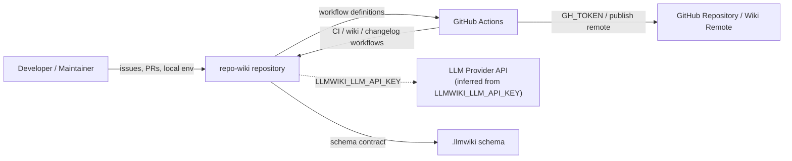
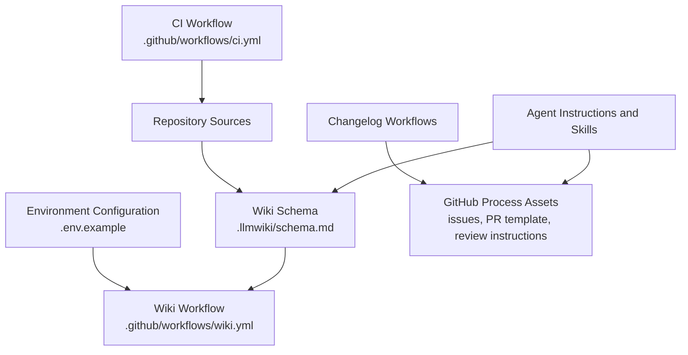
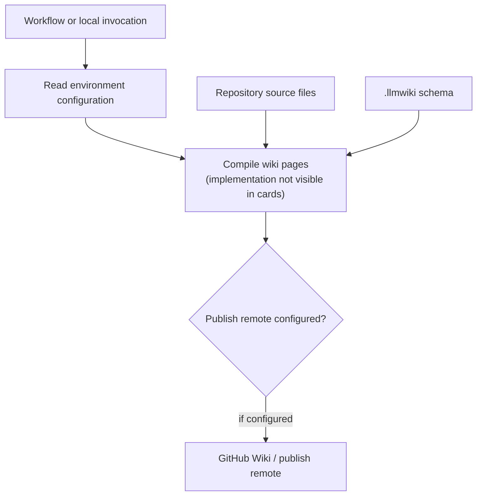
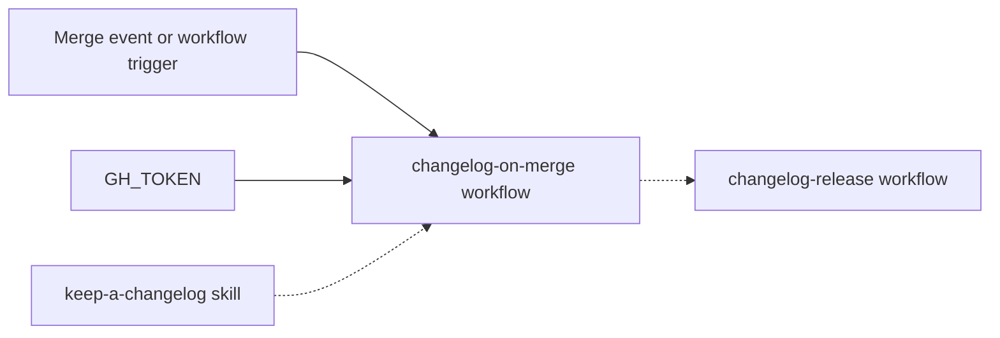
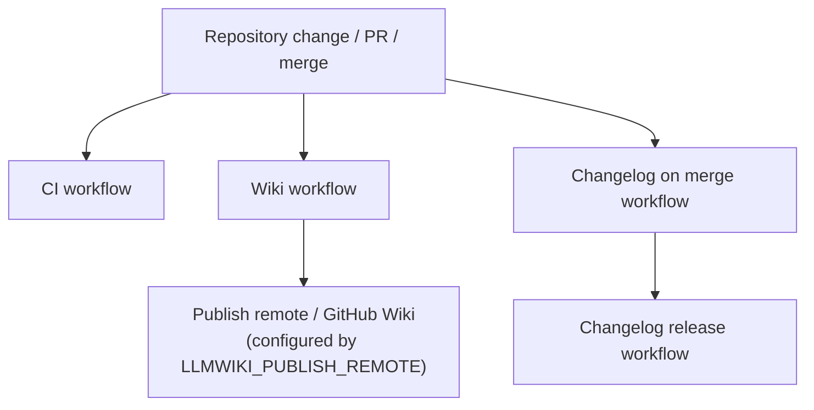

# Architecture

## Executive Architecture Summary

`repo-wiki` appears to be a repository-to-GitHub-Wiki knowledge-base tool with automation around wiki generation, publishing, changelog maintenance, and agent-oriented development workflows. This architecture page is generated in bootstrap mode from repository source cards, CI/configuration files, and partially validated documentation cards. The available evidence strongly confirms the presence of GitHub Actions workflows for CI, wiki generation/publishing, and changelog automation, plus environment configuration for GitHub and LLM-backed wiki compilation. It does **not** include full application source files in the provided source-card set, so detailed runtime internals, package scripts, CLI implementation, and import-level dependencies are not verified here. [`.github/workflows/ci.yml`](.github/workflows/ci.yml), [`.github/workflows/wiki.yml`](.github/workflows/wiki.yml), [`.github/workflows/changelog-on-merge.yml`](.github/workflows/changelog-on-merge.yml), [`.github/workflows/changelog-release.yml`](.github/workflows/changelog-release.yml), [`.env.example`](.env.example)

The repository’s observable architecture has these main areas:

| Area | Responsibility | Evidence | Confidence |
|---|---|---:|---|
| Wiki compiler / wiki data model | Defines or supports a schema for LLM-generated wiki content. The exact compiler implementation is not visible in the provided source cards. | [`.llmwiki/schema.md`](.llmwiki/schema.html), [`.env.example`](.env.example) | Medium for schema presence; low for implementation details |
| GitHub Actions automation | Runs CI, wiki workflow, changelog-on-merge, and changelog-release jobs. | [`.github/workflows/ci.yml`](.github/workflows/ci.yml), [`.github/workflows/wiki.yml`](.github/workflows/wiki.yml), [`.github/workflows/changelog-on-merge.yml`](.github/workflows/changelog-on-merge.yml), [`.github/workflows/changelog-release.yml`](.github/workflows/changelog-release.yml) | Medium |
| GitHub integration and publishing surface | Uses repository identity, GitHub token, publish remote, and workflow token configuration. | [`.env.example`](.env.example), [`.github/workflows/wiki.yml`](.github/workflows/wiki.yml), [`.github/workflows/changelog-on-merge.yml`](.github/workflows/changelog-on-merge.yml) | Medium |
| LLM integration surface | Exposes `LLMWIKI_LLM_API_KEY` and `LLMWIKI_COMPILER_MODE`, implying optional LLM-backed compilation modes. Exact provider/runtime behavior is not verified from source code. | [`.env.example`](.env.example), [`.github/workflows/wiki.yml`](.github/workflows/wiki.yml) | Low to medium |
| Development process and agent guidance | Provides agent instructions, review instructions, pull request template, issue templates, and skills for changelog/wiki navigation. | [`.github/agents/coordinator.agent.md`](.github/agents/coordinator.agent.html), [`.github/agents/developer.agent.md`](.github/agents/developer.agent.html), [`.github/agents/docs.agent.md`](.github/agents/docs.agent.html), [`.github/agents/fixer.agent.md`](.github/agents/fixer.agent.html), [`.github/agents/quality.agent.md`](.github/agents/quality.agent.html), [`.github/agents/review.agent.md`](.github/agents/review.agent.html), [`.github/copilot-review-instructions.md`](.github/copilot-review-instructions.html), [`.github/pull_request_template.md`](.github/pull_request_template.html), [`.github/ISSUE_TEMPLATE/epic.yml`](.github/ISSUE_TEMPLATE/epic.yml), [`.github/ISSUE_TEMPLATE/task.yml`](.github/ISSUE_TEMPLATE/task.yml), [`.github/ISSUE_TEMPLATE/config.yml`](.github/ISSUE_TEMPLATE/config.yml), [`.github/skills/keep-a-changelog/SKILL.md`](.github/skills/keep-a-changelog/SKILL.html), [`.github/skills/repo-wiki-navigation/SKILL.md`](.github/skills/repo-wiki-navigation/SKILL.html) | Medium |

Key design decisions that are directly supported by source evidence:

- The repository is configured to use GitHub as an operational surface through repository identity, GitHub token configuration, workflow files, pull request templates, issue templates, and GitHub-specific agent/skill files. [`.env.example`](.env.example), [`.github/workflows/wiki.yml`](.github/workflows/wiki.yml), [`.github/pull_request_template.md`](.github/pull_request_template.html), [`.github/ISSUE_TEMPLATE/config.yml`](.github/ISSUE_TEMPLATE/config.yml)
- Wiki generation/publishing is treated as an automated workflow surface rather than only a local/manual activity, because a dedicated wiki workflow exists and includes `LLMWIKI_COMPILER_MODE` and `LLMWIKI_PUBLISH_REMOTE` environment configuration. [`.github/workflows/wiki.yml`](.github/workflows/wiki.yml)
- The repo exposes a separate LLM API key variable and compiler mode variable, suggesting the wiki compiler can run in different modes and may call an LLM provider. Exact call semantics and supported providers are not verified in the provided source cards. [`.env.example`](.env.example)
- The repository maintains process architecture around changelog automation using dedicated workflows and a keep-a-changelog skill. [`.github/workflows/changelog-on-merge.yml`](.github/workflows/changelog-on-merge.yml), [`.github/workflows/changelog-release.yml`](.github/workflows/changelog-release.yml), [`.github/skills/keep-a-changelog/SKILL.md`](.github/skills/keep-a-changelog/SKILL.html)

## System and Repository Context

The repository boundary visible from the provided source cards is primarily a GitHub-hosted project with:

- GitHub Actions workflows for CI, wiki, changelog-on-merge, and changelog-release operations. [`.github/workflows/ci.yml`](.github/workflows/ci.yml), [`.github/workflows/wiki.yml`](.github/workflows/wiki.yml), [`.github/workflows/changelog-on-merge.yml`](.github/workflows/changelog-on-merge.yml), [`.github/workflows/changelog-release.yml`](.github/workflows/changelog-release.yml)
- Environment configuration for GitHub repository access, GitHub token access, wiki compiler mode, and an LLM API key. [`.env.example`](.env.example)
- A wiki schema/documentation contract under `.llmwiki`. [`.llmwiki/schema.md`](.llmwiki/schema.html)
- GitHub collaboration assets including issue templates, PR template, review instructions, agent instructions, and skills. [`.github/ISSUE_TEMPLATE/config.yml`](.github/ISSUE_TEMPLATE/config.yml), [`.github/ISSUE_TEMPLATE/epic.yml`](.github/ISSUE_TEMPLATE/epic.yml), [`.github/ISSUE_TEMPLATE/task.yml`](.github/ISSUE_TEMPLATE/task.yml), [`.github/pull_request_template.md`](.github/pull_request_template.html), [`.github/copilot-review-instructions.md`](.github/copilot-review-instructions.html), [`.github/agents/coordinator.agent.md`](.github/agents/coordinator.agent.html)

The following context diagram is based on verified repository configuration surfaces, not verified application source imports. It shows external systems implied by workflow and environment configuration.

Diagram confidence: **medium** for GitHub Actions and GitHub repository/wiki surfaces; **low to medium** for the LLM provider relationship because the environment variable is present but source-level API calls are not included in the provided source cards. [`.env.example`](.env.example), [`.github/workflows/wiki.yml`](.github/workflows/wiki.yml), [`.github/workflows/changelog-on-merge.yml`](.github/workflows/changelog-on-merge.yml), [`.llmwiki/schema.md`](.llmwiki/schema.html)

### External Surfaces

| Surface | Role | Evidence | Notes |
|---|---|---|---|
| GitHub Actions | Automation host for CI, wiki, changelog workflows. | [`.github/workflows/ci.yml`](.github/workflows/ci.yml), [`.github/workflows/wiki.yml`](.github/workflows/wiki.yml), [`.github/workflows/changelog-on-merge.yml`](.github/workflows/changelog-on-merge.yml), [`.github/workflows/changelog-release.yml`](.github/workflows/changelog-release.yml) | Job details are not available in the source-card excerpts. |
| GitHub repository / wiki remote | Repository identity and publishing target implied by `GITHUB_REPOSITORY`, `GITHUB_TOKEN`, and `LLMWIKI_PUBLISH_REMOTE`. | [`.env.example`](.env.example), [`.github/workflows/wiki.yml`](.github/workflows/wiki.yml) | Exact publish protocol and target are not verified. |
| LLM provider | Possible compiler backend implied by `LLMWIKI_LLM_API_KEY`. | [`.env.example`](.env.example) | Provider, endpoint, and request format are not verified from source cards. |
| GitHub collaboration UI | Issues, PRs, review guidance, Copilot/agent instructions. | [`.github/ISSUE_TEMPLATE/config.yml`](.github/ISSUE_TEMPLATE/config.yml), [`.github/ISSUE_TEMPLATE/epic.yml`](.github/ISSUE_TEMPLATE/epic.yml), [`.github/ISSUE_TEMPLATE/task.yml`](.github/ISSUE_TEMPLATE/task.yml), [`.github/pull_request_template.md`](.github/pull_request_template.html), [`.github/copilot-review-instructions.md`](.github/copilot-review-instructions.html) | Process surface rather than runtime application API. |

## Major Modules and Responsibilities

### Wiki Schema and Compiler Contract

The `.llmwiki/schema.md` file is the strongest direct evidence for a wiki data-model or schema contract in this repository. It indicates that wiki generation is not only free-form documentation but has a documented structure or schema. [`.llmwiki/schema.md`](.llmwiki/schema.html)

The `.env.example` file includes `LLMWIKI_COMPILER_MODE`, which indicates the compiler can be configured by mode, and `LLMWIKI_LLM_API_KEY`, which indicates possible LLM-backed compilation. [`.env.example`](.env.example)

Partially validated documentation describes the project as implementing an LLM Wiki pattern for software repositories, where raw sources remain immutable and the wiki becomes a maintained artifact. Because that claim comes from documentation rather than visible implementation code, it is treated as architectural intent rather than fully verified runtime behavior. Documentation card: `docs/PLAN.md` (`partially_validated`); documentation card: `docs/WHY.md` (`partially_validated`).

### Wiki Workflow / Publishing Automation

A dedicated wiki workflow exists at `.github/workflows/wiki.yml`, and its source card identifies runtime hints for background work and environment variables `LLMWIKI_COMPILER_MODE` and `LLMWIKI_PUBLISH_REMOTE`. This supports the conclusion that wiki generation or publishing can run in CI and can be parameterized by compiler mode and publish remote. [`.github/workflows/wiki.yml`](.github/workflows/wiki.yml)

Partially validated plans mention CI publishing and GitHub Action behavior, including fetching existing wiki state, running, uploading local wiki artifacts, and conditional publishing credentials. Those plan claims are not treated as current behavior unless they are reflected in the workflow file itself; the source-card excerpts only confirm workflow existence and environment variables. Documentation card: `docs/plans/ci-publishing.md` (`partially_validated`); documentation card: `docs/plans/github-action.md` (`partially_validated`).

### CI and Quality Automation

The repository includes a CI workflow at `.github/workflows/ci.yml`. This confirms a CI automation surface, but the provided source-card excerpt does not expose exact jobs, commands, package manager, test framework, or matrix configuration. [`.github/workflows/ci.yml`](.github/workflows/ci.yml)

Quality and review process guidance is also present through agent files and Copilot review instructions. These files should be understood as process/development guidance rather than executable runtime modules unless separately invoked by tooling. [`.github/agents/quality.agent.md`](.github/agents/quality.agent.html), [`.github/agents/review.agent.md`](.github/agents/review.agent.html), [`.github/copilot-review-instructions.md`](.github/copilot-review-instructions.html)

### Changelog Automation

The repository includes two changelog-related workflows:

- `.github/workflows/changelog-on-merge.yml`
- `.github/workflows/changelog-release.yml`

The `changelog-on-merge` workflow source card identifies `GH_TOKEN` as an environment variable, supporting GitHub API or GitHub CLI access during changelog automation. [`.github/workflows/changelog-on-merge.yml`](.github/workflows/changelog-on-merge.yml)

A keep-a-changelog skill is also present under `.github/skills/keep-a-changelog/SKILL.md`, which supports the existence of repository-maintained changelog conventions or agent instructions. [`.github/skills/keep-a-changelog/SKILL.md`](.github/skills/keep-a-changelog/SKILL.html)

### Agent and Collaboration Process Layer

The repository contains multiple agent instruction files:

- Coordinator agent. [`.github/agents/coordinator.agent.md`](.github/agents/coordinator.agent.html)
- Developer agent. [`.github/agents/developer.agent.md`](.github/agents/developer.agent.html)
- Docs agent. [`.github/agents/docs.agent.md`](.github/agents/docs.agent.html)
- Fixer agent. [`.github/agents/fixer.agent.md`](.github/agents/fixer.agent.html)
- Quality agent. [`.github/agents/quality.agent.md`](.github/agents/quality.agent.html)
- Review agent. [`.github/agents/review.agent.md`](.github/agents/review.agent.html)

These files indicate an intended multi-role development process for coordinating development, documentation, quality, review, and fixes. They are not direct evidence of runtime application components unless invoked by an external agent platform. [`.github/agents/coordinator.agent.md`](.github/agents/coordinator.agent.html), [`.github/agents/developer.agent.md`](.github/agents/developer.agent.html), [`.github/agents/docs.agent.md`](.github/agents/docs.agent.html), [`.github/agents/fixer.agent.md`](.github/agents/fixer.agent.html), [`.github/agents/quality.agent.md`](.github/agents/quality.agent.html), [`.github/agents/review.agent.md`](.github/agents/review.agent.html)

The `.pi/AGENTS.md` and `.pi/settings.json` files also indicate project-specific agent or platform configuration, but the provided source cards do not include enough content to describe the platform semantics. [`.pi/AGENTS.md`](.pi/AGENTS.html), [`.pi/settings.json`](.pi/settings.json)

### GitHub Issue and Pull Request Process

The repository has issue templates for epics and tasks plus issue-template configuration. [`.github/ISSUE_TEMPLATE/config.yml`](.github/ISSUE_TEMPLATE/config.yml), [`.github/ISSUE_TEMPLATE/epic.yml`](.github/ISSUE_TEMPLATE/epic.yml), [`.github/ISSUE_TEMPLATE/task.yml`](.github/ISSUE_TEMPLATE/task.yml)

It also has a pull request template and Copilot review instructions, indicating that review and contribution workflow is part of the repository’s operational architecture. [`.github/pull_request_template.md`](.github/pull_request_template.html), [`.github/copilot-review-instructions.md`](.github/copilot-review-instructions.html)

### Component Diagram

This module diagram is based on repository structure and workflow/configuration surfaces. It is **not** an import graph.

Diagram limitation: arrows represent plausible structural relationships between files and repository responsibilities, not verified call-level dependencies. [`.env.example`](.env.example), [`.llmwiki/schema.md`](.llmwiki/schema.html), [`.github/workflows/wiki.yml`](.github/workflows/wiki.yml), [`.github/workflows/ci.yml`](.github/workflows/ci.yml), [`.github/workflows/changelog-on-merge.yml`](.github/workflows/changelog-on-merge.yml), [`.github/workflows/changelog-release.yml`](.github/workflows/changelog-release.yml), [`.github/skills/repo-wiki-navigation/SKILL.md`](.github/skills/repo-wiki-navigation/SKILL.html)

## Runtime, Data, and Control-Flow Relationships

Runtime control-flow cannot be reconstructed in detail from the provided source cards because no implementation files with imports, exported symbols, command handlers, or function bodies are included. The verified runtime/operational relationships are limited to environment variables, workflow files, and schema/documentation contracts.

### Verified Configuration Inputs

| Configuration | Likely Consumer | Evidence | Verification status |
|---|---|---|---|
| `GITHUB_REPOSITORY` | Local or CI command needing repository identity. | [`.env.example`](.env.example) | Variable presence verified; consuming code not verified. |
| `GITHUB_TOKEN` | Local or CI command needing GitHub authentication. | [`.env.example`](.env.example) | Variable presence verified; consuming code not verified. |
| `GH_TOKEN` | Changelog-on-merge workflow. | [`.github/workflows/changelog-on-merge.yml`](.github/workflows/changelog-on-merge.yml) | Workflow environment variable verified; exact command not verified. |
| `LLMWIKI_COMPILER_MODE` | Wiki compiler/workflow. | [`.env.example`](.env.example), [`.github/workflows/wiki.yml`](.github/workflows/wiki.yml) | Variable presence verified; mode semantics not verified. |
| `LLMWIKI_LLM_API_KEY` | LLM-backed compiler behavior. | [`.env.example`](.env.example) | Variable presence verified; provider/API use not verified. |
| `LLMWIKI_PUBLISH_REMOTE` | Wiki publishing workflow. | [`.github/workflows/wiki.yml`](.github/workflows/wiki.yml) | Variable presence verified; remote semantics not verified. |

### Inferred Wiki Generation Control Path

The following control-flow is a conservative inference from workflow and environment configuration. It should not be read as a verified implementation sequence.

Evidence and limitations:

- `LLMWIKI_COMPILER_MODE` and `LLMWIKI_PUBLISH_REMOTE` are associated with the wiki workflow. [`.github/workflows/wiki.yml`](.github/workflows/wiki.yml)
- `LLMWIKI_LLM_API_KEY` exists in `.env.example`, but an actual LLM request sequence is not verified. [`.env.example`](.env.example)
- `.llmwiki/schema.md` exists as schema documentation, but exact parser/compiler behavior is not verified. [`.llmwiki/schema.md`](.llmwiki/schema.html)
- Documentation cards mention commands such as `npx repo-wiki init --repo . --write-agents` and `npx repo-wiki run`, but implementation and package metadata were not present in the provided source-card set; treat these as partially validated documentation claims. Documentation card: `README.md` (`partially_validated`).

### Changelog Control Path

A changelog-on-merge workflow and changelog-release workflow exist, and the on-merge workflow uses `GH_TOKEN`. [`.github/workflows/changelog-on-merge.yml`](.github/workflows/changelog-on-merge.yml), [`.github/workflows/changelog-release.yml`](.github/workflows/changelog-release.yml)

A conservative inferred relationship is:

Diagram limitation: trigger details, generated files, release semantics, and whether the skill is executable or advisory are not verified by the source-card excerpt. [`.github/workflows/changelog-on-merge.yml`](.github/workflows/changelog-on-merge.yml), [`.github/workflows/changelog-release.yml`](.github/workflows/changelog-release.yml), [`.github/skills/keep-a-changelog/SKILL.md`](.github/skills/keep-a-changelog/SKILL.html)

## Build, Test, Deployment, and Operational Surfaces

### CI

The repository has a CI workflow at `.github/workflows/ci.yml`. This confirms automated validation exists, but the provided source-card excerpt does not identify its jobs, package manager commands, test framework, or build commands. [`.github/workflows/ci.yml`](.github/workflows/ci.yml)

### Wiki Generation / Publishing

The wiki workflow at `.github/workflows/wiki.yml` is the main verified deployment/operations surface for wiki-related behavior. Its source card identifies background-work hints and environment variables `LLMWIKI_COMPILER_MODE` and `LLMWIKI_PUBLISH_REMOTE`. [`.github/workflows/wiki.yml`](.github/workflows/wiki.yml)

The `.env.example` file identifies local/runtime variables for repository identity, GitHub authentication, compiler mode, and LLM API access. [`.env.example`](.env.example)

### Changelog Automation

Changelog workflows are present for merge-time and release-time changelog activity. The `changelog-on-merge` workflow source card includes `GH_TOKEN`, indicating authenticated GitHub interaction. [`.github/workflows/changelog-on-merge.yml`](.github/workflows/changelog-on-merge.yml), [`.github/workflows/changelog-release.yml`](.github/workflows/changelog-release.yml)

### Build/Test/Deploy Flow Diagram

The following diagram is based on the existence of CI and workflow files. It does not include unverified package scripts.

Diagram confidence: **medium** that these are operational workflow surfaces; **low** for exact triggers and ordering because the source-card excerpts do not include the full workflow definitions. [`.github/workflows/ci.yml`](.github/workflows/ci.yml), [`.github/workflows/wiki.yml`](.github/workflows/wiki.yml), [`.github/workflows/changelog-on-merge.yml`](.github/workflows/changelog-on-merge.yml), [`.github/workflows/changelog-release.yml`](.github/workflows/changelog-release.yml)

### Local Operational Entry Points

Partially validated README documentation mentions local bootstrap and run commands:

- `npx repo-wiki init --repo . --write-agents`
- `npx repo-wiki run`
- `npm install`

These commands are not verified from package metadata or CLI implementation in the provided source cards, so they are recorded as documentation-backed but not source-code-confirmed. Documentation card: `README.md` (`partially_validated`).

## Cross-Cutting Concerns

### Configuration

The primary configuration surface visible in the provided source cards is `.env.example`, which defines:

- `GITHUB_REPOSITORY`
- `GITHUB_TOKEN`
- `LLMWIKI_COMPILER_MODE`
- `LLMWIKI_LLM_API_KEY`

The wiki workflow additionally exposes or uses `LLMWIKI_COMPILER_MODE` and `LLMWIKI_PUBLISH_REMOTE`. The changelog-on-merge workflow exposes or uses `GH_TOKEN`. [`.env.example`](.env.example), [`.github/workflows/wiki.yml`](.github/workflows/wiki.yml), [`.github/workflows/changelog-on-merge.yml`](.github/workflows/changelog-on-merge.yml)

No environment variable values are included here, and secrets should not be committed or copied into wiki content. [`.env.example`](.env.example)

### Security and Secrets

The repository’s architecture depends on GitHub and LLM-related credentials by name:

| Secret/config name | Risk | Evidence |
|---|---|---|
| `GITHUB_TOKEN` | Grants GitHub access if populated with a real token. | [`.env.example`](.env.example) |
| `GH_TOKEN` | Grants GitHub access in changelog automation. | [`.github/workflows/changelog-on-merge.yml`](.github/workflows/changelog-on-merge.yml) |
| `LLMWIKI_LLM_API_KEY` | Grants access to an LLM provider if populated with a real key. | [`.env.example`](.env.example) |

Operational guidance should ensure real token values are stored in GitHub Actions secrets or local secret management and are never copied into generated wiki pages. [`.env.example`](.env.example), [`.github/workflows/changelog-on-merge.yml`](.github/workflows/changelog-on-merge.yml)

### Data Model and Documentation Schema

The `.llmwiki/schema.md` file is the verified schema/documentation anchor for wiki content. It should be treated as high-value architecture evidence for wiki page structure, even though exact compiler enforcement is not verified from source code in the provided cards. [`.llmwiki/schema.md`](.llmwiki/schema.html)

### Documentation Trust Model

Several documentation cards describe product vision, planned architecture, and local commands. Their statuses are `partially_validated` or `stale`, so this page uses them only for intent and terminology, not as proof of current behavior. Documentation cards: `README.md` (`partially_validated`), `docs/PLAN.md` (`partially_validated`), `docs/WHY.md` (`partially_validated`), `docs/plans/ci-publishing.md` (`partially_validated`), `docs/plans/github-action.md` (`partially_validated`), `docs/plans/incremental-mode.md` (`stale`), `docs/plans/llm-compiler.md` (`partially_validated`).

The stale incremental-mode plan should not be treated as current architecture without implementation evidence. Documentation card: `docs/plans/incremental-mode.md` (`stale`).

### Agent-Oriented Development Process

The repository includes multiple agent definitions and skills. These assets likely shape how maintainers or AI assistants work on the repository, especially around coordination, development, documentation, fixing, quality, review, changelog maintenance, and wiki navigation. [`.github/agents/coordinator.agent.md`](.github/agents/coordinator.agent.html), [`.github/agents/developer.agent.md`](.github/agents/developer.agent.html), [`.github/agents/docs.agent.md`](.github/agents/docs.agent.html), [`.github/agents/fixer.agent.md`](.github/agents/fixer.agent.html), [`.github/agents/quality.agent.md`](.github/agents/quality.agent.html), [`.github/agents/review.agent.md`](.github/agents/review.agent.html), [`.github/skills/keep-a-changelog/SKILL.md`](.github/skills/keep-a-changelog/SKILL.html), [`.github/skills/repo-wiki-navigation/SKILL.md`](.github/skills/repo-wiki-navigation/SKILL.html)

Because these are Markdown instruction files, they are classified as process architecture rather than runtime code. [`.github/agents/coordinator.agent.md`](.github/agents/coordinator.agent.html)

## Caveats and Open Questions

### Caveats

- The provided source-card set does not include primary implementation source files such as CLI entry points, package metadata, library modules, tests, or TypeScript/JavaScript source. Therefore, runtime architecture, import graphs, public API details, package scripts, and exact compiler behavior are not verified here. Evidence limitation applies across this page.
- Diagrams in this page are based on repository structure, workflow/configuration file presence, and environment-variable surfaces. They are not call graphs or verified sequence diagrams. [`.github/workflows/ci.yml`](.github/workflows/ci.yml), [`.github/workflows/wiki.yml`](.github/workflows/wiki.yml), [`.env.example`](.env.example)
- Documentation cards mention local CLI commands and broader product architecture, but those are only partially validated and are not treated as authoritative runtime behavior in this page. Documentation card: `README.md` (`partially_validated`); documentation card: `docs/PLAN.md` (`partially_validated`).
- The incremental-mode plan is explicitly marked stale in the provided documentation cards and should not be used as current architecture without source-code evidence. Documentation card: `docs/plans/incremental-mode.md` (`stale`).
- The existence of `.tsbuildinfo` suggests TypeScript build artifacts may exist or have existed, but no TypeScript source, `tsconfig`, or `package.json` source cards were provided. [`.tsbuildinfo`](.tsbuildinfo.html)
- The `.pi` configuration files indicate additional agent/platform setup, but their exact semantics are not inferable from the source-card excerpts. [`.pi/AGENTS.md`](.pi/AGENTS.html), [`.pi/settings.json`](.pi/settings.json)

### Open Questions

1. What are the actual CLI entry points, package scripts, and published package name/version? The README documentation card mentions `npx repo-wiki`, but no package metadata or CLI source card is available. Documentation card: `README.md` (`partially_validated`).
2. What does `LLMWIKI_COMPILER_MODE` support, and which modes are implemented? [`.env.example`](.env.example), [`.github/workflows/wiki.yml`](.github/workflows/wiki.yml)
3. Which LLM provider API is used, and what request/response format is implemented? `LLMWIKI_LLM_API_KEY` exists, but provider code is not visible. [`.env.example`](.env.example)
4. Does the wiki compiler enforce `.llmwiki/schema.md`, or is the schema advisory documentation only? [`.llmwiki/schema.md`](.llmwiki/schema.html)
5. What exact jobs and commands are run by `ci.yml`, `wiki.yml`, `changelog-on-merge.yml`, and `changelog-release.yml`? Workflow files exist, but the source-card excerpts do not expose full job definitions. [`.github/workflows/ci.yml`](.github/workflows/ci.yml), [`.github/workflows/wiki.yml`](.github/workflows/wiki.yml), [`.github/workflows/changelog-on-merge.yml`](.github/workflows/changelog-on-merge.yml), [`.github/workflows/changelog-release.yml`](.github/workflows/changelog-release.yml)
6. Are the GitHub agent files consumed by a specific platform, by Copilot, by human maintainers, or by custom repo-wiki tooling? [`.github/agents/coordinator.agent.md`](.github/agents/coordinator.agent.html), [`.pi/AGENTS.md`](.pi/AGENTS.html)
7. Is wiki publishing always to GitHub Wiki, or can `LLMWIKI_PUBLISH_REMOTE` point to other Git remotes? [`.github/workflows/wiki.yml`](.github/workflows/wiki.yml)
8. What files are generated by wiki compilation, where are artifacts stored, and how existing wiki state is merged or preserved? Documentation plans mention CI publishing behavior, but source implementation was not available. Documentation card: `docs/plans/ci-publishing.md` (`partially_validated`); documentation card: `docs/plans/github-action.md` (`partially_validated`).

<!-- HUMAN_NOTES_START -->
<!-- HUMAN_NOTES_END -->
