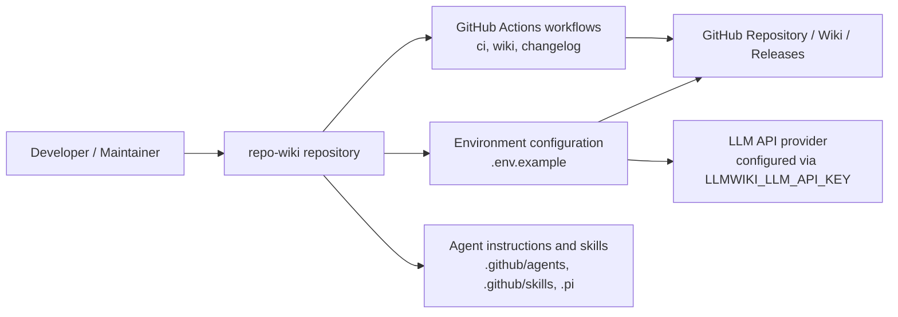
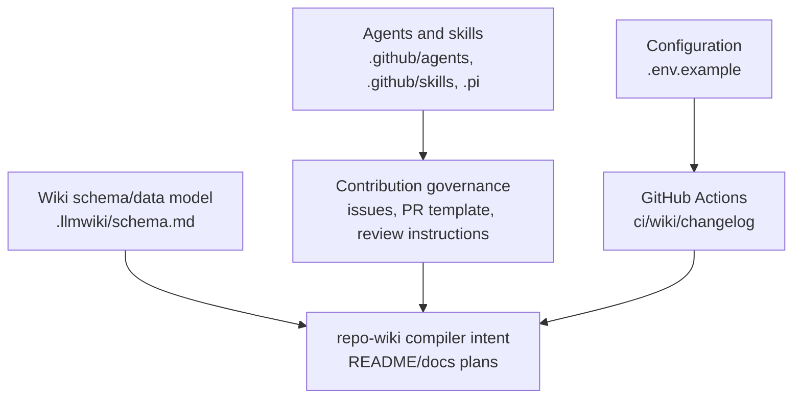
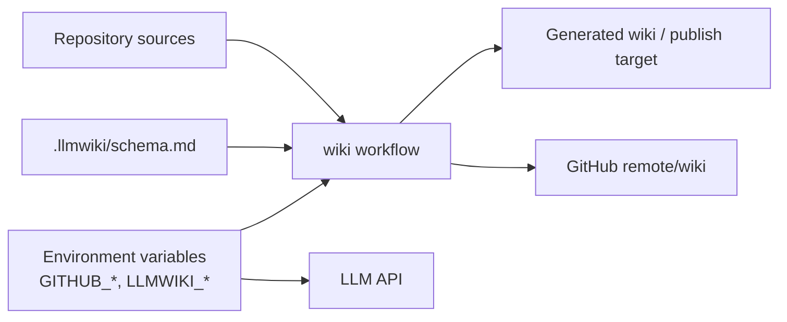
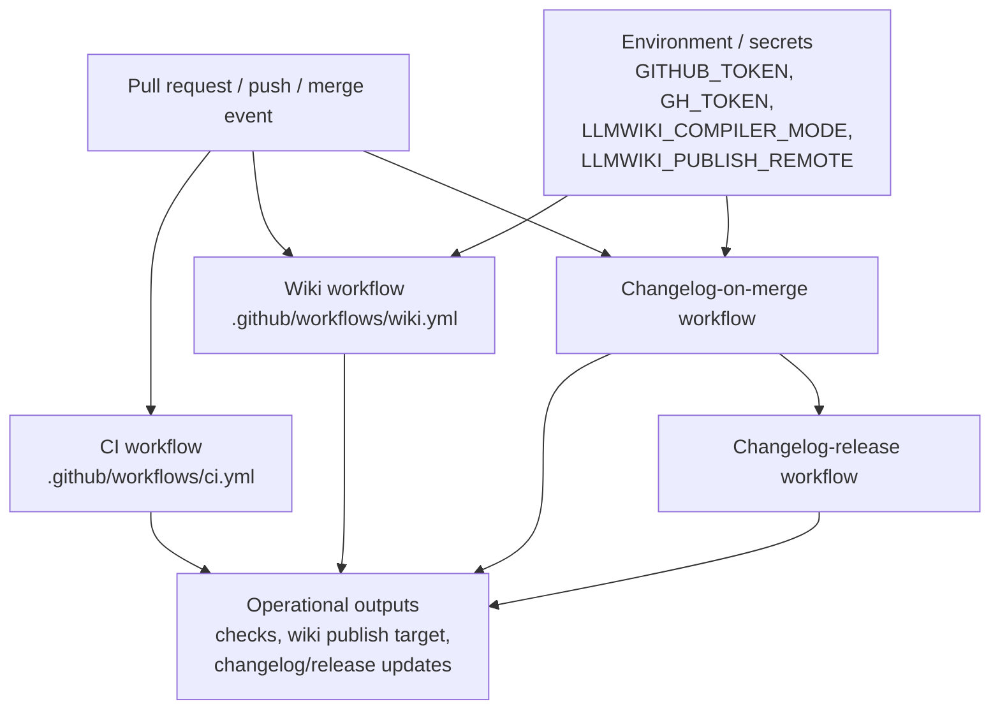

# Architecture

## Executive Architecture Summary

This repository appears to be the early implementation and project scaffolding for **repo-wiki**, a tool intended to compile a Git repository into a persistent GitHub Wiki-style knowledge base. The strongest available evidence in this source set is configuration, CI workflow, schema, issue-template, and agent-instruction files rather than application source code. Operational claims about the compiler itself are therefore conservative. The available evidence supports the following architectural view:

- The repository is organized around a **repo-to-wiki compiler/product concept** documented in project documentation and plans, with a schema-oriented wiki model under `.llmwiki/schema.md`. The schema file is high-relevance evidence for the intended data model, but the source card does not expose its full content here. [`.llmwiki/schema.md`](.llmwiki/schema.html)
- Local and CI operation are configured through environment variables including `GITHUB_REPOSITORY`, `GITHUB_TOKEN`, `LLMWIKI_COMPILER_MODE`, `LLMWIKI_LLM_API_KEY`, and workflow-level variables such as `LLMWIKI_PUBLISH_REMOTE` and `GH_TOKEN`. [`.env.example`](.env.example), [`.github/workflows/wiki.yml`](.github/workflows/wiki.yml), [`.github/workflows/changelog-on-merge.yml`](.github/workflows/changelog-on-merge.yml)
- GitHub Actions provide the clearest verified operational surfaces: general CI, wiki generation/publishing, changelog-on-merge automation, and changelog release automation. [`.github/workflows/ci.yml`](.github/workflows/ci.yml), [`.github/workflows/wiki.yml`](.github/workflows/wiki.yml), [`.github/workflows/changelog-on-merge.yml`](.github/workflows/changelog-on-merge.yml), [`.github/workflows/changelog-release.yml`](.github/workflows/changelog-release.yml)
- The repository includes structured collaboration surfaces for issues, pull requests, Copilot review instructions, agents, and reusable skills. These are architectural support systems around the product workflow rather than verified runtime dependencies. [`.github/ISSUE_TEMPLATE/epic.yml`](.github/ISSUE_TEMPLATE/epic.yml), [`.github/ISSUE_TEMPLATE/task.yml`](.github/ISSUE_TEMPLATE/task.yml), [`.github/pull_request_template.md`](.github/pull_request_template.html), [`.github/copilot-review-instructions.md`](.github/copilot-review-instructions.html), [`.github/agents/coordinator.agent.md`](.github/agents/coordinator.agent.html), [`.github/skills/repo-wiki-navigation/SKILL.md`](.github/skills/repo-wiki-navigation/SKILL.html)

Secondary documentation describes the product as an implementation of an “LLM Wiki” pattern for software repositories: raw sources remain immutable, the wiki becomes a persistent compounding artifact, and a schema tells the LLM how to organize the compiled knowledge. This is useful for intent, but only partially validated against the provided source cards. [Documentation card: `docs/PLAN.md`], [Documentation card: `docs/WHY.md`]

## System and Repository Context

### Repository boundaries

From the available source cards, the repository boundary contains:

| Area | Evidence | Architectural role | Confidence |
|---|---|---:|---:|
| Environment configuration | `.env.example` | Defines expected local/CI configuration names such as GitHub repository/token, compiler mode, and LLM API key. | Medium |
| GitHub Actions workflows | `.github/workflows/*.yml` | Defines CI, wiki automation, changelog-on-merge, and changelog-release operational entry points. | Medium |
| Wiki schema | `.llmwiki/schema.md` | Defines or documents the intended wiki knowledge model. | Medium |
| GitHub issue and PR process | `.github/ISSUE_TEMPLATE/*.yml`, `.github/pull_request_template.md` | Defines project management and contribution surfaces. | Medium |
| Agent instructions and skills | `.github/agents/*.agent.md`, `.github/skills/*/SKILL.md`, `.pi/AGENTS.md` | Defines human/AI collaboration instructions and skills around development, quality, docs, review, changelog, and wiki navigation. | Medium |
| Product implementation source | Not present in supplied source-card list | Application runtime modules, CLI entrypoints, package scripts, and imports cannot be verified from the supplied source cards. | Low |

The README documentation card says local usage includes commands such as `npx repo-wiki init --repo . --write-agents`, `npx repo-wiki run ...`, and `npm install`, but the provided authoritative source cards do not include `package.json`, CLI implementation files, or executable source paths. Treat these as documented intent or partially validated usage, not fully verified architecture. [Documentation card: `README.md`]

### External surfaces

The externally visible/operational surfaces supported by the source cards are:

- **GitHub repository and GitHub token configuration** through `GITHUB_REPOSITORY` and `GITHUB_TOKEN`. [`.env.example`](.env.example)
- **LLM provider/API access** through `LLMWIKI_LLM_API_KEY`; provider details are not verifiable from source cards. [`.env.example`](.env.example)
- **Compiler mode selection** through `LLMWIKI_COMPILER_MODE`, also referenced by the wiki workflow. [`.env.example`](.env.example), [`.github/workflows/wiki.yml`](.github/workflows/wiki.yml)
- **Wiki publishing remote** through `LLMWIKI_PUBLISH_REMOTE` in the wiki workflow. [`.github/workflows/wiki.yml`](.github/workflows/wiki.yml)
- **GitHub CLI/API token surface** through `GH_TOKEN` in the changelog-on-merge workflow. [`.github/workflows/changelog-on-merge.yml`](.github/workflows/changelog-on-merge.yml)

### Context diagram

The following diagram is supported by configuration and workflow file presence, not by runtime source imports. It shows repository boundaries and external operational surfaces that are directly named in the available source cards.

Evidence: [`.env.example`](.env.example), [`.github/workflows/ci.yml`](.github/workflows/ci.yml), [`.github/workflows/wiki.yml`](.github/workflows/wiki.yml), [`.github/workflows/changelog-on-merge.yml`](.github/workflows/changelog-on-merge.yml), [`.github/workflows/changelog-release.yml`](.github/workflows/changelog-release.yml), [`.github/agents/coordinator.agent.md`](.github/agents/coordinator.agent.html), [`.github/skills/repo-wiki-navigation/SKILL.md`](.github/skills/repo-wiki-navigation/SKILL.html), [`.pi/AGENTS.md`](.pi/AGENTS.html)

## Major Modules and Responsibilities

Because no implementation source files, package manifest, or import graph are present in the supplied source-card set, the modules below are logical modules derived from verified repository structure plus partially validated planning documentation. They should not be read as a verified class/package/module graph.

### Wiki compiler and schema model

The core product concept is a compiler that generates a GitHub Wiki knowledge base from repository contents. The strongest source evidence for the data-model side is `.llmwiki/schema.md`, which is categorized as documentation and data-model evidence. [`.llmwiki/schema.md`](.llmwiki/schema.html)

Secondary documentation describes the project as instantiating an LLM Wiki pattern where source files remain immutable, the wiki is a persistent artifact, and a schema guides compilation. This describes intended architecture but is only partially validated by the supplied authoritative files. [Documentation card: `docs/PLAN.md`], [Documentation card: `docs/WHY.md`]

Responsibilities inferred from source and documentation cards:

- Define wiki page shape and knowledge organization through `.llmwiki/schema.md`. [`.llmwiki/schema.md`](.llmwiki/schema.html)
- Support compiler modes through `LLMWIKI_COMPILER_MODE`. [`.env.example`](.env.example), [`.github/workflows/wiki.yml`](.github/workflows/wiki.yml)
- Support optional/required LLM access through `LLMWIKI_LLM_API_KEY`. [`.env.example`](.env.example)

### GitHub Actions automation

The workflow layer is the most concrete operational subsystem in the supplied evidence. It contains:

| Workflow | Source path | Role supported by filename/card metadata |
|---|---|---|
| CI | `.github/workflows/ci.yml` | General continuous integration/background work. |
| Wiki | `.github/workflows/wiki.yml` | Wiki compilation/publishing automation with `LLMWIKI_COMPILER_MODE` and `LLMWIKI_PUBLISH_REMOTE`. |
| Changelog on merge | `.github/workflows/changelog-on-merge.yml` | Changelog automation using `GH_TOKEN`. |
| Changelog release | `.github/workflows/changelog-release.yml` | Release-oriented changelog automation. |

Evidence: [`.github/workflows/ci.yml`](.github/workflows/ci.yml), [`.github/workflows/wiki.yml`](.github/workflows/wiki.yml), [`.github/workflows/changelog-on-merge.yml`](.github/workflows/changelog-on-merge.yml), [`.github/workflows/changelog-release.yml`](.github/workflows/changelog-release.yml)

### Configuration and environment module

The environment configuration surface is represented by `.env.example`. It names these variables:

| Variable | Purpose that can be safely inferred | Evidence |
|---|---|---|
| `GITHUB_REPOSITORY` | Identifies the GitHub repository target/context. | [`.env.example`](.env.example) |
| `GITHUB_TOKEN` | Authenticates GitHub operations. Do not commit real token values. | [`.env.example`](.env.example) |
| `LLMWIKI_COMPILER_MODE` | Selects compiler mode or execution mode. Exact allowed values are not visible in source cards. | [`.env.example`](.env.example), [`.github/workflows/wiki.yml`](.github/workflows/wiki.yml) |
| `LLMWIKI_LLM_API_KEY` | Authenticates to an LLM API/provider. Exact provider contract is not verifiable here. | [`.env.example`](.env.example) |
| `LLMWIKI_PUBLISH_REMOTE` | Configures wiki publishing remote in CI. | [`.github/workflows/wiki.yml`](.github/workflows/wiki.yml) |
| `GH_TOKEN` | Token surface for GitHub CLI/API usage in changelog automation. | [`.github/workflows/changelog-on-merge.yml`](.github/workflows/changelog-on-merge.yml) |

### Agent and skill instruction module

The repository includes multiple agent instruction files under `.github/agents`, skill definitions under `.github/skills`, and PI agent/settings files under `.pi`. These files are best understood as development-process architecture: they define guidance for AI-assisted coordination, development, documentation, fixing, quality, and review activities. [`.github/agents/coordinator.agent.md`](.github/agents/coordinator.agent.html), [`.github/agents/developer.agent.md`](.github/agents/developer.agent.html), [`.github/agents/docs.agent.md`](.github/agents/docs.agent.html), [`.github/agents/fixer.agent.md`](.github/agents/fixer.agent.html), [`.github/agents/quality.agent.md`](.github/agents/quality.agent.html), [`.github/agents/review.agent.md`](.github/agents/review.agent.html), [`.github/skills/keep-a-changelog/SKILL.md`](.github/skills/keep-a-changelog/SKILL.html), [`.github/skills/repo-wiki-navigation/SKILL.md`](.github/skills/repo-wiki-navigation/SKILL.html), [`.pi/AGENTS.md`](.pi/AGENTS.html), [`.pi/settings.json`](.pi/settings.json)

The presence of a `keep-a-changelog` skill and changelog workflows suggests that changelog maintenance is a first-class repository process, though the exact changelog format and release behavior are not verifiable from the supplied source cards alone. [`.github/skills/keep-a-changelog/SKILL.md`](.github/skills/keep-a-changelog/SKILL.html), [`.github/workflows/changelog-on-merge.yml`](.github/workflows/changelog-on-merge.yml), [`.github/workflows/changelog-release.yml`](.github/workflows/changelog-release.yml)

### GitHub collaboration surfaces

Issue templates and pull request guidance define project intake and review conventions:

- Epic issue template. [`.github/ISSUE_TEMPLATE/epic.yml`](.github/ISSUE_TEMPLATE/epic.yml)
- Task issue template. [`.github/ISSUE_TEMPLATE/task.yml`](.github/ISSUE_TEMPLATE/task.yml)
- Issue template configuration. [`.github/ISSUE_TEMPLATE/config.yml`](.github/ISSUE_TEMPLATE/config.yml)
- Pull request template. [`.github/pull_request_template.md`](.github/pull_request_template.html)
- Copilot review instructions. [`.github/copilot-review-instructions.md`](.github/copilot-review-instructions.html)

These are not runtime components, but they shape architecture governance, implementation workflow, review quality, and documentation discipline.

### Planned product modules from documentation

The planning documentation references future or partially implemented modules such as CI publishing, GitHub Action behavior, incremental mode, and LLM compiler architecture. These should be treated as roadmap/design intent unless verified by source files or workflow content. [Documentation card: `docs/plans/ci-publishing.md`], [Documentation card: `docs/plans/github-action.md`], [Documentation card: `docs/plans/incremental-mode.md`], [Documentation card: `docs/plans/llm-compiler.md`]

Notable planned/intended concerns from documentation cards include:

- CI publishing architecture involving test and wiki state fetching. [Documentation card: `docs/plans/ci-publishing.md`]
- GitHub Action behavior involving local wiki artifact upload and conditional publishing credentials. [Documentation card: `docs/plans/github-action.md`]
- Incremental mode architecture, but this plan is marked stale in the documentation card and should not be treated as current behavior. [Documentation card: `docs/plans/incremental-mode.md`]
- Provider-agnostic LLM boundary compatible with OpenAI-style chat completions, partially validated as a plan but not verified by implementation source in the supplied cards. [Documentation card: `docs/plans/llm-compiler.md`], [`.env.example`](.env.example)

### Component diagram

This diagram is a structure-supported logical grouping, not a verified implementation dependency graph. It is based on the repository paths and documented plan modules listed above.

Evidence: [`.env.example`](.env.example), [`.llmwiki/schema.md`](.llmwiki/schema.html), [`.github/workflows/ci.yml`](.github/workflows/ci.yml), [`.github/workflows/wiki.yml`](.github/workflows/wiki.yml), [`.github/workflows/changelog-on-merge.yml`](.github/workflows/changelog-on-merge.yml), [`.github/workflows/changelog-release.yml`](.github/workflows/changelog-release.yml), [`.github/agents/coordinator.agent.md`](.github/agents/coordinator.agent.html), [`.github/skills/repo-wiki-navigation/SKILL.md`](.github/skills/repo-wiki-navigation/SKILL.html), [`.github/ISSUE_TEMPLATE/task.yml`](.github/ISSUE_TEMPLATE/task.yml), [`.github/pull_request_template.md`](.github/pull_request_template.html), [Documentation card: `README.md`], [Documentation card: `docs/PLAN.md`]

## Runtime, Data, and Control-Flow Relationships

The supplied source cards do not include implementation files with imports, function definitions, CLI entrypoints, package scripts, or runtime call graphs. As a result, runtime control flow cannot be verified at code level.

### Verified or partially verified runtime surfaces

The following relationships are supported by configuration/workflow evidence:

1. **Local/CI configuration feeds compiler or workflow behavior.**  
   `LLMWIKI_COMPILER_MODE` exists in `.env.example` and is also referenced by the wiki workflow card, supporting the claim that compiler mode can influence local and CI wiki behavior. [`.env.example`](.env.example), [`.github/workflows/wiki.yml`](.github/workflows/wiki.yml)

2. **GitHub credentials are required for repository/wiki/release-related operations.**  
   `GITHUB_TOKEN` and `GITHUB_REPOSITORY` appear in `.env.example`; `GH_TOKEN` appears in changelog-on-merge workflow metadata. The exact API operations are not visible in the source cards. [`.env.example`](.env.example), [`.github/workflows/changelog-on-merge.yml`](.github/workflows/changelog-on-merge.yml)

3. **LLM access is an expected boundary.**  
   `LLMWIKI_LLM_API_KEY` appears in `.env.example`, and planning documentation describes a provider-agnostic LLM boundary compatible with OpenAI-style chat completions. The exact provider client implementation is not available in supplied source cards. [`.env.example`](.env.example), [Documentation card: `docs/plans/llm-compiler.md`]

4. **Wiki publishing is a CI concern.**  
   `.github/workflows/wiki.yml` references `LLMWIKI_PUBLISH_REMOTE`, indicating a publish-target configuration surface for wiki automation. [`.github/workflows/wiki.yml`](.github/workflows/wiki.yml)

### Conservative data-flow sketch

The following diagram is intentionally limited to configured surfaces. It does not assert internal implementation calls.

Evidence: [`.llmwiki/schema.md`](.llmwiki/schema.html), [`.env.example`](.env.example), [`.github/workflows/wiki.yml`](.github/workflows/wiki.yml)

### Unsupported runtime details

The following details are not verifiable from the supplied source cards:

- Exact CLI command implementation and command routing.
- Exact package scripts.
- Exact LLM request/response schema.
- Exact wiki page generation algorithm.
- Exact incremental compilation/cache behavior.
- Exact testing framework and test command.
- Exact publishing protocol to GitHub Wiki.

README and planning documentation describe some of these topics, but the implementation evidence needed to make them authoritative is not included in this source-card set. [Documentation card: `README.md`], [Documentation card: `docs/plans/incremental-mode.md`], [Documentation card: `docs/plans/llm-compiler.md`]

## Build, Test, Deployment, and Operational Surfaces

### CI and automation workflows

The repository has four workflow files in the supplied source cards:

| Surface | Evidence | Architectural interpretation |
|---|---|---|
| Continuous integration | `.github/workflows/ci.yml` | CI exists as a background workflow, but job steps are not visible in the card excerpt. |
| Wiki automation | `.github/workflows/wiki.yml` | Wiki generation/publishing workflow exists and uses environment/configuration names `LLMWIKI_COMPILER_MODE` and `LLMWIKI_PUBLISH_REMOTE`. |
| Changelog on merge | `.github/workflows/changelog-on-merge.yml` | Changelog automation runs as background work and uses `GH_TOKEN`. |
| Changelog release | `.github/workflows/changelog-release.yml` | Release-related changelog workflow exists. |

Evidence: [`.github/workflows/ci.yml`](.github/workflows/ci.yml), [`.github/workflows/wiki.yml`](.github/workflows/wiki.yml), [`.github/workflows/changelog-on-merge.yml`](.github/workflows/changelog-on-merge.yml), [`.github/workflows/changelog-release.yml`](.github/workflows/changelog-release.yml)

### Local operation

The `.env.example` file indicates local configuration expectations for GitHub and LLM access. [`.env.example`](.env.example)

The README documentation card includes example commands:

- `npm install`
- `npx repo-wiki init --repo . --write-agents`
- `npx repo-wiki run \...`

These command examples should be considered partially validated documentation because package metadata and executable source implementation are not included in the supplied source cards. [Documentation card: `README.md`]

### Build/test/deploy flow diagram

This diagram is supported by workflow file presence and environment metadata only. It does not claim exact job ordering or individual workflow steps because those details are not available in the source-card excerpts.

Evidence: [`.github/workflows/ci.yml`](.github/workflows/ci.yml), [`.github/workflows/wiki.yml`](.github/workflows/wiki.yml), [`.github/workflows/changelog-on-merge.yml`](.github/workflows/changelog-on-merge.yml), [`.github/workflows/changelog-release.yml`](.github/workflows/changelog-release.yml), [`.env.example`](.env.example)

### Deployment/publishing

The only directly visible deployment/publishing surface is the wiki workflow configuration reference to `LLMWIKI_PUBLISH_REMOTE`. This supports the existence of a configurable wiki publish remote, but not the exact publication mechanism or branch/remote URL behavior. [`.github/workflows/wiki.yml`](.github/workflows/wiki.yml)

Planning documentation also discusses CI publishing and GitHub Action behavior, including fetching existing wiki state, uploading local wiki artifacts, and conditional publishing based on credentials. These are partially validated design documents, not fully verified source behavior in this card set. [Documentation card: `docs/plans/ci-publishing.md`], [Documentation card: `docs/plans/github-action.md`]

## Cross-Cutting Concerns

### Configuration management

Configuration is environment-variable oriented. The variables visible in `.env.example` and workflow metadata are:

- `GITHUB_REPOSITORY`
- `GITHUB_TOKEN`
- `LLMWIKI_COMPILER_MODE`
- `LLMWIKI_LLM_API_KEY`
- `LLMWIKI_PUBLISH_REMOTE`
- `GH_TOKEN`

Evidence: [`.env.example`](.env.example), [`.github/workflows/wiki.yml`](.github/workflows/wiki.yml), [`.github/workflows/changelog-on-merge.yml`](.github/workflows/changelog-on-merge.yml)

No concrete values should be committed or reproduced. The source cards provide names only, not secret values. [`.env.example`](.env.example)

### Security and secret handling

Security-sensitive boundaries include:

| Boundary | Risk | Evidence |
|---|---|---|
| GitHub token usage | Tokens can mutate repository/wiki/release/changelog state depending on permissions. | [`.env.example`](.env.example), [`.github/workflows/changelog-on-merge.yml`](.github/workflows/changelog-on-merge.yml) |
| LLM API key usage | API key grants access to external model provider and may send repository context depending on implementation. | [`.env.example`](.env.example) |
| Publish remote | Incorrect remote configuration could publish wiki content to the wrong target. | [`.github/workflows/wiki.yml`](.github/workflows/wiki.yml) |

The exact permission scopes, redaction behavior, and outbound data policy are not visible in the supplied source cards.

### APIs and external dependencies

The source cards identify likely external API boundaries but not implementation details:

- GitHub API or GitHub remote operations, inferred from `GITHUB_REPOSITORY`, `GITHUB_TOKEN`, `GH_TOKEN`, and wiki/changelog workflows. [`.env.example`](.env.example), [`.github/workflows/wiki.yml`](.github/workflows/wiki.yml), [`.github/workflows/changelog-on-merge.yml`](.github/workflows/changelog-on-merge.yml)
- LLM API/provider access, inferred from `LLMWIKI_LLM_API_KEY` and planning docs for an OpenAI-style provider-agnostic boundary. [`.env.example`](.env.example), [Documentation card: `docs/plans/llm-compiler.md`]

No package dependency list is available in the supplied cards, so dependency versions and runtime libraries cannot be documented here.

### Data model and schema

`.llmwiki/schema.md` is categorized as a data-model documentation file and is the main evidence for wiki schema concerns. [`.llmwiki/schema.md`](.llmwiki/schema.html)

The documentation cards describe the schema as a guide for the LLM/compiler in organizing knowledge. This is design intent and should be validated against the actual schema contents and compiler implementation before being treated as exhaustive current behavior. [Documentation card: `docs/PLAN.md`], [Documentation card: `docs/WHY.md`]

### Documentation trust model

This page follows the repository-compilation authority model:

- CI, configuration, schemas, and workflow files are treated as high-authority for operational surfaces. [`.github/workflows/ci.yml`](.github/workflows/ci.yml), [`.github/workflows/wiki.yml`](.github/workflows/wiki.yml), [`.env.example`](.env.example), [`.llmwiki/schema.md`](.llmwiki/schema.html)
- README and planning docs are used for intent and terminology but are not sufficient to assert implementation behavior where no source code or workflow steps are available. [Documentation card: `README.md`], [Documentation card: `docs/PLAN.md`], [Documentation card: `docs/plans/llm-compiler.md`]
- The incremental-mode plan is explicitly marked stale in the documentation card, so it should not be used as current architecture without additional source validation. [Documentation card: `docs/plans/incremental-mode.md`]

### Contribution and governance

The repository includes structured issue templates, a pull request template, and Copilot review instructions. These support a governed development process around epics, tasks, reviews, and contribution hygiene. [`.github/ISSUE_TEMPLATE/config.yml`](.github/ISSUE_TEMPLATE/config.yml), [`.github/ISSUE_TEMPLATE/epic.yml`](.github/ISSUE_TEMPLATE/epic.yml), [`.github/ISSUE_TEMPLATE/task.yml`](.github/ISSUE_TEMPLATE/task.yml), [`.github/pull_request_template.md`](.github/pull_request_template.html), [`.github/copilot-review-instructions.md`](.github/copilot-review-instructions.html)

Agent and skill files add AI-assisted process guidance for coordination, development, documentation, fixing, quality, review, changelog maintenance, and repo-wiki navigation. [`.github/agents/coordinator.agent.md`](.github/agents/coordinator.agent.html), [`.github/agents/developer.agent.md`](.github/agents/developer.agent.html), [`.github/agents/docs.agent.md`](.github/agents/docs.agent.html), [`.github/agents/fixer.agent.md`](.github/agents/fixer.agent.html), [`.github/agents/quality.agent.md`](.github/agents/quality.agent.html), [`.github/agents/review.agent.md`](.github/agents/review.agent.html), [`.github/skills/keep-a-changelog/SKILL.md`](.github/skills/keep-a-changelog/SKILL.html), [`.github/skills/repo-wiki-navigation/SKILL.md`](.github/skills/repo-wiki-navigation/SKILL.html), [`.pi/AGENTS.md`](.pi/AGENTS.html)

## Caveats and Open Questions

### Caveats

- **Application source code was not present in the supplied source cards.** This page cannot verify actual compiler modules, import relationships, CLI routing, package scripts, or runtime algorithms. Evidence is primarily workflows, configuration, schema documentation, and repository process files.
- **Diagrams are structure-supported, not import-graph verified.** The context, component, data-flow, and CI diagrams are based on file presence and environment/workflow metadata, not on implementation traces. [`.env.example`](.env.example), [`.github/workflows/wiki.yml`](.github/workflows/wiki.yml), [`.github/workflows/ci.yml`](.github/workflows/ci.yml)
- **README command examples are only partially validated.** The README card lists `npm install`, `npx repo-wiki init --repo . --write-agents`, and `npx repo-wiki run ...`, but the source cards do not include `package.json` or executable implementation files. [Documentation card: `README.md`]
- **Planned modules may not equal current behavior.** CI publishing, GitHub Action behavior, LLM compiler design, and incremental mode are described in planning docs, but these are not fully validated by the supplied source cards; incremental mode is marked stale. [Documentation card: `docs/plans/ci-publishing.md`], [Documentation card: `docs/plans/github-action.md`], [Documentation card: `docs/plans/llm-compiler.md`], [Documentation card: `docs/plans/incremental-mode.md`]
- **Workflow job details are not available in excerpts.** The page can identify workflow files and environment-variable surfaces, but not exact triggers, permissions, jobs, steps, or commands. [`.github/workflows/ci.yml`](.github/workflows/ci.yml), [`.github/workflows/wiki.yml`](.github/workflows/wiki.yml), [`.github/workflows/changelog-on-merge.yml`](.github/workflows/changelog-on-merge.yml), [`.github/workflows/changelog-release.yml`](.github/workflows/changelog-release.yml)

### Open questions

1. What are the actual implementation modules, CLI entrypoints, and package scripts for `repo-wiki`?
2. What values are accepted for `LLMWIKI_COMPILER_MODE`, and how do they alter compiler behavior?
3. What is the exact schema defined by `.llmwiki/schema.md`, and how strictly is it enforced by the compiler?
4. Which LLM providers are supported in code, and is the OpenAI-style provider-agnostic boundary implemented or only planned?
5. How does the wiki workflow publish: GitHub Wiki remote, artifact upload, pull request, branch push, or another mechanism?
6. What tests exist, and which architectural behaviors are covered by CI?
7. Is incremental mode implemented, deferred, or obsolete given that the incremental-mode plan is marked stale?
8. What permissions do the GitHub workflows request, especially for changelog and wiki publishing?
9. How are generated wiki pages reconciled with human-maintained wiki sections?
10. What secret redaction or source-filtering logic prevents tokens/private data from entering generated wiki content?

<!-- HUMAN_NOTES_START -->
<!-- HUMAN_NOTES_END -->
