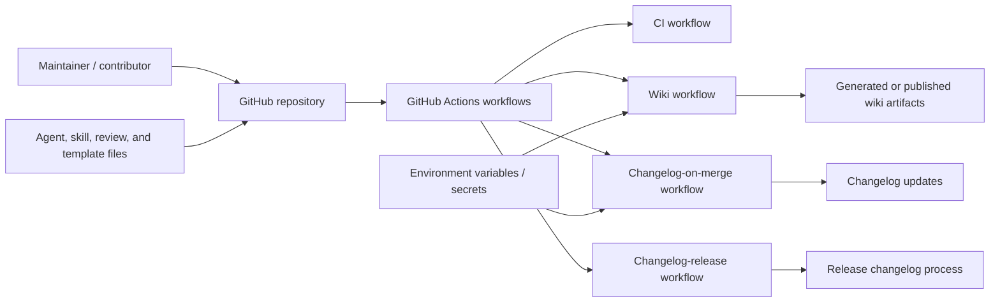
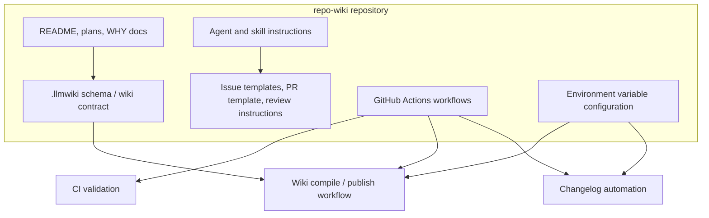
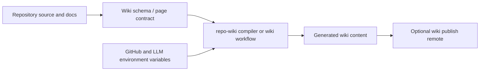
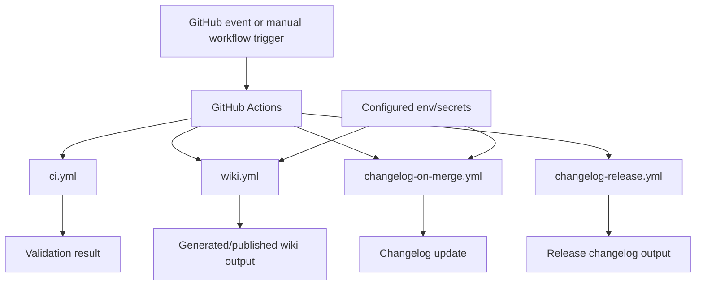

# Architecture

## Executive Architecture Summary

`repo-wiki` appears to be a repository-to-wiki compilation project whose documented intent is to instantiate an “LLM Wiki” pattern: source files remain authoritative, while generated wiki pages become a maintained knowledge base. This purpose is supported by the documented implementation plan and rationale, but the available source cards for this page primarily cover repository configuration, CI workflows, schema documentation, issue templates, and agent/skill instructions rather than application source files. Therefore, the architecture below is intentionally conservative. [docs/PLAN.md; docs/WHY.md; .llmwiki/schema.md]

From the available evidence, the repository has these visible architectural areas:

| Area | Responsibility | Evidence |
|---|---|---|
| Wiki compiler / generated knowledge-base model | Defines or documents the schema and expectations for generated wiki artifacts. | `.llmwiki/schema.md`; README.md |
| GitHub Actions automation | Runs CI, wiki generation/publishing, changelog-on-merge, and changelog-release automation. | `.github/workflows/ci.yml`; `.github/workflows/wiki.yml`; `.github/workflows/changelog-on-merge.yml`; `.github/workflows/changelog-release.yml` |
| Runtime/configuration surface | Uses environment variables for GitHub repository access, GitHub token access, compiler mode, publish remote, and LLM API key. | `.env.example`; `.github/workflows/wiki.yml`; `.github/workflows/changelog-on-merge.yml` |
| Repository governance and planning | Uses issue templates, pull request template, Copilot review instructions, agent instructions, and skills for repeatable development and documentation workflows. | `.github/ISSUE_TEMPLATE/config.yml`; `.github/ISSUE_TEMPLATE/epic.yml`; `.github/ISSUE_TEMPLATE/task.yml`; `.github/pull_request_template.md`; `.github/copilot-review-instructions.md`; `.github/agents/*.agent.md`; `.github/skills/*/SKILL.md`; `AGENTS.md` |
| Changelog/release process | Automates changelog updates on merge and release-related changelog handling. | `.github/workflows/changelog-on-merge.yml`; `.github/workflows/changelog-release.yml`; `.github/skills/keep-a-changelog/SKILL.md` |

A key design decision is that operational claims should be derived from source, CI, and configuration rather than documentation alone. This is consistent with the presence of a schema file for LLM wiki artifacts and repository-specific agent/review instructions, but the exact compiler implementation boundaries cannot be verified from the provided source cards because no application source files or package manifest were included. [`.llmwiki/schema.md`; `.github/copilot-review-instructions.md`; `AGENTS.md`]

## System and Repository Context

The repository boundary visible from the provided cards consists mainly of configuration and automation surfaces:

- GitHub Actions workflows provide CI and background automation. The workflow cards identify `ci.yml`, `wiki.yml`, `changelog-on-merge.yml`, and `changelog-release.yml` as CI/background-work surfaces. [`.github/workflows/ci.yml`; `.github/workflows/wiki.yml`; `.github/workflows/changelog-on-merge.yml`; `.github/workflows/changelog-release.yml`]
- Environment configuration is represented by `.env.example`, including `GITHUB_REPOSITORY`, `GITHUB_TOKEN`, `LLMWIKI_COMPILER_MODE`, and `LLMWIKI_LLM_API_KEY`. [`.env.example`]
- The wiki workflow additionally references `LLMWIKI_COMPILER_MODE` and `LLMWIKI_PUBLISH_REMOTE`, indicating a configurable wiki compilation/publishing path in CI. [`.github/workflows/wiki.yml`]
- The changelog-on-merge workflow references `GH_TOKEN`, indicating GitHub API or GitHub CLI authentication for changelog automation. [`.github/workflows/changelog-on-merge.yml`]
- Human and AI collaboration surfaces are represented by issue templates, a pull request template, Copilot review instructions, agent definitions, and skills. [`.github/ISSUE_TEMPLATE/config.yml`; `.github/ISSUE_TEMPLATE/epic.yml`; `.github/ISSUE_TEMPLATE/task.yml`; `.github/pull_request_template.md`; `.github/copilot-review-instructions.md`; `.github/agents/coordinator.agent.md`; `.github/agents/developer.agent.md`; `.github/agents/docs.agent.md`; `.github/agents/fixer.agent.md`; `.github/agents/quality.agent.md`; `.github/agents/review.agent.md`; `.github/skills/keep-a-changelog/SKILL.md`; `.github/skills/repo-wiki-navigation/SKILL.md`]

The following context diagram is supported by repository structure and workflow/environment cards. It does **not** assert unobserved internal implementation classes or function calls.

Evidence for the external surfaces in this diagram comes from `.github/workflows/*.yml`, `.env.example`, `.github/agents/*.agent.md`, `.github/skills/*/SKILL.md`, and issue/review template files. [`.github/workflows/ci.yml`; `.github/workflows/wiki.yml`; `.github/workflows/changelog-on-merge.yml`; `.github/workflows/changelog-release.yml`; `.env.example`; `.github/agents/coordinator.agent.md`; `.github/skills/keep-a-changelog/SKILL.md`; `.github/skills/repo-wiki-navigation/SKILL.md`]

## Major Modules and Responsibilities

### Wiki Compilation and Schema Model

The repository includes `.llmwiki/schema.md`, which is classified as both documentation and a data-model source card. This indicates that generated wiki content has a documented schema or contract. [`.llmwiki/schema.md`]

The documented product plan describes the project as implementing a repo-wiki/LLM-wiki pattern where raw sources are kept immutable and the wiki is a persistent compounding artifact. This is secondary documentation evidence and is only partially validated by the presence of the schema and wiki workflow surfaces. [docs/PLAN.md; docs/WHY.md; `.llmwiki/schema.md`; `.github/workflows/wiki.yml`]

Documented commands in README include `npm install repo-wiki`, installing a tarball, and `npx repo-wiki --help`, which suggest a Node/npm CLI distribution model. However, because no `package.json`, CLI source file, or executable source card was provided, the CLI implementation details are not verified here. [README.md]

### CI Workflow Module

The CI module is represented by `.github/workflows/ci.yml`. Its source card identifies it as a CI workflow with a background-work runtime hint. This establishes a repository-level automated validation surface, but the exact jobs, matrix, package manager, and commands are not visible from the provided excerpt. [`.github/workflows/ci.yml`]

### Wiki Workflow Module

The wiki workflow is represented by `.github/workflows/wiki.yml`. It is classified as CI and configuration, with background-work and environment-variable hints. It references `LLMWIKI_COMPILER_MODE` and `LLMWIKI_PUBLISH_REMOTE`, indicating that wiki compilation mode and publishing target are configurable in the workflow environment. [`.github/workflows/wiki.yml`]

This workflow is the strongest available source-level evidence for a build/deploy path related to the wiki. The exact trigger conditions, generated paths, artifact handling, and publish credentials are not visible in the source-card excerpt. [`.github/workflows/wiki.yml`]

### Changelog Automation Module

The repository has two changelog-related workflows:

- `.github/workflows/changelog-on-merge.yml`, classified as CI/configuration and using `GH_TOKEN`. [`.github/workflows/changelog-on-merge.yml`]
- `.github/workflows/changelog-release.yml`, classified as CI with a background-work hint. [`.github/workflows/changelog-release.yml`]

The repository also includes a Keep a Changelog skill file, which suggests a maintained convention for changelog content. As a documentation/skill card, it should be treated as process guidance rather than runtime implementation. [`.github/skills/keep-a-changelog/SKILL.md`]

### Repository Governance and Collaboration Module

The repository contains governance and collaboration files:

- Issue templates for epic and task creation. [`.github/ISSUE_TEMPLATE/epic.yml`; `.github/ISSUE_TEMPLATE/task.yml`; `.github/ISSUE_TEMPLATE/config.yml`]
- Pull request template. [`.github/pull_request_template.md`]
- Copilot review instructions. [`.github/copilot-review-instructions.md`]
- Agent instructions for coordinator, developer, docs, fixer, quality, and review roles. [`.github/agents/coordinator.agent.md`; `.github/agents/developer.agent.md`; `.github/agents/docs.agent.md`; `.github/agents/fixer.agent.md`; `.github/agents/quality.agent.md`; `.github/agents/review.agent.md`]
- Repository-level agent guidance. [`AGENTS.md`; `.pi/AGENTS.md`]
- Repo-wiki navigation skill. [`.github/skills/repo-wiki-navigation/SKILL.md`]

These files do not define application runtime architecture directly, but they are part of the repository’s operational architecture for planning, review, documentation maintenance, and agent-assisted workflows. [`.github/agents/coordinator.agent.md`; `.github/skills/repo-wiki-navigation/SKILL.md`; `AGENTS.md`]

### Environment and Secret Configuration Module

The `.env.example` file identifies expected environment variables:

| Variable | Architectural role | Evidence |
|---|---|---|
| `GITHUB_REPOSITORY` | Identifies the target GitHub repository. | `.env.example` |
| `GITHUB_TOKEN` | Authenticates GitHub access for local or automated operations. | `.env.example` |
| `LLMWIKI_COMPILER_MODE` | Selects or configures compiler mode. Also appears in the wiki workflow. | `.env.example`; `.github/workflows/wiki.yml` |
| `LLMWIKI_LLM_API_KEY` | Provides LLM provider authentication for local or compiler operations. | `.env.example` |
| `LLMWIKI_PUBLISH_REMOTE` | Configures the wiki publish remote in the wiki workflow. | `.github/workflows/wiki.yml` |
| `GH_TOKEN` | Provides GitHub authentication for changelog-on-merge automation. | `.github/workflows/changelog-on-merge.yml` |

No secret values are included here. Only variable names are documented. [`.env.example`; `.github/workflows/wiki.yml`; `.github/workflows/changelog-on-merge.yml`]

### Component Relationship Diagram

The following module diagram is based on repository structure and workflow/configuration evidence. It shows operational grouping, not verified source-code imports.

The `Docs --> Schema` and `Schema --> Wiki` arrows express documented/process-level relationships, not verified code imports. The workflow/environment relationships are directly supported by CI and configuration source cards. [`.llmwiki/schema.md`; `.github/workflows/wiki.yml`; `.env.example`; `.github/workflows/changelog-on-merge.yml`; `.github/agents/docs.agent.md`; `.github/skills/repo-wiki-navigation/SKILL.md`]

## Runtime, Data, and Control-Flow Relationships

The available source cards do not include application source imports, function definitions, package entry points, or runtime call graphs. Therefore, runtime relationships can only be described at the workflow/configuration level.

### Observed Control-Flow Surfaces

| Control-flow surface | What can be stated | Evidence |
|---|---|---|
| CI workflow | The repository has a CI workflow configured under GitHub Actions. Exact commands are not visible from the card excerpt. | `.github/workflows/ci.yml` |
| Wiki workflow | The repository has a wiki-related workflow using compiler/publish environment configuration. | `.github/workflows/wiki.yml` |
| Changelog-on-merge workflow | The repository has merge-time changelog automation using `GH_TOKEN`. | `.github/workflows/changelog-on-merge.yml` |
| Changelog-release workflow | The repository has release-related changelog automation. | `.github/workflows/changelog-release.yml` |
| Local/runtime environment | Local or tool runtime expects GitHub and LLM-related environment variables. | `.env.example` |

### Data Relationships

The most concrete data relationship is between source repository content, schema expectations, and generated wiki output:

1. Repository files and documentation serve as input to a wiki compiler, according to project documentation and the presence of `.llmwiki/schema.md`. [docs/PLAN.md; `.llmwiki/schema.md`]
2. A wiki workflow exists and is configurable by `LLMWIKI_COMPILER_MODE` and `LLMWIKI_PUBLISH_REMOTE`, suggesting CI-based wiki generation or publishing. [`.github/workflows/wiki.yml`]
3. Environment variables configure GitHub repository access and LLM access for local or automated runs. [`.env.example`; `.github/workflows/wiki.yml`]

Because no compiler source code was included in the source cards, the internal transformation pipeline—such as scanning files, constructing source cards, invoking an LLM, diffing wiki state, or publishing pages—cannot be verified from source for this architecture page. [`.llmwiki/schema.md`; `.github/workflows/wiki.yml`; README.md]

### Conservative Runtime Flow Diagram

This flow diagram is limited to workflow/configuration evidence and partially validated project documentation. It should not be read as a verified code-level sequence.

Evidence: the repository has `.llmwiki/schema.md`, a wiki workflow using `LLMWIKI_COMPILER_MODE` and `LLMWIKI_PUBLISH_REMOTE`, and environment variables for GitHub and LLM access. The compiler node is supported by README and planning documentation but is not code-verified from the provided cards. [`.llmwiki/schema.md`; `.github/workflows/wiki.yml`; `.env.example`; README.md; docs/PLAN.md]

## Build, Test, Deployment, and Operational Surfaces

### CI and Automation Workflows

The visible operational automation is GitHub Actions-based:

| Workflow | Category from source card | Runtime/config hints | Architectural role |
|---|---:|---|---|
| `.github/workflows/ci.yml` | CI | background-work | General CI validation surface. |
| `.github/workflows/wiki.yml` | CI, configuration | background-work, environment-variable | Wiki generation/publishing automation surface. |
| `.github/workflows/changelog-on-merge.yml` | CI, configuration | background-work, environment-variable | Changelog automation on merge; uses `GH_TOKEN`. |
| `.github/workflows/changelog-release.yml` | CI | background-work | Release changelog automation surface. |

Evidence: `.github/workflows/ci.yml`; `.github/workflows/wiki.yml`; `.github/workflows/changelog-on-merge.yml`; `.github/workflows/changelog-release.yml`.

### Package and CLI Surface

The README documentation includes commands such as:

- `npm install repo-wiki`
- `npm install "./$tarball"`
- `npx repo-wiki --help`

These suggest that the project is intended to be consumed as an npm package with a CLI named `repo-wiki`. This claim is **partially validated** only by documentation; it is not confirmed by a provided `package.json`, npm lockfile, or CLI source card. [README.md]

### Build/Test/Deploy Flow Diagram

The following diagram is supported by the presence of GitHub Actions workflow files, but individual jobs and commands are not asserted because the card excerpts do not expose workflow bodies.

Evidence: `.github/workflows/ci.yml`; `.github/workflows/wiki.yml`; `.github/workflows/changelog-on-merge.yml`; `.github/workflows/changelog-release.yml`; `.env.example`.

### Operational Entry Points

Known or likely operational entry points:

| Entry point | Status | Evidence |
|---|---|---|
| GitHub Actions CI workflow | Verified workflow file exists. | `.github/workflows/ci.yml` |
| GitHub Actions wiki workflow | Verified workflow file exists and references wiki-related environment variables. | `.github/workflows/wiki.yml` |
| GitHub Actions changelog workflows | Verified workflow files exist. | `.github/workflows/changelog-on-merge.yml`; `.github/workflows/changelog-release.yml` |
| Local npm CLI `repo-wiki` | Partially validated from README only; implementation not visible in cards. | README.md |
| Agent/skill-guided development workflow | Verified instruction files exist; runtime execution mechanism is not established by source cards. | `.github/agents/*.agent.md`; `.github/skills/*/SKILL.md`; `AGENTS.md` |

## Cross-Cutting Concerns

### Configuration

The configuration surface includes GitHub and LLM-related environment variables. `.env.example` lists `GITHUB_REPOSITORY`, `GITHUB_TOKEN`, `LLMWIKI_COMPILER_MODE`, and `LLMWIKI_LLM_API_KEY`. The wiki workflow adds `LLMWIKI_PUBLISH_REMOTE`, and the changelog-on-merge workflow uses `GH_TOKEN`. [`.env.example`; `.github/workflows/wiki.yml`; `.github/workflows/changelog-on-merge.yml`]

Architectural implications:

- The system likely needs GitHub repository context for reading or publishing wiki content. [`.env.example`; `.github/workflows/wiki.yml`]
- The compiler mode is configurable, which may allow different generation modes or execution policies. [`.env.example`; `.github/workflows/wiki.yml`]
- LLM access is externalized through an API key rather than hard-coded. [`.env.example`]
- Publishing behavior appears configurable via a publish remote. [`.github/workflows/wiki.yml`]

### Security and Secrets

The repository uses environment variable names for credentials but no secret values are exposed in the provided cards. Variables such as `GITHUB_TOKEN`, `GH_TOKEN`, and `LLMWIKI_LLM_API_KEY` should be treated as secrets or sensitive credentials. [`.env.example`; `.github/workflows/changelog-on-merge.yml`]

Security-sensitive architectural considerations:

- Workflows that publish wiki content or update changelogs depend on appropriate GitHub token scope. [`.github/workflows/wiki.yml`; `.github/workflows/changelog-on-merge.yml`]
- LLM provider credentials should be kept in local environment files or GitHub Actions secrets, not committed. [`.env.example`]
- Generated wiki content should avoid leaking environment variable values, tokens, private keys, or repository secrets. This is consistent with the general repository-to-wiki generation model, though specific redaction logic is not verified from source cards. [`.env.example`; `.llmwiki/schema.md`]

### Data Model and Wiki Contract

`.llmwiki/schema.md` is categorized as data-model documentation, making it the primary visible artifact for wiki page structure and compiler output expectations. [`.llmwiki/schema.md`]

The generated wiki process should treat code, tests, CI, schemas, and configuration as higher-authority evidence than prose documentation. This trust hierarchy is explicitly part of the compilation instructions for this generated page and is also aligned with the existence of schema and review/process documentation, but implementation enforcement is not verified from source cards. [`.llmwiki/schema.md`; `.github/copilot-review-instructions.md`; `AGENTS.md`]

### Documentation Trust and Documentation Debt

Documentation cards for README and plans are marked `partially_validated` or `stale`. The `docs/plans/incremental-mode.md` card is explicitly marked stale. Claims from stale or partially validated documents should be treated as product intent or historical plan unless corroborated by workflows, schemas, or source code. [README.md; docs/PLAN.md; docs/plans/incremental-mode.md; `.github/workflows/wiki.yml`; `.llmwiki/schema.md`]

Specific trust notes:

| Documentation source | Status | Use in architecture |
|---|---:|---|
| README.md | partially_validated | Useful for CLI/package intent; not enough to verify implementation details. |
| docs/PLAN.md | partially_validated | Useful for product vision and terminology. |
| docs/WHY.md | partially_validated | Useful for rationale and problem framing. |
| docs/plans/ci-publishing.md | partially_validated | Useful for intended CI publishing architecture; validate against workflow files before operational claims. |
| docs/plans/github-action.md | partially_validated | Useful for intended GitHub Action behavior; validate against workflow files before operational claims. |
| docs/plans/incremental-mode.md | stale | Do not treat as current architecture without source validation. |
| docs/plans/llm-compiler.md | partially_validated | Useful for LLM-boundary intent; not enough to confirm provider implementation. |

### API and External Service Boundaries

The visible external systems are:

- GitHub, via repository context and GitHub token variables. [`.env.example`; `.github/workflows/changelog-on-merge.yml`; `.github/workflows/wiki.yml`]
- An LLM provider or compatible API, implied by `LLMWIKI_LLM_API_KEY` and LLM compiler planning documentation. [`.env.example`; docs/plans/llm-compiler.md]
- npm/package execution, implied by README commands, but not verified by package source cards. [README.md]

No concrete HTTP clients, SDK imports, provider names, API endpoints, or package dependencies were available in the provided source cards.

### AI/Agent Operating Model

The `.github/agents` directory defines multiple agent instruction documents, and `.github/skills` includes reusable skills for Keep a Changelog and repo-wiki navigation. These files indicate an intended AI-assisted development and documentation maintenance workflow. [`.github/agents/coordinator.agent.md`; `.github/agents/developer.agent.md`; `.github/agents/docs.agent.md`; `.github/agents/fixer.agent.md`; `.github/agents/quality.agent.md`; `.github/agents/review.agent.md`; `.github/skills/keep-a-changelog/SKILL.md`; `.github/skills/repo-wiki-navigation/SKILL.md`]

Because these are Markdown instruction files rather than executable code, the architecture should treat them as process architecture and not as runtime modules unless a separate runner or integration is verified. [`.github/agents/*.agent.md`; `.github/skills/*/SKILL.md`]

## Caveats and Open Questions

### Caveats

- No application source files, imports, package manifest, tests, or compiled CLI entry points were included in the source cards for this generation. As a result, code-level architecture, class/module boundaries, and function-level control flow cannot be verified. [source card set; `.github/workflows/ci.yml`; `.llmwiki/schema.md`]
- README commands imply npm package and CLI usage, but that claim is only partially validated because no `package.json` or CLI source file was provided. [README.md]
- Workflow files are present, but the excerpts do not expose full workflow jobs, triggers, permissions, or commands. Diagrams involving workflow behavior therefore show only high-level workflow surfaces. [`.github/workflows/ci.yml`; `.github/workflows/wiki.yml`; `.github/workflows/changelog-on-merge.yml`; `.github/workflows/changelog-release.yml`]
- The architecture diagrams are inferred from repository structure, workflow filenames, environment-variable names, and documentation cards. They do not represent verified import graphs or executable call graphs. [`.env.example`; `.github/workflows/wiki.yml`; `.llmwiki/schema.md`]
- `docs/plans/incremental-mode.md` is marked stale and should not be treated as current behavior without source validation. [docs/plans/incremental-mode.md]
- The LLM provider boundary is suggested by `LLMWIKI_LLM_API_KEY` and LLM compiler planning docs, but concrete provider compatibility, request format, retry policy, and error handling are not verified from source. [`.env.example`; docs/plans/llm-compiler.md]

### Open Questions

1. Where is the actual compiler implementation located, and what are its module boundaries? No compiler source files were included in the source cards. [`.llmwiki/schema.md`; README.md]
2. Is `repo-wiki` currently published as an npm package, and what `bin` entry or CLI command implements `npx repo-wiki --help`? This is suggested by README but not verified by source cards. [README.md]
3. What exact commands does `.github/workflows/ci.yml` run, and what test/build gates are enforced? [`.github/workflows/ci.yml`]
4. What does `.github/workflows/wiki.yml` publish, where does it publish, and under what credential/permission model? [`.github/workflows/wiki.yml`; `.env.example`]
5. Does the compiler support local-only, CI, publish, dry-run, or incremental modes, and how is `LLMWIKI_COMPILER_MODE` interpreted? [`.env.example`; `.github/workflows/wiki.yml`; docs/plans/incremental-mode.md]
6. What schema fields are mandatory for wiki pages, and how does the compiler validate them against `.llmwiki/schema.md`? [`.llmwiki/schema.md`]
7. Are agent and skill files consumed by a specific tool/runtime, or are they only human/assistant instructions stored in-repo? [`.github/agents/coordinator.agent.md`; `.github/skills/repo-wiki-navigation/SKILL.md`; `AGENTS.md`]
8. How does changelog-on-merge decide what to update, and does it create commits, pull requests, comments, or release artifacts? [`.github/workflows/changelog-on-merge.yml`; `.github/skills/keep-a-changelog/SKILL.md`]

<!-- HUMAN_NOTES_START -->
<!-- HUMAN_NOTES_END -->
