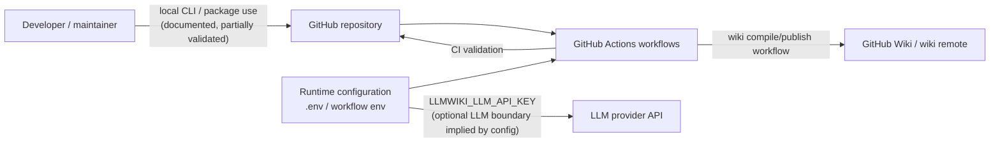
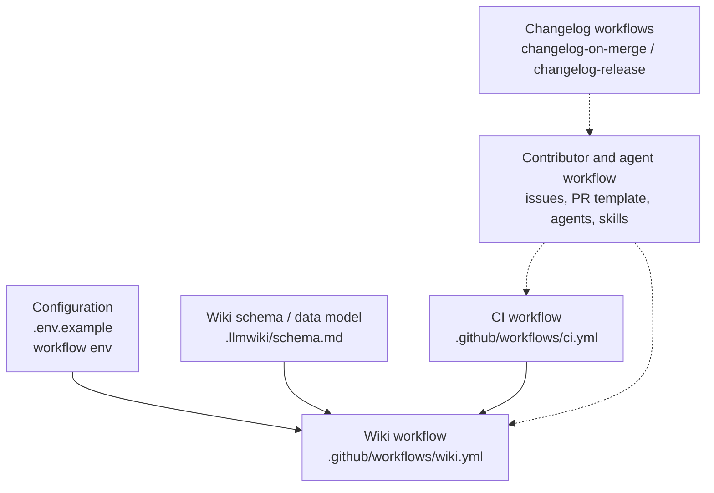
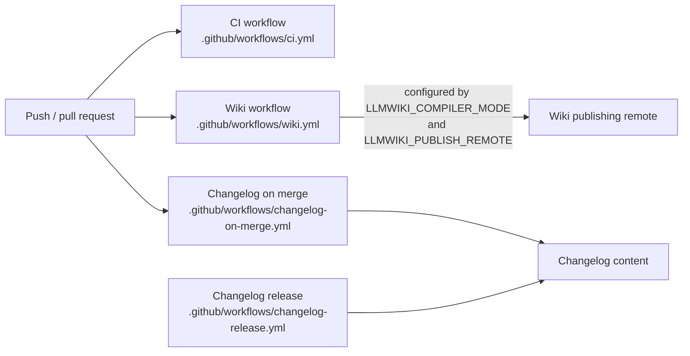

# Architecture

## Executive Architecture Summary

`repo-wiki` is a repository-to-wiki compiler project whose documented product goal is to turn immutable repository sources into a persistent, schema-guided GitHub Wiki knowledge base. This is supported by documentation cards for `README.md`, `docs/PLAN.md`, and `docs/WHY.md`, and by the presence of a wiki-generation workflow and wiki schema documentation in `.github/workflows/wiki.yml` and `.llmwiki/schema.md`.

At the architectural level visible from the available source cards, the repository is organized around these surfaces:

| Area | Evidence | Architectural role |
| --- | --- | --- |
| Wiki compiler/runtime configuration | `.env.example`, `.github/workflows/wiki.yml` | Defines runtime configuration for repository selection, GitHub authentication, compiler mode, LLM API access, and wiki publishing configuration. |
| CI and quality automation | `.github/workflows/ci.yml` | Provides automated validation in GitHub Actions. Exact job steps are not available in the source-card excerpts, so only the existence of CI automation is claimed. |
| Wiki publishing automation | `.github/workflows/wiki.yml` | Provides a GitHub Actions operational surface for compiling and/or publishing wiki content, with environment variables including `LLMWIKI_COMPILER_MODE` and `LLMWIKI_PUBLISH_REMOTE`. |
| Changelog automation | `.github/workflows/changelog-on-merge.yml`, `.github/workflows/changelog-release.yml`, `.github/skills/keep-a-changelog/SKILL.md` | Provides background automation and conventions for changelog maintenance. |
| Documentation/data model | `.llmwiki/schema.md` | Documents the schema/data model used by generated wiki pages. |
| Contributor and agent workflow | `AGENTS.md`, `.pi/AGENTS.md`, `.github/agents/*.agent.md`, `.github/copilot-review-instructions.md`, `.github/pull_request_template.md`, `.github/ISSUE_TEMPLATE/*.yml` | Defines human/AI contribution conventions, review practices, and issue/PR intake surfaces. |

The available cards do **not** include package manifests, TypeScript source files, compiled CLI files, or import graphs. Therefore, this page treats the implementation internals described in documentation cards as secondary/partially validated and avoids asserting unobserved concrete code-level module boundaries. The strongest source-backed architectural facts are the repository’s GitHub operational surfaces, environment-variable configuration points, schema documentation, issue/PR workflow files, and agent/contributor guidance.

## System and Repository Context

The repository boundary visible from the available evidence is a GitHub-hosted project with local/CI execution paths, optional LLM-provider integration, and GitHub Wiki publishing. Environment-variable configuration in `.env.example` names `GITHUB_REPOSITORY`, `GITHUB_TOKEN`, `LLMWIKI_COMPILER_MODE`, and `LLMWIKI_LLM_API_KEY`, indicating the runtime needs repository identity, GitHub credentials, compiler-mode selection, and optional LLM API access. The wiki workflow also references `LLMWIKI_COMPILER_MODE` and `LLMWIKI_PUBLISH_REMOTE`, indicating a CI path that can control compiler mode and publishing target/remote behavior. Evidence: `.env.example`, `.github/workflows/wiki.yml`.

The README documentation card describes the package as dual-role and states that local CLI/package verification runs against compiled output in `dist/`, with `npm test`, `npm run check`, and `npm run coverage` requiring successful TypeScript compilation. This is treated as partially validated documentation because package files and source files were not included in the source cards. Evidence: `README.md` documentation card.

Diagram evidence and limitations: GitHub Actions workflows are directly evidenced by `.github/workflows/ci.yml`, `.github/workflows/wiki.yml`, `.github/workflows/changelog-on-merge.yml`, and `.github/workflows/changelog-release.yml`. The environment-variable boundary is evidenced by `.env.example` and `.github/workflows/wiki.yml`. The local CLI/package path is based on the partially validated `README.md` documentation card, not source-code cards.

External surfaces visible in the available cards:

| Surface | Type | Evidence | Notes |
| --- | --- | --- | --- |
| Local environment file | Configuration | `.env.example` | Declares expected environment variable names; values must not be copied into documentation. |
| GitHub Actions CI | Automation | `.github/workflows/ci.yml` | Workflow exists and is categorized as CI/background work in the source card. |
| GitHub Actions wiki workflow | Automation / deployment | `.github/workflows/wiki.yml` | Workflow uses environment variables related to compiler mode and publishing remote. |
| Changelog workflows | Automation | `.github/workflows/changelog-on-merge.yml`, `.github/workflows/changelog-release.yml` | Workflows exist for changelog behavior; one references `GH_TOKEN`. |
| Issue templates | Contributor intake | `.github/ISSUE_TEMPLATE/config.yml`, `.github/ISSUE_TEMPLATE/epic.yml`, `.github/ISSUE_TEMPLATE/task.yml` | Structure issue reporting/planning. |
| Pull request template and review instructions | Review process | `.github/pull_request_template.md`, `.github/copilot-review-instructions.md` | Define PR/review conventions. |
| Agent/skill files | AI/contributor workflow | `.github/agents/*.agent.md`, `.github/skills/*.md`, `AGENTS.md`, `.pi/AGENTS.md` | Document specialized agent roles and skills. |
| Wiki schema documentation | Data model | `.llmwiki/schema.md` | Documents expected generated wiki structure/schema. |

## Major Modules and Responsibilities

### Wiki Compiler and Publication Pipeline

The central product capability, according to the documentation cards, is compiling repository evidence into a GitHub Wiki knowledge base. `docs/PLAN.md` describes a Karpathy-inspired LLM Wiki pattern where raw sources remain immutable, the wiki becomes a persistent compounding artifact, and a schema guides the generated wiki. `docs/WHY.md` explains the rationale for a maintained wiki rather than only search or RAG. These are secondary documentation claims, partially validated by the presence of `.llmwiki/schema.md` and `.github/workflows/wiki.yml`.

Responsibilities visible from evidence:

- Read repository and documentation evidence into a wiki-oriented representation, as implied by the product documentation cards and `.llmwiki/schema.md`.
- Support compiler-mode configuration through `LLMWIKI_COMPILER_MODE`. Evidence: `.env.example`, `.github/workflows/wiki.yml`.
- Support publishing to a wiki remote through the wiki workflow configuration. Evidence: `.github/workflows/wiki.yml`, especially its `LLMWIKI_PUBLISH_REMOTE` environment variable.
- Potentially call an LLM provider using an API key. Evidence: `.env.example` includes `LLMWIKI_LLM_API_KEY`; `docs/plans/llm-compiler.md` states the intended LLM boundary should be provider-agnostic and compatible with OpenAI-style chat completions. This provider-agnostic behavior remains a partially validated documentation claim because implementation files are not present in the source cards.

### Schema and Generated-Wiki Data Model

`.llmwiki/schema.md` is categorized as both documentation and data-model evidence. It is the main available source-card evidence for a structured output model for generated wiki pages.

Responsibilities visible from evidence:

- Define or document the shape of generated wiki pages. Evidence: `.llmwiki/schema.md`.
- Provide schema-level conventions for the compiler/output contract. Evidence: `.llmwiki/schema.md`.
- Support documentation trust and structured compilation behavior described in `docs/PLAN.md`, subject to validation against implementation when source files are available.

### CI and Quality Automation

The repository contains a CI workflow at `.github/workflows/ci.yml`, categorized as CI/background-work evidence. The README documentation card states that `npm test`, `npm run check`, and `npm run coverage` require successful TypeScript compilation and run against compiled output in `dist/`; however, package scripts and TypeScript project files were not provided among the source cards, so exact commands and stages cannot be independently verified here. Evidence: `.github/workflows/ci.yml`, `README.md` documentation card.

Responsibilities visible from evidence:

- Run automated repository checks in GitHub Actions. Evidence: `.github/workflows/ci.yml`.
- Maintain a quality gate around build/test/check/coverage behavior, as documented in `README.md`; implementation details remain partially validated.

### Changelog and Release Automation

The repository has two changelog-related workflows: `.github/workflows/changelog-on-merge.yml` and `.github/workflows/changelog-release.yml`. The on-merge workflow references `GH_TOKEN`, indicating GitHub API authentication during automation. `.github/skills/keep-a-changelog/SKILL.md` documents changelog conventions or agent skill behavior.

Responsibilities visible from evidence:

- Maintain changelog updates on merge or release events. Evidence: `.github/workflows/changelog-on-merge.yml`, `.github/workflows/changelog-release.yml`.
- Use GitHub token authentication for at least one changelog automation path. Evidence: `.github/workflows/changelog-on-merge.yml`.
- Apply Keep a Changelog-style conventions or guidance. Evidence: `.github/skills/keep-a-changelog/SKILL.md`.

### GitHub Issue, PR, Review, and Agent Workflow

The repository includes structured collaboration surfaces:

- Issue template configuration and templates: `.github/ISSUE_TEMPLATE/config.yml`, `.github/ISSUE_TEMPLATE/epic.yml`, `.github/ISSUE_TEMPLATE/task.yml`.
- Pull request template: `.github/pull_request_template.md`.
- Copilot review instructions: `.github/copilot-review-instructions.md`.
- Agent role documents: `.github/agents/coordinator.agent.md`, `.github/agents/developer.agent.md`, `.github/agents/docs.agent.md`, `.github/agents/fixer.agent.md`, `.github/agents/quality.agent.md`, `.github/agents/review.agent.md`.
- Repository-level agent guidance: `AGENTS.md`, `.pi/AGENTS.md`.
- Repository navigation skill: `.github/skills/repo-wiki-navigation/SKILL.md`.

These files form a contributor/agent operating layer around the implementation. They are not runtime modules unless invoked by external tools, but they are part of the repository’s operational architecture and governance.

### Planned or Partially Validated Product Modules

Several documentation cards describe planned or partially validated architecture areas. These are useful for understanding intended direction but should not be treated as fully implemented without source-code verification:

| Planned/Documented module | Evidence | Status |
| --- | --- | --- |
| CI publishing flow | `docs/plans/ci-publishing.md` documentation card, `.github/workflows/wiki.yml` | Partially validated by workflow presence. |
| GitHub Action behavior | `docs/plans/github-action.md` documentation card | Partially validated; exact action implementation not in source cards. |
| Incremental mode | `docs/plans/incremental-mode.md` documentation card | Marked stale in the provided card. |
| LLM compiler boundary | `docs/plans/llm-compiler.md` documentation card, `.env.example` | Partially validated by LLM API key config; implementation unverified. |
| Search index | `docs/plans/search-index.md` documentation card | Partially validated documentation only; no source-card implementation evidence. |

Diagram evidence and limitations: The diagram groups repository files by observed structure and workflow categories. It does not assert concrete code imports or runtime calls because import/runtime evidence was not available in the source cards.

## Runtime, Data, and Control-Flow Relationships

The strongest runtime/control-flow relationships supported by available source cards are workflow- and configuration-oriented rather than code-import-oriented.

### Configuration Flow

`.env.example` defines environment-variable names relevant to local or runtime execution:

| Variable | Evidence | Architectural meaning |
| --- | --- | --- |
| `GITHUB_REPOSITORY` | `.env.example` | Identifies the target GitHub repository. |
| `GITHUB_TOKEN` | `.env.example` | Authenticates with GitHub APIs or remotes. |
| `LLMWIKI_COMPILER_MODE` | `.env.example`, `.github/workflows/wiki.yml` | Selects compiler mode for local or CI execution. |
| `LLMWIKI_LLM_API_KEY` | `.env.example` | Provides LLM provider authentication. |
| `LLMWIKI_PUBLISH_REMOTE` | `.github/workflows/wiki.yml` | Configures publishing remote behavior in the wiki workflow. |
| `GH_TOKEN` | `.github/workflows/changelog-on-merge.yml` | Authenticates GitHub CLI/API operations for changelog automation. |

No secret values are present or reproduced here.

### Wiki Compilation and Publishing Control Path

Based on the wiki workflow and environment-variable evidence, the operational path is:

1. A GitHub Actions workflow for wiki work is available at `.github/workflows/wiki.yml`.
2. That workflow is configurable with `LLMWIKI_COMPILER_MODE` and `LLMWIKI_PUBLISH_REMOTE`. Evidence: `.github/workflows/wiki.yml`.
3. Local runs can also be configured using `.env.example`, which includes `GITHUB_REPOSITORY`, `GITHUB_TOKEN`, `LLMWIKI_COMPILER_MODE`, and `LLMWIKI_LLM_API_KEY`.
4. The output structure is governed or documented by `.llmwiki/schema.md`.

This does **not** prove the exact internal call graph of the compiler. Source-code cards with imports, functions, classes, or CLI entry points were not available.

### LLM Boundary

The presence of `LLMWIKI_LLM_API_KEY` in `.env.example` and the partially validated `docs/plans/llm-compiler.md` documentation card support an intended LLM integration boundary. The plan card states that the first production LLM boundary should be provider-agnostic and compatible with OpenAI-style chat completions. Because no implementation source was available in the source cards, the current provider API, request/response schema, retry behavior, model selection, and error handling are open questions.

### Search and Query Flow

`docs/plans/search-index.md` describes a planned local search index over generated wiki pages, source cards, and documentation cards for `repo-wiki search` and `repo-wiki query`. This remains documentation-card evidence only in the available set. No implementation source or package scripts were provided to verify commands, index format, or runtime flow.

## Build, Test, Deployment, and Operational Surfaces

The repository has multiple GitHub Actions workflows and documented npm-based local verification.

| Surface | Evidence | Supported claim |
| --- | --- | --- |
| CI workflow | `.github/workflows/ci.yml` | A CI workflow exists and is categorized as CI/background-work evidence. |
| Wiki workflow | `.github/workflows/wiki.yml` | A wiki automation workflow exists and uses `LLMWIKI_COMPILER_MODE` and `LLMWIKI_PUBLISH_REMOTE`. |
| Changelog on merge | `.github/workflows/changelog-on-merge.yml` | A changelog automation workflow exists and references `GH_TOKEN`. |
| Changelog release | `.github/workflows/changelog-release.yml` | A release-oriented changelog workflow exists. |
| Local npm verification | `README.md` documentation card | `npm test`, `npm run check`, and `npm run coverage` are documented as requiring a successful TypeScript compilation and using compiled output in `dist/`; this is partially validated only. |
| TypeScript build artifact metadata | `.tsbuildinfo` | A TypeScript incremental build-info file exists in the source-card set, suggesting TypeScript build activity, but it is insufficient to define the build pipeline. |

Diagram evidence and limitations: Workflow files support the existence of CI, wiki, and changelog automation. Trigger details, job dependencies, command names, and artifact behavior are not asserted because the source-card excerpts do not include full workflow contents. The `WikiJob` to `WikiRemote` edge is supported at a high level by `LLMWIKI_PUBLISH_REMOTE` in `.github/workflows/wiki.yml`, but exact publishing semantics are not verified.

## Cross-Cutting Concerns

### Configuration Management

Configuration is environment-variable based for GitHub integration, compiler mode, LLM access, and publishing behavior. Evidence: `.env.example`, `.github/workflows/wiki.yml`, `.github/workflows/changelog-on-merge.yml`.

Security-sensitive variables include `GITHUB_TOKEN`, `GH_TOKEN`, and `LLMWIKI_LLM_API_KEY`. Their names may be documented, but their values must not be committed, logged, or copied into wiki pages. Evidence: `.env.example`, `.github/workflows/changelog-on-merge.yml`.

### Security and Secret Handling

The repository relies on token-based integration with GitHub and possibly an LLM provider. Evidence: `.env.example`, `.github/workflows/changelog-on-merge.yml`.

Recommended architectural posture based on the evidence:

- Treat GitHub and LLM credentials as secrets.
- Avoid publishing environment values in generated wiki content.
- Ensure wiki publishing automation does not leak tokens in logs or generated pages.
- Keep `.env.example` limited to names/placeholders, not real credentials.

These recommendations are derived from the presence of secret-like configuration names and standard operational security practice; exact current enforcement mechanisms were not visible in source cards.

### Documentation Trust Model

The prompt’s authority rules and available evidence imply a layered documentation trust model:

1. Source code at the pinned commit is authoritative.
2. Tests, CI, configuration, schemas, and migrations are high-authority evidence.
3. Markdown documentation is secondary evidence and should be validated against code/config before being treated as current behavior.

Within the available cards, the most authoritative evidence comes from workflow/config/schema files such as `.github/workflows/*.yml`, `.env.example`, and `.llmwiki/schema.md`. Documentation cards such as `README.md`, `docs/PLAN.md`, and plan files are used for intent and terminology but marked as partially validated or stale where applicable.

### Data Model and Output Contract

`.llmwiki/schema.md` is the visible data-model anchor. Generated wiki pages should align with the schema and preserve machine-readable metadata when required. Evidence: `.llmwiki/schema.md`.

This generated page also uses frontmatter and a human-notes block as required by the compilation contract for wiki pages. That output contract is externally supplied by the compilation request and supported conceptually by `.llmwiki/schema.md`, but the exact schema fields should be verified against `.llmwiki/schema.md` when full file content is available.

### Contributor Governance

The repository contains multiple governance and collaboration files:

- Issue templates for epics and tasks. Evidence: `.github/ISSUE_TEMPLATE/epic.yml`, `.github/ISSUE_TEMPLATE/task.yml`.
- Issue template configuration. Evidence: `.github/ISSUE_TEMPLATE/config.yml`.
- Pull request template. Evidence: `.github/pull_request_template.md`.
- Copilot review instructions. Evidence: `.github/copilot-review-instructions.md`.
- Agent role documents. Evidence: `.github/agents/coordinator.agent.md`, `.github/agents/developer.agent.md`, `.github/agents/docs.agent.md`, `.github/agents/fixer.agent.md`, `.github/agents/quality.agent.md`, `.github/agents/review.agent.md`.
- Repository-level agent instructions. Evidence: `AGENTS.md`, `.pi/AGENTS.md`.
- Skills for changelog and repo-wiki navigation. Evidence: `.github/skills/keep-a-changelog/SKILL.md`, `.github/skills/repo-wiki-navigation/SKILL.md`.

This suggests the project intentionally encodes both human and AI-assisted contribution practices in the repository.

## Caveats and Open Questions

### Caveats

- No implementation source files, package manifest, CLI entry-point source, import graph, or tests were included in the provided source cards. As a result, code-level architecture, internal class/function boundaries, and exact dependency chains cannot be verified from the available evidence.
- The README documentation card mentions a dual-role package, compiled output in `dist/`, and npm scripts including `npm test`, `npm run check`, and `npm run coverage`; these are treated as partially validated because the package scripts themselves are not present in the source-card set.
- `docs/plans/incremental-mode.md` is explicitly marked stale in the documentation cards. Claims from that plan should not be treated as current architecture without source validation.
- The LLM compiler, GitHub Action behavior, CI publishing flow, and search index are described in plan documentation cards, but implementation details are not verified by source cards here.
- Mermaid diagrams in this page are intentionally high level. They are inferred from repository structure, workflow files, environment-variable declarations, and documentation cards; they do not represent verified source-code call graphs.
- `.tsbuildinfo` suggests TypeScript build activity, but it is not enough to reconstruct the build system or confirm exact compiler options.

### Open Questions

1. What are the actual CLI entry points, exported package APIs, and command names? The README card mentions local CLI/package behavior, but source files and `package.json` were not in the available source cards.
2. What is the current implementation status of the LLM compiler boundary described in `docs/plans/llm-compiler.md`?
3. Does the wiki workflow only build artifacts, publish to GitHub Wiki, or support both local artifact and remote publishing modes? `.github/workflows/wiki.yml` indicates publishing configuration, but full job semantics are not visible in the card excerpt.
4. What schema fields are required by `.llmwiki/schema.md`, and how strictly are they validated in code?
5. Is the search index described in `docs/plans/search-index.md` implemented, planned, or only aspirational?
6. Is incremental mode implemented despite the stale plan, or has it been superseded?
7. What tests enforce documentation-generation behavior, secret redaction, schema compliance, and wiki publishing safety?
8. How are existing wiki pages fetched, merged, and preserved during publishing, especially around human-maintained sections?
9. What deployment/publishing safeguards prevent accidental pushes to the wrong wiki remote or leakage of generated content?
10. How are agent instruction files consumed: by GitHub Copilot, external automation, local agent tooling, or only as contributor documentation?

<!-- HUMAN_NOTES_START -->
<!-- HUMAN_NOTES_END -->
