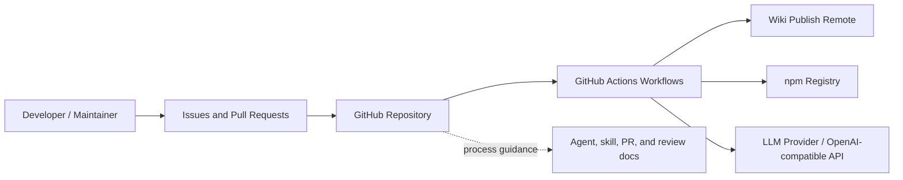
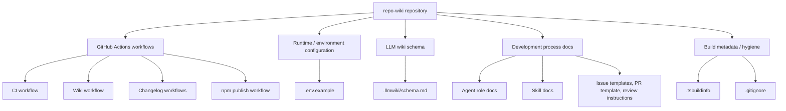
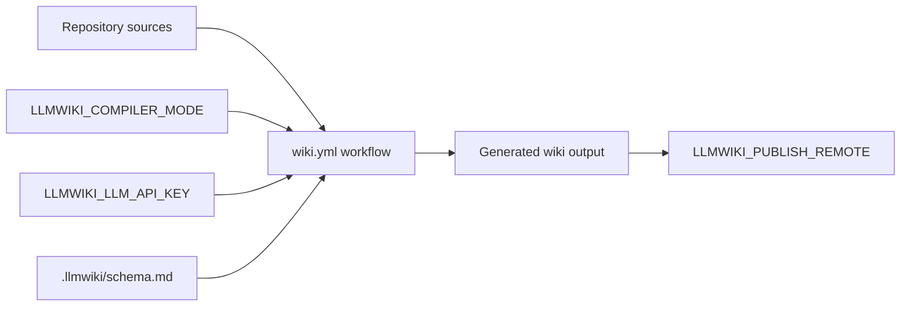
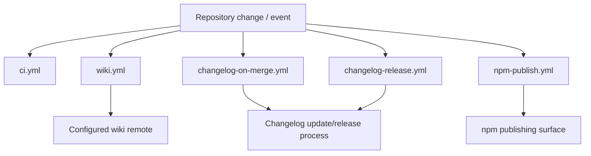

# Architecture

## Executive Architecture Summary

`repo-wiki` is a repository-wiki automation project with evidence of three main architectural concerns:

1. **Wiki compilation and publishing operations** — environment variables and CI configuration indicate that the system can run in configurable compiler modes and publish generated wiki output to a remote wiki target. The relevant operational knobs include `LLMWIKI_COMPILER_MODE`, `LLMWIKI_PUBLISH_REMOTE`, `GITHUB_REPOSITORY`, `GITHUB_TOKEN`, and `LLMWIKI_LLM_API_KEY`. [`.env.example`](.env.example), [`.github/workflows/wiki.yml`](.github/workflows/wiki.yml)
2. **Repository automation and release operations** — workflow files define CI, changelog automation, release/changelog behavior, npm publishing, and wiki workflows. [`.github/workflows/ci.yml`](.github/workflows/ci.yml), [`.github/workflows/changelog-on-merge.yml`](.github/workflows/changelog-on-merge.yml), [`.github/workflows/changelog-release.yml`](.github/workflows/changelog-release.yml), [`.github/workflows/npm-publish.yml`](.github/workflows/npm-publish.yml), [`.github/workflows/wiki.yml`](.github/workflows/wiki.yml)
3. **Human/agent development process support** — the repository contains GitHub issue templates, pull request guidance, Copilot review instructions, agent role documents, and skills for changelog and wiki navigation workflows. [`.github/ISSUE_TEMPLATE/config.yml`](.github/ISSUE_TEMPLATE/config.yml), [`.github/ISSUE_TEMPLATE/epic.yml`](.github/ISSUE_TEMPLATE/epic.yml), [`.github/ISSUE_TEMPLATE/task.yml`](.github/ISSUE_TEMPLATE/task.yml), [`.github/pull_request_template.md`](.github/pull_request_template.html), [`.github/copilot-review-instructions.md`](.github/copilot-review-instructions.html), [`.github/agents/coordinator.agent.md`](.github/agents/coordinator.agent.html), [`.github/agents/developer.agent.md`](.github/agents/developer.agent.html), [`.github/agents/docs.agent.md`](.github/agents/docs.agent.html), [`.github/agents/fixer.agent.md`](.github/agents/fixer.agent.html), [`.github/agents/quality.agent.md`](.github/agents/quality.agent.html), [`.github/agents/review.agent.md`](.github/agents/review.agent.html), [`.github/skills/keep-a-changelog/SKILL.md`](.github/skills/keep-a-changelog/SKILL.html), [`.github/skills/repo-wiki-navigation/SKILL.md`](.github/skills/repo-wiki-navigation/SKILL.html)

The available source cards do **not** include application source files, `package.json`, TypeScript source, tests, or compiled entrypoints. As a result, this architecture page can describe repository-level operational surfaces and documented process structure, but it cannot fully verify runtime module internals or public package APIs from authoritative code. The `.tsbuildinfo` file is evidence that TypeScript build metadata exists, but it is not sufficient by itself to reconstruct the TypeScript source architecture. [`.tsbuildinfo`](.tsbuildinfo.html)

Documentation cards describe the intended product as an implementation of an “LLM Wiki” pattern for repositories and mention a published extension entrypoint and skill packaging, but those claims are only partially validated by the provided source cards. [Documentation card: `README.md`], [Documentation card: `docs/PLAN.md`], [Documentation card: `docs/WHY.md`]

## System and Repository Context

### Repository boundary

The repository boundary visible from the provided source cards consists primarily of:

| Surface | Evidence | Architectural interpretation | Confidence |
| --- | --- | --- | --- |
| Wiki workflow | `.github/workflows/wiki.yml` declares wiki-related CI configuration and environment variables including `LLMWIKI_COMPILER_MODE` and `LLMWIKI_PUBLISH_REMOTE`. | A CI-operated wiki generation/publishing surface exists. | Medium |
| CI workflow | `.github/workflows/ci.yml` exists. | The repository has a continuous integration surface. | Medium |
| Changelog workflows | `.github/workflows/changelog-on-merge.yml` and `.github/workflows/changelog-release.yml` exist; the merge workflow references `GH_TOKEN`. | Changelog automation is part of the operational architecture. | Medium |
| npm publishing workflow | `.github/workflows/npm-publish.yml` exists. | The repository has an npm publication path. Exact package details are not available in the provided source cards. | Low |
| Local/environment configuration | `.env.example` lists `GITHUB_REPOSITORY`, `GITHUB_TOKEN`, `LLMWIKI_COMPILER_MODE`, and `LLMWIKI_LLM_API_KEY`. | Local or CI runs can be configured for GitHub access, compiler mode, and LLM provider credentials. | Medium |
| LLM wiki schema | `.llmwiki/schema.md` exists and is categorized as data-model documentation. | The wiki compiler/process has a documented schema artifact. | Medium |
| Agent/process docs | `.github/agents/*.agent.md`, `.github/skills/*/SKILL.md`, `.pi/AGENTS.md` exist. | The repository encodes role/process guidance for agent-assisted development. | Medium |
| Issue and PR process | Issue templates, PR template, and Copilot review instructions exist. | The repository has structured contribution/review workflows. | Medium |

Sources: [`.github/workflows/wiki.yml`](.github/workflows/wiki.yml), [`.github/workflows/ci.yml`](.github/workflows/ci.yml), [`.github/workflows/changelog-on-merge.yml`](.github/workflows/changelog-on-merge.yml), [`.github/workflows/changelog-release.yml`](.github/workflows/changelog-release.yml), [`.github/workflows/npm-publish.yml`](.github/workflows/npm-publish.yml), [`.env.example`](.env.example), [`.llmwiki/schema.md`](.llmwiki/schema.html), [`.github/agents/coordinator.agent.md`](.github/agents/coordinator.agent.html), [`.github/agents/developer.agent.md`](.github/agents/developer.agent.html), [`.github/agents/docs.agent.md`](.github/agents/docs.agent.html), [`.github/agents/fixer.agent.md`](.github/agents/fixer.agent.html), [`.github/agents/quality.agent.md`](.github/agents/quality.agent.html), [`.github/agents/review.agent.md`](.github/agents/review.agent.html), [`.github/skills/keep-a-changelog/SKILL.md`](.github/skills/keep-a-changelog/SKILL.html), [`.github/skills/repo-wiki-navigation/SKILL.md`](.github/skills/repo-wiki-navigation/SKILL.html), [`.pi/AGENTS.md`](.pi/AGENTS.html), [`.github/ISSUE_TEMPLATE/config.yml`](.github/ISSUE_TEMPLATE/config.yml), [`.github/ISSUE_TEMPLATE/epic.yml`](.github/ISSUE_TEMPLATE/epic.yml), [`.github/ISSUE_TEMPLATE/task.yml`](.github/ISSUE_TEMPLATE/task.yml), [`.github/pull_request_template.md`](.github/pull_request_template.html), [`.github/copilot-review-instructions.md`](.github/copilot-review-instructions.html)

### Context diagram

The following diagram is limited to repository boundaries and external surfaces directly supported by configuration/workflow evidence. It does **not** describe internal compiler implementation, because application source cards were not provided.

Evidence and limits:

- GitHub Actions workflow files exist for CI, wiki, changelog, release/changelog, and npm publishing. [`.github/workflows/ci.yml`](.github/workflows/ci.yml), [`.github/workflows/wiki.yml`](.github/workflows/wiki.yml), [`.github/workflows/changelog-on-merge.yml`](.github/workflows/changelog-on-merge.yml), [`.github/workflows/changelog-release.yml`](.github/workflows/changelog-release.yml), [`.github/workflows/npm-publish.yml`](.github/workflows/npm-publish.yml)
- The wiki workflow references `LLMWIKI_PUBLISH_REMOTE`, supporting a remote publishing target. [`.github/workflows/wiki.yml`](.github/workflows/wiki.yml)
- `.env.example` references `LLMWIKI_LLM_API_KEY`, supporting an LLM-provider integration boundary, but the provider implementation is not available in the source cards. [`.env.example`](.env.example)
- npm publishing is inferred from the workflow filename/path only; package configuration was not provided. [`.github/workflows/npm-publish.yml`](.github/workflows/npm-publish.yml)

## Major Modules and Responsibilities

### Wiki generation and publication workflow

The repository includes a dedicated wiki workflow configuration. The source card for `.github/workflows/wiki.yml` identifies it as CI/configuration and records runtime hints for background work and environment variables `LLMWIKI_COMPILER_MODE` and `LLMWIKI_PUBLISH_REMOTE`. [`.github/workflows/wiki.yml`](.github/workflows/wiki.yml)

Responsibilities that are supported by available evidence:

- Running wiki-related automation in CI. [`.github/workflows/wiki.yml`](.github/workflows/wiki.yml)
- Selecting a compiler mode through `LLMWIKI_COMPILER_MODE`. [`.github/workflows/wiki.yml`](.github/workflows/wiki.yml), [`.env.example`](.env.example)
- Publishing to a configured remote through `LLMWIKI_PUBLISH_REMOTE`. [`.github/workflows/wiki.yml`](.github/workflows/wiki.yml)

Related documentation cards describe plans for CI publishing, GitHub Action behavior, and LLM compiler behavior, but those plan-level details are not fully validated by the provided source cards. [Documentation card: `docs/plans/ci-publishing.md`], [Documentation card: `docs/plans/github-action.md`], [Documentation card: `docs/plans/llm-compiler.md`]

### Local/runtime configuration

`.env.example` defines the visible environment-variable contract for local or operational runs:

| Variable | Evidence | Likely role | Confidence |
| --- | --- | --- | --- |
| `GITHUB_REPOSITORY` | Listed in `.env.example`. | Identifies the target GitHub repository. | Medium |
| `GITHUB_TOKEN` | Listed in `.env.example`. | Authenticates GitHub API or repository operations. Do not commit real token values. | Medium |
| `LLMWIKI_COMPILER_MODE` | Listed in `.env.example` and referenced by the wiki workflow source card. | Selects compiler behavior/mode. | Medium |
| `LLMWIKI_LLM_API_KEY` | Listed in `.env.example`. | Authenticates with an LLM provider or compatible API. | Medium |

Source: [`.env.example`](.env.example), [`.github/workflows/wiki.yml`](.github/workflows/wiki.yml)

### Continuous integration workflow

`.github/workflows/ci.yml` is identified as a CI workflow with a background-work runtime hint. This supports the existence of an automated CI validation stage, but the provided source card does not expose exact jobs, commands, matrix configuration, or test runners. [`.github/workflows/ci.yml`](.github/workflows/ci.yml)

### Changelog and release automation

The repository includes two changelog-related workflows:

- `.github/workflows/changelog-on-merge.yml`, identified as CI/configuration and referencing `GH_TOKEN`. [`.github/workflows/changelog-on-merge.yml`](.github/workflows/changelog-on-merge.yml)
- `.github/workflows/changelog-release.yml`, identified as CI and background work. [`.github/workflows/changelog-release.yml`](.github/workflows/changelog-release.yml)

The repository also includes a `keep-a-changelog` skill document, indicating documented process support for changelog maintenance. [`.github/skills/keep-a-changelog/SKILL.md`](.github/skills/keep-a-changelog/SKILL.html)

### npm publishing workflow

`.github/workflows/npm-publish.yml` is present and classified as CI with background-work hints. This supports an npm publishing operational surface, but exact package names, package exports, build artifacts, and publishing triggers cannot be verified from the provided source cards. [`.github/workflows/npm-publish.yml`](.github/workflows/npm-publish.yml)

The README documentation card claims an extension entrypoint is published as `@mfittko/repo-wiki/extension` and that a skill is shipped in `skills/repo-wiki-cli/SKILL.md`, but neither `package.json` nor that source path appears in the provided source cards, so this remains only partially validated here. [Documentation card: `README.md`]

### LLM wiki schema and data model

`.llmwiki/schema.md` is present and categorized as data-model documentation. This indicates that the repository defines or documents a schema for wiki compilation outputs or wiki knowledge-base structure. [`.llmwiki/schema.md`](.llmwiki/schema.html)

Documentation cards state that the project follows an LLM Wiki pattern in which raw sources remain immutable and the wiki becomes a persistent compounding artifact. This describes product intent, but implementation details are not fully validated by the provided source cards. [Documentation card: `docs/PLAN.md`], [Documentation card: `docs/WHY.md`]

### Agent, skill, and contributor-process guidance

The repository contains multiple agent role documents:

- Coordinator agent. [`.github/agents/coordinator.agent.md`](.github/agents/coordinator.agent.html)
- Developer agent. [`.github/agents/developer.agent.md`](.github/agents/developer.agent.html)
- Docs agent. [`.github/agents/docs.agent.md`](.github/agents/docs.agent.html)
- Fixer agent. [`.github/agents/fixer.agent.md`](.github/agents/fixer.agent.html)
- Quality agent. [`.github/agents/quality.agent.md`](.github/agents/quality.agent.html)
- Review agent. [`.github/agents/review.agent.md`](.github/agents/review.agent.html)

It also contains skills for changelog and wiki navigation workflows. [`.github/skills/keep-a-changelog/SKILL.md`](.github/skills/keep-a-changelog/SKILL.html), [`.github/skills/repo-wiki-navigation/SKILL.md`](.github/skills/repo-wiki-navigation/SKILL.html)

Contributor intake and review process files include issue templates, a pull request template, and Copilot review instructions. [`.github/ISSUE_TEMPLATE/config.yml`](.github/ISSUE_TEMPLATE/config.yml), [`.github/ISSUE_TEMPLATE/epic.yml`](.github/ISSUE_TEMPLATE/epic.yml), [`.github/ISSUE_TEMPLATE/task.yml`](.github/ISSUE_TEMPLATE/task.yml), [`.github/pull_request_template.md`](.github/pull_request_template.html), [`.github/copilot-review-instructions.md`](.github/copilot-review-instructions.html)

### Repository hygiene and build metadata

`.gitignore` is present, indicating repository-level ignore rules. [`.gitignore`](.gitignore)

`.tsbuildinfo` is present and classified with a background-work hint. This is consistent with TypeScript incremental build metadata, but the TypeScript project configuration and source files are not included in the provided source cards. [`.tsbuildinfo`](.tsbuildinfo.html)

`.devloops` is present as a source text file, but no operational semantics can be verified from the source card alone. [`.devloops`](.devloops)

### Component/module diagram

This diagram is a repository-structure diagram, not a verified runtime call graph. It shows groupings supported by the visible files and workflows.

Evidence: [`.github/workflows/ci.yml`](.github/workflows/ci.yml), [`.github/workflows/wiki.yml`](.github/workflows/wiki.yml), [`.github/workflows/changelog-on-merge.yml`](.github/workflows/changelog-on-merge.yml), [`.github/workflows/changelog-release.yml`](.github/workflows/changelog-release.yml), [`.github/workflows/npm-publish.yml`](.github/workflows/npm-publish.yml), [`.env.example`](.env.example), [`.llmwiki/schema.md`](.llmwiki/schema.html), [`.github/agents/coordinator.agent.md`](.github/agents/coordinator.agent.html), [`.github/agents/developer.agent.md`](.github/agents/developer.agent.html), [`.github/agents/docs.agent.md`](.github/agents/docs.agent.html), [`.github/agents/fixer.agent.md`](.github/agents/fixer.agent.html), [`.github/agents/quality.agent.md`](.github/agents/quality.agent.html), [`.github/agents/review.agent.md`](.github/agents/review.agent.html), [`.github/skills/keep-a-changelog/SKILL.md`](.github/skills/keep-a-changelog/SKILL.html), [`.github/skills/repo-wiki-navigation/SKILL.md`](.github/skills/repo-wiki-navigation/SKILL.html), [`.github/ISSUE_TEMPLATE/config.yml`](.github/ISSUE_TEMPLATE/config.yml), [`.github/ISSUE_TEMPLATE/epic.yml`](.github/ISSUE_TEMPLATE/epic.yml), [`.github/ISSUE_TEMPLATE/task.yml`](.github/ISSUE_TEMPLATE/task.yml), [`.github/pull_request_template.md`](.github/pull_request_template.html), [`.github/copilot-review-instructions.md`](.github/copilot-review-instructions.html), [`.tsbuildinfo`](.tsbuildinfo.html), [`.gitignore`](.gitignore)

## Runtime, Data, and Control-Flow Relationships

### Verified runtime relationships

The provided source cards support only limited runtime/control-flow conclusions:

| Relationship | Evidence | Claim status |
| --- | --- | --- |
| Wiki workflow consumes wiki-related environment variables. | `.github/workflows/wiki.yml` source card lists `LLMWIKI_COMPILER_MODE` and `LLMWIKI_PUBLISH_REMOTE`. | Partially verified |
| Local or operational runs may consume GitHub and LLM-related environment variables. | `.env.example` lists `GITHUB_REPOSITORY`, `GITHUB_TOKEN`, `LLMWIKI_COMPILER_MODE`, and `LLMWIKI_LLM_API_KEY`. | Partially verified |
| Changelog-on-merge workflow consumes `GH_TOKEN`. | `.github/workflows/changelog-on-merge.yml` source card lists `GH_TOKEN`. | Partially verified |
| Background automation exists for CI, changelog, release, npm publishing, and wiki operations. | Workflow source cards are categorized as CI and include background-work runtime hints. | Partially verified |
| TypeScript build metadata exists. | `.tsbuildinfo` exists and is categorized as source with background-work hints. | Low-confidence supporting evidence only |

Sources: [`.github/workflows/wiki.yml`](.github/workflows/wiki.yml), [`.env.example`](.env.example), [`.github/workflows/changelog-on-merge.yml`](.github/workflows/changelog-on-merge.yml), [`.github/workflows/ci.yml`](.github/workflows/ci.yml), [`.github/workflows/changelog-release.yml`](.github/workflows/changelog-release.yml), [`.github/workflows/npm-publish.yml`](.github/workflows/npm-publish.yml), [`.tsbuildinfo`](.tsbuildinfo.html)

### Inferred wiki operation flow

The following flow is inferred from workflow/environment names and documentation-plan cards, not from source-level function calls or imports. Treat it as an operational hypothesis until application code and full workflow contents are available.

Evidence and limitations:

- `wiki.yml` is the only source-card evidence for the wiki automation workflow. [`.github/workflows/wiki.yml`](.github/workflows/wiki.yml)
- `.env.example` provides local/operational variables including the LLM API key and compiler mode. [`.env.example`](.env.example)
- `.llmwiki/schema.md` supports the existence of a schema artifact, but its runtime use is not proven by import or command evidence in the provided cards. [`.llmwiki/schema.md`](.llmwiki/schema.html)
- The output and remote publish step are inferred from `LLMWIKI_PUBLISH_REMOTE` and documentation cards about CI publishing, not directly verified from executable source. [`.github/workflows/wiki.yml`](.github/workflows/wiki.yml), [Documentation card: `docs/plans/ci-publishing.md`]

## Build, Test, Deployment, and Operational Surfaces

### CI and automation inventory

| Workflow/configuration | Purpose visible from evidence | External/config inputs | Confidence |
| --- | --- | --- | --- |
| `.github/workflows/ci.yml` | Continuous integration workflow exists. Exact jobs/commands are not visible in the source card. | Not listed in source card. | Medium existence, low implementation detail |
| `.github/workflows/wiki.yml` | Wiki automation workflow exists. | `LLMWIKI_COMPILER_MODE`, `LLMWIKI_PUBLISH_REMOTE` | Medium |
| `.github/workflows/changelog-on-merge.yml` | Changelog automation on merge exists. | `GH_TOKEN` | Medium |
| `.github/workflows/changelog-release.yml` | Changelog/release workflow exists. | Not listed in source card. | Medium existence, low implementation detail |
| `.github/workflows/npm-publish.yml` | npm publishing workflow exists. | Not listed in source card. | Medium existence, low implementation detail |
| `.env.example` | Example local/runtime environment configuration. | `GITHUB_REPOSITORY`, `GITHUB_TOKEN`, `LLMWIKI_COMPILER_MODE`, `LLMWIKI_LLM_API_KEY` | Medium |

Sources: [`.github/workflows/ci.yml`](.github/workflows/ci.yml), [`.github/workflows/wiki.yml`](.github/workflows/wiki.yml), [`.github/workflows/changelog-on-merge.yml`](.github/workflows/changelog-on-merge.yml), [`.github/workflows/changelog-release.yml`](.github/workflows/changelog-release.yml), [`.github/workflows/npm-publish.yml`](.github/workflows/npm-publish.yml), [`.env.example`](.env.example)

### Build/test/deploy flow diagram

This diagram is supported at the workflow-file level. It intentionally avoids naming exact commands, package scripts, job names, or triggers that are not exposed in the source cards.

Evidence: [`.github/workflows/ci.yml`](.github/workflows/ci.yml), [`.github/workflows/wiki.yml`](.github/workflows/wiki.yml), [`.github/workflows/changelog-on-merge.yml`](.github/workflows/changelog-on-merge.yml), [`.github/workflows/changelog-release.yml`](.github/workflows/changelog-release.yml), [`.github/workflows/npm-publish.yml`](.github/workflows/npm-publish.yml)

Limitations:

- Workflow triggers and exact job dependencies are not available in the source-card excerpts.
- The npm registry destination is inferred from the workflow filename, not validated from package or workflow step contents. [`.github/workflows/npm-publish.yml`](.github/workflows/npm-publish.yml)
- The wiki remote destination is supported by the `LLMWIKI_PUBLISH_REMOTE` environment variable in the wiki workflow source card, but the publish command is not visible. [`.github/workflows/wiki.yml`](.github/workflows/wiki.yml)

### Operational entry points

The operational entry points that can be described from current evidence are:

- **GitHub Actions workflow entry points** for CI, wiki generation/publishing, changelog automation, release/changelog automation, and npm publishing. [`.github/workflows/ci.yml`](.github/workflows/ci.yml), [`.github/workflows/wiki.yml`](.github/workflows/wiki.yml), [`.github/workflows/changelog-on-merge.yml`](.github/workflows/changelog-on-merge.yml), [`.github/workflows/changelog-release.yml`](.github/workflows/changelog-release.yml), [`.github/workflows/npm-publish.yml`](.github/workflows/npm-publish.yml)
- **Environment-variable configuration** for GitHub access, compiler behavior, and LLM provider credentials. [`.env.example`](.env.example)
- **Issue/PR process entry points** for human contribution flow. [`.github/ISSUE_TEMPLATE/config.yml`](.github/ISSUE_TEMPLATE/config.yml), [`.github/ISSUE_TEMPLATE/epic.yml`](.github/ISSUE_TEMPLATE/epic.yml), [`.github/ISSUE_TEMPLATE/task.yml`](.github/ISSUE_TEMPLATE/task.yml), [`.github/pull_request_template.md`](.github/pull_request_template.html)
- **Agent/process guidance entry points** for repository-specific automation or human-in-the-loop development roles. [`.github/agents/coordinator.agent.md`](.github/agents/coordinator.agent.html), [`.github/agents/developer.agent.md`](.github/agents/developer.agent.html), [`.github/agents/docs.agent.md`](.github/agents/docs.agent.html), [`.github/agents/fixer.agent.md`](.github/agents/fixer.agent.html), [`.github/agents/quality.agent.md`](.github/agents/quality.agent.html), [`.github/agents/review.agent.md`](.github/agents/review.agent.html), [`.pi/AGENTS.md`](.pi/AGENTS.html)

## Cross-Cutting Concerns

### Configuration and secrets

The repository exposes example environment variables for GitHub and LLM integration. [`.env.example`](.env.example)

Security-sensitive variables include:

- `GITHUB_TOKEN` [`.env.example`](.env.example)
- `GH_TOKEN` [`.github/workflows/changelog-on-merge.yml`](.github/workflows/changelog-on-merge.yml)
- `LLMWIKI_LLM_API_KEY` [`.env.example`](.env.example)

No secret values are included in this generated page. Real token values should remain in GitHub Actions secrets, local untracked environment files, or other secret-management systems rather than committed source files. This recommendation is based on the presence of token/API-key variable names and `.gitignore` repository hygiene evidence, not on a verified secrets-management implementation. [`.env.example`](.env.example), [`.gitignore`](.gitignore)

### LLM/provider boundary

The `LLMWIKI_LLM_API_KEY` variable indicates an LLM-provider boundary. [`.env.example`](.env.example)

Documentation cards also describe a provider-agnostic, OpenAI-style chat-completions boundary, but this implementation detail is not verified by the provided source cards. [Documentation card: `docs/plans/llm-compiler.md`]

### GitHub integration boundary

`GITHUB_REPOSITORY`, `GITHUB_TOKEN`, and `GH_TOKEN` indicate GitHub API/repository integration surfaces. [`.env.example`](.env.example), [`.github/workflows/changelog-on-merge.yml`](.github/workflows/changelog-on-merge.yml)

The exact GitHub operations performed by the application or workflows cannot be verified from the source-card excerpts. [`.github/workflows/wiki.yml`](.github/workflows/wiki.yml), [`.github/workflows/changelog-on-merge.yml`](.github/workflows/changelog-on-merge.yml)

### Data model and schema governance

`.llmwiki/schema.md` is the visible schema/data-model artifact for the wiki knowledge base. [`.llmwiki/schema.md`](.llmwiki/schema.html)

Because the source cards do not include generated wiki pages, schema validators, tests, or compiler source, this page cannot verify whether the schema is enforced at runtime. [`.llmwiki/schema.md`](.llmwiki/schema.html)

### Documentation trust and documentation debt

Operational claims from documentation cards are treated as secondary evidence. Current notable partially validated documentation claims include:

| Documentation claim area | Status in this page | Evidence status |
| --- | --- | --- |
| Published extension entrypoint `@mfittko/repo-wiki/extension`. | Not treated as verified architecture. | Mentioned in README documentation card; package/source files not provided. [Documentation card: `README.md`] |
| CLI/skill packaging in `skills/repo-wiki-cli/SKILL.md`. | Not treated as verified source path. | Mentioned in README documentation card; not present in provided source cards. [Documentation card: `README.md`] |
| LLM Wiki product model and persistent wiki artifact. | Treated as product intent. | Described in plan/why documentation cards; implementation not verified from code. [Documentation card: `docs/PLAN.md`], [Documentation card: `docs/WHY.md`] |
| CI publishing architecture. | Treated as partially validated by workflow presence. | Workflow file exists, but full steps and commands are not exposed. [`.github/workflows/wiki.yml`](.github/workflows/wiki.yml), [Documentation card: `docs/plans/ci-publishing.md`] |
| Incremental mode architecture. | Not treated as current behavior. | Documentation card is marked stale. [Documentation card: `docs/plans/incremental-mode.md`] |

### Contribution and review process

Issue templates, PR template, Copilot review instructions, agent guidance, and skill documents indicate a structured human/AI-assisted development process around the repository. [`.github/ISSUE_TEMPLATE/config.yml`](.github/ISSUE_TEMPLATE/config.yml), [`.github/ISSUE_TEMPLATE/epic.yml`](.github/ISSUE_TEMPLATE/epic.yml), [`.github/ISSUE_TEMPLATE/task.yml`](.github/ISSUE_TEMPLATE/task.yml), [`.github/pull_request_template.md`](.github/pull_request_template.html), [`.github/copilot-review-instructions.md`](.github/copilot-review-instructions.html), [`.github/agents/coordinator.agent.md`](.github/agents/coordinator.agent.html), [`.github/agents/developer.agent.md`](.github/agents/developer.agent.html), [`.github/agents/docs.agent.md`](.github/agents/docs.agent.html), [`.github/agents/fixer.agent.md`](.github/agents/fixer.agent.html), [`.github/agents/quality.agent.md`](.github/agents/quality.agent.html), [`.github/agents/review.agent.md`](.github/agents/review.agent.html), [`.github/skills/keep-a-changelog/SKILL.md`](.github/skills/keep-a-changelog/SKILL.html), [`.github/skills/repo-wiki-navigation/SKILL.md`](.github/skills/repo-wiki-navigation/SKILL.html), [`.pi/AGENTS.md`](.pi/AGENTS.html)

## Caveats and Open Questions

### Caveats

1. **Application source was not included in the source cards.** No TypeScript/JavaScript source files, package manifest, CLI files, extension entrypoints, tests, or library modules were available, so internal architecture, exported APIs, and runtime call graphs cannot be verified. [`.tsbuildinfo`](.tsbuildinfo.html)
2. **Workflow details are only partially visible.** The workflow files are listed, but the source-card excerpts do not expose triggers, jobs, steps, commands, permissions, artifacts, or dependency order. [`.github/workflows/ci.yml`](.github/workflows/ci.yml), [`.github/workflows/wiki.yml`](.github/workflows/wiki.yml), [`.github/workflows/changelog-on-merge.yml`](.github/workflows/changelog-on-merge.yml), [`.github/workflows/changelog-release.yml`](.github/workflows/changelog-release.yml), [`.github/workflows/npm-publish.yml`](.github/workflows/npm-publish.yml)
3. **The diagrams are repository-structure and operational-surface diagrams, not verified implementation diagrams.** They are based on workflow/configuration files and documented repository structure, not on import graphs or executable source analysis. [`.github/workflows/ci.yml`](.github/workflows/ci.yml), [`.github/workflows/wiki.yml`](.github/workflows/wiki.yml), [`.env.example`](.env.example), [`.llmwiki/schema.md`](.llmwiki/schema.html)
4. **Documentation claims are partially validated at best.** README and planning documents describe intended architecture such as package entrypoints, GitHub Action behavior, CI publishing, and LLM compiler boundaries, but those claims require validation against source code and full workflow contents before being treated as current behavior. [Documentation card: `README.md`], [Documentation card: `docs/plans/github-action.md`], [Documentation card: `docs/plans/ci-publishing.md`], [Documentation card: `docs/plans/llm-compiler.md`]
5. **Incremental mode documentation is marked stale.** It should not be used as evidence of current behavior without code/workflow validation. [Documentation card: `docs/plans/incremental-mode.md`]

### Open questions

1. What are the actual package scripts, exported modules, CLI commands, and public APIs? The provided source cards do not include `package.json` or source files.
2. What commands do the CI, wiki, changelog, release, and npm workflows execute? The workflow source cards confirm file existence and some environment variables but not full job bodies. [`.github/workflows/ci.yml`](.github/workflows/ci.yml), [`.github/workflows/wiki.yml`](.github/workflows/wiki.yml), [`.github/workflows/changelog-on-merge.yml`](.github/workflows/changelog-on-merge.yml), [`.github/workflows/changelog-release.yml`](.github/workflows/changelog-release.yml), [`.github/workflows/npm-publish.yml`](.github/workflows/npm-publish.yml)
3. Is `.llmwiki/schema.md` enforced by code, tests, CI, or only used as documentation? [`.llmwiki/schema.md`](.llmwiki/schema.html)
4. Which LLM providers are supported, and is the API boundary truly provider-agnostic? The environment variable `LLMWIKI_LLM_API_KEY` supports an LLM boundary, but implementation code was not provided. [`.env.example`](.env.example), [Documentation card: `docs/plans/llm-compiler.md`]
5. Is npm publishing active for the package claimed in README documentation, and what artifacts are published? [`.github/workflows/npm-publish.yml`](.github/workflows/npm-publish.yml), [Documentation card: `README.md`]
6. What is the current relationship between the visible `.github/skills/repo-wiki-navigation/SKILL.md` skill and the README-documented `skills/repo-wiki-cli/SKILL.md` path? [`.github/skills/repo-wiki-navigation/SKILL.md`](.github/skills/repo-wiki-navigation/SKILL.html), [Documentation card: `README.md`]

<!-- HUMAN_NOTES_START -->
<!-- HUMAN_NOTES_END -->
