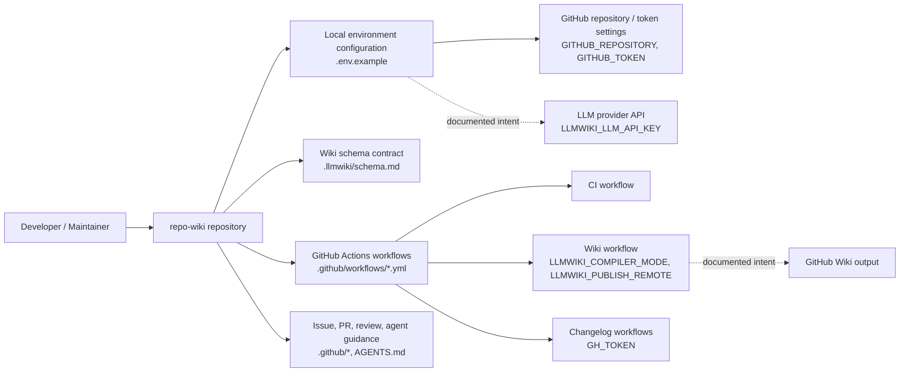
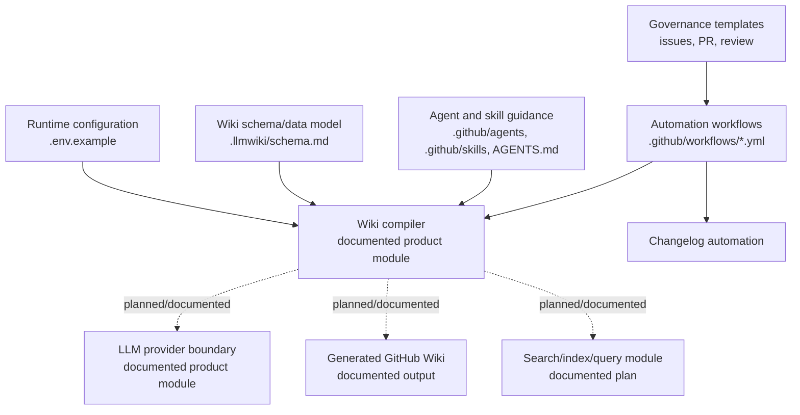
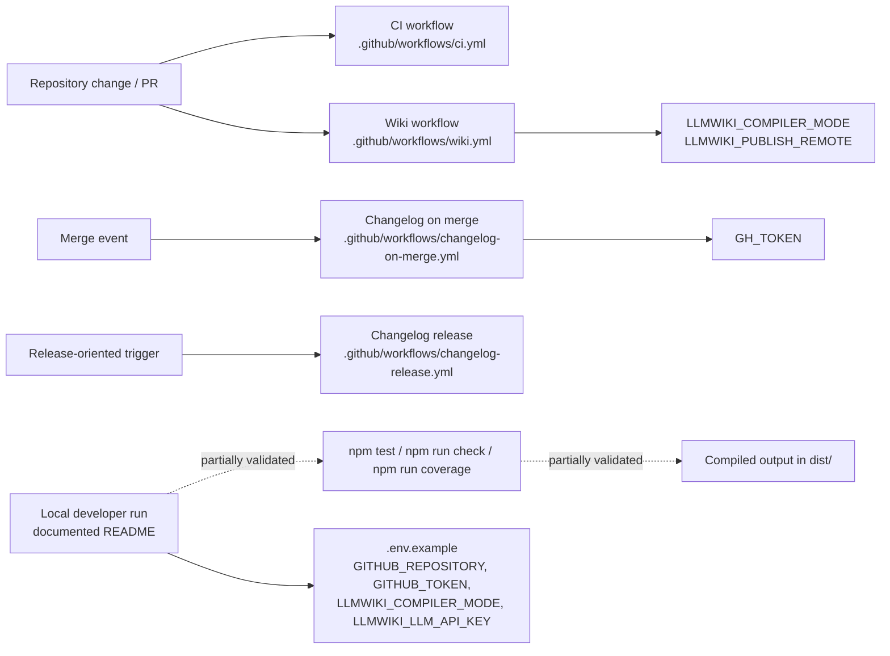

# Architecture

## Executive Architecture Summary

`repo-wiki` is documented as a tool for compiling a Git repository into a GitHub Wiki knowledge base, with the wiki acting as a persistent, maintained artifact derived from immutable repository sources. This product intent is stated in the implementation and rationale documentation cards, which describe the project as an instantiation of the “LLM Wiki” pattern for software repositories. [docs/PLAN.md — partially_validated] [docs/WHY.md — partially_validated]

From the supplied source cards, the repository architecture is best understood as a documentation-and-automation-centered project with these visible architectural surfaces:

| Area | Evidence | Architectural role |
|---|---|---|
| Wiki compilation configuration | `.env.example`, `.llmwiki/schema.md` | Defines expected runtime configuration and the schema/contract for generated wiki artifacts. |
| GitHub Actions automation | `.github/workflows/ci.yml`, `.github/workflows/wiki.yml`, `.github/workflows/changelog-on-merge.yml`, `.github/workflows/changelog-release.yml` | Provides CI, wiki generation/publishing, and changelog automation surfaces. |
| Repository governance | `.github/ISSUE_TEMPLATE/*.yml`, `.github/pull_request_template.md`, `.github/copilot-review-instructions.md` | Structures issues, pull requests, and review expectations. |
| Agent and skill guidance | `.github/agents/*.agent.md`, `.github/skills/*/SKILL.md`, `AGENTS.md`, `.pi/AGENTS.md`, `.pi/settings.json` | Defines human/AI contributor workflows and repository-specific operating instructions. |
| Runtime/environment configuration | `.env.example`, `.github/workflows/wiki.yml`, `.github/workflows/changelog-on-merge.yml` | Declares environment variables used by local and CI contexts. |

The main confirmed design decision is that wiki compilation is designed to run both locally and in automation: `.env.example` declares local configuration variables including `GITHUB_REPOSITORY`, `GITHUB_TOKEN`, `LLMWIKI_COMPILER_MODE`, and `LLMWIKI_LLM_API_KEY`, while `.github/workflows/wiki.yml` declares CI/runtime variables including `LLMWIKI_COMPILER_MODE` and `LLMWIKI_PUBLISH_REMOTE`. `.github/workflows/changelog-on-merge.yml` uses `GH_TOKEN` for changelog-related GitHub automation. [`.env.example`] [`.github/workflows/wiki.yml`] [`.github/workflows/changelog-on-merge.yml`]

Several architectural claims from documentation cards remain only partially validated because the supplied source cards do not include package manifests, TypeScript source files, compiled `dist/` files, or test files. For example, README documentation says local CLI/package verification runs against compiled output in `dist/`, but the supplied source evidence does not include `package.json`, CLI entrypoint code, or `dist/` contents. [README.md — partially_validated] This page therefore treats code-level module boundaries and runtime call chains as open questions unless directly supported by the provided configuration and documentation cards.

## System and Repository Context

### Repository boundary

The repository boundary visible from the supplied cards includes:

- GitHub-hosted source repository metadata and workflows under `.github/`. [`.github/workflows/ci.yml`] [`.github/workflows/wiki.yml`] [`.github/ISSUE_TEMPLATE/config.yml`]
- Wiki schema/documentation metadata under `.llmwiki/`. [`.llmwiki/schema.md`]
- Local runtime configuration hints in `.env.example`. [`.env.example`]
- Contributor and agent operating instructions in root-level and nested agent files. [`AGENTS.md`] [`.pi/AGENTS.md`] [`.github/agents/coordinator.agent.md`]
- Git ignore policy in `.gitignore`. [`.gitignore`]

The repository exposes at least two operational surfaces:

1. **Local operation surface** — implied by `.env.example`, which lists variables required for local repository/wiki operations: `GITHUB_REPOSITORY`, `GITHUB_TOKEN`, `LLMWIKI_COMPILER_MODE`, and `LLMWIKI_LLM_API_KEY`. [`.env.example`]
2. **GitHub Actions surface** — implemented by workflows for CI, wiki automation, and changelog automation. [`.github/workflows/ci.yml`] [`.github/workflows/wiki.yml`] [`.github/workflows/changelog-on-merge.yml`] [`.github/workflows/changelog-release.yml`]

Documentation cards also describe intended external integrations with GitHub Wiki publishing and provider-agnostic LLM chat completions. These are treated as partially validated intent because the available source cards show environment/configuration hooks but not the implementation code. [docs/plans/ci-publishing.md — partially_validated] [docs/plans/github-action.md — partially_validated] [docs/plans/llm-compiler.md — partially_validated]

### Context diagram

The following diagram is supported by repository structure and configuration evidence. Relationships to GitHub Actions and environment variables are directly evidenced by workflow and `.env.example` cards. Relationships to LLM providers and generated wiki content are documented intent and are marked accordingly.

Evidence: `.env.example`, `.llmwiki/schema.md`, `.github/workflows/ci.yml`, `.github/workflows/wiki.yml`, `.github/workflows/changelog-on-merge.yml`, `.github/workflows/changelog-release.yml`, `.github/ISSUE_TEMPLATE/config.yml`, `.github/pull_request_template.md`, `.github/copilot-review-instructions.md`. The LLM and GitHub Wiki output edges are supported by partially validated documentation and configuration names rather than by supplied implementation code. [docs/plans/llm-compiler.md — partially_validated] [docs/plans/ci-publishing.md — partially_validated]

## Major Modules and Responsibilities

### 1. Wiki schema and generated knowledge-base contract

The `.llmwiki/schema.md` file is categorized as data-model documentation and is the strongest supplied evidence for a wiki artifact schema/contract. [`.llmwiki/schema.md`] The project documentation describes the wiki as a persistent artifact generated from source cards and documentation cards, but the implementation details of the compiler and page writers are not present in the supplied source cards. [docs/PLAN.md — partially_validated]

**Responsibilities evidenced or documented:**

- Define the expected model/shape for generated wiki content. [`.llmwiki/schema.md`]
- Support a generated GitHub Wiki knowledge base derived from repository sources. [docs/PLAN.md — partially_validated]
- Provide architecture for page generation and navigation according to repository-specific wiki rules. [`.github/skills/repo-wiki-navigation/SKILL.md`]

**Confidence:** Medium for the presence of a schema/documentation contract; low for implementation details because code-level schema consumers are not included in the provided cards.

### 2. Local runtime configuration

`.env.example` declares runtime configuration variables for local or environment-driven execution. [`.env.example`]

| Variable | Evidence | Likely responsibility |
|---|---|---|
| `GITHUB_REPOSITORY` | `.env.example` | Identifies the target GitHub repository. |
| `GITHUB_TOKEN` | `.env.example` | Provides authenticated GitHub access. |
| `LLMWIKI_COMPILER_MODE` | `.env.example`, `.github/workflows/wiki.yml` | Selects compiler mode for local or CI wiki operation. |
| `LLMWIKI_LLM_API_KEY` | `.env.example` | Supplies an LLM API credential for LLM-backed compilation. |

No actual secret values are present in this page. The repository uses example variable names only. [`.env.example`]

### 3. GitHub Actions automation

The repository includes workflows for CI, wiki automation, and changelog automation. [`.github/workflows/ci.yml`] [`.github/workflows/wiki.yml`] [`.github/workflows/changelog-on-merge.yml`] [`.github/workflows/changelog-release.yml`]

**Responsibilities evidenced by workflow files:**

- Run CI checks. [`.github/workflows/ci.yml`]
- Run wiki-related automation with `LLMWIKI_COMPILER_MODE` and `LLMWIKI_PUBLISH_REMOTE`. [`.github/workflows/wiki.yml`]
- Run changelog automation on merge with `GH_TOKEN`. [`.github/workflows/changelog-on-merge.yml`]
- Run changelog release automation. [`.github/workflows/changelog-release.yml`]

The detailed job steps, package commands, and artifact behavior cannot be verified from the source-card excerpts alone. Documentation cards describe planned GitHub Action behavior including artifact upload and conditional publishing credentials, but those details remain partially validated. [docs/plans/github-action.md — partially_validated] [docs/plans/ci-publishing.md — partially_validated]

### 4. Repository governance and contribution workflow

The repository includes structured issue templates and pull request/review guidance. [`.github/ISSUE_TEMPLATE/config.yml`] [`.github/ISSUE_TEMPLATE/epic.yml`] [`.github/ISSUE_TEMPLATE/task.yml`] [`.github/pull_request_template.md`] [`.github/copilot-review-instructions.md`]

**Responsibilities:**

- Separate issue intake into at least epic and task templates. [`.github/ISSUE_TEMPLATE/epic.yml`] [`.github/ISSUE_TEMPLATE/task.yml`]
- Provide issue template configuration. [`.github/ISSUE_TEMPLATE/config.yml`]
- Standardize pull request submission expectations. [`.github/pull_request_template.md`]
- Guide automated or Copilot-assisted review. [`.github/copilot-review-instructions.md`]

This module shapes the project’s development process rather than runtime product behavior.

### 5. Agent and skill guidance

The repository has a set of agent instruction files under `.github/agents/`, plus skill documents under `.github/skills/`, and additional agent guidance in `AGENTS.md` and `.pi/AGENTS.md`. [`.github/agents/coordinator.agent.md`] [`.github/agents/developer.agent.md`] [`.github/agents/docs.agent.md`] [`.github/agents/fixer.agent.md`] [`.github/agents/quality.agent.md`] [`.github/agents/review.agent.md`] [`.github/skills/keep-a-changelog/SKILL.md`] [`.github/skills/repo-wiki-navigation/SKILL.md`] [`AGENTS.md`] [`.pi/AGENTS.md`]

**Responsibilities:**

- Define role-specific agent behavior for coordination, development, documentation, fixing, quality, and review work. [`.github/agents/coordinator.agent.md`] [`.github/agents/developer.agent.md`] [`.github/agents/docs.agent.md`] [`.github/agents/fixer.agent.md`] [`.github/agents/quality.agent.md`] [`.github/agents/review.agent.md`]
- Provide skills for changelog maintenance and repo-wiki navigation. [`.github/skills/keep-a-changelog/SKILL.md`] [`.github/skills/repo-wiki-navigation/SKILL.md`]
- Supply repository-level operating instructions. [`AGENTS.md`] [`.pi/AGENTS.md`]
- Store local/agent settings in `.pi/settings.json`. [`.pi/settings.json`]

These files are documentation/governance modules, not necessarily runtime modules of the compiled package.

### 6. Planned compiler, action, incremental, and search capabilities

Several documentation cards describe intended or partially implemented product modules:

| Planned/Documented area | Status from cards | Evidence |
|---|---:|---|
| LLM compiler boundary using provider-agnostic OpenAI-style chat completions | Partially validated | [docs/plans/llm-compiler.md — partially_validated], `.env.example` |
| CI publishing flow for wiki state | Partially validated | [docs/plans/ci-publishing.md — partially_validated], `.github/workflows/wiki.yml` |
| GitHub Action behavior including artifact output and conditional publishing | Partially validated | [docs/plans/github-action.md — partially_validated], `.github/workflows/wiki.yml` |
| Search index over generated wiki pages, source cards, and documentation cards | Partially validated | [docs/plans/search-index.md — partially_validated] |
| Incremental mode architecture | Stale | [docs/plans/incremental-mode.md — stale] |

These modules should not be treated as fully verified runtime architecture until source files, package scripts, or tests are inspected.

### Component/module diagram

This diagram is derived from supplied repository structure, workflow/configuration evidence, and documented plan modules. Edges labeled “planned/documented” are not verified by implementation code in the supplied cards.

Evidence: `.env.example`, `.llmwiki/schema.md`, `.github/workflows/*.yml`, `.github/agents/*.agent.md`, `.github/skills/*/SKILL.md`, issue templates, pull request template, and documentation cards for compiler/action/search plans. The diagram does not prove code-level imports or runtime call chains.

## Runtime, Data, and Control-Flow Relationships

### Confirmed runtime/configuration relationships

The supplied cards confirm environment and workflow relationships, not internal function calls.

| Relationship | Evidence | Claim status |
|---|---|---|
| Local or environment-driven runs can be configured with GitHub repository/token values. | `.env.example` lists `GITHUB_REPOSITORY` and `GITHUB_TOKEN`. | Confirmed configuration surface. |
| Local or environment-driven runs can select a compiler mode. | `.env.example` lists `LLMWIKI_COMPILER_MODE`. | Confirmed configuration surface. |
| Wiki workflow uses compiler/publish-related configuration. | `.github/workflows/wiki.yml` lists `LLMWIKI_COMPILER_MODE` and `LLMWIKI_PUBLISH_REMOTE`. | Confirmed CI configuration surface. |
| Changelog-on-merge workflow uses GitHub authentication. | `.github/workflows/changelog-on-merge.yml` lists `GH_TOKEN`. | Confirmed CI configuration surface. |
| LLM-backed compilation is intended or supported by configuration. | `.env.example` lists `LLMWIKI_LLM_API_KEY`; docs describe provider-agnostic OpenAI-style chat completions. | Partially validated; implementation not included. |

### Documented but not code-verified control flow

Documentation cards describe an intended compilation architecture in which repository sources and documentation become a maintained wiki artifact. [docs/PLAN.md — partially_validated] The search-index plan describes building a local search index over generated wiki pages, source cards, and documentation cards so `repo-wiki search` and `repo-wiki query` can route questions efficiently without external services. [docs/plans/search-index.md — partially_validated] The LLM compiler plan describes an LLM boundary compatible with OpenAI-style chat completions. [docs/plans/llm-compiler.md — partially_validated]

A conservative data-flow interpretation is:

1. Repository sources and documentation are scanned into source/documentation cards. [docs/PLAN.md — partially_validated]
2. A wiki schema or output contract guides generated wiki page structure. [`.llmwiki/schema.md`]
3. Configuration selects compiler mode and provides GitHub/LLM credentials where needed. [`.env.example`] [`.github/workflows/wiki.yml`]
4. CI can run wiki automation and optionally publish or prepare wiki output. [`.github/workflows/wiki.yml`] [docs/plans/ci-publishing.md — partially_validated]
5. Changelog workflows automate changelog-related repository maintenance. [`.github/workflows/changelog-on-merge.yml`] [`.github/workflows/changelog-release.yml`]

Because no implementation source files or imports are included in the supplied cards, this page does not assert concrete class/function interactions, package dependency chains, or exact command invocations.

## Build, Test, Deployment, and Operational Surfaces

### CI and automation workflows

The repository includes four GitHub Actions workflow files in the supplied source cards:

| Workflow | Evidence | Operational surface |
|---|---|---|
| CI | `.github/workflows/ci.yml` | Runs continuous integration checks. |
| Wiki | `.github/workflows/wiki.yml` | Runs wiki-related automation with `LLMWIKI_COMPILER_MODE` and `LLMWIKI_PUBLISH_REMOTE`. |
| Changelog on merge | `.github/workflows/changelog-on-merge.yml` | Runs changelog automation using `GH_TOKEN`. |
| Changelog release | `.github/workflows/changelog-release.yml` | Runs release-oriented changelog automation. |

README documentation claims that `npm test`, `npm run check`, and `npm run coverage` require successful TypeScript compilation and operate against compiled output in `dist/`. [README.md — partially_validated] This claim cannot be fully validated from the supplied source cards because `package.json`, TypeScript source files, tests, and `dist/` output were not included. `.tsbuildinfo` is present as a source card and indicates TypeScript build metadata exists in the repository snapshot, but it does not by itself verify scripts or command behavior. [`.tsbuildinfo`]

### Build/test/deploy flow diagram

The following diagram is based on the presence of CI/workflow configuration and environment variables. Package-script details are taken only from partially validated README documentation and are marked accordingly.

Evidence: `.github/workflows/ci.yml`, `.github/workflows/wiki.yml`, `.github/workflows/changelog-on-merge.yml`, `.github/workflows/changelog-release.yml`, `.env.example`, `.tsbuildinfo`, and README documentation card. The exact workflow triggers, job graph, and command steps are not available from the supplied excerpts.

### Deployment and publishing

The wiki workflow declares `LLMWIKI_PUBLISH_REMOTE`, which strongly suggests a configurable publish target/remote for wiki automation. [`.github/workflows/wiki.yml`] Documentation plans describe CI publishing and GitHub Action behavior that can fetch existing wiki state, upload local wiki artifacts, and publish when credentials are configured. [docs/plans/ci-publishing.md — partially_validated] [docs/plans/github-action.md — partially_validated] These publishing behaviors are not asserted as fully current until the workflow body and action/source implementation are inspected.

## Cross-Cutting Concerns

### Configuration management

Configuration is environment-variable driven in both local and CI contexts. `.env.example` lists local variables for GitHub repository identity, GitHub authentication, compiler mode, and LLM API authentication. [`.env.example`] `.github/workflows/wiki.yml` lists compiler mode and publish remote variables for CI wiki automation. [`.github/workflows/wiki.yml`] `.github/workflows/changelog-on-merge.yml` lists `GH_TOKEN` for GitHub automation. [`.github/workflows/changelog-on-merge.yml`]

### Secrets and credential handling

The supplied evidence references credential variable names but does not expose secret values. This page intentionally does not include any token values or private credentials. The variables `GITHUB_TOKEN`, `LLMWIKI_LLM_API_KEY`, and `GH_TOKEN` are credential-bearing by name and should be managed through local secret handling or GitHub Actions secrets rather than committed values. [`.env.example`] [`.github/workflows/changelog-on-merge.yml`]

### Documentation trust model

The repository contains many documentation and process files, but authority differs by file type:

- Source/configuration/workflow files provide stronger evidence for current operational surfaces. [`.env.example`] [`.github/workflows/wiki.yml`] [`.github/workflows/ci.yml`]
- Documentation cards provide product intent and rationale but may be partially validated or stale. [docs/PLAN.md — partially_validated] [docs/plans/incremental-mode.md — stale]
- The incremental-mode plan is explicitly stale in the supplied documentation-card metadata and should not be used as current architecture without validation. [docs/plans/incremental-mode.md — stale]

### Data model and generated content

`.llmwiki/schema.md` is the primary supplied evidence for a structured wiki data model or generated page contract. [`.llmwiki/schema.md`] The project’s documentation describes source cards, documentation cards, and generated wiki pages as part of the product concept. [docs/PLAN.md — partially_validated] [docs/plans/search-index.md — partially_validated] Exact schema fields and validation behavior are not repeated here because the source-card excerpt does not include the full schema contents.

### Contributor workflow and quality controls

Quality and contribution workflow are supported by issue templates, PR template, review instructions, and agent role documents. [`.github/ISSUE_TEMPLATE/epic.yml`] [`.github/ISSUE_TEMPLATE/task.yml`] [`.github/pull_request_template.md`] [`.github/copilot-review-instructions.md`] [`.github/agents/quality.agent.md`] [`.github/agents/review.agent.md`] These files shape how changes are proposed, reviewed, and maintained, but they are not runtime enforcement unless paired with CI or branch protection settings not included in the supplied cards.

### Changelog maintenance

The repository has a keep-a-changelog skill document and changelog workflows. [`.github/skills/keep-a-changelog/SKILL.md`] [`.github/workflows/changelog-on-merge.yml`] [`.github/workflows/changelog-release.yml`] This indicates changelog maintenance is an explicit operational concern, with both guidance and automation surfaces.

### LLM provider boundary

The LLM compiler plan describes a provider-agnostic boundary compatible with OpenAI-style chat completions. [docs/plans/llm-compiler.md — partially_validated] `.env.example` includes `LLMWIKI_LLM_API_KEY`, confirming a configuration hook for LLM API access. [`.env.example`] The actual provider abstraction, request format, retry behavior, and error handling are not verifiable from the supplied source cards.

## Caveats and Open Questions

### Caveats

- **No application source files were supplied in the source cards.** This architecture page is based on configuration, workflows, schemas, and documentation cards rather than code-level imports/classes/functions. As a result, runtime internals are low-confidence. Evidence: supplied source cards include `.env.example`, `.github/**`, `.llmwiki/schema.md`, `.pi/**`, `.tsbuildinfo`, and docs, but no package manifest or source implementation files.
- **README build claims are only partially validated.** README mentions `npm test`, `npm run check`, `npm run coverage`, TypeScript compilation, and `dist/`, but the supplied source cards do not include `package.json`, test files, TypeScript source files, or compiled output. [README.md — partially_validated] [`.tsbuildinfo`]
- **Several plan documents are not authoritative implementation evidence.** The LLM compiler, GitHub Action, CI publishing, and search-index plans are partially validated, while incremental mode is stale. [docs/plans/llm-compiler.md — partially_validated] [docs/plans/github-action.md — partially_validated] [docs/plans/ci-publishing.md — partially_validated] [docs/plans/search-index.md — partially_validated] [docs/plans/incremental-mode.md — stale]
- **Diagrams in this page are partly structural/inferential.** The context and module diagrams are grounded in repository layout and configuration files, but edges involving compiler internals, LLM calls, search index behavior, and GitHub Wiki output are documented intent rather than verified source-code call paths. [`.env.example`] [`.github/workflows/wiki.yml`] [docs/PLAN.md — partially_validated]
- **Workflow details are not fully expanded from excerpts.** The cards identify workflow files and environment variables, but not full job steps, triggers, permissions, or command invocations. [`.github/workflows/ci.yml`] [`.github/workflows/wiki.yml`] [`.github/workflows/changelog-on-merge.yml`] [`.github/workflows/changelog-release.yml`]

### Open questions

1. **Where are the CLI entrypoints and package scripts defined?** README documentation refers to npm scripts and compiled output, but `package.json` and implementation files were not present in the supplied cards. [README.md — partially_validated]
2. **What is the concrete compiler module structure?** The documentation describes compiler behavior and an LLM boundary, but no implementation modules or import graph were available. [docs/plans/llm-compiler.md — partially_validated]
3. **How does `LLMWIKI_COMPILER_MODE` affect behavior?** The variable appears in both local and CI configuration surfaces, but accepted values and branching behavior are not visible in the supplied cards. [`.env.example`] [`.github/workflows/wiki.yml`]
4. **What exactly does `LLMWIKI_PUBLISH_REMOTE` target?** The wiki workflow exposes this variable, and CI publishing plans discuss publishing, but the implementation and remote format are not confirmed. [`.github/workflows/wiki.yml`] [docs/plans/ci-publishing.md — partially_validated]
5. **Is the search index implemented or only planned?** The search-index plan is partially validated, but no search module source files are included in the supplied cards. [docs/plans/search-index.md — partially_validated]
6. **What branch protection, required checks, or release permissions exist?** The repository has CI and changelog workflows, but branch protection and repository settings are not included in source cards. [`.github/workflows/ci.yml`] [`.github/workflows/changelog-release.yml`]
7. **How are agent files consumed operationally?** Agent and skill instructions exist, but the supplied cards do not show whether they are used by a runtime tool, GitHub feature, or external automation. [`.github/agents/coordinator.agent.md`] [`.github/skills/repo-wiki-navigation/SKILL.md`] [`AGENTS.md`]

<!-- HUMAN_NOTES_START -->
<!-- HUMAN_NOTES_END -->
