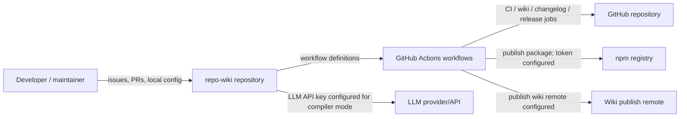
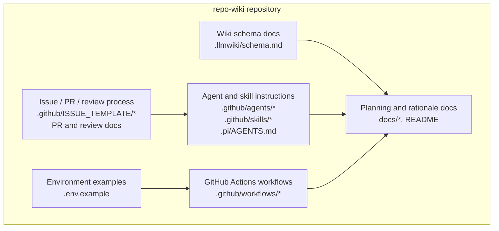
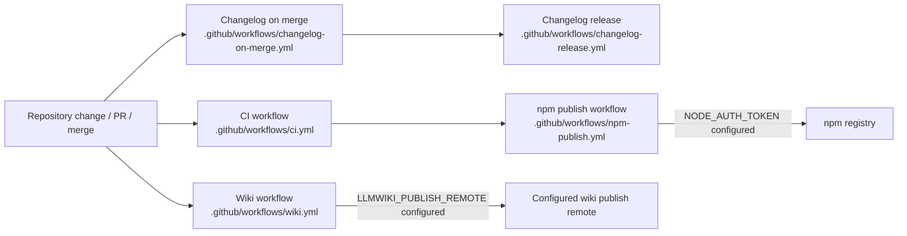

# Architecture

## Executive Architecture Summary

`repo-wiki` is documented as a tool for generating and maintaining a repository wiki from source evidence, with a product goal of turning immutable repository sources into a persistent, compounding wiki artifact. This intent is described in the project planning and rationale documentation, especially the implementation plan and “why” document. Operational details are only partially validated by the provided source cards because the card set does not include the main application source files or package manifest. [docs/PLAN.md documentation card; docs/WHY.md documentation card]

From the available high-authority evidence, the repository architecture has these visible subsystems:

| Subsystem | Evidence | Architectural role | Confidence |
|---|---|---|---|
| Wiki compiler / publisher configuration | `.env.example`, `.github/workflows/wiki.yml` | Configurable wiki generation/publishing surface with local and CI environment variables. | Medium |
| CI and release automation | `.github/workflows/ci.yml`, `.github/workflows/npm-publish.yml`, `.github/workflows/changelog-on-merge.yml`, `.github/workflows/changelog-release.yml` | Background automation for validation, publishing, and changelog/release workflows. | Medium |
| LLM wiki schema/document model | `.llmwiki/schema.md` | Defines or documents the expected wiki/schema conventions used by generated knowledge-base pages. | Medium |
| GitHub project process assets | `.github/ISSUE_TEMPLATE/*.yml`, `.github/pull_request_template.md`, `.github/copilot-review-instructions.md` | Issue, pull request, and review surfaces around development workflow. | Medium |
| Agent and skill instructions | `.github/agents/*.agent.md`, `.github/skills/*/SKILL.md`, `.pi/AGENTS.md` | Human/AI collaboration instructions for coordinating, developing, reviewing, documenting, and navigating the repository. | Medium |
| Main runtime/package implementation | README and plan documentation mention install/run commands, but source cards do not include package or source implementation files. | Presumed CLI/package implementation, not directly verifiable from the provided source cards. | Low |

Key design decisions that are supported by the provided evidence:

- The repository exposes environment-variable based configuration for GitHub repository targeting, GitHub credentials, compiler mode, and LLM API credentials. The variable names are present in `.env.example`; no values should be copied into generated documentation. [`.env.example`]
- Wiki compilation/publishing is automated through a dedicated GitHub Actions workflow with wiki-specific environment variables, including `LLMWIKI_COMPILER_MODE` and `LLMWIKI_PUBLISH_REMOTE`. [`.github/workflows/wiki.yml`]
- Package publishing is represented as a GitHub Actions operational surface and uses `NODE_AUTH_TOKEN` as an environment variable. [`.github/workflows/npm-publish.yml`]
- Changelog automation is represented by separate workflows for merge-time changelog handling and release-time changelog handling. [`.github/workflows/changelog-on-merge.yml`; `.github/workflows/changelog-release.yml`]
- The repository contains explicit schema documentation for generated wiki artifacts. [`.llmwiki/schema.md`]

## System and Repository Context

The repository boundary visible from the provided source cards is a GitHub-hosted project with:

- CI workflows under `.github/workflows/`. [`.github/workflows/ci.yml`; `.github/workflows/wiki.yml`; `.github/workflows/npm-publish.yml`; `.github/workflows/changelog-on-merge.yml`; `.github/workflows/changelog-release.yml`]
- GitHub issue templates under `.github/ISSUE_TEMPLATE/`. [`.github/ISSUE_TEMPLATE/config.yml`; `.github/ISSUE_TEMPLATE/epic.yml`; `.github/ISSUE_TEMPLATE/task.yml`]
- Agent and skill instructions under `.github/agents/`, `.github/skills/`, and `.pi/`. [`.github/agents/coordinator.agent.md`; `.github/agents/developer.agent.md`; `.github/agents/docs.agent.md`; `.github/agents/fixer.agent.md`; `.github/agents/quality.agent.md`; `.github/agents/review.agent.md`; `.github/skills/keep-a-changelog/SKILL.md`; `.github/skills/repo-wiki-navigation/SKILL.md`; `.pi/AGENTS.md`]
- Wiki schema documentation under `.llmwiki/`. [`.llmwiki/schema.md`]
- Environment configuration examples at repository root. [`.env.example`]

Documented external surfaces include:

| External surface | What is visible | Evidence | Claim status |
|---|---|---|---|
| GitHub repository API / hosting context | `GITHUB_REPOSITORY` and `GITHUB_TOKEN` are listed as environment variables. | `.env.example` | Supported variable names; behavior not directly verified from runtime code. |
| LLM provider/API | `LLMWIKI_LLM_API_KEY` is listed as an environment variable; plan documentation discusses an OpenAI-style chat-completions-compatible boundary. | `.env.example`; docs/plans/llm-compiler.md documentation card | Partially validated; provider abstraction not verified from source code cards. |
| GitHub Actions | Multiple workflows exist for CI, wiki, npm publishing, and changelog/release automation. | `.github/workflows/*.yml` listed above | Supported at workflow-file level. |
| npm registry | `NODE_AUTH_TOKEN` is used by the npm publish workflow. | `.github/workflows/npm-publish.yml` | Supported at workflow-file level; package configuration not available in source cards. |
| GitHub Wiki or remote wiki publishing target | `LLMWIKI_PUBLISH_REMOTE` is listed by the wiki workflow card. | `.github/workflows/wiki.yml` | Supported variable name; exact publish mechanics not verified. |

The README documentation card says the project can be installed with `npm install @mfittko/repo-wiki`, installed from a tarball, and invoked with `npx repo-wiki --help`; however, the provided source cards do not include `package.json`, CLI entrypoint files, or implementation imports, so the public CLI/API surface is treated as partially validated documentation rather than fully verified code behavior. [README.md documentation card]

Diagram status: this context diagram is inferred from repository configuration and workflow/environment-variable evidence, not from application runtime source code. The existence of the external surfaces is supported by `.env.example` and workflow cards; the exact runtime protocol and call sequence are not verified by the provided source cards. [`.env.example`; `.github/workflows/wiki.yml`; `.github/workflows/npm-publish.yml`; `.github/workflows/ci.yml`]

## Major Modules and Responsibilities

### Wiki Compilation and Publishing Surface

The wiki subsystem is the central architectural intent of the repository. Planning documentation describes the project as an implementation of an LLM Wiki pattern for software repositories, where raw sources remain immutable and generated wiki pages become a maintained knowledge artifact. [docs/PLAN.md documentation card; docs/WHY.md documentation card]

High-authority configuration evidence shows a wiki workflow and compiler/publish-related environment variables:

- `LLMWIKI_COMPILER_MODE` appears in `.env.example` and the wiki workflow card. [`.env.example`; `.github/workflows/wiki.yml`]
- `LLMWIKI_PUBLISH_REMOTE` appears in the wiki workflow card. [`.github/workflows/wiki.yml`]
- `GITHUB_REPOSITORY` and `GITHUB_TOKEN` appear in `.env.example`, indicating GitHub repository context and authentication are configurable. [`.env.example`]
- `LLMWIKI_LLM_API_KEY` appears in `.env.example`, indicating the compiler can be configured with an LLM credential. [`.env.example`]

The exact compiler internals, package entrypoint, and publish implementation are not visible in the provided source cards.

### LLM Wiki Schema / Knowledge Model

The repository includes `.llmwiki/schema.md`, which is categorized as documentation and data-model evidence. This indicates that generated wiki pages or compiler outputs are expected to follow an explicit schema or knowledge-base convention. [`.llmwiki/schema.md`]

This Architecture page itself follows the requested generated-page contract, but the underlying schema details are not reproduced here because only a source-card summary, not the full schema content, was provided.

### CI Validation Workflow

A general CI workflow exists at `.github/workflows/ci.yml`. The source card marks it as CI and background-work evidence. [`.github/workflows/ci.yml`]

Because the detailed workflow content was not provided in the card excerpt, this page can safely claim that CI automation exists, but it cannot enumerate exact jobs, Node versions, commands, test runners, or cache behavior.

### Wiki Automation Workflow

A dedicated wiki workflow exists at `.github/workflows/wiki.yml`. It is categorized as CI/configuration evidence and includes runtime hints for background work and environment-variable use. [`.github/workflows/wiki.yml`]

Known environment-variable surfaces from the workflow card:

| Variable | Evidence | Architectural interpretation |
|---|---|---|
| `LLMWIKI_COMPILER_MODE` | `.github/workflows/wiki.yml`; `.env.example` | Selects or influences compiler behavior. Exact modes are not verified from source cards. |
| `LLMWIKI_PUBLISH_REMOTE` | `.github/workflows/wiki.yml` | Configures a remote publish target for wiki output. Exact remote format and credentials are not verified. |

### npm Publishing Workflow

The repository includes `.github/workflows/npm-publish.yml`, categorized as CI/configuration evidence, with `NODE_AUTH_TOKEN` as an environment variable. [`.github/workflows/npm-publish.yml`]

This supports the architectural conclusion that package publishing is automated through GitHub Actions. It does not, by itself, verify package name, package contents, versioning strategy, or registry target.

### Changelog and Release Automation

Two workflow files indicate changelog/release automation:

- `.github/workflows/changelog-on-merge.yml`, which uses `GH_TOKEN` according to the source card. [`.github/workflows/changelog-on-merge.yml`]
- `.github/workflows/changelog-release.yml`, categorized as CI evidence with background-work hints. [`.github/workflows/changelog-release.yml`]

The repository also contains a `keep-a-changelog` skill document, which likely provides process guidance for changelog maintenance. [`.github/skills/keep-a-changelog/SKILL.md`]

### GitHub Issue and Pull Request Process

The repository includes GitHub issue-template configuration and templates for epics and tasks:

- `.github/ISSUE_TEMPLATE/config.yml` [`.github/ISSUE_TEMPLATE/config.yml`]
- `.github/ISSUE_TEMPLATE/epic.yml` [`.github/ISSUE_TEMPLATE/epic.yml`]
- `.github/ISSUE_TEMPLATE/task.yml` [`.github/ISSUE_TEMPLATE/task.yml`]

A pull request template and Copilot review instructions are present as documentation cards, indicating a structured review/development process. [`.github/pull_request_template.md`; `.github/copilot-review-instructions.md`]

### Agent and Skill Instruction Layer

The repository contains multiple agent instruction files:

| Agent/skill file | Implied role from filename | Evidence |
|---|---|---|
| `.github/agents/coordinator.agent.md` | Coordination/background work guidance | `.github/agents/coordinator.agent.md` |
| `.github/agents/developer.agent.md` | Development guidance | `.github/agents/developer.agent.md` |
| `.github/agents/docs.agent.md` | Documentation guidance | `.github/agents/docs.agent.md` |
| `.github/agents/fixer.agent.md` | Fix/remediation guidance | `.github/agents/fixer.agent.md` |
| `.github/agents/quality.agent.md` | Quality guidance | `.github/agents/quality.agent.md` |
| `.github/agents/review.agent.md` | Review guidance | `.github/agents/review.agent.md` |
| `.github/skills/repo-wiki-navigation/SKILL.md` | Repository/wiki navigation guidance | `.github/skills/repo-wiki-navigation/SKILL.md` |
| `.github/skills/keep-a-changelog/SKILL.md` | Changelog guidance | `.github/skills/keep-a-changelog/SKILL.md` |
| `.pi/AGENTS.md` | Additional agent instructions | `.pi/AGENTS.md` |

These files are process architecture rather than runtime architecture. They shape how humans and AI assistants should work in the repository, but no runtime dependency from application code to these files is verified.

Diagram status: this component diagram is structural and process-oriented. It is based on the repository file layout and source-card categories, not on verified application imports or runtime dependencies. [`.env.example`; `.llmwiki/schema.md`; `.github/workflows/ci.yml`; `.github/workflows/wiki.yml`; `.github/workflows/npm-publish.yml`; `.github/ISSUE_TEMPLATE/config.yml`; `.github/agents/coordinator.agent.md`; `.github/skills/repo-wiki-navigation/SKILL.md`]

## Runtime, Data, and Control-Flow Relationships

The provided source cards do not include implementation imports, runtime source files, or package-script definitions. Therefore, runtime control-flow claims must be conservative.

Supported runtime/configuration relationships:

1. Local or CI execution can be configured with environment variables named in `.env.example`, including GitHub repository context, GitHub token, compiler mode, and LLM API key. [`.env.example`]
2. The wiki workflow has wiki-specific environment-variable surfaces for compiler mode and publish remote configuration. [`.github/workflows/wiki.yml`]
3. npm publishing uses a token environment variable named `NODE_AUTH_TOKEN`. [`.github/workflows/npm-publish.yml`]
4. Changelog-on-merge automation uses `GH_TOKEN`. [`.github/workflows/changelog-on-merge.yml`]

Partially validated or documentation-derived relationships:

- The README documentation card describes a command-line usage surface via `npx repo-wiki --help`; this is not verified by source cards containing `package.json`, `bin` configuration, or CLI implementation. [README.md documentation card]
- The LLM compiler plan documentation describes a provider-agnostic, OpenAI-style chat-completions-compatible LLM boundary; this architectural direction is not verified by provided implementation source cards. [docs/plans/llm-compiler.md documentation card]
- CI publishing plan documentation describes a flow involving tests, existing wiki state, and publishing, but plan files are secondary evidence and not a substitute for verified workflow implementation details. [docs/plans/ci-publishing.md documentation card]

No concrete sequence diagram is included because the source cards do not expose enough implementation evidence to verify a specific call sequence such as “scan repository → build cards → call LLM → write wiki → publish remote.”

## Build, Test, Deployment, and Operational Surfaces

The repository has several GitHub Actions workflows, which are the strongest available evidence for build/test/deployment surfaces:

| Workflow | Category from source card | Known runtime/configuration hints | Architectural role |
|---|---|---|---|
| `.github/workflows/ci.yml` | CI | Background work | General validation/CI automation. |
| `.github/workflows/wiki.yml` | CI/configuration | Background work; environment variables `LLMWIKI_COMPILER_MODE`, `LLMWIKI_PUBLISH_REMOTE` | Wiki generation and/or publishing automation. |
| `.github/workflows/npm-publish.yml` | CI/configuration | Background work; environment variable `NODE_AUTH_TOKEN` | npm package publishing automation. |
| `.github/workflows/changelog-on-merge.yml` | CI/configuration | Background work; environment variable `GH_TOKEN` | Changelog automation on merge. |
| `.github/workflows/changelog-release.yml` | CI | Background work | Release-time changelog automation. |

README documentation indicates npm installation and `npx` usage, including `npm install @mfittko/repo-wiki`, installing from a tarball, and `npx repo-wiki --help`. These are treated as partially validated because package metadata and CLI implementation are not present in the source-card list. [README.md documentation card]

Diagram status: this diagram is based on the presence and naming of workflows plus environment-variable hints. Exact triggers, job dependencies, commands, and release gates are not verified from the card excerpts. [`.github/workflows/ci.yml`; `.github/workflows/wiki.yml`; `.github/workflows/npm-publish.yml`; `.github/workflows/changelog-on-merge.yml`; `.github/workflows/changelog-release.yml`]

Operational configuration surfaces:

| Configuration variable | Source | Notes |
|---|---|---|
| `GITHUB_REPOSITORY` | `.env.example` | Repository identifier/configuration input. |
| `GITHUB_TOKEN` | `.env.example` | GitHub authentication input; do not document concrete values. |
| `LLMWIKI_COMPILER_MODE` | `.env.example`; `.github/workflows/wiki.yml` | Compiler-mode selector; allowed values not verified. |
| `LLMWIKI_LLM_API_KEY` | `.env.example` | LLM API credential; value must remain secret. |
| `LLMWIKI_PUBLISH_REMOTE` | `.github/workflows/wiki.yml` | Wiki publishing target; format not verified. |
| `NODE_AUTH_TOKEN` | `.github/workflows/npm-publish.yml` | npm publishing token. |
| `GH_TOKEN` | `.github/workflows/changelog-on-merge.yml` | GitHub token for changelog automation. |

## Cross-Cutting Concerns

### Configuration and Secrets

The repository uses environment variables for configuration and credentials. The visible secret-like variables are `GITHUB_TOKEN`, `LLMWIKI_LLM_API_KEY`, `NODE_AUTH_TOKEN`, and `GH_TOKEN`. Their names are safe to document, but actual values must not be copied into generated documentation. [`.env.example`; `.github/workflows/npm-publish.yml`; `.github/workflows/changelog-on-merge.yml`]

### Documentation Trust Model

The repository contains both high-authority operational artifacts and secondary planning/rationale documentation. This page treats:

- Workflow files, environment examples, issue templates, and schema files as higher-authority evidence for current repository structure and operational surfaces. [`.github/workflows/ci.yml`; `.github/workflows/wiki.yml`; `.env.example`; `.llmwiki/schema.md`; `.github/ISSUE_TEMPLATE/epic.yml`]
- README and planning documents as secondary evidence for product intent, roadmap, and partially validated usage claims. [README.md documentation card; docs/PLAN.md documentation card; docs/plans/llm-compiler.md documentation card]

### Data Model and Wiki Page Contracts

The presence of `.llmwiki/schema.md` indicates that the project has an explicit schema or data-model documentation for generated wiki artifacts. The full schema content should be consulted before changing generated page formats, frontmatter requirements, or cross-page linking conventions. [`.llmwiki/schema.md`]

### GitHub-Native Development Workflow

The repository has GitHub issue templates for epics and tasks, a pull request template, Copilot review instructions, and agent/skill documentation. This points to a GitHub-native development process with structured work items and review/documentation guidance. [`.github/ISSUE_TEMPLATE/config.yml`; `.github/ISSUE_TEMPLATE/epic.yml`; `.github/ISSUE_TEMPLATE/task.yml`; `.github/pull_request_template.md`; `.github/copilot-review-instructions.md`; `.github/agents/review.agent.md`]

### Release and Changelog Discipline

Changelog automation is represented by dedicated workflows and a keep-a-changelog skill document. This suggests that release history and changelog quality are a cross-cutting concern rather than an ad hoc manual activity. [`.github/workflows/changelog-on-merge.yml`; `.github/workflows/changelog-release.yml`; `.github/skills/keep-a-changelog/SKILL.md`]

### LLM Boundary

The environment variable `LLMWIKI_LLM_API_KEY` and the LLM compiler plan documentation indicate that LLM usage is intended or supported. The plan documentation specifically discusses a provider-agnostic boundary compatible with OpenAI-style chat completions, but this is only partially validated because implementation files are not present in the provided source cards. [`.env.example`; docs/plans/llm-compiler.md documentation card]

## Caveats and Open Questions

1. **Main application source code was not included in the source-card set.**  
   No `src/`, `package.json`, CLI implementation, imports, or runtime modules were available as high-authority evidence. As a result, this page cannot verify internal compiler classes, module boundaries, package exports, parser/scanner behavior, or exact command-line behavior. [`.tsbuildinfo`; README.md documentation card]

2. **Package and CLI claims are partially validated only.**  
   README documentation mentions npm installation and `npx repo-wiki --help`, but the provided source cards do not include package metadata or executable entrypoints. [README.md documentation card]

3. **Workflow details are summarized from file presence and source-card metadata.**  
   The source cards confirm workflow files and some environment-variable hints, but not exact triggers, job matrices, commands, permissions, artifacts, or dependency ordering. [`.github/workflows/ci.yml`; `.github/workflows/wiki.yml`; `.github/workflows/npm-publish.yml`; `.github/workflows/changelog-on-merge.yml`; `.github/workflows/changelog-release.yml`]

4. **Diagrams are mostly structural, not verified runtime call graphs.**  
   The included Mermaid diagrams are based on repository layout, workflow names, and environment-variable evidence. They should not be read as exact runtime call sequences or import graphs. [`.env.example`; `.github/workflows/wiki.yml`; `.github/workflows/npm-publish.yml`; `.llmwiki/schema.md`]

5. **LLM provider architecture is not fully verified.**  
   `LLMWIKI_LLM_API_KEY` supports the existence of an LLM credential surface, and plan documentation describes an OpenAI-style provider-agnostic boundary. Implementation-level provider abstractions and request/response formats remain open questions. [`.env.example`; docs/plans/llm-compiler.md documentation card]

6. **Incremental mode appears stale in planning documentation.**  
   The incremental-mode plan documentation card is marked stale, so it should not be treated as current behavior without source-code or workflow validation. [docs/plans/incremental-mode.md documentation card]

7. **Schema details should be reviewed before changing generated pages.**  
   `.llmwiki/schema.md` is present as data-model documentation, but the provided card does not expose the full schema content. Contributors should inspect the file directly when modifying wiki generation contracts. [`.llmwiki/schema.md`]

<!-- HUMAN_NOTES_START -->
<!-- HUMAN_NOTES_END -->
