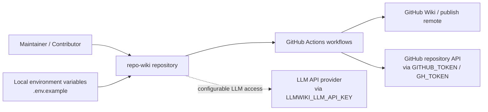
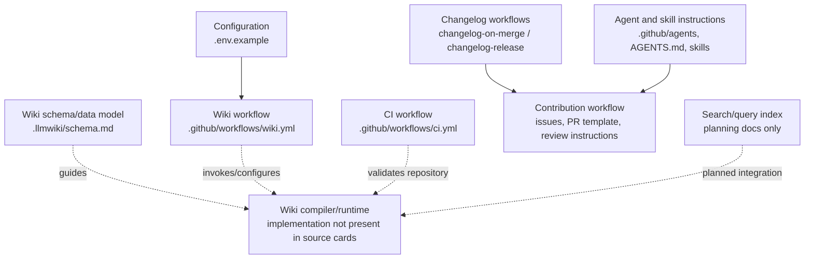
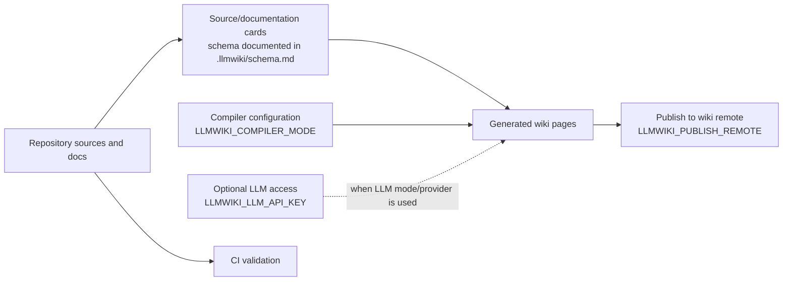
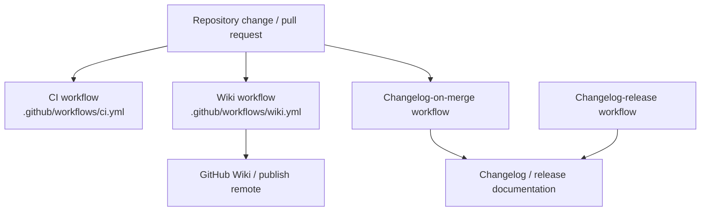

# Architecture

## Executive Architecture Summary

`repo-wiki` is a repository-to-GitHub-Wiki knowledge-base project. The available evidence shows a system organized around: repository scanning/source-card generation, wiki schema and page compilation, local/CI operation, GitHub Wiki publishing, changelog automation, and human/agent contribution workflows. This purpose is supported by the `.llmwiki` schema documentation, the wiki publishing workflow, local environment configuration, and project documentation cards describing a “dual-role” CLI/package and an LLM Wiki pattern implementation. Sources: `.llmwiki/schema.md`, `.github/workflows/wiki.yml`, `.env.example`, documentation card `README.md`, documentation card `docs/PLAN.md`, documentation card `docs/WHY.md`.

The repository exposes several operational surfaces:

| Surface | Evidence | Architectural role |
|---|---|---|
| Local configuration via environment variables | `.env.example` lists `GITHUB_REPOSITORY`, `GITHUB_TOKEN`, `LLMWIKI_COMPILER_MODE`, and `LLMWIKI_LLM_API_KEY` | Configures repository target, GitHub access, compiler mode, and LLM access for local or automated runs. |
| GitHub Actions CI | `.github/workflows/ci.yml` | Provides automated validation; exact jobs are not available in the source-card excerpt. |
| GitHub Wiki workflow | `.github/workflows/wiki.yml` lists `LLMWIKI_COMPILER_MODE` and `LLMWIKI_PUBLISH_REMOTE` | Provides an automated wiki compilation/publishing path. |
| Changelog automation | `.github/workflows/changelog-on-merge.yml`, `.github/workflows/changelog-release.yml`, `.github/skills/keep-a-changelog/SKILL.md` | Supports release/change documentation automation and conventions. |
| Issue and PR process | `.github/ISSUE_TEMPLATE/*.yml`, `.github/pull_request_template.md`, `.github/copilot-review-instructions.md` | Defines contribution intake and review guidance. |
| Agent instructions | `AGENTS.md`, `.github/agents/*.agent.md`, `.pi/AGENTS.md`, `.pi/settings.json` | Defines role-specific human/AI-agent workflows around planning, development, docs, quality, review, and fixes. |

The most important verified design decision is that the wiki system is intended to be compiler-driven and configurable: environment variables include a compiler mode and LLM API key, while the CI wiki workflow includes compiler mode and publish remote settings. Sources: `.env.example`, `.github/workflows/wiki.yml`.

Several details that would normally be central to an architecture page—package scripts, TypeScript source module boundaries, CLI command implementation, package metadata, and runtime imports—are not present in the supplied source cards. Claims about those implementation details are therefore limited to what is corroborated by workflow/configuration cards and documentation cards.

## System and Repository Context

The repository boundary, based on the available cards, includes configuration, CI workflows, wiki schema documentation, contribution process files, and agent/skill instructions. The source cards do not include application source files such as `src/**`, `package.json`, or compiled `dist/**`; therefore, this page cannot verify the exact CLI entry point, public package exports, or TypeScript module graph from code. Sources: source-card list, `.github/workflows/ci.yml`, `.github/workflows/wiki.yml`, `.llmwiki/schema.md`.

The repository interacts with at least these external systems:

- **GitHub repository and GitHub Wiki remote**: `GITHUB_REPOSITORY`, `GITHUB_TOKEN`, and `LLMWIKI_PUBLISH_REMOTE` indicate GitHub repository and publishing integration. Sources: `.env.example`, `.github/workflows/wiki.yml`.
- **LLM provider/API**: `LLMWIKI_LLM_API_KEY` indicates optional or required access to an LLM service for compiler operation; provider-specific behavior is not verified from source cards. Source: `.env.example`; related intent in documentation card `docs/plans/llm-compiler.md`.
- **GitHub Actions runtime**: workflows under `.github/workflows/` provide CI, wiki, changelog-on-merge, and changelog-release automation. Sources: `.github/workflows/ci.yml`, `.github/workflows/wiki.yml`, `.github/workflows/changelog-on-merge.yml`, `.github/workflows/changelog-release.yml`.

The following context diagram is grounded in configuration and workflow file presence. It does **not** assert internal implementation classes or functions because no import graph or application source files were provided.

Evidence for this diagram: `.env.example`, `.github/workflows/wiki.yml`, `.github/workflows/changelog-on-merge.yml`, `.github/workflows/changelog-release.yml`, `.github/workflows/ci.yml`.

## Major Modules and Responsibilities

### Wiki Compiler and Schema

The wiki compiler/schema area is the architectural center of the project. `.llmwiki/schema.md` is identified as data-model documentation, and the repository includes a wiki workflow using `LLMWIKI_COMPILER_MODE`, indicating a compilation mode used by the automation path. Sources: `.llmwiki/schema.md`, `.github/workflows/wiki.yml`.

Documentation cards describe the project as implementing an LLM Wiki pattern where raw sources remain immutable and the wiki is a persistent generated artifact. This is secondary evidence and should be treated as intent unless confirmed by source implementation. Sources: documentation card `docs/PLAN.md`, documentation card `docs/WHY.md`.

Likely responsibilities, based on the evidence:

- Define generated wiki page structure and schema expectations. Source: `.llmwiki/schema.md`.
- Compile repository evidence into wiki pages. Sources: `.github/workflows/wiki.yml`, documentation card `README.md`.
- Support compiler modes through `LLMWIKI_COMPILER_MODE`. Sources: `.env.example`, `.github/workflows/wiki.yml`.

### Local CLI / Package Runtime

Documentation card `README.md` states that the package is “dual-role” and that local CLI/package verification runs against compiled output in `dist/`. However, no `package.json`, `src/**`, or `dist/**` source cards were provided, so the exact CLI commands, package exports, and script names cannot be verified from the supplied source evidence. Source: documentation card `README.md`; caveat based on absence from supplied source cards.

The local runtime appears to use environment variables for repository selection, GitHub access, compiler mode, and LLM access. Source: `.env.example`.

### GitHub Wiki Publishing Automation

The wiki publishing automation is represented by `.github/workflows/wiki.yml`. The workflow card identifies configuration through `LLMWIKI_COMPILER_MODE` and `LLMWIKI_PUBLISH_REMOTE`, which indicates that the workflow can run in a compiler mode and target a publish remote. Source: `.github/workflows/wiki.yml`.

Planning documentation describes an action architecture that can upload local wiki output as an artifact and conditionally publish when credentials are configured. This is secondary, partially validated documentation and should not be treated as a complete description of current workflow behavior without inspecting the workflow body. Source: documentation card `docs/plans/github-action.md`.

### CI and Validation

The repository contains a CI workflow at `.github/workflows/ci.yml`. The source-card excerpt identifies it as CI with background-work hints, but does not expose job names, commands, matrix configuration, or test coverage details. Source: `.github/workflows/ci.yml`.

Documentation card `README.md` claims `npm test`, `npm run check`, and `npm run coverage` require successful TypeScript compilation into `dist/`. Because the package manifest and CI command bodies are not among the source cards, this remains partially validated. Source: documentation card `README.md`.

### Changelog and Release Automation

The repository has two changelog-related workflows:

- `.github/workflows/changelog-on-merge.yml`, which uses `GH_TOKEN` according to the source card.
- `.github/workflows/changelog-release.yml`, which is identified as CI/background-work automation.

Sources: `.github/workflows/changelog-on-merge.yml`, `.github/workflows/changelog-release.yml`.

The repository also includes a `keep-a-changelog` skill document, suggesting conventions or automation guidance for maintaining changelogs. Source: `.github/skills/keep-a-changelog/SKILL.md`.

### Contribution, Review, and Planning Workflow

The repository includes issue templates for epics and tasks, a PR template, Copilot review instructions, and multiple role-specific agent documents. These files define the collaboration and quality workflow around the codebase rather than the runtime system itself. Sources: `.github/ISSUE_TEMPLATE/config.yml`, `.github/ISSUE_TEMPLATE/epic.yml`, `.github/ISSUE_TEMPLATE/task.yml`, `.github/pull_request_template.md`, `.github/copilot-review-instructions.md`, `.github/agents/coordinator.agent.md`, `.github/agents/developer.agent.md`, `.github/agents/docs.agent.md`, `.github/agents/fixer.agent.md`, `.github/agents/quality.agent.md`, `.github/agents/review.agent.md`, `AGENTS.md`, `.pi/AGENTS.md`, `.pi/settings.json`.

### Search and Query Planning

Planning documentation describes a search index over generated wiki pages, source cards, and documentation cards for `repo-wiki search` and `repo-wiki query`. This is secondary evidence and only partially validated by the provided cards; no implementation files for search indexing are included in the source-card set. Source: documentation card `docs/plans/search-index.md`.

### Incremental Mode Planning

Planning documentation includes an incremental-mode epic, but it is marked stale. It should not be used as evidence for current implementation behavior without source verification. Source: documentation card `docs/plans/incremental-mode.md`.

The following module diagram reflects verified repository areas and planning-only areas. Dashed edges indicate relationships inferred from documentation or configuration rather than from source-code imports.

Evidence for verified nodes: `.env.example`, `.llmwiki/schema.md`, `.github/workflows/wiki.yml`, `.github/workflows/ci.yml`, `.github/workflows/changelog-on-merge.yml`, `.github/workflows/changelog-release.yml`, `.github/ISSUE_TEMPLATE/*.yml`, `.github/pull_request_template.md`, `.github/copilot-review-instructions.md`, `.github/agents/*.agent.md`, `.github/skills/keep-a-changelog/SKILL.md`, `.github/skills/repo-wiki-navigation/SKILL.md`, `AGENTS.md`. The `Compiler` and `Search` nodes are supported by documentation cards but are not verified by implementation source cards.

## Runtime, Data, and Control-Flow Relationships

The available evidence supports a high-level control flow but not a detailed function/class-level runtime graph.

### Verified or Partially Verified Data Inputs

| Input | Evidence | Use inferred or stated |
|---|---|---|
| Repository identifier | `.env.example` contains `GITHUB_REPOSITORY` | Used to identify the target GitHub repository. |
| GitHub token | `.env.example` contains `GITHUB_TOKEN`; `.github/workflows/changelog-on-merge.yml` contains `GH_TOKEN` | Used for GitHub API or workflow authentication. Exact permissions are not verified. |
| Compiler mode | `.env.example` and `.github/workflows/wiki.yml` contain `LLMWIKI_COMPILER_MODE` | Selects wiki compiler mode for local or CI operation. |
| LLM API key | `.env.example` contains `LLMWIKI_LLM_API_KEY` | Enables LLM-backed compilation or generation. Exact provider and API shape are not verified from source cards. |
| Publish remote | `.github/workflows/wiki.yml` contains `LLMWIKI_PUBLISH_REMOTE` | Targets wiki publishing remote in CI. Exact publish command is not visible in the source-card excerpt. |
| Wiki schema | `.llmwiki/schema.md` | Defines or documents generated wiki data/page model. |

### High-Level Control Flow

The likely end-to-end flow, combining configuration and documentation evidence, is:

1. The repository is scanned or represented as source/documentation cards. Evidence for the schema and card-oriented approach is `.llmwiki/schema.md` and documentation cards `docs/PLAN.md` and `docs/plans/search-index.md`.
2. The compiler uses configuration such as `LLMWIKI_COMPILER_MODE` and, when LLM-backed generation is enabled, `LLMWIKI_LLM_API_KEY`. Sources: `.env.example`, `.github/workflows/wiki.yml`.
3. Generated wiki pages are validated or published through the wiki workflow. Source: `.github/workflows/wiki.yml`.
4. CI validates repository changes separately through `.github/workflows/ci.yml`; exact validation commands are not visible in the source-card excerpt. Source: `.github/workflows/ci.yml`.
5. Changelog automation runs on merge/release workflows. Sources: `.github/workflows/changelog-on-merge.yml`, `.github/workflows/changelog-release.yml`.

Because implementation source files and workflow bodies are not available in the provided cards, this page does not assert the exact order of CLI calls, generated artifact paths, Git commit operations, or API request sequences.

The following control-flow diagram is intentionally high level and based on environment/workflow evidence plus partially validated documentation cards.

Evidence: `.llmwiki/schema.md`, `.env.example`, `.github/workflows/wiki.yml`, `.github/workflows/ci.yml`, documentation card `docs/PLAN.md`, documentation card `docs/plans/llm-compiler.md`.

## Build, Test, Deployment, and Operational Surfaces

### CI Workflows

The repository includes these workflow files:

| Workflow | Evidence | Architectural purpose |
|---|---|---|
| CI | `.github/workflows/ci.yml` | General validation workflow; exact commands are unavailable in the source-card excerpt. |
| Wiki | `.github/workflows/wiki.yml` | Wiki generation/publishing workflow; exposes `LLMWIKI_COMPILER_MODE` and `LLMWIKI_PUBLISH_REMOTE`. |
| Changelog on merge | `.github/workflows/changelog-on-merge.yml` | Changelog automation using `GH_TOKEN`. |
| Changelog release | `.github/workflows/changelog-release.yml` | Release-related changelog automation. |

Sources: `.github/workflows/ci.yml`, `.github/workflows/wiki.yml`, `.github/workflows/changelog-on-merge.yml`, `.github/workflows/changelog-release.yml`.

### Local Operational Configuration

Local operation is configured through environment variables documented in `.env.example`:

- `GITHUB_REPOSITORY`
- `GITHUB_TOKEN`
- `LLMWIKI_COMPILER_MODE`
- `LLMWIKI_LLM_API_KEY`

Source: `.env.example`.

No secret values are included here. The architecture should treat these variables as sensitive where they contain credentials, especially `GITHUB_TOKEN`, `GH_TOKEN`, and `LLMWIKI_LLM_API_KEY`. Sources: `.env.example`, `.github/workflows/changelog-on-merge.yml`.

### Build/Test Claims from Documentation

The README documentation card claims that local package verification uses compiled output in `dist/`, and that `npm test`, `npm run check`, and `npm run coverage` require successful TypeScript compilation. This claim is only partially validated because the source cards do not include `package.json`, TypeScript configuration, test files, or CI workflow command bodies. Source: documentation card `README.md`.

The presence of `.tsbuildinfo` suggests TypeScript incremental build metadata exists or has been committed, but this card alone does not prove the current build configuration or scripts. Source: `.tsbuildinfo`.

### Build/Test/Deploy Flow Diagram

The following diagram shows only workflow-level relationships supported by the available CI/configuration cards. It does not claim specific commands.

Evidence: `.github/workflows/ci.yml`, `.github/workflows/wiki.yml`, `.github/workflows/changelog-on-merge.yml`, `.github/workflows/changelog-release.yml`.

## Cross-Cutting Concerns

### Configuration Management

Configuration is environment-variable driven for local and CI usage. `.env.example` lists repository, GitHub token, compiler mode, and LLM API key variables. The wiki workflow also exposes compiler mode and publish remote configuration. Sources: `.env.example`, `.github/workflows/wiki.yml`.

Architectural implication: runtime behavior likely depends on explicit configuration rather than hardcoded repository or provider settings. This is strongly supported for variable names, but the exact precedence rules and defaults are not visible in the provided source cards. Sources: `.env.example`, `.github/workflows/wiki.yml`.

### Security and Secret Handling

Credential-like variables are present:

- `GITHUB_TOKEN` in `.env.example`
- `GH_TOKEN` in `.github/workflows/changelog-on-merge.yml`
- `LLMWIKI_LLM_API_KEY` in `.env.example`

Sources: `.env.example`, `.github/workflows/changelog-on-merge.yml`.

These variables should be treated as secrets. No actual secret values are present in the source-card excerpts. The source cards do not reveal permissions, secret scopes, masking behavior, or token rotation policy.

### Data Model and Generated Artifacts

The `.llmwiki/schema.md` card is categorized as data-model documentation. This indicates that generated wiki content is expected to follow a documented schema. Source: `.llmwiki/schema.md`.

Documentation cards describe source cards, documentation cards, generated wiki pages, and search indexing over those artifacts. These claims are partially validated or planning-stage depending on the card. Sources: documentation card `docs/PLAN.md`, documentation card `docs/plans/search-index.md`.

### Documentation Trust Model

The repository includes substantial documentation and planning files. Per the source evidence provided, documentation cards have mixed statuses:

| Documentation card | Status | Architectural handling |
|---|---:|---|
| `README.md` | partially_validated | Useful for CLI/package intent, but implementation details require source verification. |
| `docs/PLAN.md` | partially_validated | Useful for product vision and module intent. |
| `docs/WHY.md` | partially_validated | Useful for rationale. |
| `docs/plans/ci-publishing.md` | partially_validated | Useful for intended CI/publishing architecture. |
| `docs/plans/github-action.md` | partially_validated | Useful for intended GitHub Action behavior. |
| `docs/plans/incremental-mode.md` | stale | Do not treat as current behavior. |
| `docs/plans/llm-compiler.md` | partially_validated | Useful for intended LLM provider boundary. |
| `docs/plans/search-index.md` | partially_validated | Useful for intended search/query architecture. |

Sources: documentation cards listed in the prompt.

### API and Provider Boundaries

The source cards show environment-level integration with GitHub and an LLM API key, but they do not expose source-code adapters, HTTP clients, provider interfaces, or API schemas. Sources: `.env.example`, `.github/workflows/wiki.yml`, `.github/workflows/changelog-on-merge.yml`.

Documentation card `docs/plans/llm-compiler.md` states that the first production LLM boundary should be provider-agnostic and compatible with OpenAI-style chat completions. This is planning evidence and should not be presented as verified implementation behavior without source-code confirmation. Source: documentation card `docs/plans/llm-compiler.md`.

### Human and Agent Collaboration

The repository defines structured collaboration through issue templates, PR templates, Copilot review instructions, agent role documents, and skills. These files form a process architecture around development and maintenance. Sources: `.github/ISSUE_TEMPLATE/config.yml`, `.github/ISSUE_TEMPLATE/epic.yml`, `.github/ISSUE_TEMPLATE/task.yml`, `.github/pull_request_template.md`, `.github/copilot-review-instructions.md`, `.github/agents/coordinator.agent.md`, `.github/agents/developer.agent.md`, `.github/agents/docs.agent.md`, `.github/agents/fixer.agent.md`, `.github/agents/quality.agent.md`, `.github/agents/review.agent.md`, `.github/skills/keep-a-changelog/SKILL.md`, `.github/skills/repo-wiki-navigation/SKILL.md`, `AGENTS.md`, `.pi/AGENTS.md`, `.pi/settings.json`.

## Caveats and Open Questions

1. **Application source files are not included in the supplied source cards.** No `src/**`, `package.json`, `dist/**`, or test files were provided, so CLI entry points, package exports, command implementations, dependency graph, and test coverage cannot be verified from code. Evidence basis: supplied source-card list.

2. **Workflow internals are not visible in the excerpts.** Workflow files are present, but the cards do not include job names, triggers, shell commands, permissions, or artifact/publishing steps. Claims about CI and publishing are therefore limited to workflow presence and exposed environment variables. Sources: `.github/workflows/ci.yml`, `.github/workflows/wiki.yml`, `.github/workflows/changelog-on-merge.yml`, `.github/workflows/changelog-release.yml`.

3. **README build/test behavior is only partially validated.** The README documentation card claims `npm test`, `npm run check`, and `npm run coverage` depend on TypeScript compilation to `dist/`, but the package manifest and CI command details are absent. Source: documentation card `README.md`.

4. **The LLM provider boundary is not verified in source code.** Environment configuration includes `LLMWIKI_LLM_API_KEY`, and planning docs mention OpenAI-style chat completions, but no provider adapter or API client code is visible in the source cards. Sources: `.env.example`, documentation card `docs/plans/llm-compiler.md`.

5. **Search/query architecture appears planned, not verified.** The search-index plan describes `repo-wiki search` and `repo-wiki query`, but no implementation source cards confirm these commands. Source: documentation card `docs/plans/search-index.md`.

6. **Incremental mode documentation is stale.** `docs/plans/incremental-mode.md` is explicitly marked stale in the documentation cards and should not be used as current architecture evidence. Source: documentation card `docs/plans/incremental-mode.md`.

7. **Diagrams are high-level and configuration-derived.** The diagrams in this page are based on repository structure, workflow presence, environment variables, schema documentation, and partially validated planning docs. They do not represent verified function-level imports, class dependencies, or exact execution sequences.

8. **Publishing credentials and permissions are unknown.** `LLMWIKI_PUBLISH_REMOTE`, `GITHUB_TOKEN`, and `GH_TOKEN` indicate publishing/API integration, but required scopes, GitHub permissions, branch protection interactions, and failure modes are not visible. Sources: `.env.example`, `.github/workflows/wiki.yml`, `.github/workflows/changelog-on-merge.yml`.

9. **Committed build metadata may need review.** `.tsbuildinfo` appears in the source-card set and is associated with background-work hints, but this page cannot determine whether it is intentionally tracked or an accidental generated artifact. Source: `.tsbuildinfo`.

<!-- HUMAN_NOTES_START -->
<!-- HUMAN_NOTES_END -->
