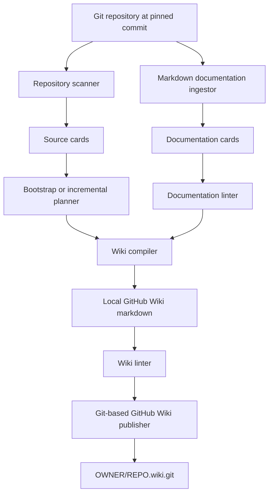
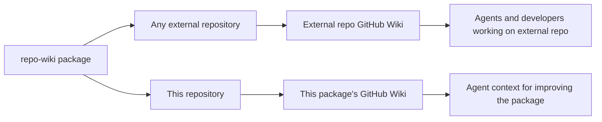
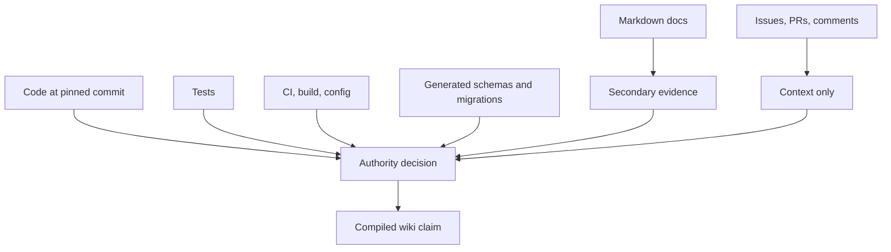
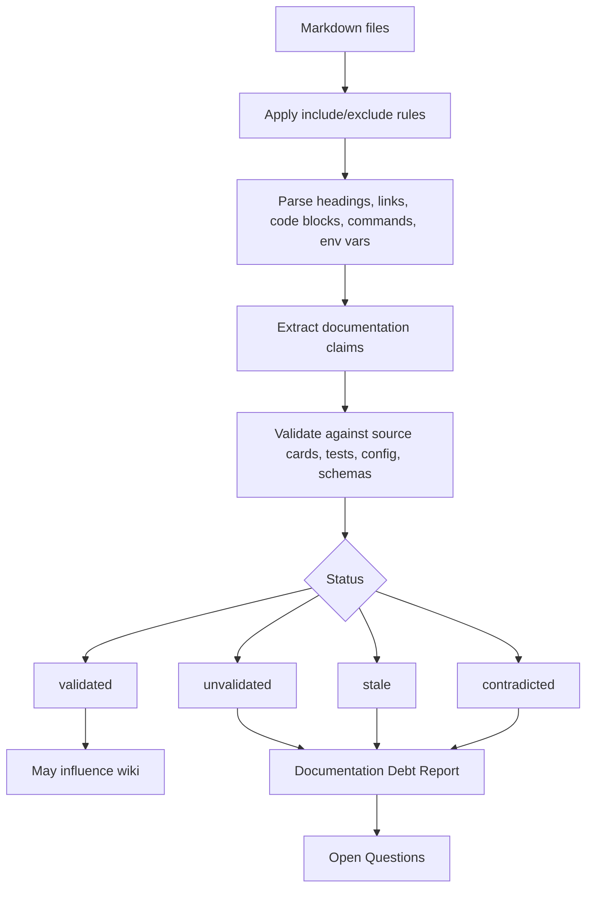
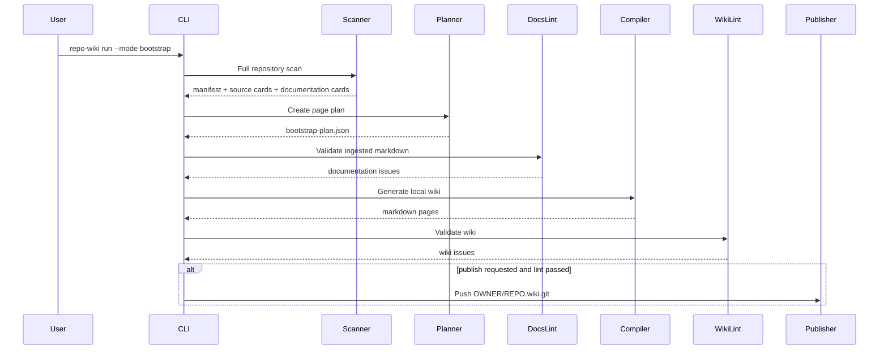
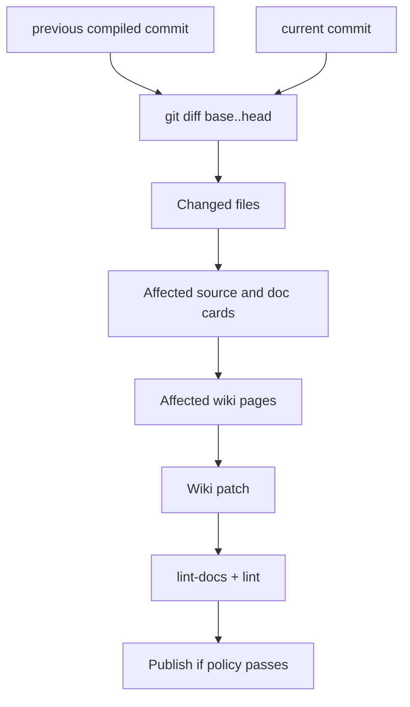
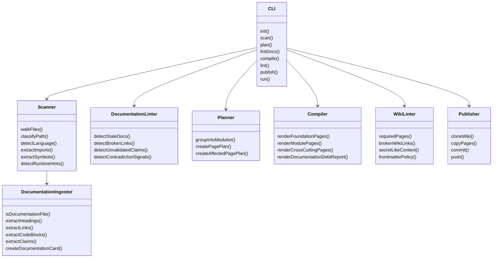
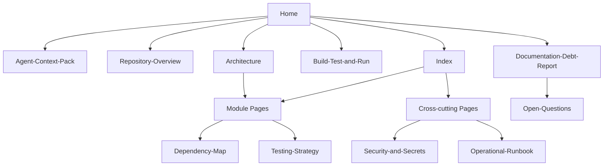
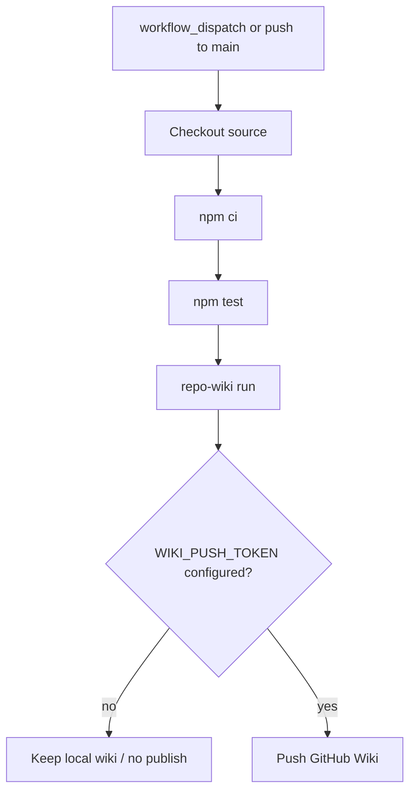

# repo-wiki Implementation Plan

`repo-wiki` is a dual-role Node.js project:

1. It is a package and CLI that can be applied to any existing GitHub repository.
2. It dogfoods the same package to create and maintain its own GitHub Wiki knowledge base.

The project follows the LLM Wiki pattern: source material is treated as immutable input, the wiki is a compiled artifact, and a schema controls ingestion, query behavior, linting, and publication.

## Goals

- Bootstrap a useful GitHub Wiki from an existing repository.
- Maintain the wiki incrementally after merges.
- Support both human developers and coding agents.
- Treat code as authoritative and documentation as configurable secondary evidence.
- Detect stale, misleading, contradictory, or unvalidated markdown before it influences the wiki.
- Keep the package installable through `npx`, CI, or a direct Node API.
- Let this repository maintain its own wiki with the same public interface used by external consumers.

## Non-goals for the initial implementation

- Perfect semantic understanding of every language.
- Fully automated trust in pre-existing documentation.
- One wiki page per file or symbol.
- Replacing source-level investigation.
- Publishing from untrusted pull requests.

## High-level architecture



## Dual-role operating model



The package must avoid special-casing itself. Self-maintenance should be a normal consumer workflow:

```bash
npm run self:wiki
npm run kb:publish
```

External usage should be equivalent:

```bash
npx repo-wiki init --repo . --write-agents
npx repo-wiki run --mode bootstrap --repo . --wiki .llmwiki/wiki
npx repo-wiki publish --wiki .llmwiki/wiki --remote https://github.com/OWNER/REPO.wiki.git
```

## Source authority model



Default authority order:

1. Code at pinned commit.
2. Tests.
3. CI, build, and runtime configuration.
4. Generated schemas, route maps, and migrations.
5. Markdown documentation as secondary evidence.
6. Issues, PRs, and comments as context only.

Markdown should not be excluded by default. It contains intent, product language, onboarding flows, architectural rationale, and operational practice. The risk is not ingestion; the risk is trusting it without validation.

## Configurable documentation ingestion

Configuration lives in `.llmwiki/config.json`:

```json
{
  "documentation": {
    "ingest": true,
    "authority": "secondary",
    "include": ["README.md", "docs/**/*.md", "ADR/**/*.md", ".github/**/*.md"],
    "exclude": ["CHANGELOG.md", "docs/archive/**", "docs/old/**"],
    "stale_after_days": 180,
    "require_code_validation": true,
    "allow_unvalidated_context": true,
    "preserve_original_claims": false,
    "fail_on_stale_docs": false,
    "fail_on_conflicting_docs": true
  }
}
```

Recommended modes:

| Mode | Behavior |
|---|---|
| `documentation.ingest=false` | Ignore markdown except schema and AGENTS guidance. |
| `authority=secondary` | Use docs for context and intent, but validate claims before promoting them. |
| `authority=weak` | Treat docs only as hints and debt signals. |
| `authority=primary_for` future extension | Allow docs to be primary for product terminology or ADR rationale only. |

## Documentation ingestion and validation flow



Current scaffold validation is intentionally conservative. It extracts operational claims, commands, environment variable names, stale-language markers, and broken relative links. The production implementation should add deeper validators:

- package-script validation against `package.json`.
- command validation against Makefiles, task runners, and CI workflows.
- route validation against framework-specific route extractors.
- environment-variable validation against config/schema/code usage.
- file-reference validation against the repository tree.
- ADR recency and supersession detection.

## Bootstrap ingestion for existing repositories

Bootstrap mode handles repositories that do not yet have a generated wiki.



Bootstrap page order:

1. Foundation pages: `Home`, `_Sidebar`, `Index`, `Log`, `Agent-Context-Pack`, `Repository-Overview`, `Architecture`, `Build-Test-and-Run`, `Documentation-Debt-Report`, `Open-Questions`.
2. Module/service/package pages.
3. Cross-cutting pages: dependencies, tests, config, security, operations, APIs, data models.
4. Cross-linking and linting pass.

## Incremental ingestion

Incremental mode should eventually scan only changed files and affected knowledge units. The current scaffold wires the mode but still performs a broad scan.



Affected-page mapping should use:

- file path to module mapping.
- symbol extraction.
- import/dependency graph.
- test-to-source relationships.
- route/schema/config extractors.
- documentation links and claims.
- previous wiki page frontmatter source paths.

## Required components



## Generated wiki topology



## CLI contract

```text
repo-wiki init      Add config/schema/agent pointer files to a repo.
repo-wiki scan      Produce manifest, source cards, and documentation cards.
repo-wiki plan      Produce bootstrap or incremental page plan.
repo-wiki lint-docs Validate ingested markdown before compilation.
repo-wiki compile   Generate local wiki markdown.
repo-wiki lint      Validate generated wiki markdown.
repo-wiki publish   Push local wiki markdown to GitHub Wiki.
repo-wiki run       Orchestrate scan -> plan -> lint-docs -> compile -> lint -> optional publish.
```

## Local dogfooding workflow

```bash
npm install
npm run self:wiki
npm run lint:docs
npm run lint:local
```

Publishing this repository's own wiki:

```bash
LLMWIKI_PUBLISH_REMOTE=https://github.com/OWNER/repo-wiki.wiki.git npm run kb:publish
```

## GitHub Actions workflow



Security policy:

- Do not publish from untrusted pull requests.
- Use a dedicated GitHub App token or fine-grained PAT for wiki push.
- Never expose tokens in generated wiki pages.
- Fail publication on secret-like content.
- Optionally require human review for auth, billing, deployment, and security-sensitive pages.

## Linting gates

Documentation lint gates:

| Gate | Default | Purpose |
|---|---:|---|
| stale documentation | warning | Surface likely old docs without blocking early adoption. |
| contradicted documentation | error | Block docs that contain strong contradiction signals when configured. |
| broken relative links | warning | Detect doc rot. |
| unvalidated operational claims | warning | Prevent unchecked commands/API claims from becoming authoritative. |
| secret-like content | error | Prevent sensitive values from reaching the wiki. |

Wiki lint gates:

| Gate | Default | Purpose |
|---|---:|---|
| required pages missing | error | Ensure a usable wiki skeleton. |
| broken wiki links | warning in scaffold, should become error for navigation-critical links | Keep the wiki navigable. |
| missing source commit | warning | Keep generated pages auditable. |
| secret-like content | error | Prevent credential leaks. |
| excessive page count or size | warning | Avoid GitHub Wiki sprawl and agent-unfriendly pages. |

## Detailed feature plans

Detailed planned-feature epics live as one markdown file per feature under `docs/plans/`.
GitHub Issues are the execution backlog; these docs define scope, acceptance criteria, and implementation direction:

- `docs/plans/production-scanner.md`
- `docs/plans/doc-validation.md`
- `docs/plans/wiki-graph.md`
- `docs/plans/llm-compiler.md`
- `docs/plans/incremental-mode.md`
- `docs/plans/ci-publishing.md`
- `docs/plans/agent-integration.md`

## Implementation milestones

### Milestone 1: Current scaffold

- CLI package with executable `repo-wiki`.
- Library exports.
- Bootstrap scanner.
- Documentation card extraction.
- Configurable documentation ingestion.
- Documentation lint command.
- Deterministic wiki compiler.
- Wiki lint command.
- Git-based publisher.
- Self-dogfooding workflow.

### Milestone 2: Production scanner

- Parse package scripts.
- Add TypeScript/JavaScript AST extraction.
- Detect Express, Fastify, NestJS, Next.js, Hono, Koa, tRPC, GraphQL, and OpenAPI surfaces.
- Map tests to modules.
- Extract database migrations and ORM models.
- Build import graph and affected-page graph.

### Milestone 3: LLM compiler

- Replace deterministic placeholder summaries with LLM synthesis.
- Use source cards and targeted excerpts.
- Preserve human notes.
- Output structured patches.
- Enforce source citations.
- Add contradiction and confidence metadata.

### Milestone 4: Incremental maintenance

- Store previous compiled commit.
- Compute changed files.
- Update only affected pages.
- Re-run cross-link and debt report passes.
- Publish safely after lint gates.

### Milestone 5: Agent integration

- Generate `AGENTS.md` or `AGENTS.repo-wiki.md` pointers.
- Generate `Agent-Context-Pack.md` optimized for coding agents.
- Add optional local search index or MCP endpoint.
- Provide a `repo-wiki query` command later.

## Open implementation questions

- Should the publisher open a pull request against the wiki repo instead of pushing directly?
- Which documentation claims should block publishing by default?
- How should ADR supersession be represented?
- Should generated wiki pages use source line anchors or only path + commit anchors?
- How much raw code should the LLM compiler be allowed to read per page?
- How should existing human-authored wiki pages be reconciled?
