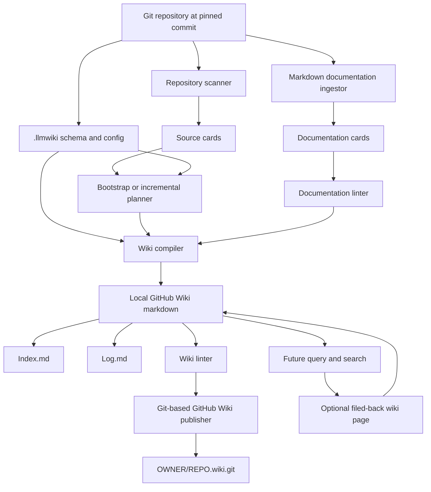
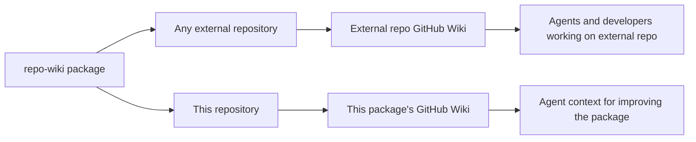
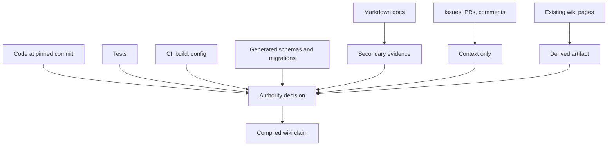
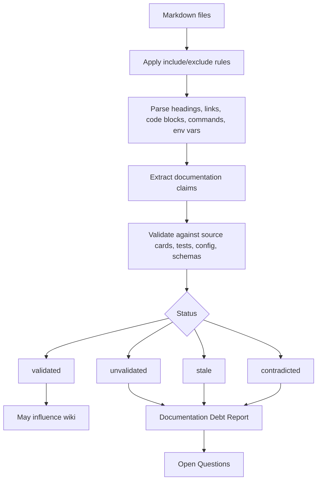
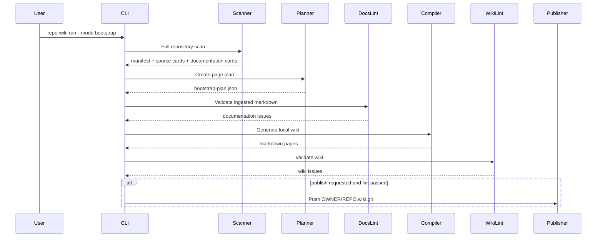
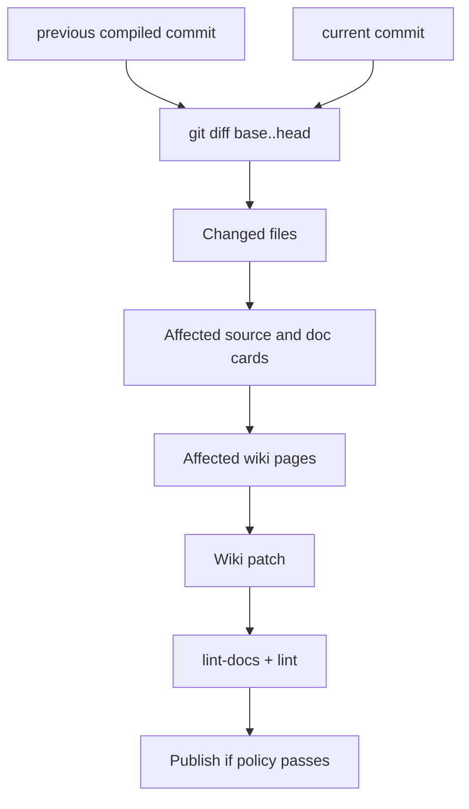
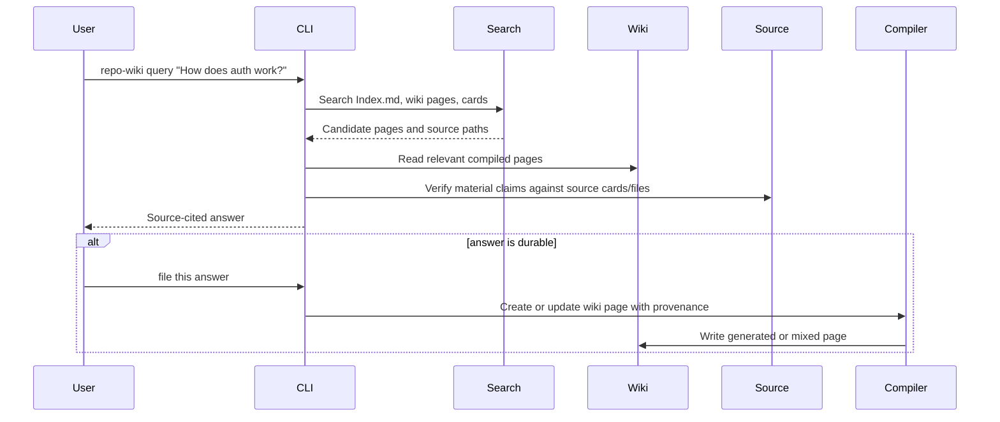
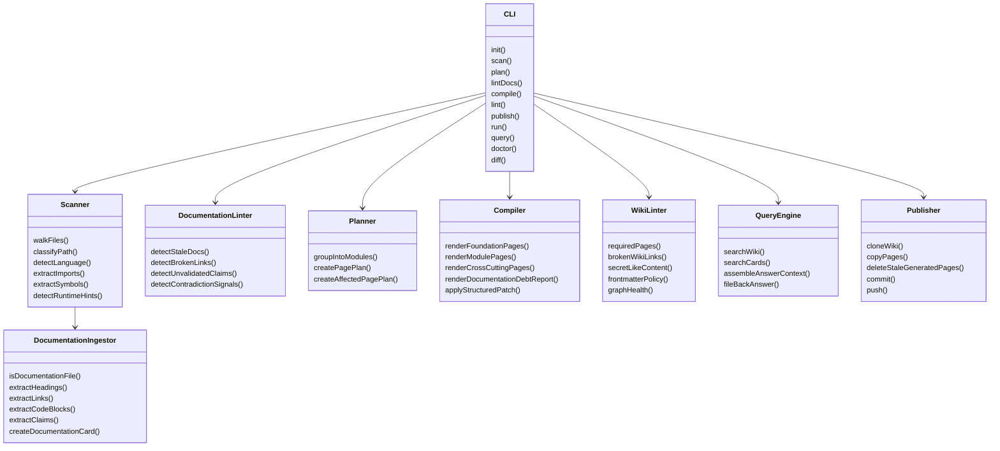
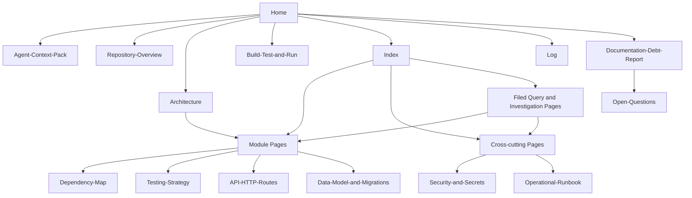
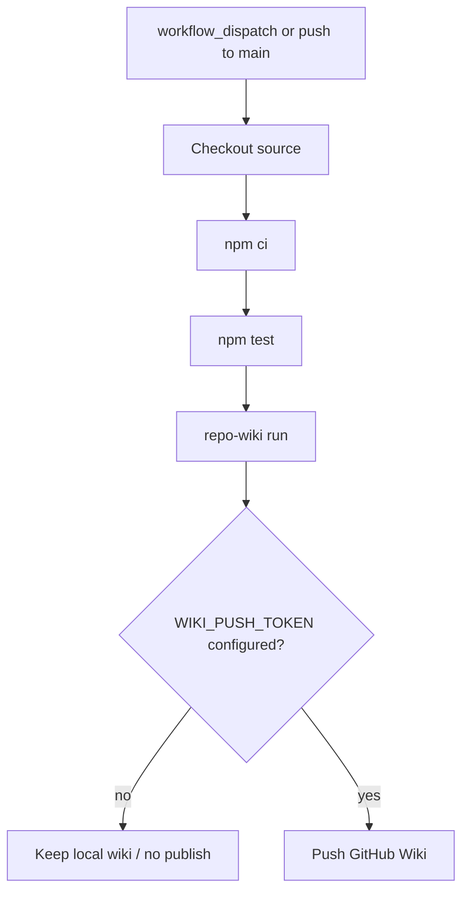

# repo-wiki Implementation Plan

`repo-wiki` is a dual-role Node.js project:

1. It is a package and CLI that can be applied to any existing Git repository, with GitHub Wiki as the first supported publication target.
2. It dogfoods the same package to create and maintain this repository's own GitHub Wiki knowledge base.

This project explicitly instantiates Karpathy's LLM Wiki pattern for software repositories: raw sources stay immutable, the wiki becomes a persistent compounding artifact, and a schema tells the LLM and deterministic tooling how to maintain that artifact over time. The product goal is not to be another query-time RAG layer over code. The product goal is to compile repository knowledge once, keep it current after every change, and make that compiled knowledge useful to humans and coding agents.

## Product vision

Karpathy's LLM Wiki idea starts from a simple critique of ordinary RAG: when an LLM retrieves raw chunks at query time, it rediscovers and re-synthesizes knowledge from scratch on every question. The synthesis does not compound. Contradictions are not remembered unless they happen to be retrieved again. Useful answers disappear into chat history.

`repo-wiki` applies the alternative pattern to software repositories:

- The Git repository at a pinned commit is the immutable source collection.
- The generated GitHub Wiki is the persistent, interlinked, compounding artifact.
- `.llmwiki/schema.md`, `.llmwiki/config.json`, and agent pointers are the schema that discipline future maintenance.
- `Index.md` is the content-oriented catalog used by people and agents to route questions.
- `Log.md` is the chronological history of ingests, rebuilds, queries, lint passes, and publication events.
- Lint and validation gates keep the wiki source-grounded instead of letting it become confident generated fiction.

The long-term vision is repository memory infrastructure:

- Developers use the wiki to understand unfamiliar repositories faster.
- Coding agents use the wiki as their first navigation layer before reading source files.
- Maintainers use the documentation debt report to see where docs, commands, routes, and code disagree.
- CI uses incremental maintenance to keep the wiki fresh after merges.
- Good answers to repository questions can be filed back into the wiki as durable pages instead of being lost in chat.

## Goals

- Bootstrap a useful GitHub Wiki from an existing repository.
- Maintain the wiki incrementally after merges.
- Support both human developers and coding agents.
- Treat code at the pinned commit as authoritative and documentation as configurable secondary evidence.
- Detect stale, misleading, contradictory, or unvalidated markdown before it influences the wiki.
- Compile repository knowledge into a persistent artifact instead of re-deriving it from raw files on every query.
- Keep `Index.md` and `Log.md` parseable enough for agents, shell tools, and humans.
- Let high-value query outputs become new wiki pages when they add durable repository knowledge.
- Keep the package installable through `npx`, CI, a direct Node API, and a future GitHub Action.
- Let this repository maintain its own wiki with the same public interface used by external consumers.

## Non-goals for the initial implementation

- Perfect semantic understanding of every language.
- Fully automated trust in pre-existing documentation.
- One wiki page per file or symbol.
- Replacing source-level investigation.
- Replacing code search or IDE navigation.
- Publishing from untrusted pull requests.
- Building a general personal wiki product outside the software-repository domain.

## Karpathy LLM Wiki alignment

Karpathy's pattern has three layers and three operations. `repo-wiki` maps them as follows.

### Layers

| Karpathy LLM Wiki layer | repo-wiki implementation |
|---|---|
| Raw sources | Git repository files at a pinned commit, plus ingested markdown docs treated as source evidence. |
| Wiki | Generated GitHub Wiki markdown under `.llmwiki/wiki`, optionally published to `OWNER/REPO.wiki.git`. |
| Schema | `.llmwiki/config.json`, `.llmwiki/schema.md`, generated agent pointers, prompt contracts, lint policy, and page conventions. |

### Operations

| Karpathy operation | repo-wiki implementation |
|---|---|
| Ingest | `scan -> plan -> lint-docs -> compile -> lint`, producing source cards, doc cards, page plans, and generated wiki pages. |
| Query | Future `repo-wiki query` and search surfaces read the wiki first, then drill into source cards and source files for verification. Durable answers may be filed back into the wiki. |
| Lint | `lint-docs`, `lint`, and future wiki-health checks detect contradictions, stale claims, orphan pages, missing cross-references, undocumented concepts, and unsafe content. |

### Design implications

- The wiki is not a cache. It is a maintained knowledge artifact.
- The LLM is a wiki maintainer, not a one-shot summarizer.
- The source repository remains authoritative when the wiki is stale or incomplete.
- The schema is part of the product; it teaches future LLM sessions how to maintain the wiki correctly.
- Queries can create durable artifacts. A useful comparison, investigation, or architecture answer should be eligible for filing into the wiki with provenance.
- Index and log files are first-class operating surfaces, not decorative pages.

## High-level architecture



## Dual-role operating model



The package must avoid special-casing itself. Self-maintenance should be a normal consumer workflow:

```bash
npm run self:wiki
npm run kb:publish
```

External usage should be equivalent:

```bash
npx repo-wiki init --repo . --write-agents
npx repo-wiki run --mode bootstrap --repo . --wiki .llmwiki/wiki
npx repo-wiki publish --wiki .llmwiki/wiki --remote https://github.com/OWNER/REPO.wiki.git
```

## Source authority model



Default authority order:

1. Code at pinned commit.
2. Tests.
3. CI, build, and runtime configuration.
4. Generated schemas, route maps, and migrations.
5. Markdown documentation as secondary evidence.
6. Issues, PRs, comments, and meeting notes as context only when explicitly ingested.
7. Existing generated wiki pages as derived evidence only.

Markdown should not be excluded by default. It contains intent, product language, onboarding flows, architectural rationale, and operational practice. The risk is not ingestion; the risk is trusting it without validation.

## Configurable documentation ingestion

Configuration lives in `.llmwiki/config.json`:

```json
{
  "documentation": {
    "ingest": true,
    "authority": "secondary",
    "include": ["README.md", "docs/**/*.md", "ADR/**/*.md", ".github/**/*.md"],
    "exclude": ["CHANGELOG.md", "docs/archive/**", "docs/old/**"],
    "stale_after_days": 180,
    "require_code_validation": true,
    "allow_unvalidated_context": true,
    "preserve_original_claims": false,
    "fail_on_stale_docs": false,
    "fail_on_conflicting_docs": true
  }
}
```

Recommended modes:

| Mode | Behavior |
|---|---|
| `documentation.ingest=false` | Ignore markdown except schema and AGENTS guidance. |
| `authority=secondary` | Use docs for context and intent, but validate claims before promoting them. |
| `authority=weak` | Treat docs only as hints and debt signals. |
| `authority=primary_for` future extension | Allow docs to be primary for product terminology or ADR rationale only. |

## Documentation ingestion and validation flow



Current scaffold validation is intentionally conservative. It extracts operational claims, commands, environment variable names, stale-language markers, and broken relative links. The production implementation should add deeper validators:

- package-script validation against `package.json`.
- command validation against Makefiles, task runners, and CI workflows.
- route validation against framework-specific route extractors.
- environment-variable validation against config/schema/code usage.
- file-reference validation against the repository tree.
- ADR recency and supersession detection.
- generated-wiki claim validation against source paths and previous compiled state.

## Bootstrap ingestion for existing repositories

Bootstrap mode handles repositories that do not yet have a generated wiki.



Bootstrap page order:

1. Foundation pages: `Home`, `_Sidebar`, `Index`, `Log`, `Agent-Context-Pack`, `Repository-Overview`, `Architecture`, `Build-Test-and-Run`, `Documentation-Debt-Report`, `Open-Questions`.
2. Module/service/package pages.
3. Cross-cutting pages: dependencies, tests, config, security, operations, APIs, data models.
4. Cross-linking and linting pass.

## Incremental ingestion

Incremental mode should eventually scan only changed files and affected knowledge units. The current scaffold wires the mode but still performs a broad scan.



Affected-page mapping should use:

- file path to module mapping.
- symbol extraction.
- import/dependency graph.
- test-to-source relationships.
- route/schema/config extractors.
- documentation links and claims.
- previous wiki page frontmatter source paths.
- `Index.md` and `Log.md` updates for changed knowledge.
- stale generated-page detection for renamed or removed modules.

## Query and filing-back workflow

Karpathy's pattern treats good answers as durable knowledge. `repo-wiki` should eventually support this directly.



Planned query behavior:

- Read `Index.md` first at small and medium scale.
- Use local search over wiki pages and cards as scale grows.
- Treat the wiki as the first navigation layer, not the final authority.
- Verify operational or behavioral claims against source evidence.
- Offer to file durable answers into topic, module, runbook, or investigation pages.
- Append query and file-back events to `Log.md`.

## Wiki health linting

Karpathy's lint operation is broader than syntax checks. The existing `repo-wiki lint` command should remain the primary validation gate and grow to include wiki-health checks; a future `repo-wiki health` command can expose the same graph-oriented checks as a focused diagnostic surface rather than a competing gate.

Health checks should detect:

- missing required pages.
- broken wiki links.
- orphan pages with no inbound links.
- important concepts mentioned repeatedly but lacking their own page.
- stale pages whose source commit is far behind HEAD.
- pages with low or missing source coverage.
- contradictions between wiki pages, documentation cards, and source cards.
- missing cross-references between related module and cross-cutting pages.
- oversized pages that should be split.
- generated pages for files or modules that no longer exist.
- human-owned pages that conflict with current source behavior.

The output should be both human-readable and machine-readable so CI can fail on configured policy and agents can propose repair patches.

## Required components



## Generated wiki topology



## Page conventions

Every generated page should eventually include:

- YAML frontmatter with `kind`, `source_commit`, `compiled_at`, `source_paths`, `page_state`, and optional confidence metadata.
- source path citations for material claims.
- stable headings suitable for wiki links.
- compact summaries first, detail later.
- links to related module and cross-cutting pages.
- open questions or uncertainty when evidence is incomplete.
- `HUMAN_NOTES` markers when human annotation should be preserved.

`Index.md` should include:

- every wiki page.
- one-line summaries.
- page category.
- source count or source paths when useful.
- freshness or source commit metadata.

`Log.md` should include parseable chronological entries such as:

```markdown
## [2026-05-08] ingest | bootstrap | abc1234
## [2026-05-08] query | auth routing investigation
## [2026-05-08] lint | wiki health | 0 errors, 4 warnings
```

## CLI contract

Current commands:

```text
repo-wiki init      Add config/schema/agent pointer files to a repo.
repo-wiki scan      Produce manifest, source cards, and documentation cards.
repo-wiki plan      Produce bootstrap or incremental page plan.
repo-wiki lint-docs Validate ingested markdown before compilation.
repo-wiki compile   Generate local wiki markdown.
repo-wiki lint      Validate generated wiki markdown.
repo-wiki publish   Push local wiki markdown to GitHub Wiki.
repo-wiki run       Orchestrate scan -> plan -> lint-docs -> compile -> lint -> optional publish.
```

Current `run` invokes `lint-docs`, but making documentation-lint errors block publish is planned P0 hardening rather than fully enforced behavior today.

Planned commands:

```text
repo-wiki doctor    Explain readiness, detected stacks, skipped files, config gaps, and publish safety.
repo-wiki diff      Show wiki pages that would change for a branch or PR.
repo-wiki query     Ask a source-cited question against the wiki, cards, and source files.
repo-wiki search    Local search over generated wiki pages, cards, and selected source metadata.
repo-wiki health    Focused wiki-health diagnostics, using the graph/orphan/stale/contradiction checks also enforced by lint policy.
```

## Local dogfooding workflow

```bash
npm install
npm run self:wiki
npm run lint:docs
npm run lint:local
```

Publishing this repository's own wiki:

```bash
LLMWIKI_PUBLISH_REMOTE=https://github.com/OWNER/repo-wiki.wiki.git npm run kb:publish
```

The public repo should use its own generated GitHub Wiki as the flagship demo. The README should link to the published wiki when available and explain which pages are generated, mixed, human-owned, and source authoritative.

## GitHub Actions workflow



Security policy:

- Do not publish from untrusted pull requests.
- Use a dedicated GitHub App token or fine-grained PAT for wiki push.
- Never expose tokens in generated wiki pages, scan artifacts, logs, or publish summaries.
- Fail publication on secret-like content.
- Optionally require human review for auth, billing, deployment, and security-sensitive pages.
- Treat hosted LLM output as an untrusted patch that must pass validation before it can modify files.

## Linting gates

Documentation lint gates:

| Gate | Default | Purpose |
|---|---:|---|
| stale documentation | warning | Surface likely old docs without blocking early adoption. |
| contradicted documentation | error | Block docs that contain strong contradiction signals when configured. |
| broken relative links | warning | Detect doc rot. |
| unvalidated operational claims | warning | Prevent unchecked commands/API claims from becoming authoritative. |
| secret-like content | error | Prevent sensitive values from reaching generated artifacts. |

Wiki lint gates:

| Gate | Default | Purpose |
|---|---:|---|
| required pages missing | error | Ensure a usable wiki skeleton. |
| broken wiki links | warning in scaffold, should become error for navigation-critical links | Keep the wiki navigable. |
| missing source commit | warning | Keep generated pages auditable. |
| secret-like content | error | Prevent credential leaks. |
| excessive page count or size | warning | Avoid GitHub Wiki sprawl and agent-unfriendly pages. |
| orphan pages | warning | Keep the graph navigable and reduce stale knowledge. |
| missing citations | warning in deterministic mode, error in LLM mode | Prevent unsupported material claims. |
| stale generated pages | warning or error by policy | Remove pages for deleted or renamed sources. |

## Backlog epics

GitHub Issues are the execution backlog. This section is not a parallel backlog; it is the planning source used to create or update Issues, milestones, labels, and detailed feature plans under `docs/plans/`. Once an item is accepted for execution, track status in GitHub Issues rather than by checking boxes in this document.

Related GitHub issues and recently closed work:

- #2 - Incremental maintenance and safe publishing
- #3 - LLM compiler and source-grounded wiki synthesis
- #5 - Agent integration and query workflows
- #18 - Documentation validation and debt reporting
- #19 - Wiki knowledge graph and navigation
- #20 - CI publishing and release workflow
- #35 - Structured wiki patch format and lint-gated acceptance
- #37 - Citation, confidence, and contradiction enforcement for generated pages
- #39 - Validate documented file paths and environment variables (closed; informs follow-up validation work)
- #40 - Documentation debt report strictness and route-claim validation
- #46 - Honor source excludes and ignore nested worktree noise during scan (closed; informs remaining source-filtering follow-up work)

### P0: Trust, correctness, and safety hardening

These items make the current scaffold match its stated policy.

- Make `repo-wiki run` fail or stop before publish when `lint-docs` reports error-level issues.
- Complete source filtering policy, including `source.include` and remaining nested-worktree or edge-case exclusions.
- Hash every file, including files whose content is too large or binary to parse.
- Redact secret-like strings before writing manifests, documentation cards, page contexts, logs, or generated pages.
- Sanitize all remotes and URLs before displaying or writing them.
- Delete stale generated wiki pages during publish while preserving unmanaged and human-owned pages.
- Add JSON schema validation for `.llmwiki/config.json`.
- Make lint severity fully config-driven.
- Add golden end-to-end tests for `init -> scan -> plan -> lint-docs -> compile -> lint -> publish --dry-run`.

### P1: Karpathy pattern completeness

These items make `repo-wiki` a faithful software-repository version of the LLM Wiki pattern.

- Treat `Index.md` and `Log.md` as first-class, parseable operating surfaces.
- Append deterministic log entries for ingest, compile, lint, query, and publish operations.
- Add wiki health linting for orphan pages, stale pages, missing cross-references, and recurring unpageified concepts.
- Add filed-back query pages for durable analyses and investigations.
- Add page frontmatter suitable for Obsidian, Dataview, GitHub Wiki navigation, and future search.
- Add graph metadata that can power both navigation and incremental maintenance.
- Publish this repository's own generated wiki as the canonical demo.

### P2: LLM compiler and structured patch acceptance

These items turn the deterministic compiler into a semantic compiler.

- Wire `compiler.mode=llm` into `compileWiki` using the provider boundary and prompt templates.
- Use assembled page contexts with explicit budgets and omitted-context reporting.
- Require structured patches from hosted LLMs instead of accepting free-form markdown.
- Validate patch shape, page ownership, source paths, citations, and lint gates before writing.
- Preserve human notes byte-for-byte across deterministic and LLM modes.
- Add retry/failure behavior for invalid provider output.
- Add citation, confidence, contradiction, and open-question metadata to generated pages.
- Add evaluation fixtures that compare generated pages against expected source-grounded claims.

### P3: Query, search, and file-back workflows

These items make the wiki useful after generation.

- Implement `repo-wiki search` over wiki pages, source cards, and documentation cards.
- Implement `repo-wiki query` with source-cited answers and explicit confidence.
- Support a `--file-back` mode that creates or updates investigation/topic pages.
- Add local search adapters, starting with a simple built-in index and optionally supporting qmd or MCP later.
- Ensure query answers never treat stale or contradicted docs as authoritative.
- Log query and file-back events in `Log.md`.

### P4: Real incremental maintenance

These items make the wiki stay current at low cost.

- Persist previous compiled commit and manifest metadata.
- Compute changed files from `base..head`.
- Rescan changed files and required graph neighbors.
- Use affected-page graph data to update only relevant pages.
- Regenerate global pages only when relevant source or graph inputs change.
- Handle deleted and renamed files/modules by updating index, links, and stale generated pages.
- Add PR-oriented `repo-wiki diff` output for review before publish.

### P5: Production scanner and framework plugins

These items increase repository coverage and confidence.

- Add TypeScript/JavaScript AST extraction for exports, imports, route handlers, config, and framework surfaces.
- Detect Express, Fastify, NestJS, Next.js, Hono, Koa, tRPC, GraphQL, and OpenAPI surfaces.
- Add Python support for Django, FastAPI, Flask, pytest, pyproject, and common config conventions.
- Add Go support for modules, HTTP routes, packages, tests, and common framework patterns.
- Add Rust support for Cargo, Axum, Actix, Rocket, tests, and feature flags.
- Add Ruby/Rails and PHP/Laravel extraction where useful.
- Improve test-to-source mapping across languages.
- Extract database migrations and ORM models across Prisma, TypeORM, Sequelize, Rails, Django, SQLAlchemy, and raw SQL.

### P6: Adoption, CI, and developer experience

These items make the tool easy to adopt.

- Add a reusable GitHub Action.
- Add `repo-wiki doctor` for readiness and configuration diagnostics.
- Add `repo-wiki init --profile` templates for Node, Python, Go, Rust, Rails, and monorepos.
- Add `--dry-run` and machine-readable JSON output to every command that mutates state.
- Publish example generated wikis for representative repositories.
- Document safe token setup and wiki publishing permissions.
- Add package smoke tests for `npx repo-wiki` against packed output.

### Recommended new or expanded issues

The following issue drafts should be filed as GitHub Issues or used to expand the related issues above. They are included here to preserve acceptance criteria while keeping planning in one document.

#### Trust hardening for generated wiki artifacts

Parent: new epic or attach to #2, #3, #18, and #20.

Acceptance criteria:

- Error-level docs lint failures can block run/publish according to config.
- Scan output respects configured source filtering, including remaining `source.include` and nested-worktree edge cases.
- Every source card has a stable hash or an explicit hash failure reason.
- No scan artifact or generated page contains known secret-like patterns from fixtures.
- Publisher removes stale generated pages without touching unmanaged or human-owned pages.

Suggested verification:

- `npm test`
- `npm run check`
- `npm run coverage`
- End-to-end fixture: `init -> scan -> plan -> lint-docs -> compile -> lint -> publish --dry-run`

#### First-class parseable `Index.md` and `Log.md`

Parent: #19 and #5.

Acceptance criteria:

- Agents can read `Index.md` first to route to relevant pages.
- `grep '^## \\[' Log.md | tail -5` or an equivalent documented pattern returns the latest operations.
- Re-running compilation with the same inputs does not create noisy index/log churn.

#### Wiki health linting

Parent: #19, #18, and #37.

Acceptance criteria:

- Health findings are deterministic under the same wiki and manifest inputs.
- Config controls warning vs error severity.
- Lint output can be consumed by CI and by an agent proposing repair patches.

#### Query and file-back workflow

Parent: #5 and #3.

Acceptance criteria:

- Query answers cite source paths for material claims.
- Filed-back pages include provenance, query text, source paths, and page state.
- The feature works in deterministic/mock mode for tests.

#### Local search and optional qmd/MCP integration

Parent: #5 and #19.

Acceptance criteria:

- `repo-wiki search "query"` returns ranked wiki pages and evidence paths.
- Search can run without external services.
- Optional provider integrations do not change core scan/compile behavior.

#### Self-wiki flagship demo

Parent: #20 and #5.

Acceptance criteria:

- Public users can inspect a real generated wiki for this repo.
- README links to `Agent-Context-Pack`, `Architecture`, `Build-Test-and-Run`, `Documentation-Debt-Report`, and `Index` when available.
- Publish flow is dry-run safe and credential safe.

#### `repo-wiki doctor`

Parent: adoption / new issue.

Acceptance criteria:

- `repo-wiki doctor --repo .` is useful before first `run`.
- It never requires hosted LLM credentials.
- It gives clear next steps when the generated wiki would be low quality or unsafe to publish.

#### Reusable GitHub Action

Parent: #20 or new adoption epic.

Acceptance criteria:

- A consumer repo can add repo-wiki with a short workflow snippet.
- The action works without publish credentials.
- Publishing requires explicit credentials and safe event context.

## Detailed feature plans

Detailed planned-feature epics live as one markdown file per feature under `docs/plans/`. GitHub Issues are the execution backlog; these docs define scope, acceptance criteria, and implementation direction.

Existing plans:

- `docs/plans/production-scanner.md`
- `docs/plans/doc-validation.md`
- `docs/plans/wiki-graph.md`
- `docs/plans/llm-compiler.md`
- `docs/plans/incremental-mode.md`
- `docs/plans/ci-publishing.md`
- `docs/plans/agent-integration.md`

Recommended new plans:

- `docs/plans/karpathy-llm-wiki-alignment.md` - product vision, operating model, and repo-specific interpretation of the LLM Wiki pattern.
- `docs/plans/wiki-health.md` - graph linting, orphan detection, stale-page detection, cross-reference repair, and page split suggestions.
- `docs/plans/query-and-file-back.md` - source-cited queries, durable answer filing, investigation pages, and query logs.
- `docs/plans/search-index.md` - built-in local search, optional qmd adapter, and MCP/search integration.
- `docs/plans/trust-hardening.md` - redaction, config schema, hash coverage, severity policy, publish safety, and artifact safety.
- `docs/plans/github-action.md` - reusable action, PR diff comments, artifacts, and safe publication.

## Implementation phases

These phases describe the desired implementation sequence in this plan. They are not one-to-one with GitHub Milestones, because the repository already has GitHub Milestones 1-5 with historical issue assignments. Use GitHub Issues and their assigned milestones for execution tracking; use these phases for roadmap ordering.

### Phase 1: Current scaffold

- CLI package with executable `repo-wiki`.
- Library exports.
- Bootstrap scanner.
- Documentation card extraction.
- Configurable documentation ingestion.
- Documentation lint command.
- Deterministic wiki compiler.
- Wiki lint command.
- Git-based publisher.
- Self-dogfooding workflow.

### Phase 2: Trust hardening and Karpathy alignment

- Enforce docs-lint errors in `run` and publish paths.
- Complete source filtering policy, including `source.include` and remaining exclusion edge cases.
- Hash all files and redact all generated artifacts.
- Sanitize remotes and unsafe URLs.
- Treat `Index.md` and `Log.md` as first-class parseable wiki surfaces.
- Add wiki health linting for orphans, stale pages, missing links, and generated-page drift.
- Publish this repository's generated wiki as the flagship example.

### Phase 3: Production scanner

- Parse package scripts.
- Add TypeScript/JavaScript AST extraction.
- Detect Express, Fastify, NestJS, Next.js, Hono, Koa, tRPC, GraphQL, and OpenAPI surfaces.
- Map tests to modules.
- Extract database migrations and ORM models.
- Build import graph and affected-page graph.

### Phase 4: LLM compiler

- Replace deterministic placeholder summaries with LLM synthesis.
- Use source cards, documentation cards, and targeted excerpts.
- Preserve human notes.
- Output structured patches.
- Enforce source citations.
- Add contradiction and confidence metadata.
- Reject or downgrade unsupported claims.

### Phase 5: Query, search, and file-back

- Add local wiki/card search.
- Add `repo-wiki query`.
- Add source-cited answers with confidence metadata.
- Allow durable answers to be filed back into the wiki.
- Append query and file-back events to `Log.md`.

### Phase 6: Incremental maintenance

- Store previous compiled commit.
- Compute changed files.
- Update only affected pages.
- Re-run cross-link and debt report passes.
- Delete stale generated pages safely.
- Publish safely after lint gates.
- Provide PR-friendly wiki diffs.

### Phase 7: Agent integration and adoption

- Generate `AGENTS.md` or `AGENTS.repo-wiki.md` pointers.
- Generate `Agent-Context-Pack.md` optimized for coding agents.
- Add optional local search index or MCP endpoint.
- Add a reusable GitHub Action.
- Add `repo-wiki doctor`.
- Provide example generated wikis and adoption guides.

## Open implementation questions

- Should the publisher open a pull request against the wiki repo instead of pushing directly?
- Which documentation claims should block publishing by default?
- How should ADR supersession be represented?
- Should generated wiki pages use source line anchors or only path plus commit anchors?
- How much raw code should the LLM compiler be allowed to read per page?
- How should existing human-authored wiki pages be reconciled?
- What is the right schema for filed-back query pages and investigation pages?
- Should query outputs be generated only locally or also published automatically after review?
- Should the first search backend be a built-in simple index, qmd integration, or MCP-first?
- How should wiki health lint distinguish useful hub pages from overly broad pages?
- How should confidence metadata be represented in frontmatter without making pages noisy?
- How should private repositories avoid leaking sensitive path names, remotes, or environment-variable names in published wikis?
