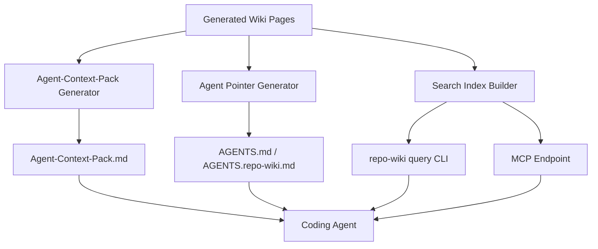
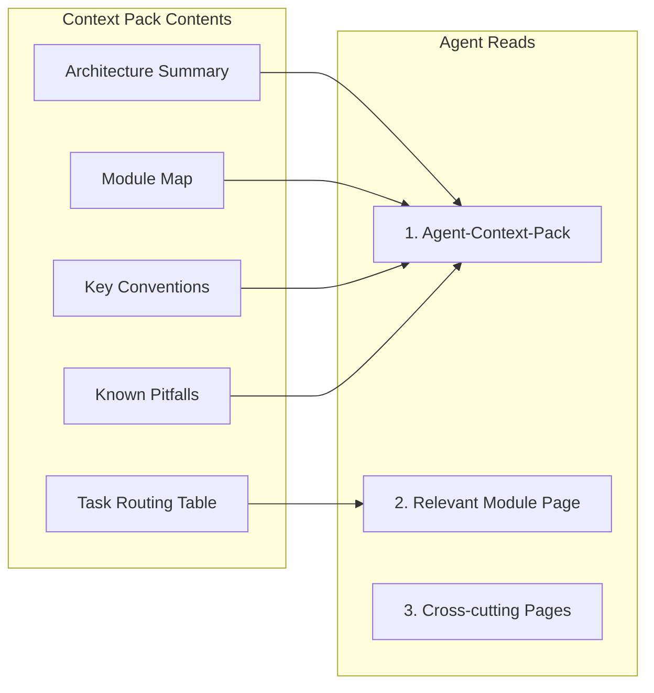
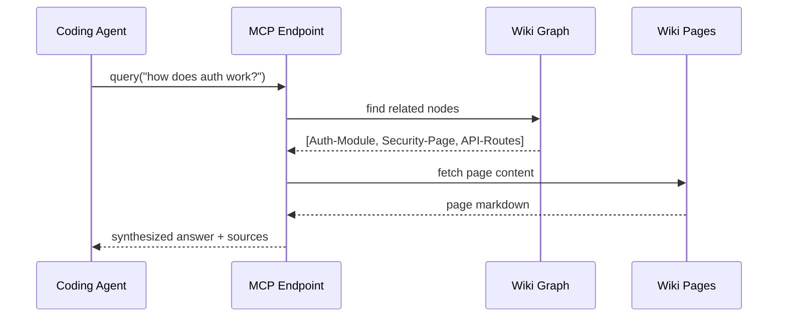

# Epic: Agent Integration

## Summary

Make the generated wiki maximally useful for coding agents by producing optimized context packs, generating agent pointer files, and optionally exposing a query interface or MCP endpoint.

## Architecture

## Key Deliverables

- Generate `AGENTS.md` or `AGENTS.repo-wiki.md` pointers in target repos
- Generate `Agent-Context-Pack.md` optimized for coding agent consumption
- Context pack includes: architecture summary, module map, key conventions, known pitfalls
- Optional `repo-wiki query` command for targeted wiki lookups
- Optional MCP (Model Context Protocol) endpoint for agent tool use
- Optional local search index over generated wiki

## Success Criteria

- A coding agent reading Agent-Context-Pack.md gains actionable project understanding
- Agent pointer files direct agents to the wiki without manual configuration
- Query interface (if implemented) returns relevant wiki content for natural-language questions

## Dependencies

- Upstream: LLM compiler (quality wiki content), production scanner (rich source data)
- Downstream: None (terminal epic)

## Open Questions

- What format should Agent-Context-Pack.md use for maximum agent utility?
- Should the MCP endpoint serve raw wiki pages or synthesized answers?
- How to keep agent pointers in sync with wiki structure changes?
- Should query use embedding search, keyword search, or both?
