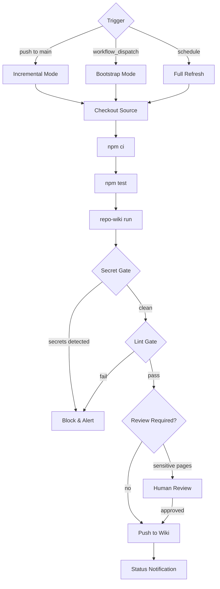
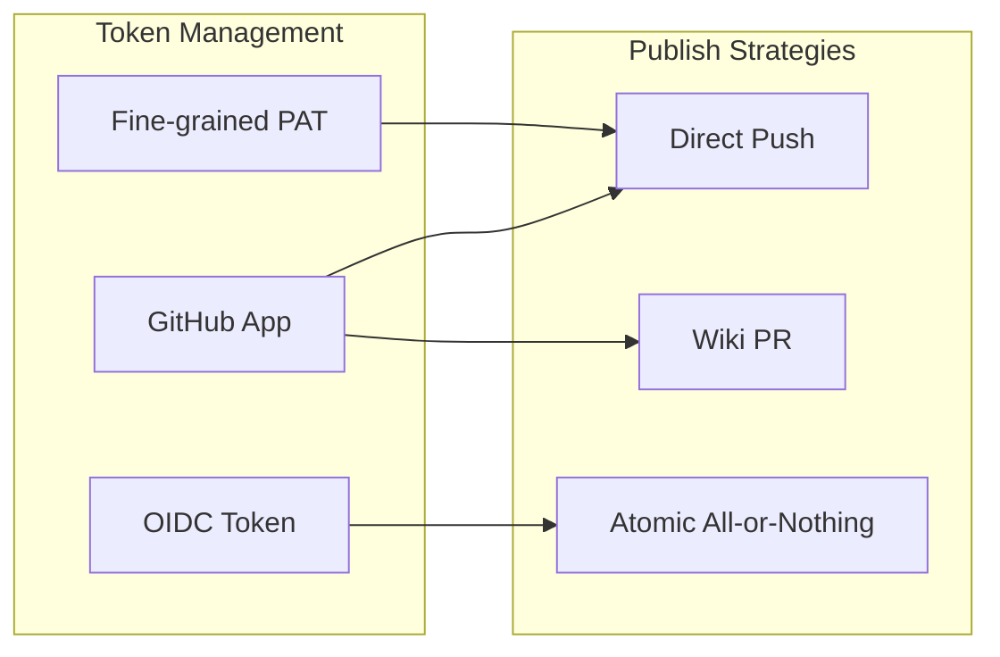
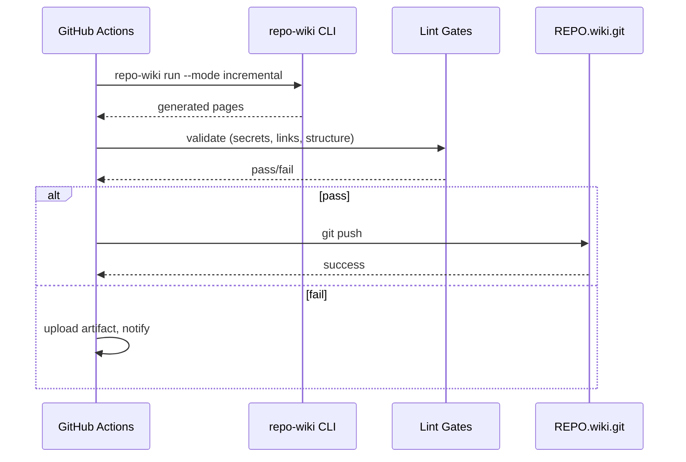

# Epic: CI & Publishing

## Summary

Production-ready GitHub Actions workflows and publishing infrastructure that safely pushes generated wiki content, enforces security policies, and supports both bootstrap and incremental post-merge flows.

## Architecture

## Key Deliverables

- GitHub Actions workflow for wiki generation on push to main
- GitHub Actions workflow for manual/dispatch wiki bootstrap
- Token management (GitHub App or fine-grained PAT)
- Security gate: block publish on secret-like content detection
- Optional human review gate for sensitive pages (auth, billing, deployment, security)
- PR-based wiki publishing option (wiki PR instead of direct push)
- Artifact retention for unpublished wiki builds
- Status checks and notifications

## Success Criteria

- Wiki auto-updates on merge to main with no manual intervention
- Secrets never reach published wiki pages
- Untrusted PRs cannot trigger wiki publication
- Failed lint gates block publication
- Clear audit trail of what was published and when

## Dependencies

- Upstream: Incremental mode (post-merge updates), all lint gates
- Downstream: None (terminal epic)

## Open Questions

- Should the publisher open a PR against the wiki repo instead of pushing directly?
- How to handle wiki publication failures (retry, alert, rollback)?
- Should wiki publication be atomic (all pages or nothing) or incremental?
- How to manage wiki git history (squash or preserve per-page commits)?
