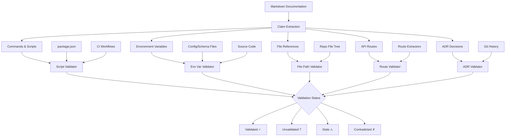
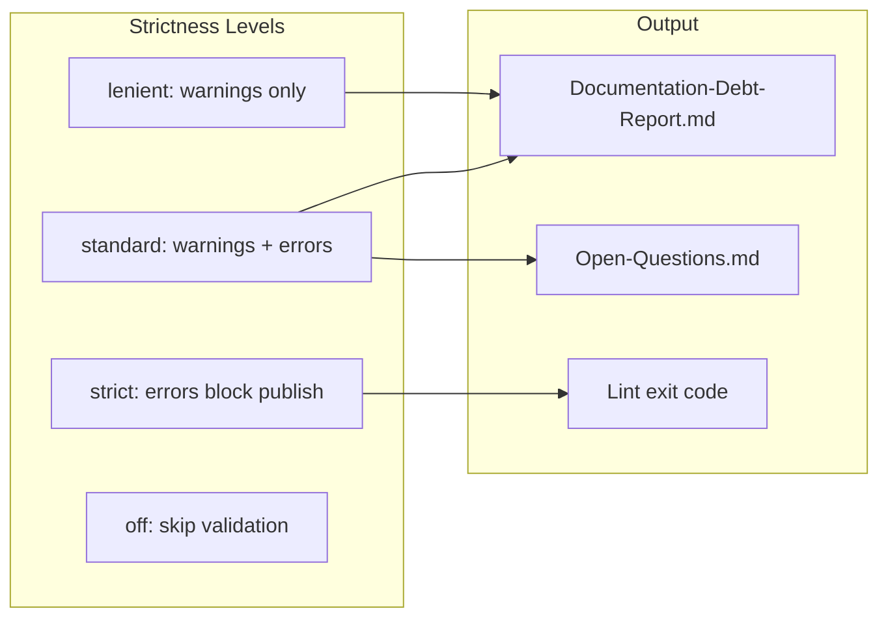

# Epic: Documentation Validation

## Summary

Implement deep documentation validators that go beyond the current scaffold's conservative checks, enabling reliable detection of stale, contradicted, and unvalidated documentation claims.

## Architecture

## Key Deliverables

- Package script validation against `package.json`
- Command validation against Makefiles, task runners, and CI workflows
- Route validation against framework-specific route extractors
- Environment variable validation against config/schema/code usage
- File reference validation against the repository tree
- ADR recency and supersession detection
- Configurable validation strictness levels
- Rich Documentation-Debt-Report generation with actionable items

## Success Criteria

- Commands mentioned in docs are verified against actual scripts/CI
- Environment variables in docs are cross-referenced with code usage
- File paths in docs are validated against the repo tree
- ADRs are flagged when superseded or older than threshold
- False positive rate is low enough that teams don't disable validation

## Dependencies

- Upstream: Production scanner (source cards with scripts, routes, env vars)
- Downstream: LLM compiler (validated doc cards influence wiki content)

## Open Questions

- How to handle commands that are valid but not in package.json (e.g., global CLIs)?
- Should validation run against CI workflow definitions or actual CI runs?
- How to detect ADR supersession without explicit metadata?
- What false-positive rate is acceptable before teams lose trust?
