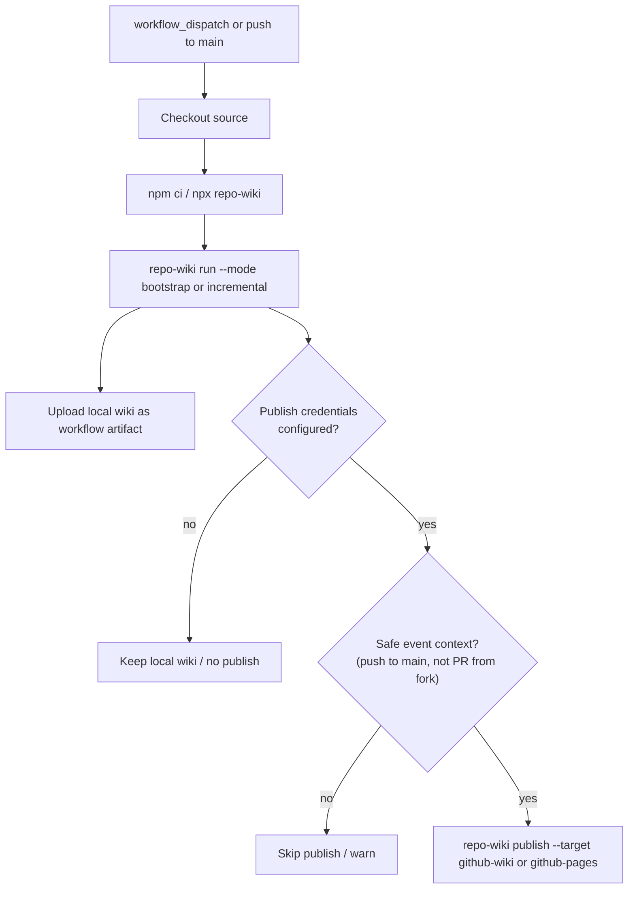
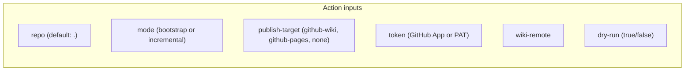
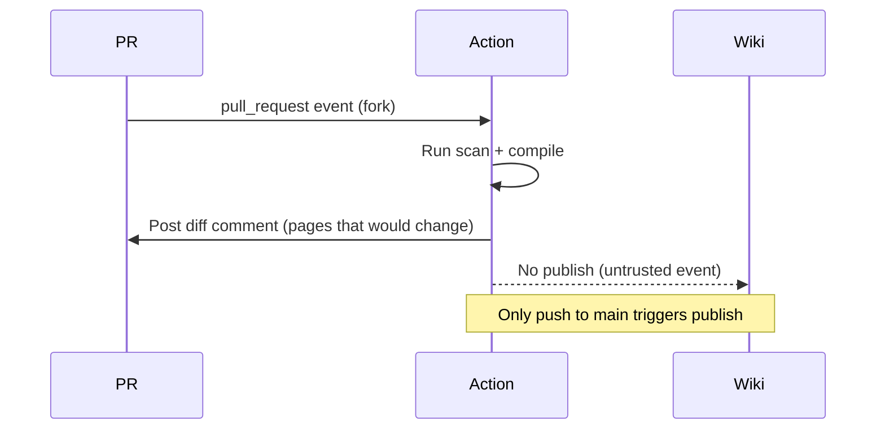

# Epic: GitHub Action

## Summary

Provide a reusable GitHub Action that wraps the `repo-wiki` CLI for CI/CD workflows. The action should work without publish credentials (producing local wiki artifacts only), and require explicit credentials and a safe event context for any publish step. Support PR-oriented diff output as a review artifact and enforce the security model that prevents publishing from untrusted pull requests.

## Architecture







## Key Deliverables

- Reusable composite or JavaScript GitHub Action published to the Marketplace or usable via `uses: owner/repo-wiki/.github/actions/wiki@main`.
- Inputs: `repo`, `mode`, `publish-target`, `token`, `wiki-remote`, `pages-branch`, `pages-path`, `dry-run`.
- Outputs: `wiki-path` (local artifact path), `pages-changed` (count), `lint-errors` (count).
- Upload local wiki directory as a workflow artifact regardless of publish step.
- PR diff comment showing wiki pages that would change (uses `repo-wiki diff`).
- Publish step runs only on safe event contexts (push to main/default branch, not PRs from forks).
- Token never exposed in logs or generated wiki pages.
- Documentation: minimal workflow snippet for adopt-in-5-minutes experience.

## Success Criteria

- A consumer repo can add `repo-wiki` with a workflow snippet under 20 lines.
- The action works without publish credentials (dry-run / artifact only).
- Publishing requires explicit credentials and safe event context (not a fork PR).
- PR diff comment posts the list of pages that would change without publishing.
- Action inputs are validated before any state-changing step.

## Acceptance Criteria (from PLAN.md)

- A consumer repo can add repo-wiki with a short workflow snippet.
- The action works without publish credentials.
- Publishing requires explicit credentials and safe event context.

## Example Workflow

```yaml
name: Wiki
on:
  push:
    branches: [main]
  pull_request:

jobs:
  wiki:
    runs-on: ubuntu-latest
    permissions:
      contents: write
      pull-requests: write
    steps:
      - uses: actions/checkout@v4
      - uses: owner/repo-wiki/.github/actions/wiki@main
        with:
          mode: bootstrap
          publish-target: ${{ github.event_name == 'push' && 'github-wiki' || 'none' }}
          token: ${{ secrets.GITHUB_TOKEN }}
```

## Security Policy

- Do not publish from `pull_request` events originating from forks.
- Use a dedicated GitHub App token or fine-grained PAT for wiki or Pages push.
- Never expose tokens in generated wiki pages, scan artifacts, logs, or publish summaries.
- Fail publication on secret-like content (inherits trust-hardening policy).

## Dependencies

- Upstream: all CLI commands, trust hardening, publisher.
- Downstream: adoption and developer experience (this is the primary adoption surface).

## Open Questions

- Should the action be a composite action (shell steps) or a JavaScript action?
- Should PR diff comments be posted as new comments or as a check annotation?
- Should `repo-wiki diff` be a separate command or an option on `run`?
