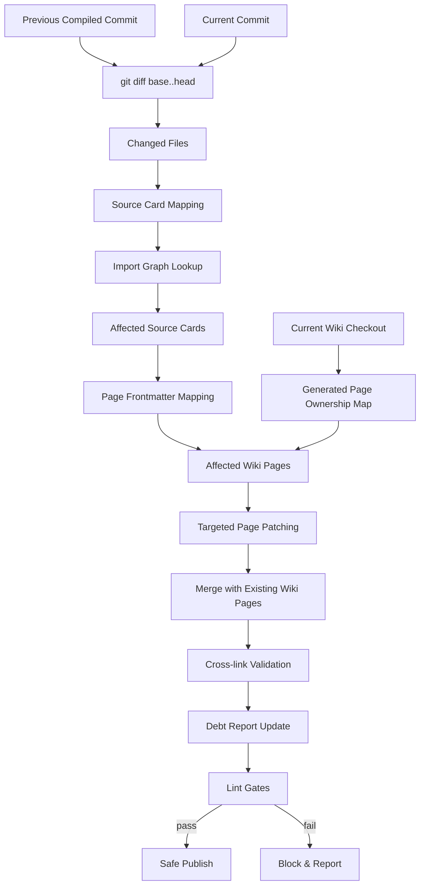
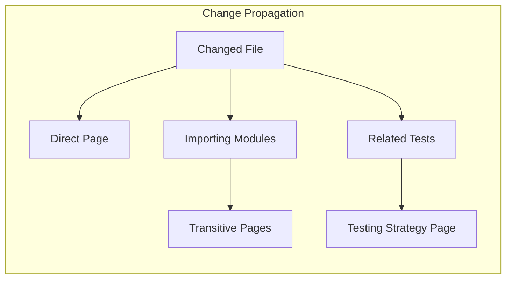
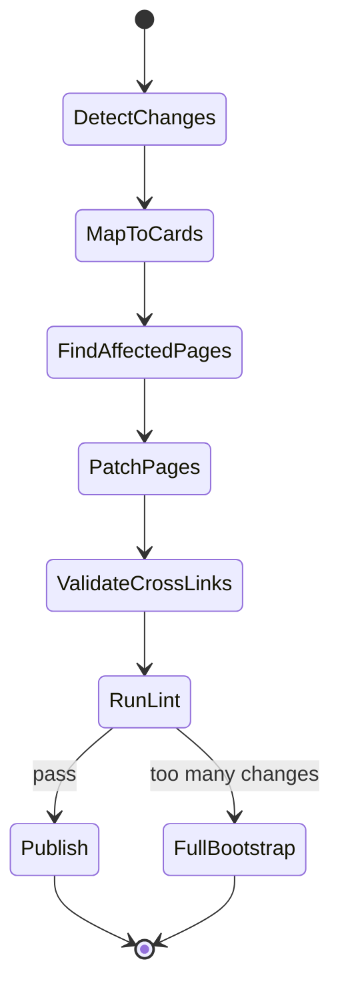

# Epic: Incremental Mode

## Summary

Implement diff-based wiki maintenance that scans only changed files, identifies affected wiki pages, reconciles those pages with the current remote wiki state, and produces targeted page patches rather than full regeneration.

## Architecture

## Key Deliverables

- Store previous compiled commit reference
- Git diff computation (base..head changed files)
- Changed-file to source-card mapping
- Affected-page identification via import graph and page frontmatter
- Targeted page patching (update only affected sections)
- Existing wiki checkout and page ownership manifest loading
- Safe reconciliation of mixed human/generated pages during incremental runs
- Safe deletion of obsolete generated pages that are no longer planned
- Rename handling for generated pages with stable page identities
- Re-run cross-link validation after patching
- Re-run documentation debt report for affected docs
- Safe publish after lint gates pass

## Success Criteria

- Incremental run touches only pages affected by the diff
- Cross-links remain valid after partial updates
- Incremental output matches what a full bootstrap would produce for affected pages
- Untouched human-owned wiki pages remain byte-stable across incremental runs
- Obsolete generated pages are removed without deleting human-owned content
- Runtime scales with change size, not repository size

## Dependencies

- Upstream: Production scanner (import graph, affected-page graph), LLM compiler (page patching)
- Downstream: CI publishing (post-merge incremental runs)

## Open Questions

- How to handle renames and moved files?
- What triggers a full re-bootstrap vs incremental patch?
- Should incremental mode track page staleness independently?
- How to handle transitive dependency changes (A imports B, B changes)?
- Where should generated-page ownership state live: frontmatter, sidecar manifest, or graph store?
- When should reconcile mode escalate to manual review instead of auto-merging?
