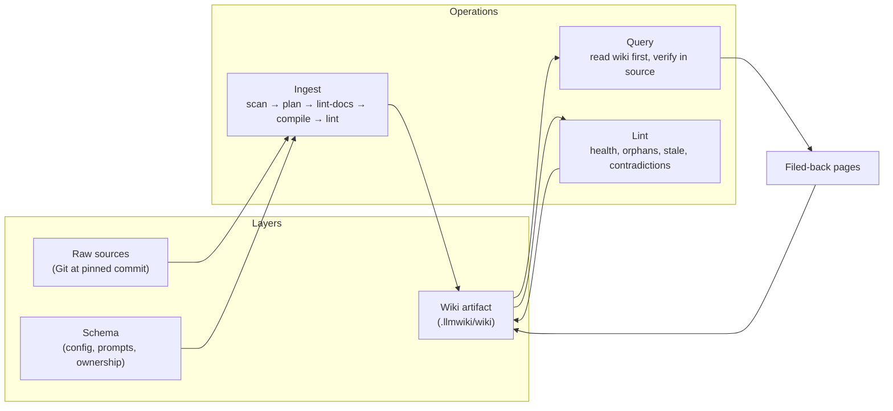
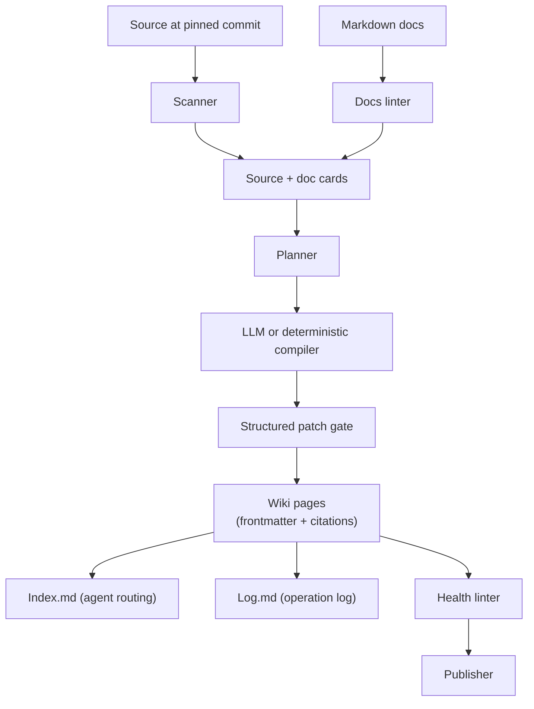

# Epic: Karpathy LLM Wiki Alignment

## Summary

Make `repo-wiki` a faithful software-repository implementation of Karpathy's LLM Wiki pattern: compile repository knowledge once into a durable, source-grounded wiki artifact that compounds over time, treat the LLM as a wiki maintainer rather than a one-shot summarizer, and validate generated content before it can influence the wiki or be published.

## Operating Model

## Architecture

## Key Deliverables

- `Index.md` and `Log.md` as first-class, parseable operating surfaces.
- Deterministic log entries for every ingest, compile, lint, query, and publish operation appended to `Log.md`.
- Wiki page frontmatter with `kind`, `source_commit`, `compiled_at`, `source_paths`, `page_state`, and confidence metadata.
- Source authority model enforced: code at pinned commit > tests > CI/config > docs > issues.
- LLM output treated as an untrusted patch that must pass lint and citation gates before writing.
- Query-and-file-back workflow that allows durable answers to become new wiki pages with provenance.
- Published wiki as the flagship demo for this repository.

## Success Criteria

- Agents can navigate the wiki without source-file inspection for common questions.
- `grep '^## \[' .llmwiki/wiki/Log.md | tail -5` returns the last five operations with type and commit.
- Re-running compilation with the same inputs does not produce noisy index or log churn.
- Every generated page cites source paths for material claims.
- The published wiki for this repository is publicly inspectable.

## Acceptance Criteria (from PLAN.md)

- Agents can read `Index.md` first to route to relevant pages.
- Generated pages include frontmatter suitable for Obsidian, Dataview, GitHub Wiki navigation, and future search.
- Graph metadata powers both navigation and incremental maintenance.
- LLM output treated as untrusted until it passes structured patch validation and lint.
- This repository's own generated wiki is published as the canonical demo.

## Dependencies

- Upstream: deterministic compiler, wiki linter, publisher.
- Downstream: all epics — this is the product framing that shapes scope decisions across every other plan.

## Open Questions

- How should confidence metadata be represented in local frontmatter while published pages hide or strip it?
- Which query outputs should be eligible for automatic file-back vs requiring human confirmation?
- How should private path names or environment-variable names be masked in published wikis?
