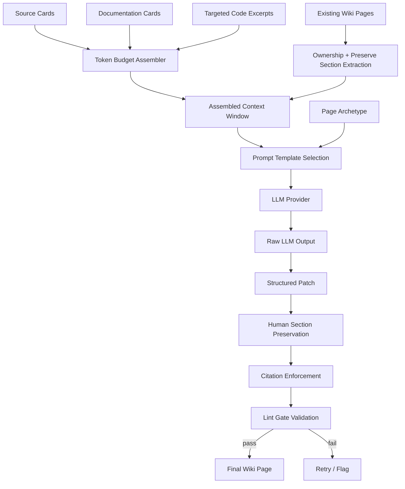
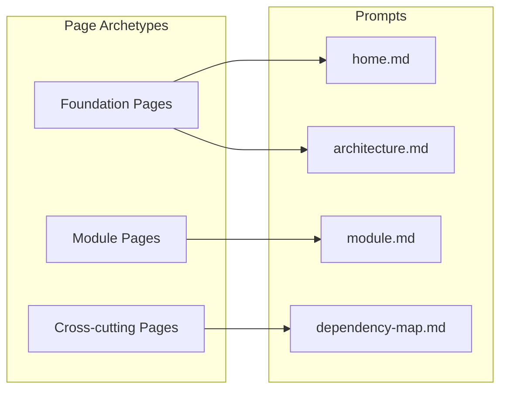
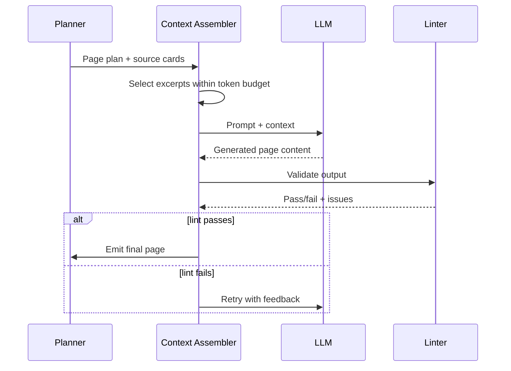

# Epic: LLM Compiler

## Summary

Replace the deterministic placeholder summaries in the wiki compiler with LLM-powered synthesis that produces human-quality wiki pages grounded in source cards, documentation cards, targeted code excerpts, and the current state of an existing wiki when back-filling or reconciling.

## Architecture

## Key Deliverables

- LLM synthesis pipeline for each wiki page type (foundation, module, cross-cutting)
- Source card and code excerpt context assembly (token-budget aware)
- Existing wiki page ingestion before regeneration
- Page classification: generated, human-owned, mixed, unmanaged
- Structured patch output format for wiki pages
- Source citation enforcement (every material claim cites a path)
- Contradiction and confidence metadata in generated pages
- Human-maintained section preservation during regeneration
- Stable page identity and ownership metadata in generated frontmatter
- Merge strategy for back-fill and reconcile mode, not just fresh bootstrap generation
- Prompt templates for each page archetype

## Success Criteria

- Generated wiki pages are useful without manual editing
- Every factual claim cites source paths
- Human-maintained sections survive regeneration unchanged
- Existing mixed pages can be regenerated without losing preserved regions
- Generated pages carry enough metadata to support future reconciliation and safe deletion
- LLM output passes lint gates before acceptance
- Token budget stays within model context limits per page

## Dependencies

- Upstream: Production scanner (rich source cards), doc-validation (validated doc cards)
- Downstream: Incremental mode (page patching), agent-integration (Agent-Context-Pack quality)

## Open Questions

- Which LLM provider(s) to support? (OpenAI, Anthropic, local models)
- How much raw code should the compiler read per page?
- Should compilation be parallelized across pages?
- How to handle hallucination detection beyond lint gates?
- Cost/latency budget for full bootstrap vs incremental compile?
- What is the minimum preservation contract for mixed human/generated pages?
- Which page sections should be preserved structurally versus semantically merged?
