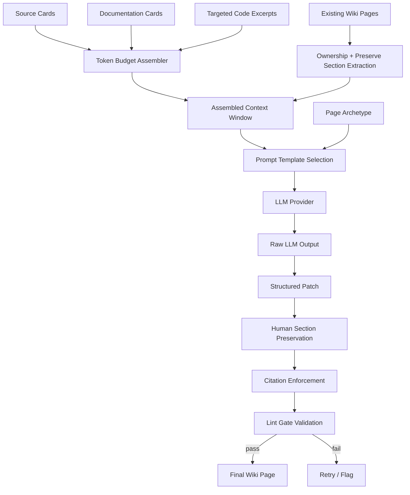
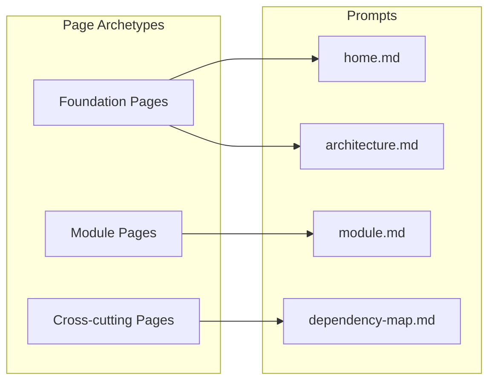
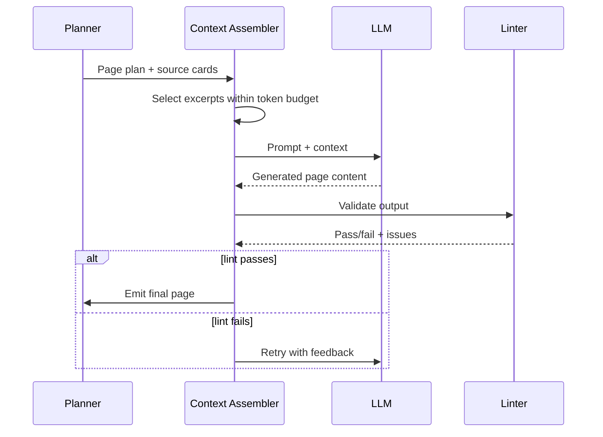

# Epic: LLM Compiler

## Summary

Replace the deterministic placeholder summaries in the wiki compiler with LLM-powered synthesis that produces human-quality wiki pages grounded in source cards, documentation cards, targeted code excerpts, and the current state of an existing wiki when back-filling or reconciling.

## Architecture







## Key Deliverables

- LLM synthesis pipeline for each wiki page type (foundation, module, cross-cutting)
- Incremental LLM enrichment that runs only for affected wiki pages selected by diff, bounded hierarchy propagation, and semantic propagation rules
- Source card and code excerpt context assembly (token-budget aware)
- Existing wiki page ingestion before regeneration
- Page classification: generated, human-owned, mixed, unmanaged
- Structured patch output format for wiki pages
- Source citation enforcement (every material claim cites a path)
- Contradiction and confidence metadata in generated pages
- Human-maintained section preservation during regeneration
- Stable page identity and ownership metadata in generated frontmatter
- Merge strategy for back-fill and reconcile mode, not just fresh bootstrap generation
- Prompt templates for each page archetype

## Provider configuration contract

The first production LLM boundary should be provider-agnostic and compatible with OpenAI-style chat completions so GitHub Actions and local runs can use OpenAI, compatible hosted providers, or local gateways without changing compiler code.

Minimum `.llmwiki/config.json` shape:

```jsonc
{
  "compiler": {
    "mode": "deterministic", // deterministic | llm
    "llm": {
      "provider": "openai-compatible",
      "base_url": "https://api.openai.com/v1",
      "model": "gpt-4.1-mini",
      "api_key_env": "LLMWIKI_LLM_API_KEY",
      "system_prompt": "You compile source-grounded GitHub Wiki pages.",
      "temperature": 0.1,
      "max_output_tokens": 4000,
      "timeout_ms": 60000,
      "retries": 2
    }
  }
}
```

Environment variables override config values for CI and secrets:

| Environment variable | Purpose |
|---|---|
| `LLMWIKI_COMPILER_MODE` | Select `deterministic` or `llm` mode. |
| `LLMWIKI_LLM_BASE_URL` | Override provider API base URL. |
| `LLMWIKI_LLM_MODEL` | Override model name. |
| `LLMWIKI_LLM_API_KEY` | Provider API key; never written to artifacts or logs. |
| `LLMWIKI_LLM_SYSTEM_PROMPT` | Inline system prompt override. |
| `LLMWIKI_LLM_SYSTEM_PROMPT_FILE` | Path to a system prompt file; useful for repo-maintained prompts. |
| `LLMWIKI_LLM_TEMPERATURE` | Sampling temperature override. |
| `LLMWIKI_LLM_MAX_OUTPUT_TOKENS` | Output token budget override. |

Configuration precedence should be explicit and deterministic: CLI flags, when added, override environment variables; environment variables override `.llmwiki/config.json`; config overrides safe defaults. The API key must be read only from the configured environment variable and must never be persisted in scan artifacts, generated wiki pages, prompt-debug artifacts, or normal logs.

GitHub Actions can enable LLM compilation by setting repository variables for non-secret values and a secret for the API key:

```yaml
env:
  LLMWIKI_COMPILER_MODE: llm
  LLMWIKI_LLM_BASE_URL: ${{ vars.LLMWIKI_LLM_BASE_URL }}
  LLMWIKI_LLM_MODEL: ${{ vars.LLMWIKI_LLM_MODEL }}
  LLMWIKI_LLM_API_KEY: ${{ secrets.LLMWIKI_LLM_API_KEY }}
```

Tests must use a deterministic mock provider and must not require network access or API keys.

## Success Criteria

- Generated wiki pages are useful without manual editing
- Every factual claim cites source paths
- Human-maintained sections survive regeneration unchanged
- Existing mixed pages can be regenerated without losing preserved regions
- Generated pages carry enough metadata to support future reconciliation and safe deletion
- LLM output passes lint gates before acceptance
- Untouched enriched pages remain byte-stable during incremental builds and do not incur model calls
- Token budget stays within model context limits per page

## Dependencies

- Upstream: Production scanner (rich source cards), doc-validation (validated doc cards)
- Downstream: Incremental mode (page patching), agent-integration (Agent-Context-Pack quality)

## Open Questions

- Which LLM provider(s) to support? (OpenAI, Anthropic, local models)
- How much raw code should the compiler read per page?
- Should compilation be parallelized across pages?
- How to handle hallucination detection beyond lint gates?
- Cost/latency budget for full bootstrap vs incremental compile?
- What exact propagation thresholds should trigger re-enrichment of parent aggregate pages versus preserving existing content?
- What is the minimum preservation contract for mixed human/generated pages?
- Which page sections should be preserved structurally versus semantically merged?
