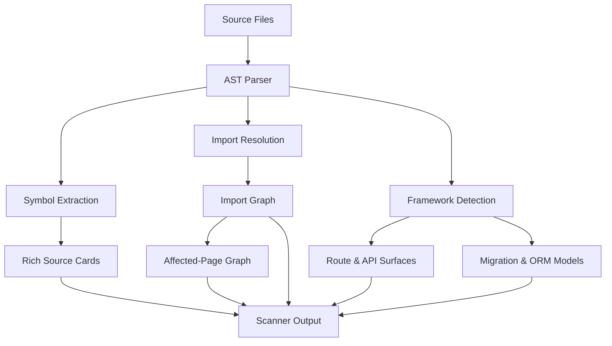
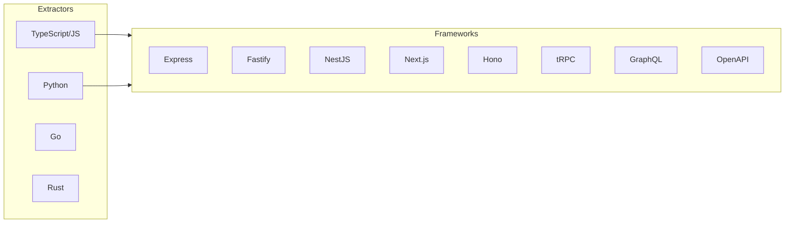
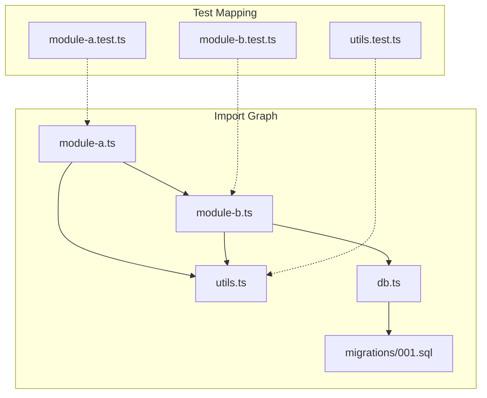

# Epic: Production Scanner

## Summary

Replace the current bootstrap scanner with a production-grade source analysis engine that performs AST-level extraction, detects framework-specific surfaces, builds import/dependency graphs, and maps tests to modules.

## Architecture

## Key Deliverables

- TypeScript/JavaScript AST extraction (exports, classes, functions, types)
- Framework detection: Express, Fastify, NestJS, Next.js, Hono, Koa, tRPC, GraphQL, OpenAPI
- Route and API surface extraction
- Database migration and ORM model detection
- Import graph construction
- Test-to-source mapping
- Package script parsing
- Affected-page graph for incremental mode

## Success Criteria

- Scanner produces rich source cards with symbol-level detail for supported languages
- Framework-specific routes, middleware, and API surfaces are captured
- Import graph enables transitive dependency reasoning
- Test coverage mapping connects test files to the modules they exercise

## Dependencies

- Upstream: Current scaffold scanner (Milestone 1)
- Downstream: Incremental mode (needs affected-page graph), LLM compiler (needs rich source cards)

## Open Questions

- Which AST parser(s) to use? (ts-morph, @swc/core, tree-sitter)
- How to handle monorepo workspace boundaries?
- Should Python/Go/Rust extractors be included in this epic or deferred?
