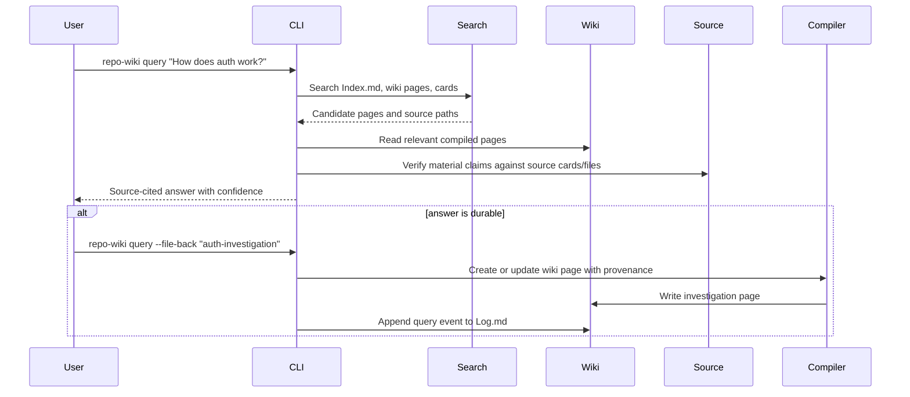
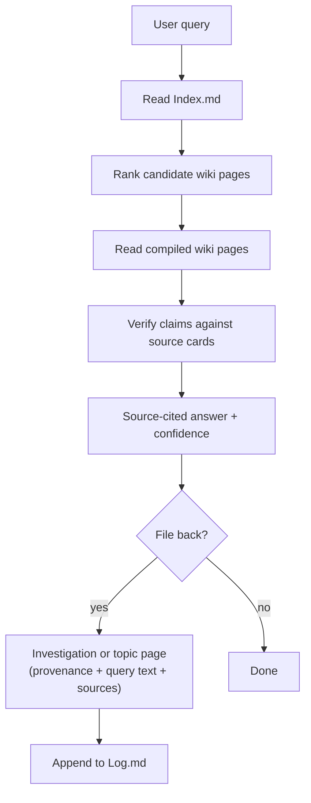

# Epic: Query and File-Back Workflow

## Summary

Implement `repo-wiki query` and `repo-wiki search` as source-cited, wiki-first answer surfaces that treat the generated wiki as the first navigation layer before drilling into source cards and files for verification. Allow durable query answers to be filed back into the wiki as investigation or topic pages with full provenance, extending the Karpathy LLM Wiki pattern from compile-time knowledge capture to runtime knowledge compounding.

## Architecture





## Shipped command slice

- `repo-wiki search <query>` — local ranked search over wiki pages.
- `repo-wiki query <question>` — offline extractive answer assembly over ranked wiki pages plus graph provenance evidence.
- `repo-wiki path <from> <to>` — deterministic shortest-path traversal over `.llmwiki/graph.json`.
- `repo-wiki explain <node-or-page>` — focused local explanation tied to wiki page summaries and graph/source evidence.
- All four commands support `--json` for machine-readable reuse.

## Deferred file-back slice

- `--file-back` flag on `query` to create or update a wiki page from a durable answer.
- Filed-back pages include provenance (query text, answering commit, source paths, page state).
- Query and file-back events appended to `Log.md` in the standard parseable format.
- Optional hosted wording layered behind the same evidence path.
- Mock/deterministic mode for tests (no hosted LLM required).
- Query answers never treat stale or contradicted docs as authoritative.

## Success Criteria

- `repo-wiki search "query"` returns ranked wiki pages and evidence paths without external services.
- `repo-wiki query`, `path`, and `explain` work without external services and expose JSON output.
- Query and explain answers cite source paths for material claims when graph/wiki provenance is available.
- Filed-back pages include provenance, query text, source paths, and page state in frontmatter.
- The feature works in deterministic/mock mode for tests.
- Query and file-back events appear in `Log.md` with the standard timestamp and operation type.

## Acceptance Criteria (from PLAN.md)

- Query answers cite source paths for material claims.
- Filed-back pages include provenance, query text, source paths, and page state.
- The feature works in deterministic/mock mode for tests.
- `repo-wiki search "query"` returns ranked wiki pages and evidence paths.
- Search can run without external services.
- Optional provider integrations do not change core scan/compile behavior.

## Filed-Back Page Frontmatter

```yaml
kind: investigation
query: "How does auth work?"
answered_at: "2026-05-10T14:30:00Z"
source_commit: abc1234
source_paths:
  - src/auth.ts
  - src/middleware/session.ts
page_state: filed-back
confidence: medium
```

## Dependencies

- Upstream: wiki compiler, scanner, context assembler, LLM provider boundary.
- Downstream: local search index (needed for scale), Log.md as parseable surface.

## Open Questions

- Should the first search backend be a built-in simple index, qmd integration, or MCP-first?
- Should filed-back pages be proposed for review or written immediately?
- How should confidence metadata propagate when a filed-back page is later updated by a new query?
