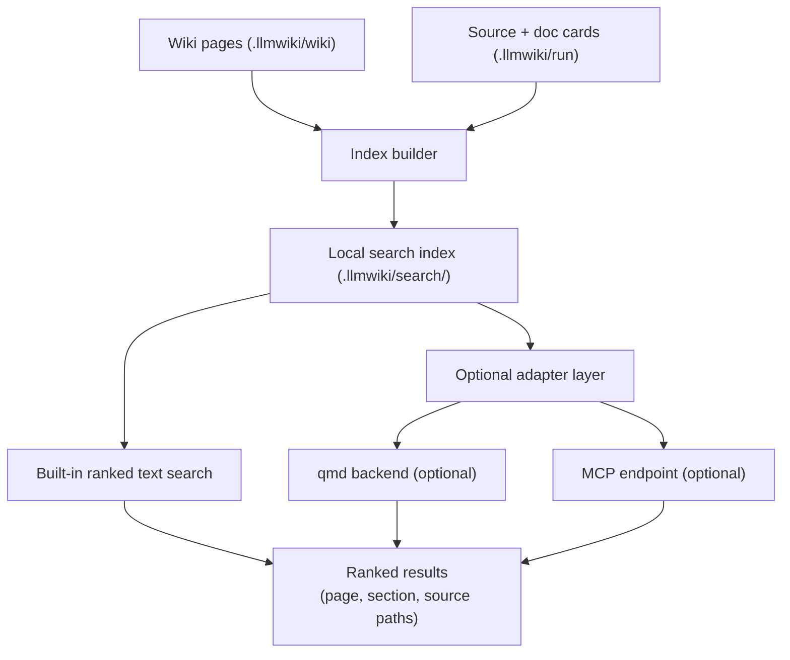
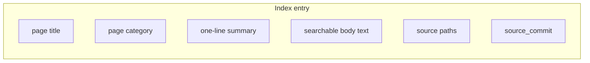

# Epic: Search Index

## Summary

Ship the first built-in local search path over compiled wiki pages so that `repo-wiki search` works fully offline today. Preserve enough metadata for later query/runtime routing, but defer external adapters until after the built-in page-first contract is stable.

## Shipped built-in slice

The shipped slice is intentionally bounded:

- deterministic index artifact: `.llmwiki/search/index.json`
- inputs: compiled wiki pages plus local metadata already present in page frontmatter and internal wiki links
- ranking: deterministic page-first lexical scoring with evidence-oriented results
- CLI: `repo-wiki search <query>` with text output for humans and `--json` for tools/agents
- rebuild path: compile refreshes the search artifact, and `search` can rebuild it on demand from local wiki pages

### Result contract

Each result includes:

- page title and page path
- page `kind` / `page_state` when available
- summary/snippet for quick routing
- `source_paths` when available
- lightweight graph context from inbound/outbound internal wiki links

## Deferred after the shipped slice

These remain explicitly deferred:

- source-card/documentation-card indexing beyond what is already promoted into compiled wiki pages
- section-level ranking as a primary retrieval contract
- qmd, MCP, embedding, or hosted adapters
- answer synthesis / `query` / file-back workflows

## Architecture





## Key Deliverables

- Local index builder that runs after `compile` and indexes compiled wiki pages.
- Built-in ranked text search with no external dependencies.
- Index stored under `.llmwiki/search/` alongside run artifacts.
- `repo-wiki search <query>` CLI command that returns ranked results with page title, category/kind, snippet, graph context, and source paths.
- Deterministic full rebuilds that are compatible with later incremental indexing.
- Index entries include page metadata: `kind`, `source_commit`, `source_paths`, `page_state`, and internal-link adjacency.

## Success Criteria

- `repo-wiki search "query"` returns ranked results without network access.
- Search results include source paths so callers can drill into evidence.
- The built-in shipped contract is stable enough for later query/runtime work to consume directly.
- Index rebuild is fast enough to run after every compile in a typical repository.

## Acceptance Criteria (from PLAN.md)

- `repo-wiki search "query"` returns ranked wiki pages and evidence paths.
- Search can run without external services.
- Optional provider integrations do not change core scan/compile behavior.

## Index Format

```json
{
  "version": 1,
  "wikiDir": "/repo/.llmwiki/wiki",
  "sourceCommits": ["abc1234"],
  "entries": [
    {
      "pagePath": "Architecture.md",
      "title": "Architecture",
      "kind": "foundation",
      "pageState": "generated",
      "summary": "High-level system design and data flow.",
      "sourcePaths": ["src/compiler.ts", "src/scanner.ts"],
      "outboundLinks": ["Module-scanner-ts.md"],
      "inboundLinks": [],
      "searchText": "architecture compiler scanner planner wiki"
    }
  ]
}
```

## Dependencies

- Upstream: wiki compiler (produces pages to index), scanner (provides source card metadata).
- Downstream: query and file-back (uses search index for candidate routing).

## Open Questions

- When incremental mode becomes diff-minimal, what is the narrowest safe page-level reindex contract?
- Should section-level ranking be added on top of the page-first contract, or remain a downstream concern for `query`?
- If optional adapters arrive later, should qmd or MCP be the first external backend to implement?
