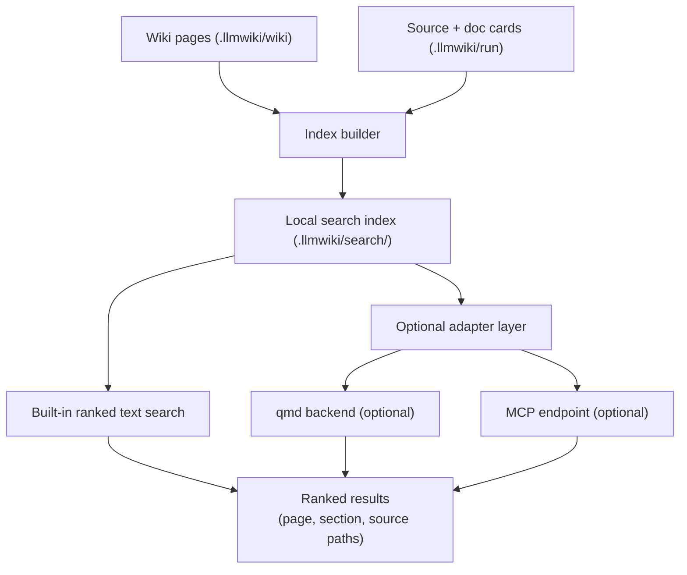

# Epic: Search Index

## Summary

Build a local search index over generated wiki pages, source cards, and documentation cards so that `repo-wiki search` and `repo-wiki query` can route questions efficiently without external services. Design the index layer as an adapter so that optional qmd, MCP, or other backends can be swapped in later without changing core scan and compile behavior.

## Architecture




## Key Deliverables

- Local index builder that runs after `compile` and indexes wiki pages and cards.
- Built-in ranked text search (TF-IDF or equivalent) with no external dependencies.
- Adapter interface for optional qmd and MCP backends.
- Index stored under `.llmwiki/search/` alongside run artifacts.
- `repo-wiki search <query>` CLI command that returns ranked results with page title, category, and source paths.
- Index rebuilt incrementally: only changed pages are re-indexed when incremental mode is used.
- Index entries include page metadata: `kind`, `source_commit`, `source_paths`, `page_state`.

## Success Criteria

- `repo-wiki search "query"` returns ranked results without network access.
- Search results include source paths so callers can drill into evidence.
- Optional adapters plug in without touching scan or compile logic.
- Index rebuild is fast enough to run after every compile in a typical repository.

## Acceptance Criteria (from PLAN.md)

- `repo-wiki search "query"` returns ranked wiki pages and evidence paths.
- Search can run without external services.
- Optional provider integrations do not change core scan/compile behavior.

## Index Format

```json
{
  "version": 1,
  "built_at": "2026-05-10T14:30:00Z",
  "source_commit": "abc1234",
  "entries": [
    {
      "page": "Architecture",
      "category": "foundation",
      "summary": "High-level system design and data flow.",
      "source_paths": ["src/compiler.ts", "src/scanner.ts"],
      "tokens": ["compiler", "scanner", "planner", "wiki"]
    }
  ]
}
```

## Dependencies

- Upstream: wiki compiler (produces pages to index), scanner (provides source card metadata).
- Downstream: query and file-back (uses search index for candidate routing).

## Open Questions

- Should the built-in index use TF-IDF, BM25, or a simpler token match?
- What is the right threshold for triggering an external adapter rather than the built-in search?
- Should qmd or MCP be the first optional adapter to implement?
