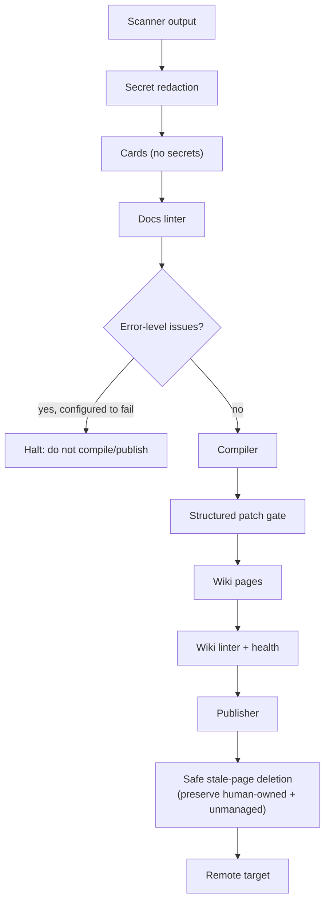

# Epic: Trust Hardening

## Summary

Harden every surface where generated, scanned, or published content could leak secrets, reflect stale source truth, bypass severity policy, or let untrusted LLM patches reach the filesystem or a remote. This epic covers redaction, config schema validation, hash coverage, docs-lint blocking in the publish path, safe stale-page deletion, and publisher safety controls.

## Architecture

## Key Deliverables

- **Docs-lint blocking**: make `repo-wiki run` fail before compile/publish when docs-lint reports error-level issues, controlled by config.
- **Secret redaction**: redact known secret-like patterns from manifests, documentation cards, page contexts, log entries, and generated pages before writing.
- **Config schema validation**: JSON schema for `.llmwiki/config.json` with clear validation errors on startup.
- **Hash coverage**: every source card has a stable content hash or an explicit hash-failure reason recorded.
- **Safe stale-page deletion**: publisher removes generated pages for deleted/renamed sources while preserving unmanaged and human-owned pages; ownership metadata from `page-ownership.ts` gates deletion.
- **Severity policy**: lint severities for all gates are config-driven; no hardcoded unconditional failures except secret-like content.
- **Sanitized remotes**: all remotes and URLs are validated and sanitized before display, logging, or writing.
- **End-to-end fixture**: golden test covering `init → scan → plan → lint-docs → compile → lint → publish --dry-run`.

## Success Criteria

- Error-level docs-lint failures block compile and publish when configured.
- No scan artifact or generated page contains known secret-like test patterns after redaction.
- Publisher does not delete human-owned or unmanaged pages during stale cleanup.
- `.llmwiki/config.json` schema validation surfaces clear errors on first use.
- Every source card in the manifest has a `hash` field or a `hashError` field.

## Acceptance Criteria (from PLAN.md)

- Error-level docs lint failures can block run/publish according to config.
- Scan output respects configured source filtering, including remaining `source.include` and nested-worktree edge cases.
- Every source card has a stable hash or an explicit hash failure reason.
- No scan artifact or generated page contains known secret-like patterns from fixtures.
- Publisher removes stale generated pages without touching unmanaged or human-owned pages.
- `npm test`, `npm run check`, `npm run coverage` all pass.
- End-to-end fixture: `init → scan → plan → lint-docs → compile → lint → publish --dry-run`.

## Severity Defaults

| Gate | Default |
|---|---|
| Docs-lint error-level blocking | configurable (warn by default, fail when `fail_on_error: true`) |
| Secret-like content | error (always blocks) |
| Stale docs | warning |
| Contradicted docs | error |
| Broken relative links | warning |
| Missing source commit | warning |

## Dependencies

- Upstream: docs linter, wiki linter, scanner, publisher.
- Downstream: all epics — trust hardening is a prerequisite for safe LLM mode, incremental maintenance, and any publish to a public remote.

## Open Questions

- Which secret pattern list should be the canonical reference: `src/secret-patterns.ts` or an external policy file?
- Should redaction replace matched text with `[REDACTED]` or remove the containing field entirely?
- Should config schema validation block `repo-wiki run` or only `repo-wiki publish`?
