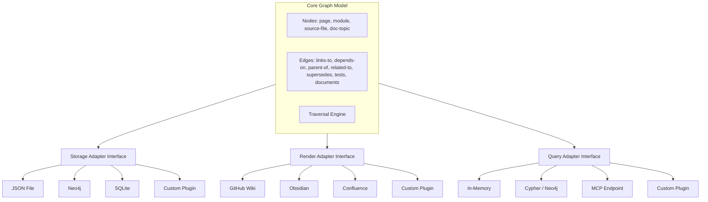
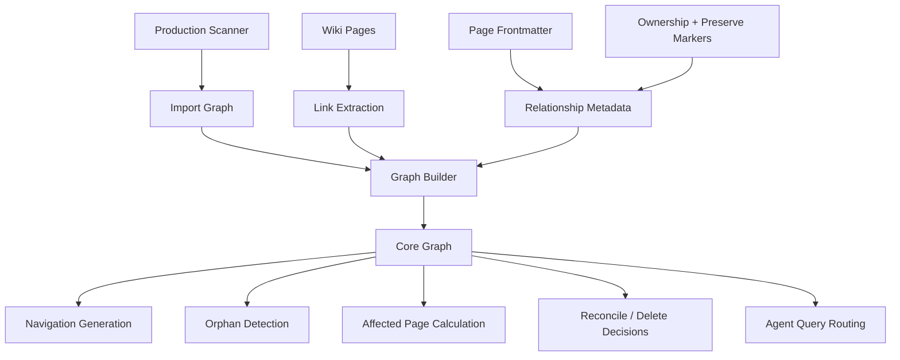
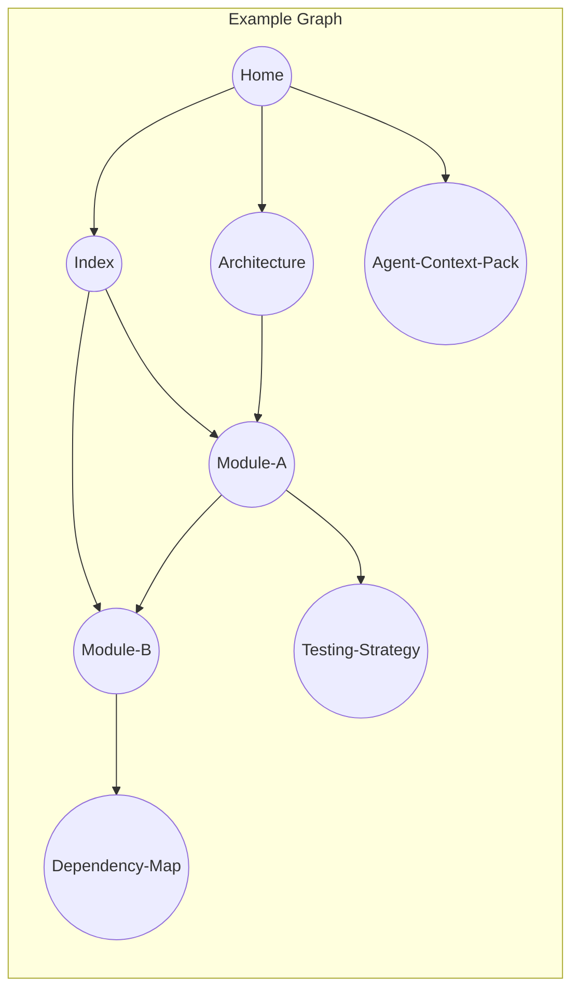

# Epic: Wiki Knowledge Graph

## Summary

Build a plugin-based knowledge graph system that models relationships between wiki pages, source modules, documentation topics, and ownership state. The core graph is backend-agnostic — adapters translate it to different storage and rendering targets (GitHub Wiki, Neo4j, Confluence, Obsidian, flat JSON). The graph powers navigation generation, cross-link validation, agent query routing, affected-page detection for incremental updates, and safe reconciliation with existing wikis.

## Current shipped foundation (Phase 1)

The repository now ships a local deterministic graph foundation at `.llmwiki/graph.json` (`schema_version: 1`) with internal loader/index/traversal helpers.

- Shipped node kinds: `page`, `source`, `documentation`, `module`
- Shipped edge kinds: `wiki_link`, `provenance`, `affects`, `owns`
- Shipped validation gates: malformed IDs, duplicate IDs, dangling endpoints, invalid edge endpoint kinds

This foundation is intentionally local and JSON-based. `.llmwiki/wiki` remains the primary derived artifact.

## Still planned (not shipped in Phase 1)

- backend adapters (Neo4j/SQLite/other)
- plugin discovery and adapter registration
- public runtime query/path/explain/watch transports

## Architecture







## Plugin Contract

Each adapter type implements a minimal interface:

**Storage adapter** — persist and load the graph
- `save(graph)` → serialize graph to backend
- `load()` → deserialize graph from backend
- `patch(delta)` → apply incremental changes

**Render adapter** — produce navigation/linking artifacts for the target platform
- `renderNavigation(graph)` → platform-specific nav (e.g., `_Sidebar.md`, Obsidian MOC, Confluence space tree)
- `renderPageLinks(node)` → "Related pages" section in platform format
- `renderBreadcrumbs(node)` → ancestry path

**Query adapter** — expose graph queries to consumers
- `related(nodeId, depth)` → connected nodes within N hops
- `path(from, to)` → shortest path between nodes
- `affected(changedNodes)` → transitively affected pages
- `orphans()` → nodes with no inbound edges
- `clusters()` → disconnected subgraphs

## Key Deliverables

### Core graph model
- Node types: page, module, source-file, documentation-topic
- Edge types: links-to, depends-on, parent-of, related-to, supersedes, tests, documents, owns, preserves
- Edge metadata: weight, direction, source (explicit link vs. inferred)
- Graph construction from wiki content (extracted links, frontmatter)
- Graph construction from existing wiki ownership metadata and preserved sections
- Graph construction from source relationships (import graph → page graph)
- Orphan and cluster detection
- Generated/human/mixed page classification
- Deterministic serialization format (JSON reference schema)

### Built-in adapters
- **Storage: JSON file** — default, zero-dependency, works offline
- **Storage: Neo4j** — optional, for teams wanting native graph queries at scale
- **Render: GitHub Wiki** — `_Sidebar.md`, `Index.md`, wikilink format
- **Render: Obsidian** — MOC pages, `[[wikilink]]` format, graph metadata in YAML frontmatter
- **Query: In-memory** — default traversal engine for CLI and agent use
- **Query: MCP** — expose graph queries via Model Context Protocol for agent tooling

### Plugin registration
- Config-driven adapter selection in `.llmwiki/config.json`
- Plugin discovery via package exports or local file path
- Adapter validation (schema compliance check on load)

## Success Criteria

- Core graph model is independent of any specific wiki platform or storage backend
- Swapping adapters requires only config changes, no code modifications
- Every wiki page has explicit relationship metadata (inbound/outbound links, module associations)
- Every wiki page can be classified as generated, human-owned, mixed, or unmanaged
- Navigation artifacts are generated from the graph via the render adapter, not hardcoded
- Orphan and under-connected pages are surfaced as lint warnings
- Agents can query "what pages should I read for task X?" via the query adapter
- Incremental mode uses the graph to determine affected pages from a source change
- Reconcile and delete decisions can be derived from graph ownership data instead of filename heuristics
- A new adapter can be added without modifying core graph code

## Configuration Example

```json
{
  "graph": {
    "storage": {
      "adapter": "json-file",
      "options": { "path": ".llmwiki/graph.json" }
    },
    "render": {
      "adapter": "github-wiki",
      "options": { "sidebar": true, "breadcrumbs": false }
    },
    "query": {
      "adapter": "in-memory",
      "options": { "maxDepth": 3 }
    }
  }
}
```

## Dependencies

- Upstream: Production scanner (source-to-module mapping, import graph), LLM compiler (page generation with relationship metadata)
- Downstream: Incremental mode (affected-page detection via query adapter), agent-integration (query routing via MCP adapter), CI publishing (navigation regeneration via render adapter)

## Open Questions

- How to handle bidirectional link consistency (if A links to B, should B always link back)?
- Should the graph support weighted relationships (strong vs. weak connections)?
- How to model cross-repo wiki relationships for monorepo scenarios?
- Should the graph include documentation-to-source edges or only page-to-page?
- What's the minimum adapter interface that covers all current use cases without over-abstracting?
- Should adapters be npm packages, local files, or both?
- How to handle adapter-specific features (e.g., Neo4j Cypher queries) without leaking into the core model?
- Should preserved sections be modeled as subnodes, annotations, or opaque page metadata?
- How should ownership transfer be represented when a human takes over a previously generated page?
