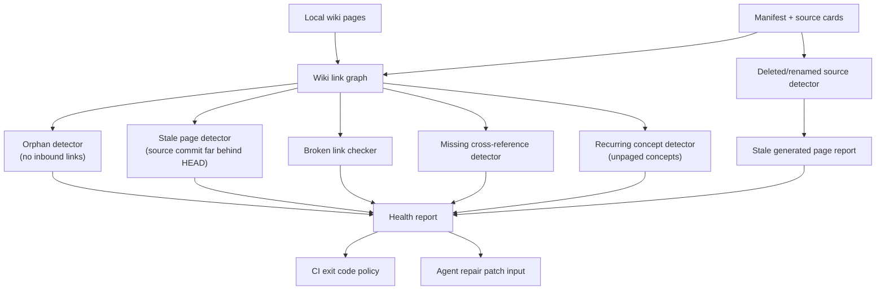

# Epic: Wiki Health Linting

## Summary

Extend the existing `repo-wiki lint` gate with wiki health checks that detect graph-level problems: orphan pages, stale generated pages, missing cross-references, recurring unpaged concepts, broken wiki links, and generated pages whose sources no longer exist. Health findings should be deterministic, config-driven for severity, and consumable by both CI and agents proposing repair patches.

## Architecture

## Key Deliverables

- Orphan-page detection: pages with no inbound wiki links.
- Stale-page detection: generated pages whose `source_commit` is far behind HEAD.
- Broken wiki link checker: links to pages that do not exist.
- Missing cross-reference detector: related module and cross-cutting pages not linked to each other.
- Recurring concept detector: terms mentioned frequently across pages that lack their own dedicated page.
- Deleted/renamed source detector: generated pages for files or modules that no longer exist.
- Config-driven severity: each check independently set to `warning` or `error`.
- Machine-readable JSON output for CI and agent consumption alongside human-readable text.
- Integration with `repo-wiki lint` as the primary gate; optionally surfaced via a future `repo-wiki health` command.

## Success Criteria

- Health findings are deterministic for the same wiki and manifest inputs.
- CI can fail on error-level findings while surfacing warnings without blocking.
- An agent can consume the JSON output and propose targeted repair patches.
- Stale generated pages for deleted sources are identified and eligible for safe deletion by the publisher.

## Acceptance Criteria (from PLAN.md)

- Health findings are deterministic under the same wiki and manifest inputs.
- Config controls warning vs error severity per check.
- Lint output is consumable by CI and by an agent proposing repair patches.

## Severity Defaults

| Check | Default |
|---|---|
| Orphan pages | warning |
| Stale pages (source commit) | warning or error by policy |
| Broken wiki links | warning (should become error for navigation-critical links) |
| Missing cross-references | warning |
| Recurring unpaged concepts | warning |
| Stale generated pages (deleted sources) | error |
| Oversized pages | warning |

## Dependencies

- Upstream: wiki linter, publisher, scanner (for source commit and file-existence data).
- Downstream: incremental mode (uses stale/deleted page data for safe deletes), agent integration (consumes health JSON for repair prompts).

## Open Questions

- How should the health linter distinguish useful hub pages from pages that are merely large?
- Should recurring concept detection run on compiled page content or on source card metadata?
- What threshold (number of mentions, number of pages) triggers a "missing page" suggestion?
